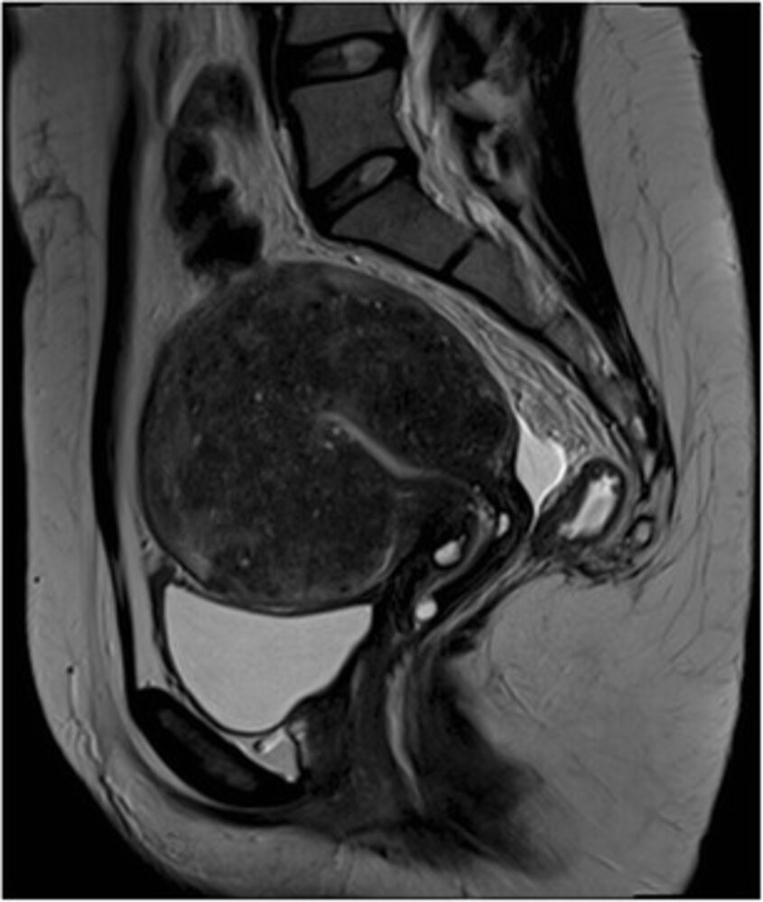

# Adenomyosis

*Categories: Clinical knowledge > Obstetrics/gynecology > Menstrual cycle and associated disorders > Adenomyosis*

[Original Article Link](https://coursology-qbank.com/amboss/article/tE0Xx3)

---

## Summary

Adenomyosis is a chronic disease characterized by growth of <u>endometrial</u> tissue within the <u>myometrium</u> due to nonmalignant <u>hyperplasia</u> of the <u>endometrial</u> basal layer. Adenomyosis affects individuals of reproductive age; the etiology is unknown, but it often coexists with conditions such as <u>endometriosis</u> and <u>uterine fibroids</u>. Symptoms include <u>dysmenorrhea</u>, <u>abnormal uterine bleeding</u>, chronic <u>pelvic pain</u>, and <u>infertility</u>. A globular, uniformly enlarged <u>uterus</u> may be detected on <u>pelvic examination</u>. <u>Transvaginal ultrasound</u> is the preferred initial test to evaluate for adenomyosis. Treatment consists of <u>NSAIDs</u> and <u>hormonal contraception</u> to relieve <u>pain</u> and other symptoms. For patients with refractory symptoms or who are trying to conceive, referral to a specialist for consideration of invasive treatment or medical therapy with <u>GnRH agonists</u> or <u>GnRH antagonists</u> is recommended.

---

## Epidemiology

Peak <u>incidence</u> at 40–50 years

Epidemiological data refers to the US, unless otherwise specified.

---

## Clinical features

* Symptoms: present in two-thirds of patients [[2]](https://coursology-qbank.com/amboss/article/WOdPrJ0)

* <u>Abnormal uterine bleeding</u> (<u>AUB</u>)

* <u>Dysmenorrhea</u>

* Chronic <u>pelvic pain</u> that is aggravated during <u>menses</u>

* <u>Dyspareunia</u>

* <u>Infertility</u> [[1]](https://coursology-qbank.com/amboss/article/dOdorJ0)

* <u>Pelvic examination</u>: soft (boggy), uniformly enlarged, globular <u>uterus</u> that may be tender on palpation [[2]](https://coursology-qbank.com/amboss/article/WOdPrJ0)[[3]](https://coursology-qbank.com/amboss/article/uEWpxM0)

> [!TIP]
> Adenomyosis is asymptomatic in up to one-third of patients. [[1]](https://coursology-qbank.com/amboss/article/dOdorJ0)

---

## Diagnosis

Adenomyosis is typically diagnosed based on clinical features and imaging studies. While histological examination of excised tissue (e.g., after <u>hysterectomy</u> or excision) provides a definitive diagnosis, <u>surgery</u> is not performed solely to confirm the diagnosis. [[1]](https://coursology-qbank.com/amboss/article/dOdorJ0)[[3]](https://coursology-qbank.com/amboss/article/uEWpxM0)[[4]](https://coursology-qbank.com/amboss/article/KodU1I0)

### Initial studies

Consider starting <u>treatment for adenomyosis</u> before confirming the diagnosis. [[1]](https://coursology-qbank.com/amboss/article/dOdorJ0)[[2]](https://coursology-qbank.com/amboss/article/WOdPrJ0)

#### Imaging

* <u>Transvaginal ultrasound</u> (<u>TVUS</u>) [[5]](https://coursology-qbank.com/amboss/article/3yWSUL0)

* Test of choice for initial imaging of the <u>uterus</u>

* Findings include:  [[3]](https://coursology-qbank.com/amboss/article/uEWpxM0)

* Heterogeneous <u>myometrium</u>

* Asymmetric myometrial thickening

* Myometrial cysts

* Subendometrial echogenic linear striations

* Obtain <u>MRI</u> <u>pelvis</u> with and without IV contrast if:   [[2]](https://coursology-qbank.com/amboss/article/WOdPrJ0)[[5]](https://coursology-qbank.com/amboss/article/3yWSUL0)[[6]](https://coursology-qbank.com/amboss/article/-YXD79)

* <u>TVUS</u> results are inconclusive

* The <u>uterus</u> cannot be completely visualized with <u>TVUS</u>

* <u>Surgery</u> is planned

#### Additional diagnostic studies

Additional studies depend on clinical features and may include:

* <u>Diagnostics for AUB</u>

* <u>Diagnostics for infertility</u>

### Advanced diagnostic studies

Advanced diagnostic studies are not routinely performed but may be considered by a <u>gynecologist</u>.

* <u>Hysteroscopy</u>  [[4]](https://coursology-qbank.com/amboss/article/KodU1I0)

* Used in diagnostic uncertainty [[1]](https://coursology-qbank.com/amboss/article/dOdorJ0)

* Findings include hypervascularization, <u>submucosal</u> hemorrhagic cysts, and <u>endometrial</u> defects. [[1]](https://coursology-qbank.com/amboss/article/dOdorJ0)

* <u>Histology</u> of excised tissue [[4]](https://coursology-qbank.com/amboss/article/KodU1I0)

* Provides a definitive diagnosis  [[2]](https://coursology-qbank.com/amboss/article/WOdPrJ0)

* Consider if the patient is undergoing <u>surgical treatment for suspected adenomyosis</u>.

Focal uterine adenomyosis

Uterine adenomyosis

---

## Treatment

Treatment of adenomyosis is primarily symptom-based; see also “<u>Treatment of abnormal uterine bleeding</u>.”

### Approach [[1]](https://coursology-qbank.com/amboss/article/dOdorJ0)[[2]](https://coursology-qbank.com/amboss/article/WOdPrJ0)

* Identify and treat:

* <u>Complications of adenomyosis</u>

* Common comorbid conditions (e.g., <u>endometriosis</u>)

* Start initial therapy for symptom relief.  [[1]](https://coursology-qbank.com/amboss/article/dOdorJ0)[[2]](https://coursology-qbank.com/amboss/article/WOdPrJ0)

* Refer patients to gynecology to evaluate for advanced treatments if they:

* Are trying to conceive

* Are unable to tolerate initial therapy

* Have refractory symptoms despite initial medical therapy

### Initial therapy [[1]](https://coursology-qbank.com/amboss/article/dOdorJ0)[[2]](https://coursology-qbank.com/amboss/article/WOdPrJ0)

* <u>Combined oral contraceptives</u> (<u>off-label</u>)

* <u>Progestin-only contraceptive pills</u>, e.g., high-dose <u>norethindrone</u> (<u>off-label</u>) DOSAGE [[2]](https://coursology-qbank.com/amboss/article/WOdPrJ0)

* <u>Progestin intrauterine device</u> (<u>off-label</u>)

* <u>NSAIDs</u> for <u>pain</u> relief, e.g., <u>ibuprofen</u> (for dosages, see “<u>Oral analgesia</u>”) [[2]](https://coursology-qbank.com/amboss/article/WOdPrJ0)

### Advanced treatments

* Medical therapy: <u>GnRH agonists</u> (<u>off-label</u>) and <u>GnRH antagonists</u> (<u>off-label</u>) [[2]](https://coursology-qbank.com/amboss/article/WOdPrJ0)

* Invasive treatments for adenomyosis  [[1]](https://coursology-qbank.com/amboss/article/dOdorJ0)[[2]](https://coursology-qbank.com/amboss/article/WOdPrJ0)

* <u>Fertility</u>-sparing procedures (e.g., adenomyomectomy, uterine <u>wedge resection</u>)

* <u>Fertility</u>-compromising procedures (e.g., <u>endometrial ablation</u>, <u>uterine artery embolization</u>, <u>hysterectomy</u>)

---