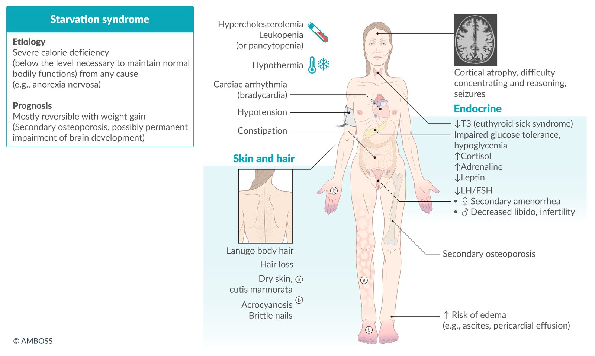

# Anorexia nervosa

*Categories: Clinical knowledge > Obstetrics/gynecology > Menstrual cycle and associated disorders > Anorexia nervosa*

[Original Article Link](https://coursology-qbank.com/amboss/article/Et0823)

---

## Summary

<u>Anorexia</u> nervosa (AN) is a complex <u>eating disorder</u> with a high <u>mortality rate</u>. It is characterized by deliberate restriction of energy intake, resulting in significantly low body weight. Causes are multifactorial and include genetic factors, psychiatric disorders, and psychosocial factors (e.g., trauma). Typical features include <u>body image disturbance</u> and fear of weight gain. There are two subtypes of AN: restrictive (weight loss is achieved by reducing intake and increasing calorie expenditure, e.g., with excessive exercise) and binge eating/<u>purging</u> (if those behaviors are present). Individuals without low body weight but who otherwise meet the diagnostic criteria for AN are diagnosed with <u>atypical AN</u>. It is important to assess for <u>malnutrition</u> severity in affected individuals, regardless of body weight or <u>body mass index</u> (<u>BMI</u>). Diagnostic workup should include evaluation for associated complications (e.g., <u>electrolyte</u> abnormalities) and, in some cases, any underlying conditions that may affect weight or cause a change in eating behaviors (e.g., <u>thyroid disorder</u>). Management should be provided in an outpatient setting if possible, but the presence of <u>red flags in eating disorders</u> may indicate the need for hospitalization for acute stabilization. All patients should be referred for <u>psychotherapy</u> and nutritional management for <u>weight restoration in AN</u>. Pharmacotherapy may be used as adjunctive therapy to help manage comorbid psychiatric conditions (e.g., <u>depression</u>) or promote weight gain in selected patients. AN has the highest <u>mortality rate</u> of all psychiatric disorders because of the high <u>incidence</u> of serious medical complications.

Anorexia nervosa fact sheet

---

## Epidemiology

* <u>Prevalence</u> [[2]](https://coursology-qbank.com/amboss/article/O-bIxw)[[3]](https://coursology-qbank.com/amboss/article/l-bvxw)[[4]](https://coursology-qbank.com/amboss/article/lz1vGj0)

* <u>♀</u>: 0.9–1.4%

* <u>♂</u>: 0.1–0.3%

* Age: Onset usually occurs between ∼ 12 and 25 years of age.  [[2]](https://coursology-qbank.com/amboss/article/O-bIxw)[[5]](https://coursology-qbank.com/amboss/article/Nta-dm)

* Sex: <u>♀</u> > <u>♂</u> (3–12:1) [[2]](https://coursology-qbank.com/amboss/article/O-bIxw)[[3]](https://coursology-qbank.com/amboss/article/l-bvxw)[[4]](https://coursology-qbank.com/amboss/article/lz1vGj0)

> [!WARNING]
> AN is likely underdiagnosed in boys and men, as the condition is more commonly associated with girls and women. [[6]](https://coursology-qbank.com/amboss/article/y_1dIj0)

Epidemiological data refers to the US, unless otherwise specified.

---

## Etiology

The etiology of AN is multifactorial and not entirely understood. Several factors are thought to contribute to the development of the disorder:

* Genetic factors: There is a higher <u>concordance</u> of AN in <u>identical twins</u> than in <u>fraternal twins</u>. [[7]](https://coursology-qbank.com/amboss/article/Wm1Peh0)

* Neurobiological factors: e.g., abnormal reward processing [[8]](https://coursology-qbank.com/amboss/article/Rz1lsj0)

* Psychiatric factors: associated with <u>obsessive-compulsive disorder</u>, <u>anxiety disorders</u>, <u>mood disorders</u>, and <u>personality disorders</u> [[7]](https://coursology-qbank.com/amboss/article/Wm1Peh0)[[9]](https://coursology-qbank.com/amboss/article/b01He20)

* Psychosocial factors

* Traumatization  [[10]](https://coursology-qbank.com/amboss/article/Ym1nVh0)

* Caregiver with disordered eating [[11]](https://coursology-qbank.com/amboss/article/Nz1-Gj0)

* Careers or sports that prioritize leanness and/or target weights (e.g., modeling, ballet, gymnastics, wrestling) [[12]](https://coursology-qbank.com/amboss/article/f61k430)

* Societal idealization of thinness [[13]](https://coursology-qbank.com/amboss/article/CL1q-h0)

* <u>Food insecurity</u> [[10]](https://coursology-qbank.com/amboss/article/Ym1nVh0)

---

## Clinical features

* Characteristic clinical features

* Restriction of energy intake typically resulting in a low <u>BMI</u>  [[14]](https://coursology-qbank.com/amboss/article/i_cJLU0)

* Fear of weight gain and/or behaviors aimed at preventing weight gain

* <u>Body image distortion</u>

* See <u>DSM-5 diagnostic criteria for anorexia nervosa</u> for further detail.

* Associated features of severe <u>malnutrition</u> may be present.

|  Associated features of severe malnutrition in anorexia nervosa [[10]](https://coursology-qbank.com/amboss/article/Ym1nVh0)[[15]](https://coursology-qbank.com/amboss/article/hz1csj0)  |  |
| --- | --- |
|  | Clinical features |
| <u>CNS</u> |   * <u>Hypothermia</u>  [[9]](https://coursology-qbank.com/amboss/article/b01He20)  * Cortical <u>atrophy</u> with associated problems with concentration and reasoning  * <u>Seizures</u>    |
| Cardiac |   * <u>Hypotension</u>  * <u>Cardiac arrhythmia</u> (<u>bradycardia</u>)  * Cardiac <u>atrophy</u>  * <u>Mitral valve prolapse</u>    |
| Endocrine |   * <u>Stress</u> <u>hormones</u>: ↑ <u>cortisol</u>, ↑ <u>adrenaline</u> [[16]](https://coursology-qbank.com/amboss/article/mz1Vtj0)  * <u>Thyroid</u>: <u>euthyroid sick syndrome</u> [[10]](https://coursology-qbank.com/amboss/article/Ym1nVh0)[[17]](https://coursology-qbank.com/amboss/article/3z1Ssj0)  * <u>Secondary amenorrhea</u> (severe weight loss suppresses the <u>hypothalamic-pituitary-gonadal axis</u> → <u>hypogonadotropic hypogonadism</u>) [[18]](https://coursology-qbank.com/amboss/article/s_ctpU0)  * <u>Impaired glucose tolerance</u>, <u>hypoglycemia</u> [[14]](https://coursology-qbank.com/amboss/article/i_cJLU0)    |
| Musculoskeletal |   * <u>Muscle weakness</u>  * Secondary <u>osteoporosis</u>  * <u>Stress fractures</u>  * Growth retardation in children and <u>adolescents</u>    |
| <u>Skin</u> and <u>hair</u> |   * Dry <u>skin</u>  * <u>Wound healing</u> disorders [[19]](https://coursology-qbank.com/amboss/article/bm1HVh0)  * <u>Hair</u> loss  * <u>Lanugo</u> body <u>hair</u>    |

> [!WARNING]
> Patients with AN who engage in <u>purging behavior</u> may also exhibit <u>clinical features of bulimia nervosa</u> such as dental damage, <u>sialadenosis</u>, and <u>Russell sign</u>. [[10]](https://coursology-qbank.com/amboss/article/Ym1nVh0)

Symptoms of starvation

---

## Diagnosis

### General principles

* See “<u>Screening for eating disorders</u>” for indications and screening modalities.

* Obtain height and weight measurements to calculate <u>BMI</u> and <u>malnutrition</u> severity.

* Determine if individuals fulfill the <u>DSM-5 diagnostic criteria for AN</u> to confirm the diagnosis.

* Evaluate for complications and comorbidities, and rule out possible organic etiologies; see “<u>Initial evaluation for a suspected eating disorder</u>.”

### <u>DSM-5</u> diagnostic criteria [[5]](https://coursology-qbank.com/amboss/article/Nta-dm)[[7]](https://coursology-qbank.com/amboss/article/Wm1Peh0)[[20]](https://coursology-qbank.com/amboss/article/En18Eh0)

|  DSM-5 diagnostic criteria for anorexia nervosa [[7]](https://coursology-qbank.com/amboss/article/Wm1Peh0)[[20]](https://coursology-qbank.com/amboss/article/En18Eh0)  |  |
| --- | --- |
| A |  * Deliberate restriction of energy intake, causing significantly low body weight, e.g.:  [[21]](https://coursology-qbank.com/amboss/article/co1aa30)  * Patients > 20 years of age: <u>BMI</u> < 18.5 kg/m2  * Patients ≤ 20 years of age: <u>BMI</u> < 5th <u>percentile</u> for sex and age   [[21]](https://coursology-qbank.com/amboss/article/co1aa30)[[22]](https://coursology-qbank.com/amboss/article/MAbM4w)   |
| B |  * ≥ 1 of the following:  * Intense fear of weight gain  * Persistent behaviors that interfere with weight gain (e.g., <u>purging</u>, excessive exercise)   |
| C |  * ≥ 1 of the following:  * <u>Body image disturbance</u>  * Disproportionate impact of weight or body shape on self-value  * Lack of acceptance of the seriousness of current low weight   |
| All criteria must be fulfilled. |  |

> [!TIP]
> Patients who have a normal or elevated <u>BMI</u> but meet all other criteria for AN are diagnosed with atypical AN, which is in the <u>DSM-5</u> category of Other Specified Feeding and Eating Disorders. [[5]](https://coursology-qbank.com/amboss/article/Nta-dm)[[9]](https://coursology-qbank.com/amboss/article/b01He20)

#### Subtypes [[5]](https://coursology-qbank.com/amboss/article/Nta-dm)[[7]](https://coursology-qbank.com/amboss/article/Wm1Peh0)[[20]](https://coursology-qbank.com/amboss/article/En18Eh0)

* Anorexia nervosa, restricting type (<u>ANR</u>)

* Weight loss is achieved by any of the following:

* Excessive dieting

* Exercise

* <u>Fasting</u>

* No recurrent binge eating or <u>purging</u> over a 3-month period

* Anorexia nervosa, binge eating/purging type (<u>ANBP</u>):

* Patients have restricted energy intake

* AND there has been recurrent binge eating and/or <u>purging</u> (i.e., <u>vomiting</u> or <u>misuse of laxatives</u>, <u>diuretics</u>, and/or enemas) in the last 3 months

#### Severity [[6]](https://coursology-qbank.com/amboss/article/y_1dIj0)[[7]](https://coursology-qbank.com/amboss/article/Wm1Peh0)

* For adults, <u>BMI</u> is used to assess severity.

* For <u>adolescents</u> and children, severity is calculated using:

* <u>BMI</u> <u>percentiles</u> for sex and age according to the <u>CDC growth charts</u>

* <u>Malnutrition severity for eating disorders</u>

|  Severity of <u>anorexia</u> nervosa in adults [[7]](https://coursology-qbank.com/amboss/article/Wm1Peh0)  |  |
| --- | --- |
| Mild |  * <u>BMI</u> ≥ 17 kg/m2   |
| Moderate |  * <u>BMI</u> 16–16.99 kg/m2   |
| Severe |  * <u>BMI</u> 15–15.99 kg/m2   |
| Extreme |  * <u>BMI</u> < 15 kg/m2   |

Body mass index-for-age percentiles (male individuals 2–20 years; 5ᵗʰ–95ᵗʰ percentiles)

Body mass index-for-age percentiles (female individuals 2–20 years; 5ᵗʰ–95ᵗʰ percentiles)

---

## Management

### Approach [[9]](https://coursology-qbank.com/amboss/article/b01He20)[[10]](https://coursology-qbank.com/amboss/article/Ym1nVh0)[[14]](https://coursology-qbank.com/amboss/article/i_cJLU0)

* Determine if the patient has <u>red flags in eating disorders</u> that require inpatient management (see “<u>Disposition for eating disorders</u>”).

* Co-manage <u>weight restoration for AN</u> with a dietitian.

* Provide nutritional <u>rehabilitation</u>, including nutritional education and the promotion of healthy eating habits.

* Promote and monitor weight gain.

* Refer all patients for <u>psychotherapy</u>, e.g.:

* <u>Family-based therapy</u> for <u>adolescents</u> and young adults

* Cognitive behavioral therapy (<u>CBT</u>) or <u>psychodynamic psychotherapy</u> for adults

* Manage any medical <u>complications of eating disorders</u>.

* Screen for and treat comorbid psychiatric conditions, e.g., <u>SSRIs</u> for <u>depression</u>.

* A specialist may consider <u>olanzapine</u> for weight gain in selected patients.

* Encourage physical activity for a healthy lifestyle rather than for weight control.

* For underweight patients:

* Supervise patients during physical activity and limit exercise to <1.5 hours/week.

* Exercise should be stopped if there is no weight gain.

* Once <u>normal weight</u> has been restored: Encourage team sports and weight training for bone health.

> [!TIP]
> Weight gain may initially worsen the patient's mood and disordered behaviors, though this should improve over time. Counsel patients to anticipate this and monitor them appropriately. [[10]](https://coursology-qbank.com/amboss/article/Ym1nVh0)

### Weight restoration for AN [[10]](https://coursology-qbank.com/amboss/article/Ym1nVh0)[[19]](https://coursology-qbank.com/amboss/article/bm1HVh0)[[23]](https://coursology-qbank.com/amboss/article/4n13th0)

#### Goal weight range [[6]](https://coursology-qbank.com/amboss/article/y_1dIj0)[[10]](https://coursology-qbank.com/amboss/article/Ym1nVh0)

* Individualize the goal for each patient, considering: [[10]](https://coursology-qbank.com/amboss/article/Ym1nVh0)

* Weight at which reproductive function is restored (for postmenarchal patients)

* Growth and <u>pubertal development</u> trajectories in <u>adolescents</u> and young adults

* Possible initial goal: <u>BMI</u> > 20 kg/m2 for adults

* During growth periods in children: Reassess goal weight every 3–6 months.

* Carefully consider if the goal weight should be shared with the patient.

> [!TIP]
> Weigh patients after voiding, with their shoes removed. [[10]](https://coursology-qbank.com/amboss/article/Ym1nVh0)

#### Nutritional <u>rehabilitation</u>

* An individualized diet plan should be created in collaboration with a registered dietitian nutritionist. [[10]](https://coursology-qbank.com/amboss/article/Ym1nVh0)

* Patients should be carefully monitored to <u>prevent refeeding syndrome</u>.

* Weekly weight goals are recommended in addition to a final target weight.

* Promote healthy eating habits, including:

* Eating regular meals and snacks

* Expanding food variety

* Focusing on food with a high energy density

* Enteral and <u>parenteral nutrition</u> are avoided, if possible.

* <u>Enteral nutrition</u>: may be used short-term for selected patients  [[10]](https://coursology-qbank.com/amboss/article/Ym1nVh0)[[23]](https://coursology-qbank.com/amboss/article/4n13th0)

* <u>Parenteral nutrition</u>: should only be considered if all other methods have been exhausted

* Involuntary feeding may be considered by specialists for patients with impaired <u>decision-making capacity</u> and a high risk of <u>morbidity</u> and mortality.

* For more information, see “<u>Specialized nutrition support</u>.”

|  Nutritional goals for anorexia nervosa  [[6]](https://coursology-qbank.com/amboss/article/y_1dIj0)[[10]](https://coursology-qbank.com/amboss/article/Ym1nVh0)[[19]](https://coursology-qbank.com/amboss/article/bm1HVh0)[[23]](https://coursology-qbank.com/amboss/article/4n13th0)  |  |  |
| --- | --- | --- |
|  | Inpatient or residential | Outpatient |
| Caloric intake |   * Initially: 1500–2000 kcal/day  [[10]](https://coursology-qbank.com/amboss/article/Ym1nVh0)[[14]](https://coursology-qbank.com/amboss/article/i_cJLU0)[[23]](https://coursology-qbank.com/amboss/article/4n13th0)  * Gradually increase caloric intake (e.g., by 200–500 kcal every 1–3 days) up to 3000–4000 kcal/day. [[10]](https://coursology-qbank.com/amboss/article/Ym1nVh0)[[19]](https://coursology-qbank.com/amboss/article/bm1HVh0)[[23]](https://coursology-qbank.com/amboss/article/4n13th0)    |  * Consider increasing the patient's current caloric intake by 300–500 kcal every 3–4 days. [[23]](https://coursology-qbank.com/amboss/article/4n13th0)   |
| Weight gain rate |  * ∼ 2.2–4 lb (1–1.8 kg) ∼ ∼  [[10]](https://coursology-qbank.com/amboss/article/Ym1nVh0)[[23]](https://coursology-qbank.com/amboss/article/4n13th0)   |  * ∼ 0.55–2.2 lb (0.25–1 kg); monitor weight gain at least weekly. [[10]](https://coursology-qbank.com/amboss/article/Ym1nVh0)[[23]](https://coursology-qbank.com/amboss/article/4n13th0)   |

> [!TIP]
> Early and rapid weight gain are associated with a better prognosis. [[10]](https://coursology-qbank.com/amboss/article/Ym1nVh0)[[23]](https://coursology-qbank.com/amboss/article/4n13th0)

### <u>Psychotherapy</u> [[7]](https://coursology-qbank.com/amboss/article/Wm1Peh0)[[9]](https://coursology-qbank.com/amboss/article/b01He20)[[10]](https://coursology-qbank.com/amboss/article/Ym1nVh0)

* <u>Psychotherapy</u> is often needed for ≥ 1 year. [[10]](https://coursology-qbank.com/amboss/article/Ym1nVh0)

* Type of therapy depends on the age of the patient, availability, and patient preference. [[10]](https://coursology-qbank.com/amboss/article/Ym1nVh0)

| <u>Psychotherapy</u> for patients with <u>anorexia</u> nervosa |  |
| --- | --- |
|  | Therapy types |
| <u>Adolescents</u> and young adults |   * Preferred: <u>Family-based therapy</u> with an involved caregiver[[6]](https://coursology-qbank.com/amboss/article/y_1dIj0)  * Alternative  * <u>Enhanced cognitive behavioral therapy</u>  * <u>Adolescent</u>-focused therapy  [[10]](https://coursology-qbank.com/amboss/article/Ym1nVh0)  * Parent-focused therapy  [[14]](https://coursology-qbank.com/amboss/article/i_cJLU0)    |
| Adults |   * <u>Cognitive behavioral therapy</u> or <u>enhanced CBT</u>  [[10]](https://coursology-qbank.com/amboss/article/Ym1nVh0)  * Focal <u>psychodynamic psychotherapy</u>  * <u>Interpersonal therapy</u>  * Maudsley model of <u>anorexia nervosa treatment</u> for adults  * Specialist supportive clinical management    |

> [!TIP]
> Therapy for caregivers (e.g., Experienced Carers Helping Others) improves outcomes for patients with AN. [[10]](https://coursology-qbank.com/amboss/article/Ym1nVh0)

### Pharmacotherapy [[7]](https://coursology-qbank.com/amboss/article/Wm1Peh0)[[9]](https://coursology-qbank.com/amboss/article/b01He20)[[10]](https://coursology-qbank.com/amboss/article/Ym1nVh0)

* Although frequently prescribed, there is limited evidence to support the use of pharmacotherapy in AN.  [[9]](https://coursology-qbank.com/amboss/article/b01He20)

* <u>SSRIs</u> have a limited role.

* Not effective if prescribed solely for the management of AN

* Can help manage comorbid psychiatric conditions  [[10]](https://coursology-qbank.com/amboss/article/Ym1nVh0)

* <u>Olanzapine</u> may be considered in selected patients to assist with weight gain.  [[24]](https://coursology-qbank.com/amboss/article/Gn1Buh0)

> [!WARNING]
> The <u>antidepressant</u> <u>bupropion</u> lowers the <u>seizure</u> threshold and is contraindicated in individuals with a history of <u>eating disorders</u> because these individuals have an increased risk of <u>dehydration</u> and <u>electrolyte</u> imbalances, which can also cause <u>seizures</u>. [[10]](https://coursology-qbank.com/amboss/article/Ym1nVh0)

### Management of common complications

* <u>Vitamin deficiencies</u>: Treat with supplements (e.g., multivitamins, <u>zinc</u>, <u>calcium</u>, <u>vitamin D3</u>).

* <u>Amenorrhea</u> or menstrual abnormalities [[18]](https://coursology-qbank.com/amboss/article/s_ctpU0)

* <u>Hormonal contraception</u> should not be used to restore <u>menstrual cycles</u> or improve <u>bone mineral density</u>.

* The use of <u>hormonal contraception</u> may mask the spontaneous return of <u>menses</u>.

* In patients requiring <u>contraception</u>, a <u>copper</u> coil may be preferred, as it does not interfere with <u>the menstrual cycle</u>.

* See also “<u>Complications of eating disorders</u>”.

> [!WARNING]
> Sexually active patients with <u>amenorrhea</u> or irregular <u>menses</u> can still become pregnant; counsel patients appropriately on <u>contraception</u>. [[18]](https://coursology-qbank.com/amboss/article/s_ctpU0)

---

## Prognosis

* Outcomes in AN vary from chronic, relapsing course to a gradual but complete recovery. [[7]](https://coursology-qbank.com/amboss/article/Wm1Peh0)[[10]](https://coursology-qbank.com/amboss/article/Ym1nVh0)

* Factors associated with a poorer prognosis

* Onset before 15 years of age

* Psychiatric comorbidities

* Factors associated with a better prognosis

* <u>ANR</u> subtype

* Early and rapid weight gain

* <u>Malnutrition</u> can cause long-term physical complications, e.g., stunted growth, <u>secondary osteoporosis</u> (see “<u>Clinical features of AN</u>”).

* Psychiatric comorbidities are common, e.g.:  [[10]](https://coursology-qbank.com/amboss/article/Ym1nVh0)[[25]](https://coursology-qbank.com/amboss/article/Kz1UFj0)

* <u>Obsessive-compulsive disorder</u>

* <u>Personality disorders</u>

* <u>Anxiety disorders</u> (e.g., <u>generalized anxiety disorder</u>, <u>social anxiety disorder</u>)

* <u>Mood disorders</u> (e.g., <u>depression</u>, <u>bipolar disorder</u>)

* AN has the highest <u>mortality rate</u> among all psychiatric disorders. [[15]](https://coursology-qbank.com/amboss/article/hz1csj0)

* <u>Mortality rate</u>: 5.1 deaths per 1000 <u>person-years</u> [[26]](https://coursology-qbank.com/amboss/article/-6YDnJ)

* Most commonly due to <u>sudden cardiac death</u>, <u>suicide</u>, and organ dysfunction resulting from severe <u>cachexia</u>/<u>starvation</u> (e.g., <u>liver</u> failure) [[15]](https://coursology-qbank.com/amboss/article/hz1csj0)[[25]](https://coursology-qbank.com/amboss/article/Kz1UFj0)

> [!TIP]
> Individuals with AN may switch from one subtype to another or develop a different <u>eating disorder</u>, such as <u>bulimia nervosa</u>. [[7]](https://coursology-qbank.com/amboss/article/Wm1Peh0)[[13]](https://coursology-qbank.com/amboss/article/CL1q-h0)

> [!TIP]
> The high <u>mortality rate</u> in AN is due to associated medical complications (e.g., <u>arrhythmia</u>, <u>bradycardia</u>) and the high <u>suicide</u> rate in affected individuals. [[15]](https://coursology-qbank.com/amboss/article/hz1csj0)[[25]](https://coursology-qbank.com/amboss/article/Kz1UFj0)

---