# Breast cancer

*Categories: Clinical knowledge > Obstetrics/gynecology > Neoplastic disorders > Breast cancer*

[Original Article Link](https://coursology-qbank.com/amboss/article/_k05qT)

---

## Summary

<u>Breast</u> cancer is the second most common <u>malignancy</u> in women (after <u>nonmelanoma skin cancer</u>). In the US, the lifetime risk of a woman developing <u>breast</u> cancer is approximately 13%. The most important <u>risk factors</u> are increased exposure to <u>estrogen</u>, advanced age, and genetic predisposition (e.g., <u>BRCA</u> mutations). The majority of tumors are <u>adenocarcinomas</u>. The two most common types of <u>breast</u> cancer are <u>invasive ductal carcinoma</u> and the often less aggressive <u>invasive lobular carcinoma</u>. <u>Breast</u> cancer is usually asymptomatic and incidentally detected on routine screening. Symptoms of <u>breast</u> cancer are variable; these include a <u>palpable breast mass</u>, <u>nipple</u> <u>inversion</u>, blood-tinged <u>nipple discharge</u>, and features of regional or distant <u>metastasis</u>. <u>Breast</u> cancer is diagnosed based on <u>biopsy</u> results of lesions detected on clinical evaluation and/or <u>breast</u> imaging. <u>Breast</u> cancer treatment is multidisciplinary, involving <u>surgery</u>, <u>radiation therapy</u>, and systemic therapy (<u>chemotherapy</u>, endocrine therapy, <u>targeted therapy</u>), alone or in combination. The most important prognostic factors are <u>cancer stage</u>, <u>tumor</u> <u>receptor</u> status, and <u>aneuploidy</u>. Individuals at a high risk of developing <u>breast</u> cancer (e.g., positive <u>BRCA mutation</u> status) should be offered <u>breast cancer risk-reducing interventions</u>.

<u>Lobular carcinoma in situ</u>, previously classified as a premalignant lesion, is now considered a benign condition and is detailed in a separate article.

---

## Epidemiology

<u>Breast</u> cancer is the second most common malignant disease in women.  [[1]](https://coursology-qbank.com/amboss/article/GwbB4D)

* <u>Incidence</u>

* In 2020, an estimated 276,480 new cases of invasive <u>breast</u> cancer were diagnosed. [[1]](https://coursology-qbank.com/amboss/article/GwbB4D)

* <u>♀</u> >> <u>♂</u> : The female-to-male <u>incidence</u> <u>ratio</u> in the US is 125.8 to 1.  [[2]](https://coursology-qbank.com/amboss/article/Dwb1OD)

* Peak <u>incidence</u>

* <u>Postmenopausal</u>

* <u>Incidence</u> increases with age.  [[3]](https://coursology-qbank.com/amboss/article/UWabkj)

* 50% of <u>breast</u> cancers are diagnosed in women ≥ 65 years of age. [[4]](https://coursology-qbank.com/amboss/article/p7YL5q)

* Mortality: second leading cause of cancer <u>death</u> in women in the US  [[1]](https://coursology-qbank.com/amboss/article/GwbB4D)

> [!TIP]
> One in 8 women in the US (∼ 13%) will develop invasive <u>breast</u> cancer during their lifetime.

Incidence of cancers in the US (2025 estimates)

Cancer mortality in the US (2025 estimates)

Epidemiological data refers to the US, unless otherwise specified.

---

## Etiology

### Predisposing factors

#### Hormonal <u>risk factors</u>

* Increased exposure to <u>endogenous</u> <u>estrogen</u> 

* First viable <u>pregnancy</u> after 35 years of age

* <u>Nulliparity</u> and/or absence of <u>breastfeeding</u>  [[5]](https://coursology-qbank.com/amboss/article/IIYYVq)

* Early <u>menarche</u> and/or late <u>menopause</u>

* <u>Obesity</u>;  in <u>postmenopausal</u> women (lipocytes convert <u>androstenedione</u> to <u>estrone</u>)

* <u>Exogenous</u> <u>estrogen</u> intake

* <u>Hormone replacement therapy</u> after <u>menopause</u>  [[6]](https://coursology-qbank.com/amboss/article/rIYfVq)

* <u>Hormonal contraception</u> [[7]](https://coursology-qbank.com/amboss/article/gCbFrD)

> [!TIP]
> The use of <u>combined oral contraceptives</u> or <u>progesterone</u>-only is associated with a slightly increased risk of <u>breast</u> cancer. However, <u>hormonal contraceptive</u> use is associated with a reduced risk of ovarian and <u>endometrial cancer</u>, which may decrease the overall risk of cancer. See “<u>Noncontraceptive benefits of hormonal contraception</u>.” [[8]](https://coursology-qbank.com/amboss/article/2TdTJ60)[[9]](https://coursology-qbank.com/amboss/article/fTdkJ60)

#### Individual <u>risk factors</u>

* Sex: female

* Age: advanced age (most commonly in women ≥ 65 years) [[4]](https://coursology-qbank.com/amboss/article/p7YL5q)

* Ethnicity

* Individuals of European descent are at highest risk.

* African Americans are at increased risk for <u>triple-negative</u> <u>breast</u> cancer.

* Lifestyle

* Low-fiber and high-fat diet

* Smoking

* <u>Alcohol</u> consumption

* Positive <u>medical history</u>

* <u>Breast</u> cancer in the <u>contralateral</u> <u>breast</u>

* <u>Breast</u> conditions with <u>cellular atypia</u> (e.g., <u>fibrocystic change</u>, <u>fibroadenoma</u>)

* <u>Endometrial cancer</u> , ovarian, or <u>colorectal cancer</u>

* <u>Radiation therapy</u> during childhood [[10]](https://coursology-qbank.com/amboss/article/TWa6kj)

### Hereditary <u>risk factors</u>

* Positive <u>family history</u> (e.g., in <u>first-degree relatives</u>)

#### Mutations

* <u>Tumor suppressor genes</u>

* BRCA1 and BRCA2: <u>BRCA</u> are <u>tumor suppressor genes</u> that code for a <u>DNA repair</u> protein. 

* <u>Autosomal-dominant</u> mutation

* Associated with an increased risk for <u>breast</u> cancer and <u>ovarian cancer</u>

* 5–10% of <u>breast</u> cancer cases are hereditary; BRCA mutations account for most of these. [[11]](https://coursology-qbank.com/amboss/article/HIYKVq)

* <u>BRCA</u>-positive women develop <u>breast</u> cancer earlier than women without the mutation.

* An estimated 55–60% of women with <u>BRCA1</u>-positive status will develop invasive <u>breast</u> cancer before 70 years of age; the number is 45% in <u>BRCA2</u>-positive women. [[12]](https://coursology-qbank.com/amboss/article/Y9bnND)

* Men with <u>breast</u> cancer are often positive for <u>BRCA2</u>.

* <u>PTEN</u>, RB1, CDH1

* <u>Oncogenes</u>:  (e.g., RAS)

* Mutations responsible for <u>receptor</u> overexpression

* <u>Estrogen</u>/<u>progesterone</u> <u>receptors</u>

* <u>ERBB2</u> (<u>HER2</u>/neu)

#### Genetic conditions

* Li-Fraumeni syndrome: <u>autosomal dominant</u> mutation of the <u>p53</u> <u>tumor suppressor gene</u>

* Pathophysiology

* One abnormal copy of the <u>TP53 gene</u> is inherited.

* If the second <u>allele</u> is somatically mutated or deleted (<u>loss of heterozygosity</u>), it results in unregulated cell <u>proliferation</u> and cancer.

* Clinical features: multiple malignancies at an early age

* <u>Breast</u> cancer

* <u>Osteosarcoma</u>

* <u>Leukemia</u>, <u>lymphoma</u>

* <u>Brain tumors</u>

* <u>Adrenocortical carcinoma</u>

* <u>Peutz-Jeghers syndrome</u>

* <u>Klinefelter syndrome</u>

> [!NOTE]
> For the characteristics of <u>Li-Fraumeni syndrome</u>, think BLAST53: Breast cancer/Brain tumors, Leukemia/Lymphoma, Adrenocortical <u>carcinoma</u>, Sarcoma, and Tp53.

---

## Types of breast cancer

### Noninvasive <u>carcinomas</u>

#### Ductal carcinoma in situ (<u>DCIS</u>)

* Characteristics

* No penetration of the <u>basement membrane</u>

* Preceded by ductal <u>atypia</u>

* Frequently appears as a pattern of grouped microcalcifications on <u>mammography</u>

* Higher risk of subsequent <u>ipsilateral</u> <u>invasive carcinoma</u>

##### Comedocarcinoma

* Characteristics: subtype of <u>DCIS</u> characterized by central <u>necrosis</u>

> [!NOTE]
> Noninvasive <u>carcinomas</u> are characterized by the absence of stromal invasion.

### Invasive <u>carcinomas</u>

#### Invasive ductal carcinoma (IDC)

* Characteristics

* Most common type of invasive <u>breast</u> cancer (∼ 80%) [[13]](https://coursology-qbank.com/amboss/article/J9bsoD)

* Aggressive formation of <u>metastases</u>

* Localization

* Unilateral

* Mostly unifocal

##### Medullary breast cancer [[14]](https://coursology-qbank.com/amboss/article/brYHfq)

* Characteristics

* Rare subtype of <u>invasive ductal carcinoma</u>

* Most common <u>tumor</u> associated with the <u>BRCA1</u> mutation

* Well-circumscribed soft <u>tumor</u> with smooth borders (may appear benign)

* Usually <u>triple-negative</u>

* <u>Lymphadenopathy</u>

* Differential diagnosis: <u>fibroadenoma</u>

#### Invasive lobular carcinoma (ILC) [[13]](https://coursology-qbank.com/amboss/article/J9bsoD)

* Characteristics

* ∼ 10% of all invasive <u>breast</u> <u>carcinomas</u>

* Less aggressive than ductal <u>carcinoma</u>

* Localization

* Bilateral in ∼ 20% of cases

* Frequently multifocal

#### Less common subtypes [[13]](https://coursology-qbank.com/amboss/article/J9bsoD)

* <u>Mucinous</u> <u>carcinoma</u> (< 5%; more common in older women)

* Mixed <u>carcinoma</u> (ductal/lobular)

* Tubular <u>carcinoma</u>

* Papillary carcinoma of the breast

* A rare type of <u>invasive ductal carcinoma</u> with a peak <u>incidence</u> between the ages of 60 and 70

* More common among non-white women

* The <u>tumor</u> has a very low frequency of <u>lymph node</u> <u>metastasis</u>.

* Nearly 90% of the tumors express <u>estrogen</u> <u>receptors</u>.

* Micropapillary <u>carcinoma</u>

---

## Clinical features

<u>Breast</u> cancer is frequently asymptomatic and often detected on routine screening. Symptoms typically manifest at more advanced stages of the disease.

### <u>Breast</u> changes

* <u>Palpable breast mass</u> with the following characteristics:

* Typically single, nontender, and firm

* Poorly defined margins

* Most commonly located in the upper outer quadrant (∼ 55%)

* <u>Breast</u> asymmetry

* <u>Skin</u> changes

* <u>Retractions</u> or dimpling (due to fixation to the pectoral muscles, deep <u>fascia</u>, <u>Cooper ligaments</u>, and/or overlying <u>skin</u>)

* <u>Peau d'orange</u>

* <u>Nipple</u> <u>inversion</u>

* Blood-tinged <u>nipple discharge</u>

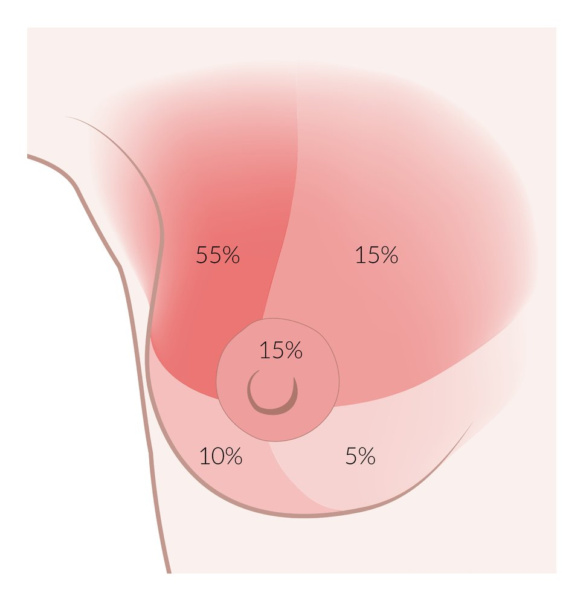

Breast cancer incidence by location

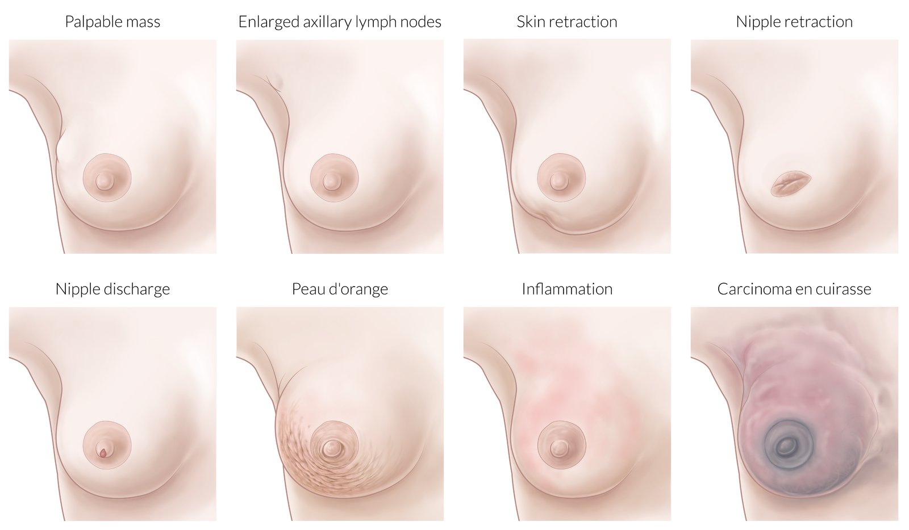

Local findings in breast cancer

> [!TIP]
> To make <u>skin</u> <u>retractions</u> more visible, it can be helpful to stretch the <u>skin</u> or gently elevate the patient's arm.

### Regional <u>lymphadenopathy</u>

* Nontender, firm, <u>enlarged lymph nodes</u> (> 1 cm in size), that may be fixed or matted

* The axillary nodes are most commonly involved.

* The supraclavicular, infraclavicular, and <u>parasternal lymph nodes</u> may also be involved.

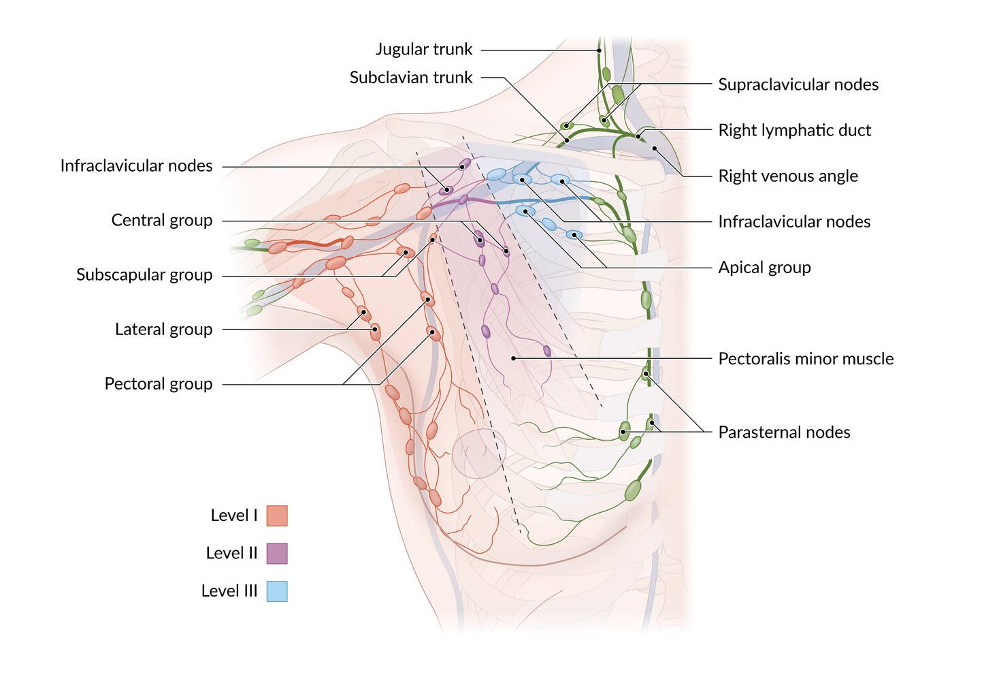

Lymph nodes of the breast

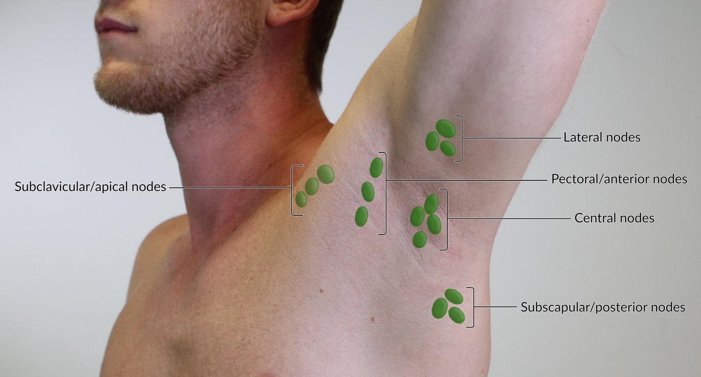

Palpable lymph nodes of the axillary region

### Features of distant <u>metastasis</u>

Distant <u>metastases</u> of <u>breast</u> cancer can produce a number of heterogeneous symptoms.

* <u>Bone metastasis</u>

* Bone <u>pain</u>

* <u>Pathologic fractures</u>

* Spinal compression

* <u>Liver metastasis</u>

* Abdominal <u>pain</u>, distention

* <u>Nausea</u>

* <u>Jaundice</u>

* <u>Lung metastasis</u>

* <u>Cough</u>

* <u>Hemoptysis</u>

* <u>Dyspnea</u>

* <u>Chest pain</u>

* <u>Brain metastasis</u>

* <u>Headaches</u>

* <u>Seizures</u>

* Cognitive deficits, <u>focal neurological deficits</u>

> [!TIP]
> More than 90% of <u>breast</u> cancers are diagnosed in early (nonmetastatic) stages. [[15]](https://coursology-qbank.com/amboss/article/P4cWjc0)

Most common routes of metastasis with TNM classification

---

## Subtypes and variants

### Paget disease of the breast [[16]](https://coursology-qbank.com/amboss/article/TCb6rD)

* Definition: a rare type of <u>breast</u> cancer;   that affects the <u>lactiferous ducts</u> and the <u>skin</u> of the <u>nipple</u> and <u>areola</u>

* Pathogenesis

* Not fully understood

* The following hypotheses have been postulated: [[17]](https://coursology-qbank.com/amboss/article/fCbkrD)

* Migratory/epidermotropic theory: <u>neoplastic</u> ductal <u>epithelial</u> cells from an underlying <u>DCIS</u> or IDC;   move through the <u>lactiferous ducts</u> and invade the surrounding <u>epidermis</u> of the <u>nipple</u>.

* In situ malignant transformation of existing cells into <u>Paget cells</u>, meaning that the condition is a <u>carcinoma</u> in situ, without preexisting <u>DCIS</u>/IDC.

* Clinical features 

* <u>Erythematous</u>, scaly, or <u>vesicular</u> <u>rash</u> affecting the <u>nipple</u> and <u>areola</u>

* <u>Pruritus</u>; burning sensation

* <u>Nipple</u> <u>retraction</u>

* <u>Ulceration</u> that causes blood-tinged <u>nipple discharge</u>

* Diagnostics

* Punch/wedge or surface <u>biopsy</u> of <u>nipple</u> tissue: <u>Paget cells</u> confirm disease.

* Imaging to look for underlying <u>DCIS</u>/IDC (see “Diagnostics” below)

* Differential diagnosis: mamillary <u>eczema</u>

* Treatment

* <u>Breast-conserving surgery</u> with subsequent adjuvant whole-<u>breast</u> radiation (see “Treatment” below)

* <u>Mastectomy</u>

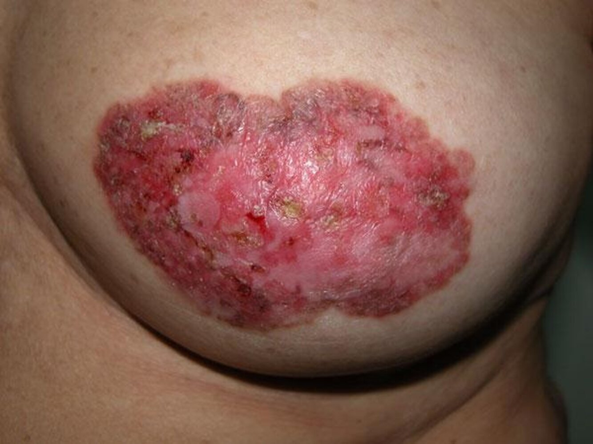

Paget disease of the breast

### Inflammatory breast cancer (IBC) [[18]](https://coursology-qbank.com/amboss/article/dCboID)

* Definition: a rare form of advanced, aggressive <u>invasive carcinoma</u> characterized by <u>dermal</u> lymphatic invasion of <u>tumor</u> cells

* Clinical features 

* Peau d'orange

* <u>Erythematous</u>, warm, and <u>edematous</u> <u>skin plaques</u> with prominent <u>hair follicles</u> that resemble orange peel

* Caused by obstruction of the lymphatic channels due to <u>tumor</u> growth

* Tenderness, burning sensation

* Blood-tinged <u>nipple discharge</u>

* Signs of <u>metastatic</u> disease (e.g., axillary <u>lymphadenopathy</u>)  [[19]](https://coursology-qbank.com/amboss/article/DIY1Uq)

* Can present with or without a palpable mass

* Diagnostics: The diagnostic process involves a comprehensive <u>clinical examination</u>, followed by imaging studies (<u>mammography</u> and <u>ultrasound</u>) and a <u>biopsy</u> to confirm the diagnosis. [[20]](https://coursology-qbank.com/amboss/article/SxXyDZ0)

* Diagnostic criteria: (all must be met)

* Rapid onset of <u>breast</u> <u>erythema</u>, <u>edema</u>, warmth, and <u>peau d'orange</u>, with or without palpable mass on <u>breast examination</u>

* <u>Erythema</u> involving at least one-third of the <u>breast</u>

* Symptoms have been present for < 6 months

* <u>Core needle biopsy</u> confirming the presence of <u>invasive carcinoma</u>

* Imaging

* Bilateral <u>mammogram</u> and <u>ultrasound</u> of the <u>breast</u> and regional <u>lymph nodes</u>: <u>skin</u> thickening, <u>tumor</u> mass, increased <u>breast</u> density

* Optional <u>MRI</u>

* <u>Biopsy</u>

* <u>Core needle biopsy</u>: recommended in all patients for diagnostic confirmation

* Full-thickness <u>skin biopsy</u>: recommended in all patients to assess for <u>dermal</u> involvement

* Further testing

* <u>Hormone</u> <u>receptor</u> status evaluation

* Optional PET/CT

* Differential diagnosis

* <u>Mastitis</u>

* <u>Paget disease of the breast</u>

* <u>Breast abscess</u>

* <u>Erysipelas</u> of the <u>breast</u>

* Treatment: <u>modified radical mastectomy</u> with <u>neoadjuvant</u> and adjuvant systemic therapy and <u>adjuvant radiation therapy</u>

* Prognosis: 5-year survival rate is ∼ 40%.

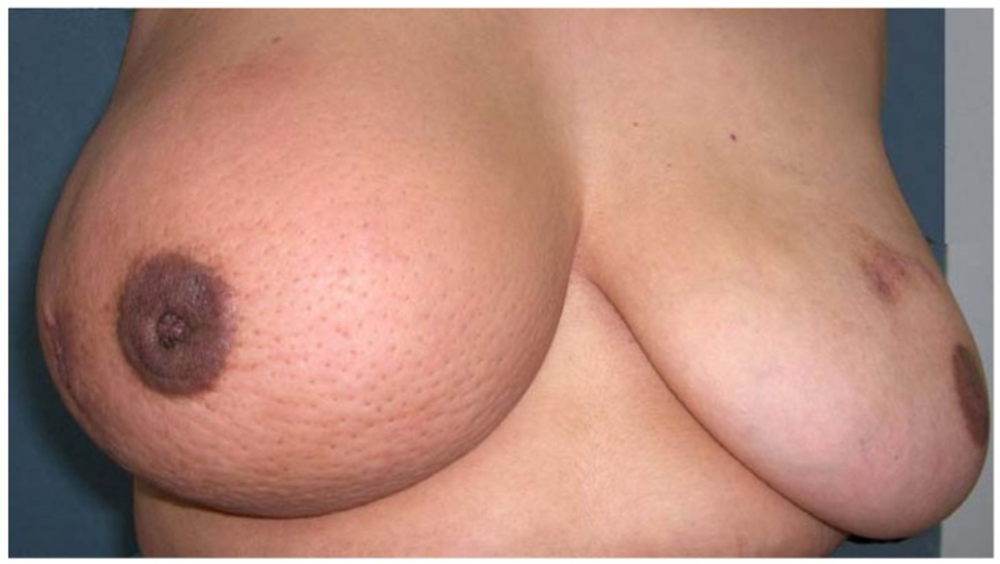

Inflammatory breast cancer

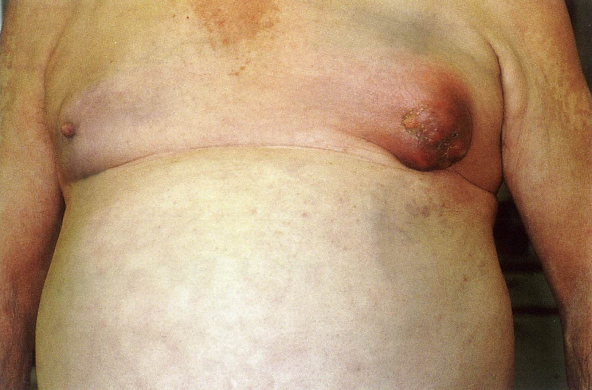

Inflammatory breast cancer

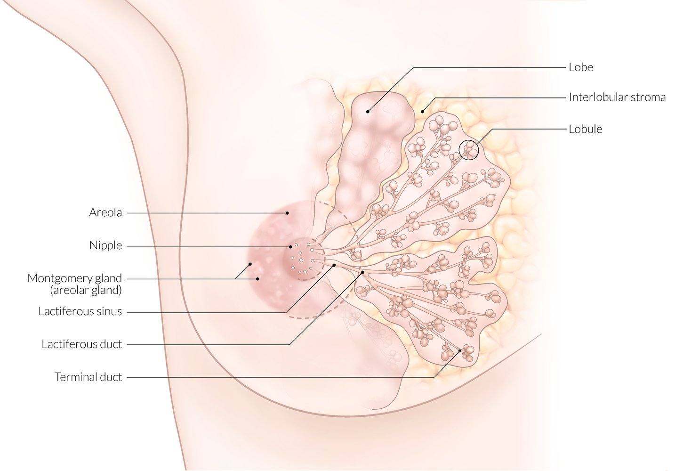

Breast

> [!TIP]
> <u>Inflammatory breast cancer</u> is always classified as T4 because it involves the <u>skin</u>.

> [!WARNING]
> <u>ALND</u> (not <u>SLNB</u>) should be performed in patients with <u>inflammatory breast cancer</u>. [[21]](https://coursology-qbank.com/amboss/article/T4c6ic0)[[22]](https://coursology-qbank.com/amboss/article/PPcWUc0)

### Occult breast cancer [[23]](https://coursology-qbank.com/amboss/article/UScb_b0)

* Definition: a rare type of cancer ;   characterized by clinically recognizable <u>metastases</u> originating from an undetectable primary <u>breast</u> tissue <u>carcinoma</u>

* Clinical features: axillary <u>adenopathy</u> (most common)

* Diagnostics

* <u>Biopsy</u> of the <u>lymph node</u>

* <u>Breast ultrasound</u>

* <u>Mammography</u>

* <u>Breast</u> <u>MRI</u> (only if <u>ultrasound</u> and <u>mammography</u> are inconclusive)

* Treatment [[24]](https://coursology-qbank.com/amboss/article/eScxAb0)

* <u>ALND</u>

* <u>Mastectomy</u>

* <u>Chemotherapy</u> and radiation

* For further information, see “Treatment” below.

---

## Diagnosis

<u>Breast</u> cancer is diagnosed based on <u>biopsy</u> results of lesions detected on clinical evaluation and/or <u>breast</u> imaging. The diagnostic approach depends on clinical presentation but typically includes all of the following, in sequence (see “<u>Palpable breast mass</u>,” “<u>Nipple discharge</u>,” “<u>Mastalgia</u>,” and “<u>Breast cancer screening</u>” for specific algorithms). [[25]](https://coursology-qbank.com/amboss/article/Ru1lIi0)

### Clinical evaluation

* Comprehensive <u>patient history</u>, including:

* Relevant <u>family history</u>

* Assessment of <u>risk factors for breast cancer</u>

* <u>Review of systems</u>

* Bilateral <u>examination of the breasts</u> and regional <u>lymph nodes</u> (axillary, supraclavicular)

### <u>Breast</u> imaging

The choice of initial imaging modality is based on patient age, symptoms, and <u>risk factors for breast cancer</u>.

* Indications

* Clinical <u>findings concerning for breast cancer</u>

* <u>Breast cancer screening</u>

* Options

* <u>Mammography</u>

* <u>Breast</u> <u>MRI</u>

* <u>Breast ultrasound</u>

* Findings

* See “<u>Benign vs. malignant lesion on breast ultrasound</u>.”

* See “<u>Benign vs. malignant lesion on mammography</u>.”

> [!TIP]
> <u>Breast</u> imaging results are typically reported using the standardized American College of Radiology <u>Breast Imaging Reporting and Data System</u> (<u>BI-RADS</u>).

### Confirmatory <u>biopsy</u>

* Indications: all lesions with clinical and/or imaging features concerning for <u>malignancy</u>

* Options (see “<u>Breast biopsy</u>” for details)

* Image-guided <u>core needle biopsy</u> (preferred)

* <u>Excisional biopsy</u>

* <u>Punch biopsy</u>

* <u>Fine needle aspiration biopsy</u>

* Findings: See “Pathology” for histopathologic types of <u>breast</u> cancer.

---

## Staging and receptor testing

### General principles [[15]](https://coursology-qbank.com/amboss/article/P4cWjc0)[[26]](https://coursology-qbank.com/amboss/article/KedU-K0)

Refer all patients with newly diagnosed invasive <u>breast</u> cancer and <u>DCIS</u> to specialists for staging. Staging is used to guide management and estimate prognosis and is summarized as follows:

* All patients

* Preoperative <u>TNM staging</u> (clinical staging)

* <u>Receptor</u> testing and <u>tumor grading</u> (on <u>breast</u> cancer <u>biopsy</u> samples)  [[27]](https://coursology-qbank.com/amboss/article/Ufdbl60)

* Selected patients: multigene panel testing

* Postoperative patients: <u>histopathology</u> assessment of <u>tumor</u> extent (i.e., T and N stages) on tissue excised during <u>surgery</u> (pathologic staging)

> [!TIP]
> Serum <u>tumor marker</u> testing (e.g., <u>CEA</u>, <u>CA 15-3</u>, and <u>CA 27-29</u>) is not recommended for disease monitoring. [[28]](https://coursology-qbank.com/amboss/article/4dd3JK0)[[29]](https://coursology-qbank.com/amboss/article/-icD8X0)

> [!TIP]
> The workup of newly diagnosed <u>breast</u> cancer should ideally involve a <u>multidisciplinary cancer care</u> team. [[30]](https://coursology-qbank.com/amboss/article/rwcf4e0)[[31]](https://coursology-qbank.com/amboss/article/gddF6K0)

### <u>Receptor</u> testing [[30]](https://coursology-qbank.com/amboss/article/rwcf4e0)[[31]](https://coursology-qbank.com/amboss/article/gddF6K0)

All invasive <u>breast</u> cancer <u>biopsy</u> samples should be tested for expression of the following <u>receptors</u> to guide optimal treatment. <u>DCIS</u> <u>biopsy</u> samples should also be tested for <u>hormone</u> <u>receptors</u>. [[32]](https://coursology-qbank.com/amboss/article/uQcpBX0)

* <u>Hormone</u> <u>receptors</u>, i.e.: [[32]](https://coursology-qbank.com/amboss/article/uQcpBX0)

* <u>Estrogen</u> <u>receptors</u> (ER)

* <u>Progesterone</u> <u>receptors</u> (PR)

* Human epidermal growth factor receptor 2 (<u>ERBB2</u>; formerly <u>HER2/neu</u>): [[33]](https://coursology-qbank.com/amboss/article/6ddjIK0)

* An <u>epidermal growth factor receptor</u> with intracellular <u>tyrosine kinase</u> activity

* Promotes cell growth and differentiation and inhibits <u>apoptosis</u>

|  Classification of <u>breast</u> cancer by <u>receptor</u> status [[15]](https://coursology-qbank.com/amboss/article/P4cWjc0)  |  |  |  |  |
| --- | --- | --- | --- | --- |
|  | Description | Percentage of <u>breast</u> cancers | Considerations for systemic therapy | Additional considerations |
| <u>Hormone</u> <u>receptor</u>-positive <u>breast</u> cancer (HR+) |  * <u>Immunohistochemical</u> staining shows > 1% of <u>tumor</u> cells are: [[32]](https://coursology-qbank.com/amboss/article/uQcpBX0)  * <u>Estrogen</u> <u>receptor</u>-positive (ER+)  * And/or <u>progesterone</u> <u>receptor</u>-positive (PR+)   |   * ER+: ∼ 80% [[32]](https://coursology-qbank.com/amboss/article/uQcpBX0)  * ER+ and PR+: ∼ 70% [[34]](https://coursology-qbank.com/amboss/article/pddLIK0)  * <u>Hormone</u> <u>receptor</u>-negative (HR‑): ∼ 20% [[34]](https://coursology-qbank.com/amboss/article/pddLIK0)    |  * Endocrine therapy; some patients may also require <u>chemotherapy</u>.   |  * ER+ <u>breast</u> cancer is more common among <u>postmenopausal</u> than <u>premenopausal</u> patients. [[32]](https://coursology-qbank.com/amboss/article/uQcpBX0)   |
| <u>ERBB2</u>-positive <u>breast</u> cancer (<u>ERBB2</u>+) |  * <u>Tumor</u> cells stain positive for <u>ERBB2</u>.  * Analysis involves <u>immunohistochemistry</u>.  * In equivocal cases, <u>FISH</u> is necessary to confirm the diagnosis. [[33]](https://coursology-qbank.com/amboss/article/6ddjIK0)   |  * ∼ 20% [[35]](https://coursology-qbank.com/amboss/article/OedI_K0)   |  * <u>Chemotherapy</u> and <u>ERBB2-targeted therapy</u>   |  * Associated with an increased risk of <u>metastasis</u> [[35]](https://coursology-qbank.com/amboss/article/OedI_K0)   |
| Triple-negative breast cancer |  * <u>Tumor</u> cells are HR- and <u>ERBB2</u>-.   |  * ∼ 15%; <u>incidence</u> is higher in Black and Hispanic individuals. [[15]](https://coursology-qbank.com/amboss/article/P4cWjc0)   |  * <u>Chemotherapy</u>   |  * Associated with <u>BRCA mutations</u> and a high risk of recurrence [[15]](https://coursology-qbank.com/amboss/article/P4cWjc0)[[36]](https://coursology-qbank.com/amboss/article/JddsIK0)   |

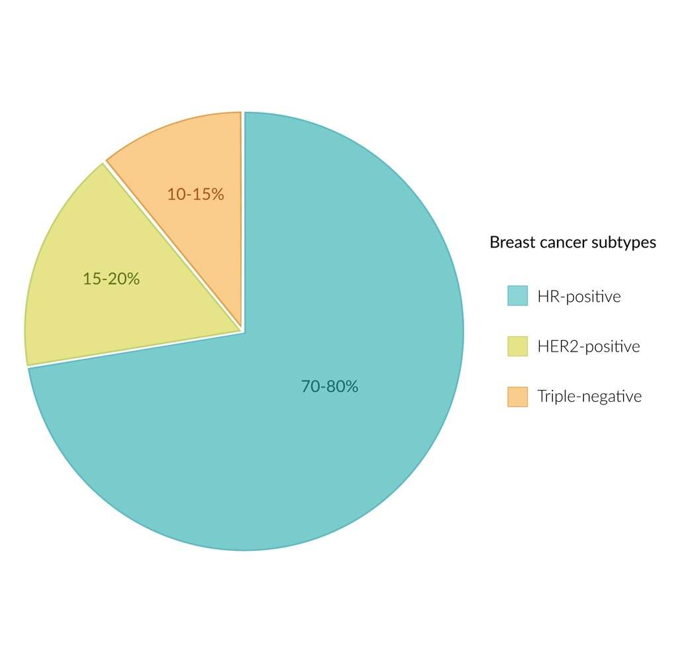

Breast cancer subtypes

### Clinical staging [[37]](https://coursology-qbank.com/amboss/article/medVzK0)

#### Evaluation of locoregional extent

* Indication: all patients (if not already performed during initial evaluation)

* Modalities

* Bilateral <u>breast</u> imaging: bilateral <u>diagnostic mammography</u>, usually combined with <u>breast ultrasound</u>  [[37]](https://coursology-qbank.com/amboss/article/medVzK0)[[38]](https://coursology-qbank.com/amboss/article/Jeds-K0)

* Axillary <u>lymph node</u> status ;  [[22]](https://coursology-qbank.com/amboss/article/PPcWUc0)

* Palpable <u>lymph nodes</u>: Image-guided <u>FNA</u> or <u>CNB</u> is indicated to confirm nodal <u>metastasis</u>.

* Nonpalpable <u>lymph nodes</u>

* <u>SLNB</u> is usually indicated.  [[22]](https://coursology-qbank.com/amboss/article/PPcWUc0)

* Consider axillary <u>ultrasound</u> (not routinely recommended).

* See “<u>Axillary staging in breast cancer</u>” for details.

#### Evaluation for distant <u>metastasis</u> [[37]](https://coursology-qbank.com/amboss/article/medVzK0)[[39]](https://coursology-qbank.com/amboss/article/ffdkl60)[[40]](https://coursology-qbank.com/amboss/article/Xfd9k60)

* Indications

* Clinical features suggestive of <u>metastasis</u>

* Consider in asymptomatic individuals with late-stage (stage II B, stage III) disease at presentation.

* <u>Laboratory studies</u>: e.g., <u>CBC</u>, <u>CMP</u>, <u>liver chemistries</u>, <u>ALP</u>

* Imaging [[41]](https://coursology-qbank.com/amboss/article/sddtrK0)

* Suspected <u>bone metastasis</u>  : <u>bone scan</u>, <u>sodium</u> <u>fluoride</u> PET/CT, or <u>FDG-PET/CT</u> [[42]](https://coursology-qbank.com/amboss/article/7dd4rK0)

* Suspected <u>lung metastasis</u>  : CT chest

* Suspected <u>liver metastasis</u>  : CT or <u>MRI</u> abdomen and <u>pelvis</u> [[43]](https://coursology-qbank.com/amboss/article/tIcXed0)

* Suspected <u>brain metastasis</u>  : <u>MRI</u> <u>brain</u>

* Consider <u>FDG-PET/CT</u> from the <u>base of the skull</u> to mid-thigh as an adjunctive modality to any of the above as needed.

> [!WARNING]
> Patients with early-stage disease and no clinical features suggestive of <u>metastasis</u> do not require imaging to assess for distant <u>metastasis</u>. [[37]](https://coursology-qbank.com/amboss/article/medVzK0)[[44]](https://coursology-qbank.com/amboss/article/5ddiqK0)

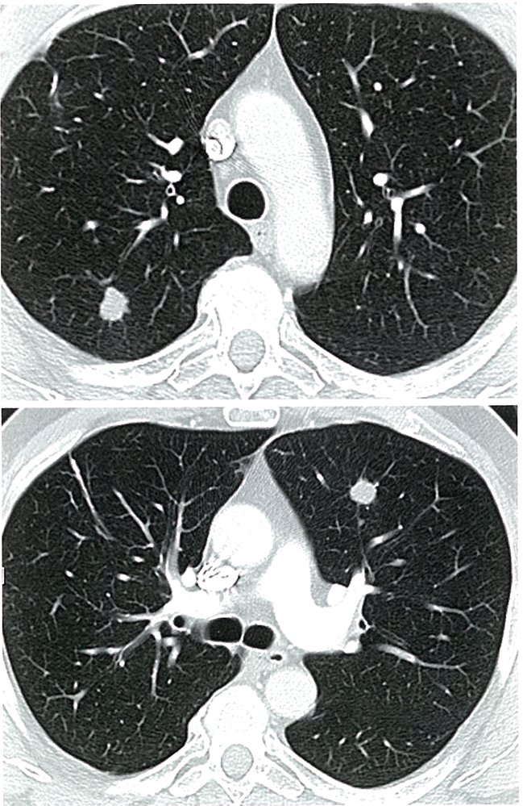

Lung metastases

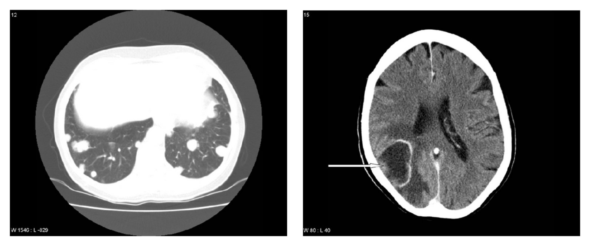

Lung and brain metastases following breast carcinoma

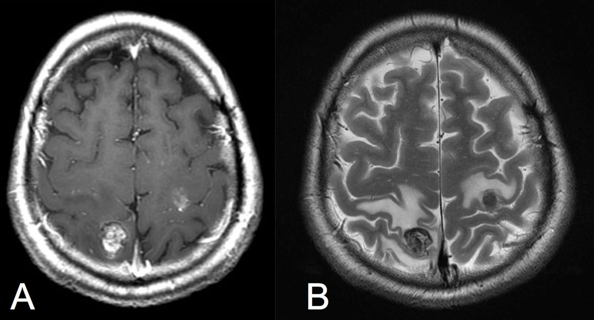

MRI brain with metastatic lesions

---

## Pathology

### Noninvasive <u>carcinomas</u>

#### <u>DCIS</u>

* Enlarged ducts lined with atypical <u>epithelium</u>

* <u>Neoplastic</u> cells within ductal lumen

* Intact basal membrane

* Microcalcifications

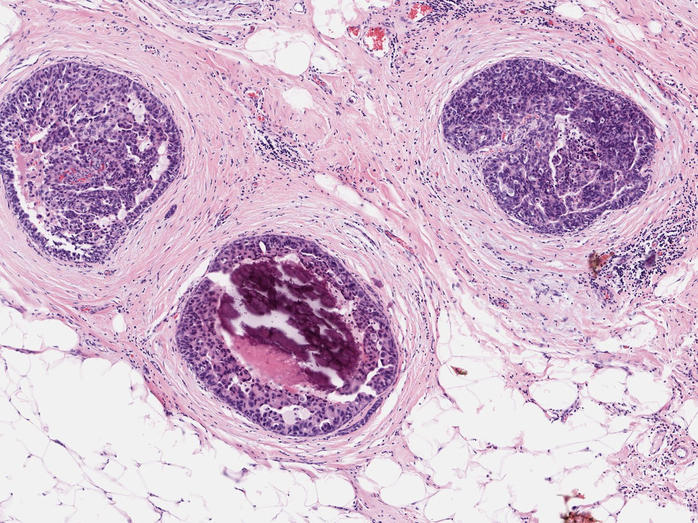

Ductal carcinoma in situ

##### <u>Comedocarcinoma</u>

* Cells with high-grade <u>nuclei</u>

* Extensive central <u>caseous necrosis</u>

* <u>Dystrophic</u> calcifications

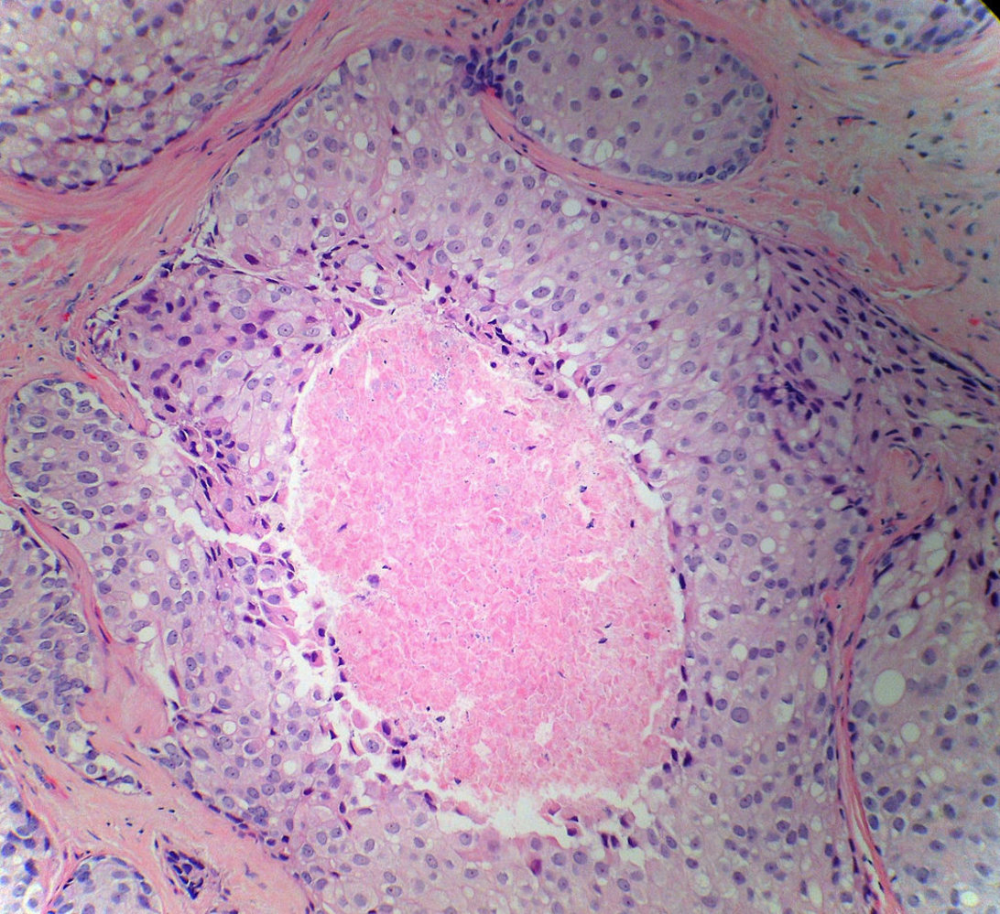

Comedocarcinoma

### Invasive <u>carcinomas</u>

#### Invasive ductal

* Findings

* Disorganized, small, duct-like glandular cells with stromal invasion (<u>desmoplastic stroma</u>)

* <u>Fibrosis</u> of surrounding tissue

* Microcalcifications

* Subtypes

* Tubular

* Well-differentiated tubular structures without myoepithelium

* Stromal invasion (radial pattern)

* <u>Mucinous</u>

* Well circumscribed <u>tumor</u>

* Copious extracellular mucus

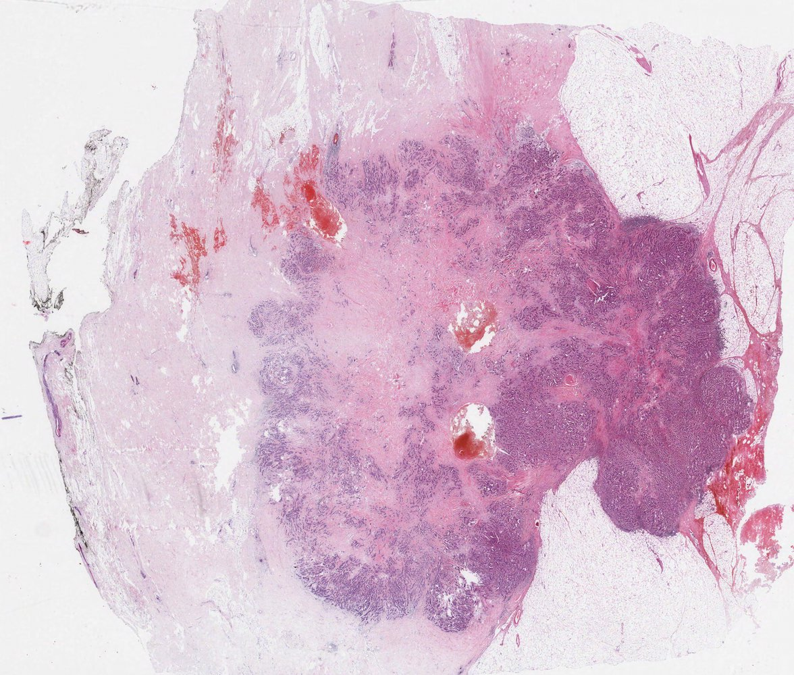

Invasive ductal carcinoma of the breast

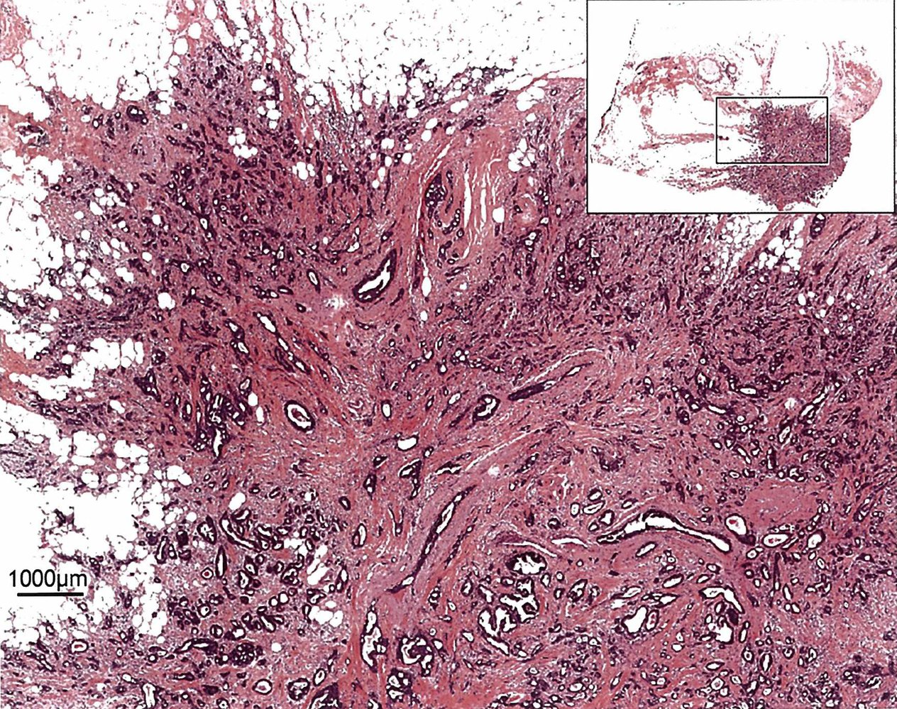

Invasive breast carcinoma of no special type (invasive ductal carcinoma) 1/3

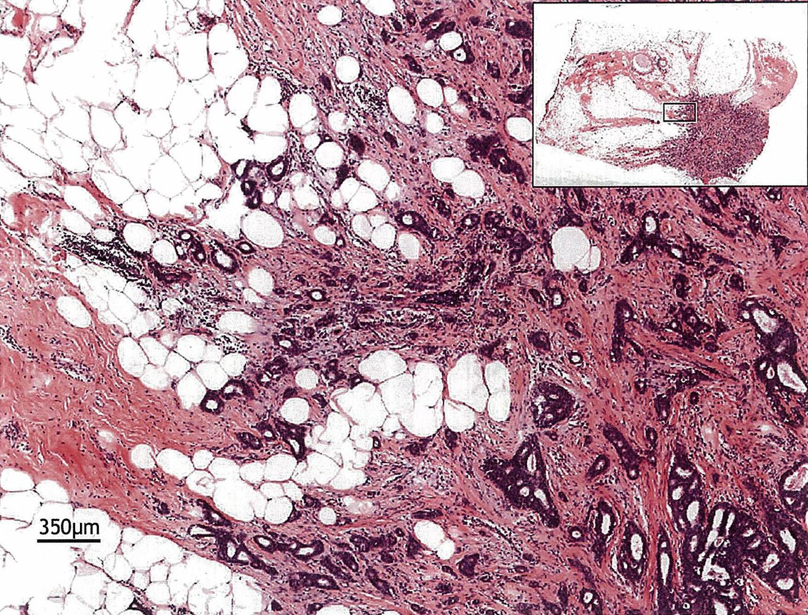

Invasive breast carcinoma of no special type (invasive ductal carcinoma) 2/3

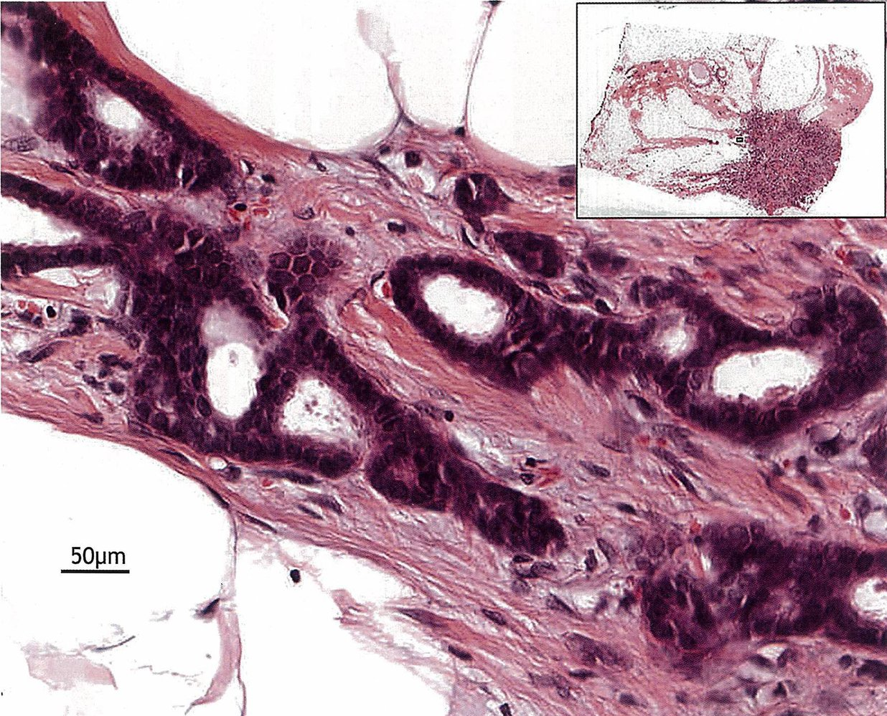

Invasive breast carcinoma of no special type (invasive ductal carcinoma) 3/3

##### Medullary <u>carcinoma</u>

* Well circumscribed, rapidly growing <u>tumor</u> (can mimic <u>fibroadenoma</u>)

* Large, poorly differentiated cells with <u>syncytial</u> growth involving <u>lymphocytic</u> and <u>plasma cell</u> infiltration

#### Invasive lobular

* Malignant cells in lobules

* Monomorphic cells in a single file pattern due to a decrease in <u>E-cadherin</u> expression

* Absence of new duct formation

* Often without <u>desmoplastic</u> response

> [!NOTE]
> In INvasive Lobular <u>carcinoma</u>, <u>neoplastic</u> cells arranged IN Lines.

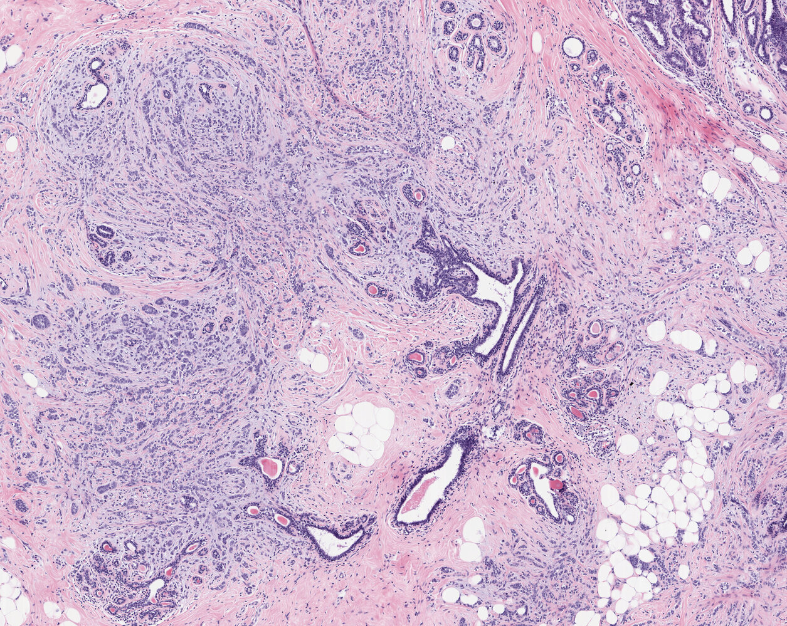

Invasive lobular carcinoma of the breast

### Subtypes and variants

#### Inflammatory <u>carcinoma</u>

* <u>Dermal</u> lymphatic invasion and angioinvasion

* Rapid growth

* No mass formation

#### <u>Paget disease of the breast</u>

* <u>Paget cells</u> (large, round cells with clear halo and prominent <u>nuclei</u>) form an intraepithelial <u>adenocarcinoma</u>.

* Extend up the <u>lactiferous ducts</u> and into the <u>skin</u> of the <u>nipple</u>

---

## Treatment

### Overview [[15]](https://coursology-qbank.com/amboss/article/P4cWjc0)[[37]](https://coursology-qbank.com/amboss/article/medVzK0)

<u>Breast</u> cancer treatment is multidisciplinary, involving <u>surgery</u>, <u>radiation therapy</u>, and systemic therapy (<u>chemotherapy</u>, endocrine therapy, <u>targeted therapy</u>), alone or in combination. The choice of treatment regimen is based on the <u>tumor stage</u>, grade, <u>receptor</u> status, and patient preference.

#### <u>Ductal carcinoma in situ</u> (<u>DCIS</u>)

* <u>Breast-conserving surgery</u> (<u>BCS</u>) and adjuvant radiation; or <u>mastectomy</u>

* <u>SLNB</u> at the time of <u>surgery</u> as needed

* Adjuvant endocrine therapy for HR+ <u>breast</u> cancer

#### Nonmetastatic invasive <u>breast</u> cancer (M0)

* Surgical resection of <u>tumor</u> (<u>BCS</u> and adjuvant radiation; or <u>mastectomy</u>)

* Appropriate axillary staging and management

* <u>Neoadjuvant</u> and/or adjuvant systemic therapy based on <u>tumor</u> <u>receptor</u> status

* Adjuvant radiation as needed

#### <u>Metastatic</u> <u>breast</u> cancer (M1)

* Systemic therapy tailored to the subtype of <u>breast</u> cancer and <u>menopause</u> status [[45]](https://coursology-qbank.com/amboss/article/Tfd6l60)

* Palliative <u>surgery</u> and/or <u>radiation therapy</u> as needed for symptom management

> [!WARNING]
> Patients aged ≤ 35 years or those who are <u>premenopausal</u> and known carriers of the <u>BRCA mutation</u> require a risk assessment, counseling, and consideration for <u>risk-reducing interventions for breast cancer</u>. [[37]](https://coursology-qbank.com/amboss/article/medVzK0)

> [!TIP]
> Supraclavicular and/or internal mammary nodal disease are managed with systemic therapy and <u>radiation therapy</u>. [[46]](https://coursology-qbank.com/amboss/article/Q4cuQc0)

### Reproductive care considerations for <u>premenopausal</u> patients

* Systemic therapy for <u>breast</u> cancer impacts <u>fertility</u>; refer patients who wish to have children to a <u>fertility</u> specialist to consider options for <u>fertility preservation</u>. [[37]](https://coursology-qbank.com/amboss/article/medVzK0)

* <u>Contraception</u>

* All <u>premenopausal</u> patients with <u>breast</u> cancer should receive <u>contraception counseling</u> at diagnosis and follow-up visits. [[47]](https://coursology-qbank.com/amboss/article/TTd6J60)

* In patients with current or past history of <u>breast</u> cancer: [[47]](https://coursology-qbank.com/amboss/article/TTd6J60)[[48]](https://coursology-qbank.com/amboss/article/pidLsp0)[[49]](https://coursology-qbank.com/amboss/article/tB1Xcj0)

* <u>Hormonal contraceptives</u> are contraindicated.

* <u>Nonhormonal contraception</u> (e.g., <u>copper IUD</u>) is preferred.

> [!TIP]
> Several <u>breast</u> cancer treatment modalities are <u>teratogenic</u>. Advise patients to use <u>contraception</u> during treatment. [[37]](https://coursology-qbank.com/amboss/article/medVzK0)

---

## Surgical resection of tumor and breast reconstruction

* Techniques to remove the primary <u>tumor</u> include <u>BCS</u> and <u>mastectomy</u>.  [[15]](https://coursology-qbank.com/amboss/article/P4cWjc0)

* Axillary staging and management are typically performed at the time of <u>surgery</u>.

* <u>Breast reconstruction surgery</u> may also be performed at the time of <u>tumor</u> resection or at a later date. [[50]](https://coursology-qbank.com/amboss/article/gVdFFK0)

### Breast-conserving surgery (<u>BCS</u>) [[15]](https://coursology-qbank.com/amboss/article/P4cWjc0)[[37]](https://coursology-qbank.com/amboss/article/medVzK0)[[51]](https://coursology-qbank.com/amboss/article/04ce3c0)

<u>BCS</u> is the removal of <u>breast</u> cancer with clear <u>surgical margins</u> and preservation of most of the <u>breast</u> tissue (i.e., a <u>wide local excision</u> of <u>breast</u> cancer).  [[30]](https://coursology-qbank.com/amboss/article/rwcf4e0)[[51]](https://coursology-qbank.com/amboss/article/04ce3c0)

* Indications

* Nonmetastatic <u>breast</u> cancer

* <u>DCIS</u>

* Contraindications

* Absolute

* Unlikely to achieve negative <u>surgical margins</u> and acceptable cosmesis with <u>BCS</u>

* Multicentric tumors

* Extensive microcalcifications on imaging

* <u>Inflammatory breast cancer</u>

* Early <u>pregnancy</u>

* Relative

* Large <u>tumor</u>-to-<u>breast</u> volume <u>ratio</u>

* <u>Relative contraindications</u> to <u>adjuvant radiation therapy</u> (e.g., history of chest radiation, certain <u>collagen vascular diseases</u>)

> [!TIP]
> Resection of the <u>nipple</u>-areolar complex is not a contraindication for <u>BCS</u>, and it may be performed even in individuals with subareolar tumors. [[52]](https://coursology-qbank.com/amboss/article/X2d9T60)

### Mastectomy [[37]](https://coursology-qbank.com/amboss/article/medVzK0)[[53]](https://coursology-qbank.com/amboss/article/b4cH3c0)

<u>Mastectomy</u> is the removal of the entire <u>breast</u> tissue and, depending on the specific procedure, possibly other structures, such as <u>lymph nodes</u> and the pectoralis muscles.

* Indications

* <u>Treatment of breast cancer</u> in patients with, e.g.:

* Contraindications to <u>BCS</u>

* Preference for <u>mastectomy</u>

* Recurrence following <u>BCS</u> and <u>radiotherapy</u>

* <u>Breast</u> cancer prophylaxis in high-risk patients (see “<u>Risk-reducing interventions for breast cancer</u>”)

|  Types of <u>mastectomy</u> [[54]](https://coursology-qbank.com/amboss/article/1Vd2tK0)  |  |
| --- | --- |
|  | Description |
| Total mastectomy |   * Removal of the entire <u>breast</u>, <u>nipple</u>-areolar complex, and underlying pectoralis <u>fascia</u>  * The <u>lymph nodes</u> and pectoralis muscles are spared.    |
| Skin-sparing mastectomy |   * Removal of <u>breast</u> tissue and the <u>nipple</u>-areolar complex  * Most of the overlying <u>skin</u> is spared, facilitating immediate <u>breast reconstruction</u>.    |
| Nipple-sparing mastectomy |   * Variation of <u>skin-sparing mastectomy</u>  * Removal of <u>breast</u> tissue with sparing of the <u>nipple</u>-areolar complex    |
| Radical mastectomy |   * Excision of the entire <u>breast</u>, <u>pectoralis major</u>, <u>pectoralis minor</u>, and overlying <u>skin</u> with:  * <u>ALND</u>  * Excision of the <u>long thoracic nerve</u> and thoracodorsal vessels  * Largely replaced by less extensive procedures    |
| Modified radical mastectomy |   * Excision of the entire <u>breast</u>, underlying pectoralis <u>fascia</u>, and level I and II <u>axillary lymph nodes</u>  * The pectoralis muscles and level III <u>axillary lymph nodes</u> are spared.    |
| Double mastectomy |   * Simultaneous removal of both <u>breasts</u>  * May be considered as a prophylactic measure in women with: [[55]](https://coursology-qbank.com/amboss/article/QCcu7e0)[[56]](https://coursology-qbank.com/amboss/article/VVdGtK0)  * Increased risk for <u>breast</u> cancer (e.g., <u>BRCA mutation</u>)  * Unilateral <u>breast</u> cancer who also wish to remove the <u>contralateral</u> <u>breast</u>    |

### Breast reconstruction [[50]](https://coursology-qbank.com/amboss/article/gVdFFK0)[[57]](https://coursology-qbank.com/amboss/article/1md2eq0)

* <u>Breast reconstruction surgery</u> may be performed at the time of <u>tumor</u> resection (immediate reconstruction) or at a later date (delayed reconstruction).

* Reconstructive procedures include:

* After <u>lumpectomy</u>: <u>breast</u> lift and/or <u>breast reduction surgery</u> to shape the <u>breast</u> using remaining <u>breast</u> tissue

* After <u>mastectomy</u>

* Implant-based <u>breast reconstruction</u>: Removed <u>breast</u> tissue is replaced with a prosthetic device.

* <u>Autologous</u> <u>breast reconstruction</u>: Removed <u>breast</u> tissue is replaced with tissue from the patient.

* Use <u>shared decision-making</u> to discuss reconstructive options.

* Potential benefits of <u>breast reconstruction surgery</u> after <u>mastectomy</u> compared with <u>mastectomy</u> alone include improved: [[58]](https://coursology-qbank.com/amboss/article/Rmdl2q0)

* Psychosocial and sexual well-being

* Body image

* Risks of reconstructive options should always be reviewed with patients; see “<u>Complications of breast implants</u>.”

#### Breast implants [[50]](https://coursology-qbank.com/amboss/article/gVdFFK0)[[57]](https://coursology-qbank.com/amboss/article/1md2eq0)

* <u>Breast implants</u> are prosthetic devices that consist of a silicone shell filled with silicone gel or saline.

* Implants are not expected to last a lifetime, but there is no formal guidance on the timing of implant removal.  [[57]](https://coursology-qbank.com/amboss/article/1md2eq0)[[59]](https://coursology-qbank.com/amboss/article/pmdLgq0)

* Patients with <u>breast implants</u> should continue to receive <u>breast cancer screening</u> based on their risk for cancer.

##### Silicone-filled implants

* Compared to saline-filled implants, silicone-filled implants:

* Feel more similar to natural <u>breast</u> tissue

* Have a lower rate of capsular <u>contracture</u>

* Regular screening for implant rupture is recommended. [[57]](https://coursology-qbank.com/amboss/article/1md2eq0)[[60]](https://coursology-qbank.com/amboss/article/6mdjgq0)

* Ruptures of silicone-filled implants are often silent (i.e., no noticeable changes on examination).

* Screening is recommended 5–6 years after implant placement, then every 2–3 years. [[57]](https://coursology-qbank.com/amboss/article/1md2eq0)[[60]](https://coursology-qbank.com/amboss/article/6mdjgq0)

* Screening modalities include <u>breast</u> <u>MRI</u> and <u>ultrasound</u>.

> [!TIP]
> Asymptomatic individuals who have silicone-filled <u>breast implants</u> should be regularly screened for silent implant rupture. [[57]](https://coursology-qbank.com/amboss/article/1md2eq0)[[60]](https://coursology-qbank.com/amboss/article/6mdjgq0)

> [!WARNING]
> While most silicone-filled implant ruptures are asymptomatic, silicone from a ruptured implant can leak into surrounding <u>breast</u> tissue and cause <u>pain</u>, <u>breast</u> lumps, or changes in <u>breast</u> shape. [[57]](https://coursology-qbank.com/amboss/article/1md2eq0)[[59]](https://coursology-qbank.com/amboss/article/pmdLgq0)

##### Saline-filled implants

* Implant rupture is easily identifiable (implant deflation).

* In an implant leak or rupture, saline is absorbed by the body.

> [!TIP]
> Individuals who have saline-filled <u>breast implants</u> do not need to undergo screening for silent rupture. [[57]](https://coursology-qbank.com/amboss/article/1md2eq0)

##### Complications of breast implants [[57]](https://coursology-qbank.com/amboss/article/1md2eq0)

Some complications may necessitate the removal of the <u>breast implant</u>; refer to plastic <u>surgery</u> as needed for complete evaluation and appropriate management.

* Acute complications

* <u>Pain</u>

* <u>Seroma</u> or <u>hematoma</u>

* <u>Delayed wound healing</u>

* <u>Breast implant infection</u>

* Chronic complications

* Capsular <u>contracture</u> causing <u>pain</u> and/or <u>breast</u> distortion

* Implant rupture or leak

* Implant-associated <u>malignancy</u> (rare): a <u>malignancy</u> arising in the pericapsular <u>scar</u> tissue adjacent to <u>breast implants</u> and distinct from <u>breast</u> cancer [[61]](https://coursology-qbank.com/amboss/article/hmdc2q0)

* <u>Breast implant-associated squamous cell carcinoma</u>

* <u>Breast implant-associated anaplastic large cell lymphoma</u>

* Other <u>lymphomas</u>

* <u>Breast implant illness</u>

> [!TIP]
> <u>Breast implants</u> are medical devices; reporting associated complications to the <u>FDA</u> is encouraged.

> [!TIP]
> Although complications associated with <u>breast implants</u> are uncommon, preprocedural counseling should include information on alternative options for <u>breast reconstruction</u> (e.g., <u>autologous</u> tissue reconstruction) and details on the risks and follow-up care for <u>breast implants</u>, including the possible need for implant removal. [[57]](https://coursology-qbank.com/amboss/article/1md2eq0)[[61]](https://coursology-qbank.com/amboss/article/hmdc2q0)

---

## Management of axillary lymph nodes

### Overview [[22]](https://coursology-qbank.com/amboss/article/PPcWUc0)[[37]](https://coursology-qbank.com/amboss/article/medVzK0)[[46]](https://coursology-qbank.com/amboss/article/Q4cuQc0)

Axillary staging and management should only be performed if results will affect management.

|  <u>Axillary staging in breast cancer</u> [[22]](https://coursology-qbank.com/amboss/article/PPcWUc0)[[37]](https://coursology-qbank.com/amboss/article/medVzK0)[[46]](https://coursology-qbank.com/amboss/article/Q4cuQc0)  |  |
| --- | --- |
| Modality | Indications |
|  <u>Sentinel lymph node biopsy</u> (<u>SLNB</u>) [[21]](https://coursology-qbank.com/amboss/article/T4c6ic0)  |   * Early-stage <u>breast</u> cancer with no palpable <u>axillary lymph nodes</u> (T1/T2, N0)  * Selected patients with <u>DCIS</u>    |
|  <u>Axillary lymph node dissection</u> (<u>ALND</u>) [[62]](https://coursology-qbank.com/amboss/article/i4cJQc0)  |   * Early-stage <u>breast</u> cancer (T1/T2) with:  * ≥ 3 positive <u>lymph nodes</u> on <u>SLNB</u>  * Palpable <u>biopsy</u>-confirmed axillary <u>lymph node</u> involvement in patients not receiving <u>neoadjuvant chemotherapy</u>  * Persistently palpable <u>axillary lymph nodes</u> after <u>neoadjuvant chemotherapy</u>  * Large or locally advanced <u>breast</u> cancer (T3/T4) [[22]](https://coursology-qbank.com/amboss/article/PPcWUc0)  * <u>Inflammatory breast cancer</u>    |
|  Observation [[46]](https://coursology-qbank.com/amboss/article/Q4cuQc0)  |   * Limited <u>life expectancy</u>  * Age ≥ 70 years with HR+/<u>ERBB2</u>+ early-stage <u>breast</u> cancer and no palpable <u>lymph nodes</u>  * <u>DCIS</u> in patients undergoing <u>BCS</u>  * <u>Breast</u> <u>sarcoma</u> or <u>phyllodes tumor</u>  * Individuals undergoing <u>prophylactic mastectomy</u>    |

### Management of <u>axillary lymph nodes</u> in early-stage <u>breast</u> cancer (T1/T2) [[22]](https://coursology-qbank.com/amboss/article/PPcWUc0)[[37]](https://coursology-qbank.com/amboss/article/medVzK0)[[46]](https://coursology-qbank.com/amboss/article/Q4cuQc0)

#### No palpable <u>lymph nodes</u> on examination

* Complete <u>neoadjuvant chemotherapy</u> if planned. [[22]](https://coursology-qbank.com/amboss/article/PPcWUc0)

* Perform <u>SLNB</u>.

* ≥ 3 positive sentinel <u>lymph nodes</u> on <u>biopsy</u>: <u>ALND</u> and axillary radiation are recommended.

* No or ≤ 2 positive sentinel <u>lymph nodes</u>: Consider axillary radiation as needed.

#### Palpable <u>axillary lymph nodes</u>

* Confirm <u>lymph node</u> involvement on image-guided <u>FNA</u> or <u>CNB</u>.

* <u>Biopsy</u>-confirmed <u>lymph node</u> involvement:

* Consider <u>neoadjuvant chemotherapy</u> to downstage the <u>axilla</u>.

* Palpable <u>lymph nodes</u> after <u>neoadjuvant chemotherapy</u>: Perform <u>ALND</u> followed by axillary <u>radiation therapy</u>.

* No palpable <u>lymph nodes</u> after <u>neoadjuvant chemotherapy</u>: <u>SLNB</u> may be appropriate.

* Patients not receiving <u>neoadjuvant chemotherapy</u>: Perform <u>ALND</u>.

> [!TIP]
> <u>ALND</u> is associated with significant complications, including <u>lymphedema</u>, and has largely been replaced by <u>SLNB</u> in the management of early-stage <u>breast</u> cancer. [[37]](https://coursology-qbank.com/amboss/article/medVzK0)

> [!WARNING]
> <u>SLNB</u> is not recommended before the completion of <u>neoadjuvant chemotherapy</u>. [[22]](https://coursology-qbank.com/amboss/article/PPcWUc0)[[46]](https://coursology-qbank.com/amboss/article/Q4cuQc0)

---

## Radiation therapy

* Indications

* <u>Adjuvant radiation therapy</u> is indicated for:

* <u>DCIS</u> and early-stage <u>breast</u> cancer in patients with nodal involvement disease or patients who have undergone <u>BCS</u>

* Locally advanced <u>breast</u> cancer

* Palliative <u>radiation therapy</u>: as needed for individuals with <u>metastatic</u> <u>breast</u> cancer

* Sites of radiation administration : [[15]](https://coursology-qbank.com/amboss/article/P4cWjc0)[[22]](https://coursology-qbank.com/amboss/article/PPcWUc0)[[64]](https://coursology-qbank.com/amboss/article/X4c93c0)

* Partial or whole <u>breast</u>

* Locoregional <u>lymph nodes</u>

* <u>Chest wall</u>

> [!TIP]
> <u>Radiation therapy</u> is contraindicated during <u>pregnancy</u>. [[65]](https://coursology-qbank.com/amboss/article/hfdcN60)

> [!TIP]
> <u>Radiation therapy</u> is performed after the completion of <u>chemotherapy</u> in patients requiring both of these modalities as <u>adjuvant treatment</u>. [[37]](https://coursology-qbank.com/amboss/article/medVzK0)

---

## Systemic therapy

* Systemic therapy can be given as <u>neoadjuvant</u> and/or <u>adjuvant therapy</u> in combination with other treatment modalities. [[15]](https://coursology-qbank.com/amboss/article/P4cWjc0)[[30]](https://coursology-qbank.com/amboss/article/rwcf4e0)[[66]](https://coursology-qbank.com/amboss/article/q4cC4c0)

* The choice of therapy is based on <u>tumor</u> characteristics.

* HR+ tumors: endocrine therapy with or without <u>chemotherapy</u>

* <u>ERBB2</u>+ tumors: targeted immunotherapy and <u>chemotherapy</u>

* <u>Triple-negative breast cancer</u>: <u>chemotherapy</u>

> [!TIP]
> Patients with <u>ERBB2</u>+/HR+ tumors should receive both endocrine therapy and targeted immunotherapy. [[31]](https://coursology-qbank.com/amboss/article/gddF6K0)

### <u>Chemotherapy</u> [[15]](https://coursology-qbank.com/amboss/article/P4cWjc0)[[30]](https://coursology-qbank.com/amboss/article/rwcf4e0)[[31]](https://coursology-qbank.com/amboss/article/gddF6K0)

* Indications

* <u>Triple-negative</u> <u>breast</u> cancer with <u>tumor</u> size ≥ 0.5 cm

* <u>ERBB2</u>+ <u>breast</u> cancer (adjunct to <u>targeted therapy</u>)

* HR+/<u>ERBB2</u>- <u>breast</u> cancer (adjunct to endocrine therapy in selected patients)

* Positive <u>lymph nodes</u>

* <u>Tumor</u> size > 2 cm

* Agents

* Typically include <u>anthracyclines</u> (e.g., <u>adriamycin</u>, <u>doxorubicin</u>) and/or <u>taxanes</u> (e.g., <u>docetaxel</u>, <u>paclitaxel</u>)

* Example regimens: [[15]](https://coursology-qbank.com/amboss/article/P4cWjc0)

* <u>Adriamycin</u>/<u>cyclophosphamide</u>

* <u>Docetaxel</u>/<u>cyclophosphamide</u>

* <u>Cyclophosphamide</u>/<u>methotrexate</u>/<u>5-FU</u>

> [!TIP]
> PARP inhibitors (e.g., <u>olaparib</u>, <u>talazoparib</u>) disrupt cellular <u>DNA damage</u> repair and can be used to treat <u>ERBB2</u>- or <u>triple-negative</u> <u>metastatic</u> or high-risk <u>breast</u> cancer in patients with <u>BRCA mutations</u>. [[15]](https://coursology-qbank.com/amboss/article/P4cWjc0)[[67]](https://coursology-qbank.com/amboss/article/kfdmm60)

> [!TIP]
> Genomic testing can help guide decisions on whether to include <u>chemotherapy</u> as part of treatment. [[15]](https://coursology-qbank.com/amboss/article/P4cWjc0)[[30]](https://coursology-qbank.com/amboss/article/rwcf4e0)[[68]](https://coursology-qbank.com/amboss/article/I4cYkc0)

### Endocrine therapy [[15]](https://coursology-qbank.com/amboss/article/P4cWjc0)[[30]](https://coursology-qbank.com/amboss/article/rwcf4e0)

* Indications

* HR+ tumors

* <u>Chemoprevention</u> in patients at high risk of <u>breast</u> cancer

* Goal: suppression of <u>hormone</u>-induced <u>tumor</u> growth to decrease the risk of <u>breast</u> cancer or its recurrence

* First-line agents: anti-<u>estrogen</u> therapy; generally administered for 5–10 years [[15]](https://coursology-qbank.com/amboss/article/P4cWjc0)

* <u>Premenopausal</u> patients with HR+ <u>breast</u> cancer

* <u>Tamoxifen</u>

* OR <u>GnRH agonists</u> (e.g., <u>leuprolide</u> acetate, <u>goserelin</u>) to induce ovarian suppression;   PLUS either <u>tamoxifen</u> or an <u>aromatase inhibitor</u>

* <u>Postmenopausal</u> patients with HR+ <u>breast</u> cancer

* <u>Tamoxifen</u>

* OR <u>aromatase inhibitors</u> (e.g., <u>anastrozole</u>, <u>exemestane</u>, <u>letrozole</u>)

* <u>Chemoprevention</u> for high-risk patients: See “<u>Risk-reducing interventions for breast cancer</u>.”

> [!TIP]
> The first-line management for <u>metastatic</u> HR+/<u>ERBB2</u>- <u>breast</u> cancer is typically endocrine therapy in combination with <u>CDK4</u>/6 inhibitors (e.g., <u>abemaciclib</u>, <u>palbociclib</u>), which arrest <u>the cell cycle</u>. [[15]](https://coursology-qbank.com/amboss/article/P4cWjc0)[[45]](https://coursology-qbank.com/amboss/article/Tfd6l60)

### ERBB2-targeted therapy [[15]](https://coursology-qbank.com/amboss/article/P4cWjc0)[[30]](https://coursology-qbank.com/amboss/article/rwcf4e0)

<u>ERBB2-targeted therapy</u> includes <u>ERBB2</u> <u>antibodies</u> (e.g., <u>trastuzumab</u>, <u>pertuzumab</u>) and <u>tyrosine kinase inhibitors</u> (e.g., <u>lapatinib</u>, neratinib).

* Indication: all <u>ERBB2</u>+ tumors

* First-line agent: trastuzumab

* A humanized <u>monoclonal antibody</u> against the <u>ERBB2</u> <u>tyrosine kinase receptor</u>; used in the treatment of <u>ERBB2</u>+ <u>breast</u> and <u>gastric cancer</u> [[69]](https://coursology-qbank.com/amboss/article/84cOOc0)[[70]](https://coursology-qbank.com/amboss/article/bedHxK0)

* Mechanism of action: targets <u>c-erbB2</u> <u>tyrosine kinase receptor</u> → ↓ of <u>ERBB2</u>-initiated cellular signaling and ↑ <u>antibody</u>-dependent cytotoxicity → ↓ <u>tumor</u> growth

* Adverse effects: cardiotoxicity (e.g., <u>dilated cardiomyopathy</u> with systolic <u>CHF</u>)   [[71]](https://coursology-qbank.com/amboss/article/Xed9xK0)

* Other agents: <u>pertuzumab</u>, <u>ado-trastuzumab emtansine</u>, neratinib, <u>lapatinib</u>

> [!NOTE]
> Trastuzumab causes <u>dilated cardiomyopathy</u>: Trust <u>HER2</u> enlarge your <u>heart</u>.

> [!TIP]
> <u>Echocardiography</u> should be performed before, during, and after treatment with <u>trastuzumab</u>. [[72]](https://coursology-qbank.com/amboss/article/cedaBK0)

---

## Complications

### Cancer-associated complications

* <u>Malignant pleural effusion</u>: affects 7–11% of all individuals with <u>breast</u> cancer [[74]](https://coursology-qbank.com/amboss/article/QybuUw)

* <u>Paraneoplastic syndromes</u>

* Recurrence occurs in ∼ 40% of all cases. [[75]](https://coursology-qbank.com/amboss/article/RyblUw)

> [!TIP]
> Recurrence typically occurs in the first five years after completion of treatment.

### Treatment-associated complications

#### <u>Long thoracic nerve</u> damage

* Intraoperative complication during <u>radical mastectomy</u>

* Causes <u>winged scapula</u>, which may lead to muscle disorders and shoulder, neck, and upper <u>back pain</u>

#### Secondary <u>lymphedema</u> of the arm [[76]](https://coursology-qbank.com/amboss/article/4yb32w)

* Etiology

* Surgical intervention and/or radiation in the axillary region

* The frequency of <u>lymphedema</u> varies depending on the treatment modality.

* <u>Lumpectomy</u> alone: 3%

* <u>Total mastectomy</u> PLUS axillary radiation: ∼ 15%

* <u>ALND</u> PLUS axillary radiation: 21–51%

* <u>Risk factors</u>

* Location of the <u>tumor</u> in the upper outer quadrant

* <u>ALND</u>

* Radiation after <u>ALND</u>

* Clinical features

* Immobility of the limb, swelling, feeling of tightness

* ↑ Risk of infection

* ↓ Wound healing

* Cosmetic disfigurement

* Diagnostics: <u>clinical diagnosis</u>

* Review of medical and surgical history

* <u>Skin inspection</u> and palpation; assessment of tissue consistency and <u>skin</u> mobility

* Measurement of volume and girth

* Treatment

* <u>Hyperbaric oxygen therapy</u>

* Low-level laser therapy

* Microsurgical lymphatic-venous <u>anastomoses</u>

* Complete decongestive therapy

* <u>Manual lymph drainage</u>

* Compression

* Complications: <u>angiosarcoma of the breast</u> (see below)

#### Secondary malignancies

* <u>Angiosarcoma of the breast</u>

* Rare <u>malignancy</u> that is sometimes referred to as <u>lymphangiosarcoma</u> or <u>hemangiosarcoma</u>, depending on whether it arises from lymphatic or <u>capillary</u> <u>endothelial</u> cells

* Results from chronic <u>lymphedema</u> in patients who have undergone <u>lymphadenectomy</u> and/or <u>radiation therapy</u>

* Manifests with multiple blue/purple, macular, and <u>papular</u> lesions in the area of the <u>breast</u>, <u>chest wall</u>, and/or upper extremity

* <u>Endometrial cancer</u>: risk increased by <u>tamoxifen</u> therapy

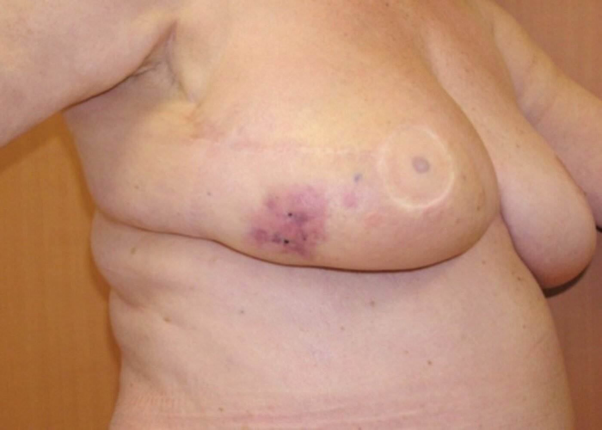

Radiation-induced angiosarcoma of the breast

We list the most important complications. The selection is not exhaustive.

---

## Special patient groups

### Breast cancer in pregnancy

<u>Breast</u> cancer occurs in about 1 in 3000 pregnant women. [[77]](https://coursology-qbank.com/amboss/article/r2dfQ60)

#### Management [[65]](https://coursology-qbank.com/amboss/article/hfdcN60)[[78]](https://coursology-qbank.com/amboss/article/Sfdyl60)

* The risks and benefits of treatment options for the mother and fetus should be considered and discussed with the patient.

* If <u>breast</u> cancer is diagnosed in the <u>first trimester</u>, discuss the option of terminating the <u>pregnancy</u>.

* Diagnosis, staging, and management options are similar to those for <u>breast</u> cancer in nonpregnant individuals, with some modifications for fetal safety such as:

* Use of <u>ultrasound</u> or noncontrast <u>MRI</u> for staging instead of <u>x-ray</u> or CT

* <u>Mastectomy</u> may be preferred over <u>BCS</u>.

* <u>ALND</u> may be preferred over <u>SLNB</u>.

* There is a paucity of data on the safety of systemic therapy for the fetus.

* <u>Chemotherapy</u> is contraindicated in the <u>first trimester</u> but may be considered in the second and third trimesters. [[79]](https://coursology-qbank.com/amboss/article/gfdFl60)

* Endocrine therapy and <u>ERBB2-targeted therapy</u> are contraindicated during <u>pregnancy</u>. [[80]](https://coursology-qbank.com/amboss/article/J2dsi60)

> [!WARNING]
> <u>Radiation therapy</u>, endocrine therapy, and <u>ERBB2-targeted therapy</u> are contraindicated during <u>pregnancy</u>. [[65]](https://coursology-qbank.com/amboss/article/hfdcN60)

> [!WARNING]
> <u>Breastfeeding</u> is not recommended if patients are receiving <u>ERBB2-targeted therapy</u> or endocrine therapy. [[81]](https://coursology-qbank.com/amboss/article/q2dCi60)

### Male breast cancer [[82]](https://coursology-qbank.com/amboss/article/Xkc9mc0)[[83]](https://coursology-qbank.com/amboss/article/lfdvm60)

<u>Male breast cancer</u> is rare (∼ 1% of all <u>breast</u> cancers) and typically manifests as a painless retroareolar mass with or without <u>skin</u> or <u>nipple</u> changes. Invasive HR+/<u>ERBB2</u>- <u>breast</u> cancer is the most common subtype in men.

#### <u>Risk factors</u>

* <u>BRCA mutation</u> (most important <u>risk factor</u>)

* Radiation exposure

* Elevated <u>estrogen</u> (e.g., <u>Klinefelter syndrome</u>, <u>chronic liver disease</u>, <u>obesity</u>)

#### Diagnostics

* Imaging for a <u>breast mass</u>

* Age < 25 years: <u>breast ultrasound</u>

* Age ≥ 25 years: <u>mammography</u>

* Diagnostic confirmation: <u>CNB</u>

* Staging and <u>receptor</u> testing: same as for female <u>breast</u> cancer

* Consider <u>genetic counseling</u> and <u>genetic testing</u> for all male individuals with <u>breast</u> cancer.

#### Treatment

The treatment approach is similar to that for women with <u>breast</u> cancer.

* Nonmetastatic <u>breast</u> cancer: <u>mastectomy</u> with <u>SLNB</u> or <u>ALND</u> followed by <u>adjuvant therapy</u> as indicated

* <u>Metastatic</u> <u>breast</u> cancer

* HR+/<u>ERBB2</u>- <u>breast</u> cancer

* First-line: endocrine therapy

* <u>CDK inhibitors</u> or <u>mTOR inhibitors</u> may also be considered in combination with endocrine therapy.

* <u>Chemotherapy</u>

> [!TIP]
> In patients with HR+ <u>male breast cancer</u>, endocrine therapy with <u>tamoxifen</u> is preferred. For all patients with <u>ERBB2</u>+ <u>breast</u> cancer, <u>ERBB2-targeted therapy</u> is indicated. [[82]](https://coursology-qbank.com/amboss/article/Xkc9mc0)

> [!TIP]
> <u>Male breast cancer</u> is typically diagnosed at an advanced stage and is associated with a poorer prognosis than <u>breast</u> cancer in women. [[84]](https://coursology-qbank.com/amboss/article/I2dYQ60)

#### Follow-up [[84]](https://coursology-qbank.com/amboss/article/I2dYQ60)

* Regular <u>clinical examination</u> to assess for recurrence or <u>metastasis</u>

* Imaging

* Patients who have undergone <u>BCS</u>: annual <u>ipsilateral</u> <u>mammogram</u> (if feasible)

* Patients with a genetic predisposition for <u>breast</u> cancer: Consider an annual <u>contralateral</u> <u>mammogram</u>.

#### Screening [[84]](https://coursology-qbank.com/amboss/article/I2dYQ60)[[85]](https://coursology-qbank.com/amboss/article/RfdlN60)

* Routine screening is not recommended.

* Individuals with known <u>BRCA mutations</u>

* Annual <u>screening for breast cancer</u> with <u>clinical breast examination</u> starting at 35 years of age [[85]](https://coursology-qbank.com/amboss/article/RfdlN60)

* In patients with <u>gynecomastia</u>, consider screening with annual bilateral <u>mammogram</u> starting at age 50 years or 10 years before the earliest onset of <u>breast</u> cancer in the family, whichever is earlier. [[85]](https://coursology-qbank.com/amboss/article/RfdlN60)

---

## Prognosis

### Prognostic factors [[86]](https://coursology-qbank.com/amboss/article/n2d7R60)

#### Stage at diagnosis

The most important prognostic factor is the <u>breast</u> <u>cancer stage</u> at time of diagnosis. Earlier stages have a significantly better prognosis than late stages.

* <u>Tumor</u> size

* Large tumors have a less favorable prognosis because they are associated with higher rates of recurrence.

* Positive <u>correlation</u> between <u>tumor</u> size and number of involved <u>lymph nodes</u>

* Lymphatic spread: Axillary <u>lymph node</u> status is the one of most important prognostic factors.

* Distant <u>metastasis</u>: Distant <u>metastasis</u> limited to bone has a more favorable prognosis than <u>visceral</u> or <u>brain metastasis</u>. [[15]](https://coursology-qbank.com/amboss/article/P4cWjc0)

* Histological <u>tumor grade</u>: High-grade tumors are associated with aggressive progression.

* <u>Receptor</u> status

* HR- <u>breast</u> cancer has a poorer prognosis than HR+ <u>breast</u> cancer.

* <u>ERBB2</u>+ tumors show aggressive growth and <u>metastasize</u> quickly compared to <u>ERBB2</u>- tumors.

* <u>Triple-negative</u> disease is associated with a poor prognosis.

> [!TIP]
> HR+/<u>ERBB2</u>- <u>breast</u> cancer has the best prognosis.

> [!TIP]
> <u>ERBB2</u>+ cancers demonstrate more aggressive <u>tumor</u> growth and higher recurrence rates and are, therefore, associated with a poor prognosis. However, since the development of <u>targeted therapy</u> with <u>trastuzumab</u>, the prognosis for patients with <u>ERBB2</u>+ cancers has improved.

#### Other prognostic factors

* Advanced age

* <u>Aneuploidy</u>

* Interval between initial diagnosis and development of <u>metastatic</u> recurrence [[15]](https://coursology-qbank.com/amboss/article/P4cWjc0)

* <u>Patient performance status</u>

* Black race

> [!TIP]
> In the US, <u>breast</u> cancer in Black individuals is associated with a poorer prognosis than in White individuals because of a higher <u>incidence</u> of <u>triple-negative</u> and HR- <u>breast</u> cancer and disparities in access to appropriate and timely health care. [[86]](https://coursology-qbank.com/amboss/article/n2d7R60)

### Survival [[87]](https://coursology-qbank.com/amboss/article/K2dUi60)

|  Survival of <u>breast</u> cancer patients [[87]](https://coursology-qbank.com/amboss/article/K2dUi60) |  |  |  |
| --- | --- | --- | --- |
| SEER stage | AJCC/<u>UICC</u> | Description | 5-year survival rate |
| Localized |   * Stage I  * Stage IIa    |   * Localized <u>tumor</u> (< 5 cm)  * ≤ 3 nodes involved, including the sentinel <u>lymph node</u>    |  * 99%   |
| Regional |   * Stage IIb  * Stages IIIa–IIIc    |   * Large <u>tumor</u> (> 5 cm)  * Regional <u>lymph node</u> involvement  * No distant <u>metastases</u>    |  * 86%   |
| Distant |  * Stage IV   |  * Distant <u>metastases</u>   |  * 31%   |

---

## Screening

### Approach

The following recommendations are for screening asymptomatic individuals. The diagnostic approach to patients with <u>breast</u> symptoms (e.g., <u>palpable breast mass</u>, <u>nipple discharge</u>) is detailed in separate articles. [[88]](https://coursology-qbank.com/amboss/article/uWdpMK0)[[89]](https://coursology-qbank.com/amboss/article/c7Yakq)[[90]](https://coursology-qbank.com/amboss/article/ckca5c0)

* Consider risk assessment for <u>breast</u> cancer in all women by the age of 25 years. [[90]](https://coursology-qbank.com/amboss/article/ckca5c0)[[91]](https://coursology-qbank.com/amboss/article/0ddeoK0)[[92]](https://coursology-qbank.com/amboss/article/SedyyK0)

* Initiate age- and risk-appropriate <u>breast cancer screening</u>.

* Benign features on <u>breast</u> imaging (i.e., <u>BI-RADS 1–2</u>): Continue routine age- and risk-appropriate screening. [[25]](https://coursology-qbank.com/amboss/article/Ru1lIi0)

* Inconclusive features or features concerning for <u>malignancy</u> detected on initial imaging:

* Further imaging may be needed (e.g., <u>diagnostic mammography</u> after <u>screening mammography</u>). [[93]](https://coursology-qbank.com/amboss/article/4ed3_K0)

* All lesions suspicious for <u>malignancy</u> (e.g., <u>BI-RADS 4–5</u>) should be biopsied; image-guided <u>core needle biopsy</u> is preferred. [[25]](https://coursology-qbank.com/amboss/article/Ru1lIi0)

* <u>Biopsy</u>-proven <u>breast</u> cancer: See “Diagnostics” for further workup.

### Risk assessment [[90]](https://coursology-qbank.com/amboss/article/ckca5c0)[[91]](https://coursology-qbank.com/amboss/article/0ddeoK0)[[92]](https://coursology-qbank.com/amboss/article/SedyyK0)

There is a lack of standardized recommendations for <u>breast</u> cancer risk assessment; consider the following approach.

* Assess all women for <u>risk factors for breast cancer</u> by the age of 25 years.

* Consider further risk assessment in individuals with <u>risk factors for breast cancer</u> using a validated tool.

* Tailor <u>screening recommendations</u> to the lifetime risk of <u>breast</u> cancer. [[94]](https://coursology-qbank.com/amboss/article/MVdMEK0) 

* Average risk: < 15% lifetime risk of <u>breast</u> cancer

* Intermediate risk: 15–20% lifetime risk of <u>breast</u> cancer

* High risk: ≥ 20% lifetime risk of <u>breast</u> cancer

> [!TIP]
> Refer individuals with a high risk of <u>breast</u> cancer to specialists (e.g., oncologist, genetic counselor) for individualized <u>screening recommendations</u> and consideration of <u>risk-reducing interventions for breast cancer</u>. [[92]](https://coursology-qbank.com/amboss/article/SedyyK0)

> [!TIP]
> There is no standard approach to screening individuals at intermediate risk for <u>breast</u> cancer. Tailor screening frequency and modality to individual <u>risk factors</u>. [[94]](https://coursology-qbank.com/amboss/article/MVdMEK0)

### Individuals at average risk [[88]](https://coursology-qbank.com/amboss/article/uWdpMK0)[[89]](https://coursology-qbank.com/amboss/article/c7Yakq)[[90]](https://coursology-qbank.com/amboss/article/ckca5c0)[[94]](https://coursology-qbank.com/amboss/article/MVdMEK0)

These individuals do not have a <u>high-risk condition for breast cancer</u> but may have other <u>risk factors for breast cancer</u>.

#### Screening modalities

* Recommended: <u>screening mammography</u>

* Not routinely recommended

* Supplemental <u>MRI</u>: may be considered in women with dense <u>breasts</u> and a normal <u>screening mammogram</u>  [[88]](https://coursology-qbank.com/amboss/article/uWdpMK0)[[91]](https://coursology-qbank.com/amboss/article/0ddeoK0)[[95]](https://coursology-qbank.com/amboss/article/NVd-uK0)

* <u>Clinical breast examination</u> (<u>CBE</u>): generally not recommended for individuals at average risk of <u>breast</u> cancer  [[88]](https://coursology-qbank.com/amboss/article/uWdpMK0)[[89]](https://coursology-qbank.com/amboss/article/c7Yakq)[[90]](https://coursology-qbank.com/amboss/article/ckca5c0)

> [!TIP]
> <u>Mammography</u> is considered safe during <u>pregnancy</u> because it uses only a small amount of focused radiation on the <u>breast</u> tissue. The use of a lead shield effectively minimizes fetal radiation exposure.

> [!TIP]
> Lactation is not a contraindication for <u>screening mammography</u>. Recommend <u>breastfeeding</u> or pumping immediately before performing <u>mammography</u> to minimize the effect of lactation on findings. [[93]](https://coursology-qbank.com/amboss/article/4ed3_K0)

#### <u>Screening recommendations</u>

Recommendations vary; use shared-decision making.

| Breast cancer screening for individuals at average risk |  |  |  |
| --- | --- | --- | --- |
|  |  <u>USPSTF</u> (2024) [[88]](https://coursology-qbank.com/amboss/article/uWdpMK0)  |  <u>ACS</u> (2015) [[89]](https://coursology-qbank.com/amboss/article/c7Yakq)  |  <u>ACOG</u> (2017; reaffirmed in 2021) [[90]](https://coursology-qbank.com/amboss/article/ckca5c0)  |
| <u>Screening recommendations</u> |  * 40–74 years of age: <u>mammography</u> every 2 years   |   * 40–44 years of age: option to start screening with annual <u>mammography</u>  * 45–54 years of age: annual <u>mammography</u>  * ≥ 55 years of age: <u>mammography</u> every 1–2 years    |   * 40–49 years of age: option to start screening with <u>mammography</u> every 1–2 years  * 50–75 years of age: <u>mammography</u> every 1–2 years    |
| Discontinuation of screening |  * ≥ 75 years of age   |  * Discontinue screening in individuals with expected <u>life expectancy</u> < 10 years.   |  * ≥ 75 years of age: Consider discontinuing screening based on <u>shared decision-making</u> and <u>life expectancy</u>.   |

> [!TIP]
> For women with a <u>family history</u> of <u>breast</u> cancer, it is generally recommended to start <u>breast cancer screening</u> 10 years before the age of the earliest diagnosis in the family; but not before the age of 30 years. [[94]](https://coursology-qbank.com/amboss/article/MVdMEK0)

> [!TIP]
> Routine <u>breast</u> self-examination is not recommended for individuals at average risk of <u>breast</u> cancer, but these individuals should be counseled on <u>breast self-awareness</u> and advised to alert their physician if they notice any <u>breast</u> changes. [[89]](https://coursology-qbank.com/amboss/article/c7Yakq)[[90]](https://coursology-qbank.com/amboss/article/ckca5c0)

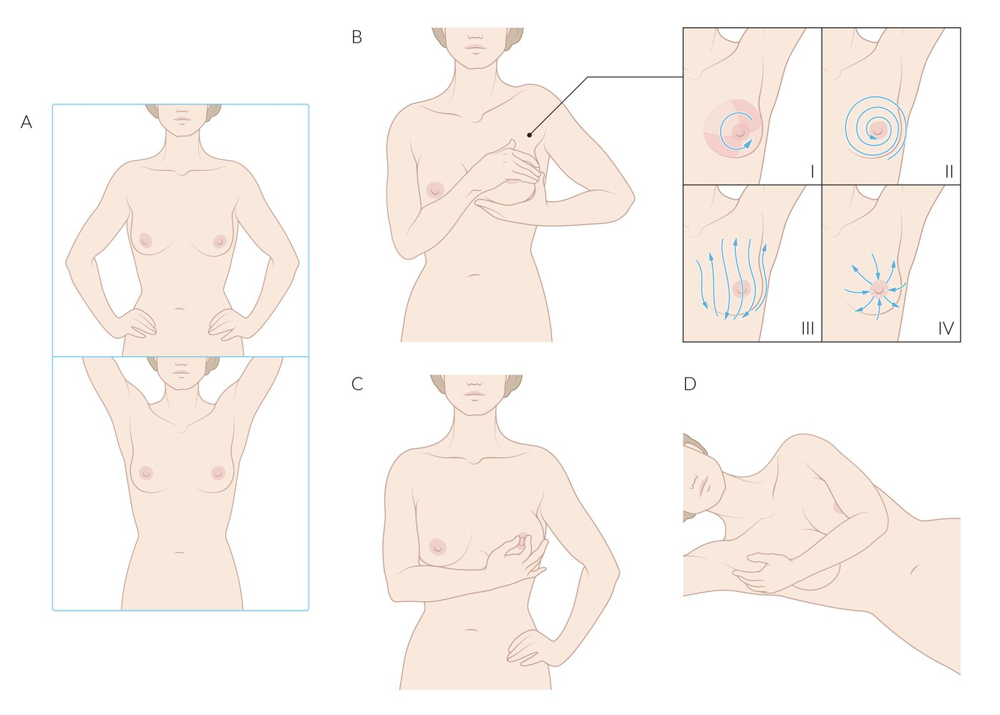

Breast self-examination

### Individuals at high risk [[96]](https://coursology-qbank.com/amboss/article/fkckMc0)[[97]](https://coursology-qbank.com/amboss/article/OWaIlj)

Individuals at high risk have any <u>high-risk condition for breast cancer</u> or a lifetime risk for <u>breast</u> cancer ≥ 20%;  based on risk assessment tools such as the BRCAPRO or Gail model.  [[91]](https://coursology-qbank.com/amboss/article/0ddeoK0)[[98]](https://coursology-qbank.com/amboss/article/9WdNnK0)[[99]](https://coursology-qbank.com/amboss/article/bddHoK0)

#### High-risk conditions for breast cancer [[89]](https://coursology-qbank.com/amboss/article/c7Yakq)[[91]](https://coursology-qbank.com/amboss/article/0ddeoK0)[[96]](https://coursology-qbank.com/amboss/article/fkckMc0)[[98]](https://coursology-qbank.com/amboss/article/9WdNnK0)

* Genetic predisposition, e.g.:

* Known <u>BRCA mutation</u>

* <u>First-degree relative</u> with a <u>BRCA mutation</u> and never tested for <u>BRCA mutation</u>

* Personal or <u>family history</u> of <u>hereditary cancer syndromes</u> (e.g., <u>Li-Fraumeni syndrome</u>, <u>Cowden syndrome</u>)

* History of chest radiation at a young age  [[100]](https://coursology-qbank.com/amboss/article/CWdqnK0)

* Previous invasive <u>breast</u> cancer or high-risk lesion on <u>biopsy</u>

> [!TIP]
> In individuals with a personal or <u>family history</u> of <u>BRCA</u>-related cancers, consider familial risk assessment tools (e.g., BRCAPRO or the Ontario <u>family history</u> assessment tool) to identify a genetic predisposition for <u>breast</u> cancer, and refer these individuals for <u>genetic counseling</u>. [[30]](https://coursology-qbank.com/amboss/article/rwcf4e0)[[55]](https://coursology-qbank.com/amboss/article/QCcu7e0)[[99]](https://coursology-qbank.com/amboss/article/bddHoK0)

#### <u>Screening recommendations</u> [[55]](https://coursology-qbank.com/amboss/article/QCcu7e0)[[91]](https://coursology-qbank.com/amboss/article/0ddeoK0)

Age to start screening, screening frequency, and screening modalities should be tailored to patient <u>risk factors</u>; ; consult a <u>breast</u> specialist.

|  Breast cancer screening for individuals at high risk [[55]](https://coursology-qbank.com/amboss/article/QCcu7e0)[[91]](https://coursology-qbank.com/amboss/article/0ddeoK0)  |  |
| --- | --- |
| Genetic predisposition to <u>breast</u> cancer |   * Age to start screening: between the ages of 25 and 29 years  * Screening modalities and frequency  * <u>CBE</u> every 6–12 months for women 25–29 years of age   [[55]](https://coursology-qbank.com/amboss/article/QCcu7e0)  * Annual <u>breast</u> <u>MRI</u> until 29 years of age  * Annual <u>breast</u> <u>MRI</u> plus <u>mammography</u> after ≥ 30 years of age   [[55]](https://coursology-qbank.com/amboss/article/QCcu7e0)    |
| Lifetime risk for <u>breast</u> cancer ≥ 20% |  |
|  History of chest radiation at a young age [[91]](https://coursology-qbank.com/amboss/article/0ddeoK0)[[100]](https://coursology-qbank.com/amboss/article/CWdqnK0)  |   * Age to start screening: 25 years of age or 8 years after completion of <u>radiotherapy</u>, whichever is later [[91]](https://coursology-qbank.com/amboss/article/0ddeoK0)[[100]](https://coursology-qbank.com/amboss/article/CWdqnK0)  * Screening modality and frequency: annual <u>breast</u> <u>MRI</u> plus <u>mammography</u>   [[100]](https://coursology-qbank.com/amboss/article/CWdqnK0)    |
|  Previous invasive <u>breast</u> cancer or high-risk lesion on <u>biopsy</u> [[73]](https://coursology-qbank.com/amboss/article/addQoK0)[[91]](https://coursology-qbank.com/amboss/article/0ddeoK0)  |  * See “<u>Surveillance after breast cancer treatment</u>.”   |

### <u>Transgender</u> individuals [[101]](https://coursology-qbank.com/amboss/article/gkcFMc0)

As data for this population remains sparse, recommendations vary and are mostly based on expert consensus.  [[101]](https://coursology-qbank.com/amboss/article/gkcFMc0)

#### <u>Transgender women</u>

* Average risk for <u>breast</u> cancer

* ≥ 5 years of <u>gender-affirming hormone therapy</u> (<u>GAHT</u>): Consider screening with <u>mammography</u> every 1–2 years, starting at 40 years of age.

* < 5 years of or no <u>GAHT</u>: Screening is not recommended.

* <u>High-risk condition for breast cancer</u>

* ≥ 5 years of <u>GAHT</u>: Consider annual <u>mammography</u> starting from 25–30 years of age.

* < 5 years of or no <u>GAHT</u>: Consider <u>screening mammography</u> based on individual <u>risk factors</u>.

#### <u>Transgender men</u>

* Prior <u>bilateral mastectomy</u> 

* The <u>ACR</u> does not recommend <u>screening for breast cancer</u> in this group of individuals. [[101]](https://coursology-qbank.com/amboss/article/gkcFMc0)

* Other societies suggest <u>breast cancer screening</u> be continued with an annual <u>physical examination</u>, <u>breast ultrasound</u>, or <u>breast</u> <u>MRI</u>. [[102]](https://coursology-qbank.com/amboss/article/HBXKX00)

* Prior <u>breast reduction surgery</u> or no <u>surgery</u>: Management is the same as for <u>cisgender</u> women, based on risk for <u>breast</u> cancer. [[88]](https://coursology-qbank.com/amboss/article/uWdpMK0)

---

## Risk-reducing interventions for breast cancer

<u>Breast cancer risk-reducing interventions</u> for individuals at high risk of <u>breast</u> cancer (e.g., known <u>BRCA mutations</u>) include <u>surgery</u> and <u>chemoprevention</u>.

* Prophylactic <u>surgery</u> [[55]](https://coursology-qbank.com/amboss/article/QCcu7e0)[[99]](https://coursology-qbank.com/amboss/article/bddHoK0)

* Bilateral <u>prophylactic mastectomy</u> [[103]](https://coursology-qbank.com/amboss/article/1dd2KK0)

* Bilateral <u>salpingo-oophorectomy</u>  [[99]](https://coursology-qbank.com/amboss/article/bddHoK0)

* <u>Chemoprevention</u>: usually prescribed for 5 years [[104]](https://coursology-qbank.com/amboss/article/q81Cni0)[[105]](https://coursology-qbank.com/amboss/article/F4cgOc0)[[106]](https://coursology-qbank.com/amboss/article/wTdhG60)

* <u>Premenopausal</u> women ≥ 35 years of age at high risk: <u>tamoxifen</u>  [[99]](https://coursology-qbank.com/amboss/article/bddHoK0)[[104]](https://coursology-qbank.com/amboss/article/q81Cni0)

* <u>Postmenopausal</u> women at high risk

* <u>Selective estrogen receptor modulators</u>: <u>tamoxifen</u> or <u>raloxifene</u>  [[104]](https://coursology-qbank.com/amboss/article/q81Cni0)

* <u>Aromatase inhibitors</u>: <u>anastrozole</u> or <u>exemestane</u> [[105]](https://coursology-qbank.com/amboss/article/F4cgOc0)

> [!WARNING]
> <u>Raloxifene</u> and <u>aromatase inhibitors</u> should not be used for <u>breast</u> cancer risk reduction in <u>premenopausal</u> women. [[105]](https://coursology-qbank.com/amboss/article/F4cgOc0)[[106]](https://coursology-qbank.com/amboss/article/wTdhG60)

---