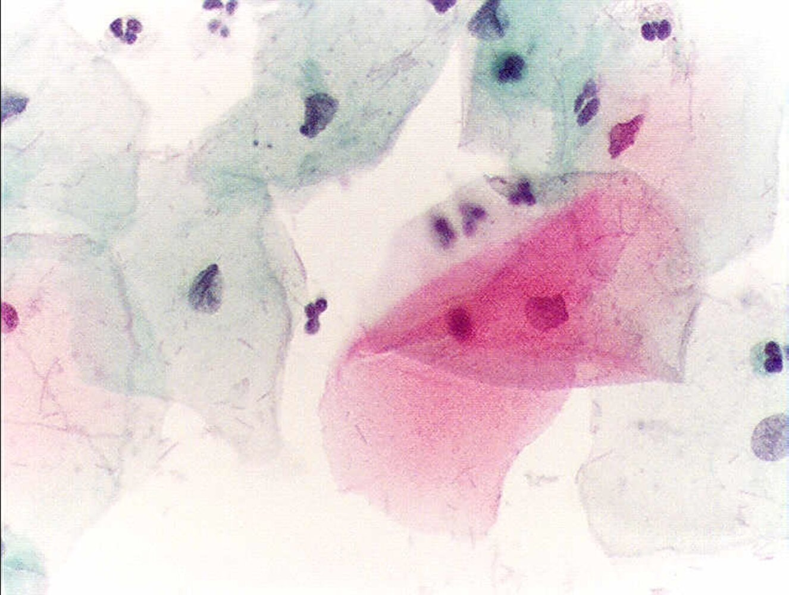
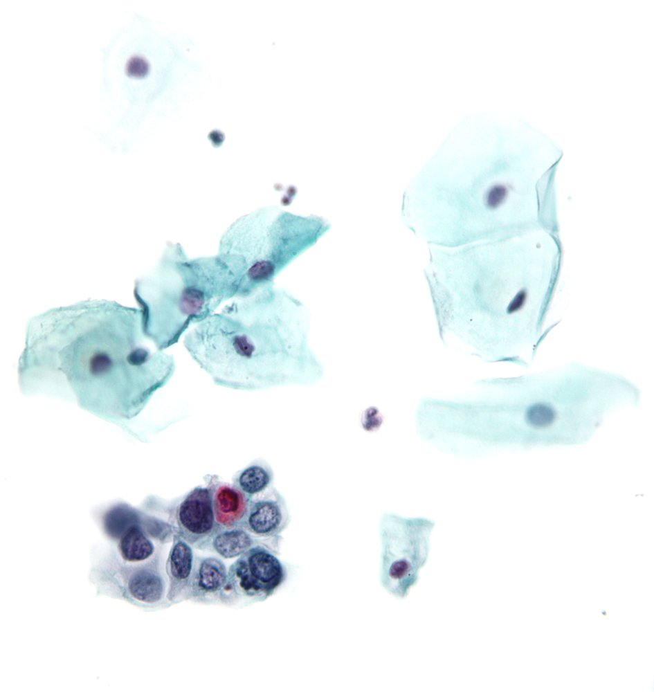
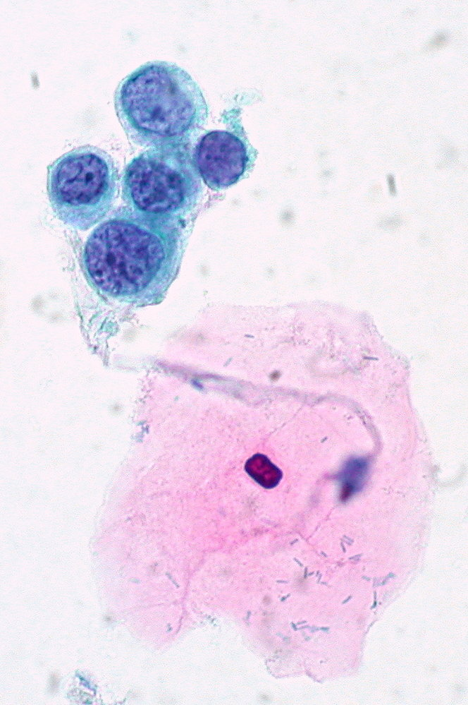
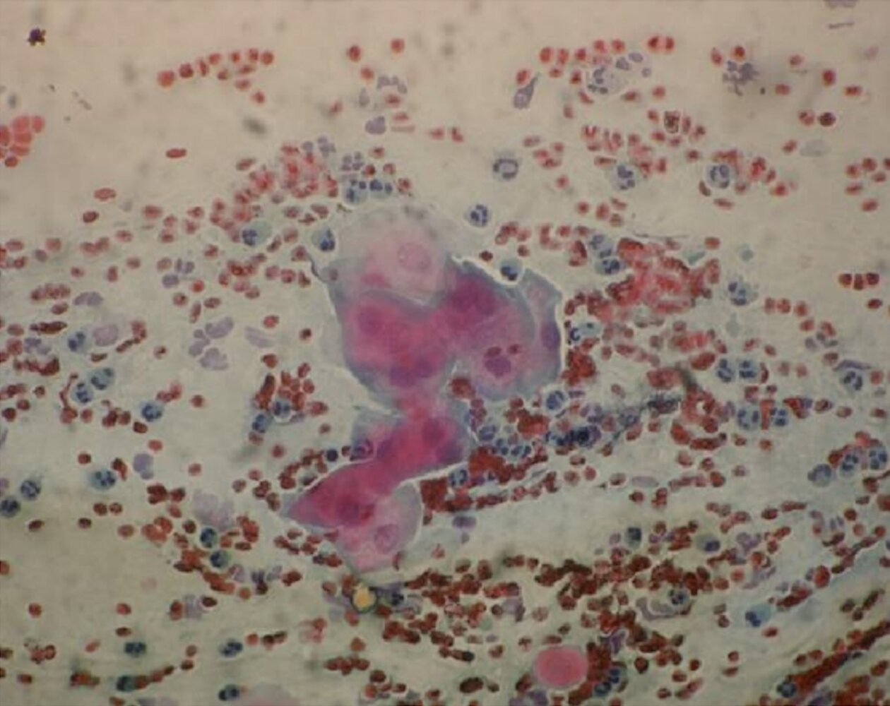
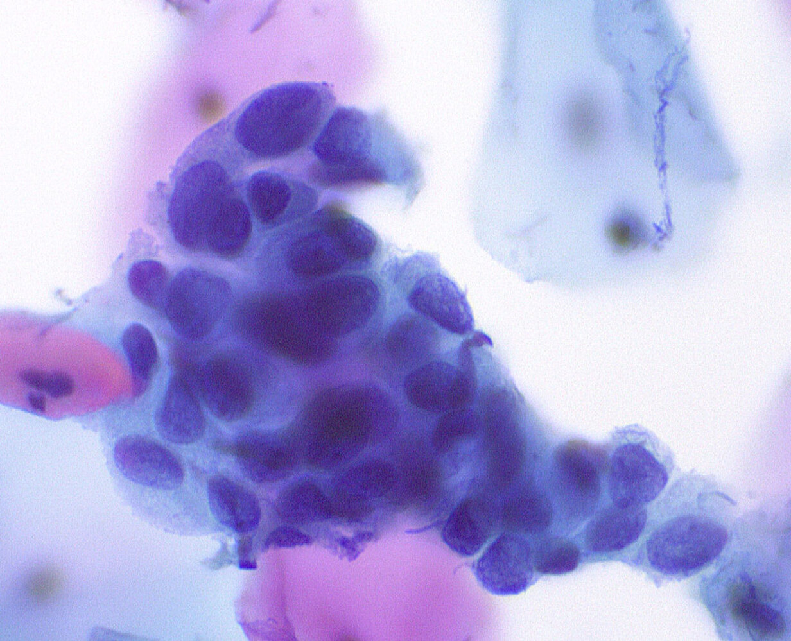

# Cervical cancer screening

*Categories: Clinical knowledge > Obstetrics/gynecology > Neoplastic disorders > Cervical cancer screening*

[Original Article Link](https://coursology-qbank.com/amboss/article/880Oo3)

---

## Summary

<u>Cervical cancer</u> is the third most common cancer of the female genital tract in the US. Persistent infection with any <u>high-risk HPV genotype</u> is the most common cause of <u>cervical cancer</u>. <u>HPV immunization</u>, <u>counseling on safe sex practices</u>, and screening for <u>cervical cancer</u> are the most effective prevention measures. All asymptomatic individuals with a <u>cervix</u> between the ages of 21–65 years of age are at increased risk of <u>cervical cancer</u> and should be screened at regular intervals (the age to initiate screening is a point of debate; the American Cancer Society recommends initiating screening at 25 years of age). Screening modalities include <u>primary HPV testing</u>, <u>cytology-alone screening</u>, and <u>HPV/Pap cotesting</u>. <u>Endocervical sampling</u> and <u>p16 immunohistochemistry</u> may be considered in select situations. Management of abnormalities detected on screening has shifted away from a result-based approach to an individualized risk-based approach. There are some exceptions to the risk-based approach (e.g., abnormalities detected in individuals < 25 years of age, certain <u>cytology</u> results). Management options include <u>expedited treatment</u> (e.g., with <u>conization</u>, <u>LEEP</u>, laser <u>cone biopsy</u>), diagnostic excision (i.e., colposcopic <u>biopsy</u>), and surveillance. Individuals with high-grade precursor lesions remain at high risk of developing <u>invasive cervical cancer</u> even after treatment and should be followed up for recurrence for at least 25 years after management.

<u>Invasive cervical cancer</u> is detailed in a separate article.

---

## Cervical cancer precursors

* Precancerous lesions of the <u>cervix</u> are noninvasive <u>dysplastic</u> lesions that can progress to <u>invasive cervical cancer</u>. [[1]](https://coursology-qbank.com/amboss/article/8W1OMf0)[[2]](https://coursology-qbank.com/amboss/article/o7105R0)

* They are typically asymptomatic and detected on <u>cervical cancer</u> screening.

* Precursor for squamous cell <u>carcinoma of the cervix</u>: squamous intraepithelial <u>neoplasia</u> (SIL) or <u>cervical intraepithelial neoplasia</u> (<u>CIN</u>)

* Precursor for <u>adenocarcinoma</u> of the <u>cervix</u>: <u>endocervical adenocarcinoma in situ</u> (<u>AIS</u>)

---

## Pathology

### Overview of terminology [[1]](https://coursology-qbank.com/amboss/article/8W1OMf0)[[2]](https://coursology-qbank.com/amboss/article/o7105R0)

#### Two-tiered terminology (<u>Bethesda system</u>)

A unified system of reporting histological and cytological samples of all squamous intraepithelial lesions (SIL) of the anogenital tract.

* <u>High-grade squamous intraepithelial lesion</u> (HSIL)

* Lesions with moderate to severe <u>epithelial</u> <u>dysplasia</u> that are most likely associated with persistent <u>HPV infection</u>

* <u>HSIL</u> lesions can progress to <u>invasive cervical cancer</u> (precancerous lesion).

* <u>Low-grade squamous intraepithelial lesion</u> (LSIL)

* Lesions with mild <u>epithelial</u> <u>dysplasia</u> that are typically associated with transient <u>HPV infections</u>

* Correlates with <u>CIN1</u>

#### Three-tiered terminology

* Cervical intraepithelial neoplasia;  (<u>CIN</u>) is characterized by <u>epithelial</u> <u>dysplasia</u> that begins at the basal layer of the <u>squamocolumnar junction</u> and extends outward.

* Based on the degree of <u>dysplasia</u>, lesions are classified as <u>CIN1</u> (mild), <u>CIN2</u> (moderate), or <u>CIN3</u> (severe).

#### Current standard

The current standard for reporting cervical <u>histopathology</u> and <u>cytopathology</u> to ensure optimal management is a combination of the two-tier and three-tier system (i.e., the two-tiered nomenclature with an additional qualifier using the intraepithelial <u>neoplasia</u> nomenclature).

* <u>LSIL</u> correlates with <u>CIN1</u>.

* <u>HSIL</u> correlates with <u>CIN3</u> and p16 positive <u>CIN2</u>.

* <u>HSIL</u> should be specified as <u>HSIL</u> (<u>CIN2</u>), <u>HSIL</u> (<u>CIN3</u>), or <u>HSIL</u> unspecified.

### Cervical cytology findings [[1]](https://coursology-qbank.com/amboss/article/8W1OMf0)

| Grading of cytological abnormalities |  Bethesda system for reporting cervical cytology [[1]](https://coursology-qbank.com/amboss/article/8W1OMf0)[[3]](https://coursology-qbank.com/amboss/article/lR1vMg0)[[4]](https://coursology-qbank.com/amboss/article/NR1-Mg0)  |  |
| --- | --- | --- |
|  | Characteristic features |  |
|  Low-grade cervical cytology [[5]](https://coursology-qbank.com/amboss/article/BdXzHC)  | Negative for intraepithelial lesion or malignancy (<u>NILM</u>) |   * No malignant or premalignant changes  * Additional findings may be reported, e.g.:  * Organisms (e.g., <u>T. vaginalis</u>, <u>Candida</u> spp.)  * Benign-appearing <u>endometrial</u> cells   [[3]](https://coursology-qbank.com/amboss/article/lR1vMg0)  * Reactive changes    |
|  Atypical squamous cells of undetermined significance (<u>ASC-US</u>)   |  * Changes in squamous cells that do not qualify as squamous intraepithelial lesion (SIL) but are more significant than inflammatory or reactive changes.   |  |
|  Cytological LSIL    |   * Squamous cells with mild <u>dysplasia</u>  * Correlates with <u>CIN1</u> on <u>cervical histology</u> [[5]](https://coursology-qbank.com/amboss/article/BdXzHC)  * May resolve spontaneously or progress to <u>HSIL</u>    |  |
| High-grade cervical cytology |  Cytological HSIL    |   * Squamous cells with moderate to severe <u>dysplasia</u>  * Correlates with <u>CIN2</u> and <u>CIN3</u> on <u>cervical histology</u> [[5]](https://coursology-qbank.com/amboss/article/BdXzHC)  * May progress to <u>squamous cell carcinoma</u> (i.e., <u>carcinoma in situ</u>)    |
|  Atypical squamous cells likely to contain HSIL cells (<u>ASC-H</u>)   |   * Changes in squamous cells  * <u>HSIL</u> is not confirmed but cannot be excluded.  * Persistent <u>ASC-H</u> is considered a high-grade <u>cytology</u> result. [[5]](https://coursology-qbank.com/amboss/article/BdXzHC)    |  |
|  Atypical glandular cells (AGCs)   |  * Abnormalities detected in the <u>glandular epithelium</u> of the <u>cervix</u> or <u>endometrium</u>; these include:  * <u>Neoplasia</u>  * <u>Endocervical adenocarcinoma in situ</u>  * <u>Adenocarcinoma</u>   |  |

> [!TIP]
> <u>Endometrial</u> cells are typically a benign <u>cytology</u> finding but can suggest <u>endometrial</u> <u>neoplasia</u> in women ≥ 45 years of age. [[3]](https://coursology-qbank.com/amboss/article/lR1vMg0)[[5]](https://coursology-qbank.com/amboss/article/BdXzHC)

Pap smear (normal findings)

Pap smear showing low-grade dysplasia

Papanicolaou test showing HSIL

Pap smear showing severe dysplasia

Atypical squamous cells, cannot exclude high-grade squamous intraepithelial lesion (ASC-H)

Atypical glandular cells (AGC)

### Cervical histology findings [[1]](https://coursology-qbank.com/amboss/article/8W1OMf0)[[2]](https://coursology-qbank.com/amboss/article/o7105R0)

|  |  Reporting cervical <u>biopsy</u> [[1]](https://coursology-qbank.com/amboss/article/8W1OMf0)[[2]](https://coursology-qbank.com/amboss/article/o7105R0)  |  |  |
| --- | --- | --- | --- |
|  |  Two-tiered system  | Three-tiered system | Severity of cellular <u>proliferation</u> |
| Low-grade cervical histology |  Histological LSIL [[5]](https://coursology-qbank.com/amboss/article/BdXzHC)  | CIN1 |   * Mild <u>dysplasia</u>  * Changes are present in the lower third of the basal <u>epithelium</u>. [[1]](https://coursology-qbank.com/amboss/article/8W1OMf0)    |
|  High-grade cervical histology [[5]](https://coursology-qbank.com/amboss/article/BdXzHC)  | Histological HSIL |  p-16 positive CIN2      |   * Moderate <u>dysplasia</u>  * Changes are present in the lower one-third to two-thirds of the basal <u>epithelium</u>. [[1]](https://coursology-qbank.com/amboss/article/8W1OMf0)    |
|  CIN3    |   * Severe, irreversible <u>dysplasia</u> or squamous <u>carcinoma in situ</u>  * Changes are present in more than two-thirds of the basal <u>epithelium</u>.  * The <u>basement membrane</u> is still intact.    |  |  |
|  Endocervical adenocarcinoma in situ (<u>AIS</u>) |  |   * <u>Adenocarcinoma</u> in situ  * The <u>basement membrane</u> is still intact.    |  |
| <u>Invasive cervical cancer</u> |  |  |  * Invasion beyond the <u>basement membrane</u> of the cervical <u>epithelium</u>   |

> [!TIP]
> <u>Koilocytes</u> are <u>epithelial</u> cells with perinuclear halos that are <u>pathognomonic</u> of <u>HPV infection</u> and may be present from early <u>HPV infection</u>. [[1]](https://coursology-qbank.com/amboss/article/8W1OMf0)[[2]](https://coursology-qbank.com/amboss/article/o7105R0)

---

## Overview of screening recommendations

<u>Cervical cancer</u> screening should be performed in all individuals with a <u>cervix</u> (regardless of their <u>HPV vaccination</u> status or <u>sexual history</u>). This includes individuals who are pregnant, have same-sex partners, have a history of a supracervical <u>hysterectomy</u>, or are <u>transgender</u>.   [[6]](https://coursology-qbank.com/amboss/article/yZXdV9)[[7]](https://coursology-qbank.com/amboss/article/NSc--b0)[[8]](https://coursology-qbank.com/amboss/article/lScv-b0)[[9]](https://coursology-qbank.com/amboss/article/2NcT010)

* Goal: early detection and treatment of <u>cervical cancer precursors</u> [[6]](https://coursology-qbank.com/amboss/article/yZXdV9)[[10]](https://coursology-qbank.com/amboss/article/6LWjAN0)

* Initial screening modalities: <u>primary HPV test</u>, <u>cytology-alone screening</u>, and <u>HPV/Pap cotesting</u> [[5]](https://coursology-qbank.com/amboss/article/BdXzHC)[[6]](https://coursology-qbank.com/amboss/article/yZXdV9)[[7]](https://coursology-qbank.com/amboss/article/NSc--b0)[[9]](https://coursology-qbank.com/amboss/article/2NcT010)

* Screening modalities and intervals differ for individuals at average risk of <u>cervical cancer</u> and those with <u>high-risk conditions for cervical cancer</u>.

* See also “<u>Cervical cancer screening during pregnancy</u>” as needed.

### Average-risk individuals [[5]](https://coursology-qbank.com/amboss/article/BdXzHC)[[6]](https://coursology-qbank.com/amboss/article/yZXdV9)[[7]](https://coursology-qbank.com/amboss/article/NSc--b0)[[11]](https://coursology-qbank.com/amboss/article/O5WI4N0)

An overview of recommendations is described here. See “<u>Cervical cancer screening for individuals at average risk</u>” for details.

#### Recommended screening period

* 21–65 years of age

* The American Cancer Society recommends initiating screening at 25 years of age. [[6]](https://coursology-qbank.com/amboss/article/yZXdV9)

#### Management of abnormalities detected on screening

The “ASCCP Management Guidelines App & Web Application” can be used to estimate risk and determine the appropriate next steps; see “Tips & Links.”

* Women ≥ 25 years of age: Management is based on the individual's risk of having or developing <u>CIN3</u>+ (risk-based approach).

* High risk: <u>expedited treatment</u> (i.e., treatment without a preceding colposcopic <u>biopsy</u>)

* Low risk: colposcopic <u>biopsy</u> or surveillance

* Women < 25 years of age: A result-based approach is recommended.

* High-grade lesions: <u>colposcopy</u> and <u>biopsy</u> (<u>expedited treatment</u> is not recommended)

* Low-grade lesions: surveillance

#### <u>Management of abnormalities detected on cervical histology</u>

In women who undergo <u>colposcopy</u> and <u>biopsy</u> for abnormalities detected on screening, further management is determined by <u>cervical histology</u> results.

* <u>HSIL</u> (<u>CIN3</u>): Excisional treatment is recommended regardless of the patient's age.

* <u>HSIL</u> (<u>CIN2</u>) or <u>LSIL</u> (<u>CIN1</u>)

* Women < 25 years of age: surveillance

* Women ≥ 25 years of age: excisional treatment, diagnostic excision, or surveillance (depending on the test results)

#### Long-term follow-up

* Following treatment of a high-grade cervical lesion, surveillance should be continued for at least 25 years.

### High-risk individuals [[5]](https://coursology-qbank.com/amboss/article/BdXzHC)[[7]](https://coursology-qbank.com/amboss/article/NSc--b0)[[9]](https://coursology-qbank.com/amboss/article/2NcT010)

An overview of recommendations is described here. See “<u>Cervical cancer screening for individuals at high risk</u>” for details.

* High-risk conditions for cervical cancer include:

* <u>Immunocompromised state</u>

* Individuals living with <u>HIV infection</u>

* Individuals on <u>immunosuppressive therapy</u>

* <u>Solid organ transplant</u> recipient

* <u>Allogeneic stem cell transplant</u> recipient

* Exposure to <u>diethylstilbestrol</u> in utero

* Current or past abnormal cervical lesion

* Initiate screening within a year of penetrative <u>sexual activity</u>; in women living with <u>HIV</u>, start screening at the time of <u>HIV</u> diagnosis.

* Life-long screening is recommended.

---

## Screening modalities

### hrHPV genotyping [[5]](https://coursology-qbank.com/amboss/article/BdXzHC)[[6]](https://coursology-qbank.com/amboss/article/yZXdV9)[[12]](https://coursology-qbank.com/amboss/article/4MW3KN0)

* Cervical cells are collected (similar to <u>Pap smear</u> collection) and screened for <u>high-risk HPV</u> <u>genotypes</u> via <u>PCR</u>-based assays.

* Samples may be collected by the patient themselves (self-sampling) or as an office procedure.

* Findings

* <u>hrHPV</u> positive: active (transient or persistent) infection with one or more <u>high-risk HPV genotypes</u>

* <u>hrHPV</u> negative: no active infection with <u>high-risk HPV genotypes</u> at the time of testing

### Papanicolaou test (<u>Pap smear</u>/<u>cervical cytology</u>)

* A cytological test in which a cell sample from the <u>cervix</u> is stained with <u>Papanicolaou</u> dye and examined for cellular abnormalities, including precancerous changes

* Proper sample collection is essential.

* Findings are described under “<u>Cervical cytology findings</u>.”

#### Sample collection  [[6]](https://coursology-qbank.com/amboss/article/yZXdV9)[[9]](https://coursology-qbank.com/amboss/article/2NcT010)[[13]](https://coursology-qbank.com/amboss/article/fgWkuk0)

* Visualize the <u>cervix</u> (including the <u>cervical transformation zone</u>) using a sterile speculum.

* If needed, cleanse the <u>cervix</u> using a saline-soaked cotton swab.

* Insert the collection device in the external os. [[14]](https://coursology-qbank.com/amboss/article/VgWG8k0)

* An extended-tip spatula used in conjunction with an <u>endocervical</u> brush; or an <u>endocervical</u> broom can be used.

* A plastic device is preferred for <u>liquid-based cytology</u>.

* Rotate the device to scrape the <u>endocervix</u>, <u>ectocervix</u>, and the transition zone. [[13]](https://coursology-qbank.com/amboss/article/fgWkuk0)

* Extended-tip spatula and <u>endocervical</u> brush

* Insert the extended tip of the spatula into the <u>endocervix</u>, and gently rotate it 360° around the external os a few times (in one direction).

* Next, insert the <u>endocervical</u> brush into the <u>endocervical</u> canal and slowly rotate it 180° in one direction.

* <u>Endocervical</u> broom

* Insert the central bristles into the <u>endocervix</u>; ensure that the shorter bristles are in contact with the <u>ectocervix</u>.

* Rotate the broom 5 times in the same direction.

* Prepare the sample for staining with <u>Papanicolaou</u> dye.  [[7]](https://coursology-qbank.com/amboss/article/NSc--b0)

* Conventional <u>cytology</u>: Smear and fixate the sample on a labeled glass slide.

* Liquid-based cytology (LBC): Rinse the sample in the preservative medium.

> [!TIP]
> Conventional <u>cytology</u> should be performed 10–20 days after the first day of <u>menses</u>, while <u>liquid-based cytology</u> can be performed at any time. [[9]](https://coursology-qbank.com/amboss/article/2NcT010)

> [!TIP]
> If using a spatula in conjunction with an <u>endocervical</u> brush, both samples can be placed on a single slide or within a single vial of the preservative medium. [[13]](https://coursology-qbank.com/amboss/article/fgWkuk0)

### HPV/Pap cotesting [[5]](https://coursology-qbank.com/amboss/article/BdXzHC)[[6]](https://coursology-qbank.com/amboss/article/yZXdV9)

* A <u>cervical cancer</u> screening strategy in which both <u>cervical cytology</u> (<u>Pap smear</u>) and <u>HPV DNA testing</u> are performed.

* Findings [[5]](https://coursology-qbank.com/amboss/article/BdXzHC)

* Low-grade <u>cotest</u> result

* <u>HPV</u>-positive <u>LSIL</u>

* <u>HPV</u>-positive <u>ASC-US</u>

* <u>HPV</u>-positive <u>NILM</u> on two consecutive annual screens

* High-grade <u>cotest</u> result: any <u>high-grade cervical cytology</u> (regardless of <u>HPV test</u> result)

### Endocervical sampling [[12]](https://coursology-qbank.com/amboss/article/4MW3KN0)[[15]](https://coursology-qbank.com/amboss/article/PMWWKN0)

#### Indications [[15]](https://coursology-qbank.com/amboss/article/PMWWKN0)

* To identify <u>CIN2</u>+ in the following high-risk situations:

* High-grade <u>cytology</u> results 

* <u>Cytological HSIL</u>

* Atypical squamous cells that cannot exclude <u>HSIL</u>, <u>atypical glandular cells</u>, or <u>carcinoma</u>

* <u>HPV test</u> positive for <u>HPV 16</u> or <u>HPV 18</u>

* <u>Squamocolumnar junction</u> (SCJ) not fully visualized at <u>colposcopy</u>

* Individuals who were previously treated for suspected precancer

* Consider <u>endocervical sampling</u> in:

* Women ≥ 40 years of age who are undergoing <u>colposcopy</u>

* All patients with <u>CIN 2</u> who are opting for surveillance instead of treatment

#### Tools and procedure  [[15]](https://coursology-qbank.com/amboss/article/PMWWKN0)[[16]](https://coursology-qbank.com/amboss/article/Ar1RPR0)

* <u>Endocervical</u> curette: Circumferentially scrape the <u>endocervical</u> canal with the curette (using a <u>rotational motion</u> or an in-and-out motion); preferably under colposcopic guidance.

* <u>Endocervical</u> brush (cytobrush) : Swipe the <u>endocervix</u> approx. 12 times with the brush. [[12]](https://coursology-qbank.com/amboss/article/4MW3KN0)

> [!WARNING]
> <u>Endocervical sampling</u> is contraindicated in <u>pregnancy</u> because of the increased risk of complications (e.g., cervical or membrane perforation, <u>pregnancy loss</u>). [[5]](https://coursology-qbank.com/amboss/article/BdXzHC)[[15]](https://coursology-qbank.com/amboss/article/PMWWKN0)

> [!TIP]
> <u>Endocervical</u> samples and cervical <u>biopsies</u> should be sent in separate, clearly marked containers for histopathological or cytological examination. [[12]](https://coursology-qbank.com/amboss/article/4MW3KN0)[[15]](https://coursology-qbank.com/amboss/article/PMWWKN0)

### p16 immunohistochemistry (<u>p16 IHC</u>)  [[1]](https://coursology-qbank.com/amboss/article/8W1OMf0)[[5]](https://coursology-qbank.com/amboss/article/BdXzHC)

* Indications  [[1]](https://coursology-qbank.com/amboss/article/8W1OMf0)

* Histological diagnosis of <u>CIN2</u> (on <u>cervical cancer</u> screening)

* To rule out benign differential diagnoses  of precancerous lesions

* Findings: Strong, diffuse p16 staining indicates that the lesion is more likely high-grade (precancerous).

> [!TIP]
> The natural course of p16-positive <u>CIN1</u> or p16-negative <u>CIN3</u> is not currently known. Hence, <u>p16 IHC</u> is not routinely recommended for histologically unequivocal <u>CIN1</u> or <u>CIN3</u> as it does not change management. [[1]](https://coursology-qbank.com/amboss/article/8W1OMf0)

---

## Screening protocols

### Standard first-line screening protocols  [[5]](https://coursology-qbank.com/amboss/article/BdXzHC)[[6]](https://coursology-qbank.com/amboss/article/yZXdV9)[[7]](https://coursology-qbank.com/amboss/article/NSc--b0)[[12]](https://coursology-qbank.com/amboss/article/4MW3KN0)

* Primary HPV testing (preferred): <u>FDA</u>-approved <u>hrHPV genotyping</u> (without <u>Pap smear</u>)

* Cytology-alone screening: <u>Pap smear</u> alone (without <u>HPV genotyping</u>)

* <u>HPV/Pap cotesting</u>: <u>Pap smear</u> with hr-<u>HPV genotyping</u>

> [!TIP]
> According to the 2020 American Cancer Society (<u>ACS</u>) recommendations, <u>primary HPV testing</u> is the preferred modality for <u>cervical cancer</u> screening. <u>Cytology-alone screening</u> and <u>HPV/Pap cotesting</u> are acceptable alternatives if <u>FDA</u>-approved <u>HPV tests</u> are unavailable. [[6]](https://coursology-qbank.com/amboss/article/yZXdV9)[[17]](https://coursology-qbank.com/amboss/article/PJ1W830)

> [!TIP]
> <u>Primary HPV testing</u> and <u>HPV/Pap cotesting</u> are more accurate at <u>cervical cancer</u> risk estimation than <u>cytology-alone screening</u>. [[5]](https://coursology-qbank.com/amboss/article/BdXzHC)

### Reflex triage testing [[5]](https://coursology-qbank.com/amboss/article/BdXzHC)[[11]](https://coursology-qbank.com/amboss/article/O5WI4N0)

If the initial <u>primary HPV test</u> or <u>cytology-alone test</u> is positive, a reflex triage testing should be performed, ideally on the same laboratory specimen.

* Positive <u>cytology-alone screening</u>: Reflex hrHPV genotyping is performed to identify <u>HPV 16</u> or <u>HPV 18</u> infections.

* Positive <u>primary HPV testing</u> (regardless of <u>genotype</u>): Reflex cervical cytology is performed.

> [!TIP]
> If <u>reflex cervical cytology</u> on the same laboratory specimen is not feasible in patients who are positive for <u>HPV 16</u> or <u>HPV 18</u>, <u>colposcopy</u> should be performed; and a new sample for triage testing with <u>cytology</u> should be collected at <u>colposcopy</u>. [[5]](https://coursology-qbank.com/amboss/article/BdXzHC)

---

## Screening individuals at average risk for cervical cancer

The following recommendations are applicable to asymptomatic immunocompetent individuals who do not have a <u>high-risk condition for cervical cancer</u>.

<u>Screening recommendations</u> vary. The main differences are:

* Age to start screening

* <u>ACS</u>: 25 years

* <u>USPSTF</u>: 21 years

* Screening modality

* <u>ACS</u>: <u>FDA</u>-approved <u>primary HPV testing</u> is preferred for all age groups.

* <u>USPSTF</u>

* Women ≥ 30 years: Any of the three standard initial screening protocols is acceptable.

* Women 21–29 years of age: <u>Cytology-alone screening</u> is recommended.

|  | Age-appropriate cervical cancer screening for individuals at average risk |  |
| --- | --- | --- |
|  <u>USPSTF</u> (2018) [[5]](https://coursology-qbank.com/amboss/article/BdXzHC)[[7]](https://coursology-qbank.com/amboss/article/NSc--b0)[[8]](https://coursology-qbank.com/amboss/article/lScv-b0)[[12]](https://coursology-qbank.com/amboss/article/4MW3KN0)[[17]](https://coursology-qbank.com/amboss/article/PJ1W830)[[18]](https://coursology-qbank.com/amboss/article/3J1SF30)  |  <u>ACS</u> (2020) [[6]](https://coursology-qbank.com/amboss/article/yZXdV9)[[17]](https://coursology-qbank.com/amboss/article/PJ1W830)  |  |
| Recommended screening period |  * 21–65 years   |  * 25–65 years  [[6]](https://coursology-qbank.com/amboss/article/yZXdV9)[[9]](https://coursology-qbank.com/amboss/article/2NcT010)   |
| Screening modalities |   * 21–29 years: <u>cytology-alone screening</u> every 3 years  * 30–65 years: Any of the following  * <u>Primary HPV testing</u> every 5 years  * <u>HPV/Pap cotesting</u> every 5 years  * <u>Cytology-alone screening</u> every 3 years    |   * Preferred: <u>primary HPV testing</u> every 5 years  * Alternatives   * <u>HPV/Pap cotesting</u> every 5 years  * OR <u>cytology-alone screening</u> every 3 years    |
|  Discontinuation of screening [[6]](https://coursology-qbank.com/amboss/article/yZXdV9)[[7]](https://coursology-qbank.com/amboss/article/NSc--b0)[[17]](https://coursology-qbank.com/amboss/article/PJ1W830)[[18]](https://coursology-qbank.com/amboss/article/3J1SF30)  |   * Discontinue screening of average-risk individuals with a <u>cervix</u> at age > 65 years if all the following criteria are fulfilled:  * Documented adequate screening with negative results over the last 10 years, defined as any of the following: [[6]](https://coursology-qbank.com/amboss/article/yZXdV9)  * 2 consecutive negative <u>primary HPV tests</u>  * 2 consecutive negative <u>cotests</u>  * 3 consecutive negative <u>cytology-alone screening</u>  * The most recent <u>screening test</u> should have been performed within the last 3–5 years.  * No history of <u>CIN 2</u>+ within the past 25 years  * Discontinue screening in individuals (of any age) with a limited <u>life expectancy</u>. [[6]](https://coursology-qbank.com/amboss/article/yZXdV9)    |  |

> [!TIP]
> Screening is not routinely recommended for average-risk individuals < 21 years because <u>HPV infections</u> and cervical intraepithelial neoplasias in this age group are likely to resolve without intervention. [[7]](https://coursology-qbank.com/amboss/article/NSc--b0)[[9]](https://coursology-qbank.com/amboss/article/2NcT010)

> [!TIP]
> In the absence of any life-limiting conditions, individuals > 65 years without previously documented negative results should continue to be screened until criteria to discontinue are met. [[6]](https://coursology-qbank.com/amboss/article/yZXdV9)

---

## Initial management for abnormal results

* The following information applies to immunocompetent nonpregnant individuals ≥ 25 years of age with <u>abnormalities detected on cervical cytology</u> and/or <u>HPV testing</u>.

* See “Exceptions to the risk-based approach” for management of screening abnormalities in women < 25 years of age.

* See also “<u>Cervical cancer screening during pregnancy</u>”, and “<u>Screening immunocompromised individuals for cervical cancer</u>” as needed.

### Risk assessment [[5]](https://coursology-qbank.com/amboss/article/BdXzHC)[[11]](https://coursology-qbank.com/amboss/article/O5WI4N0)[[12]](https://coursology-qbank.com/amboss/article/4MW3KN0)[[17]](https://coursology-qbank.com/amboss/article/PJ1W830)[[19]](https://coursology-qbank.com/amboss/article/sh1t2g0)

* <u>CIN3</u> is a direct precursor to <u>invasive cervical cancer</u>.

* <u>Management of abnormalities detected on cervical cancer screening</u> depends on their risk of having or developing <u>CIN3</u>+.

* Risk estimation is based on several parameters, such as:

* Current results of <u>HPV-based testing</u>

* Past screening results

* Patient age, <u>hysterectomy</u> status, immune status, and presence of <u>high-risk conditions for cervical cancer</u>

* The “ASCCP Management Guidelines App & Web Application” can be used to estimate risk and determine the appropriate next steps; see “Tips & Links.”

> [!TIP]
> Formerly, the management approach for abnormal <u>cervical cancer</u> screening was determined by test results alone, but recent recommendations have shifted to a risk-based approach. [[5]](https://coursology-qbank.com/amboss/article/BdXzHC)[[11]](https://coursology-qbank.com/amboss/article/O5WI4N0)

### Personalized risk-based management [[5]](https://coursology-qbank.com/amboss/article/BdXzHC)[[11]](https://coursology-qbank.com/amboss/article/O5WI4N0)[[19]](https://coursology-qbank.com/amboss/article/sh1t2g0)

#### Immediate risk of <u>CIN3</u> ≥ 4%

##### High risk of <u>CIN3</u>

* <u>Expedited treatment</u> is preferred.

* Options include:

* Excisional treatment (preferred):  removal of the <u>cervical transformation zone</u> via <u>loop electrosurgical excision procedure</u> (<u>LEEP</u>), <u>cold knife conization</u>, and laser <u>cone biopsy</u>

* <u>Ablation</u>:  includes <u>cryotherapy</u>, thermoablation, and <u>laser ablation</u>

##### Lower risk of <u>CIN3</u>

* Perform <u>colposcopy</u> and cervical <u>biopsy</u>.

* See “<u>Management of abnormalities detected on cervical histology</u>” for further management.

#### Immediate risk of <u>CIN3</u> < 4%

* Surveillance with <u>HPV-based testing</u> every 1–5 years is recommended.

* <u>Cytology-alone testing</u> is acceptable only if <u>HPV-based testing</u> is not available.

> [!TIP]
> <u>Shared decision-making</u> is recommended when considering <u>expedited treatment</u>. Patients should be informed of the risks and benefits of <u>expedited treatment</u> and its potential adverse effects on future <u>pregnancy</u> (e.g., <u>PROM</u> after <u>LEEP</u>). [[5]](https://coursology-qbank.com/amboss/article/BdXzHC)[[6]](https://coursology-qbank.com/amboss/article/yZXdV9)[[20]](https://coursology-qbank.com/amboss/article/-5WD5N0)

### Exceptions to the risk-based approach [[5]](https://coursology-qbank.com/amboss/article/BdXzHC)

* A result-based (rather than risk-based) approach to managing abnormalities detected on screening is indicated in the following select situations.

* An overview of the management of these situations is described below; refer to the “ASCCP Management Guidelines App & Web Application” in “Tips & Links” for further details.

#### Women < 25 years of age [[5]](https://coursology-qbank.com/amboss/article/BdXzHC)

Management of cervical abnormalities detected on <u>cytology-alone screening</u> in this group of individuals includes:

* Low-grade lesions (<u>LSIL</u> or <u>ASC-US</u>)

* Repeat <u>cytology-alone screening</u> annually for the next two years.

* If repeat <u>cytology</u> is normal for two consecutive years, resume age-appropriate screening.

* <u>Colposcopy</u> is recommended if a high-grade lesion is detected on repeat screening.

* High-grade lesions (<u>HSIL</u> or <u>ASC-H</u>)

* Perform <u>colposcopy</u> and <u>biopsy</u>.

* See “<u>Management of abnormalities detected on cervical histology</u>” for further management.

> [!WARNING]
> <u>Expedited treatment</u> is not recommended in women < 25 years of age with <u>high-grade cervical cytology</u> as most cervical abnormalities in this population undergo spontaneous regression. [[5]](https://coursology-qbank.com/amboss/article/BdXzHC)

#### Women ≥ 25 years of age with any of the following abnormalities detected on screening [[5]](https://coursology-qbank.com/amboss/article/BdXzHC)

<u>Colposcopy</u> and cervical <u>biopsy</u> (followed by <u>management of abnormalities detected on cervical histology</u>) are recommended for all of the following scenarios.

* <u>ASC-H</u> on <u>cytology</u> (regardless of the <u>HPV</u> result)

* <u>NILM</u> on <u>cytology</u> in individuals positive for <u>HPV 16</u> or <u>HPV 18</u>

* <u>LSIL</u> or higher on <u>cytology-alone testing</u> [[21]](https://coursology-qbank.com/amboss/article/nQ179g0)[[22]](https://coursology-qbank.com/amboss/article/Nn1-th0)

* Persistent <u>HPV</u> positive and/or persistent <u>ASC-US</u> or higher on <u>cytology</u> on repeat testing [[12]](https://coursology-qbank.com/amboss/article/4MW3KN0)[[21]](https://coursology-qbank.com/amboss/article/nQ179g0)[[22]](https://coursology-qbank.com/amboss/article/Nn1-th0)

* If exact risk estimation is not feasible in an individual with two consecutive positive <u>HPV tests</u> [[21]](https://coursology-qbank.com/amboss/article/nQ179g0)[[22]](https://coursology-qbank.com/amboss/article/Nn1-th0)

#### Certain <u>cervical cytology</u> results [[5]](https://coursology-qbank.com/amboss/article/BdXzHC)

* Unsatisfactory <u>cytology</u> 

* Patient of any age with unknown or negative <u>HPV test</u> result: Repeat <u>age-appropriate cervical cancer screening</u> in 2–4 months.

* Positive for <u>HPV 16</u> or <u>HPV 18</u>: <u>Colposcopy</u> followed by <u>management of abnormalities detected on cervical histology</u>.

* Patient ≥ 25 years of age with a positive <u>HPV test</u> (untyped)

* Repeat <u>cytology-alone testing</u> in 2–4 months

* OR <u>colposcopy</u> followed by <u>management of abnormalities detected on cervical histology</u>

* Absent transformation zone 

* Women 21–29 years of age: Continue routine age-appropriate screening; <u>reflex HPV testing</u> is not recommended.

* Women ≥ 30 years of age: Perform <u>reflex HPV testing</u>. 

* <u>HPV</u> negative: Continue routine age-appropriate screening.

* <u>HPV</u> positive: Perform <u>HPV</u>-based test in 1 year; followed by risk-based management.

* Benign <u>endometrial</u> cells in <u>postmenopausal</u> women: <u>Endometrial sampling</u> is recommended.

* <u>Atypical glandular cells</u> (<u>AGC</u>) or <u>endocervical adenocarcinoma in situ</u> (<u>AIS</u>)

* <u>Colposcopy</u> with <u>endocervical sampling</u> is appropriate for all nonpregnant individuals with AGCs to rule out <u>cervical cancer</u>, regardless of <u>HPV test</u> results.

* <u>Endometrial sampling</u> to rule out <u>endometrial cancer</u> should be performed in nonpregnant individuals with <u>AGC</u> and any of the following:

* Age ≥ 35 years

* Age < 35 years with:

* <u>Abnormal uterine bleeding</u>

* <u>Risk factors for endometrial cancer</u> (e.g., <u>obesity</u>, chronic <u>anovulation</u>)

* See “<u>Management of abnormalities detected on cervical histology</u>” for further management.

---

## Subsequent management after colposcopy and biopsy

Some individuals need to undergo <u>colposcopy</u> and <u>biopsy</u> for further evaluation of abnormalities detected on <u>cervical cancer</u> screening. Subsequent management is determined by the patient's age, <u>abnormalities detected on cervical histology</u>, and the preceding <u>cervical cytology</u> results.

### General principles [[5]](https://coursology-qbank.com/amboss/article/BdXzHC)[[11]](https://coursology-qbank.com/amboss/article/O5WI4N0)

* Excisional treatment (e.g., <u>LEEP</u>, <u>conization</u>, laser <u>cone biopsy</u>) is preferred over <u>ablation</u> to manage <u>histological HSIL</u>.

* If surveillance is being considered:

* The following criteria should be met: 

* The entire <u>squamocolumnar junction</u> and the upper limit of the lesion are fully visualized on <u>colposcopy</u>

* No <u>CIN2</u>+ or ungraded <u>CIN</u> detected on <u>endocervical sampling</u>

* In women < 25 years of age: Surveillance with <u>colposcopy</u> and <u>cervical cytology</u> is recommended.

* In women ≥ 25 years of age: Surveillance with <u>colposcopy</u> and/or <u>HPV-based testing</u> is recommended.

* Consider <u>p16 immunohistochemistry</u> to: [[1]](https://coursology-qbank.com/amboss/article/8W1OMf0)[[5]](https://coursology-qbank.com/amboss/article/BdXzHC)

* Rule out a benign condition (e.g., benign <u>epithelial</u> change)

* Better identify high-grade <u>CIN2</u> lesions

* An overview of the initial management of these situations is described below; refer to the “ASCCP Management Guidelines App & Web Application” in “Tips & Links” for further details, including surveillance intervals.

> [!TIP]
> <u>HPV infections</u> are highly prevalent in women < 25 years of age, therefore, <u>HPV-based testing</u> is not recommended for surveillance in this group of individuals. [[5]](https://coursology-qbank.com/amboss/article/BdXzHC)

> [!WARNING]
> If criteria for surveillance are not met, a diagnostic excisional procedure is recommended. [[5]](https://coursology-qbank.com/amboss/article/BdXzHC)

### <u>Histological HSIL</u> (<u>CIN3</u>) [[5]](https://coursology-qbank.com/amboss/article/BdXzHC)[[11]](https://coursology-qbank.com/amboss/article/O5WI4N0)

* All nonpregnant patients: Excisional treatment is recommended.

* Pregnant patients: See “<u>Cervical cancer screening during pregnancy</u>.”

> [!WARNING]
> <u>CIN3</u> is an immediate precursor to <u>invasive cervical cancer</u> and should be treated regardless of age, unless the patient is pregnant. [[5]](https://coursology-qbank.com/amboss/article/BdXzHC)

> [!WARNING]
> <u>Hysterectomy</u> is not recommended for the management of <u>histological HSIL</u>. [[5]](https://coursology-qbank.com/amboss/article/BdXzHC)

### <u>Histological HSIL</u> (<u>CIN2</u>) [[5]](https://coursology-qbank.com/amboss/article/BdXzHC)[[11]](https://coursology-qbank.com/amboss/article/O5WI4N0)

* Women ≥ 25 years of age

* Consider excisional treatment for all nonpregnant patients.

* Surveillance may be considered if the patient's concerns about potential adverse effects on future <u>pregnancies</u> outweigh their concerns about cancer.

* Women < 25 years of age: Surveillance is recommended.

### <u>Histological HSIL</u> unspecified [[5]](https://coursology-qbank.com/amboss/article/BdXzHC)[[11]](https://coursology-qbank.com/amboss/article/O5WI4N0)

* Women ≥ 25 years of age: Excisional treatment is recommended for all nonpregnant patients.

* Women < 25 years of age: Surveillance is acceptable.

### <u>Histological LSIL</u> (<u>CIN1</u>) [[5]](https://coursology-qbank.com/amboss/article/BdXzHC)[[11]](https://coursology-qbank.com/amboss/article/O5WI4N0)

* Women ≥ 25 years of age: Consider surveillance, diagnostic excision, or treatment (excision or <u>ablation</u>) depending on the preceding <u>cervical cytology</u> results.

* Women < 25 years of age: Surveillance is recommended.

### <u>Endocervical adenocarcinoma in situ</u> (<u>AIS</u>) [[5]](https://coursology-qbank.com/amboss/article/BdXzHC)[[11]](https://coursology-qbank.com/amboss/article/O5WI4N0)

* A diagnostic excisional procedure to rule out invasive cancer is recommended (even if <u>hysterectomy</u> is planned)

* Further management depends on the status of the excised margins. 

* Positive margins

* Re-excision to achieve negative margins is recommended.

* Followed by simple or <u>modified radical hysterectomy</u> and <u>follow-up for HSIL (cervix)</u>

* Negative margins

* A <u>simple hysterectomy</u> is recommended.

* Close surveillance  is acceptable in select cases if <u>fertility preservation</u> is desired.

---

## Follow-up after treatment of high-grade cervical lesions

* Individuals with <u>high-grade cervical histology</u> (<u>HSIL</u> <u>CIN2</u>, <u>CIN3</u>, or <u>AIS</u>) or <u>high-grade cervical cytology</u> (<u>HSIL</u>, persistent <u>ASC-H</u>) have a high risk of developing <u>invasive cervical cancer</u> even after treatment.

* Continued surveillance is recommended for at least 25 years after treatment even if the patient is > 65 years of age (unless there are life-expectancy-limiting conditions).

### Women ≥ 25 years of age [[5]](https://coursology-qbank.com/amboss/article/BdXzHC)[[11]](https://coursology-qbank.com/amboss/article/O5WI4N0)

* <u>HPV-based testing</u> is recommended at the following intervals. 

* At 6 months after treatment

* Followed by annual <u>HPV-based testing</u> until three consecutive tests are negative

* Continued surveillance every 3 years  for at least 25 years

### Women < 25 years of age [[5]](https://coursology-qbank.com/amboss/article/BdXzHC)

* <u>Cervical cytology</u> is recommended at the following intervals. 

* At 6 months after treatment

* Followed by 6-monthly <u>cervical cytology</u> until three consecutive tests are negative

* Continue annual <u>cytology</u>-alone surveillance until 25 years of age and then transition to <u>HPV-based testing</u>.

---

## Screening individuals at high risk for cervical cancer

### <u>Immunocompromised state</u> [[5]](https://coursology-qbank.com/amboss/article/BdXzHC)[[23]](https://coursology-qbank.com/amboss/article/8mWOhN0)[[24]](https://coursology-qbank.com/amboss/article/l3dvip0)

* Age to start screening

* Individuals ≥ 21 years of age who are living with <u>HIV</u>: at the time of initial diagnosis with <u>HIV</u> [[23]](https://coursology-qbank.com/amboss/article/8mWOhN0)[[24]](https://coursology-qbank.com/amboss/article/l3dvip0)

* Other <u>immunocompromised individuals</u>: within 1 year of initial penetrative <u>sexual activity</u> [[5]](https://coursology-qbank.com/amboss/article/BdXzHC)

* Screening modalities and intervals

* Age 21– 29 years

* Annual <u>cytology-alone screening</u> for 3 years

* If three consecutive screenings are negative, screening intervals can be increased to once every 3 years.

* Age ≥ 30 years: <u>cytology-alone screening</u> OR <u>cotesting</u> every 3 years

* Management of abnormalities detected on screening

* <u>Colposcopy</u> is recommended in the following cases:

* <u>Cervical cytology</u> of <u>LSIL</u> or higher  (regardless of <u>HPV test</u> result, if performed)

* <u>HPV</u> positive <u>ASC-US</u> or higher

* Refer to the “ASCCP Management Guidelines App & Web Application” for management of other abnormalities; see “Tips & Links.”

* Duration of screening: Lifelong screening is recommended. [[5]](https://coursology-qbank.com/amboss/article/BdXzHC)[[9]](https://coursology-qbank.com/amboss/article/2NcT010)[[23]](https://coursology-qbank.com/amboss/article/8mWOhN0)[[24]](https://coursology-qbank.com/amboss/article/l3dvip0)

> [!TIP]
> Although lifelong screening for <u>cervical cancer</u> is recommended for all <u>immunocompromised individuals</u>, other factors (e.g., <u>life expectancy</u>, risk of developing <u>cervical cancer</u> at a certain age) should also be taken into consideration. [[23]](https://coursology-qbank.com/amboss/article/8mWOhN0)

> [!WARNING]
> <u>Immunocompromised individuals</u> of any age with even low-grade cytologic abnormalities on screening are at high risk of <u>invasive cervical cancer</u>. [[5]](https://coursology-qbank.com/amboss/article/BdXzHC)[[23]](https://coursology-qbank.com/amboss/article/8mWOhN0)

### In-utero exposure to <u>diethylstilbestrol</u> [[6]](https://coursology-qbank.com/amboss/article/yZXdV9)

* These individuals are at a significantly increased risk of developing <u>cervical cancer precursors</u> and <u>clear-cell carcinoma of the cervix</u>.

* An individualized screening plan in consultation with a specialist is recommended.

### Current or past abnormal cervical lesion

* See “<u>Follow-up after treatment of high-grade cervical lesions</u>.”

---

## Screening during pregnancy

* All pregnant women should receive <u>age-appropriate cervical cancer screening</u>. [[5]](https://coursology-qbank.com/amboss/article/BdXzHC)[[9]](https://coursology-qbank.com/amboss/article/2NcT010)[[11]](https://coursology-qbank.com/amboss/article/O5WI4N0)

* Screening modalities and intervals are the same as those for nonpregnant individuals.  [[9]](https://coursology-qbank.com/amboss/article/2NcT010)

* Management of pregnant individuals with high-grade lesions differs from that of nonpregnant patients.

* Suspected <u>invasive cervical cancer</u>

* A diagnostic excisional procedure is recommended to confirm the diagnosis.

* See “<u>Management of invasive cervical cancer during pregnancy</u>” for further details.

* <u>HSIL</u> (<u>CIN2</u> or <u>CIN3</u>)

* Colposcopic surveillance with <u>HPV-based testing</u> every 12–24 weeks is preferred.

* Deferring <u>colposcopy</u> until ≥ 4 weeks after delivery is acceptable.

* <u>Endocervical</u> <u>AIS</u>: Refer to a gynecologic oncologist for further management.

> [!TIP]
> <u>Colposcopy</u> and <u>biopsy</u> are safe during <u>pregnancy</u> and should ideally be performed by an experienced physician as physiological changes of the <u>cervix</u> during <u>pregnancy</u> make it difficult to detect abnormalities. [[5]](https://coursology-qbank.com/amboss/article/BdXzHC)

> [!TIP]
> Treatment of premalignant lesions (e.g., <u>CIN2</u>, <u>CIN3</u>) can be deferred until the <u>postpartum period</u>. [[5]](https://coursology-qbank.com/amboss/article/BdXzHC)

> [!WARNING]
> <u>Expedited treatment</u> for <u>HSIL</u>, <u>endocervical curettage</u>, and <u>endometrial</u> <u>biopsies</u> are contraindicated during <u>pregnancy</u>. [[5]](https://coursology-qbank.com/amboss/article/BdXzHC)

---