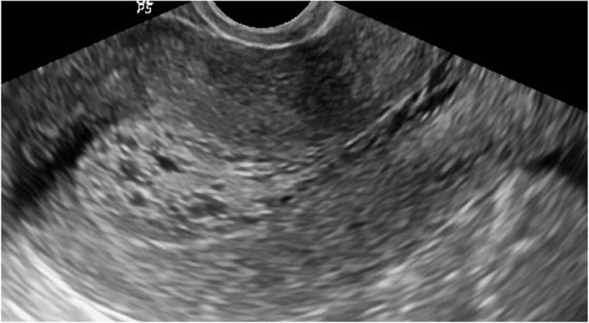
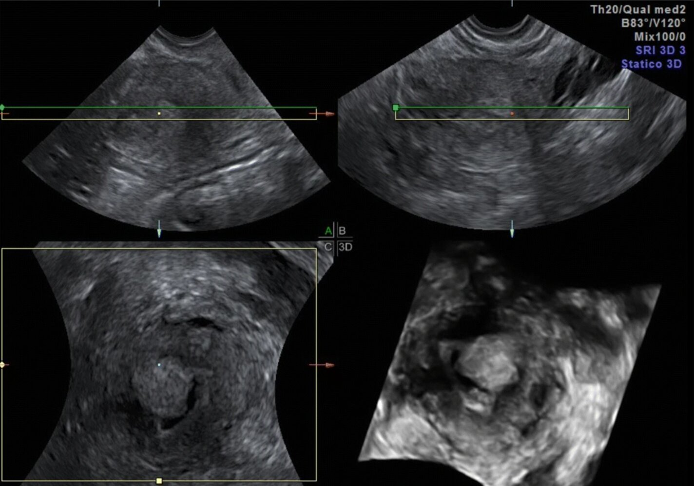
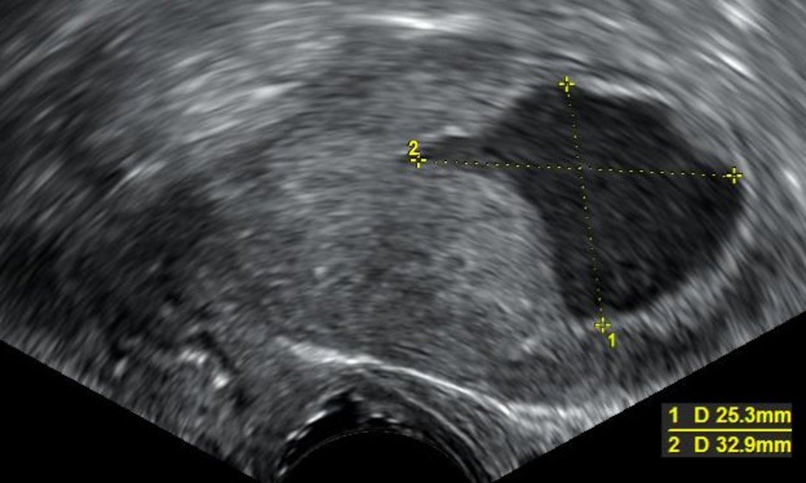
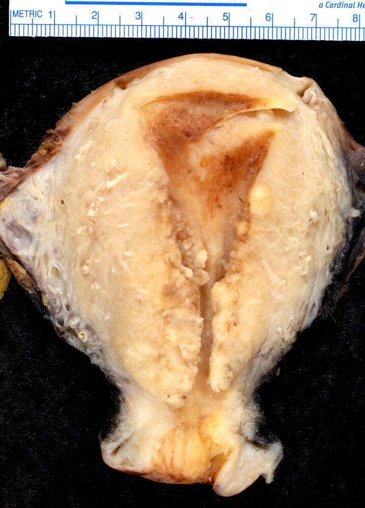
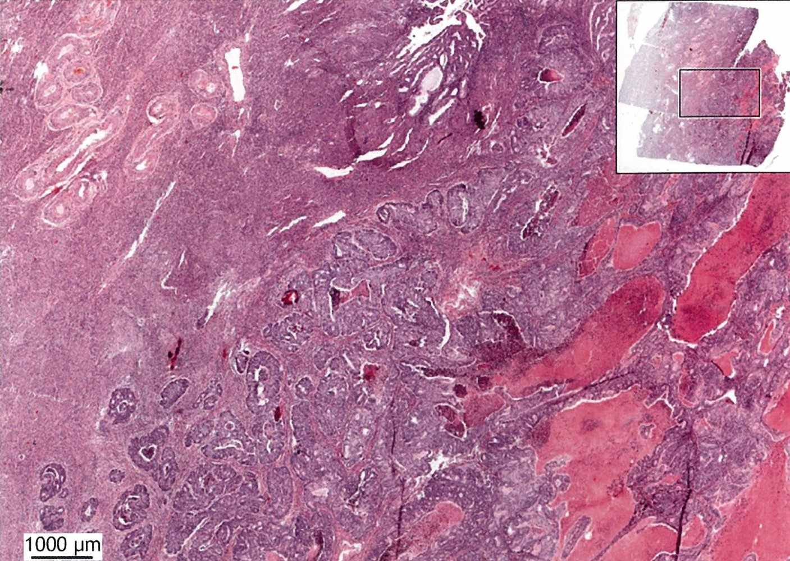
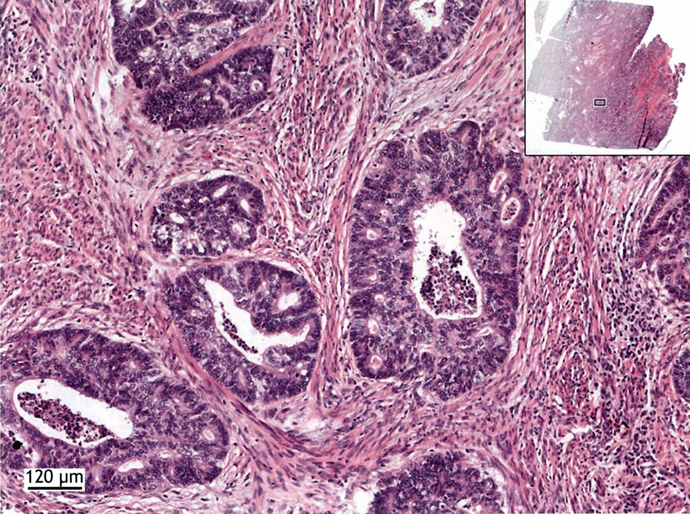
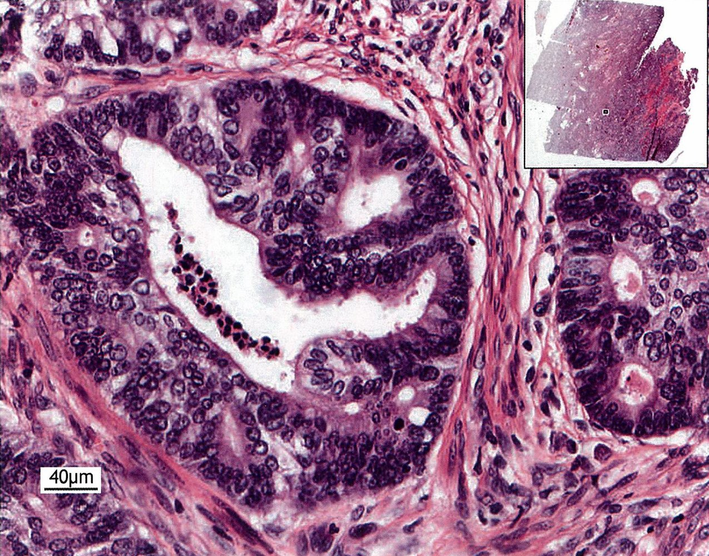

# Endometrial cancer

*Categories: Clinical knowledge > Obstetrics/gynecology > Neoplastic disorders > Endometrial cancer*

[Original Article Link](https://coursology-qbank.com/amboss/article/0O0eIT)

---

## Summary

<u>Endometrial</u> cancer is the most common cancer of the female genital tract in the US, with a peak <u>incidence</u> between 55 and 64 years of age. It is divided into two types based on histological characteristics; type I cancers account for 80% of all <u>endometrial</u> cancers and are of endometrioid origin, while type II cancers primarily originate from serous or <u>clear cells</u>. Although several <u>risk factors</u> are associated with the development of <u>endometrial</u> cancer, the most important of these is long-term exposure to unopposed <u>estrogen</u> levels, especially in type I cancer. Painless, <u>abnormal uterine bleeding</u> (<u>AUB</u>) is the main symptom and often manifests in the early stages of the disease. In later stages, <u>pelvic pain</u> and a palpable mass may be present. Most patients with suspected <u>endometrial</u> cancer undergo <u>transvaginal ultrasound</u> followed by <u>endometrial sampling</u> to confirm the diagnosis; however, <u>endometrial sampling</u> may be preferred as the initial study in some patients. Additional imaging studies (e.g., CT, <u>MRI</u>, or <u>PET/CT scan</u>) may be ordered by a specialist for the detection of <u>metastases</u>. Treatment and surgical staging typically involve a total <u>hysterectomy</u> with bilateral <u>salpingo-oophorectomy</u>, <u>lymphadenectomy</u>, and <u>peritoneal</u> washings. In patients with cancer confined to the <u>endometrium</u> and <u>myometrium</u>, further treatment is generally not required; if cancer has advanced, <u>surgery</u> is combined with <u>radiotherapy</u>, <u>hormone</u> therapy, and/or <u>chemotherapy</u>. The prognosis is usually favorable in cancers diagnosed at an early stage. Screening for <u>endometrial</u> cancer in asymptomatic individuals is not recommended. Primary preventive measures include management of <u>hyperestrogenic</u> conditions (e.g., <u>obesity management</u>, <u>PCOS management</u>), <u>regular physical activity</u>, and a healthy diet.

---

## Definitions

* Type I endometrial cancer: endometrioid <u>adenocarcinomas</u> (grade 1 and 2) derived from <u>atypical endometrial hyperplasia</u> [[1]](https://coursology-qbank.com/amboss/article/C1YqQL)[[2]](https://coursology-qbank.com/amboss/article/K_bU6w)

* Type II endometrial cancer: endometrioid <u>adenocarcinomas</u> (grade 3) and tumors of non­endometrioid <u>histology</u>;  (serous, <u>clear cell</u>, <u>mucinous</u>, squamous, transitional, and undifferentiated cells) [[2]](https://coursology-qbank.com/amboss/article/K_bU6w)

---

## Etiology

### Risk factors for type I endometrial cancer [[3]](https://coursology-qbank.com/amboss/article/GY1Bq20)[[4]](https://coursology-qbank.com/amboss/article/wNdhWq0)[[5]](https://coursology-qbank.com/amboss/article/IOdYFJ0)

* Increased and/or unopposed <u>estrogen</u> exposure, leading to excessive <u>proliferation</u> of the <u>endometrium</u>, e.g., due to: 

* <u>Nulliparity</u> or older age at first <u>birth</u>

* Early <u>menarche</u> and/or late <u>menopause</u>

* Chronic <u>anovulation</u> (e.g., in <u>PCOS</u>)

* <u>Estrogen</u>-producing ovarian sex-cord stromal tumors (e.g., <u>granulosa cell tumors</u>, <u>theca cell tumors</u>)

* <u>Hormone replacement therapy</u> without <u>progestin</u> administration

* <u>Obesity</u>, <u>T2DM</u>  [[4]](https://coursology-qbank.com/amboss/article/wNdhWq0)[[6]](https://coursology-qbank.com/amboss/article/D6d1MI0)

* <u>Tamoxifen</u>

* Older age (e.g., ≥ 50 years)

* <u>Family history</u> of <u>endometrial</u> cancer

* <u>Hypertension</u>, <u>thyroid disease</u>, <u>gallbladder</u> disease [[7]](https://coursology-qbank.com/amboss/article/g21FST0)

* <u>Hereditary nonpolyposis colorectal cancer</u> (<u>Lynch syndrome</u>)

* Some genetic mutations (e.g., in the <u>PTEN gene</u> or <u>mismatch repair genes</u>) are also associated with this type of cancer.

### <u>Risk factors</u> for <u>type II endometrial cancer</u> [[3]](https://coursology-qbank.com/amboss/article/GY1Bq20)[[8]](https://coursology-qbank.com/amboss/article/WWYP4L)

* Mostly <u>estrogen</u>-independent

* Associated with <u>endometrial</u> <u>atrophy</u> (especially in <u>postmenopausal</u> individuals)

* Strongly associated with a genetic predisposition

### Protective factors [[8]](https://coursology-qbank.com/amboss/article/WWYP4L)

Low <u>estrogen</u> and high <u>progestin</u> or <u>progesterone</u> levels have a protective effect.

* <u>Multiparity</u>

* Combination <u>oral contraceptive pills</u>

* Regular physical exercise

* Lifelong soy-rich diet  [[9]](https://coursology-qbank.com/amboss/article/x1YEQL)

> [!TIP]
> In patients who have a history of smoking, studies have shown a decreased <u>incidence</u> of <u>type I endometrial cancer</u> but an increased <u>incidence</u> of <u>type II endometrial cancer</u>. [[3]](https://coursology-qbank.com/amboss/article/GY1Bq20)

---

## Epidemiology

* <u>Prevalence</u> [[8]](https://coursology-qbank.com/amboss/article/WWYP4L)[[10]](https://coursology-qbank.com/amboss/article/N_b-ow)

* 1–2% in the US

* The most common cancer of the female genital tract in the US [[10]](https://coursology-qbank.com/amboss/article/N_b-ow)

* Fourth most common cancer in women (after <u>breast</u>, <u>lung</u>, and <u>colorectal cancer</u>)

* <u>Type I endometrial cancer</u> accounting for ∼ 80% of <u>endometrial</u> cancers, whereas <u>type II endometrial cancer</u> comprise 10–20% of cases [[2]](https://coursology-qbank.com/amboss/article/K_bU6w)

* <u>Incidence</u>: ∼ 20–28 per 100,000 women per year [[10]](https://coursology-qbank.com/amboss/article/N_b-ow)

* Age [[10]](https://coursology-qbank.com/amboss/article/N_b-ow)

* Primarily affect <u>postmenopausal</u> women

* Peak <u>incidence</u>: 55–64 years  

* Onset of type I cancer is usually nearer to <u>menopause</u>

* Type II cancer typically occurs in women who are older, with the mean age of diagnosis being 67 years.

* Race: The <u>prevalence</u> of <u>type II endometrial cancer</u> is higher in African American women aged > 50 years than Caucasian women, and it is often diagnosed at an advanced stage in African American women. [[3]](https://coursology-qbank.com/amboss/article/GY1Bq20)[[8]](https://coursology-qbank.com/amboss/article/WWYP4L)

Epidemiological data refers to the US, unless otherwise specified.

---

## Clinical features

### Localized disease [[3]](https://coursology-qbank.com/amboss/article/GY1Bq20)

* <u>Abnormal uterine bleeding</u> (<u>AUB</u>) in <u>premenopausal</u> or <u>perimenopausal</u> individuals ;  [[11]](https://coursology-qbank.com/amboss/article/I71YMR0)

* <u>Heavy irregular menstrual bleeding</u>

* <u>Intermenstrual bleeding</u>

* <u>Postmenopausal bleeding</u> (<u>PMB</u>), including spotting

* <u>Pelvic examination</u> is often normal (<u>uterus</u> may be enlarged).

> [!TIP]
> The majority of <u>endometrial</u> cancers are diagnosed at an early stage and have a good prognosis. [[3]](https://coursology-qbank.com/amboss/article/GY1Bq20)

### Regional extension [[3]](https://coursology-qbank.com/amboss/article/GY1Bq20)[[12]](https://coursology-qbank.com/amboss/article/uf1pLT0)

* <u>Pelvic pain</u>

* Vaginal mass and/or bleeding

* Abnormalities on <u>cervix</u>

* Abdominal distention

* Changes in bowel and/or <u>bladder</u> function

> [!TIP]
> <u>Endometrial</u> cancer may have both locoregional extension and contiguous spread to the <u>cervix</u>, <u>vagina</u>, <u>fallopian tubes</u>, and/or <u>ovaries</u>. [[12]](https://coursology-qbank.com/amboss/article/uf1pLT0)

### <u>Metastatic</u> disease [[3]](https://coursology-qbank.com/amboss/article/GY1Bq20)[[12]](https://coursology-qbank.com/amboss/article/uf1pLT0)

* Lymphogenic  and hematogenous  <u>metastases</u> can be seen in advanced stages of <u>endometrial</u> cancer. [[12]](https://coursology-qbank.com/amboss/article/uf1pLT0)

* Patients may have nonspecific features: e.g., weight loss, <u>lethargy</u>

* Other features depend on the site of <u>metastasis</u> and may include:

* Symptoms of <u>mass effect</u>

* <u>Cough</u>

* <u>Pleural effusion</u>

---

## Diagnosis

### General principles [[3]](https://coursology-qbank.com/amboss/article/GY1Bq20)[[8]](https://coursology-qbank.com/amboss/article/WWYP4L)[[13]](https://coursology-qbank.com/amboss/article/MuaM7m)

* <u>Diagnostics for endometrial cancer</u> may be indicated as part of

* <u>Diagnostic approach to AUB</u>

* <u>Evaluation of postmenopausal bleeding</u>, <u>pelvic pain</u>, or other <u>clinical features of endometrial cancer</u>

* Follow-up of abnormal <u>pelvic</u> imaging

* <u>Endometrial sampling</u> and <u>histopathology</u> is required to confirm the diagnosis.

* Once the diagnosis is confirmed, organize:

* Genetic studies to evaluate for <u>Lynch syndrome</u> and possibly other genetic conditions

* <u>Staging studies for endometrial cancer</u>

> [!TIP]
> All patients with abnormal <u>vaginal bleeding</u> and <u>risk factors for endometrial cancer</u> should undergo <u>endometrial sampling</u>. [[3]](https://coursology-qbank.com/amboss/article/GY1Bq20)[[14]](https://coursology-qbank.com/amboss/article/ce1aBf0)[[15]](https://coursology-qbank.com/amboss/article/uEWpxM0)

### <u>Transvaginal ultrasonography</u>

* Indications

* <u>Postmenopausal</u> individuals with an initial episode of <u>PMB</u> and no <u>risk factors for endometrial cancer</u>, if preferred over <u>endometrial sampling</u> as an initial study  [[3]](https://coursology-qbank.com/amboss/article/GY1Bq20)[[14]](https://coursology-qbank.com/amboss/article/ce1aBf0)[[16]](https://coursology-qbank.com/amboss/article/3yWSUL0)

* <u>Premenopausal</u> individuals: Consider as part of the initial <u>workup of AUB</u>.  [[8]](https://coursology-qbank.com/amboss/article/WWYP4L)[[15]](https://coursology-qbank.com/amboss/article/uEWpxM0)[[16]](https://coursology-qbank.com/amboss/article/3yWSUL0)

* Findings suggestive of <u>endometrial</u> cancer

* Focal lesions within the <u>endometrium</u>

* In <u>postmenopausal</u> individuals, an <u>endometrial</u> thickness of > 4 mm should raise suspicion for <u>endometrial</u> cancer.   [[3]](https://coursology-qbank.com/amboss/article/GY1Bq20)[[14]](https://coursology-qbank.com/amboss/article/ce1aBf0)[[16]](https://coursology-qbank.com/amboss/article/3yWSUL0)

Endometrial thickening with cystic changes

Endometrioid adenocarcinoma

Endometrial fluid in endometrial carcinoma

### Endometrial sampling with <u>histology</u> [[3]](https://coursology-qbank.com/amboss/article/GY1Bq20)[[14]](https://coursology-qbank.com/amboss/article/ce1aBf0)[[15]](https://coursology-qbank.com/amboss/article/uEWpxM0)[[17]](https://coursology-qbank.com/amboss/article/wldh_J0)

* <u>Endometrial sampling</u> is a diagnostic procedure in which <u>endometrial</u> tissue is obtained for histopathologic evaluation.

* It may be performed using <u>endometrial biopsy</u> or <u>dilation and curettage</u> (D&C), with or without hysteroscopic guidance.

* The technique used depends on clinical indications, patient factors, operator expertise, and the need for targeted vs. blind tissue collection.

#### Indications

| Indications for endometrial sampling |  |  |
| --- | --- | --- |
| Patient population |  | Indications |
| <u>Postmenopausal</u> individuals | With <u>PMB</u> |   * As a first-line diagnostic modality in patients with: [[3]](https://coursology-qbank.com/amboss/article/GY1Bq20)[[17]](https://coursology-qbank.com/amboss/article/wldh_J0)  * <u>Risk factors for endometrial cancer</u>  * Persistent or recurrent <u>PMB</u>  * Initial episode of <u>PMB</u> and no <u>risk factors for endometrial cancer</u> (as an alternative to <u>TVUS</u>)  * For further evaluation of patients with either of the following findings on initial <u>TVUS</u>:  * <u>Endometrial</u> thickness > 4 mm  [[14]](https://coursology-qbank.com/amboss/article/ce1aBf0)[[16]](https://coursology-qbank.com/amboss/article/3yWSUL0)[[18]](https://coursology-qbank.com/amboss/article/dmdoeq0)  * Inadequate visualization of the <u>endometrial</u> lining  [[3]](https://coursology-qbank.com/amboss/article/GY1Bq20)[[14]](https://coursology-qbank.com/amboss/article/ce1aBf0)    |
|  Asymptomatic individuals with incidentally detected <u>endometrial</u> thickness > 4 mm [[14]](https://coursology-qbank.com/amboss/article/ce1aBf0)  |  * Consider <u>endometrial sampling</u> on an individual basis; not routinely recommended.   |  |
|  <u>Premenopausal</u> patients with <u>AUB</u> [[7]](https://coursology-qbank.com/amboss/article/g21FST0)[[17]](https://coursology-qbank.com/amboss/article/wldh_J0)  |  |   * Age ≥ 45 years  * Any age with either of the following:  * Persistent <u>AUB</u> despite medical management  * <u>Risk factors for endometrial cancer</u>    |
|  <u>Atypical glandular cells</u> on routine <u>cervical cytology</u> [[19]](https://coursology-qbank.com/amboss/article/BdXzHC)  |  |   * All individuals aged ≥ 35 years  * Individuals aged < 35 years with either of the following:  * <u>AUB</u>  * <u>Risk factors for endometrial cancer</u>    |

> [!TIP]
> Screening for <u>endometrial</u> cancer in average-risk individuals is not recommended. <u>Endometrial sampling</u> is recommended for asymptomatic individuals with high-risk genetic mutations (e.g., <u>Lynch syndrome</u>) who wish to preserve their <u>uterus</u>. See “Prevention” section for details. [[3]](https://coursology-qbank.com/amboss/article/GY1Bq20)[[4]](https://coursology-qbank.com/amboss/article/wNdhWq0)

#### Procedures [[15]](https://coursology-qbank.com/amboss/article/uEWpxM0)

<u>Endometrial sampling</u> is contraindicated in pregnant individuals. Rule out <u>pregnancy</u> before performing these procedures. [[17]](https://coursology-qbank.com/amboss/article/wldh_J0)[[20]](https://coursology-qbank.com/amboss/article/yOddEJ0)

* Blind endometrial biopsy

* First line for most patients

* An office-based procedure; often performed ; using disposable equipment (e.g., Pipelle cannula) during <u>pelvic examination</u>

* Blind procedure: Abnormal pathology may be missed. 

* A negative result does not rule out cancer.

* Refractory symptoms despite a previous benign pathology on <u>endometrial biopsy</u> necessitates further testing (e.g., <u>hysteroscopy</u>).

* Hysteroscopy-guided endometrial sampling [[5]](https://coursology-qbank.com/amboss/article/IOdYFJ0)[[20]](https://coursology-qbank.com/amboss/article/yOddEJ0)

* Allows for visualization of <u>endometrial</u> pathology and simultaneous <u>endometrial biopsy</u> or D&C

* Preferred for patients with: [[3]](https://coursology-qbank.com/amboss/article/GY1Bq20)

* Recurrent or persistent bleeding despite normal in-office <u>endometrial biopsy</u>

* Nondiagnostic results from in-office <u>endometrial biopsy</u>

* Planned <u>fertility</u>-conserving treatment

* May be performed as an office or inpatient procedure

> [!TIP]
> Blind D&C has largely been replaced by <u>endometrial biopsy</u> and <u>hysteroscopy</u> for the evaluation of <u>endometrial</u> cancer [[5]](https://coursology-qbank.com/amboss/article/IOdYFJ0)[[13]](https://coursology-qbank.com/amboss/article/MuaM7m)

> [!WARNING]
> Additional testing (e.g., <u>hysteroscopy</u>-directed <u>endometrial biopsy</u>) is required for individuals with persistent or recurrent bleeding and a benign <u>blind endometrial biopsy</u> result. [[14]](https://coursology-qbank.com/amboss/article/ce1aBf0)[[15]](https://coursology-qbank.com/amboss/article/uEWpxM0)

#### Findings

See “<u>Pathology of endometrial cancer</u>.”

### Genetic studies  [[21]](https://coursology-qbank.com/amboss/article/pX1L_20)

* <u>Lynch syndrome</u> testing: all individuals with <u>endometrial</u> cancer  [[21]](https://coursology-qbank.com/amboss/article/pX1L_20)[[22]](https://coursology-qbank.com/amboss/article/Sb1yG20)[[23]](https://coursology-qbank.com/amboss/article/ox10xQ0)[[24]](https://coursology-qbank.com/amboss/article/Kx1UxQ0)

* Advanced studies may be requested by a specialist depending on clinical presentation. [[21]](https://coursology-qbank.com/amboss/article/pX1L_20)

* Mutation analysis (e.g., <u>p53</u>, <u>PTEN</u>, phosphoinositide 3-<u>kinase</u>)

* <u>Hormone</u> <u>receptor</u> testing (i.e., <u>estrogen</u> and <u>progesterone</u> <u>receptors</u>)

* Other <u>familial cancer syndromes</u> (e.g., <u>BRCA mutations</u>, <u>Cowden syndrome</u>)

> [!TIP]
> More than 70% of cases of <u>endometrial</u> cancer are detected when the disease is confined to the <u>uterus</u>. [[3]](https://coursology-qbank.com/amboss/article/GY1Bq20)

---

## Pathology

### Endometrioid <u>adenocarcinoma</u> [[10]](https://coursology-qbank.com/amboss/article/N_b-ow)

* <u>Prevalence</u>: most frequent form

* Types

* Type I <u>endometrial</u> <u>carcinoma</u> includes <u>estrogen</u>-dependent endometrioid <u>adenocarcinoma</u> (grade 1 and 2; the most common)

* Type II <u>endometrial</u> <u>carcinoma</u> includes <u>estrogen</u>-independent endometrioid <u>adenocarcinoma</u> (grade 3; rare, poor prognosis)

* <u>Histology</u> findings

* Pronounced glandular <u>proliferation</u>, which presents as atypical glandular tubes

* The glands are positioned, in part, back-to-back;  ("dos-à-dos") with no separating stroma

* Lined with <u>pseudostratified</u> <u>epithelial</u> cells, the <u>nuclei</u> of which are enlarged in an atypical <u>vesicular</u> form.

* These glandular cells frequently demonstrate <u>mitosis</u>.

* <u>Tumor</u> cell nests may also be observed and infiltrate the <u>myometrium</u> in high-grade tumors.

Endometrioid adenocarcinoma

Endometrioid adenocarcinoma (1/3)

Endometrioid adenocarcinoma (2/3)

Endometrioid adenocarcinoma (3/3)

### Tumors of nonendometrioid <u>histology</u>

* Types

* Serous <u>adenocarcinoma</u> (contains <u>psammoma bodies</u> and <u>papillary</u> structure with tufts)

* <u>Clear cell</u> <u>adenocarcinoma</u>

* <u>Mucinous</u> <u>adenocarcinoma</u>

* <u>Squamous cell carcinoma</u>

* Undifferentiated <u>carcinoma</u>

---

## Treatment

### General principles [[3]](https://coursology-qbank.com/amboss/article/GY1Bq20)[[28]](https://coursology-qbank.com/amboss/article/Nx1-9Q0)

* Treatment is based on:

* Stage of cancer

* <u>Premenopausal</u> or <u>postmenopausal</u> status

* Desire for <u>fertility</u> conservation

* Most patients are managed with <u>surgery</u>; <u>adjuvant radiotherapy</u> and/or <u>chemotherapy</u> may be required depending on the extent of disease.

* If disease extends beyond the <u>endometrium</u> and <u>myometrium</u>, arrange <u>prechemotherapy screening</u> to assess suitability for treatments.

* Patients should be provided with <u>multidisciplinary cancer care</u> to optimize outcomes (see “<u>Principles of cancer care</u>”).

### Disease confined to the <u>endometrium</u> and <u>myometrium</u>

#### <u>Postmenopausal</u> patients and patients who do not wish to preserve <u>fertility</u> [[3]](https://coursology-qbank.com/amboss/article/GY1Bq20)[[21]](https://coursology-qbank.com/amboss/article/pX1L_20)[[28]](https://coursology-qbank.com/amboss/article/Nx1-9Q0)

* First-line: total <u>hysterectomy</u> with bilateral <u>salpingo-oophorectomy</u>

* <u>Laparoscopy</u> is preferred.

* Assessment of <u>lymph nodes</u> is recommended (e.g., <u>sentinel lymph node biopsy</u>, removal of suspicious nodes, or complete <u>pelvic</u> and para-aortic <u>lymphadenectomy</u>).

* <u>Peritoneal</u> washings may be performed.  [[21]](https://coursology-qbank.com/amboss/article/pX1L_20)[[28]](https://coursology-qbank.com/amboss/article/Nx1-9Q0)

* Alternative: <u>hysterectomy</u> with ovarian preservation (select patients only)   [[3]](https://coursology-qbank.com/amboss/article/GY1Bq20)[[21]](https://coursology-qbank.com/amboss/article/pX1L_20)

> [!TIP]
> <u>Adjuvant treatment</u> is not normally required for this group, but <u>radiotherapy</u> should be considered for high-risk patients (i.e., those with high-grade disease, invasion of the lymphovascular space or outer third of the <u>myometrium</u>). [[3]](https://coursology-qbank.com/amboss/article/GY1Bq20)

#### Patients wishing to preserve <u>fertility</u> [[3]](https://coursology-qbank.com/amboss/article/GY1Bq20)[[21]](https://coursology-qbank.com/amboss/article/pX1L_20)[[28]](https://coursology-qbank.com/amboss/article/Nx1-9Q0)

* Uterine preservation may be possible for individuals who wish to carry a <u>pregnancy</u> in the future.  ;  [[3]](https://coursology-qbank.com/amboss/article/GY1Bq20)

* May be considered for early-stage <u>endometrial</u> <u>carcinoma</u>

* Usually consists of <u>progestins</u>

* After childbearing is complete, definitive surgical therapy is usually recommended because of the risk of disease recurrence.

* <u>Hysterectomy</u> with ovarian preservation can be used for patients willing to use a <u>surrogate</u>.  [[21]](https://coursology-qbank.com/amboss/article/pX1L_20)

> [!TIP]
> Treatment with <u>progestins</u> may also be considered for patients who are not suitable candidates for <u>surgery</u> because of medical comorbidities. [[3]](https://coursology-qbank.com/amboss/article/GY1Bq20)[[28]](https://coursology-qbank.com/amboss/article/Nx1-9Q0)

### <u>Lymph node</u> involvement or locally advanced disease [[3]](https://coursology-qbank.com/amboss/article/GY1Bq20)[[21]](https://coursology-qbank.com/amboss/article/pX1L_20)[[28]](https://coursology-qbank.com/amboss/article/Nx1-9Q0)

* Total <u>hysterectomy</u> with bilateral <u>salpingo-oophorectomy</u>

* PLUS <u>adjuvant chemotherapy</u> and/or <u>radiotherapy</u>

* <u>Chemotherapy</u>: usually <u>paclitaxel</u> and <u>carboplatin</u>  [[3]](https://coursology-qbank.com/amboss/article/GY1Bq20)

* <u>Radiotherapy</u>: <u>brachytherapy</u> or <u>external beam radiotherapy</u> may be used depending on the extent of disease. [[21]](https://coursology-qbank.com/amboss/article/pX1L_20)

### <u>Metastatic</u> disease [[3]](https://coursology-qbank.com/amboss/article/GY1Bq20)[[21]](https://coursology-qbank.com/amboss/article/pX1L_20)[[28]](https://coursology-qbank.com/amboss/article/Nx1-9Q0)

* <u>Palliative therapy</u> focused on symptom control (see also “<u>Overview of palliative medicine</u>”)

* May include surgical <u>tumor</u> reduction and/or medical therapy (<u>palliative chemotherapy</u>, <u>radiotherapy</u>, <u>hormone</u> therapy, or immunotherapy)

---

## Prevention

### <u>Primary prevention</u>

* <u>Regular physical activity</u> and consumption of low glycemic index foods (see “<u>Counseling on nutrition and regular exercise</u>”)  [[4]](https://coursology-qbank.com/amboss/article/wNdhWq0)[[31]](https://coursology-qbank.com/amboss/article/BIdzUr0)

* Address modifiable <u>risk factors for endometrial cancer</u>, including:

* Manage <u>hyperestrogenic</u> conditions (e.g., <u>obesity management</u>, <u>PCOS management</u>).

* Avoid prescribing unopposed <u>estrogen</u>.

* Educate patients on <u>smoking cessation</u>.  [[3]](https://coursology-qbank.com/amboss/article/GY1Bq20)

* Consider <u>progestin</u> therapy (i.e., <u>levonorgestrel IUD</u> or oral <u>progestins</u>) in individuals with <u>obesity</u>.  [[4]](https://coursology-qbank.com/amboss/article/wNdhWq0)[[32]](https://coursology-qbank.com/amboss/article/brdHfr0)[[33]](https://coursology-qbank.com/amboss/article/grdFgr0)

> [!TIP]
> <u>Obesity</u> is a major potentially <u>modifiable risk factor</u> for <u>endometrial hyperplasia</u> and <u>endometrial</u> cancer. [[4]](https://coursology-qbank.com/amboss/article/wNdhWq0)[[5]](https://coursology-qbank.com/amboss/article/IOdYFJ0)

> [!WARNING]
> Do not prescribe unopposed <u>estrogen</u> to a patient with an intact <u>uterus</u>. [[34]](https://coursology-qbank.com/amboss/article/rbXfE9)[[35]](https://coursology-qbank.com/amboss/article/es1xFR0)

### Screening

* Screening for <u>endometrial</u> cancer in asymptomatic individuals is not recommended. [[3]](https://coursology-qbank.com/amboss/article/GY1Bq20)[[4]](https://coursology-qbank.com/amboss/article/wNdhWq0)

* Asymptomatic individuals with high-risk genetic mutations (e.g., <u>Lynch syndrome</u>, <u>Cowden syndrome</u>) who wish to preserve their <u>uterus</u> should undergo <u>endometrial sampling</u> every 1–2 years from age 30–35 years to screen for <u>endometrial</u> cancer.  [[4]](https://coursology-qbank.com/amboss/article/wNdhWq0)[[28]](https://coursology-qbank.com/amboss/article/Nx1-9Q0)[[36]](https://coursology-qbank.com/amboss/article/bodH0I0)

* See also “<u>Cancer screening for transgender individuals</u>.”

> [!TIP]
> Educate <u>premenopausal</u> individuals with <u>risk factors for endometrial cancer</u> (e.g., <u>Lynch syndrome</u>, <u>PCOS</u>, <u>tamoxifen</u> use) and all <u>postmenopausal</u> individuals on recognizing and seeking prompt evaluation for any <u>symptoms of endometrial cancer</u>. [[4]](https://coursology-qbank.com/amboss/article/wNdhWq0)[[37]](https://coursology-qbank.com/amboss/article/zx1r_Q0)

---