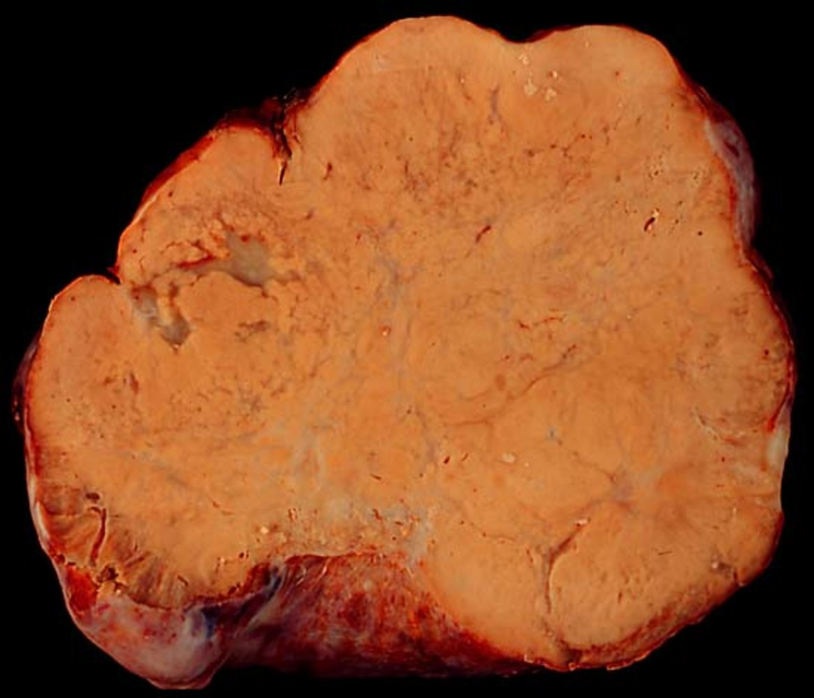
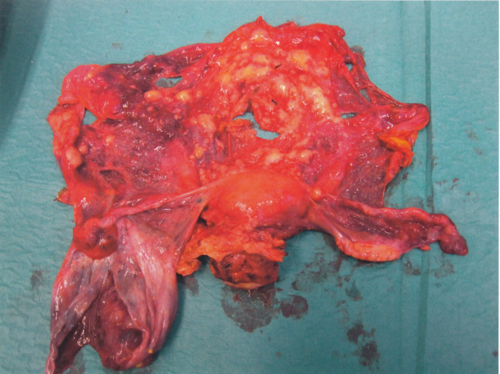

# Ovarian cancer

*Categories: Clinical knowledge > Obstetrics/gynecology > Neoplastic disorders > Ovarian cancer*

[Original Article Link](https://coursology-qbank.com/amboss/article/aO0QIT)

---

## Summary

In the US, ovarian cancer is the second most common gynecologic cancer and has the highest <u>mortality rate</u> of any gynecologic cancer. <u>Incidence</u> increases with age (peak <u>incidence</u> at 55–64 years of age). Genetic <u>risk factors</u> include mutations in the <u>BRCA1</u>/<u>BRCA2</u> and/or <u>mismatch repair</u> (<u>MMR</u>) <u>gene</u>. The most common type of ovarian cancer is <u>epithelial</u> cell <u>carcinoma</u>. Symptoms of ovarian cancer are usually nonspecific (e.g., abdominal <u>pain</u> and distention), and over half of individuals with ovarian cancer have <u>metastatic</u> disease at the time of diagnosis. The diagnosis of ovarian cancer begins with <u>workup of an adnexal mass</u>, but tissue diagnosis is required for confirmation. <u>Surgery</u> is recommended for a definitive diagnosis of ovarian cancer; maximal <u>cytoreduction</u> should be performed to improve long-term outcomes. Most patients with ovarian cancer should receive <u>adjuvant chemotherapy</u> with a <u>platinum-based agent</u> and a <u>taxane</u>. Prognosis is primarily based on the disease stage, with an overall 5-year survival rate of 50%. Routine screening with <u>CA-125</u> or <u>TVUS</u> is not recommended in individuals with an average risk.

For information about specific ovarian cancer subtypes, see “<u>Overview of ovarian tumors</u>.”

---

## Epidemiology

* <u>Incidence</u> [[1]](https://coursology-qbank.com/amboss/article/6ZWjcP0)

* Second most common gynecologic cancer (after <u>endometrial cancer</u>)

* <u>Incidence</u> increases with age.

* Lifetime risk

* General population: ∼ 1% [[2]](https://coursology-qbank.com/amboss/article/Br1zjR0)[[3]](https://coursology-qbank.com/amboss/article/R2dlh60)

* Individuals with genetic predisposition, e.g.:

* <u>BRCA1</u>-positive: 25–65% [[2]](https://coursology-qbank.com/amboss/article/Br1zjR0)

* <u>BRCA2</u>-positive: 10–30% [[2]](https://coursology-qbank.com/amboss/article/Br1zjR0)

* <u>MMR gene</u> mutation: 10% [[2]](https://coursology-qbank.com/amboss/article/Br1zjR0)

* Age

* Peak <u>incidence</u>: 55–64 years of age [[4]](https://coursology-qbank.com/amboss/article/HFbKjv)

* Women with genetic mutations are typically diagnosed at a younger age.

* Mortality: highest <u>mortality rate</u> of any gynecologic cancer in the US [[1]](https://coursology-qbank.com/amboss/article/6ZWjcP0)

Incidence of cancers in the US (2025 estimates)

Cancer mortality in the US (2025 estimates)

Epidemiological data refers to the US, unless otherwise specified.

---

## Etiology

### Risk factors for ovarian cancer [[5]](https://coursology-qbank.com/amboss/article/ocY0WL)

* General

* Increasing age

* <u>Cigarette smoking</u>

* <u>Asbestos</u> exposure [[6]](https://coursology-qbank.com/amboss/article/vFbAPv)

* Genetic predisposition

* <u>BRCA gene mutation</u>

* <u>MMR gene</u> mutation associated with <u>HNPCC</u> syndrome

* Positive <u>family history</u>

* <u>Ashkenazi Jewish descent</u> [[7]](https://coursology-qbank.com/amboss/article/sr1tiR0)

* Hormonal factors

* Elevated number of ovulatory cycles: early <u>menarche</u> and/or late <u>menopause</u>

* <u>Nulliparity</u>

* <u>Endometriosis</u>

* <u>Hormone replacement therapy</u> [[8]](https://coursology-qbank.com/amboss/article/ur1pQR0)

* <u>Polycystic ovarian syndrome</u> (<u>PCOS</u>)  [[9]](https://coursology-qbank.com/amboss/article/QoXub_)

### Protective factors for ovarian cancer [[5]](https://coursology-qbank.com/amboss/article/ocY0WL)

* <u>Surgery</u>

* <u>Risk-reducing bilateral salpingo-oophorectomy</u> (<u>rrBSO</u>) for high risk patients  [[10]](https://coursology-qbank.com/amboss/article/02deT60)

* <u>Tubal ligation</u>

* <u>Hysterectomy</u>

* Hormonal factors

* <u>Oral contraceptives</u>  [[11]](https://coursology-qbank.com/amboss/article/CFbq4v)

* <u>Breastfeeding</u>

* <u>Parity</u>

---

## Classification

For information about ovarian cancer subtypes, see “<u>Overview of ovarian tumors</u>.”

### Classification of ovarian cancer

Ovarian malignancies can be either primary (i.e., arising from the different types of ovarian tissue) or secondary (i.e., <u>metastases</u> from other primary tumors).

### Primary ovarian cancer

* <u>Epithelial</u> cell tumors

* <u>Cystadenocarcinoma</u> (serous or <u>mucinous</u>)

* <u>Clear cell</u> tumors

* <u>Endometrioid carcinoma</u>

* <u>Germ cell tumors</u>

* Immature <u>teratoma</u>

* <u>Yolk sac tumor of the ovary</u> (<u>endodermal sinus tumor</u>)

* <u>Dysgerminoma</u>

* <u>Nongestational choriocarcinoma</u>

* Sex cord tumors: <u>granulosa cell tumor</u>

> [!TIP]
> High-grade <u>cystadenocarcinoma</u> is the most aggressive ovarian cancer.

Cellular origins of ovarian tumors

### Secondary ovarian cancer

Most common primary cancers: <u>gastrointestinal tract</u> (e.g., <u>Krukenberg tumor</u>), <u>breast</u>, and <u>endometrium</u>. [[12]](https://coursology-qbank.com/amboss/article/CeWqak0)

* Krukenberg tumor: secondary <u>ovarian tumor</u> that most commonly arises from <u>metastatic</u> spread of <u>gastric carcinoma</u> ;  [[13]](https://coursology-qbank.com/amboss/article/vvbAbD)

* Often bilateral

* Characteristic <u>mucin</u>-secreting <u>signet ring cells</u> on <u>histology</u>

* The exact route of <u>metastatic</u> spread (i.e., lymphatic, hematogenous, or <u>peritoneal</u>) is still debated.

Krukenberg tumor

---

## Clinical features

Symptoms of ovarian cancer are usually nonspecific, which often delays the diagnosis. Early-stage ovarian cancer is usually asymptomatic. [[2]](https://coursology-qbank.com/amboss/article/Br1zjR0)[[8]](https://coursology-qbank.com/amboss/article/ur1pQR0)

### Abdominal and <u>pelvic</u> symptoms [[2]](https://coursology-qbank.com/amboss/article/Br1zjR0)[[8]](https://coursology-qbank.com/amboss/article/ur1pQR0)

* Early satiety

* Abdominal distention and/or <u>bloating</u>

* Abdominal, <u>pelvic</u>, and/or <u>lower back pain</u>

* Changes in <u>urination</u> (e.g., frequency, urgency)

* <u>Constipation</u>

* Abnormal bleeding (rare)  [[14]](https://coursology-qbank.com/amboss/article/19b2mD)

* <u>Postmenopausal bleeding</u>

* <u>Rectal bleeding</u>

### Advanced disease [[2]](https://coursology-qbank.com/amboss/article/Br1zjR0)[[8]](https://coursology-qbank.com/amboss/article/ur1pQR0)

Over half of those with ovarian cancer have <u>metastatic</u> disease at the time of diagnosis. [[2]](https://coursology-qbank.com/amboss/article/Br1zjR0)

* Locally advanced disease

* <u>Ascites</u>

* <u>Malignant pleural effusion</u> (resulting in <u>dyspnea</u> and <u>pleuritic chest pain</u>)

* <u>Bowel obstruction</u> (resulting in severe <u>nausea and vomiting</u>)

* <u>Metastatic</u> disease [[15]](https://coursology-qbank.com/amboss/article/V9bGmD)[[16]](https://coursology-qbank.com/amboss/article/yr1dPR0)

* <u>Omentum</u>: abdominal <u>pain</u> from infiltration of <u>omental</u> fat

* <u>Liver</u>: <u>nausea</u>, <u>jaundice</u>, <u>ascites</u> (see “<u>Metastatic liver disease</u>”)

* Distant <u>lymph nodes</u>: supraclavicular or inguinal <u>lymphadenopathy</u>

* <u>Lung</u>: <u>cough</u>, <u>hemoptysis</u>, <u>chest pain</u> (see “<u>Lung metastases</u>”)

* <u>Brain</u>: <u>headaches</u>, <u>seizures</u>, focal motor deficits (see “<u>Brain metastases</u>”)

* Bone: local <u>pain</u> and swelling, <u>pathologic fractures</u> (see “<u>Bone metastases</u>”)

Most common routes of metastasis with TNM classification

### <u>Paraneoplastic syndromes</u> [[2]](https://coursology-qbank.com/amboss/article/Br1zjR0)[[17]](https://coursology-qbank.com/amboss/article/W9bPmD)

Although rare, these syndromes may be seen in patients with ovarian cancer. [[17]](https://coursology-qbank.com/amboss/article/W9bPmD)

* Paraneoplastic sensory neuropathy

* <u>Paraneoplastic cerebellar degeneration</u>

* <u>Dermatomyositis</u>

* <u>Hemolytic anemia</u>

* <u>Leser-Trélat sign</u>

---

## Diagnosis

### General principles [[2]](https://coursology-qbank.com/amboss/article/Br1zjR0)[[18]](https://coursology-qbank.com/amboss/article/NJY-8J)

* If ovarian cancer is suspected, follow the approach to diagnostics for an <u>adnexal mass</u>, including:

* <u>Transvaginal ultrasound</u> with doppler to evaluate for <u>ultrasound</u> findings concerning for ovarian <u>malignancy</u>

* <u>Ovarian tumor markers</u> (e.g., <u>CA 125</u>)

* Refer to gynecologic oncology for:

* Diagnostic confirmation (i.e., tissue diagnosis)

* <u>Cross-sectional imaging</u> for staging

> [!TIP]
> Omental caking (thickening) is a radiologic finding on <u>cross-sectional imaging</u> that is consistent with advanced <u>peritoneal</u> ovarian cancer and is due to <u>tumor</u> infiltration of the <u>greater omentum</u>.

### Tissue diagnosis [[18]](https://coursology-qbank.com/amboss/article/NJY-8J)

* Surgical <u>biopsy</u>

* Recommended for definitive diagnosis of ovarian cancer [[8]](https://coursology-qbank.com/amboss/article/ur1pQR0)

* Should be performed in patients with clinical, radiographic, and/or laboratory findings that suggest ovarian cancer

* <u>Laparoscopic</u> removal is the preferred surgical procedure.

* Other studies

* Needle <u>biopsy</u>: generally avoided because of the risk of <u>tumor</u> seeding, which can advance the stage of disease

* Fluid <u>cytology</u> of <u>ascites</u> or <u>pleural effusion</u>

> [!WARNING]
> <u>Fine-needle aspiration</u> of ovarian masses is typically contraindicated when there is suspicion for <u>malignancy</u> because it can directly spread <u>tumor</u> cells to the <u>peritoneum</u>.

---

## Management

### General principles

* Refer all patients to a gynecologic oncologist for ongoing management.

* Surgical staging: performed to obtain pathological specimens and evaluate the extent of cancer spread

* Surgical <u>debulking</u> improves long-term outcomes. [[20]](https://coursology-qbank.com/amboss/article/U9bb5D)

* Most patients should receive <u>adjuvant chemotherapy</u>.

* <u>CA-125</u> levels may be used to monitor disease progression and/or recurrence after treatment. [[8]](https://coursology-qbank.com/amboss/article/ur1pQR0)

Radical surgical staging of progressive serous ovarian cancer

### <u>Surgery</u> [[8]](https://coursology-qbank.com/amboss/article/ur1pQR0)[[21]](https://coursology-qbank.com/amboss/article/G2dBQ60)[[22]](https://coursology-qbank.com/amboss/article/t2dXj60)

For the best patient outcomes, surgical staging and <u>debulking</u> should be performed by a gynecologic oncologist. [[23]](https://coursology-qbank.com/amboss/article/T9b65D)

* Surgical staging 

* <u>Hysterectomy</u> with bilateral <u>salpingo-oophorectomy</u>

* <u>Pelvic</u> and <u>paraaortic lymph node</u> dissection

* <u>Omentectomy</u>

* <u>Peritoneal</u> <u>cytology</u>

* Surgical <u>debulking</u> [[20]](https://coursology-qbank.com/amboss/article/U9bb5D)

* Optimal <u>debulking</u> is defined as < 1 cm of residual <u>tumor</u>.  [[24]](https://coursology-qbank.com/amboss/article/h2dch60)

* Used in disease stages I–III and, occasionally, stage IV

> [!TIP]
> Surgical resection alone may be curative in patients with early-stage disease. [[24]](https://coursology-qbank.com/amboss/article/h2dch60)

### <u>Chemotherapy</u> [[8]](https://coursology-qbank.com/amboss/article/ur1pQR0)

* Patients with ovarian cancer should receive <u>adjuvant chemotherapy</u>, except for those with low-grade, stage I disease.

* Common regimen: <u>platinum-based agent</u> (e.g., <u>carboplatin</u>) PLUS <u>taxane</u> (e.g., <u>paclitaxel</u>) ± <u>bevacizumab</u>  [[25]](https://coursology-qbank.com/amboss/article/12d2g60)

* Adjuvant <u>intraperitoneal</u> <u>chemotherapy</u> combined with intravenous <u>chemotherapy</u> results in a higher survival rate than intravenous <u>chemotherapy</u> alone. [[26]](https://coursology-qbank.com/amboss/article/sD1tfQ0)

* <u>Neoadjuvant chemotherapy</u> followed by interval <u>debulking</u> <u>surgery</u> can be considered in patients with advanced-stage disease and high perioperative risk. [[26]](https://coursology-qbank.com/amboss/article/sD1tfQ0)

### Targeted molecular therapy

* Indications

* <u>BRCA</u>-positive disease [[27]](https://coursology-qbank.com/amboss/article/0CbeqD)

* <u>Maintenance therapy</u> after surgical <u>debulking</u> and <u>chemotherapy</u>  [[28]](https://coursology-qbank.com/amboss/article/F2dgj60)

* Targeted agents: oral poly (ADP-ribose) polymerase inhibitors (PARP inhibitors)

* Olaparib: first-generation oral <u>PARP inhibitor</u> [[29]](https://coursology-qbank.com/amboss/article/aCbQqD)

* Niraparib: highly selective PARP1/PARP2 inhibitor [[30]](https://coursology-qbank.com/amboss/article/YCbnqD)

* Rucaparib: inhibits PARP1, PARP2, and PARP3 [[31]](https://coursology-qbank.com/amboss/article/W2dPg60)

### Management of recurrence [[32]](https://coursology-qbank.com/amboss/article/d2dog60)

* Relapse within 6 months of completing <u>chemotherapy</u> is classified as <u>platinum</u>-resistant disease and can be managed with either:

* A different <u>chemotherapy</u> regimen

* Inclusion in clinical trials

* A focus on <u>palliative therapy</u> over curative therapy

* If relapse occurs > 6 months after completing initial <u>chemotherapy</u>:

* Treat with <u>platinum</u>-containing <u>combination chemotherapy</u> and <u>bevacizumab</u> or PARP inhibitors if indicated.

* Consider secondary <u>cytoreductive surgery</u>.

---

## Prevention

### Ovarian <u>cancer screening</u> [[33]](https://coursology-qbank.com/amboss/article/gAXFQ00)[[34]](https://coursology-qbank.com/amboss/article/SAXyQ00)

* Indications

* Routine screening with <u>CA-125</u> or <u>transvaginal ultrasound</u> is not recommended in individuals with an average risk of ovarian cancer.  [[35]](https://coursology-qbank.com/amboss/article/KCbUGD)[[36]](https://coursology-qbank.com/amboss/article/6CbjGD)

* In  individuals at high risk, familial risk assessment should be performed, after which <u>genetic counseling</u> and subsequent <u>genetic testing</u> for <u>hereditary cancer syndromes</u> (e.g., <u>BRCA1</u>, <u>BRCA2</u>, or <u>Lynch syndrome</u>) may be indicated. ;  [[37]](https://coursology-qbank.com/amboss/article/bddHoK0)

* Some of the tools used for familiar risk <u>stratification</u> include the <u>Ontario Family History Assessment Tool</u>, the Manchester Scoring System, the Referral Screening Tool, and the <u>Pedigree</u> Assessment Tool. [[38]](https://coursology-qbank.com/amboss/article/dBco-e0)

* In patients with high-risk mutations:

* Risk-reducing bilateral salpingo-oophorectomy (<u>rrBSO</u>) is a preventive treatment option for patients who do not wish to conceive in the future. [[39]](https://coursology-qbank.com/amboss/article/DFb14v)

* Periodic screening for ovarian cancer (e.g., annual <u>transvaginal ultrasound</u>, <u>pelvic exam</u>, and <u>CA-125</u> levels) is an alternative to <u>rrBSO</u> [[40]](https://coursology-qbank.com/amboss/article/qCbCGD)

* Potential benefits

* Reduction in mortality

* Diagnosis of ovarian cancer at an earlier stage

* Potential harms

* <u>False positives</u>

* Psychological <u>distress</u>

* <u>Morbidity</u> or mortality from <u>surgery</u>

### Strategies to reduce the risk of ovarian cancer

See “Protective factors” in “Etiology” above.

---