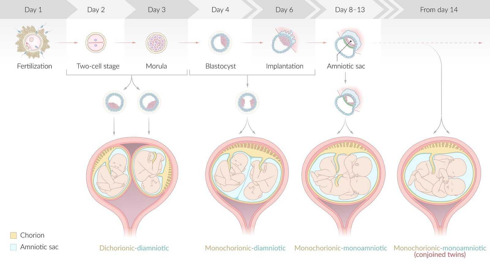
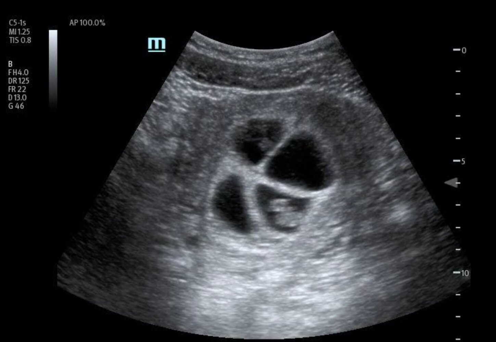
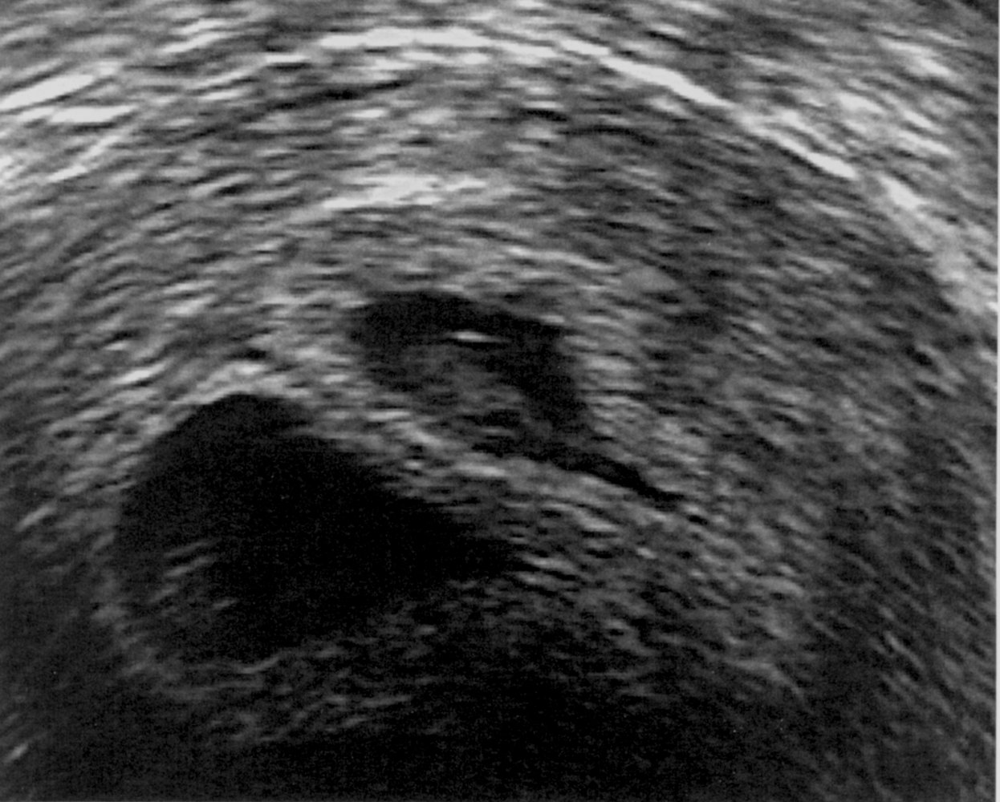
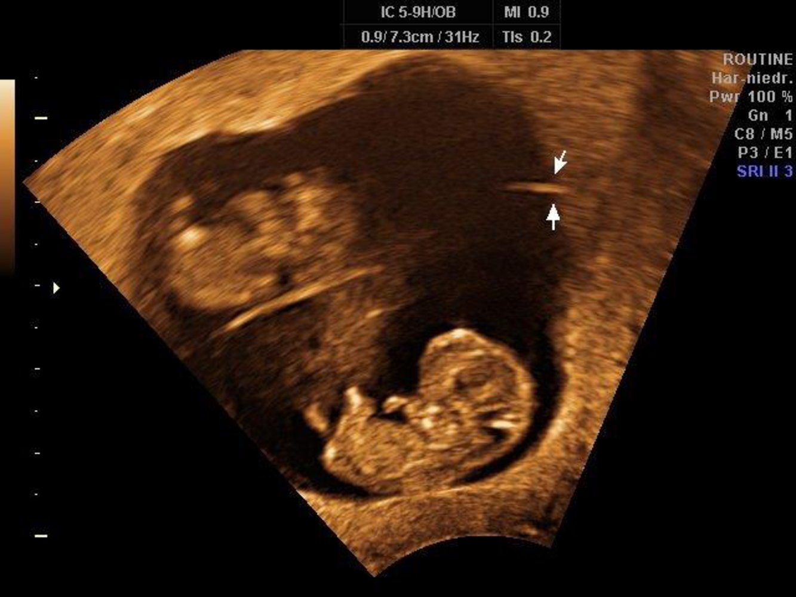
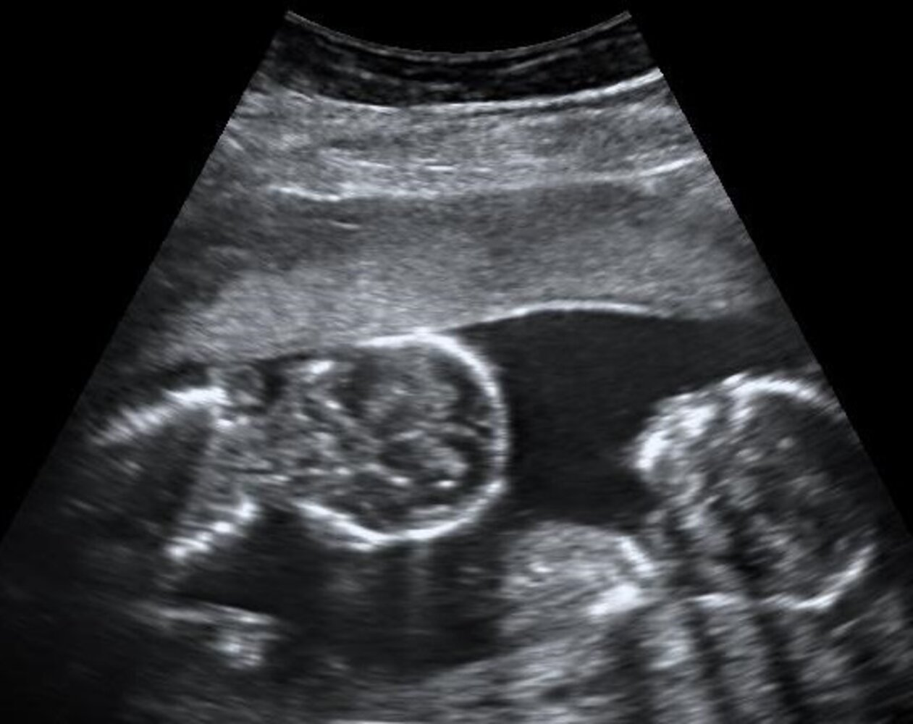

# Multifetal gestation

*Categories: Clinical knowledge > Obstetrics/gynecology > Pregnancy and prenatal care > Multifetal gestation*

[Original Article Link](https://coursology-qbank.com/amboss/article/Yl0nvT)

---

## Summary

Multifetal <u>gestation</u> is a <u>pregnancy</u> with two or more fetuses. Previous multifetal <u>gestation</u> and use of <u>assisted reproductive technology</u> increase the risk of multifetal <u>gestation</u>, which may be fraternal (<u>multizygotic</u>) or identical (<u>monozygotic</u>). The diagnosis is suspected in individuals who present with exaggerated features of <u>pregnancy</u> (e.g., <u>hyperemesis gravidarum</u>, excessive weight gain) and <u>fundal height</u> unusually large for the <u>gestational age</u>. <u>Ultrasound</u> is used to confirm the diagnosis and determine <u>chorionicity</u>. Increased <u>prenatal care</u>, including more frequent <u>ultrasound</u> surveillance, is recommended for multifetal <u>gestations</u>. <u>Multifetal reduction</u> may be recommended to improve outcomes in triplet or higher-order <u>pregnancies</u>; <u>selective termination</u> may be recommended for severe health problems in one fetus. <u>Antepartum fetal surveillance</u> is recommended in the <u>third trimester</u>, with delivery usually scheduled between 32 and 38 weeks' <u>gestation</u> for twin <u>pregnancies</u>. <u>Pregnancies</u> with more than one fetus are considered <u>high-risk pregnancies</u> and carry an increased risk of almost all <u>complications of pregnancy</u>, including <u>hypertensive pregnancy disorders</u>, <u>pregnancy loss</u>, and <u>preterm labor</u>. <u>Monochorionic</u> multifetal <u>pregnancies</u> are associated with a higher risk of complications and fetal anomalies than <u>multichorionic</u> <u>pregnancies</u> and should be monitored closely.

---

## Epidemiology

* The frequency of multiple births is calculated in accordance with Hellin's law. [[1]](https://coursology-qbank.com/amboss/article/FKcgRW0)

* Twins: ∼ 1:89

* Triplets: ∼ 1:892 (1:7,921)

* Quadruplets: ∼ 1:893 (1:704,969)

* The <u>incidence</u> of multifetal <u>gestations</u> (particularly dizygotic) has increased since the 1980s as <u>assisted reproductive technology</u> has become readily available.

Epidemiological data refers to the US, unless otherwise specified.

---

## Etiology

Predisposing factors include: [[2]](https://coursology-qbank.com/amboss/article/y5dd5q0)

* <u>Advanced maternal age</u> (≥ 35 years)

* Previous multifetal <u>gestation</u>

* Use of <u>assisted reproductive technology</u>

* Maternal <u>family history</u> of <u>dizygotic twins</u>

---

## Subtypes and variants

### Twin <u>gestations</u>

#### <u>Monozygotic</u> vs. <u>dizygotic twins</u> [[2]](https://coursology-qbank.com/amboss/article/y5dd5q0)

| Comparison of <u>monozygotic</u> vs. <u>dizygotic twins</u> |  |  |
| --- | --- | --- |
|  |  <u>Identical twins</u> (monozygotic twins) |  <u>Fraternal twins</u> (dizygotic twins) |
| Frequency |  * ⅓ of all twin <u>pregnancies</u>   |  * ⅔ of all twin <u>pregnancies</u>   |
| Origin |  * Division of the fertilized <u>oocyte</u> into two embryonic layers   |  * <u>Fertilization</u> of two <u>oocytes</u> with two mature spermatozoa   |
| Genetics of the individual |  * Genetically identical   |  * Genetically different   |
| <u>Chorionic cavity</u> and <u>amniotic sac</u> |  * Varies (see below)   |  * <u>Dichorionic-diamniotic</u>   |

### <u>Chorionicity</u> in twin <u>gestations</u> [[2]](https://coursology-qbank.com/amboss/article/y5dd5q0)

* Dizygotic <u>pregnancy</u> results in a <u>dichorionic-diamniotic</u> <u>pregnancy</u>.

* In <u>monozygotic</u> <u>pregnancies</u>, there are various pathways in which the <u>amniotic sac</u> and <u>placenta</u> are shared.

| <u>Chorionicity</u> of <u>monozygotic twin</u> <u>pregnancy</u> |  |  |  |
| --- | --- | --- | --- |
|  | Description |  Time of division of the <u>zygote</u> [[3]](https://coursology-qbank.com/amboss/article/C5dqmq0) | Frequency in <u>monozygotic twins</u> |
|  Dichorionic-diamniotic (<u>DCDA</u>) |  * The twins have separate chorionic sacs (separate <u>placentas</u>) and separate <u>amniotic sacs</u>.   |  * Within the first 3 days after <u>conception</u>   |  * ∼ 20–30%   |
|  Monochorionic-diamniotic (<u>MCDA</u>) |  * The twins share a single chorionic sac (the twins share a <u>placenta</u>) but have separate, individual <u>amniotic sacs</u>.   |  * Day 4–7 after <u>conception</u>   |  * ∼ 70%   |
|  Monochorionic-monoamniotic (<u>MCMA</u>) |  * The twins share a single chorionic sac (the twins share a <u>placenta</u>) and a single <u>amniotic sac</u>.   |  * Day 8–12 after <u>conception</u>   |  * ∼ 1–5%   |
|  <u>Monochorionic-monoamniotic</u> (conjoined twins) |  * The twins share the <u>placenta</u> and <u>amniotic sac</u> and are conjoined.   |  * From day 13 after <u>conception</u> onward   |  * < 0.1%   |

The development of monozygotic twins

> [!NOTE]
> A four-wheeler has SPACe for twins. 1st four days (0–3): Separate <u>placenta</u> and <u>amniotic sac</u>; 2nd four days (4–7): shared Placenta; 3rd four days (8–11): shared Amniotic sac; day 12 and beyond: Conjoined twins.

> [!TIP]
> Most twin <u>pregnancies</u> are <u>dichorionic-diamniotic</u> because most twins are <u>dizygotic twins</u>. Among <u>monozygotic twins</u>, however, the most common configuration is <u>monochorionic-diamniotic</u>. [[2]](https://coursology-qbank.com/amboss/article/y5dd5q0)

### Higher-order multifetal <u>gestations</u>

* Higher-order multifetal <u>gestations</u> (e.g., triplets, quadruplets) may be fraternal (<u>multizygotic</u>) or identical (<u>monozygotic</u>). [[4]](https://coursology-qbank.com/amboss/article/Cqdq0r0)

* <u>Multizygotic</u> multiples are genetically distinct; <u>monozygotic</u> multiples are genetically identical.

* In higher-order multifetal <u>gestations</u>, a combination of <u>monozygotic</u> and <u>multizygotic</u> multiples is common.

* <u>Type of placentation</u>: either <u>monochorionic</u> or <u>multichorionic</u>; and either <u>monoamniotic</u> or <u>multiamniotic</u>

> [!NOTE]
> <u>Pregnancies</u> with more than two fetuses may assume a variety of forms (e.g., triplets with two <u>monochorionic</u> fetuses and one fetus with its own <u>placenta</u>).

---

## Clinical features

* Exaggerated <u>symptoms of pregnancy</u> (e.g., <u>hyperemesis gravidarum</u>, excessive weight gain) [[5]](https://coursology-qbank.com/amboss/article/cMdanq0)

* Features of <u>complications of pregnancy</u> (e.g., <u>preeclampsia</u>, <u>gestational diabetes</u>, <u>iron deficiency anemia</u>)  [[5]](https://coursology-qbank.com/amboss/article/cMdanq0)

* <u>Physical examination</u> findings [[6]](https://coursology-qbank.com/amboss/article/z5dr5q0)

* <u>Fundal height</u> and abdominal girth unusually large for the <u>gestational age</u>

* More than one fetus felt on palpation

* Two or more <u>fetal heart rates</u> heard on <u>auscultation</u>

---

## Diagnosis

* The diagnostic approach is similar for singleton and multifetal <u>gestation</u>.

* <u>Ultrasound</u> is confirmatory.

* <u>Laboratory studies</u> may provide supportive evidence.

* See also “<u>Diagnosis of pregnancy</u>” and “<u>Prenatal ultrasound</u>.”

### <u>Laboratory studies</u>

The following parameters are elevated for <u>gestational age</u> in multifetal <u>pregnancies</u> compared to <u>singleton pregnancies</u>.

* <u>HCG</u> [[7]](https://coursology-qbank.com/amboss/article/A5dR5q0)

* Additional studies  [[5]](https://coursology-qbank.com/amboss/article/cMdanq0)[[8]](https://coursology-qbank.com/amboss/article/0MdeMq0)

* <u>Maternal serum alpha-fetoprotein</u>

* <u>Human placental lactogen</u>

### <u>Ultrasound</u> (transvaginal or transabdominal) [[3]](https://coursology-qbank.com/amboss/article/C5dqmq0)[[9]](https://coursology-qbank.com/amboss/article/95dNmq0)[[10]](https://coursology-qbank.com/amboss/article/WMdPnq0)

* <u>First-trimester ultrasound</u> is used:

* To confirm multifetal <u>gestation</u>

* To determine <u>chorionicity</u> and <u>amnionicity</u>

* As part of <u>prenatal genetic testing</u>

* <u>Second-trimester ultrasound</u> is used to monitor for complications and fetal anomalies (see “Management” section for details).

#### Diagnostic confirmation

Any of the following confirms multifetal <u>gestation</u>.

* Multiple <u>gestational sacs</u> and <u>yolk sacs</u> (in dichorionic <u>pregnancies</u>)

* Multiple embryos (<u>fetal poles</u>) and/or fetal cardiac activity

Early multiple gestation pregnancy

#### Determination of <u>chorionicity</u> and <u>amnionicity</u>

The findings are similar in twin and higher-order <u>pregnancies</u>.

* <u>Chorionicity</u> and <u>amnionicity</u> is best determined between 11 and 14 weeks' <u>gestation</u>.  [[3]](https://coursology-qbank.com/amboss/article/C5dqmq0)[[10]](https://coursology-qbank.com/amboss/article/WMdPnq0)[[11]](https://coursology-qbank.com/amboss/article/o5d0Oq0)[[12]](https://coursology-qbank.com/amboss/article/9qdN0r0)

* <u>DCDA</u> fetuses

* The <u>chorionic cavities</u> are separated from one another.

* Lambda sign: separation of the chorionic and <u>amniotic sacs</u> resembles the Greek symbol λ (lambda)

* <u>MCDA</u> fetuses

* One <u>chorionic cavity</u> is present, and each twin has an individual <u>amniotic sac</u>.

* T-sign: Separation of the <u>amniotic sacs</u> resembles the letter T on <u>ultrasound</u>.

* <u>MCMA</u> fetuses: single <u>chorionic cavity</u> <u>gestational sac</u>

* Findings on a second-trimester scan [[11]](https://coursology-qbank.com/amboss/article/o5d0Oq0)

* <u>Monochorionic</u> <u>pregnancies</u> 

* A single <u>placenta</u> is present.

* Fetuses are of the same sex.

* <u>Multichorionic</u> <u>pregnancies</u>

* Each fetus has its own distinct <u>placenta</u>.

* Sex of the fetuses may differ.

Lambda sign (twin peak sign) in twin pregnancy

Lambda sign in dichorionic diamniotic twin pregnancy

T-sign in monochorionic diamniotic twin pregnancy

Monoamniotic twins

> [!TIP]
> <u>Monochorionic</u> multifetal <u>pregnancies</u> are associated with a higher risk of complications and fetal anomalies than <u>multichorionic</u> <u>pregnancies</u>. Identification of <u>chorionicity</u> and <u>amnionicity</u> in the <u>first trimester</u> or early <u>second trimester</u> is recommended to facilitate close monitoring of this group of patients. [[10]](https://coursology-qbank.com/amboss/article/WMdPnq0)[[11]](https://coursology-qbank.com/amboss/article/o5d0Oq0)[[12]](https://coursology-qbank.com/amboss/article/9qdN0r0)

---

## Management

### General principles [[10]](https://coursology-qbank.com/amboss/article/WMdPnq0)[[11]](https://coursology-qbank.com/amboss/article/o5d0Oq0)[[12]](https://coursology-qbank.com/amboss/article/9qdN0r0)

* Multifetal <u>gestations</u> are <u>high-risk pregnancies</u> and require appropriate <u>prenatal care</u> and delivery planning.

* <u>Prenatal care</u> may require referral to various specialists (e.g., <u>obstetrician</u> specialized in multifetal <u>gestations</u>, <u>maternal-fetal medicine</u>, neonatology). [[9]](https://coursology-qbank.com/amboss/article/95dNmq0)[[13]](https://coursology-qbank.com/amboss/article/8LdOzq0)

* <u>Management of preterm labor</u> is often required.

> [!TIP]
> Spontaneous <u>labor</u> before 37 weeks' <u>gestation</u> occurs in 60% of twin <u>pregnancies</u>. [[10]](https://coursology-qbank.com/amboss/article/WMdPnq0)

> [!TIP]
> Prophylactic measures to prevent <u>preterm delivery</u> (e.g., bed rest, hospitalization, <u>cervical cerclage</u>, <u>tocolytics</u>) are not routinely recommended in the management of uncomplicated multifetal <u>gestations</u>. [[11]](https://coursology-qbank.com/amboss/article/o5d0Oq0)

### <u>Prenatal care</u> [[11]](https://coursology-qbank.com/amboss/article/o5d0Oq0)[[12]](https://coursology-qbank.com/amboss/article/9qdN0r0)

Modifications to routine <u>prenatal care</u> for multifetal <u>pregnancies</u> include the following:

* Counseling regarding the <u>complications of multifetal gestation</u>, including spontaneous loss of a fetus  [[11]](https://coursology-qbank.com/amboss/article/o5d0Oq0)[[12]](https://coursology-qbank.com/amboss/article/9qdN0r0)

* Discussion of the challenges of prenatal genetic screening, e.g.:

* Typically less reliable in multifetal <u>gestations</u>

* Risk of sampling the wrong fetus with <u>amniocentesis</u> or <u>chorionic villus sampling</u>

* <u>Nondirective counseling</u> on elective fetal termination  ;  [[10]](https://coursology-qbank.com/amboss/article/WMdPnq0)[[12]](https://coursology-qbank.com/amboss/article/9qdN0r0)[[13]](https://coursology-qbank.com/amboss/article/8LdOzq0)

* <u>Multifetal reduction</u> to improve outcomes for the remaining fetus or fetuses and birthing parent; typically performed in the <u>first trimester</u>

* <u>Selective fetal termination</u> if fetal anomalies are detected; typically performed in the <u>second trimester</u>

* Initiation of <u>aspirin for preeclampsia prophylaxis</u>

* Additional <u>ultrasound</u> monitoring includes regular assessment of: [[9]](https://coursology-qbank.com/amboss/article/95dNmq0)[[10]](https://coursology-qbank.com/amboss/article/WMdPnq0)

* <u>Fetal biometry</u>

* <u>Umbilical artery Doppler velocimetry</u> to assess for <u>twin-to-twin transfusion syndrome</u> in <u>monochorionic</u> <u>pregnancies</u> [[10]](https://coursology-qbank.com/amboss/article/WMdPnq0)[[14]](https://coursology-qbank.com/amboss/article/ZMdZMq0)

* Third-trimester <u>antepartum fetal surveillance</u> [[15]](https://coursology-qbank.com/amboss/article/ME1Mwi0)

* Consideration of increased nutritional requirements for multifetal <u>gestations</u> (e.g., additional <u>iron</u> and <u>folate supplementation</u>) [[12]](https://coursology-qbank.com/amboss/article/9qdN0r0)

> [!TIP]
> Monitor uncomplicated dichorionic <u>gestations</u> with <u>ultrasound</u> every 4 weeks after the second-trimester scan and uncomplicated <u>monochorionic</u> <u>gestations</u> every 2 weeks after 16 weeks' <u>gestation</u>. Increase frequency of scans for patients with complicated multifetal <u>gestation</u>. [[9]](https://coursology-qbank.com/amboss/article/95dNmq0)[[10]](https://coursology-qbank.com/amboss/article/WMdPnq0)[[11]](https://coursology-qbank.com/amboss/article/o5d0Oq0)

### Delivery planning [[10]](https://coursology-qbank.com/amboss/article/WMdPnq0)[[11]](https://coursology-qbank.com/amboss/article/o5d0Oq0)[[12]](https://coursology-qbank.com/amboss/article/9qdN0r0)

Early delivery of multifetal <u>gestations</u> is recommended, as <u>perinatal</u> mortality increases after 38 weeks' <u>gestation</u>. There is a paucity of data on the optimal timing and route of delivery of triplet and higher-order <u>gestations</u>.

* Consider <u>antenatal corticosteroid therapy for fetal maturation</u> and schedule delivery: [[11]](https://coursology-qbank.com/amboss/article/o5d0Oq0)

* <u>DCDA</u> twins: 38 weeks' <u>gestation</u>

* <u>MCDA</u> twins: 34–38 weeks' <u>gestation</u>

* <u>MCMA</u> twins: 32–34 weeks' <u>gestation</u>

* Higher-order <u>gestations</u>: Optimal timing is unknown.  [[12]](https://coursology-qbank.com/amboss/article/9qdN0r0)

* <u>Indications for cesarean delivery</u> include:  [[11]](https://coursology-qbank.com/amboss/article/o5d0Oq0)[[12]](https://coursology-qbank.com/amboss/article/9qdN0r0)

* Presenting fetus in breech position

* <u>MCMA</u> <u>pregnancies</u>

* Lack of <u>obstetrician</u> experience in delivering multifetal <u>gestations</u>

* See also “<u>Management of high-risk pregnancies</u>” and “<u>Preterm labor and birth</u>.”

---

## Complications

Multifetal <u>gestations</u> are associated with increased risk of maternal and fetal and/or neonatal <u>morbidity</u> and mortality. Nearly all complications associated with normal <u>pregnancies</u> are more likely in multifetal <u>gestations</u>.

### Maternal complications [[11]](https://coursology-qbank.com/amboss/article/o5d0Oq0)[[12]](https://coursology-qbank.com/amboss/article/9qdN0r0)

* Antenatal complications

* <u>Hyperemesis gravidarum</u>

* <u>Gestational diabetes</u>

* <u>Hypertensive disorders of pregnancy</u>

* <u>Cervical incompetence</u>

* <u>Intrapartum</u> complications

* <u>Preterm labor and birth</u> (most common complication)

* <u>Premature rupture of membranes</u> [[16]](https://coursology-qbank.com/amboss/article/oeW0-40)

* <u>Prolonged first stage of labor</u> , premature <u>placental abruption</u> after <u>birth</u> of the first fetus, prolapsed cord [[17]](https://coursology-qbank.com/amboss/article/aodQ0I0)

* <u>Uterine atony</u>

* <u>Placenta previa</u> [[12]](https://coursology-qbank.com/amboss/article/9qdN0r0)[[18]](https://coursology-qbank.com/amboss/article/0ode0I0)

### Fetal complications [[11]](https://coursology-qbank.com/amboss/article/o5d0Oq0)[[12]](https://coursology-qbank.com/amboss/article/9qdN0r0)

* <u>Intrauterine demise</u> (<u>spontaneous abortion</u>)

* Vanishing twin syndrome: spontaneous fetal reduction; mostly occurs in the <u>first trimester</u>

* <u>Twin-to-twin transfusion syndrome</u> (in <u>monochorionic</u> <u>pregnancies</u>)

* <u>Placental insufficiency</u>, <u>hypotrophy</u>, and intrauterine <u>malnutrition</u> of at least one fetus

* <u>Umbilical cord entanglement</u>: can occur only in <u>monoamniotic</u> twin <u>pregnancies</u>

* <u>Intrauterine growth restriction</u>

* Congenital abnormalities

### Neonatal or long-term complications [[12]](https://coursology-qbank.com/amboss/article/9qdN0r0)

* <u>Complications of prematurity</u> (e.g., <u>neonatal respiratory distress syndrome</u>, <u>intraventricular hemorrhage</u>)

* <u>Cerebral palsy</u>

* Blindness

* <u>Deafness</u>

We list the most important complications. The selection is not exhaustive.

---

## Twin-to-twin transfusion syndrome

* Affects 10–15% of <u>monochorionic</u> twin <u>pregnancies</u> (twins that share the <u>placenta</u>)

* Predominantly affects <u>MCDA</u> <u>pregnancies</u> but may also affect <u>MCMA</u> <u>pregnancies</u> [[14]](https://coursology-qbank.com/amboss/article/ZMdZMq0)

* Blood is continuously shunted from one twin to the other through vascular <u>anastomoses</u> on the shared <u>placenta</u>, posing a risk to both fetuses.

* Recipient twin

* <u>Polycythemia</u>

* <u>Hypervolemia</u>

* <u>Polyhydramnios</u> in diamniotic <u>pregnancies</u>

* Donor twin

* <u>Anemia</u>

* <u>Fetal growth restriction</u>

* <u>Hypovolemia</u>, <u>dehydration</u> (stuck twin or cocooned appearance)

* <u>Oligohydramnios</u> in diamniotic <u>pregnancies</u>

* Management options include: [[14]](https://coursology-qbank.com/amboss/article/ZMdZMq0)

* Suspected <u>twin-to-twin transfusion syndrome</u> : fetal surveillance (at least weekly)

* Confirmed <u>twin-to-twin transfusion syndrome</u>

* Termination of significantly affected fetus or complete <u>pregnancy</u>

* Fetoscopic laser <u>surgery</u> of intertwin <u>placental</u> <u>anastomoses</u> at 16–26 weeks' <u>gestation</u>

> [!TIP]
> <u>Twin-to-twin transfusion syndrome</u> may occur in <u>monochorionic</u> twins. [[3]](https://coursology-qbank.com/amboss/article/C5dqmq0)

---