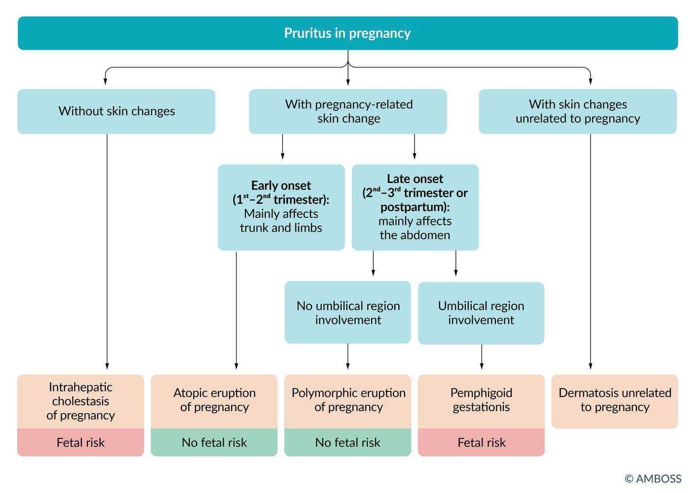

# Pregnancy-associated liver diseases

*Categories: Clinical knowledge > Obstetrics/gynecology > Pregnancy and prenatal care > Pregnancy-associated liver diseases*

[Original Article Link](https://coursology-qbank.com/amboss/article/9v0NXR)

---

## Summary

<u>Liver</u> diseases unique to <u>pregnancy</u> include <u>intrahepatic cholestasis of pregnancy</u>, <u>acute fatty liver of pregnancy</u> (<u>AFLP</u>), <u>hyperemesis gravidarum</u>, and <u>HELLP syndrome</u>. The diagnostic evaluation of abnormal <u>liver chemistries</u> is similar in pregnant and nonpregnant individuals; it includes <u>diagnostics for transaminitis</u> and abdominal <u>ultrasound</u> to assess for causes of abnormal <u>liver chemistries</u> unrelated to <u>pregnancy</u> (e.g., viral <u>hepatitis</u>) and for findings associated with conditions unique to <u>pregnancy</u>. <u>Intrahepatic cholestasis of pregnancy</u> manifests in the second or <u>third trimester</u> and is characterized by <u>jaundice</u>, <u>pruritus</u>, and elevated serum <u>bile acid</u> levels. <u>AFLP</u> most commonly manifests in the <u>third trimester</u>. Diagnosis of <u>AFLP</u> is supported by clinical features (e.g., <u>vomiting</u>, <u>jaundice</u>, <u>encephalopathy</u>) and imaging findings (<u>hyperechoic</u> <u>liver</u>, <u>ascites</u>); <u>biopsy</u> is rarely needed. Management of <u>pregnancy</u>-associated <u>liver</u> disease is multidisciplinary. Treatment of <u>intrahepatic cholestasis of pregnancy</u> involves <u>ursodeoxycholic acid</u>, and timing of delivery is based on the degree of serum <u>bile acid</u> elevation. Management of <u>AFLP</u> involves <u>supportive care</u> and immediate delivery to reduce risks to the pregnant individual and fetus.

This article covers <u>intrahepatic cholestasis of pregnancy</u> and <u>AFLP</u>. <u>Hyperemesis gravidarum</u> and <u>HELLP syndrome</u> are detailed separately.

---

## Overview

### Causes of abnormal <u>liver chemistries</u> in <u>pregnancy</u> [[1]](https://coursology-qbank.com/amboss/article/yncdD10)[[2]](https://coursology-qbank.com/amboss/article/a51Qih0)

* Normal physiology  [[3]](https://coursology-qbank.com/amboss/article/iPdJeJ0)

* <u>Liver</u> disease unrelated to <u>pregnancy</u>

* <u>Liver</u> diseases unique to <u>pregnancy</u>  [[4]](https://coursology-qbank.com/amboss/article/7jc4bc0)

* <u>Hyperemesis gravidarum</u>  [[2]](https://coursology-qbank.com/amboss/article/a51Qih0)

* <u>Intrahepatic cholestasis of pregnancy</u>

* <u>Acute fatty liver of pregnancy</u>

* <u>HELLP syndrome</u>

| Overview of liver disease in pregnancy |  |  |  |  |  |
| --- | --- | --- | --- | --- | --- |
|  |  | <u>HELLP syndrome</u> | <u>Acute fatty liver of pregnancy</u> | <u>Intrahepatic cholestasis of pregnancy</u> | <u>Acute viral hepatitis</u> |
| Trimester |  |  * <u>Third trimester</u>   |  |  |  * Any trimester   |
| Clinical features |  |   * <u>Preeclampsia</u>  * Rapid clinical deterioration  * <u>RUQ</u> <u>pain</u>  * <u>Nausea</u>, <u>vomiting</u>, <u>diarrhea</u>    |   * Sudden onset of <u>jaundice</u>  * <u>Nausea</u>, <u>vomiting</u>  * <u>RUQ</u> <u>pain</u>  * <u>Ascites</u>    |   * <u>Jaundice</u>  * <u>Pruritus</u>    |   * <u>Prodromal</u> phase (1–2 weeks)  * <u>Fever</u>, <u>malaise</u>  * <u>Nausea</u>, <u>vomiting</u>, <u>anorexia</u>  * <u>RUQ</u> <u>pain</u>  * Tender <u>hepatomegaly</u>  * Icteric phase (∼ 2 weeks)  * <u>Jaundice</u>  * <u>Pruritus</u>  * Dark urine and pale stools    |
| Diagnostics |  |   * H = <u>hemolysis</u> (↓ <u>hemoglobin</u>, ↓ <u>haptoglobin</u>, ↑ <u>LDH</u>, ↑ <u>indirect bilirubin</u>)  * EL = elevated <u>liver</u> enzymes (↑ <u>AST</u>, ↑ <u>ALT</u>)  * <u>LP</u> = <u>low platelets</u>    |   * ↑ <u>WBC</u>, possible ↓ <u>platelets</u>  * ↑ <u>ALT</u>, ↑ <u>AST</u>  * <u>Hyperbilirubinemia</u>  * <u>Hypoglycemia</u>  * <u>Coagulopathy</u> (prolonged <u>PT</u> and/or <u>aPTT</u>)    |   * ↑ Total serum <u>bile acid</u> levels: > 10 mcmol/L  * ↑ <u>ALT</u>, ↑ <u>AST</u>  * ↑ <u>ALP</u>, ↑ <u>GGT</u>  * ↑ <u>Direct bilirubin</u>    |   * ↑ <u>AST</u>, ↑ <u>ALT</u>  * <u>AST</u>/<u>ALT</u> <u>ratio</u> < 1  * ↑ Total <u>bilirubin</u>  * ↑ <u>ALP</u>, ↑ <u>GGT</u>    |
| Treatment |  |   * Stabilization  * <u>IV fluids</u>  * <u>Blood transfusions</u>  * <u>Antihypertensive agents</u>  * <u>Magnesium sulfate</u>  * Delivery if ≥ 34 weeks' <u>gestation</u> or at any <u>gestational age</u> with deteriorating maternal or fetal status    |   * Stabilization  * Immediate delivery    |   * <u>Ursodeoxycholic acid</u>  * Delivery at 36–39 weeks' <u>gestation</u> based on severity    |  * <u>Supportive care</u>   |
| Complications | Maternal |   * <u>Placental abruption</u>  * <u>DIC</u>  * <u>Pulmonary edema</u>  * <u>Acute renal failure</u>  * <u>Stroke</u>  * <u>Acute respiratory distress syndrome</u> (<u>ARDS</u>)  * Hepatic subcapsular <u>hematoma</u>  * Maternal <u>death</u>    |   * <u>Acute liver failure</u>  * <u>Acute renal failure</u>  * <u>Encephalopathy</u>  * <u>Death</u>    |  * Recurrence in following <u>pregnancies</u>   |   * <u>Hepatitis E</u>: <u>acute liver failure</u>  * <u>Death</u>    |
| Fetal |   * <u>Fetal growth restriction</u>  * <u>Preterm birth</u>  * <u>Seizure</u>-induced fetal <u>hypoxia</u>  * <u>Death</u>    |  * <u>Death</u>   |   * <u>Fetal growth restriction</u>  * <u>Death</u>  * <u>Preterm birth</u>    |  * <u>Death</u>   |  |

> [!TIP]
> Mildly elevated <u>ALP</u> is normal in <u>pregnancy</u>. Pregnant patients with <u>elevated transaminase</u> and/or <u>bilirubin</u> levels should be evaluated for hepatocellular and biliary disease. [[1]](https://coursology-qbank.com/amboss/article/yncdD10)[[5]](https://coursology-qbank.com/amboss/article/051eih0)

### Management of abnormal <u>liver chemistries</u> in <u>pregnancy</u> [[1]](https://coursology-qbank.com/amboss/article/yncdD10)[[2]](https://coursology-qbank.com/amboss/article/a51Qih0)[[5]](https://coursology-qbank.com/amboss/article/051eih0)

* Initial evaluation of abnormal <u>liver chemistries</u> is similar in pregnant and nonpregnant individuals.

* <u>Hepatocellular injury pattern</u>: Perform <u>diagnostics for transaminitis</u>.

* <u>Cholestatic injury pattern</u>: Obtain abdominal imaging.

* <u>Ultrasound</u> is the preferred imaging modality throughout <u>pregnancy</u>.

* If additional imaging is needed, <u>MRI</u> without <u>gadolinium</u> is recommended.  [[2]](https://coursology-qbank.com/amboss/article/a51Qih0)

* If <u>liver</u> disease unique to <u>pregnancy</u> is suspected , refer to specialists to guide further diagnostic evaluation and management.

* Treatment is based on the cause of abnormal <u>liver chemistries</u> and may include <u>supportive care</u>, pharmacological treatment, and early delivery.

> [!TIP]
> For patients with <u>pregnancy</u>-related <u>liver</u> disease, a <u>multidisciplinary care</u> team approach (e.g., gastroenterology, <u>maternal-fetal medicine</u>) is important for minimizing maternal and fetal <u>morbidity</u> and mortality. [[2]](https://coursology-qbank.com/amboss/article/a51Qih0)

---

## Intrahepatic cholestasis of pregnancy

<u>Intrahepatic cholestasis of pregnancy</u> most commonly manifests in the second or <u>third trimester</u> with <u>pruritus</u> and elevated serum <u>bile acid</u> levels. [[4]](https://coursology-qbank.com/amboss/article/7jc4bc0)

### <u>Epidemiology</u>

* Most common <u>pregnancy</u>-associated <u>liver</u> disease [[1]](https://coursology-qbank.com/amboss/article/yncdD10)

* Occurs in ∼ 0.4–10% of <u>pregnancies</u> [[2]](https://coursology-qbank.com/amboss/article/a51Qih0)

### Etiology [[2]](https://coursology-qbank.com/amboss/article/a51Qih0)[[5]](https://coursology-qbank.com/amboss/article/051eih0)

* Genetic predisposition

* Increased <u>estrogen</u> and <u>progesterone</u> during <u>pregnancy</u>

* Certain drugs (e.g., <u>antibiotics</u>)

### Clinical features [[2]](https://coursology-qbank.com/amboss/article/a51Qih0)[[5]](https://coursology-qbank.com/amboss/article/051eih0)

* <u>Pruritus</u>

* <u>Jaundice</u>  [[1]](https://coursology-qbank.com/amboss/article/yncdD10)

* <u>Steatorrhea</u> (uncommon)

### Diagnostics [[1]](https://coursology-qbank.com/amboss/article/yncdD10)[[2]](https://coursology-qbank.com/amboss/article/a51Qih0)[[4]](https://coursology-qbank.com/amboss/article/7jc4bc0)

* ↑ Total serum <u>bile acid</u> levels (> 10 mcmol/L): confirmatory   [[1]](https://coursology-qbank.com/amboss/article/yncdD10)[[2]](https://coursology-qbank.com/amboss/article/a51Qih0)[[3]](https://coursology-qbank.com/amboss/article/iPdJeJ0)

* ↑ <u>ALT</u>, ↑ <u>AST</u>  [[2]](https://coursology-qbank.com/amboss/article/a51Qih0)

* Normal or mildly elevated <u>bilirubin</u>

* ↑ <u>GGT</u>, ↑ <u>ALP</u> [[3]](https://coursology-qbank.com/amboss/article/iPdJeJ0)

> [!TIP]
> Elevated total serum <u>bile acid</u> level (> 10 mcmol/L) in a patient with <u>pruritus</u> in the second or <u>third trimester</u> (without other <u>causes of pruritus</u>) is diagnostic for <u>intrahepatic cholestasis of pregnancy</u>. <u>Elevated transaminases</u> are not required for diagnostic confirmation. [[2]](https://coursology-qbank.com/amboss/article/a51Qih0)

Pruritus in pregnancy

### Management [[2]](https://coursology-qbank.com/amboss/article/a51Qih0)[[4]](https://coursology-qbank.com/amboss/article/7jc4bc0)

* Pharmacological treatment

* First line: <u>ursodeoxycholic acid</u> (<u>off-label</u>)DOSAGE  (reduces <u>bile acid</u> levels and <u>pruritus</u>)  [[1]](https://coursology-qbank.com/amboss/article/yncdD10)[[2]](https://coursology-qbank.com/amboss/article/a51Qih0)[[4]](https://coursology-qbank.com/amboss/article/7jc4bc0)

* Alternative or adjunctive therapies (e.g., for refractory <u>pruritus</u>): <u>first-generation antihistamines</u>, <u>S-adenosylmethionine</u>, <u>cholestyramine</u>, <u>rifampicin</u> [[1]](https://coursology-qbank.com/amboss/article/yncdD10)[[2]](https://coursology-qbank.com/amboss/article/a51Qih0)[[4]](https://coursology-qbank.com/amboss/article/7jc4bc0)

* <u>Prenatal care</u>

* Perform <u>antepartum fetal surveillance</u>.  [[4]](https://coursology-qbank.com/amboss/article/7jc4bc0)

* Consider repeat serum <u>bile acid</u> levels to help guide timing of delivery.  [[4]](https://coursology-qbank.com/amboss/article/7jc4bc0)

* Administer <u>corticosteroids for fetal lung maturity</u> if <u>preterm delivery</u> is anticipated. [[1]](https://coursology-qbank.com/amboss/article/yncdD10)

* Peripartum management: Deliver at 36–39 weeks' <u>gestation</u> based on severity. [[4]](https://coursology-qbank.com/amboss/article/7jc4bc0)

* <u>Bile acid</u> levels ≥ 100 mcmol/L: Deliver at 36 weeks' <u>gestation</u>.

* <u>Bile acid</u> levels between 10 and 100 mcmol/L: Deliver between 36 and 39 weeks' <u>gestation</u>.

* Consider earlier delivery (e.g., between 34 and 36 weeks' <u>gestation</u>) for patients with:

* Severe intractable <u>pruritus</u>

* Worsening <u>liver</u> dysfunction

* History of <u>stillbirth</u> due to <u>intrahepatic cholestasis of pregnancy</u>

* Perform continuous fetal monitoring during <u>labor</u>.

* Postpartum management [[4]](https://coursology-qbank.com/amboss/article/7jc4bc0)

* Complete resolution typically occurs postpartum.

* For patients with persistent symptoms 4–6 weeks postpartum:

* Repeat laboratory testing

* Refer to specialist (e.g., hepatology, gastroenterology) for further evaluation

> [!TIP]
> Early initiation of therapy with <u>ursodeoxycholic acid</u> may reduce the risk of <u>preterm birth</u> and <u>stillbirth</u>. [[4]](https://coursology-qbank.com/amboss/article/7jc4bc0)

> [!WARNING]
> <u>Cholestyramine</u> can cause significant adverse effects (including increased risk of neonatal <u>intracranial hemorrhage</u>) and should be used with caution. [[2]](https://coursology-qbank.com/amboss/article/a51Qih0)[[4]](https://coursology-qbank.com/amboss/article/7jc4bc0)

### Complications [[2]](https://coursology-qbank.com/amboss/article/a51Qih0)[[5]](https://coursology-qbank.com/amboss/article/051eih0)

* <u>Intrauterine fetal demise</u> (1.2% after 37 weeks) [[4]](https://coursology-qbank.com/amboss/article/7jc4bc0)

* <u>Fetal growth restriction</u>

* <u>Premature labor</u>;  and increased <u>preterm birth</u> rates

* <u>Meconium</u>-stained <u>amniotic fluid</u>

* Neonatal respiratory <u>depression</u>

* Recurrence in subsequent <u>pregnancies</u> (60%–90%) [[4]](https://coursology-qbank.com/amboss/article/7jc4bc0)[[6]](https://coursology-qbank.com/amboss/article/zncrD10)

---

## Acute fatty liver of pregnancy

<u>Acute fatty liver of pregnancy</u> is an <u>idiopathic</u>, rare, life-threatening obstetric emergency most commonly arising in the <u>third trimester</u>, characterized by extensive fatty infiltration of the <u>liver</u>, which can result in <u>acute liver failure</u> [[1]](https://coursology-qbank.com/amboss/article/yncdD10)[[5]](https://coursology-qbank.com/amboss/article/051eih0)

### <u>Epidemiology</u>

* 1–3 cases per 10,000 <u>pregnancies</u> [[7]](https://coursology-qbank.com/amboss/article/A4XRNy)

### Etiology

* <u>Risk factors</u> [[1]](https://coursology-qbank.com/amboss/article/yncdD10)[[5]](https://coursology-qbank.com/amboss/article/051eih0)

* <u>Multiple pregnancy</u>

* Male fetus

* Low <u>BMI</u>

* Pathophysiology: dysfunction of <u>fatty acid β-oxidation</u> [[5]](https://coursology-qbank.com/amboss/article/051eih0)

### Clinical features [[1]](https://coursology-qbank.com/amboss/article/yncdD10)[[3]](https://coursology-qbank.com/amboss/article/iPdJeJ0)[[5]](https://coursology-qbank.com/amboss/article/051eih0)

* Sudden onset of <u>jaundice</u>

* <u>RUQ</u> <u>pain</u>, <u>nausea</u>, and <u>vomiting</u>

* <u>Polyuria</u> and <u>polydipsia</u>

* Clinical features of complications (e.g., <u>hepatic encephalopathy</u>, <u>ascites</u>, <u>bleeding diathesis</u>)

* <u>Preeclampsia</u> (present in ∼ 50% of patients) [[3]](https://coursology-qbank.com/amboss/article/iPdJeJ0)

### Diagnostics [[1]](https://coursology-qbank.com/amboss/article/yncdD10)[[3]](https://coursology-qbank.com/amboss/article/iPdJeJ0)[[5]](https://coursology-qbank.com/amboss/article/051eih0)

* <u>Diagnostics for transaminitis</u> are similar to diagnostics in nonpregnant adults.

* <u>Ultrasound</u> is the preferred initial imaging modality to exclude alternative diagnoses (e.g., <u>liver hematoma</u>). [[1]](https://coursology-qbank.com/amboss/article/yncdD10)

* <u>Liver biopsy</u> is rarely necessary but may be considered for: [[5]](https://coursology-qbank.com/amboss/article/051eih0)

* Diagnostic uncertainty (e.g., atypical presentation) that affects management [[2]](https://coursology-qbank.com/amboss/article/a51Qih0)

* Persistent postpartum <u>liver</u> dysfunction

* Swansea criteria: a set of clinical, imaging, and/or histological findings commonly used to evaluate for <u>AFLP</u>

* The presence of ≥ 6 features suggests <u>AFLP</u>.

* Limitations include low <u>specificity</u> for distinguishing from other <u>causes of acute liver failure</u> in severe disease and limited <u>sensitivity</u> for detecting early disease. [[2]](https://coursology-qbank.com/amboss/article/a51Qih0)[[5]](https://coursology-qbank.com/amboss/article/051eih0)

* Diagnostic testing may show findings associated with complications (e.g., <u>thrombocytopenia</u> in patients with <u>DIC</u>). [[1]](https://coursology-qbank.com/amboss/article/yncdD10)[[2]](https://coursology-qbank.com/amboss/article/a51Qih0)

|  Swansea criteria for <u>AFLP</u> [[1]](https://coursology-qbank.com/amboss/article/yncdD10)[[2]](https://coursology-qbank.com/amboss/article/a51Qih0)[[8]](https://coursology-qbank.com/amboss/article/9GdNY70)  |  |
| --- | --- |
| Clinical features |   * <u>Vomiting</u>  * Abdominal <u>pain</u>  * <u>Polydipsia</u> and/or <u>polyuria</u>  * <u>Encephalopathy</u>    |
| <u>Laboratory studies</u> |   * ↑ <u>WBC</u>  * ↑ <u>ALT</u>, ↑ <u>AST</u>  * <u>Hyperbilirubinemia</u>  * ↑ <u>Creatinine</u>  * <u>Hyperuricemia</u>  * <u>Hypoglycemia</u>  * <u>Coagulopathy</u> (prolonged <u>PT</u> and/or <u>aPTT</u>)  * <u>Hyperammonemia</u>    |
| <u>Ultrasound</u> findings |  * Bright white <u>liver</u> or presence of <u>ascites</u>   |
| <u>Histology</u> |  * <u>Microvascular</u> <u>steatosis</u> on <u>liver biopsy</u>   |
| Presence of ≥ 6 features suggests <u>AFLP</u>. |  |

> [!WARNING]
> Rule out causes of <u>acute liver injury</u> that are unrelated to <u>pregnancy</u> (e.g., <u>acute viral hepatitis</u>, <u>autoimmune hepatitis</u>, <u>drug-induced liver injury</u>, <u>Wilson disease</u>). [[5]](https://coursology-qbank.com/amboss/article/051eih0)

### Differential diagnoses

* <u>HELLP syndrome</u>

* <u>Preeclampsia with severe features</u>

* Other <u>causes of acute liver failure</u>

> [!TIP]
> It is often difficult to differentiate between <u>AFLP</u>, <u>HELLP</u>, and <u>preeclampsia with severe features</u>, and these conditions can also coexist. <u>Renal failure</u>, <u>hyperuricemia</u>, and <u>hypoglycemia</u> are more common and severe in <u>AFLP</u> than in <u>HELLP</u> and <u>severe preeclampsia</u>. [[5]](https://coursology-qbank.com/amboss/article/051eih0)

### Management [[5]](https://coursology-qbank.com/amboss/article/051eih0)[[7]](https://coursology-qbank.com/amboss/article/A4XRNy)

* Deliver immediately regardless of <u>gestational age</u>.  [[1]](https://coursology-qbank.com/amboss/article/yncdD10)

* Consult specialists as needed (e.g., hepatology, critical care, <u>maternal fetal medicine</u>).

* Provide <u>supportive care</u> and management of complications (see "<u>Management of acute liver failure</u>").

* Perform diagnostic testing for <u>fatty acid metabolism disorders</u> in the <u>newborn</u>.

### Complications [[5]](https://coursology-qbank.com/amboss/article/051eih0)

* <u>Acute liver failure</u>  [[9]](https://coursology-qbank.com/amboss/article/rjcfbc0)

* <u>Encephalopathy</u>

* <u>Disseminated intravascular coagulation</u>

* <u>Ascites</u>, <u>pulmonary edema</u>

* <u>Acute renal failure</u>

* <u>Pancreatitis</u>

* Infection

* Maternal <u>death</u> (∼ 2%)

* <u>Fetal demise</u> (∼ 10–20%)

### Prognosis [[5]](https://coursology-qbank.com/amboss/article/051eih0)

* Clinical improvement is typically seen within 4 days of delivery.

* Laboratory abnormalities may persist for > 1 week.

---