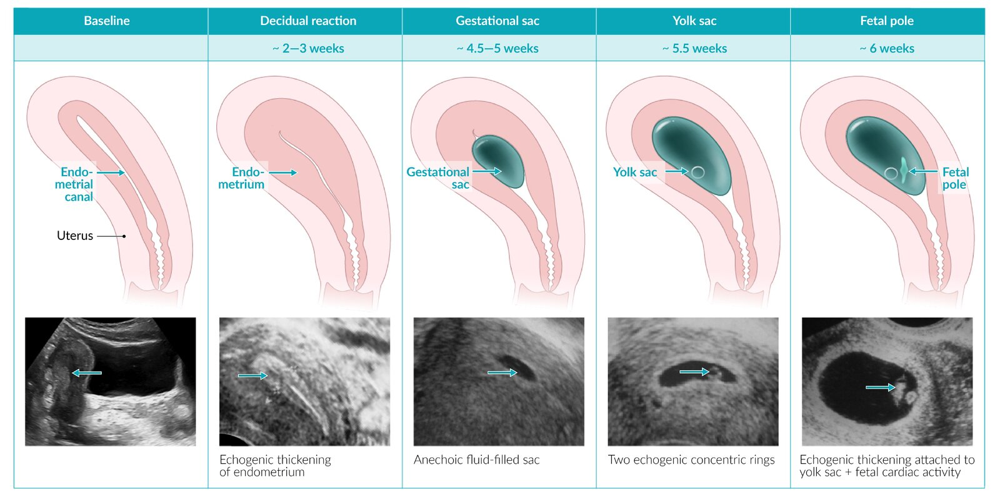
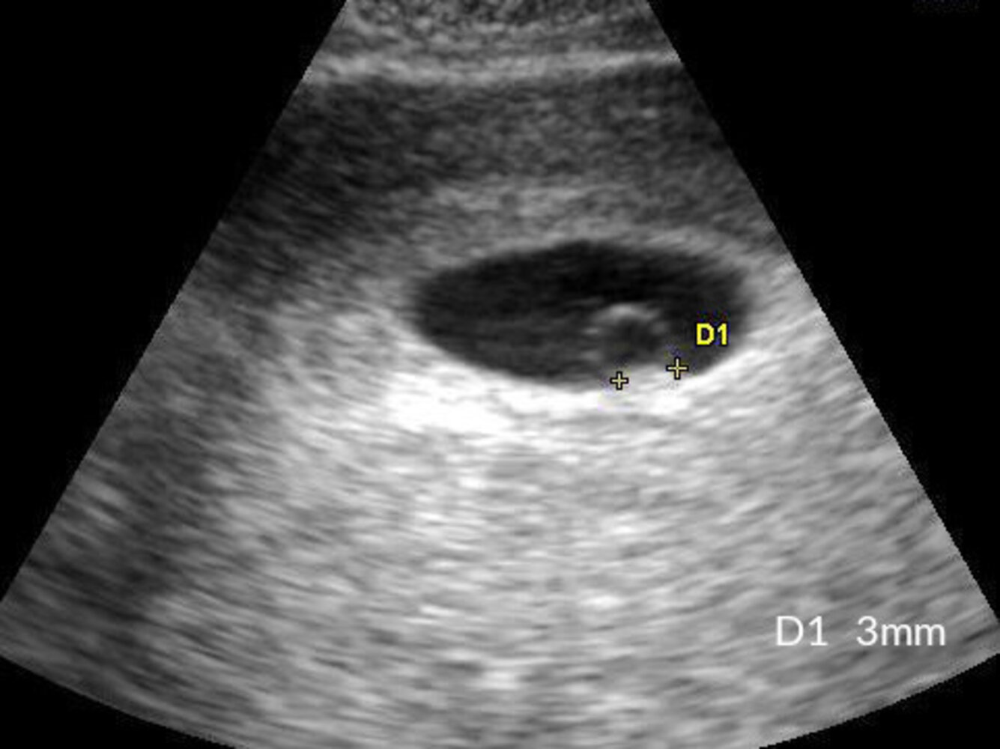
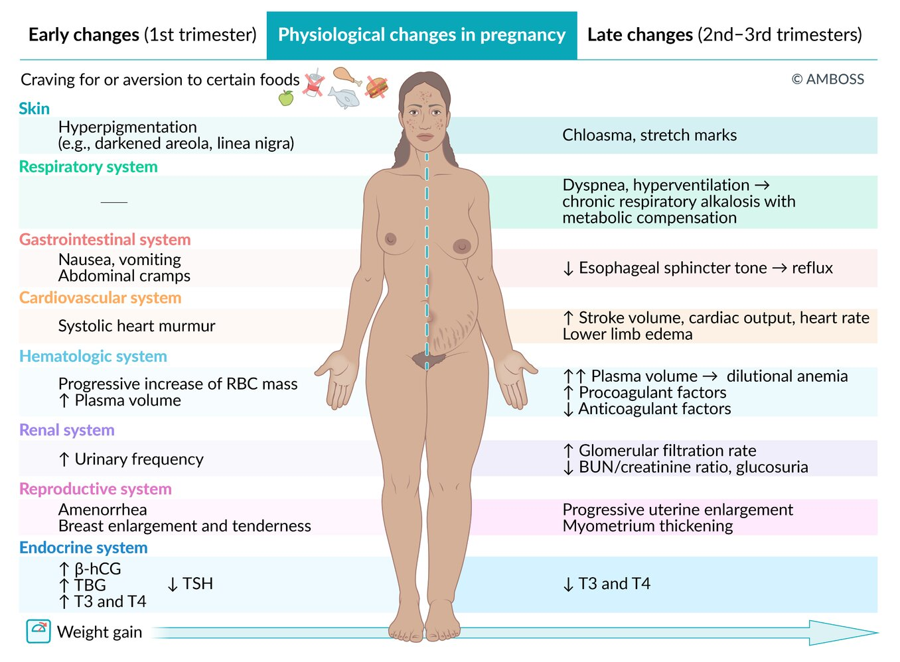
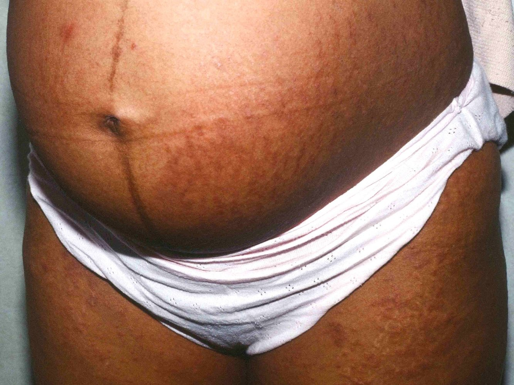

# Pregnancy

*Categories: Clinical knowledge > Obstetrics/gynecology > Pregnancy and prenatal care > Pregnancy*

[Original Article Link](https://coursology-qbank.com/amboss/article/dO0orT)

---

## Summary

Pregnancy begins with the <u>fertilization</u> of the <u>ovum</u> and its subsequent implantation into the uterine wall. The duration of pregnancy is counted in <u>weeks of gestation</u> from the first day of the <u>last menstrual period</u> and is on average 40 weeks. <u>Presumptive signs of pregnancy</u> include <u>amenorrhea</u>, <u>nausea and vomiting</u>, and <u>breast</u> enlargement and tenderness. Pregnancy can be confirmed via positive serum or urine <u>hCG testing</u>. <u>Ultrasound</u> should be obtained to assess pregnancy location and viability in patients if there is concern for <u>ectopic pregnancy</u> or <u>early pregnancy loss</u>, and to determine <u>gestational age and estimated date of delivery</u> if the <u>last menstrual period</u> is not known. Women experience several <u>physiological changes during pregnancy</u> (e.g., increased plasma volume, <u>venous stasis</u>, increased <u>insulin</u> secretion, increased oxygen demand), which can lead to symptoms and conditions that may require treatment (e.g., <u>peripheral edema</u>, <u>insulin resistance</u>, <u>hypercoagulability</u>, <u>dyspnea</u>).

See also “<u>Prenatal care</u>,” “<u>Immunizations in pregnancy</u>,” and “<u>Maternal complications during pregnancy</u>.”

---

## Definitions

### <u>Gravidity</u>, <u>parity</u>, and duration of pregnancy [[1]](https://coursology-qbank.com/amboss/article/Tsb68E)

* Gravidity: the number of times a woman has been pregnant, regardless of pregnancy outcome

* Nulligravidity: no history of pregnancy

* Primigravidity: history of one pregnancy

* Multigravidity: history of two or more pregnancies

* Parity: the number of pregnancies that a woman carries beyond 20 weeks of gestation and ends with the <u>birth</u> of an <u>infant</u> weighing > 500 g

* Nulliparity: no history of a completed pregnancy that reached beyond 20 weeks' gestation or ended with a <u>birth</u> weight of > 500 g

* Primiparity: a history of one completed pregnancy that reached beyond 20 weeks' gestation or ended with a <u>birth</u> weight of > 500 g

* Multiparity: a history of more than one pregnancy that reached beyond 20 weeks' gestation or ended with a <u>birth</u> weight of > 500 g

* Fetal age [[2]](https://coursology-qbank.com/amboss/article/e6YxPJ)

* Counted as completed <u>weeks of gestation</u> and completed days (0–6) of the current week of pregnancy

* Gestational age: estimated fetal age (in weeks and days) calculated from the first day of the <u>last menstrual period</u>

* Conceptional age: the age (in weeks and days) of the fetus calculated from the day of <u>conception</u> (<u>fertilization</u>)

* Duration of pregnancy

* Normal duration of pregnancy: 40 weeks (280 days)

* <u>Late-term pregnancy</u>: a pregnancy between 41 0/7 and 41 6/7 weeks' gestation

* <u>Postterm pregnancy</u>: a pregnancy that extends beyond ≥ 42 0/7 weeks' gestation

* <u>Gestational age</u> at <u>birth</u>

* Periviable birth: <u>live birth</u> occurring between 20–25 weeks' gestation

* <u>Preterm birth</u>: <u>live birth</u> before the completion of 37 weeks of gestation (< 37 0/7 weeks' gestation)

* <u>Postterm birth</u>: <u>live birth</u> after the completion of 42 weeks of gestation (≥ 42 0/7 weeks' gestation)

* Trimesters of pregnancy

* First trimester (weeks 1–13)

* Second trimester (weeks 14–27)

* Third trimester (weeks 28–40)

### Recording systems

| Overview of recording systems |  |  |
| --- | --- | --- |
| Recording system | Description | Example |
| TPAL | Obstetric recording system that comprises: <u>term births</u> (T), premature births (P), abortions (A), and living children (L) | A woman who reports 5 pregnancies with two <u>miscarriages</u> at weeks 11 and 14 of pregnancy, one <u>medical abortion</u>, one delivery at week 39 of pregnancy of a child weighing 3100 g, one delivery at week 29 of pregnancy of a child weighing 2100 g who died soon after <u>birth</u> should be reported as: T1, P1, A3, L1. |
| <u>GTPAL</u> | An extension of the TPAL recording system that also includes <u>gravidity</u> (G) | A woman who reports 5 pregnancies with two <u>miscarriages</u> at weeks 11 and 14 of pregnancy, one <u>medical abortion</u>, one delivery at week 39 of pregnancy of a child weighing 3100 g, one delivery at week 29 of pregnancy of a child weighing 2100 g who died soon after <u>birth</u> should be reported as: G5, T1, P1, A3, L1.  |
| GP | Obstetric recording system that comprises: gravidities (G) and parities (P) | A woman who reports 4 pregnancies and one delivery of an <u>infant</u> weighing 2100 g at week 32 of pregnancy is reported as: G4, P1.  |

---

## Clinical signs of early pregnancy

### Presumptive signs

* <u>Amenorrhea</u>

* <u>Nausea and vomiting</u>

* <u>Breast</u> enlargement and tenderness

* Linea nigra: darkening of the midline <u>skin</u> of the abdomen

* <u>Hyperpigmentation</u> of the <u>areola</u>

* Abdominal <u>bloating</u> and <u>constipation</u>

* Increased weight gain

* Cravings for or aversions to certain foods

* Increased <u>urinary frequency</u>

* Fatigue

### Probable signs [[3]](https://coursology-qbank.com/amboss/article/vtbA2v)[[4]](https://coursology-qbank.com/amboss/article/Dtb1fv)

| Overview |  |  |
| --- | --- | --- |
| Signs | Physical findings | <u>Weeks of pregnancy</u> |
| Goodell | Cervical softening | First 4 weeks  |
| Hegar | Softening of the lower segment of the <u>uterus</u>  | Between 6–8 weeks  |
| Ladin | Softening of the midline of the <u>uterus</u>  | First 6 weeks  |
| Chadwick | Bluish discoloration of <u>vagina</u> and <u>cervix</u>  | Between 6–8 weeks  |
| <u>Telangiectasias</u> and <u>palmar erythema</u> |  <u>Small blood vessels</u> and redness of the palms | First 4 weeks  |
| <u>Chloasma</u> |  <u>Hyperpigmentation</u> of the face (forehead, cheeks, nose) | First 16 weeks  |

---

## Diagnosis of pregnancy

See also “<u>Prenatal care</u>.”

### Approach [[5]](https://coursology-qbank.com/amboss/article/dF1oSi0)

* Confirm pregnancy by measuring <u>human chorionic gonadotropin</u> (<u>hCG</u>) in urine and/or serum. [[6]](https://coursology-qbank.com/amboss/article/FA1glj0)

* If there is concern for <u>ectopic pregnancy</u> or <u>early pregnancy loss</u>:  [[7]](https://coursology-qbank.com/amboss/article/W81Pli0)[[8]](https://coursology-qbank.com/amboss/article/Au1RFi0)

* Obtain <u>ultrasound</u> to confirm a viable <u>intrauterine pregnancy</u> (<u>IUP</u>).

* Monitor with serial <u>ultrasound</u> and/or serum <u>hCG</u> until pregnancy viability and location are confirmed. [[9]](https://coursology-qbank.com/amboss/article/V81Gli0)[[10]](https://coursology-qbank.com/amboss/article/vpYArJ)

* Determine <u>gestational age and estimated date of delivery</u> using the date of the <u>last menstrual period</u> and/or <u>ultrasound</u>. [[11]](https://coursology-qbank.com/amboss/article/EE18xi0)

* Refer for follow-up care depending on desire for continuation of pregnancy:  [[6]](https://coursology-qbank.com/amboss/article/FA1glj0)[[12]](https://coursology-qbank.com/amboss/article/Hg1K9T0)

* <u>Prenatal care</u>, if continuation of pregnancy is desired

* <u>Induced abortion</u>, if termination is desired

> [!TIP]
> Early identification of pregnancy with accurate dating is important for routine pregnancy monitoring (e.g., timing <u>screening tests</u>) and for assessment of potential <u>pregnancy complications</u> (e.g., identification of <u>preterm labor</u> and <u>postterm pregnancy</u>). [[5]](https://coursology-qbank.com/amboss/article/dF1oSi0)

### Pregnancy test

#### <u>hCG</u> physiology

* <u>Pregnancy tests</u> detect the presence of human chorionic gonadotropin (<u>hCG</u>) in blood or urine.

* <u>hCG</u> is produced during pregnancy, primarily by the <u>placental</u> <u>syncytiotrophoblast</u>.  [[13]](https://coursology-qbank.com/amboss/article/hi1crg0)[[14]](https://coursology-qbank.com/amboss/article/CNWqWN0)

* The role of <u>hCG</u> is to:  [[13]](https://coursology-qbank.com/amboss/article/hi1crg0)[[14]](https://coursology-qbank.com/amboss/article/CNWqWN0)[[15]](https://coursology-qbank.com/amboss/article/gmWFUN0)

* Stimulate <u>progesterone</u> secretion by the <u>corpus luteum</u> during the first 3–6 weeks of gestation to maintain pregnancy [[13]](https://coursology-qbank.com/amboss/article/hi1crg0)[[14]](https://coursology-qbank.com/amboss/article/CNWqWN0)

* Prior to pregnancy, <u>LH</u> stimulates corpus luteal <u>progesterone</u> secretion. [[16]](https://coursology-qbank.com/amboss/article/k5Wm4N0)

* After the <u>luteal placental shift</u>, the <u>placenta</u> produces <u>progesterone</u>. [[13]](https://coursology-qbank.com/amboss/article/hi1crg0)[[16]](https://coursology-qbank.com/amboss/article/k5Wm4N0)

* Promote uterine <u>angiogenesis</u>

* Promote myometrial stability, preventing contractions prior to <u>labor</u>

* Support <u>immune tolerance</u> to the growing embryo [[14]](https://coursology-qbank.com/amboss/article/CNWqWN0)

* Structure

* α-subunit: common to <u>hCG</u>, <u>FSH</u>, <u>LH</u>, and <u>TSH</u> [[13]](https://coursology-qbank.com/amboss/article/hi1crg0)

* β-subunit 

* Specific to <u>hCG</u>  [[13]](https://coursology-qbank.com/amboss/article/hi1crg0)[[14]](https://coursology-qbank.com/amboss/article/CNWqWN0)

* <u>Pregnancy tests</u> generally detect <u>hCG</u> through <u>antibodies</u> to the β-subunit. [[15]](https://coursology-qbank.com/amboss/article/gmWFUN0)

#### Types of <u>pregnancy tests</u>

|  Overview of urine and serum <u>hCG</u> tests [[17]](https://coursology-qbank.com/amboss/article/SmWyUN0)[[18]](https://coursology-qbank.com/amboss/article/hmWc2N0)  |  |  |
| --- | --- | --- |
|  | Urine <u>hCG</u> test | Serum <u>hCG test</u> |
| Test description |  * Qualitative test (less sensitive than quantitative serum <u>pregnancy test</u>)   |  * May be a quantitative test (high <u>sensitivity</u>) or qualitative test [[13]](https://coursology-qbank.com/amboss/article/hi1crg0)   |
| Timing |  * Usually detectable beginning the day a <u>menstrual cycle</u> is expected to start (approx. 14 days after <u>fertilization</u>) [[18]](https://coursology-qbank.com/amboss/article/hmWc2N0)[[19]](https://coursology-qbank.com/amboss/article/dLWo9N0)   |  * Detectable beginning 6–8 days after <u>fertilization</u> [[20]](https://coursology-qbank.com/amboss/article/AN1Rdh0)   |
| Indications |   * Identification of pregnancy in individuals with <u>clinical signs of early pregnancy</u> [[6]](https://coursology-qbank.com/amboss/article/FA1glj0)  * Evaluation of possible <u>false positive</u> serum <u>hCG</u> test  [[21]](https://coursology-qbank.com/amboss/article/KNWUXN0)    |   * Diagnosis and management of abnormal pregnancy (e.g., suspected <u>ectopic pregnancy</u>, <u>early pregnancy loss</u>, or <u>gestational trophoblastic disease</u>) [[7]](https://coursology-qbank.com/amboss/article/W81Pli0)[[14]](https://coursology-qbank.com/amboss/article/CNWqWN0)[[22]](https://coursology-qbank.com/amboss/article/LgcwDb0)  * <u>Prenatal genetic testing</u> [[23]](https://coursology-qbank.com/amboss/article/eu1xJi0)  * Inability to obtain urine <u>hCG</u>  [[18]](https://coursology-qbank.com/amboss/article/hmWc2N0)    |

#### Interpretation [[10]](https://coursology-qbank.com/amboss/article/vpYArJ)[[24]](https://coursology-qbank.com/amboss/article/OmWIfN0)

##### Expected findings during pregnancy [[10]](https://coursology-qbank.com/amboss/article/vpYArJ)

* Doubling of <u>hCG</u> every 1.8–3 days for the first 6–7 weeks of pregnancy [[20]](https://coursology-qbank.com/amboss/article/AN1Rdh0)

* Peak <u>hCG</u> at 8–12 weeks of gestation (peak value ∼ 100,000 mIU/mL) [[22]](https://coursology-qbank.com/amboss/article/LgcwDb0)[[24]](https://coursology-qbank.com/amboss/article/OmWIfN0)

* Decrease in <u>hCG</u> during the <u>second trimester</u> [[24]](https://coursology-qbank.com/amboss/article/OmWIfN0)

* Steady <u>hCG</u> level during the <u>third trimester</u> [[13]](https://coursology-qbank.com/amboss/article/hi1crg0)

##### Abnormal <u>hCG</u> results

| Interpretation and further investigation of abnormal <u>pregnancy test</u> results |  |  |  |
| --- | --- | --- | --- |
|  |  | Causes | Next steps |
|  Low serum <u>hCG</u> [[22]](https://coursology-qbank.com/amboss/article/LgcwDb0)  |  |   * Maternal causes  * <u>Ectopic pregnancy</u>  * <u>Early pregnancy loss</u> (e.g., <u>spontaneous abortion</u>, <u>missed abortion</u>, or <u>incomplete abortion</u>)  * Inaccurate estimation of <u>gestational age</u> [[25]](https://coursology-qbank.com/amboss/article/4qW3Am0)  * Fetal causes  * <u>Trisomy 18</u> (<u>Edwards syndrome</u>) [[26]](https://coursology-qbank.com/amboss/article/JNWsXN0)[[27]](https://coursology-qbank.com/amboss/article/J5WsON0)  * <u>Trisomy 13</u> (<u>Patau syndrome</u>) [[26]](https://coursology-qbank.com/amboss/article/JNWsXN0)    |   * Initial studies  * Serial <u>hCG</u>  * <u>Prenatal ultrasound</u>  * See also “<u>Diagnostics for ectopic pregnancy</u>.”  * If a fetal cause is suspected, perform <u>prenatal genetic testing</u>.    |
|  High serum <u>hCG</u> [[28]](https://coursology-qbank.com/amboss/article/kqWmAm0)  |  |   * Maternal causes  * <u>Gestational trophoblastic disease</u> (e.g., <u>hydatidiform mole</u>, <u>choriocarcinoma</u>) [[29]](https://coursology-qbank.com/amboss/article/W91PmQ0)  * <u>Multiple gestation</u> [[30]](https://coursology-qbank.com/amboss/article/q5WCON0)  * Inaccurate estimation of <u>gestational age</u> [[25]](https://coursology-qbank.com/amboss/article/4qW3Am0)  * Fetal causes: <u>Trisomy 21</u> (<u>Down syndrome</u>) [[26]](https://coursology-qbank.com/amboss/article/JNWsXN0)[[27]](https://coursology-qbank.com/amboss/article/J5WsON0)    |   * Perform a <u>prenatal ultrasound</u> as an initial study to:  * Determine the number of fetuses  * Ascertain correct <u>gestational age</u>  * Look for evidence of <u>gestational trophoblastic disease</u> (<u>GTD</u>)  * If <u>GTD</u> is suspected, further imaging is required.  [[31]](https://coursology-qbank.com/amboss/article/QqWuym0)  * If a fetal cause is suspected, perform <u>prenatal genetic testing</u>.    |
|  Suspected <u>false positive</u> (rare) [[18]](https://coursology-qbank.com/amboss/article/hmWc2N0)[[21]](https://coursology-qbank.com/amboss/article/KNWUXN0)[[32]](https://coursology-qbank.com/amboss/article/SqWyBm0)  |  |   * Presence of heterophilic <u>antibodies</u>  * Physiologic increase in <u>hCG</u> in <u>perimenopausal</u> and <u>menopausal</u> women  [[33]](https://coursology-qbank.com/amboss/article/XoW90m0)  * <u>hCG</u> injections  [[32]](https://coursology-qbank.com/amboss/article/SqWyBm0)  * <u>Blood transfusion</u> from a pregnant donor  * Familial <u>hCG</u> syndrome  * Nontrophoblast <u>malignancy</u>    |   * Initial studies  * Urine <u>HCG</u>, if not already performed  * <u>Prenatal ultrasound</u>  * If <u>IUP</u> is not confirmed, further studies depend on the suspected underlying cause.  * Suspected heterophilic <u>antibodies</u>   * Serial dilution of blood sample  * OR <u>laboratory methods</u> to remove heterophilic <u>antibodies</u> prior to testing  * Suspected <u>menopause</u>: <u>LH</u> and <u>FSH</u>  * Suspected <u>malignancy</u>  * Imaging of suspected primary site  * Measurement of quantitative free <u>β-hCG</u> subunit    |
|  Suspected <u>false negative</u> [[18]](https://coursology-qbank.com/amboss/article/hmWc2N0)  |  |   * Testing too early in pregnancy  * Dilute urine (for urine <u>hCG test</u>)  * <u>Hook effect</u> from excessive <u>hCG</u> (e.g., in <u>gestational trophoblastic disease</u>)  [[17]](https://coursology-qbank.com/amboss/article/SmWyUN0)    |   * Testing performed too soon after <u>conception</u>: Repeat testing.  * Dilute urine: Perform early morning urine testing or serum <u>hCG testing</u>.  * <u>Hook effect</u> suspected on a qualitative <u>hCG test</u>: Obtain quantitative serum <u>hCG testing</u>, or perform qualitative <u>hCG testing</u> on a diluted sample.    |

### Ultrasound confirmation of normal intrauterine pregnancy [[34]](https://coursology-qbank.com/amboss/article/F2cgjb0)

For detailed information on <u>ultrasound</u> indications and techniques in pregnancy, see “<u>Ultrasound during pregnancy</u>” and “<u>POCUS in early pregnancy</u>.”

* 4–5 weeks' gestation: : <u>gestational sac</u> generally visible with <u>transvaginal ultrasound</u> when serum <u>hCG</u> levels reach 1500–3000 mIU/mL  [[9]](https://coursology-qbank.com/amboss/article/V81Gli0)

* 5–6 weeks' gestation: detection of the <u>yolk sac</u>

* 6–7 weeks' gestation: detection of the <u>fetal pole</u> (embryo) and cardiac activity with <u>transvaginal ultrasound</u>  [[34]](https://coursology-qbank.com/amboss/article/F2cgjb0)

* 7–8 weeks' gestation: Physical features can be visualized (e.g., <u>spine</u>, limb buds, early head structure).

* > 8 weeks' gestation: embryo/fetal movement

* 10–12 weeks' gestation: detection of fetal heartbeat with motion-mode (<u>M-mode</u>) scanning or video archiving  [[11]](https://coursology-qbank.com/amboss/article/EE18xi0)

> [!TIP]
> The presence of a <u>gestational sac</u> containing either a <u>yolk sac</u>, fetus, or embryo, with or without cardiac activity, in the <u>uterus</u> suffices to confirm an <u>intrauterine pregnancy</u>. [[8]](https://coursology-qbank.com/amboss/article/Au1RFi0)

Sonographic features of early intrauterine pregnancy

First trimester ultrasound, double sac sign

---

## Physiological changes during pregnancy

Physiological changes in pregnancy

### <u>Cardiovascular system</u> [[35]](https://coursology-qbank.com/amboss/article/vsbA9E)[[36]](https://coursology-qbank.com/amboss/article/jEb_vv)

* ↑ <u>Progesterone</u> → ↓ vascular tone → ↓ <u>peripheral vascular resistance</u> (↓ <u>afterload</u>)

* ↑ <u>Cardiac output</u> by up to 40% (↑ <u>preload</u>)

* ↑ <u>Stroke volume</u> (by 10–30%)

* ↑ <u>Heart rate</u> (by ∼ 12–18 bpm) → ↑ uterine <u>perfusion</u>

* ↓ <u>Mean arterial pressure</u>

* Innocent systolic <u>murmur</u>

* The apex beat is displaced upward.

* ↑ Plasma volume → ↓ <u>oncotic pressure</u> → <u>edema</u> of lower limbs

* <u>Varicosities</u>

* Aggravation of preexisting valvular diseases

> [!WARNING]
> The gravid <u>uterus</u> can compress the <u>inferior vena cava</u> and <u>pelvic</u> <u>veins</u> thereby decreasing <u>venous return</u>.

> [!TIP]
> A physiological systolic <u>murmur</u> may be heard due to increased <u>cardiac output</u> and increased plasma volume.

### Respiratory system [[37]](https://coursology-qbank.com/amboss/article/stbtUv)

* ↑ Oxygen consumption (by approx. 20%)

* ↑ <u>Intraabdominal pressure</u> through uterine growth → <u>dyspnea</u> (the <u>diaphragm</u> is displaced upwards → ↓ <u>total lung capacity</u>, <u>residual volume</u>, <u>functional residual capacity</u>, and <u>expiratory reserve volume</u>)

* <u>Progesterone</u> stimulates the <u>respiratory centers</u> in the <u>brain</u> → <u>hyperventilation</u> (to eliminate fetal CO2 more efficiently) → physiological, chronic compensated <u>respiratory alkalosis</u>

* ↑ <u>Tidal volume</u> → ↑ <u>minute ventilation</u>

* ↓ <u>PCO2</u> (∼ 30 mm Hg)

### Renal system [[36]](https://coursology-qbank.com/amboss/article/jEb_vv)[[38]](https://coursology-qbank.com/amboss/article/xuXEt-)

* ↑ <u>Renal plasma flow</u> ;  → ↑ <u>GFR</u> → ↓ <u>BUN</u> and <u>creatinine</u>

* ↑ <u>Aldosterone</u>  → ↑ plasma volume and <u>hypernatremia</u>

* ↑ <u>Progesterone</u> and <u>intraabdominal pressure</u> → dilation of <u>kidney</u>, <u>pelvis</u>, and calyceal systems → reduced tone and <u>peristalsis</u>

* <u>Hydronephrosis</u> and <u>hydroureter</u>

* Hypomotility of the <u>ureters</u> → urinary stasis → <u>pyelonephritis</u>

* ↑ <u>Urinary frequency</u>

* ↑ <u>Glucose</u> levels in urine: Increased <u>glomerular filtration</u> results in overload of the <u>glucose</u> carrier responsible for its resorption.

* Mild <u>proteinuria</u>: Increased <u>GFR</u> and <u>glomerular</u> permeability to <u>albumin</u> increases protein excretion.

### <u>Endocrine system</u> [[36]](https://coursology-qbank.com/amboss/article/jEb_vv)[[39]](https://coursology-qbank.com/amboss/article/GtbBUv)[[40]](https://coursology-qbank.com/amboss/article/oVX0vC)

* <u>Progesterone</u>

* Responsible for pregnancy maintenance

* Produced by the <u>corpus luteum</u> until the 10–12 weeks of gestation, after which it is produced by the <u>fetoplacental unit</u>

* Human placental lactogen: a <u>hormone</u> synthesized by <u>syncytiotrophoblasts</u> of the <u>placenta</u>, which promotes the production of <u>insulin-like growth factors</u>.

* Increases <u>insulin</u> levels

* Causes <u>insulin resistance</u>

* Increases serum <u>glucose</u> levels and <u>lipolysis</u> to ensure sufficient <u>glucose</u> supply for the fetus

* Maternal <u>insulin resistance</u> begins in the <u>second trimester</u> and peaks in the <u>third trimester</u>.

* <u>Thyroid hormones</u>

* ↑ <u>hCG</u> → ↓ <u>TSH</u> levels during the first part of the <u>first trimester</u>

* ↑ <u>TBG</u> → ↑ T4 and T3→ slightly increased free T4 and T3 levels during <u>first trimester</u>

* Free T4 and T3 levels decrease during the second and third trimesters

* ↑ <u>SHBG</u> and <u>corticosteroid-binding globulin</u>

* ↑ <u>Triglycerides</u> and <u>cholesterol</u> (due to increased <u>lipolysis</u> and fat utilization)

* <u>Hyperplasia</u> of <u>lactotroph</u> cells in the <u>anterior pituitary</u> → physiological enlargement of the <u>pituitary gland</u> (up to 40% increase from pregestational volume)

### Hematologic system [[36]](https://coursology-qbank.com/amboss/article/jEb_vv)[[41]](https://coursology-qbank.com/amboss/article/ttbX2v)[[42]](https://coursology-qbank.com/amboss/article/08aeOm)

* ↑ Plasma volume → ↓ <u>hematocrit</u>, especially towards the end of pregnancy (30–34th week of gestation) → <u>dilutional anemia</u> (<u>hemoglobin</u> value rarely drops < 11 g/dL)

* <u>Hypercoagulability</u> is due to an increase in <u>fibrinogen</u>, <u>factor VII</u>, and <u>factor VIII</u> and a decrease in <u>protein S</u>;    (reduces the risk of <u>intrapartum</u> blood loss).

* ↓ <u>Platelet count</u> → <u>gestational thrombocytopenia</u>

* ↑ <u>RBC mass</u> (increases from 8–10th week of gestation until the end of pregnancy)

* ↓ <u>Iron</u> and <u>folate</u> levels due to increased <u>vitamin</u> and mineral requirements

* ↑ <u>WBC count</u>

* ↓ <u>Albumin</u>

* ↑ <u>Alkaline phosphatase</u> (<u>placental</u> <u>isoenzymes</u>)

> [!TIP]
> Physiological <u>hypercoagulability</u> during pregnancy leads to an increased risk of <u>thrombosis</u>. Patients with <u>thrombophilia</u> should receive adequate <u>thrombosis</u> prophylaxis.

### Gastrointestinal system [[36]](https://coursology-qbank.com/amboss/article/jEb_vv)

* ↑ Salivation

* ↓ <u>Lower esophageal sphincter</u> tone → <u>gastroesophageal reflux</u>

* ↓ Motility → <u>constipation</u> and <u>bloating</u>

* <u>Gallbladder</u> stasis → <u>gallstones</u>

* <u>Hemorrhoids</u>

### <u>Musculoskeletal system</u> [[36]](https://coursology-qbank.com/amboss/article/jEb_vv)

* ↑ Body weight → forward shift in center of gravity → ↑ lumbar <u>lordosis</u>

* ↑ Intraabdominal pressure → <u>diastasis recti</u>; <u>meralgia paresthetica</u>

* Relaxation of the <u>pelvic girdle</u> <u>ligaments</u> and <u>symphysis pubis</u>;  → <u>pelvic girdle pain</u>, coccygeal <u>pain</u>

* Fluid retention in tissue → <u>carpal tunnel syndrome</u>

### <u>Skin</u>

* <u>Spider angioma</u>

* <u>Palmar erythema</u>

* Striae gravidarum: scarring that manifests as <u>erythematous</u>, violaceous, and/or <u>hypopigmented</u> linear striations on the abdomen

* <u>Hyperpigmentation</u>: <u>chloasma</u>, <u>linea nigra</u>, <u>hyperpigmentation</u> of the <u>nipples</u>

* Pruritus gravidarum: intermittent <u>pruritus</u> in the abdomen area that can spread to involve the trunk, palms, and soles (typically in the late <u>second trimester</u> to the early <u>third trimester</u>)

Linea nigra and polymorphic eruption of pregnancy

Striae gravidarum

### Reproductive system

* <u>Uterus</u>: increase in size

* <u>Vulva</u> and <u>vagina</u>

* <u>Vaginal discharge</u>

* Formation of <u>varicose veins</u>

* <u>Mammary glands</u>: increase in size; <u>breast</u> fullness and tenderness

---