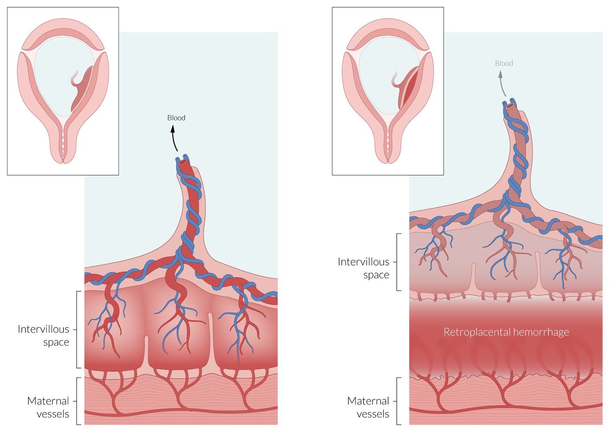
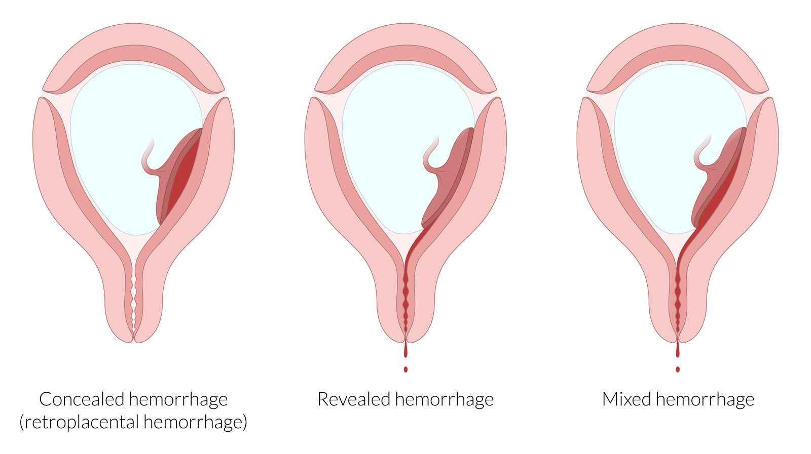
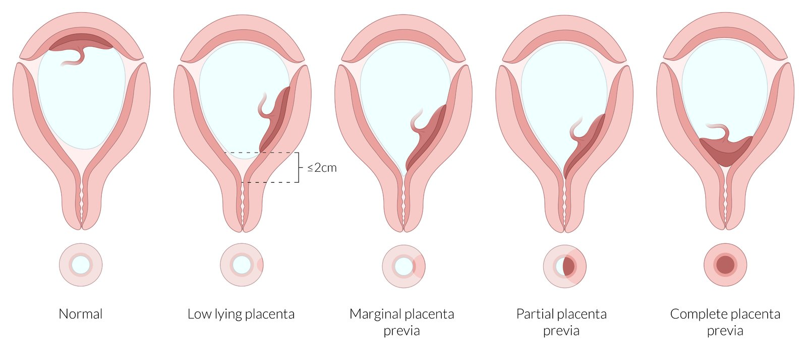
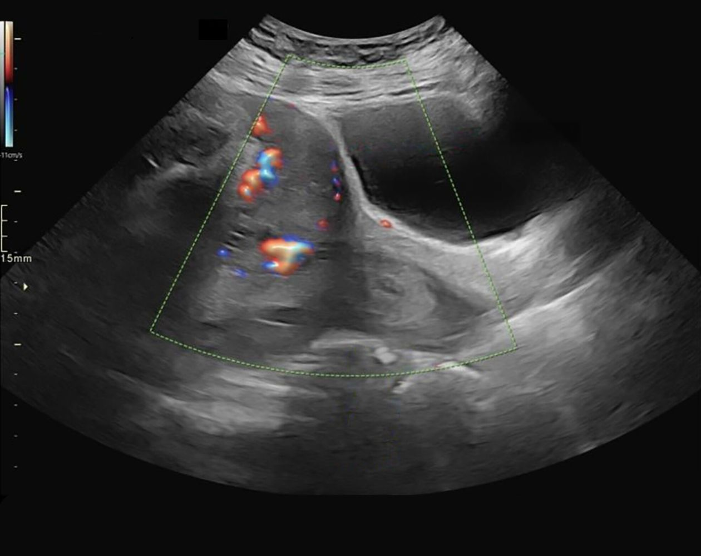
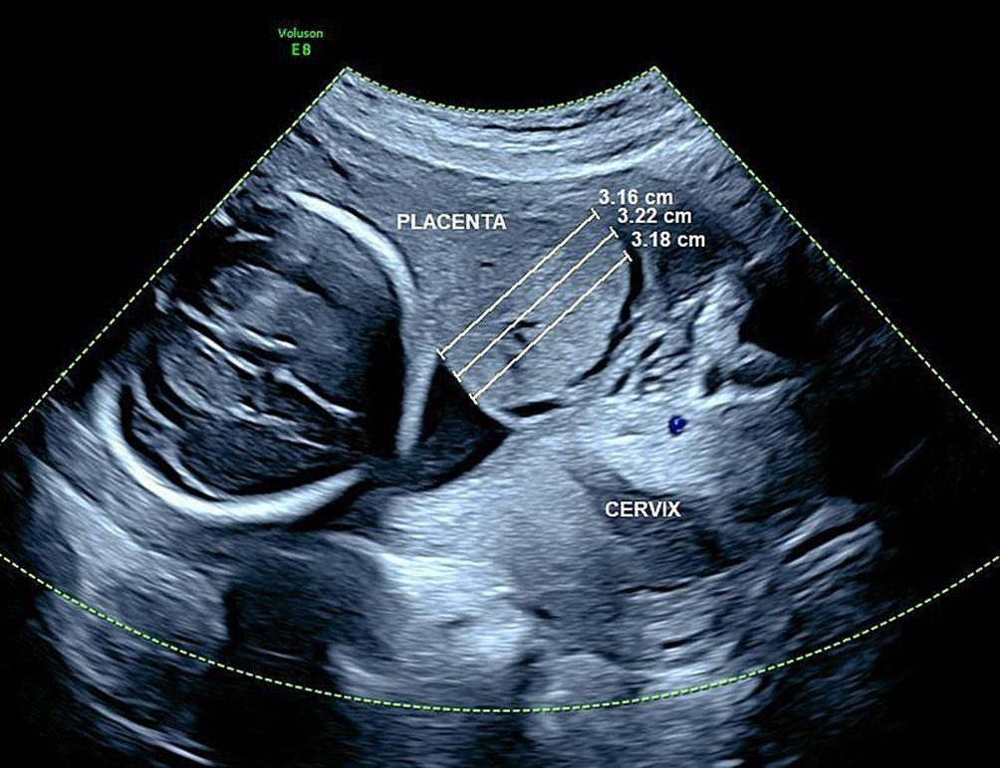

# Antepartum hemorrhage

*Categories: Clinical knowledge > Obstetrics/gynecology > Pregnancy-associated disorders > Antepartum hemorrhage*

[Original Article Link](https://coursology-qbank.com/amboss/article/UO0b7T)

---

## Summary

Antepartum hemorrhage refers to <u>vaginal bleeding</u> occurring after 20 weeks of <u>gestation</u>. It most commonly occurs during the <u>third trimester</u> and is associated with significant fetal and maternal <u>morbidity</u> and mortality. Common <u>causes of antepartum hemorrhage</u> are <u>bloody show</u> associated with <u>labor</u>, <u>placenta previa</u>, and <u>placental abruption</u>. Rare causes include <u>vasa previa</u> and <u>uterine rupture</u>. Symptoms of <u>placental abruption</u> typically include lower abdominal <u>pain</u>, <u>vaginal bleeding</u>, and uterine rigidity. <u>Placenta previa</u> and <u>vasa previa</u> both manifest with painless <u>vaginal bleeding</u>, but bleeding from <u>vasa previa</u> typically occurs after <u>rupture of membranes</u> and more commonly causes <u>fetal distress</u>. In cases of severe hemorrhage, patients may present with <u>signs of shock</u>; fetal symptoms include signs of <u>fetal distress</u> such as <u>decelerations</u> on <u>cardiotocography</u> and decreased fetal movement. The diagnosis of antepartum hemorrhage is primarily clinical, but transabdominal or <u>transvaginal ultrasound</u> can help determine the etiology. The treatment approach depends on the results of the maternal and <u>fetal status assessment</u>. A conservative approach with continuous monitoring is advised for asymptomatic patients with <u>reassuring fetal status</u>, while emergency <u>cesarean delivery</u> is indicated for patients with significant active bleeding, <u>hemodynamic instability</u>, or <u>fetal distress</u>.

<u>Uterine rupture</u>, <u>pregnancy loss</u>, and <u>postpartum hemorrhage</u> are discussed in separate articles. For <u>vaginal bleeding</u> before 20 weeks' <u>gestation</u>, see “<u>Vaginal bleeding in pregnancy</u>.”

---

## Overview

| Differential diagnosis of antepartum bleeding |  |  |  |  |
| --- | --- | --- | --- | --- |
| Condition | Onset | <u>Pain</u> | Additional symptoms | <u>Risk factors</u> |
| <u>Placental abruption</u> |   * Sudden  * Occurs most often in the <u>third trimester</u>    |  * Usually mild to moderate abdominal <u>pain</u>   |   * Continuous <u>vaginal bleeding</u>  * Hypertonic contractions (rigid <u>uterus</u>)  * Uterine tenderness  * <u>Premature labor</u>  * <u>Fetal distress</u>    |   * Previous <u>placental abruption</u>  * <u>Hypertension</u>  * Trauma  * Smoking  * <u>Cocaine</u> use  * Preterm <u>premature rupture of the membranes</u>    |
| <u>Placenta previa</u> |   * Sudden  * Prior to <u>rupture of membranes</u>    |  * Painless   |  * Bright red <u>vaginal bleeding</u>   |   * Previous <u>placenta previa</u>  * Previous <u>cesarean delivery</u>  * <u>Multiparity</u>  * <u>Multiple gestation</u>  * <u>Advanced maternal age</u>  * Smoking    |
| <u>Vasa previa</u> |   * Sudden  * After <u>rupture of membranes</u>    |  * Painless   |   * <u>Vaginal bleeding</u> (fetal blood)  * <u>Fetal distress</u> (e.g., deteriorating <u>fetal heart rate</u>)    |   * <u>Velamentous cord insertion</u>  * <u>Placenta previa</u>  * <u>In vitro fertilization</u>  * <u>Multiple gestation</u>    |
| <u>Uterine rupture</u> |   * Sudden  * During <u>labor</u>    |  * Severe abdominal <u>pain</u>   |   * Sudden pause in contractions  * <u>Fetal distress</u> (e.g., deteriorating <u>fetal heart rate</u>)  * <u>Vaginal bleeding</u>  * <u>Hemodynamic instability</u>    |   * Previous <u>cesarean delivery</u>  * Transmyometrial <u>surgery</u>    |
| <u>Stillbirth</u> |  * After 20 weeks of <u>gestation</u>   |  * Cramping abdominal <u>pain</u>   |   * <u>Vaginal bleeding</u>  * Features of <u>labor</u> (e.g., uterine contractions)    |   * <u>Advanced maternal age</u>  * <u>Obesity</u>  * Smoking  * <u>Multiple gestation</u>  * Concurrent medical disorders  * Complicated <u>pregnancy</u>    |
| <u>Bloody show</u> |  * Associated regular uterine contractions and cervical changes   |  * No <u>pain</u>   |  * A small amount of blood or blood-tinged mucus that is usually passed prior to <u>labor</u> or in early <u>labor</u>.   |  * N/A   |
| Cervical trauma |  * Sudden, typically caused by sexual intercourse   |  * Mild to moderate <u>pelvic pain</u> depending on the extent of damage   |  * Bruised and tender <u>cervix</u> without evidence of active bleeding   |  * N/A   |

---

## Management

### Initial management of antepartum hemorrhage [[1]](https://coursology-qbank.com/amboss/article/g2XFSx)[[2]](https://coursology-qbank.com/amboss/article/eS1xAT0)[[3]](https://coursology-qbank.com/amboss/article/VS1GAT0)

* If unstable; : <u>ABCDE approach</u> and <u>immediate hemodynamic support</u>, including <u>emergency blood transfusion</u>

* Conduct a maternal and <u>fetal status assessment</u>.

* Focused <u>gynecologic history</u> and <u>pelvic examination</u>

* <u>Laboratory studies</u>: <u>CBC</u>, <u>coagulation studies</u>, <u>type and screen</u>

* <u>Fetal heart rate tracing</u>  [[4]](https://coursology-qbank.com/amboss/article/US1b_T0)

* <u>Transvaginal ultrasound</u> to confirm <u>placental</u> location

* <u>Rh(D) negative</u> mothers; : Obtain a <u>Kleihauer-Betke test</u>  and administer <u>anti-D immunoglobulin</u>. [[5]](https://coursology-qbank.com/amboss/article/eqYxxJ)[[6]](https://coursology-qbank.com/amboss/article/iS1JzT0)

* Urgent <u>OB/GYN</u> consult to determine further management

> [!TIP]
> Estimated blood loss is often inaccurate; assess for clinical <u>signs of shock</u> instead. [[2]](https://coursology-qbank.com/amboss/article/eS1xAT0)

> [!WARNING]
> Do not perform a digital cervical examination until <u>placenta previa</u> has been excluded on <u>ultrasound</u>. [[1]](https://coursology-qbank.com/amboss/article/g2XFSx)[[2]](https://coursology-qbank.com/amboss/article/eS1xAT0)

### Definitive <u>management of antepartum hemorrhage</u>

Definitive management depends on the cause of bleeding, <u>gestational age</u>, fetal status, and maternal stability.

* Severe bleeding, <u>hemodynamic instability</u>, and <u>fetal distress</u> are indications for urgent delivery.

* <u>Expectant management</u> for stable patients may include <u>interventions for preterm labor</u>, e.g.:

* <u>Induction of fetal lung maturity</u> with <u>corticosteroids</u> (e.g., <u>betamethasone</u>) if: [[7]](https://coursology-qbank.com/amboss/article/ZsXZtz)

* <u>Gestational age</u> is < 34 weeks

* <u>Gestational age</u> is 34–37 weeks and delivery is likely within 7 days

* <u>Magnesium sulfate</u> for <u>fetal neuroprotection</u>  [[2]](https://coursology-qbank.com/amboss/article/eS1xAT0)[[8]](https://coursology-qbank.com/amboss/article/mDaVU5)

* See also “<u>Management of placental abruption</u>,” “<u>Management of placenta previa</u>,” and “<u>Management of uterine rupture</u>.”

> [!WARNING]
> <u>Placenta previa</u> is an <u>absolute contraindication</u> to vaginal delivery. [[3]](https://coursology-qbank.com/amboss/article/VS1GAT0)

> [!WARNING]
> In patients with <u>hemodynamic instability</u> or <u>nonreassuring fetal status</u>, do not delay delivery to administer <u>corticosteroids</u>. [[1]](https://coursology-qbank.com/amboss/article/g2XFSx)

> [!TIP]
> When planning for delivery, ensure <u>transfusion products</u> and equipment to surgically control severe <u>postpartum hemorrhage</u> are readily available.

---

## Placental abruption

### Definition [[2]](https://coursology-qbank.com/amboss/article/eS1xAT0)

* The partial or complete separation of the <u>placenta</u> from the <u>uterus</u> prior to delivery; subsequent hemorrhage occurs from both maternal and fetal vessels.

### <u>Epidemiology</u>

* <u>Incidence</u>: ∼ 0.7–1.2% of <u>pregnancies</u> [[9]](https://coursology-qbank.com/amboss/article/b2XHTx)

* Occurs most often in the <u>third trimester</u>

* The recurrence rate in subsequent <u>pregnancies</u> is 4–15%. [[10]](https://coursology-qbank.com/amboss/article/2v1Tzi0)

### Etiology [[2]](https://coursology-qbank.com/amboss/article/eS1xAT0)[[11]](https://coursology-qbank.com/amboss/article/Uv1bzi0)

Predisposing factors include:

* Vascular changes

* <u>Hypertension</u> (most common cause)

* <u>Preeclampsia</u>/<u>eclampsia</u>

* (Abdominal) trauma; : e.g., car accidents, falls, <u>intimate partner violence</u>

* <u>Twin pregnancy</u> [[12]](https://coursology-qbank.com/amboss/article/lo1vX30)

* Sudden decrease in intrauterine pressure ; decompression of an overdistended <u>uterus</u> (e.g., ruptured membranes in <u>polyhydramnios</u>)

* Previous abruption, <u>chorioamnionitis</u>, short <u>umbilical cord</u>

* Maternal age: < 20 years and > 35 years [[13]](https://coursology-qbank.com/amboss/article/AN1Rdh0)

* <u>Alcohol</u> and cigarette consumption, <u>cocaine</u> use [[14]](https://coursology-qbank.com/amboss/article/Tv16zi0)

### Clinical features [[2]](https://coursology-qbank.com/amboss/article/eS1xAT0)

* Maternal symptoms

* Sudden onset of continuous <u>vaginal bleeding</u> (revealed <u>abruptio placentae</u>)

* In up to 20% of cases, the hemorrhage is mainly retroplacental and <u>vaginal bleeding</u> does not occur (concealed <u>abruptio placentae</u>). [[4]](https://coursology-qbank.com/amboss/article/US1b_T0)

* Sudden onset of abdominal <u>pain</u> or <u>back pain</u>

* Uterine tenderness

* Hypertonic contractions (rigid <u>uterus</u>), <u>premature labor</u>

* <u>Signs of shock</u>

* <u>Clinical features of disseminated intravascular coagulation</u> (<u>DIC</u>)

* <u>Fetal distress</u> (60% of cases) [[4]](https://coursology-qbank.com/amboss/article/US1b_T0)

* Possible diminished or absent fetal movement

* <u>Decelerations</u> on fetal <u>heart</u> monitor

> [!NOTE]
> Abruptio placentae is characterized by the “abrupt” onset of painful bleeding.

> [!WARNING]
> In cases of retroplacental hemorrhage, patients may present with signs of <u>hypovolemic shock</u> without evident <u>vaginal bleeding</u>!

Placental abruption prior to delivery

Types of hemorrhage in placental abruption

### Diagnostics [[2]](https://coursology-qbank.com/amboss/article/eS1xAT0)[[4]](https://coursology-qbank.com/amboss/article/US1b_T0)

For the initial management of patients with antepartum hemorrhage, see “<u>Approach to antepartum hemorrhage</u>.”

* <u>Ultrasound</u> (transvaginal and/or transabdominal)

* Low (25%) <u>sensitivity</u> for <u>placental abruption</u>   [[13]](https://coursology-qbank.com/amboss/article/AN1Rdh0)[[15]](https://coursology-qbank.com/amboss/article/Sv1yzi0)

* <u>Placental</u> position and <u>fetal biophysical profile</u> should be assessed.

* Retroplacental <u>hematoma</u> may be visible.

* <u>Fetal heart rate tracing</u>: to assess for signs of <u>fetal distress</u>

* <u>Laboratory studies</u>

* <u>CBC</u>: <u>Hematocrit</u> may be low in patients with hemorrhage.

* <u>Coagulation studies</u>  : to assess for <u>DIC</u> in patients with hemorrhage [[13]](https://coursology-qbank.com/amboss/article/AN1Rdh0)

* <u>Type and screen</u>

> [!TIP]
> <u>Placental abruption</u> is a <u>clinical diagnosis</u>. <u>Ultrasound</u> is indicated in all patients to rule out <u>placenta previa</u> but is not diagnostic for abruption.

> [!WARNING]
> Digital vaginal examination is contraindicated unless <u>placenta previa</u> has been ruled out on <u>ultrasound</u> as it may worsen bleeding.

### Management of placental abruption [[1]](https://coursology-qbank.com/amboss/article/g2XFSx)[[2]](https://coursology-qbank.com/amboss/article/eS1xAT0)[[3]](https://coursology-qbank.com/amboss/article/VS1GAT0)

* All patients: : Initiate immediate <u>management of antepartum hemorrhage</u>.

* Pregnant <u>trauma patients</u>: see “<u>Approach to suspected abruption in trauma patients</u>.”

* <u>Hemodynamically unstable</u> or moderate-severe bleeding: emergency <u>cesarean delivery</u> unless vaginal delivery is imminent

* Hemodynamically stable with mild bleeding

* <u>Reassuring fetal status</u>: <u>expectant management</u> or delivery depending on <u>gestational age</u>  [[1]](https://coursology-qbank.com/amboss/article/g2XFSx); 

* < 34 weeks

* <u>Expectant management</u> and observation

* Consider <u>tocolytics</u> (e.g., <u>nifedipine</u>, <u>β2-adrenergic agonist</u>).   [[2]](https://coursology-qbank.com/amboss/article/eS1xAT0)

* Aim for a normal delivery.

* 34–36 weeks

* Active uterine contractions: vaginal delivery

* No active uterine contractions: <u>expectant management</u> and observation

* > 36 weeks: Deliver.

* See also “<u>Management of preterm labor</u>.”

* <u>Nonreassuring fetal status</u>: emergency <u>cesarean delivery</u> unless vaginal delivery is imminent

* <u>Intrauterine fetal demise</u>

* <u>Induction of vaginal delivery</u> with <u>amniotomy</u> and <u>oxytocin</u>

* Urgent <u>cesarean delivery</u> if there is a risk of <u>maternal mortality</u>

> [!TIP]
> <u>Placental abruption</u> is an obstetric emergency. Delay in diagnosis and management is potentially life-threatening for the mother and fetus.

### Complications [[2]](https://coursology-qbank.com/amboss/article/eS1xAT0)[[4]](https://coursology-qbank.com/amboss/article/US1b_T0)

* <u>Intrauterine fetal death</u>

* Maternal <u>DIC</u> and <u>hypovolemic shock</u>: occurs as a result of blood loss and massive coagulation; the <u>placenta</u> is rich in <u>tissue thromboplastin</u>, which is released as a result of the <u>placental abruption</u>.

* Couvelaire uterus

* Retroplacental hemorrhage may extend through the <u>uterus</u> into the <u>peritoneum</u>.

* The <u>myometrium</u> is weakened, with possible subsequent <u>uterine rupture</u> during contractions.

> [!WARNING]
> Patients with <u>placental abruption</u> have a high risk of <u>postpartum hemorrhage</u>. [[2]](https://coursology-qbank.com/amboss/article/eS1xAT0)

---

## Placenta previa

### Definition [[2]](https://coursology-qbank.com/amboss/article/eS1xAT0)[[4]](https://coursology-qbank.com/amboss/article/US1b_T0)

* Presence of the <u>placenta</u> in the lower uterine segment; , which can lead to partial or full obstruction of the internal os; high risk of hemorrhage (rupture of <u>placental</u> vessels) and <u>birth complications</u>

### <u>Epidemiology</u>

* ∼ 0.5% of all <u>pregnancies</u> [[16]](https://coursology-qbank.com/amboss/article/W2XPgx)

### <u>Risk factors</u> [[17]](https://coursology-qbank.com/amboss/article/U2XbSx)

* Maternal age > 35 years, <u>multiparity</u>, short intervals between <u>pregnancies</u>

* Previous <u>curettage</u> or <u>cesarean delivery</u>

* Previous <u>placenta previa</u>, previous/recurrent abortions

* History of uterine <u>surgery</u>, e.g., <u>myomectomy</u>, <u>cesarean delivery</u> [[2]](https://coursology-qbank.com/amboss/article/eS1xAT0)

### Classification [[18]](https://coursology-qbank.com/amboss/article/h2Xchx)

* <u>Placenta previa</u>: <u>placenta</u> either partially or completely covers the internal os
* Previously, this category included marginal previa (<u>placenta</u> reaching the internal os), partial previa (<u>placenta</u> partially covering the internal os), and complete previa (<u>placenta</u> completely covering the internal os); these terms have been excluded from the new classification.

* Low-lying placenta: : lower edge of the <u>placenta</u> lies less than 2 cm from the internal <u>cervical os</u>

> [!NOTE]
> In <u>placenta</u> previa, we receive a “preview” of the <u>placenta</u> through the <u>cervical os</u>.

Types of placenta previa

### Clinical features [[2]](https://coursology-qbank.com/amboss/article/eS1xAT0)[[4]](https://coursology-qbank.com/amboss/article/US1b_T0)

* Sudden, painless, bright red <u>vaginal bleeding</u>

* Usually occurs during the <u>3rd trimester</u> (before rupture of the membranes)

* Initial bleeding episodes are often <u>self-limited</u> and recur during the onset of <u>labor</u> or manual cervical examination.

* Soft, nontender <u>uterus</u>   [[4]](https://coursology-qbank.com/amboss/article/US1b_T0)

* Usually no <u>fetal distress</u>

> [!TIP]
> Asymptomatic <u>placenta previa</u> is often diagnosed during a routine <u>second trimester</u> <u>prenatal ultrasound</u>. [[4]](https://coursology-qbank.com/amboss/article/US1b_T0)

> [!TIP]
> In contrast to <u>placental abruption</u>, bleeding in patients with <u>placenta previa</u> is painless.

### Diagnostics [[1]](https://coursology-qbank.com/amboss/article/g2XFSx)[[19]](https://coursology-qbank.com/amboss/article/NS1--T0)[[20]](https://coursology-qbank.com/amboss/article/821OjT0)

* Routine <u>prenatal care</u>: transvaginal or transabdominal <u>ultrasound</u> to assess <u>placental</u> position

* Assessment of antepartum hemorrhage

* <u>Transvaginal ultrasound</u> to assess <u>placental</u> position

* <u>Laboratory studies</u>: <u>CBC</u>, <u>coagulation studies</u>, <u>type and screen</u>

* See also “<u>Approach to antepartum hemorrhage</u>.”

> [!WARNING]
> In patients with antepartum hemorrhage, avoid digital vaginal examination unless <u>placenta previa</u> has been ruled out on <u>transvaginal ultrasound</u>. [[1]](https://coursology-qbank.com/amboss/article/g2XFSx)[[19]](https://coursology-qbank.com/amboss/article/NS1--T0)

> [!TIP]
> <u>Transvaginal ultrasound</u> can be performed in patients with antepartum hemorrhage and suspected <u>placenta previa</u>, as it has not been found to exacerbate bleeding. [[1]](https://coursology-qbank.com/amboss/article/g2XFSx)[[19]](https://coursology-qbank.com/amboss/article/NS1--T0)

Ultrasound of complete placenta previa

Complete placenta previa

### Management of placenta previa

#### <u>Placenta previa</u> detected on routine <u>ultrasound during pregnancy</u> [[1]](https://coursology-qbank.com/amboss/article/g2XFSx)[[19]](https://coursology-qbank.com/amboss/article/NS1--T0)[[21]](https://coursology-qbank.com/amboss/article/3M1Soh0)

* Monitor <u>placental</u> placement.

* If <u>placenta previa</u> persists at ∼ 32 weeks:

* Repeat <u>ultrasound</u> at 36 weeks.

* Schedule <u>cesarean delivery</u>, ideally between 36 and 37 weeks' <u>gestation</u>.

* If <u>placenta previa</u> is complicated by <u>placenta accreta</u>: Schedule delivery between 34 and 35 weeks' <u>gestation</u>.

> [!WARNING]
> In patients with <u>placenta previa</u>, delivery after 37 weeks' <u>gestation</u> is associated with bleeding complications and unscheduled emergency delivery. [[22]](https://coursology-qbank.com/amboss/article/zn1rDh0)

#### <u>Placenta previa</u> presenting as antepartum hemorrhage [[1]](https://coursology-qbank.com/amboss/article/g2XFSx)[[2]](https://coursology-qbank.com/amboss/article/eS1xAT0)

* Initiate immediate <u>management of antepartum hemorrhage</u>.

* ≥ 37 weeks: immediate delivery

* < 37 weeks: delivery or <u>expectant management</u>

* Severe, active bleeding or <u>fetal distress</u>: emergency <u>cesarean delivery</u>

* Light or no bleeding and no <u>fetal distress</u>: <u>expectant management</u>

* Hospitalization and observation for 24–48 hours

* Consider <u>tocolytics</u> to inhibit uterine contractions (in consultation with obstetrics).  [[19]](https://coursology-qbank.com/amboss/article/NS1--T0)[[23]](https://coursology-qbank.com/amboss/article/tL1Xzh0)

* See also “<u>Management of preterm labor</u>.”

#### Route of delivery [[6]](https://coursology-qbank.com/amboss/article/iS1JzT0)[[24]](https://coursology-qbank.com/amboss/article/lS1v-T0)

* <u>Placenta previa</u>: lower segment <u>cesarean delivery</u>

* <u>Low-lying placenta</u>: <u>Shared decision-making</u> is advised.

* Lower segment <u>cesarean delivery</u>: usually preferred

* Vaginal delivery ± <u>induction of labor</u>: may be considered for stable mothers with <u>reassuring fetal status</u>

> [!WARNING]
> Vaginal delivery should never be attempted outside of the operating room in a patient with <u>low-lying placenta</u>.

### Complications [[2]](https://coursology-qbank.com/amboss/article/eS1xAT0)

* <u>Placenta accreta</u>

* Antepartum and/or <u>postpartum hemorrhage</u>

* <u>Fetal distress</u>

* <u>Preterm labor</u> and delivery (∼ 45% of cases) [[2]](https://coursology-qbank.com/amboss/article/eS1xAT0)

* <u>Amniotic fluid embolism</u>

---

## Vasa previa

### Definition

* Condition in which the fetal vessels are located in the membranes near the internal os of the <u>cervix</u>, putting them at risk of injury if the membranes rupture

### <u>Epidemiology</u>

* 1/2500 births

### Etiology

In most cases, at least one of the following <u>risk factors</u> is present.

* <u>Placental</u> anomalies, such as:

* <u>Velamentous umbilical cord insertion</u>

* Bilobate or succenturiate placenta

* Variation of the <u>placental</u> morphology with one or more accessory lobes developing separately from the main <u>placental</u> body

* Fetal vessels connecting the lobes are only supported by the chorioamniotic membranes.

* <u>Risk factors</u>: <u>advanced maternal age</u>, <u>in vitro fertilization</u>

* Can lead to <u>vasa previa</u>, <u>placenta previa</u>, and retained <u>placental</u> tissue

* <u>Placenta previa</u>

* Low-lying <u>placenta</u>

* <u>Multiparity</u>

* <u>In vitro fertilization</u>

Velamentous cord insertion

### Clinical features

* Painless <u>vaginal bleeding</u> (fetal blood) that occurs suddenly after <u>rupture of membranes</u>

* <u>Fetal distress</u> (e.g., fetal <u>bradycardia</u>; <u>decelerations</u> or sinusoidal pattern on <u>fetal heart tracings</u>)

* Fetal <u>death</u> can occur quickly through exsanguination or <u>asphyxiation</u> if fetal vessels are compressed during <u>labor</u>.

### Diagnostics

* Transabdominal or <u>transvaginal ultrasound</u> with color Doppler shows fetal vessels overlying the internal os and decreased blood flow within fetal vessels.

### Treatment

* Emergency <u>cesarean delivery</u> if there are signs of <u>fetal distress</u>

References:[[25]](https://coursology-qbank.com/amboss/article/36aSkl)

---