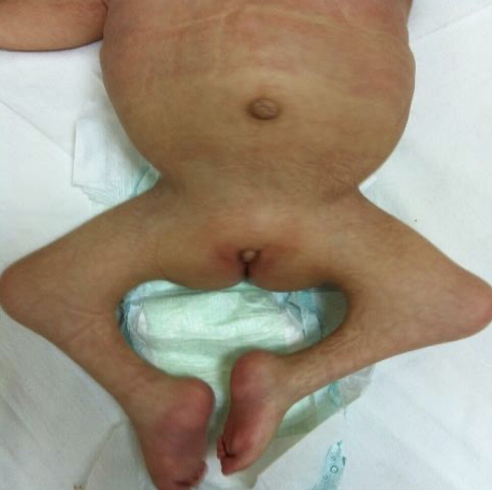

# Diabetes mellitus in pregnancy

*Categories: Clinical knowledge > Obstetrics/gynecology > Pregnancy-associated disorders > Diabetes mellitus in pregnancy*

[Original Article Link](https://coursology-qbank.com/amboss/article/Rs0luh)

---

## Summary

<u>Diabetes mellitus</u> (DM) in <u>pregnancy</u> consists of <u>gestational diabetes mellitus</u> (<u>GDM</u>) and <u>pregestational diabetes mellitus</u>. <u>GDM</u> is an abnormal <u>glucose</u> tolerance that develops during <u>pregnancy</u>, while <u>pregestational diabetes mellitus</u> is DM that is present before <u>conception</u>. Both conditions are associated with an increased risk for maternal and fetal complications. Individuals with pregestational DM may have <u>clinical features of DM</u>, whereas individuals with <u>GDM</u> are usually asymptomatic. Early detection and <u>management of diabetes in pregnancy</u> is essential to reduce complications. <u>Screening for GDM</u> is recommended for all individuals at 24–28 weeks' <u>gestation</u>; high-risk individuals should be additionally screened at the <u>initial prenatal visit</u> for undiagnosed <u>pregestational diabetes</u>. <u>Management of diabetes in pregnancy</u> usually involves a multidisciplinary team including <u>endocrinology</u>, <u>maternal-fetal medicine</u>, and dietitians. If medication is required, <u>insulin</u> is recommended. Patients require careful monitoring; <u>antepartum fetal surveillance</u> is usually recommended from 32 weeks' <u>gestation</u> because of the high rate of fetal complications. <u>GDM</u> usually resolves after delivery, and patients with <u>GDM</u> should be assessed for resolution at 4–12 weeks postpartum. Patients with <u>GDM</u> are at elevated lifetime risk of <u>diabetes mellitus</u> and require ongoing <u>screening for diabetes</u> every 1–3 years.

---

## Overview

| <u>Overview of diabetes in pregnancy</u> |  |  |
| --- | --- | --- |
| Features |  Gestational diabetes mellitus [[2]](https://coursology-qbank.com/amboss/article/iE1Jvi0)[[3]](https://coursology-qbank.com/amboss/article/QE1uvi0)  |  Pregestational diabetes mellitus [[4]](https://coursology-qbank.com/amboss/article/ZHbZKE)  |
| Definition |   * Abnormal <u>glucose</u> tolerance diagnosed during <u>pregnancy</u>  * May be able to be controlled by diet alone (class A1GDM) or may need medication (class A2GDM)  * Associated with an increased risk of maternal and fetal <u>morbidity</u>    |   * <u>T1DM</u> or <u>T2DM</u> diagnosed prior to <u>pregnancy</u>  * Associated with a significantly increased risk for <u>maternal complications during pregnancy</u> and delivery, and congenital abnormalities    |
| <u>Epidemiology</u> |   * 5–9% of <u>pregnancies</u> [[2]](https://coursology-qbank.com/amboss/article/iE1Jvi0)  * Usually in the second and third trimesters    |  * 1% of <u>pregnancies</u>   |
| Pathophysiology |   * <u>Insulin</u> requirements vary during <u>pregnancy</u>.  * <u>First trimester</u>: <u>insulin sensitivity</u> increases; risk of <u>hypoglycemia</u>  * Second and third trimesters: Hormonal changes trigger progressive <u>insulin resistance</u> that results in <u>hyperglycemia</u>, particularly after mealtimes.    |  |
| <u>Risk factors</u> |   * <u>Risk factors for T2DM</u>  * Obstetric  * <u>Gestational diabetes</u> in a previous <u>pregnancy</u>  * <u>Recurrent pregnancy loss</u>  * At least one <u>birth</u> of a child diagnosed with <u>fetal macrosomia</u>    |  * See “<u>Etiology of DM</u>.”   |
| Clinical features |   * Usually asymptomatic  * May present with <u>edema</u>; warning signs include <u>polyhydramnios</u> or large-for-<u>gestational age</u> <u>infants</u> (> 90th <u>percentile</u>)    |  * See “<u>Clinical features of diabetes mellitus</u>.”   |
|  Screening and diagnosis [[4]](https://coursology-qbank.com/amboss/article/ZHbZKE)  |  * <u>Screening for GDM</u> at 24–28 weeks' <u>gestation</u> for all individuals without <u>pregestational diabetes</u>   |   * Screen high risk individuals for undiagnosed <u>pregestational diabetes</u> in the <u>first trimester</u>.  * <u>Screen for complications of DM</u>.  * See also “<u>Management of high-risk pregnancies</u>.”    |
| Treatment |   * <u>Prenatal patient education</u> (e.g., on nutrition, physical activity)  * Strict <u>glycemic control during pregnancy</u> with:  * Diet  [[4]](https://coursology-qbank.com/amboss/article/ZHbZKE)[[5]](https://coursology-qbank.com/amboss/article/0z1erj0)  * Medication (usually <u>insulin</u>)  [[4]](https://coursology-qbank.com/amboss/article/ZHbZKE)[[5]](https://coursology-qbank.com/amboss/article/0z1erj0)  * Regular <u>monitoring of fetal growth and wellbeing</u> (e.g., <u>ultrasound</u>, <u>antepartum fetal surveillance</u>)  * Delivery planning, e.g.: [[4]](https://coursology-qbank.com/amboss/article/ZHbZKE)[[5]](https://coursology-qbank.com/amboss/article/0z1erj0)  * Early delivery if glycemic control is poor or complications occur  * <u>Cesarean delivery</u> if estimated fetus weight > 4500 g  * Tight control of blood <u>glucose</u> during delivery (e.g., <u>insulin</u> infusion) [[4]](https://coursology-qbank.com/amboss/article/ZHbZKE)    |  |
| Complications |   * <u>Maternal complications of diabetes in pregnancy</u> include <u>hypertensive pregnancy disorders</u>, <u>UTI</u>, and <u>birth complications</u>.  * <u>Fetal and neonatal complications of DM in pregnancy</u> include <u>diabetic embryopathy</u> and <u>diabetic fetopathy</u>.    |  |
|  Prognosis [[5]](https://coursology-qbank.com/amboss/article/0z1erj0)  |   * In most cases, <u>GDM</u> resolves after <u>pregnancy</u>.  * Increased risk of developing <u>T2DM</u> (∼50% over 10 years)  * <u>Screen for DM</u> 4–12 weeks postpartum (<u>one-step OGTT</u>)  * Repeat every 1–3 years  * Increased risk of <u>gestational diabetes</u> recurring in subsequent <u>pregnancies</u> (∼ 50%)    |  * As for other forms of <u>diabetes mellitus</u>   |

---

## Complications

<u>Pregestational diabetes</u> poses a greater risk of complications than <u>gestational diabetes</u>. Complications during the <u>first trimester</u> are more common in <u>pregestational diabetes</u>, while complications during the second and third trimesters are equally associated with pregestational and <u>gestational diabetes</u>. [[14]](https://coursology-qbank.com/amboss/article/ZT0Z62)

We list the most important complications. The selection is not exhaustive.

---

## Maternal complications of diabetes in pregnancy

* <u>Hypertensive pregnancy disorders</u>

* <u>Urinary tract infection in pregnancy</u> [[15]](https://coursology-qbank.com/amboss/article/Eqd8Zr0)

* <u>Spontaneous abortion</u>

* Worsening of <u>complications of DM</u> (e.g., <u>diabetic retinopathy</u>)

* <u>Hypoglycemia</u>

* <u>Hyperglycemic crises</u>

* <u>Preterm labor</u>

* <u>Polyhydramnios</u>

* <u>Postpartum hemorrhage</u> [[16]](https://coursology-qbank.com/amboss/article/vqdAZr0)

* Need for <u>cesarean delivery</u>

* Increased long-term risk of developing <u>T2DM</u>

---

## Fetal and neonatal complications of diabetes mellitus in pregnancy

### Diabetic embryopathy

* Definition: any anomaly in an embryo associated with maternal <u>diabetes</u>, typically developing during the main <u>embryonic period</u>

* Onset: <u>first trimester</u>

* Pathophysiology: <u>hyperglycemia</u> → inhibition of <u>myo-inositol</u> uptake → abnormalities in the <u>arachidonic acid-prostaglandin pathway</u> → congenital anomalies and <u>early pregnancy loss</u> [[14]](https://coursology-qbank.com/amboss/article/ZT0Z62)

#### Manifestations of <u>diabetic embryopathy</u> [[14]](https://coursology-qbank.com/amboss/article/ZT0Z62)

* <u>Early pregnancy loss</u> and <u>perinatal</u> <u>death</u>

* Cardiovascular defects: <u>congenital heart disease</u>

* <u>Transposition of the great vessels</u>

* <u>Ventricular septal defect</u>

* <u>Truncus arteriosus</u>

* <u>Coarctation of the aorta</u>

* <u>Patent ductus arteriosus</u>

* <u>Central nervous system</u> defects: <u>neural tube defects</u>

* <u>Anencephaly</u>

* <u>Spina bifida</u>

* <u>Myelomeningocele</u>

* Genitourinary defects

* <u>Renal agenesis</u>

* <u>Ureteral duplication</u>

* <u>Hydronephrosis</u>

* Skeletal defects

* Caudal regression syndrome: a congenital condition characterized by the partial or complete absence of the <u>sacrum</u> and often of the lower <u>lumbar spine</u> 

* Pathophysiology: The cause of <u>caudal regression syndrome</u> is unknown.

* Maternal <u>diabetes</u> is a known <u>risk factor</u>.

* Clinical features: based on the level of the spinal lesion and disease severity

* Lower limb deformities or <u>foot deformities</u> (e.g., <u>club foot</u>)

* <u>Anorectal malformations</u>

* <u>Aplasia</u> or <u>hypoplasia</u> of the <u>sacrum</u> and/or lumbosacral <u>spine</u>

* Mild to severe <u>motor function</u> impairment and <u>paralysis</u>

* Flat buttocks and shallow gluteal clefts

* <u>Bowel and bladder dysfunction</u> (e.g., <u>neurogenic bladder</u>, <u>bladder incontinence</u>)

* May occur as part of other <u>caudal</u> syndromes (e.g., <u>VACTERL</u>, <u>OEIS syndrome</u>)

* <u>Vertebral</u> anomalies (e.g., <u>hemivertebrae</u>)

* Gastrointestinal defects

* Small left colon syndrome: an abrupt decrease in intestinal diameter characterized by transient <u>intestinal obstruction</u> due to inability to pass <u>meconium</u>

* <u>Duodenal atresia</u>

* <u>Anorectal malformation</u>

* Other: <u>cleft palate</u>

Caudal regression syndrome

### Diabetic fetopathy

* Definition: any anomaly in a fetus associated with maternal <u>diabetes</u>, caused by fetal <u>hyperinsulinemia</u> during <u>gestation</u>

* Onset: second and third trimesters

* Pathophysiology: maternal <u>hyperglycemia</u> → fetal <u>hyperglycemia</u> → stimulation of fetal <u>pancreas</u> → fetal <u>hyperinsulinemia</u> → ↑ metabolic rate, oxygen consumption, and fetal <u>hypoxemia</u> → metabolic, respiratory, and cardiovascular complications

#### Manifestations of <u>diabetic fetopathy</u> [[14]](https://coursology-qbank.com/amboss/article/ZT0Z62)

* Growth defect: : <u>fetal macrosomia</u>

* Metabolic defects

* <u>Neonatal hypoglycemia</u>: maternal <u>hyperglycemia</u> → fetal <u>hyperglycemia</u> → <u>beta cell</u> <u>hypertrophy</u> and hyperfunctioning → fetal and neonatal <u>hyperinsulinemia</u> → transient <u>hypoglycemia</u> after <u>birth</u> (when maternal <u>glucose</u> supply stops)

* <u>Neonatal polycythemia</u>: maternal <u>hyperglycemia</u> → chronic fetal <u>hyperglycemia</u> → ↑ metabolic effects and oxygen demand → fetal <u>hypoxemia</u> → ↑ <u>erythropoietin</u> concentrations→ ↑ <u>erythrocyte</u> count

* <u>Neonatal hypocalcemia</u> and <u>neonatal hypomagnesemia</u>: maternal <u>hyperglycemia</u> → abnormal maternal <u>calcium</u>-<u>phosphorus</u> metabolism → ↑ maternal urinary Mg excretion → maternal <u>hypomagnesemia</u> → fetal <u>hypomagnesemia</u> → impaired <u>PTH</u> synthesis in the fetus → fetal <u>hypocalcemia</u> and <u>hypomagnesemia</u>

* Respiratory defects

* <u>Acute respiratory distress syndrome</u>

* <u>Transient tachypnea of the newborn</u>

* <u>Perinatal asphyxia</u>

* Cardiovascular defects: transient hypertrophic cardiomyopathy

* Definition: thickening of one or both of the ventricular walls and the interventricular septum

* Clinical features: often asymptomatic in <u>infants</u> but may manifest with <u>symptoms of heart failure</u> (e.g., <u>tachypnea</u>, poor feeding, irritability)

* Pathophysiology: maternal <u>hyperglycemia</u> → fetal <u>hyperglycemia</u> → fetal <u>hyperinsulinemia</u> → ↑ fat and <u>glycogen</u> in fetal <u>myocardial cells</u> → thickening of ventricular walls and the intraventricular septum in utero → ↓ ventricular size → <u>left ventricular</u> outflow obstruction and systolic and <u>diastolic</u> cardiac dysfunction

* Diagnostics: <u>echocardiography</u> showing thickened ventricular walls and interventricular septum

* Management: <u>supportive care</u>(e.g., <u>intravenous fluids</u>, <u>beta blockers</u>) for symptomatic <u>infants</u>

* Prognosis: Symptoms typically resolve as plasma <u>insulin</u> normalizes.

---