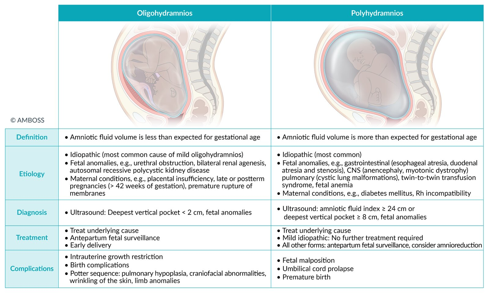
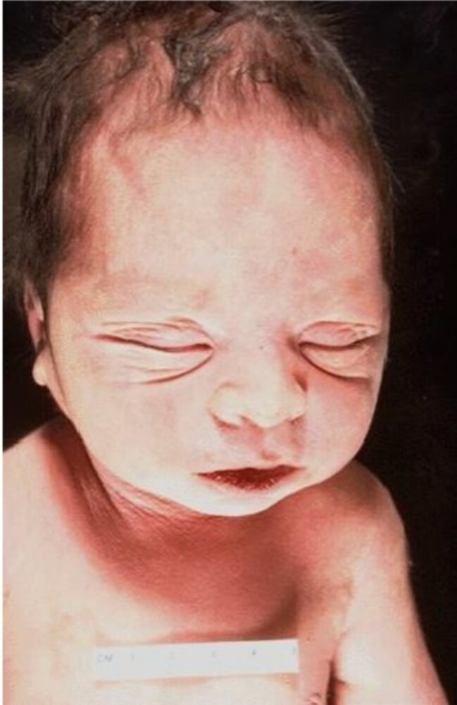

# Oligohydramnios

*Categories: Clinical knowledge > Obstetrics/gynecology > Pregnancy-associated disorders > Oligohydramnios*

[Original Article Link](https://coursology-qbank.com/amboss/article/7804L3)

---

## Summary

Oligohydramnios is an <u>amniotic fluid volume</u> that is lower than expected for <u>gestational age</u>. Oligohydramnios may occur as an isolated finding or in association with fetal or maternal conditions. Fetal causes include renal tract abnormalities, <u>chromosomal abnormalities</u>, and congenital infections. Maternal causes include <u>placental insufficiency</u> and <u>premature rupture of the membranes</u>. Oligohydramnios is often an incidental finding on routine <u>prenatal ultrasound</u> but should be suspected if <u>fundal height</u> is less than expected for <u>gestational age</u> or if <u>premature rupture of membranes</u> occurs. An <u>obstetric ultrasound</u> with a <u>deepest vertical pocket</u> < 2 cm or an <u>amniotic fluid index</u> < 5 cm confirms the diagnosis. Specialist referral is indicated for further evaluation (e.g., underlying causes, associated fetal complications), antepartum surveillance, and possible interventions (e.g., <u>amnioinfusion</u>, planned delivery). Management is based on the <u>gestational age</u>, underlying cause, and severity. Complications include fetal growth restriction, <u>pulmonary hypoplasia</u>, <u>intrauterine fetal demise</u>, <u>Potter sequence</u>, and <u>umbilical cord compression</u>.

Oligohydramnios vs. polyhydramnios

---

## Etiology

Oligohydramnios may occur as an isolated finding or as a result of underlying fetal or maternal factors. [[2]](https://coursology-qbank.com/amboss/article/ME1Mwi0)[[3]](https://coursology-qbank.com/amboss/article/0OdeIJ0)

### Fetal factors [[3]](https://coursology-qbank.com/amboss/article/0OdeIJ0)

* <u>Congenital anomalies of the kidney and urinary tract</u>

* <u>Urethral obstruction</u> (e.g., <u>posterior urethral valves</u>)

* Bilateral <u>renal agenesis</u>

* <u>Autosomal recessive polycystic kidney disease</u> (<u>ARPKD</u>)

* <u>Twin-to-twin transfusion syndrome</u> (donor twin)  [[4]](https://coursology-qbank.com/amboss/article/Ekd8pJ0)

* <u>Chromosomal abnormalities</u> (e.g., <u>aneuploidy</u>)

* Congenital infections (e.g., <u>TORCH infections</u>) [[5]](https://coursology-qbank.com/amboss/article/_kd5qJ0)

> [!TIP]
> Oligohydramnios is associated with conditions that cause decreased fetal production of urine. [[3]](https://coursology-qbank.com/amboss/article/0OdeIJ0)

### Maternal factors [[3]](https://coursology-qbank.com/amboss/article/0OdeIJ0)

* <u>Placental insufficiency</u> ;  [[6]](https://coursology-qbank.com/amboss/article/IE1YCi0)

* <u>Hypertensive disorders of pregnancy</u>

* <u>Late-term pregnancy</u>;  and <u>postterm pregnancy</u>

* <u>Premature rupture of membranes</u>

---

## Diagnosis

Oligohydramnios is diagnosed with an <u>obstetric ultrasound</u>. [[6]](https://coursology-qbank.com/amboss/article/IE1YCi0)

* Indications [[2]](https://coursology-qbank.com/amboss/article/ME1Mwi0)[[6]](https://coursology-qbank.com/amboss/article/IE1YCi0)

* Routine <u>prenatal ultrasound</u> or <u>antepartum fetal surveillance</u>

* Low <u>fundal height</u> for <u>gestational age</u>

* Decreased fetal movement  [[2]](https://coursology-qbank.com/amboss/article/ME1Mwi0)

* Signs of <u>abnormal rupture of membranes</u>

* Findings [[7]](https://coursology-qbank.com/amboss/article/EE18xi0)[[8]](https://coursology-qbank.com/amboss/article/Au1RFi0)

* Low <u>amniotic fluid volume</u> determined by either [[6]](https://coursology-qbank.com/amboss/article/IE1YCi0)[[7]](https://coursology-qbank.com/amboss/article/EE18xi0)

* <u>Deepest vertical pocket</u> (preferred) < 2 cm

* <u>Amniotic fluid index</u> (<u>AFI</u>) < 5 cm

* Underlying <u>placental</u> abnormalities, e.g., <u>placental insufficiency</u>

* Associated <u>fetal complications of oligohydramnios</u>

> [!TIP]
> Oligohydramnios may be discovered incidentally on routine <u>prenatal ultrasound</u> imaging. [[6]](https://coursology-qbank.com/amboss/article/IE1YCi0)[[7]](https://coursology-qbank.com/amboss/article/EE18xi0)[[8]](https://coursology-qbank.com/amboss/article/Au1RFi0)

Evaluation of amniotic fluid volume

Amniotic fluid index measurement

Amniotic fluid index (1/2)

Amniotic fluid index (2/2)

---

## Management

Refer all patients to <u>maternal-fetal medicine</u> for further evaluation and management, which may include the following:

* Identification and management of <u>causes of oligohydramnios</u> and <u>fetal complications of oligohydramnios</u>

* Antepartum surveillance and early delivery [[6]](https://coursology-qbank.com/amboss/article/IE1YCi0)[[9]](https://coursology-qbank.com/amboss/article/LMdw6q0)

* No identified cause or complication (isolated oligohydramnios)

* Antenatal surveillance 1–2 times per week [[2]](https://coursology-qbank.com/amboss/article/ME1Mwi0)

* Planned delivery between 36 0/7 and 37 6/7 weeks' <u>gestation</u> [[9]](https://coursology-qbank.com/amboss/article/LMdw6q0)

* Identified cause or complication

* Antenatal surveillance and management are individualized.

* Associated <u>fetal growth restriction</u>: planned delivery between 34 0/7 and 37 6/7 weeks' <u>gestation</u> [[9]](https://coursology-qbank.com/amboss/article/LMdw6q0)

* Immediate delivery may be indicated for severe maternal or fetal complications.

* Amnioinfusion (infusion of fluid into the <u>amniotic cavity</u>) may be considered to increase <u>amniotic fluid volume</u>. [[3]](https://coursology-qbank.com/amboss/article/0OdeIJ0)

> [!TIP]
> Management of oligohydramnios is based on <u>gestational age</u>, underlying cause, and associated complications. [[6]](https://coursology-qbank.com/amboss/article/IE1YCi0)

> [!TIP]
> Planned <u>preterm delivery</u> is an indication for <u>corticosteroids</u> to <u>induce fetal lung maturity</u>. [[10]](https://coursology-qbank.com/amboss/article/-N1Ddh0)

---

## Complications

### Fetal and <u>newborn</u> complications

* <u>Fetal growth restriction</u>

* <u>Intrauterine fetal demise</u> [[2]](https://coursology-qbank.com/amboss/article/ME1Mwi0)

* <u>Umbilical cord compression</u> or, during <u>labor</u> and delivery, <u>umbilical cord prolapse</u>

* <u>Complications of prematurity</u> (secondary to <u>iatrogenic</u> <u>preterm birth</u>) [[9]](https://coursology-qbank.com/amboss/article/LMdw6q0)[[11]](https://coursology-qbank.com/amboss/article/ZOdZIJ0)

* Any clinical features of <u>Potter sequence</u>

#### Potter sequence

* Etiology 

* Chronic <u>placental insufficiency</u>

* ↓ Renal output (e.g., due to bilateral <u>renal agenesis</u>, <u>ARPKD</u>, obstruction of <u>posterior urethral valves</u>)

* Chronic <u>amniotic fluid</u> leakage

* See “<u>Causes of oligohydramnios</u>.”

* Pathophysiology: : oligohydramnios → intrauterine compression and decreased <u>amniotic fluid</u> ingestions → ↓ space for <u>fetal development</u> → internal and external deformations

* Clinical features

* <u>Pulmonary hypoplasia</u> (<u>cause of death</u> due to severe neonatal <u>respiratory insufficiency</u>)  [[3]](https://coursology-qbank.com/amboss/article/0OdeIJ0)

* Sequelae of intrauterine constraint

* Craniofacial abnormalities (e.g., prominent epicanthal and infraorbital folds, flattened nose, receding chin, low set <u>ears</u>)

* Skeletal deformities, e.g., <u>DDH</u>, <u>congenital torticollis</u>, <u>joint contractures</u>

* Wrinkling of the <u>skin</u>

> [!NOTE]
> Potter babies cannot Pee.

> [!NOTE]
> POTTER sequence: Pulmonary <u>hypoplasia</u> (lethal), Oligohydramnios (origin), Twisted facies, Twisted <u>skin</u>, Extremity deformities, and Renal <u>agenesis</u> (classic form).

Potter sequence

Potter sequence

We list the most important complications. The selection is not exhaustive.

---