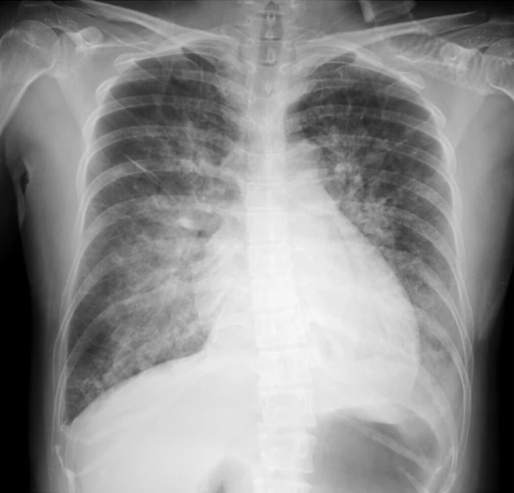
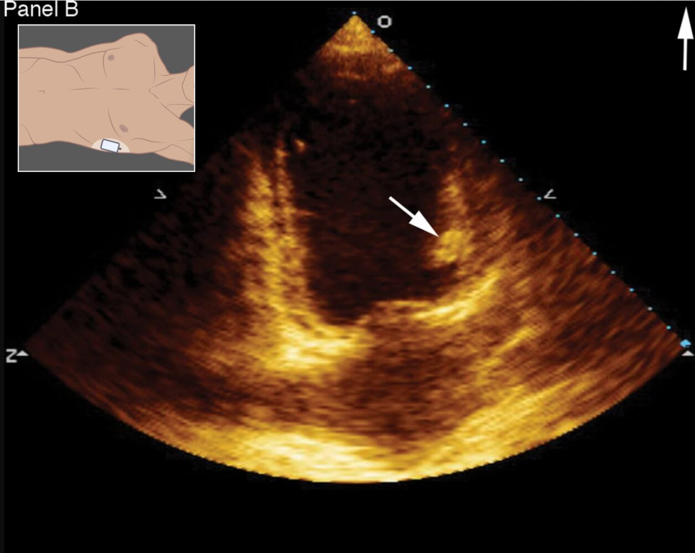

# Peripartum cardiomyopathy

*Categories: Clinical knowledge > Obstetrics/gynecology > Pregnancy-associated disorders > Peripartum cardiomyopathy*

[Original Article Link](https://coursology-qbank.com/amboss/article/Q70ulh)

---

## Summary

Peripartum <u>cardiomyopathy</u> (PPCM) is the <u>idiopathic</u> development of <u>heart failure with reduced ejection fraction</u> (<u>HFrEF</u>) at the late stages of <u>pregnancy</u> or during the <u>postpartum period</u>. African American women are at an increased risk of developing PPCM and account for > 40% of all cases. PPCM typically manifests with <u>signs and symptoms of heart failure</u>, which can overlap with physiological signs of third-trimester <u>pregnancy</u> and the postpartum state. The diagnosis is based on a <u>left ventricular ejection fraction</u> (<u>LVEF</u>) of < 45% seen on <u>echocardiography</u> and the exclusion of other <u>causes of heart failure</u>. Management of PPCM is multidisciplinary and the early involvement of cardiologists, obstetricians, and neonatologists is recommended. The <u>treatment of heart failure</u> is similar to that of <u>HFrEF</u> due to other causes with necessary modifications to ensure that medications are safe for use during <u>pregnancy</u> and lactation. Patients with extremely low <u>ejection fraction</u> are at risk of developing a <u>thromboembolic event</u> and may require anticoagulation. Urgent delivery should be considered in <u>hemodynamically unstable</u> patients who do not respond to medical therapy. Response to optimal medical therapy is usually good. However, as there is a significant risk of recurrence in subsequent <u>pregnancies</u>, patients should be counseled on <u>contraception</u>.

---

## Clinical features

* Symptom onset

* Most common in the first month after delivery

* Can occur during <u>pregnancy</u>, usually in the <u>3rd trimester</u>

* Common manifestation: <u>signs and symptoms of heart failure</u>  [[2]](https://coursology-qbank.com/amboss/article/mLXVyA)[[4]](https://coursology-qbank.com/amboss/article/24XTiy)

* Less common presentations 

* <u>Cardiogenic shock</u>

* <u>Thromboembolic event</u>  [[3]](https://coursology-qbank.com/amboss/article/U4Xbiy)[[4]](https://coursology-qbank.com/amboss/article/24XTiy)

> [!WARNING]
> A high index of suspicion is essential for diagnosing PPCM as symptoms often overlap with normal <u>pregnancy</u> or the postpartum state!

---

## Diagnosis

### Approach [[2]](https://coursology-qbank.com/amboss/article/mLXVyA)[[3]](https://coursology-qbank.com/amboss/article/U4Xbiy)[[4]](https://coursology-qbank.com/amboss/article/24XTiy)

* PPCM is a diagnosis of exclusion.

* The diagnostic approach is the same as that for <u>heart failure</u> in nonpregnant patients (see “Diagnostics” in “<u>Congestive heart failure</u>” for details).

* Confirm <u>systolic heart failure</u> (<u>HFrEF</u>) on <u>echocardiography</u>.

* Rule out other <u>causes of heart failure</u> or underlying <u>heart</u> disease.

* Patients presenting with <u>acute heart failure</u>: See “Diagnostics” in “<u>Acute heart failure</u>.”

* In addition, obtain a <u>biophysical profile</u> to assess fetal well-being.

### Diagnostic criteria [[2]](https://coursology-qbank.com/amboss/article/mLXVyA)

All of the following criteria must be fulfilled to confirm a diagnosis of PPCM:

* New-onset <u>systolic heart failure</u> in the months following or preceding delivery

* Absence of other discernible <u>causes of heart failure</u>

* Absence of preexisting <u>heart</u> disease

* <u>LVEF</u> < 45%  [[3]](https://coursology-qbank.com/amboss/article/U4Xbiy)

### Diagnostic tests [[2]](https://coursology-qbank.com/amboss/article/mLXVyA)[[4]](https://coursology-qbank.com/amboss/article/24XTiy)

* <u>Echocardiography</u>: indicated in all patients with suspected PPCM

* Characteristic finding: reduced <u>left ventricular ejection fraction</u> < 45%

* Other findings include varying degrees of:

* Left and <u>right ventricular</u> dilatation

* <u>Biatrial enlargement</u>

* <u>Functional mitral regurgitation</u> and <u>tricuspid regurgitation</u>

* <u>Pulmonary hypertension</u>

* <u>Left ventricular thrombus</u>  [[4]](https://coursology-qbank.com/amboss/article/24XTiy)

* Supportive findings of PPCM on other diagnostic tests

* <u>Chest x-ray</u>: <u>cardiomegaly</u>, <u>x-ray</u> <u>signs of pulmonary edema</u>

* <u>Cardiac biomarkers</u>: elevated <u>BNP</u> and <u>troponin I</u>  [[5]](https://coursology-qbank.com/amboss/article/hQXcDB)

* <u>ECG</u>: variable findings (normal, <u>sinus tachycardia</u>, <u>tachyarrhythmias</u>)

Pulmonary edema

Left ventricular thrombus

---

## Differential diagnoses

The symptoms of PPCM are nonspecific and overlap with a number of conditions that cause or mimic <u>heart failure</u> in the peripartum period (see table below). Some symptoms resemble the normal features of the <u>third trimester</u> of <u>pregnancy</u>, resulting in a delayed or missed diagnosis of PPCM.

|  Differential diagnosis of peripartum <u>cardiomyopathy</u> [[3]](https://coursology-qbank.com/amboss/article/U4Xbiy)[[4]](https://coursology-qbank.com/amboss/article/24XTiy)  |  |
| --- | --- |
| Conditions that can cause <u>heart failure</u> in the peripartum period | Conditions that can mimic <u>acute heart failure</u> in the peripartum period |
|   * <u>Severe preeclampsia</u> leading to <u>pulmonary edema</u>  * Worsening or unmasking of preexisting <u>structural heart disease</u> during the peripartum period  * <u>New-onset heart failure</u> of any cause  * <u>Pregnancy</u>-associated <u>myocardial infarction</u>  * <u>Takotsubo cardiomyopathy</u>    |   * <u>Pulmonary embolism</u>  * <u>Amniotic fluid embolism</u>  * <u>Pneumonia</u>  * <u>Acute lung injury</u>  * <u>AKI</u> with <u>fluid overload</u>    |

The differential diagnoses listed here are not exhaustive.

---

## Treatment

### Overview [[3]](https://coursology-qbank.com/amboss/article/U4Xbiy)[[4]](https://coursology-qbank.com/amboss/article/24XTiy)[[5]](https://coursology-qbank.com/amboss/article/hQXcDB)[[6]](https://coursology-qbank.com/amboss/article/f4Xkiy)

* Acute and long-term <u>treatment of PPCM</u> is similar to that of <u>HFrEF</u> due to other causes.

* Ensure medications are safe to use during <u>pregnancy</u> or lactation (see “<u>Usage of heart failure medications during pregnancy and lactation</u>”).

* <u>Multidisciplinary care</u>, involving cardiology, obstetric, neonatology, and intensivist expertise is recommended.

* Patients are at increased risk of <u>thromboembolic events</u> and may require anticoagulation (see “<u>Anticoagulation in PPCM</u>”).

### Initial <u>management of heart failure</u>

#### Acute decompensated PPCM [[3]](https://coursology-qbank.com/amboss/article/U4Xbiy)[[4]](https://coursology-qbank.com/amboss/article/24XTiy)

* Urgent consults: critical care, cardiology, and obstetrics

* Urgent stabilization 

* Initiate <u>management of acute heart failure</u>.

* Ensure medications are safe for use in <u>pregnancy</u> or lactation (see “<u>Use of heart failure medications during pregnancy and lactation</u>”).

* No response to <u>inotropes</u>: Consider <u>mechanical circulatory support</u>.

* Identify and treat associated complications.

* <u>Hemodynamically unstable</u> despite optimal medical therapy: Consider urgent <u>cesarean delivery</u>.

* Further management

* Initiate prophylactic measures to reduce the risk of complications in high-risk patients.

* Consider delaying <u>breastfeeding</u> until clinically stable.

> [!TIP]
> Involve specialists early, as both the mother and fetus are at risk of adverse outcomes!

#### Hemodynamically stable patients [[3]](https://coursology-qbank.com/amboss/article/U4Xbiy)[[4]](https://coursology-qbank.com/amboss/article/24XTiy)[[5]](https://coursology-qbank.com/amboss/article/hQXcDB)

* Management is similar to that in nonpregnant patients (see “<u>Treatment of heart failure</u>” for details and drug dosages).

* Ensure medications are safe for use in <u>pregnancy</u> or lactation: See “<u>Use of heart failure medications during pregnancy and lactation</u>.”

### Anticoagulation in PPCM [[4]](https://coursology-qbank.com/amboss/article/24XTiy)

#### Indications and regimens [[4]](https://coursology-qbank.com/amboss/article/24XTiy)

* Confirmed <u>thromboembolic event</u>

* Therapeutic anticoagulation is recommended.

* Dosage and duration depend on the <u>thromboembolic event</u> (see, e.g., “<u>Anticoagulation for PE</u>”, “<u>Anticoagulation for DVT</u>”).

* <u>LVEF</u> ≤ 30–35%  

* It is unclear if prophylactic or therapeutic doses of <u>anticoagulants</u> should be used.  [[3]](https://coursology-qbank.com/amboss/article/U4Xbiy)[[4]](https://coursology-qbank.com/amboss/article/24XTiy)[[5]](https://coursology-qbank.com/amboss/article/hQXcDB)

* Duration of anticoagulation: no consensus; usually through the rest of <u>pregnancy</u> and for 6–8 weeks postpartum  [[2]](https://coursology-qbank.com/amboss/article/mLXVyA)[[7]](https://coursology-qbank.com/amboss/article/sLXt_A)

#### Modifications for <u>pregnancy</u> or lactation

* <u>Pregnancy</u>: Use <u>UFH</u> or <u>LMWH</u>.

* Lactation: Use <u>UFH</u>, <u>LMWH</u>, or <u>warfarin</u>.

> [!WARNING]
> <u>Warfarin</u> is contraindicated in <u>pregnancy</u>.

### Delivery [[2]](https://coursology-qbank.com/amboss/article/mLXVyA)[[6]](https://coursology-qbank.com/amboss/article/f4Xkiy)

* Important considerations

* The optimal timing and method of delivery should be determined in <u>joint</u> consultation with obstetrics and cardiology.

* Closely monitor hemodynamic and respiratory status during and following delivery.  [[4]](https://coursology-qbank.com/amboss/article/24XTiy)

* Acute decompensated PPCM (despite optimal medical therapy): Consider urgent <u>cesarean delivery</u>.

* Stable PPCM: vaginal delivery at term, if feasible  [[5]](https://coursology-qbank.com/amboss/article/hQXcDB)

### <u>Breastfeeding</u>  [[6]](https://coursology-qbank.com/amboss/article/f4Xkiy)

* Acute decompensated PPCM: Consider delaying <u>breastfeeding</u> until clinically stable.

* Stable PPCM: <u>Breastfeeding</u> is likely safe and should not be discouraged.

> [!TIP]
> Modify <u>heart failure</u> medications as needed for <u>breastfeeding</u> patients. See “<u>Usage of heart failure medications in pregnancy and lactation</u>.”

### Ongoing <u>management of heart failure</u> [[3]](https://coursology-qbank.com/amboss/article/U4Xbiy)[[5]](https://coursology-qbank.com/amboss/article/hQXcDB)[[8]](https://coursology-qbank.com/amboss/article/zOXrEy)

* Close follow-up: serial <u>echocardiograms</u> to assess for LV recovery

* <u>Medical treatment of heart failure</u>

* Persistent <u>LV dysfunction</u>: life-long therapy recommended

* Recovered LV function: optimal duration of therapy unknown; consider continuing therapy indefinitely

* Device therapy

* High-risk patients with <u>LVEF</u> < 35%: Consider a <u>wearable cardioverter-defibrillator</u> while awaiting a response to medical therapy.

* Persistent, severe <u>LV dysfunction</u> despite ≥ 6 months of optimal medical therapy: Consider <u>ICD</u> with or without <u>cardiac resynchronization therapy</u>.  [[3]](https://coursology-qbank.com/amboss/article/U4Xbiy)[[5]](https://coursology-qbank.com/amboss/article/hQXcDB)

* <u>Heart transplantation</u>: may be required if LV function remains poor despite medical therapy

---

## Contraception and subsequent pregnancies

### <u>Contraception</u> [[4]](https://coursology-qbank.com/amboss/article/24XTiy)[[8]](https://coursology-qbank.com/amboss/article/zOXrEy)

* Rationale

* The risk of PPCM recurrence and mortality with subsequent <u>pregnancies</u> is substantial.

* <u>Contraception counseling</u> is essential and should be done at the time of diagnosis or before <u>hospital discharge</u>.

* The choice of <u>contraception</u> is guided by <u>efficacy</u>, risk of adverse effects, and patient preference.  [[4]](https://coursology-qbank.com/amboss/article/24XTiy)

* <u>Estrogen</u>-containing <u>contraceptives</u> are best avoided in the early <u>postpartum period</u> and in patients with severely reduced <u>ejection fraction</u>.  [[4]](https://coursology-qbank.com/amboss/article/24XTiy)[[9]](https://coursology-qbank.com/amboss/article/w6XhM_)

* Options [[4]](https://coursology-qbank.com/amboss/article/24XTiy)

* First-line: <u>progestin-releasing IUDs</u>, subdermal <u>progestin implants</u>, <u>vasectomy</u>, or <u>tubal ligation</u>

* Second-line: <u>depot medroxyprogesterone acetate</u>

* Third-line: <u>progesterone</u>-only pills

* Fourth-line: <u>barrier contraceptives</u>

* See “<u>Contraception</u>” for more information.

> [!WARNING]
> Patients must receive advice on <u>contraception</u> and the risk of further <u>pregnancies</u> before discharge!

### Subsequent <u>pregnancies</u> [[3]](https://coursology-qbank.com/amboss/article/U4Xbiy)[[4]](https://coursology-qbank.com/amboss/article/24XTiy)[[8]](https://coursology-qbank.com/amboss/article/zOXrEy)

* <u>Preconception counseling</u>

* Persistent <u>LV dysfunction</u> (i.e., <u>LVEF</u> < 50%): Strongly advise against <u>pregnancy</u> because of the high risk of deterioration.

* Recovered LV function (i.e., <u>LVEF</u> > 50%): <u>Shared decision-making</u> is advised in consultation with cardiology and obstetrics specialists.  [[4]](https://coursology-qbank.com/amboss/article/24XTiy)

* Management of subsequent <u>pregnancies</u>

* Closely monitor patients for PPCM recurrence during <u>pregnancy</u> and for at least one year postpartum.

* <u>Termination of pregnancy</u> should be discussed in high-risk patients.  [[8]](https://coursology-qbank.com/amboss/article/zOXrEy)

---

## Prognosis

* Higher rate of clinical and <u>myocardial</u> function recovery compared to other forms of <u>HFrEF</u>

* Good response to optimal medical therapy (<u>LVEF</u> recovery can occur within 3–6 months of diagnosis)

* Complete recovery less likely in patients with <u>LVEF</u> < 30%

* Significant risk of recurrence for all patients in subsequent <u>pregnancies</u>

---