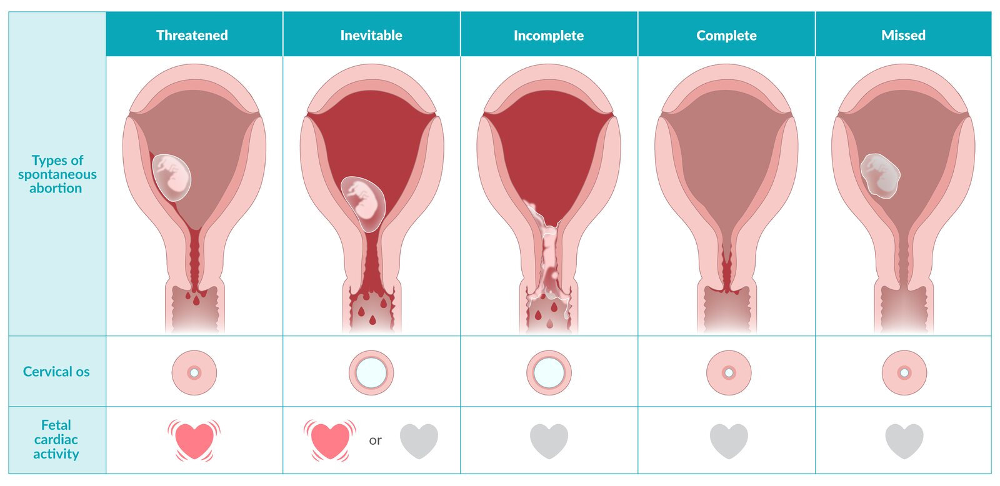

# Pregnancy loss

*Categories: Clinical knowledge > Obstetrics/gynecology > Pregnancy-associated disorders > Pregnancy loss*

[Original Article Link](https://coursology-qbank.com/amboss/article/gO0F7T)

---

## Summary

<u>Pregnancy</u> loss can occur even in previously healthy <u>pregnancies</u>. If it occurs before 20 weeks' <u>gestation</u> (∼ 10% of <u>pregnancies</u>), it is called <u>miscarriage</u> or <u>spontaneous abortion</u>. If it occurs after 20 weeks' <u>gestation</u>, it is called <u>stillbirth</u> or <u>intrauterine fetal demise</u>. There is no widely accepted definition of <u>recurrent pregnancy loss</u>, but it often refers to ≥ 2 losses before viability. The majority of spontaneous abortions are due to fetal <u>aneuploidy</u>. Other common <u>causes of spontaneous abortion</u> are maternal disease, trauma, and congenital anomalies. <u>Stillbirth</u> can be caused by maternal disease, <u>placental</u> disorders, <u>umbilical cord complications</u>, or fetal congenital anomalies. In many cases, the <u>cause of spontaneous abortion</u> or <u>stillbirth</u> is unknown. The management of <u>pregnancy</u> loss depends on the week of <u>gestation</u> and clinical presentation and may involve medication-induced evacuation of the <u>pregnancy</u>, surgical evacuation of the <u>pregnancy</u>, or <u>expectant management</u>. After a <u>spontaneous abortion</u>, the <u>products of conception</u> should undergo histopathological examination. Similarly, fetal <u>autopsy</u> should be offered after a <u>stillbirth</u> in order to determine the underlying cause and address any modifiable etiologies.

See also “<u>Counseling on pregnancy loss</u>” and “<u>Induced abortion</u>.”

---

## Overview

|  Types of <u>pregnancy</u> loss [[1]](https://coursology-qbank.com/amboss/article/Yuanpm)  |  |  |  |
| --- | --- | --- | --- |
|  Type [[2]](https://coursology-qbank.com/amboss/article/W81Pli0)[[3]](https://coursology-qbank.com/amboss/article/7F14ji0)  | Definition |  Findings  | Treatment |
| Threatened abortion |  * An abortion process starting before 20 weeks' <u>gestation</u> that has not progressed to a state from which recovery is impossible (potentially reversible)   |   * <u>Vaginal bleeding</u>  * Fetal cardiac activity  * Closed <u>cervical os</u>    |   * <u>Expectant management</u>  * Patient should avoid strenuous physical activity.  * Weekly <u>pelvic</u> <u>ultrasound</u>  * Rule out treatable causes of <u>vaginal bleeding</u>.  * <u>Anti-D immunoglobulin</u> should be considered for <u>Rh(D)-negative</u> women.    |
| Inevitable abortion |   * A condition of <u>vaginal bleeding</u> and <u>cervical dilation</u> without expulsion of <u>products of conception</u> (<u>POC</u>) that occurs before 20 weeks' <u>gestation</u>  * Typically followed by partial or complete passage of <u>POC</u>    |   * <u>Vaginal bleeding</u>, and visible/palpable <u>products of conception</u>  * Fetal cardiac activity may be present.  * Dilated <u>cervical os</u>    |   * Depends mostly on patient preference  * <u>Expectant management</u> (option for women ≤ 12 weeks <u>gestation</u>)  * Medical evacuation: combination of <u>mifepristone</u> and <u>misoprostol</u>  * Surgical evacuation: if spontaneous evacuation does not occur or in cases of <u>septic abortion</u> or heavy bleeding    |
| Missed abortion |  * <u>Death</u> of a fetus before 20 weeks' <u>gestation</u> without expulsion of any <u>POC</u>   |   * No bleeding  * No expulsion of the <u>products of conception</u>  * No fetal cardiac activity  * Closed <u>cervical os</u>    |  |
| Incomplete abortion |  * Passage of some but not all <u>POC</u> before 20 weeks' <u>gestation</u>   |   * <u>Vaginal bleeding</u>; <u>products of conception</u> within the cervical canal or <u>uterus</u>  * Dilated <u>cervical os</u>    |  |
| Complete abortion |  * The complete passage of all <u>POC</u> before 20 weeks' <u>gestation</u>   |   * <u>Vaginal bleeding</u>; <u>products of conception</u> completely outside of the <u>uterus</u>  * Closed <u>cervical os</u>    |  * No treatment required   |
| <u>Stillbirth</u> |  * Loss of <u>pregnancy</u> after 20 weeks' <u>gestation</u> (also called <u>intrauterine fetal demise</u>)   |   * Absence of fetal movements and cardiac activity  * <u>Cervical os</u> variable    |   * Spontaneous <u>labor</u> usually begins within 2 weeks of <u>intrauterine fetal death</u>.  * Vaginal delivery is safer than <u>cesarean delivery</u>    |

Types of spontaneous abortion

---

## Spontaneous abortion

### Definitions [[1]](https://coursology-qbank.com/amboss/article/Yuanpm)[[2]](https://coursology-qbank.com/amboss/article/W81Pli0)

* <u>Spontaneous abortion</u> (<u>miscarriage</u>)

* Spontaneous loss of <u>pregnancy</u> before 20 weeks' <u>gestation</u>  [[2]](https://coursology-qbank.com/amboss/article/W81Pli0)[[4]](https://coursology-qbank.com/amboss/article/tiVXt80)

* If <u>gestational age</u> is unknown: spontaneous loss of <u>pregnancy</u> with fetal weight < 350 g)  [[2]](https://coursology-qbank.com/amboss/article/W81Pli0)[[4]](https://coursology-qbank.com/amboss/article/tiVXt80)

* Early pregnancy loss: spontaneous loss of <u>pregnancy</u> before 13 weeks' <u>gestation</u> (i.e., during the <u>first trimester</u>)

* See also “<u>Recurrent pregnancy loss</u>.”

### Etiology [[1]](https://coursology-qbank.com/amboss/article/Yuanpm)

Causes of spontaneous abortion include:

* Maternal

* Abnormalities of the reproductive organs

* <u>Septate uterus</u>

* <u>Uterine leiomyomas</u>

* <u>Uterine adhesions</u>

* <u>Cervical incompetence</u>

* Systemic diseases
* Including <u>diabetes mellitus</u>, <u>hyperthyroidism</u>, <u>hypothyroidism</u>, genetic disorders, infections, <u>hypercoagulability</u> (see “<u>Recurrent pregnancy loss</u>”)

* Fetoplacental

* <u>Chromosomal abnormalities</u> account for up to half of all spontaneous abortions.

* Congenital anomalies

* <u>Anembryonic pregnancy</u>

* Miscellaneous

* Trauma

* <u>Iatrogenic</u> (e.g., <u>amniocentesis</u> or <u>chorionic villus sampling</u>)

* Environmental (exposure to toxins such as drugs or maternal smoking during <u>pregnancy</u>)

* Unknown

### Clinical features [[3]](https://coursology-qbank.com/amboss/article/7F14ji0)[[5]](https://coursology-qbank.com/amboss/article/rF1fji0)

* <u>Vaginal bleeding</u>

* Abdominal <u>pain</u> or cramping

* Loss of <u>pregnancy symptoms</u> (e.g., <u>breast</u> tenderness, <u>nausea</u>)

* <u>Size-date discrepancies</u> in <u>gestational age assessment</u>

* Absence of fetal cardiac activity

### Diagnostics [[2]](https://coursology-qbank.com/amboss/article/W81Pli0)[[3]](https://coursology-qbank.com/amboss/article/7F14ji0)[[6]](https://coursology-qbank.com/amboss/article/AN1Rdh0)

#### General principles

* The diagnosis of <u>spontaneous abortion</u> is based on a combination of the following:

* Clinical evaluation to assess for active bleeding, retained <u>POC</u>, and whether the <u>cervical os</u> is dilated

* <u>Ultrasound</u> to assess for <u>sonographic signs of intrauterine pregnancy</u> and fetal cardiac activity

* Supportive diagnostics, including serum <u>β-hCG</u>, <u>CBC</u>, and <u>blood typing</u>

* <u>Ectopic pregnancy</u> must be excluded (see “<u>Diagnostics for ectopic pregnancy</u>”).

|  Features of spontaneous pregnancy loss [[3]](https://coursology-qbank.com/amboss/article/7F14ji0)  |  |  |  |  |
| --- | --- | --- | --- | --- |
| Type | <u>Vaginal bleeding</u> | Fetal cardiac activity | <u>Products of conception</u> (<u>POC</u>) | <u>Cervical os</u> |
| <u>Threatened abortion</u> |  * Yes   |  * Yes   |  * Intrauterine   |  * Closed   |
| <u>Inevitable abortion</u> |  * Yes   |  * May be present   |  * Visible/palpable <u>POC</u>   |  * Dilated   |
| <u>Missed abortion</u> |  * No   |  * No   |  * No expulsion of the <u>POC</u>   |  * Closed   |
| <u>Incomplete abortion</u> |  * Yes   |  * No   |  * <u>POC</u> within the cervical canal or <u>uterus</u>   |  * Dilated   |
| <u>Complete abortion</u> |  * Yes   |  * No   |  * <u>POC</u> completely outside of the <u>uterus</u>   |  * Closed   |

> [!WARNING]
> Diagnostic confirmation of fetal <u>death</u> prior to treatment is essential to avoid compromising a viable <u>pregnancy</u>.

> [!WARNING]
> Consider the diagnosis of <u>septic abortion</u> in patients with <u>clinical features of pregnancy</u> loss and <u>fever</u>. [[7]](https://coursology-qbank.com/amboss/article/d81oli0)

Types of spontaneous abortion

#### Clinical evaluation

* <u>Bimanual pelvic examination</u>: Assess for <u>size-date discrepancies</u> and <u>signs of ectopic pregnancy</u> (e.g., <u>adnexal mass</u> or tenderness).

* <u>Speculum examination</u>

* Assess for <u>cervical dilatation</u> and retained <u>POC</u>.

* Confirm that the source of bleeding is uterine.

> [!TIP]
> In stable patients after a resolved episode of mild to moderate <u>vaginal bleeding</u>, <u>pregnancy</u> viability may be assessed by <u>ultrasound</u> without a bimanual or <u>speculum examination</u>. [[5]](https://coursology-qbank.com/amboss/article/rF1fji0)

#### <u>Ultrasound</u>

* <u>Fetal heart rate</u> <u>auscultation</u> with Doppler monitor   [[8]](https://coursology-qbank.com/amboss/article/dF1oSi0)

* Performed routinely during prenatal visits after 10–12 weeks' <u>gestation</u>

* Absence of fetal <u>heart sounds</u> should raise suspicion of <u>spontaneous abortion</u>.

* <u>Transvaginal ultrasound</u> (<u>TVUS</u>): to look for <u>sonographic signs of intrauterine pregnancy</u> (<u>IUP</u>)

* Diagnostic modality of choice to verify the presence of a viable <u>IUP</u> [[9]](https://coursology-qbank.com/amboss/article/BUWz2k0)

* TVUS findings of pregnancy failure include:

* Absence of fetal cardiac activity when <u>crown-rump length</u> is ≥ 7 mm  [[2]](https://coursology-qbank.com/amboss/article/W81Pli0)

* <u>Gestational sac</u> ≥ 25 mm without an embryo

* Previously visualized <u>IUP</u> not observed (empty <u>uterus</u>)  [[2]](https://coursology-qbank.com/amboss/article/W81Pli0)

* For the technique, see “<u>POCUS for early pregnancy</u>.”

> [!TIP]
> Perform a <u>pelvic</u> <u>ultrasound</u> on pregnant patients who present to the emergency department with abdominal <u>pain</u> or <u>vaginal bleeding</u>, regardless of <u>β-hCG</u> levels. [[10]](https://coursology-qbank.com/amboss/article/5Tcirb0)

#### <u>Laboratory studies</u>

* Serial serum <u>β-hCG</u>: : Downtrending levels suggest a failed <u>pregnancy</u>.   [[11]](https://coursology-qbank.com/amboss/article/vpYArJ)[[12]](https://coursology-qbank.com/amboss/article/LgcwDb0)[[13]](https://coursology-qbank.com/amboss/article/KibUst)

* Additional studies 

* <u>CBC</u>: to assess for blood loss <u>anemia</u> and determine baseline in patients with persistent bleeding

* <u>Blood typing</u>: to determine maternal <u>Rh blood group</u>

> [!WARNING]
> <u>β-hCG</u> levels above the <u>discriminatory zone threshold</u> without visualization of an <u>intrauterine pregnancy</u> on <u>ultrasound</u> should raise concern for <u>spontaneous abortion</u> or <u>ectopic pregnancy</u>. [[14]](https://coursology-qbank.com/amboss/article/V81Gli0)

### Management [[2]](https://coursology-qbank.com/amboss/article/W81Pli0)[[3]](https://coursology-qbank.com/amboss/article/7F14ji0)[[5]](https://coursology-qbank.com/amboss/article/rF1fji0)

#### Approach

* Clinically unstable patients

* <u>Immediate hemodynamic support</u> and stabilization (see “<u>ABCDE approach</u>”)

* Urgent <u>OB/GYN</u> consult for emergency surgical uterine evacuation

* Stable patients

* <u>Threatened abortion</u>: <u>expectant management</u>

* Inevitable, incomplete, or <u>missed abortion</u>: <u>expectant management</u>, medical evacuation, or surgical evacuation

* <u>Complete abortion</u>: no intervention needed

* Inconclusive <u>ultrasound</u> findings: close follow-up with serial <u>β-hCG</u> measurements and repeat <u>TVUS</u>  [[6]](https://coursology-qbank.com/amboss/article/AN1Rdh0)

* All patients

* If there is concern for <u>septic abortion</u>, obtain <u>blood cultures</u>, start <u>broad-spectrum antibiotics</u>, and consult <u>OB/GYN</u>.

* <u>Anti-D immunoglobulin</u> for <u>Rh(D)-negative</u> patients [[15]](https://coursology-qbank.com/amboss/article/eqYxxJ)

* Consider for all patients with <u>vaginal bleeding</u>.

* Indicated after surgical evacuation

* Provide <u>counseling on pregnancy loss</u> and arrange for follow-up.

> [!WARNING]
> Consult <u>OB/GYN</u> for emergency surgical evacuation for <u>miscarriage</u> complicated by heavy bleeding, <u>hemodynamic instability</u>, or <u>septic abortion</u>.

#### <u>Threatened abortion</u>

* <u>Expectant management</u>: Symptoms will resolve or progress to inevitable, incomplete, or <u>complete abortion</u>.

* Advise the patient to avoid strenuous physical activity.   [[2]](https://coursology-qbank.com/amboss/article/W81Pli0)

* Prescribe as-needed <u>oral analgesics</u> (e.g., <u>acetaminophen</u>). [[6]](https://coursology-qbank.com/amboss/article/AN1Rdh0)

* Educate patients on what to expect if tissue expulsion occurs and provide <u>return precautions</u>.

* Repeat <u>pelvic</u> <u>ultrasound</u> in one week.

#### <u>Inevitable abortion</u>, <u>incomplete abortion</u>, or <u>missed abortion</u>

Management of uncomplicated spontaneous abortions depends mostly on patient preference.

* <u>Expectant management</u> (option for women ≤ 12 weeks <u>gestation</u>) [[2]](https://coursology-qbank.com/amboss/article/W81Pli0)

* <u>Watchful waiting</u> as long as patient remains stable (i.e., no <u>fever</u> or significant hemorrhage)  [[2]](https://coursology-qbank.com/amboss/article/W81Pli0)[[5]](https://coursology-qbank.com/amboss/article/rF1fji0)

* The patient can choose to pursue surgical or medical evacuation at any time during the process. [[3]](https://coursology-qbank.com/amboss/article/7F14ji0)

* Medical evacuation

* <u>Misoprostol</u> is used to induce <u>cervical ripening</u> and expulsion of the <u>products of conception</u>.

* When available, pretreatment with <u>mifepristone</u> 24 hours prior is recommended.  [[2]](https://coursology-qbank.com/amboss/article/W81Pli0)

* See “<u>Medical abortion</u>” for details and regimens.

* Surgical evacuation

* Indicated for <u>septic abortion</u>, heavy bleeding, or if there are maternal comorbidities

* Options

* <u>First trimester</u>: <u>vacuum aspiration</u> or <u>dilation and curettage</u>  [[2]](https://coursology-qbank.com/amboss/article/W81Pli0)[[3]](https://coursology-qbank.com/amboss/article/7F14ji0)[[6]](https://coursology-qbank.com/amboss/article/AN1Rdh0)

* <u>Second trimester</u>: <u>dilation and evacuation</u>

* Complications include uterine perforation, hemorrhage, <u>endometritis</u>, and/or <u>intrauterine adhesions</u>.

* Additional measures and follow-up

* In patients managed expectantly or with medical evacuation:

* Prescribe as-needed <u>oral analgesics</u> (e.g., <u>NSAIDs</u>).

* Instruct patient on what to expect when tissue expulsion occurs.  [[3]](https://coursology-qbank.com/amboss/article/7F14ji0)[[5]](https://coursology-qbank.com/amboss/article/rF1fji0)

* Provide detailed <u>return precautions</u>

* Advise that surgical evacuation may be needed if complete expulsion is not achieved.

* Schedule follow-up to document resolution of <u>pregnancy</u>: e.g., with serum <u>β-hCG</u> and/or <u>ultrasound</u>.  [[2]](https://coursology-qbank.com/amboss/article/W81Pli0)[[3]](https://coursology-qbank.com/amboss/article/7F14ji0)

> [!WARNING]
> Instruct patients managed expectantly or with medical evacuation to seek medical attention without delay for heavy bleeding, <u>fever</u>, or any other concerning symptom.

### Complications

See also “<u>Complications of induced abortion</u>.”

* Septic abortion [[7]](https://coursology-qbank.com/amboss/article/d81oli0)

* Definition: an <u>infection of the placenta</u> and fetus before 20 weeks' <u>gestation</u> which is inevitably associated with fetal <u>death</u>

* Etiology

* Complication of missed, inevitable, or <u>incomplete abortion</u>

* Vaginal and/or uterine instrumentation

* Prolonged <u>vaginal bleeding</u>

* Clinical features of septic abortion 

* <u>Fever</u>

* Abdominal and/or <u>pelvic pain</u>

* <u>Purulent</u> <u>vaginal discharge</u> and/or bleeding

* Uterine tenderness

* <u>Septic shock</u>

* Management

* Broad-spectrum <u>antibiotics</u> with anerobic coverage (e.g., <u>piperacillin-tazobactam</u> DOSAGE)  [[7]](https://coursology-qbank.com/amboss/article/d81oli0)

* Source control: surgical evacuation of <u>uterine cavity</u>

* See also “<u>Management of sepsis</u>.”

* Retained products of conception

* Tissue derived from a fertilized egg (e.g., fetus, <u>placenta</u>) that remains in the mother's body after delivery, <u>pregnancy</u> loss, or <u>termination of pregnancy</u> [[16]](https://coursology-qbank.com/amboss/article/AgdRB60)

* Can result in the release of <u>thromboplastin</u> into <u>systemic circulation</u> → <u>disseminated intravascular coagulation</u>

* <u>Endometritis</u>

### Prevention

* Minimize risk with treatment of maternal disease and adequate <u>prenatal care</u>.

* See also “<u>Recurrent pregnancy loss</u>.”

---

## Recurrent spontaneous abortion

This section only addresses <u>recurrent pregnancy loss</u> prior to 20 weeks' <u>gestation</u>, i.e., spontaneous abortions. Recurrent <u>stillbirths</u> may involve additional diagnostics and management.

### Definitions [[17]](https://coursology-qbank.com/amboss/article/VQdGEp0)

<u>Recurrent spontaneous abortion</u> is defined as multiple spontaneous abortions. It may be further classified into either:  [[18]](https://coursology-qbank.com/amboss/article/LQdw9p0)[[19]](https://coursology-qbank.com/amboss/article/kQdmwp0)[[20]](https://coursology-qbank.com/amboss/article/ejdxzp0)[[21]](https://coursology-qbank.com/amboss/article/Ujdb-p0)

* Primary <u>recurrent spontaneous abortion</u>: All prior <u>pregnancies</u> have ended in <u>miscarriage</u>.

* Secondary <u>recurrent spontaneous abortion</u>: The affected individual has had at least one <u>live birth</u>.

### Etiology [[17]](https://coursology-qbank.com/amboss/article/VQdGEp0)[[20]](https://coursology-qbank.com/amboss/article/ejdxzp0)[[21]](https://coursology-qbank.com/amboss/article/Ujdb-p0)

* Any <u>cause of spontaneous abortion</u>

* Common causes for <u>recurrent spontaneous abortions</u> include: [[18]](https://coursology-qbank.com/amboss/article/LQdw9p0)[[22]](https://coursology-qbank.com/amboss/article/1ld2DJ0)[[23]](https://coursology-qbank.com/amboss/article/eQdxEp0)

* <u>Chromosomal abnormalities</u>

* <u>Antiphospholipid syndrome</u>

* Uterine structural abnormalities

* Hormonal and metabolic conditions

* <u>Risk factors</u> include:

* Advanced parental age (especially maternal age > 40 years)  [[20]](https://coursology-qbank.com/amboss/article/ejdxzp0)

* Number of prior <u>pregnancy</u> losses  [[17]](https://coursology-qbank.com/amboss/article/VQdGEp0)

* Abnormal <u>BMI</u> (<u>overweight</u> or underweight) [[24]](https://coursology-qbank.com/amboss/article/njd7aJ0)

> [!TIP]
> The most common treatable cause of <u>recurrent pregnancy loss</u> is <u>antiphospholipid syndrome</u>. [[17]](https://coursology-qbank.com/amboss/article/VQdGEp0)

> [!WARNING]
> The cause of <u>recurrent pregnancy loss</u> is not identified in more than half of affected individuals. [[17]](https://coursology-qbank.com/amboss/article/VQdGEp0)[[18]](https://coursology-qbank.com/amboss/article/LQdw9p0)

### Diagnosis [[17]](https://coursology-qbank.com/amboss/article/VQdGEp0)[[18]](https://coursology-qbank.com/amboss/article/LQdw9p0)[[20]](https://coursology-qbank.com/amboss/article/ejdxzp0)[[21]](https://coursology-qbank.com/amboss/article/Ujdb-p0)

Following a <u>recurrent spontaneous abortion</u>, send <u>products of conception</u> for <u>genetic analysis</u> and arrange further evaluation in consultation with appropriate specialists.

* Clinical evaluation

* A detailed history

* <u>Physical examination</u>, including a <u>pelvic exam</u>

* Laboratory tests:  to evaluate for underlying medical conditions and <u>chromosomal abnormalities</u> [[22]](https://coursology-qbank.com/amboss/article/1ld2DJ0)

* All patients

* <u>Antiphospholipid antibodies</u>

* <u>Diagnostics for hypothyroidism</u>  [[18]](https://coursology-qbank.com/amboss/article/LQdw9p0)[[20]](https://coursology-qbank.com/amboss/article/ejdxzp0)[[21]](https://coursology-qbank.com/amboss/article/Ujdb-p0)[[25]](https://coursology-qbank.com/amboss/article/zOdrEJ0)

* <u>Genetic analysis</u>   [[22]](https://coursology-qbank.com/amboss/article/1ld2DJ0)

* Patients with indications 

* <u>Screening for diabetes mellitus</u>

* <u>Diagnostics for hyperprolactinemia</u>

* Imaging to detect uterine structural abnormalities  [[22]](https://coursology-qbank.com/amboss/article/1ld2DJ0)[[26]](https://coursology-qbank.com/amboss/article/fjdk-p0)

* All patients: <u>ultrasound</u> <u>pelvis</u> (most common), <u>sonohysterography</u>  [[20]](https://coursology-qbank.com/amboss/article/ejdxzp0)[[21]](https://coursology-qbank.com/amboss/article/Ujdb-p0)[[22]](https://coursology-qbank.com/amboss/article/1ld2DJ0)

* Patients with indications: <u>MRI</u> <u>pelvis</u>, <u>hysteroscopy</u> (most invasive)

> [!WARNING]
> Routine evaluation for <u>inherited thrombophilia</u> in individuals with <u>recurrent pregnancy loss</u> is not recommended. [[18]](https://coursology-qbank.com/amboss/article/LQdw9p0)[[20]](https://coursology-qbank.com/amboss/article/ejdxzp0)

### Management [[17]](https://coursology-qbank.com/amboss/article/VQdGEp0)[[18]](https://coursology-qbank.com/amboss/article/LQdw9p0)[[23]](https://coursology-qbank.com/amboss/article/eQdxEp0)

Refer all patients to a multidisciplinary team for appropriate management, which includes:

* Treatment of underlying conditions (e.g., <u>treatment of hypothyroidism</u>, <u>management of antiphospholipid syndrome</u>, <u>surgery</u> for structural abnormalities); see also “<u>Medical conditions that affect pregnancy</u>”

* <u>Genetic counseling</u> and possible <u>preimplantation genetic testing</u>

* <u>Preconception counseling on diet and lifestyle</u> changes  [[17]](https://coursology-qbank.com/amboss/article/VQdGEp0)

* Counseling to address any psychosocial impacts

* Pharmacotherapy if additional indications are present (not used routinely) 

* Vaginal <u>progesterone</u>  [[2]](https://coursology-qbank.com/amboss/article/W81Pli0)[[17]](https://coursology-qbank.com/amboss/article/VQdGEp0)[[23]](https://coursology-qbank.com/amboss/article/eQdxEp0)

* <u>Low-dose aspirin</u>  [[27]](https://coursology-qbank.com/amboss/article/msbVvE)

> [!TIP]
> Pregnant individuals with <u>antiphospholipid syndrome</u> should receive <u>thromboprophylaxis for APS during pregnancy</u> to prevent <u>pregnancy</u> loss. [[28]](https://coursology-qbank.com/amboss/article/lc1vcf0)[[29]](https://coursology-qbank.com/amboss/article/iX1JB20)

---

## Stillbirth

### Definition [[30]](https://coursology-qbank.com/amboss/article/fL1kCh0)

* Fetal <u>death</u> after 20 weeks' <u>gestation</u> (also known as <u>intrauterine fetal demise</u>)  [[2]](https://coursology-qbank.com/amboss/article/W81Pli0)[[4]](https://coursology-qbank.com/amboss/article/tiVXt80)

* If <u>gestational age</u> is unknown: <u>death</u> of a fetus weighing ≥ 350 g  [[2]](https://coursology-qbank.com/amboss/article/W81Pli0)[[4]](https://coursology-qbank.com/amboss/article/tiVXt80)

### Etiology [[30]](https://coursology-qbank.com/amboss/article/fL1kCh0)[[31]](https://coursology-qbank.com/amboss/article/0TWe6k0)

* Maternal

* <u>Fetal-maternal hemorrhage</u> (<u>FMH</u>)

* <u>Diabetes mellitus</u>

* <u>Hypertensive pregnancy disorders</u> (especially if complicated by <u>placental insufficiency</u> or <u>placental abruption</u>)

* <u>Uterine rupture</u>

* Advanced age

* Heavy smoking

* Fetoplacental

* <u>Intrauterine growth restriction</u> (which is most commonly due to <u>placental insufficiency</u>)

* <u>Placental</u> abnormalities (e.g., <u>placental abruption</u>, <u>vasa previa</u>)

* Infection (especially following <u>premature rupture of membranes</u>)

* <u>Chromosomal abnormalities</u>

* Congenital <u>malformations</u>

* <u>Umbilical cord complications</u> (<u>nuchal cord</u> or knot leading to fetal vascular compromise)

* <u>Fetal hydrops</u>

* Miscellaneous

* Unknown (in some studies, more than half of all <u>stillbirths</u> were of unknown etiology)

* Environmental (exposure to toxins such as drugs or maternal smoking during <u>pregnancy</u>)

### Clinical features [[32]](https://coursology-qbank.com/amboss/article/oXW0_P0)

* Absence of fetal movements and cardiac activity

* Delivery of a fetus with no signs of life

### Diagnostics [[30]](https://coursology-qbank.com/amboss/article/fL1kCh0)

* <u>Ultrasonography</u>: to confirm absence of fetal cardiac activity

* Evaluation of underlying cause: indicated in all cases

* Maternal and <u>family history</u>

* Maternal <u>Kleihauer-Betke test</u> or <u>flow cytometry</u>  [[30]](https://coursology-qbank.com/amboss/article/fL1kCh0)

* Examination of the <u>placenta</u>, fetal membranes, and <u>umbilical cord</u>

* Fetal <u>autopsy</u>

* <u>Genetic analysis</u> (e.g., fetal <u>karyotype</u>)

### Management [[30]](https://coursology-qbank.com/amboss/article/fL1kCh0)[[32]](https://coursology-qbank.com/amboss/article/oXW0_P0)

* All patients: Obtain an <u>OB/GYN</u> consult.

* Timing of delivery: Spontaneous <u>labor</u> usually begins within 2 weeks of <u>intrauterine fetal death</u>.

* Maternal health risk (i.e., <u>preeclampsia</u>, <u>sepsis</u>, <u>placental abruption</u>, or membrane rupture): Expedite delivery.

* No maternal health risk: Deliver or consider short-term <u>expectant management</u> according to patient preference.

* Method of delivery

* Spontaneous or <u>induced vaginal delivery</u> (e.g., with vaginal <u>misoprostol</u> or <u>oxytocin</u> infusion) is usually safer than <u>cesarean delivery</u>. [[30]](https://coursology-qbank.com/amboss/article/fL1kCh0)

* <u>Cesarean delivery</u> may be considered based on patient preference and maternal condition.

* <u>Dilation and evacuation</u> may be considered as an alternative during the <u>second trimester</u>.

* Supportive measures: Also see “<u>Counseling on pregnancy loss</u>.”

* Express empathy and acknowledge patient <u>grief</u>.

* Provide privacy and emotional support.

* Offer contact between parents and the <u>stillborn</u> baby after delivery.  [[32]](https://coursology-qbank.com/amboss/article/oXW0_P0)[[33]](https://coursology-qbank.com/amboss/article/6XWj_P0)

* Administer <u>anti-D immunoglobulin</u> to <u>Rh(D)-negative</u> patients. [[15]](https://coursology-qbank.com/amboss/article/eqYxxJ)

* Offer parents a fetal <u>autopsy</u> to determine the <u>cause of death</u>.

* See also “<u>Postpartum care following stillbirth or neonatal death</u>.”

### Complications

* <u>Retained products of conception</u>

* <u>Endometritis</u>

---