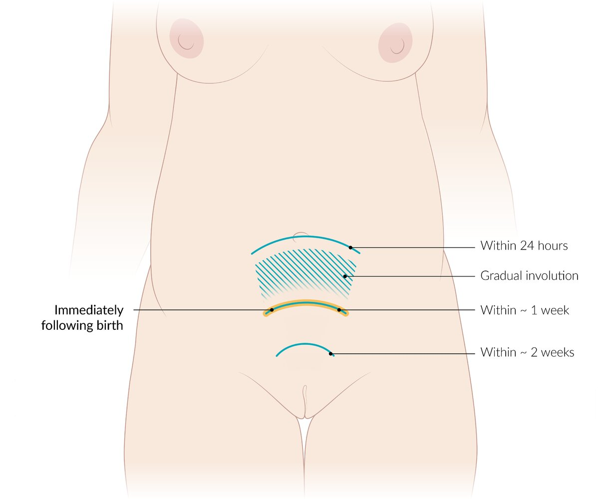

# Postpartum care

*Categories: Clinical knowledge > Obstetrics/gynecology > Puerperium > Postpartum care*

[Original Article Link](https://coursology-qbank.com/amboss/article/iO0JHT)

---

## Summary

The <u>postpartum period</u> (<u>fourth trimester</u>) is the 12 weeks after <u>childbirth</u> in which the body recovers from the changes of <u>pregnancy</u> and <u>labor</u>. During this period, individuals are at risk of a range of <u>postpartum complications</u>, affecting physical and mental health. To assist in early detection of complications and to optimize maternal and <u>infant</u> health, all individuals should have a minimum of two postpartum contacts: the first within 3 weeks and a <u>comprehensive postpartum visit</u> at 4–12 weeks. The <u>comprehensive postpartum visit</u> consists of a detailed physical, social, and psychological evaluation to monitor for <u>postpartum complications</u>, manage chronic conditions, and assist with care of the <u>newborn</u>. Patients with preexisting medical conditions, complex <u>pregnancies</u>, or poor social support may require more frequent care during and beyond the <u>postpartum period</u>.

For management of the <u>newborn</u> after <u>birth</u>, see “<u>The newborn infant</u>,” “<u>Infant nutrition and breastfeeding</u>,” and “<u>Well-child visits</u>.”

See also “<u>Postpartum complications</u>.”

---

## Normal postpartum changes

Low‑grade <u>fever</u>, shivering, and <u>leukocytosis</u> are common findings during the first 24 hours postpartum and do not necessarily indicate an infection.

### Uterine involution

* Begins immediately after <u>birth</u> and the delivery of the <u>placenta</u>

* Afterpains: painful cramps from contractions of the <u>uterus</u> following <u>childbirth</u>

* The <u>uterus</u> returns to its normal size by the 6th–8th week postpartum.

Uterine involution

### Lochia (postpartum <u>vaginal discharge</u>)

* Definition

* <u>The birthing process</u> and <u>placental</u> detachment lead to uterine lesions, which discharge a special secretion when healing.

* This secretion, together with the cervical mucus and other components, forms the <u>lochia</u>.

* Most women pass <u>lochia</u> for about 4 weeks after delivery; in some cases, this lasts for 6–8 weeks.

* <u>Lochia</u> rubra: blood red; approx. the first 4 days after <u>birth</u>

* <u>Lochia</u> serosa: brown red; watery consistency, lasts approx. 2–3 weeks

* <u>Lochia</u> alba: yellow white; lasts approx. 1–2 weeks

| Time | Fundal height postpartum | <u>Lochia</u> |
| --- | --- | --- |
| Right after <u>birth</u>  | Between the <u>navel</u> and <u>symphysis</u>  | Blood red |
| After the 1stday |  <u>Navel</u>   | Blood red |
| 3rd day | 3 fingerbreadths under the <u>navel</u> (descends 1 fingerbreadth per day) | Blood red to brown-red  |
| 7th day | Between the <u>navel</u> and <u>symphysis</u>  | Brown-red |
| 10th day | <u>Symphysis</u> | Brown-red |
| 12th–14th day | <u>Symphysis</u> | Yellowish |
| 17th–21stday | <u>Symphysis</u> | Yellow-white |

### Weight loss

* Mean weight loss after delivery of the baby, <u>amniotic fluid</u>, and <u>placenta</u>: approx. 6 kg

* Additional weight loss due to <u>lochia</u> discharge and <u>uterine involution</u>: approx. 4.4–15.4 lb

References:[[1]](https://coursology-qbank.com/amboss/article/L6awll)[[2]](https://coursology-qbank.com/amboss/article/o6a0Nl)[[3]](https://coursology-qbank.com/amboss/article/K6aUNl)[[4]](https://coursology-qbank.com/amboss/article/lEavDm)[[5]](https://coursology-qbank.com/amboss/article/S_aynM)

---