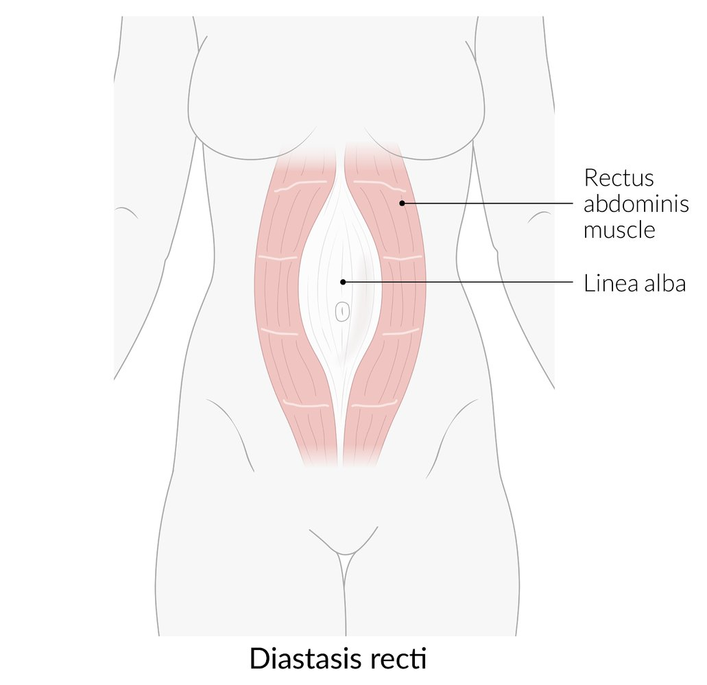

# Postpartum complications

*Categories: Clinical knowledge > Obstetrics/gynecology > Puerperium > Postpartum complications*

[Original Article Link](https://coursology-qbank.com/amboss/article/RE0lv3)

---

## Summary

Postpartum complications include infectious, vascular, genitourinary, musculoskeletal, and behavioral conditions. Infectious complications include <u>postpartum endometritis</u>, <u>postpartum sepsis</u>, <u>mastitis</u>, and wound infections. Vascular complications include <u>postpartum hemorrhage</u>, <u>venous thromboembolism</u>, <u>amniotic fluid embolism</u>, and <u>thrombophlebitis</u>. Genitourinary complications include uterine injuries and dysfunction, <u>bladder</u> dysfunction, <u>urinary tract infections</u>, and vaginal or perineal trauma. Musculoskeletal complications include <u>diastasis recti</u>, <u>pelvic</u> or <u>back pain</u>, and nerve injuries. Behavioral complications include <u>postpartum depression</u>, <u>psychosis</u>, and <u>sexual dysfunction</u>. Early recognition and treatment are crucial for maternal recovery and well-being.

See also “<u>Complications of normal labor and delivery</u>,” “<u>Abnormal labor and delivery</u>,” and "<u>Sepsis in pregnancy and postpartum</u>."

---

## Infectious

### Peripartum <u>pelvic</u> infections [[2]](https://coursology-qbank.com/amboss/article/dUdoX60)[[3]](https://coursology-qbank.com/amboss/article/VUdGX60)

#### Maternal peripartum infection [[4]](https://coursology-qbank.com/amboss/article/G6cBmW0)[[5]](https://coursology-qbank.com/amboss/article/aSdQy60)

* An infection of the genital tract and adjacent tissue occurring within 6 weeks of <u>childbirth</u>, <u>miscarriage</u>, or <u>induced abortion</u>

* Sites include:

* <u>Postpartum endometritis</u>

* <u>Surgical site infection</u> (e.g., from <u>cesarean delivery</u> or <u>episiotomy</u>)

* Wound infection or <u>SSTI</u> from <u>vaginal injuries</u> or <u>perineal lacerations</u>

* <u>Pelvic</u> <u>intraabdominal abscess</u>

* <u>Peritonitis</u>

* Presence of ≥ 2 of the following is necessary for diagnosis: [[4]](https://coursology-qbank.com/amboss/article/G6cBmW0)

* <u>Fever</u>

* <u>Pelvic pain</u>

* Abnormal <u>vaginal discharge</u>

* Delay in <u>uterine involution</u>

* Complications: <u>postpartum sepsis</u>

> [!TIP]
> <u>Maternal peripartum infection</u> is the most common cause of <u>postpartum sepsis</u>. [[3]](https://coursology-qbank.com/amboss/article/VUdGX60)

### Postpartum endometritis [[6]](https://coursology-qbank.com/amboss/article/cUdaX60)[[7]](https://coursology-qbank.com/amboss/article/AN1Rdh0)

#### Background

* Definition: inflammation of the <u>endometrium</u>; may include the <u>myometrium</u> (<u>postpartum endomyometritis</u>), <u>parametrium</u> (postpartum <u>parametritis</u>), and/or surgical site

* <u>Risk factors</u>

* <u>Cesarean delivery</u>  [[6]](https://coursology-qbank.com/amboss/article/cUdaX60)

* <u>Prolonged labor</u>

* <u>Prolonged rupture of membranes</u>

* Multiple cervical examinations

* <u>RPOC</u>

* <u>Meconium</u> in <u>amniotic fluid</u> [[8]](https://coursology-qbank.com/amboss/article/1Ud2X60)

* Low <u>socioeconomic status</u>

* Etiology: mostly polymicrobial (2–3 ascending organisms, e.g., <u>Gardnerella vaginalis</u>, <u>Staphylococcus epidermidis</u>, <u>Group B Streptococcus</u>, <u>Escherichia coli</u>, and/or <u>Ureaplasma urealyticum</u>, all of which are usually found in the <u>normal vaginal flora</u>)  [[9]](https://coursology-qbank.com/amboss/article/m5WVkN0)

* Pathophysiology: retention of <u>lochia</u> → ideal breeding ground for infection → <u>postpartum endometritis</u>/<u>postpartum endomyometritis</u> → <u>postpartum sepsis</u>

#### Clinical features of postpartum endometritis

* <u>Fever</u>

* Lower abdominal <u>pain</u>, uterine tenderness

* Chills, <u>malaise</u>

* Foul-smelling <u>lochia</u>

#### Diagnostics

Primarily <u>clinical diagnosis</u>; studies help guide management

* <u>Pelvic examination</u>: Check for <u>RPOC</u> and <u>surgical site infection</u>.

* Vaginal cultures: Obtain if <u>vaginal discharge</u> is <u>purulent</u>; otherwise utility is limited due to contamination.

* <u>Blood cultures</u>: Obtain if <u>signs of sepsis</u> are present.

* <u>STI screening</u>: Consider if not performed during <u>routine prenatal care</u>.

* Imaging (<u>ultrasound</u> and/or CT) [[6]](https://coursology-qbank.com/amboss/article/cUdaX60)

* Useful for ruling out complications (e.g., <u>abscess</u>) and differential diagnoses (e.g., <u>appendicitis</u>)

* Consider for patients with:

* <u>Signs of sepsis</u> or <u>peritoneal signs</u>

* <u>Endometritis</u> after <u>cesarean delivery</u>

#### Treatment [[10]](https://coursology-qbank.com/amboss/article/eUdxX60)

* All patients: empiric IV <u>antibiotics</u>

* First line: <u>clindamycin</u>  DOSAGE PLUS <u>gentamicin</u> (<u>off-label</u>) DOSAGE [[6]](https://coursology-qbank.com/amboss/article/cUdaX60)

* Second line

* <u>Cefoxitin</u> DOSAGE OR <u>cefotaxime</u> DOSAGE [[6]](https://coursology-qbank.com/amboss/article/cUdaX60)

* PLUS <u>vancomycin</u> (<u>off-label</u>) DOSAGE [[6]](https://coursology-qbank.com/amboss/article/cUdaX60)

* Patients with <u>RPOC</u>: <u>curettage</u> to prevent <u>puerperal sepsis</u>

> [!WARNING]
> Treat <u>puerperal sepsis</u>, if present.

#### Disposition

* Consult obstetrics.

* Hospital admission is usually required.  [[6]](https://coursology-qbank.com/amboss/article/cUdaX60)

#### Complications

* <u>Peritonitis</u>

* <u>Intraabdominal abscess</u>

### Other peripartum infections

* <u>Mastitis</u>

* <u>Urinary tract infections</u>

* <u>Surgical site infections</u>

* Other <u>skin and soft tissue infections</u>

* <u>Aspiration pneumonia</u>

---

## Vascular

### Bleeding

* <u>Postpartum hemorrhage</u>

* <u>Postpartum retroperitoneal hematoma</u>

### Thromboembolic complications

* <u>Deep vein thrombosis</u>

* <u>Pulmonary embolism</u>

* <u>Cerebral venous thrombosis</u>

* <u>Nonthrombotic embolism</u>: <u>amniotic fluid embolism</u>

#### Septic pelvic thrombophlebitis [[11]](https://coursology-qbank.com/amboss/article/h_acLM)[[12]](https://coursology-qbank.com/amboss/article/3_aSLM)[[13]](https://coursology-qbank.com/amboss/article/6KYjhJ)

* Definition: : a rare condition characterized by inflammation and <u>thrombosis</u> of the <u>pelvic</u> <u>veins</u> that most commonly occurs in the <u>postpartum period</u>

* <u>Risk factors</u>

* <u>Cesarean deliveries</u>

* <u>Pelvic</u> infections (e.g., <u>endometritis</u>, <u>chorioamnionitis</u>)

* Abortion

* Etiology

* <u>Pregnancy</u>-induced <u>hypercoagulability</u>

* Postpartum <u>pelvic</u> <u>venous stasis</u>

* <u>Endothelial</u> damage due to an infection (e.g., <u>endometritis</u>) or <u>bacteremia</u>

* Clinical features: Onset is usually within one week of delivery.

* Patients are acutely unwell with <u>fever</u> and abdominal <u>pain</u> and tenderness on the side of the affected <u>vein</u>; a palpable cord may be present.

* Approx. 90% of cases involve the right <u>ovarian vein</u>.

* Diagnostics

* Contrast CT or <u>MRI</u>

* Visualization of dilation and <u>thrombosis</u> of the affected <u>vein</u> confirms the diagnosis.

* Most commonly ovarian vein thrombosis

* <u>Blood culture</u>: most commonly <u>streptococci</u>, <u>Enterobacteriaceae</u>, and <u>anaerobes</u>

* Treatment: <u>antibiotics</u> (e.g., <u>clindamycin</u>, <u>gentamicin</u>) and anticoagulation (e.g., <u>LMWH</u> or <u>UFH</u>)

* Complications: <u>Pulmonary emboli</u> are rare.

---

## Genitourinary

### Uterine

* <u>Subinvolution of the uterus</u>

* Impaired <u>retraction</u> of the uterine muscles

* Can cause severe bleeding

* <u>Retained placenta</u>

* <u>Uterine rupture</u>

* <u>Uterine inversion</u>

* <u>Uterine prolapse</u>

### Urinary

* Urinary insufficiency: See “<u>Urinary incontinence in pregnancy</u>”

* <u>Bladder</u> dysfunction: e.g., <u>overactive bladder</u>

* <u>Urethral injury</u>

#### Postpartum urinary retention (PUR) [[14]](https://coursology-qbank.com/amboss/article/JL1sAh0)[[15]](https://coursology-qbank.com/amboss/article/qL1CAh0)

* Definition: inability to void after delivery

* Overt PUR: inability to void 6 hours after vaginal delivery or, in case of <u>cesarean section</u>, 6 hours after removal of urinary catheter

* Covert PUR: post-void residual <u>bladder</u> volume ≥ 150 mL following <u>micturition</u> (assessed by <u>ultrasound</u> or catheterization)

* <u>Risk factors</u> [[16]](https://coursology-qbank.com/amboss/article/pL1LAh0)

* <u>Prolonged labor</u>

* <u>Perineal lacerations</u>

* <u>Macrosomia</u>

* Clinical features

* Potentially asymptomatic

* <u>Bladder</u> <u>pain</u>/discomfort

* <u>Bladder</u> distention

* Small void volumes

* Straining to void

* Slow stream

* <u>Urinary frequency</u>

* Treatment
* <u>Intermittent catheterization</u> in symptomatic patients

* Prognosis: typically <u>self-limited</u> (resolves within 1 week)

### Vaginal and perineal

* <u>Vaginal injury</u>

* <u>Perineal laceration</u>

* <u>Rectovaginal fistula</u>

* <u>Dyspareunia</u>

---

## Musculoskeletal

### Diastasis recti

* Definition: a > 2 cm separation of the right and left <u>rectus abdominis muscles</u> resulting in protrusion of abdominal organs on straining

* <u>Risk factors</u>

* Conditions that increase <u>intraabdominal pressure</u> (e.g., <u>pregnancy</u>, abdominal <u>surgery</u>)

* <u>Aneurysmal</u> disease

* Clinical features

* Some patients may be asymptomatic.

* Abdominal <u>pain</u> and discomfort

* <u>Pelvic instability</u> and lumbar <u>pain</u>

* Urinary and/or <u>fecal incontinence</u>

* Diagnostics

* <u>Physical examination</u>: distortion or extension of the <u>linea alba</u>

* <u>Ultrasound</u>: confirms the diagnosis

* Treatment

* Postpartum exercise: Initiating an exercise program 6–8 weeks postpartum can help strengthen the abdominal rectus muscles and reduce the abnormal extension of the <u>linea alba</u>.

* Weight loss: may be appropriate in patients who develop <u>diastasis recti</u> due to <u>obesity</u>.

* Surgical repair (e.g., <u>abdominoplasty</u>)

* Patients with severe, recurring, and symptomatic <u>diastasis recti</u>

* If <u>conservative treatment</u> fails after > 6 months

* Complications: <u>pelvic organ prolapse</u>

Diastasis recti

### Pubic symphysis diastasis [[17]](https://coursology-qbank.com/amboss/article/061ej30)

* Definition: a rare complication of the peripartum period characterized by a widening of the <u>pubic symphysis</u> beyond the physiological width (≤ 10 mm).

* <u>Risk factors</u> include:

* <u>Macrosomia</u>

* <u>Cephalopelvic disproportion</u>

* <u>Prolonged second stage of labor</u>

* Previous <u>pelvic</u> trauma

* <u>Forceps delivery</u>

* Clinical features

* Potentially asymptomatic

* <u>Pain</u> and tenderness of the <u>pubic symphysis</u>

* Worsens with walking, climbing stairs, lifting heavy objects, and standing on one leg

* May radiate to the sacroiliac area and <u>anterior</u> and/or <u>lateral</u> part of the thigh

* Destot sign: <u>labia majora</u> <u>hematoma</u>

* Diagnostics

* <u>Ultrasound</u> and <u>MRI</u> are preferred during <u>pregnancy</u>.

* <u>Pelvic</u> <u>x-ray</u> and <u>CT scan</u> may be used after <u>childbirth</u>.

* Treatment

* Conservative: <u>analgesia</u>, <u>pelvic</u> belt, and <u>physiotherapy</u>

* <u>Surgery</u> should be considered if <u>conservative therapy</u> fails: <u>open reduction</u> with <u>internal fixation</u>

### Other <u>MSK</u> complications

* <u>Back pain</u>

* <u>Pelvic pain</u>

* <u>Obstetric nerve injuries</u>

* <u>Coccydynia</u>

* <u>Pelvic floor dysfunction</u>

---

## Behavioral

### Postpartum <u>sexual dysfunction</u>

* Definition: the decline of sexual function after delivery that may not return to its baseline levels during the <u>postpartum period</u>

* <u>Risk factors</u>

* Prepregnancy <u>dyspareunia</u>

* Delivery mode (e.g., vacuum-assisted vaginal delivery, emergency <u>cesarean delivery</u>)

* Perineal trauma (e.g., second and third-degree <u>perineal tears</u>)

* <u>Episiotomy</u>

* <u>Breastfeeding</u> (associated with decreasing vaginal lubrication, causing vaginal <u>atrophy</u> and loss of interest in <u>sexual activity</u>)

* Postpartum physiological and psychological changes (e.g., postpartum mood changes, <u>postpartum depression</u>, fatigue)

* <u>Childbirth</u> complications (e.g., postpartum genital infections, <u>postpartum hemorrhage</u>, <u>obstructed labor</u>)

### Psychiatric

* <u>Postpartum depression</u>

* <u>Postpartum psychosis</u>

---