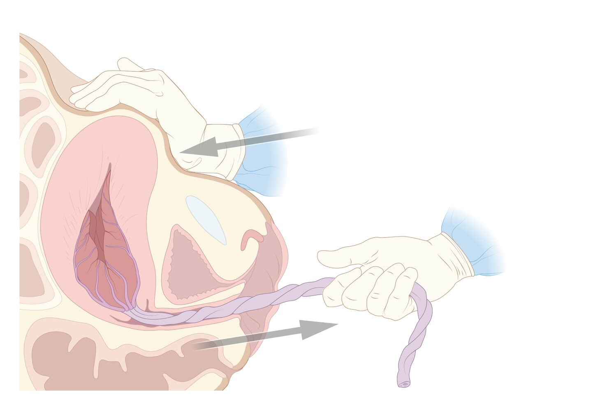
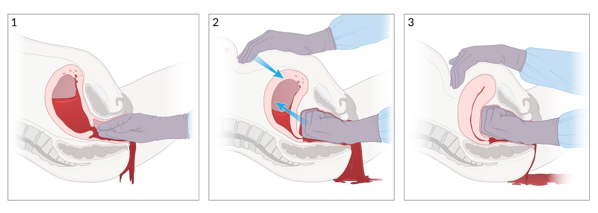
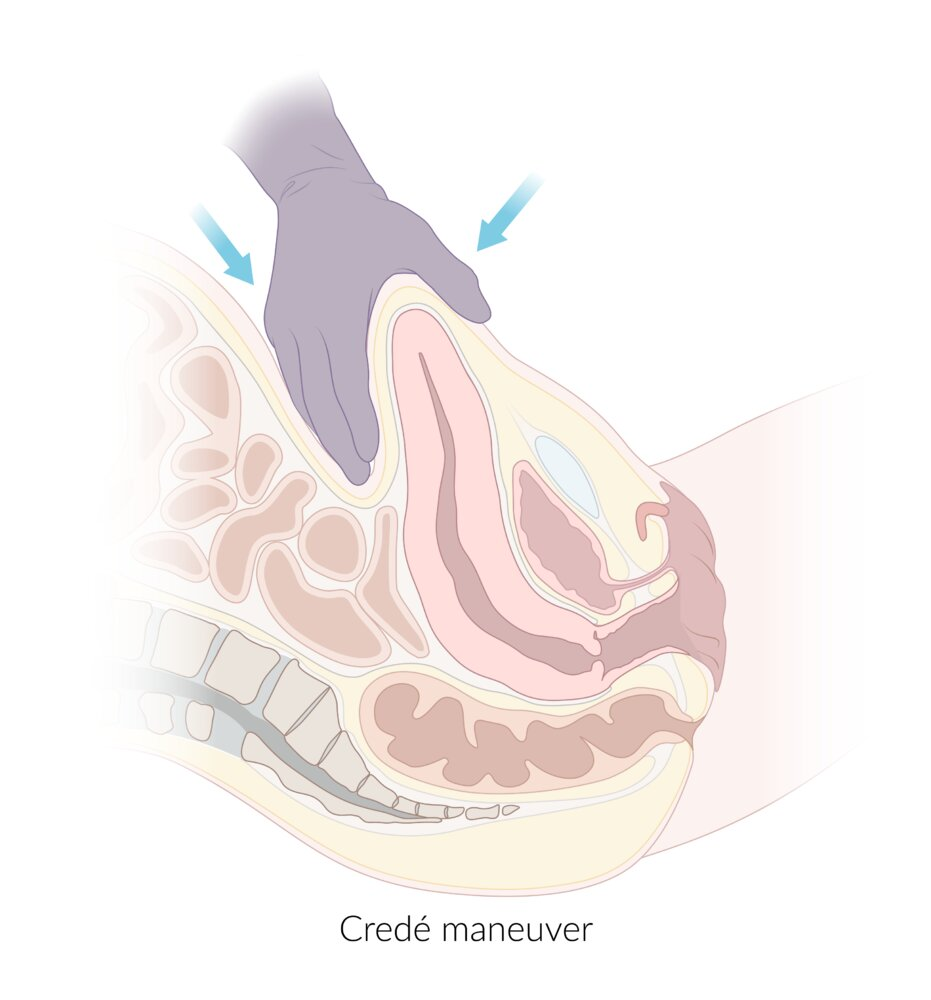
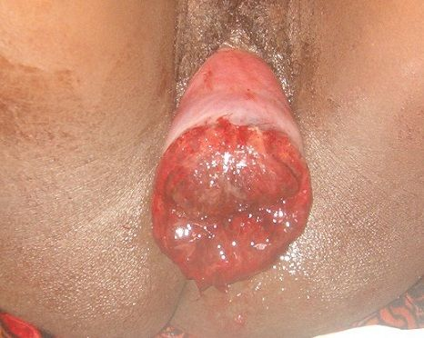
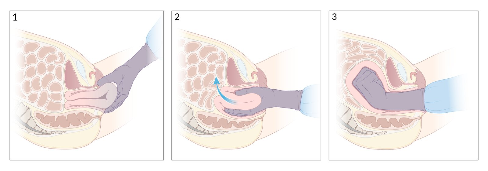
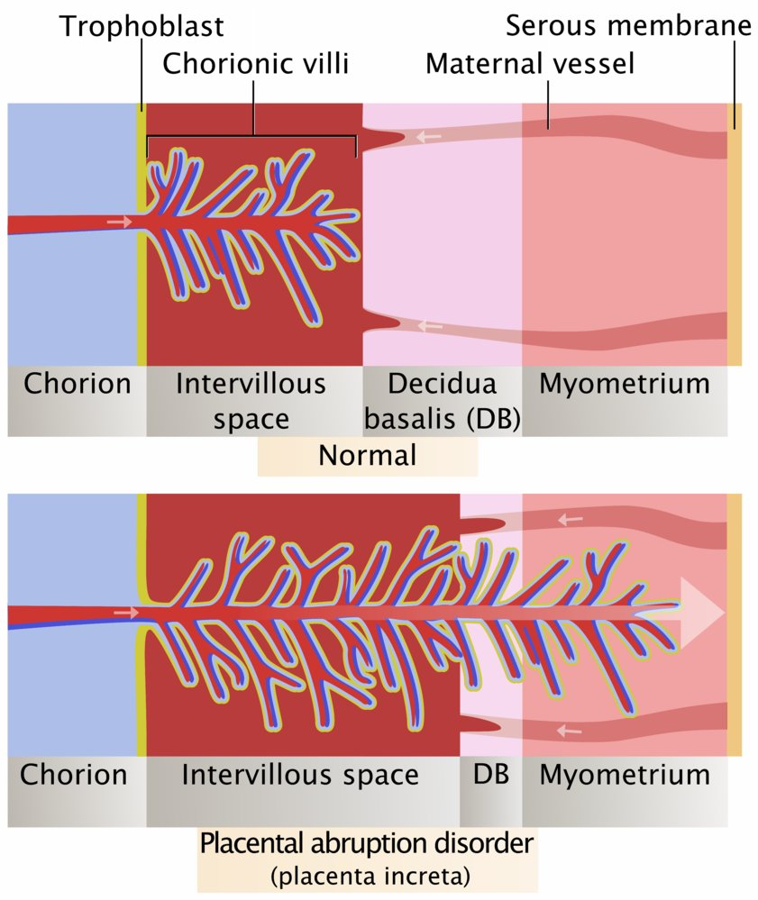
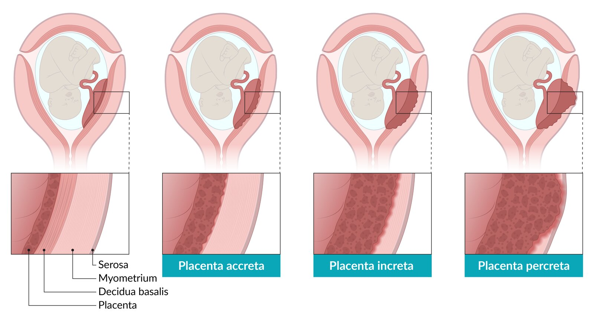
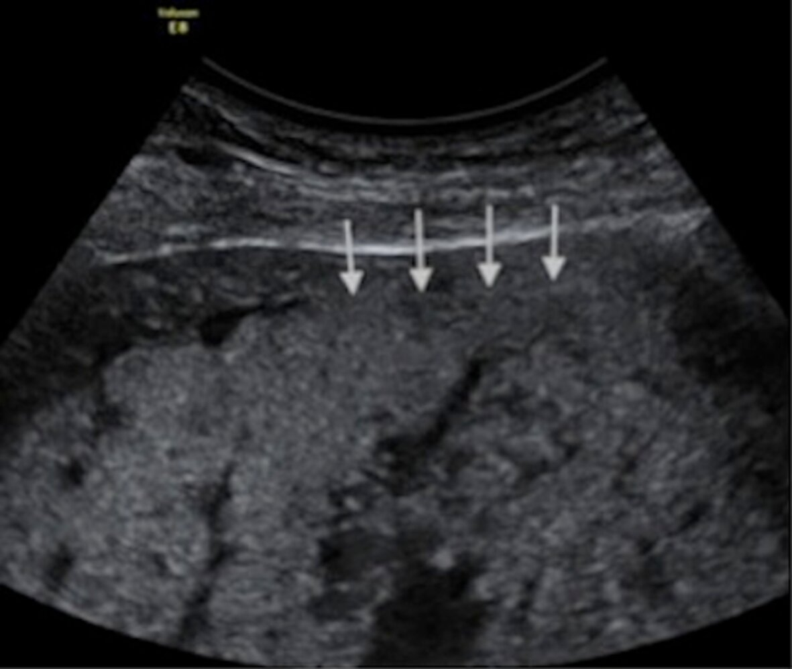
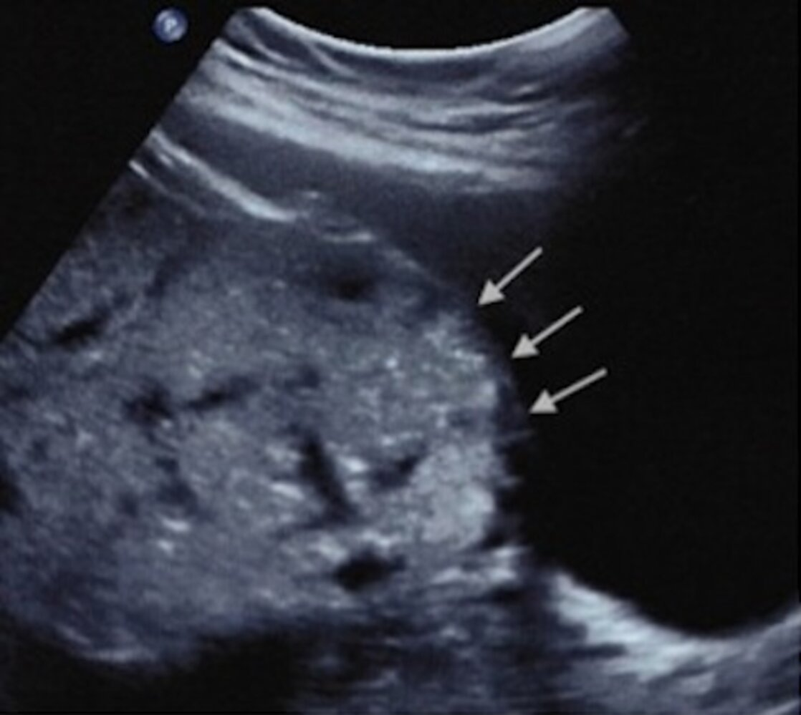
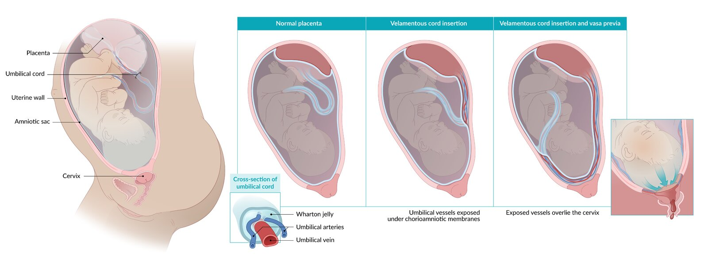

# Postpartum hemorrhage

*Categories: Clinical knowledge > Obstetrics/gynecology > Puerperium > Postpartum hemorrhage*

[Original Article Link](https://coursology-qbank.com/amboss/article/mM0V6g)

---

## Summary

Postpartum hemorrhage (PPH) is an obstetric emergency and is defined as a blood loss ≥ 1000 mL or blood loss presenting with signs or symptoms of <u>hypovolemia</u> within 24 hours of delivery. It is the number one cause of maternal <u>morbidity</u> and mortality worldwide. PPH is generally associated with symptoms of <u>hypovolemia</u>. The onset may be within 24 hours (primary PPH) to 12 weeks postpartum (secondary PPH). The most significant causes of postpartum hemorrhage are <u>uterine atony</u>, maternal <u>birth trauma</u>, <u>abnormal placental separation</u>, <u>velamentous cord insertion</u>, and <u>coagulation disorders</u>. Clinical findings are related to the amount of blood loss and can include <u>anemia</u> (e.g., <u>lightheadedness</u>, <u>pallor</u>) or <u>hypovolemic shock</u> (e.g., <u>hypotension</u>, <u>tachycardia</u>). Diagnosis is done through early recognition of clinical findings, systematic evaluation of the most common causes, and, in some cases, confirmed with <u>ultrasound</u>. Treatment depends on the underlying condition and may include general measures to control blood loss and maintain adequate <u>perfusion</u> to vital organs, <u>suturing</u> of bleeding <u>lacerations</u>, <u>active management of the third stage of labor</u> like manual maneuvers to aid in <u>placental</u> separation, and use of <u>uterotonic agents</u> for <u>uterine atony</u>. A <u>hysterectomy</u> is often considered as a last resort in uncontrolled postpartum hemorrhage.

---

## Overview

### Definitions [[1]](https://coursology-qbank.com/amboss/article/bobH0u)

Blood loss ≥ 1000 mL or blood loss manifesting with features of <u>hypovolemia</u> within 24 hours of delivery.

* Primary PPH: blood loss ≤ 24 hours postpartum (more common)

* Secondary PPH: blood loss from 24 hours to 12 weeks postpartum

### <u>Epidemiology</u> [[1]](https://coursology-qbank.com/amboss/article/bobH0u)[[2]](https://coursology-qbank.com/amboss/article/ZpaZLl)

* Leading cause of <u>maternal mortality</u> worldwide

* Approx. 5% of obstetric patients experience PPH.

* PPH causes 12% of maternal deaths in the US.

### Etiology [[1]](https://coursology-qbank.com/amboss/article/bobH0u)

| Overview of common causes of postpartum hemorrhage |  |  |  |  |  |
| --- | --- | --- | --- | --- | --- |
|  |  | <u>Risk factors</u>/Etiology | Clinical features | Diagnostics | Treatment |
| Primary PPH |  |  |  |  |  |
| <u>Uterine atony</u> |  |   * Overdistention of the <u>uterus</u> (e.g., <u>multiple pregnancies</u>)  * Exhausted <u>myometrium</u> (e.g., prolonged <u>oxytocin</u> use)  * Anatomical abnormalities (e.g., <u>uterine leiomyomas</u>)  * Infection (e.g., <u>chorioamnionitis</u>)  * Medications lowering contractions (e.g., <u>anesthetics</u>, <u>MgSO4</u>)  * Other (e.g., <u>preterm delivery</u>, maternal <u>BMI</u> > 40 kg/m2)    |   * Profuse <u>vaginal bleeding</u>  * Soft, enlarged, boggy ascending <u>uterus</u>    |  * <u>Bimanual pelvic examination</u>   |   * <u>Active management of the third stage of labor</u> (see “Prevention” below)  * <u>Uterotonic agents</u> (e.g., IV <u>oxytocin</u>)  * Surgical procedures (uterine <u>balloon tamponade</u> or packing)    |
| <u>Uterine inversion</u> |  |   * Uncontrolled <u>cord traction</u> and/or excessive fundal pressure during the third stage of <u>labor</u>  * <u>Fetal macrosomia</u>  * Previous <u>uterine inversion</u>    |   * Brisk postpartum hemorrhage  * Lower abdominal <u>pain</u>  * Round mass (inverted <u>uterus</u>) protruding from the <u>cervix</u> or <u>vagina</u>  * Absent fundus (top of the <u>uterus</u>) at the periumbilical position during transabdominal palpation    |   * Based on clinical features  * <u>Ultrasound</u> (confirms diagnosis in uncertain cases)    |  * General measures (e.g., monitor <u>vital signs</u>, <u>fluid therapy</u>) and immediate manual uterine <u>reposition</u>   |
| <u>Abnormal placental separation</u> | <u>Retained placenta</u> |   * Prior history of <u>retained placenta</u> (most common)  * <u>Placenta previa</u>  * <u>Placenta accreta spectrum</u>    |   * Severe bleeding before <u>placental</u> delivery  * Inability to completely separate the <u>placenta</u> during the third stage of <u>labor</u>    |   * Postpartum manual palpation and speculum inspection of the <u>placenta</u> and fetal membranes  * <u>Ultrasound</u>: shows a focal <u>endometrial</u> mass    |   * General measures (e.g., monitor <u>vital signs</u>)  * <u>Active management of the third stage of labor</u>  * Manual removal of <u>placenta</u>  * Surgical (when manual extraction fails)    |
| <u>Abnormal placentation</u> |   * History of uterine <u>surgery</u> (e.g., <u>curettage</u>)  * Prior births by <u>cesarean delivery</u>  * <u>Placenta previa</u> generally manifests with <u>placenta accreta</u>.  * <u>Multiparity</u>  * <u>Advanced maternal age</u>    |   * <u>Abnormal uterine bleeding</u>  * Postpartum hemorrhage at the time of attempted manual separation of the <u>placenta</u>    |   * Based on clinical features  * <u>Ultrasound</u>  * Thinning of uterine myometrial wall  * Irregularly shaped, (moth-eaten) <u>placental</u> lacunae  * Disruption of the junction between the <u>bladder</u> wall and uterine serosa  * Loss of clear space behind the <u>placenta</u>  * <u>Doppler ultrasonography</u> (confirmatory imaging)    |   * General measures (e.g., monitor <u>vital signs</u>)  * <u>Active management of the third stage of labor</u>  * Surgical procedures  * <u>Dilation and curettage</u> (D&C) or vacuum removal of <u>RPOC</u> under anesthesia/<u>regional anesthesia</u>  * Cesarean <u>hysterectomy</u> (generally, mode of delivery and treatment for <u>placenta accreta spectrum</u>)    |  |
| <u>Birth trauma</u> |  |   * <u>Iatrogenic</u> injury  * Cervical <u>laceration</u> (most commonly caused by forceps use)  * Lower <u>vaginal trauma</u> (most commonly due to <u>episiotomy</u>)  * <u>Puerperal hematoma</u> (most commonly caused by uncontrolled or <u>assisted vaginal delivery</u>)  * <u>Uterine rupture</u>  * Other (<u>fetal macrosomia</u>, <u>malpresentation of the fetus</u>)    |   * Features of <u>hematoma</u> or bleeding <u>laceration</u> of the female genital tract (e.g., labial or rectal <u>pain</u>, <u>signs of hypovolemia</u>, vaginal mass)  * Features of <u>retroperitoneal hematoma</u> (e.g., <u>pelvic pain</u>, <u>signs of hypovolemia</u>)  * Features of <u>uterine rupture</u>    |  * Based on clinical features   |   * Following vaginal delivery  * Supportive measures (e.g., fundal massage, <u>fluid therapy</u>, <u>uterotonic agents</u>)  * Immediate repair of visible bleeding <u>lacerations</u>  * Hemodynamically stable patient: <u>arterial embolization</u>  * <u>Hemodynamically unstable</u> patient  * <u>Incision and drainage</u> of <u>hematoma</u>  * If the cause of bleeding is not identified: immediate <u>laparotomy</u>  * Following <u>cesarean delivery</u>  * Supportive measures  * <u>Uterine artery ligation</u>    |
| <u>Velamentous cord insertion</u> |  |   * <u>Placenta previa</u>  * <u>Low-lying placenta</u>  * <u>Multiple pregnancies</u>  * Assisted reproduction procedures (e.g., <u>in vitro fertilization</u>)    |   * Increased risk of hemorrhage during the third stage of <u>labor</u>  * Possible painless <u>vaginal bleeding</u>  * Features of fetal <u>hypoxia</u>, especially following <u>rupture of membranes</u> (<u>ROM</u>)    |   * Transabdominal <u>ultrasound</u>  * Vessels pass over the internal <u>cervical os</u>  * <u>Umbilical cord</u> membranes are continuous with the <u>chorionic plate</u>)  * Transvaginal color <u>doppler ultrasound</u>: to rule out <u>vasa previa</u>  * <u>Intrapartum</u> <u>clinical examination</u>: based on clinical features    |   * If diagnosed prenatally  * Regular fetal assessment (e.g., fetal growth)  * Deliver ≤ 40 weeks <u>gestation</u>  * If diagnosed <u>intrapartum</u>  * Vaginal delivery if there are no signs of <u>fetal distress</u>  * Emergency <u>cesarean delivery</u> if:  * Signs of <u>fetal distress</u>  * PPH  * <u>Vasa previa</u>    |
| Secondary PPH |  |  |  |  |  |
| <u>Retained products of conception</u> |  |   * <u>Placenta accreta</u>  * <u>Assisted vaginal delivery</u>  * <u>Preterm birth</u>  * <u>Multiple gestation</u>  * <u>Retained placenta</u>    |   * <u>Abnormal uterine bleeding</u>  * <u>Fever</u>  * Lower abdominal <u>pain</u>  * <u>Amenorrhea</u>    |   * <u>Ultrasound</u>: thickening of <u>endometrial</u> echogenic complex or focal <u>endometrial</u> mass [[3]](https://coursology-qbank.com/amboss/article/c61aP30)  * <u>Color Doppler ultrasound</u> (key finding): vascularity of <u>endometrial</u> echogenic material (key finding) or <u>endometrial</u> mass [[3]](https://coursology-qbank.com/amboss/article/c61aP30)    |   * <u>Uterotonic agents</u> (e.g., <u>prostaglandin E1</u> analogs)  * Surgical procedure  * <u>Dilation and curettage</u> or  * Hysteroscopic removal    |
| <u>Subinvolution of the placental site</u> |  |   * <u>Multiparity</u>  * <u>Cesarean delivery</u>  * <u>Uterine atony</u>  * <u>Endometritis</u>  * <u>Coagulopathy</u>  * <u>Retained products of conception</u>    |   * <u>Abnormal uterine bleeding</u>  * <u>Fever</u>  * Lower abdominal <u>pain</u>    |   * <u>Ultrasound</u>: <u>hypoechoic</u> <u>tortuous</u> vessels in <u>myometrium</u>  * <u>Pulse wave Doppler</u>: ↑ peak systolic <u>velocity</u>  * Histopathological examination (<u>confirmatory test</u>): large, dilated myometrial <u>arteries</u> with thickened walls and <u>intravascular</u> <u>thrombosis</u> [[4]](https://coursology-qbank.com/amboss/article/o610N30)    |   * <u>Uterotonic agents</u> (e.g., IV <u>oxytocin</u>)  * Surgical procedures  * <u>Dilation and curettage</u> (D&C) or vacuum removal  * <u>Uterine artery embolization</u>  * <u>Hysterectomy</u> for patients with severe bleeding    |
| <u>Coagulation disorder</u> | Acquired |   * <u>HELLP syndrome</u>  * <u>Sepsis</u>  * Fetal <u>death</u>    |   * <u>Fever</u>  * <u>Sepsis</u>  * Mucocutaneous bleeding (e.g., <u>bruising</u>, <u>petechiae</u>)  * <u>GI bleeding</u>, <u>menorrhagia</u>    |   * Based on clinical features and <u>laboratory studies</u>  * <u>CBC</u>, <u>coagulation panel</u> including <u>PT</u>, <u>aPTT</u>, <u>fibrinogen</u>, <u>D-dimer</u> and other <u>FDPs</u>  * <u>vWF</u> <u>antigen</u>, <u>vWF</u> activity  * See “<u>Diagnostic workup of bleeding disorders</u>” for details.    |   * <u>Transfusion</u> of <u>blood products</u> as needed (e.g., <u>FFP</u>, <u>platelets</u>)  * Replacement of specific <u>coagulation factors</u> (e.g. XI for <u>hemophilia</u>)  * Concentrates containing <u>vWF</u> and <u>factor VIII</u> (for <u>vWD</u>)  * Pharmacological therapy (e.g., <u>desmopressin</u>, <u>antifibrinolytics</u>)  * See “<u>Treatment of hemophilia</u>” and “<u>Treatment of von Willebrand disease</u>” for more information.    |
|  Inherited [[5]](https://coursology-qbank.com/amboss/article/Ko1U130)  |   * <u>von Willebrand disease</u>  * <u>Hemophilia</u>  * <u>Platelet dysfunction</u> disorders  * <u>Coagulation factor</u> deficiencies (e.g., <u>factor XIII</u> deficiency)    |  |  |  |  |
| <u>Postpartum endometritis</u> |  |   * <u>Cesarean delivery</u>  * Premature and <u>prolonged rupture of membranes</u>  * <u>Prolonged labor</u>  * Multiple cervical examinations  * <u>Retained products of conception</u>  * <u>Meconium</u> in <u>amniotic fluid</u>  * Low <u>socioeconomic status</u>    |   * <u>Fever</u>, chills, <u>malaise</u>  * Lower abdominal <u>pain</u>, uterine tenderness  * Foul-smelling <u>lochia</u>    |   * Based on clinical features and blood and <u>urine cultures</u>  * <u>Gram stain</u> or <u>wet mount</u> of <u>vaginal discharge</u>    |   * <u>Antibiotic</u> treatment: IV <u>clindamycin</u> and <u>gentamicin</u>  * <u>Uterine curettage</u> to remove <u>retained products of conception</u>.  * <u>Hysterectomy</u> if there are life-threatening complications or if there is no improvement with <u>conservative treatment</u>  * See “<u>Postpartum endometritis</u>” for more information.    |

> [!NOTE]
> The causes of postpartum hemorrhage are the 4 T's: Tone (<u>uterine atony</u>), Trauma (e.g., <u>laceration</u>, <u>uterine inversion</u>), Tissue (<u>retained placenta</u>), Thrombin (<u>bleeding diathesis</u>).

### Clinical features

* Rapid, heavy <u>vaginal bleeding</u>

* Possible <u>signs of hypovolemia</u>/blood loss: decreased blood pressure, increased <u>heart rate</u>, <u>dizziness</u>

### Diagnosis

* Laboratory measures: e.g., <u>hematocrit</u>, <u>hemoglobin</u> to estimate blood loss

* <u>Physical examination</u> findings: e.g., <u>lacerations</u>, <u>hematoma</u>, any other visible cause of bleeding, boggy <u>uterus</u>

* <u>Speculum examination</u>:

* <u>Uterine inversion</u>

* Retained <u>placental</u> tissue or membranes

* <u>Puerperal hematoma</u>

* <u>Ultrasound</u>

* Used to determine the <u>correlation</u> between the <u>placenta</u> and the <u>cervical os</u>

* Helpful to diagnose the following:

* <u>Uterine atony</u>: showing, e.g., an echogenic <u>endometrial stripe</u>

* Abnormal <u>placental</u> attachment: showing, e.g., thinning of uterine myometrial wall

* <u>Color Doppler ultrasound</u>: to confirm abnormal <u>placental</u> attachment (showing, e.g., <u>turbulent blood flow</u>)

### Management of PPH

* General measures: to control blood loss and ensure <u>perfusion</u> of vital organs

* Monitoring of <u>vital signs</u> and urine output

* Oxygenation

* Two large-bore <u>IV access</u> (≥ 16 gauge) and ice pack

* <u>Fluid therapy</u> (with intravenous <u>crystalloid solutions</u>)

* <u>Blood transfusions</u>;  (whole blood or <u>red blood cell</u> concentrates) and/or <u>platelet transfusions</u>, if necessary

* Surgical procedures: in cases of uncontrolled bleeding

* Ligation of uterine or <u>internal iliac arteries</u>, or <u>uterine artery embolization</u>

* Decreases bleeding by reducing myometrial <u>perfusion</u>

* <u>Fertility</u> remains intact because of collateral blood supply by the <u>ovarian arteries</u>.

* Uterine <u>suturing</u> (e.g., <u>B-Lynch suture</u>)

* <u>Hysterectomy</u>: generally as last resort, except in <u>placenta accreta spectrum</u>

### Prevention [[1]](https://coursology-qbank.com/amboss/article/bobH0u)[[6]](https://coursology-qbank.com/amboss/article/doboau)

* Antenatal assessment of <u>risk factors</u>, including:

* Identification of <u>anemia</u> and coagulopathies

* <u>Sonography</u> to identify <u>placenta accreta</u> in women with a history of <u>cesarean deliveries</u>

* Active management of the third stage of labor: delivery of the <u>placenta</u> which involves the following components

* <u>Uterotonic agents</u> (; IV/IM <u>oxytocin</u>)

* <u>Controlled umbilical cord traction</u> (Brandt-Andrews maneuver) 

* One hand is placed on the abdomen, securing the <u>uterine fundus</u> and preventing <u>uterine inversion</u>.

* The other hand applies steady downward <u>traction</u> on the <u>umbilical cord</u>.

* External compression of the <u>uterus</u> and bimanual uterine massage: a manual technique to promote uterine contractions and to tamponade the vascular sinuses in the <u>uterus</u> 

* A clenched fist is inserted into the <u>anterior</u> <u>vaginal fornix</u> and exerts pressure on the <u>anterior</u> wall of the <u>uterus</u>.

* The other hand is positioned externally and the <u>uterus</u> is massaged between the two hands.

* Fritsch maneuver

* One hand grasps the <u>labia majora</u> and presses it firmly into the <u>vulva</u>.

* Simultaneously, the second hand is positioned at the <u>posterior</u> side of the <u>uterus</u> (as in <u>Credé maneuver</u>) and is pushed distally against the other hand.

* The <u>placenta</u> is manually removed.

* Fundal massage

* Credé maneuver 

* The <u>cranial</u> part of the <u>uterus</u> is held with four fingers positioned at the <u>posterior</u> side of the <u>uterus</u> and the thumb at the <u>anterior</u> surface.

* The pressure compresses the uterine vessels and aids in the expulsion of the <u>placenta</u>.

* Avoidance of unnecessary <u>episiotomy</u> and <u>assisted vaginal delivery</u>

Controlled umbilical cord traction

Bimanual uterine massage

Credé maneuver

### Complications [[2]](https://coursology-qbank.com/amboss/article/ZpaZLl)

* <u>Anemia</u>

* <u>Hypovolemic shock</u>

* <u>Thromboembolism</u>

* <u>Sheehan syndrome</u>

* Infection

* Maternal <u>death</u>

* <u>Disseminated intravascular coagulation</u>

* Fetal <u>death</u> (due to <u>velamentous cord insertion</u>)

* <u>Abdominal compartment syndrome</u>

---

## Uterine atony

### Definition

* Failure of the <u>uterus</u> to effectively contract after complete or incomplete delivery of the <u>placenta</u>, which can lead to severe postpartum bleeding from the myometrial vessels

### <u>Epidemiology</u>

* Most common cause of PPH cases (approx. 80%)  [[1]](https://coursology-qbank.com/amboss/article/bobH0u)

### Pathophysiology

* Normally, the <u>myometrium</u> contracts and compresses the <u>spiral arteries</u>, which stops bleeding after delivery.

* Failure of the <u>myometrium</u> to effectively contract can lead to rapid and severe hemorrhage.

### <u>Risk factors</u> [[7]](https://coursology-qbank.com/amboss/article/B_azqM)

* Overdistention of the <u>uterus</u>

* <u>Large for gestational age</u> <u>newborn</u> (> 4000 g)

* <u>Multiple pregnancies</u>

* <u>Polyhydramnios</u>

* Exhausted <u>myometrium</u>

* <u>Multiparity</u>

* <u>Postterm pregnancy</u>

* Prolonged delivery

* Prolonged <u>oxytocin</u> use

* Anatomical abnormalities

* Fetal, uterine, abnormal <u>placental</u> implantation

* <u>Uterine leiomyomas</u>

* Infection: e.g., <u>chorioamnionitis</u>

* Other

* Medications lowering contractions (e.g., <u>anesthetics</u>, <u>MgSO4</u>)

* <u>Preterm delivery</u>

* Maternal <u>BMI</u> > 40 kg/m2

> [!NOTE]
> AEIOU are <u>risk factors</u> for <u>uterine atony</u>: Anatomic Abnormalities, Exhausted <u>myometrium</u>, Infections, Overdistended Uterus

### Clinical features [[1]](https://coursology-qbank.com/amboss/article/bobH0u)[[8]](https://coursology-qbank.com/amboss/article/1ob2au)

* Profuse <u>vaginal bleeding</u>

* Soft, enlarged (increased <u>fundal height</u>), boggy ascending <u>uterus</u>

### Diagnosis

* <u>Bimanual pelvic exam</u> after emptying the <u>bladder</u>

* <u>Speculum examination</u> of the <u>vagina</u> and <u>cervix</u> to evaluate possible sources of extrauterine bleeding (e.g., <u>vaginal injury</u> caused during <u>birth</u>)

### Treatment [[1]](https://coursology-qbank.com/amboss/article/bobH0u)[[2]](https://coursology-qbank.com/amboss/article/ZpaZLl)[[7]](https://coursology-qbank.com/amboss/article/B_azqM)[[8]](https://coursology-qbank.com/amboss/article/1ob2au)

* <u>Active management of the third stage of labor</u>: See “Prevention” in “Overview” section above.

* <u>Hemorrhage control</u>

* Uterotonic agents

* IV <u>oxytocin</u> (diluted in saline)

* IM <u>carboprost tromethamine</u>: if the patient does not suffer from <u>asthma</u>

* IM methylergonovine: if no <u>hypertension</u> or arterial disease is present

* <u>Ergot</u> alkaloid agent

* Increases frequency and amplitude of uterine contractions, which shortens <u>labor</u> and reduces blood loss

* Contraindications include pre-existing <u>hypertension</u> and <u>preeclampsia</u>

* <u>Prostaglandins</u> such as <u>misoprostol</u>: useful when injectable <u>uterotonic agents</u> are unavailable or contraindicated (can also be given intracavitary)

* <u>Tranexamic acid</u>

* Given concomitantly with <u>uterotonic agents</u>

* Should be administered as soon as possible after bleeding onset to stop <u>fibrinolysis</u> and reduce the likelihood of mortality

* Early clamping and cutting of the <u>umbilical cord</u>

* Exclude <u>coagulation disorders</u>: e.g., <u>disseminated intravascular coagulation</u>, <u>hyperfibrinolysis</u>

* Blood coagulation should be tested (alternatively a thrombelastogram should be performed).

* Treatment is based on the results of the <u>coagulation panel</u>.

* Substitution of deficient <u>coagulation factors</u> such as <u>FFP</u> or <u>prothrombin complex concentrate</u>

* Administration of <u>tranexamic acid</u> in <u>hyperfibrinolysis</u>

* Surgical procedures

* Uterine <u>balloon tamponade</u> or packing: if severe bleeding persists, regardless of adequate general measures

* Compression sutures (e.g., B-Lynch suture)

* Surgical ligation of uterine or <u>internal iliac arteries</u>

* Last resort: <u>hysterectomy</u>

### Complications

* <u>Anemia</u>

* <u>Hypovolemic shock</u>

* <u>Sheehan syndrome</u>

---

## Uterine inversion

### Definition

* An obstetric emergency in which the <u>uterine fundus</u> collapses into the <u>endometrial</u> cavity, resulting in a complete or partial <u>inversion of the uterus</u>, usually following vaginal delivery

### <u>Epidemiology</u>

* Uncommon complication of vaginal <u>birth</u>

* <u>Morbidity</u> and mortality may occur in ∼ 41% of cases [[9]](https://coursology-qbank.com/amboss/article/akbQmF)

### Classification [[10]](https://coursology-qbank.com/amboss/article/0kbemF)

#### Degree of <u>inversion</u>

* Partial <u>uterine inversion</u>: <u>uterine fundus</u> collapses into the <u>endometrial</u> cavity, without surpassing the <u>cervix</u>

* Complete <u>uterine inversion</u>: <u>uterine fundus</u> collapses into the <u>endometrial</u> cavity and descends through the <u>cervix</u>, but remains within the vaginal introitus

* <u>Uterine prolapse</u>: <u>uterine fundus</u> descends through the vaginal introitus

Acute uterine inversion

#### Time of onset

* Acute uterine inversion: <u>uterine inversion</u> occurring immediately after or within 24 hours of delivery

* Chronic uterine inversion: <u>uterine inversion</u> that has gone unnoticed or uncorrected, usually seen weeks or months after delivery

#### Etiology

* Puerperal <u>inversion</u>: <u>uterine inversion</u> following vaginal delivery (most common)

* Nonpuerperal <u>inversion</u>

* Due to a submucous myomatous polyp arising from the fundus creating a <u>traction</u> effect

* Due to senile <u>inversion of the uterus</u> following high <u>amputation</u> of the <u>cervix</u>

### <u>Risk factors</u> [[1]](https://coursology-qbank.com/amboss/article/bobH0u)[[6]](https://coursology-qbank.com/amboss/article/doboau)[[11]](https://coursology-qbank.com/amboss/article/VobGau)

* Uncontrolled <u>cord traction</u> and/or excessive fundal pressure (<u>Credé maneuver</u>) during the third stage of <u>labor</u>

* <u>Fetal macrosomia</u>

* Previous <u>uterine inversion</u>

* Use of uterine <u>muscle relaxants</u> during the antepartum period (e.g., <u>MgSO4</u>)

* Difficult removal of the <u>placenta</u>

* <u>Nulliparity</u>

* Uterine anomalies (e.g., relaxed lower uterine segment and <u>cervix</u>)

* <u>Uterine leiomyoma</u>

* <u>Placenta accreta</u>

* Retained <u>placental</u> tissue

* Prolonged delivery

### Pathophysiology

* Partial uterine wall relaxation → prolapse of the uterine wall through the cervical orifice, and if simultaneous downward <u>traction</u> of the <u>uterus</u> is performed → <u>inversion of the uterus</u>

### Clinical features

* <u>Acute uterine inversion</u>

* Brisk postpartum hemorrhage

* Lower abdominal <u>pain</u>

* Round mass (inverted <u>uterus</u>) protruding from the <u>cervix</u> or <u>vagina</u>

* Absent fundus (top of the <u>uterus</u>) at the periumbilical position during transabdominal palpation

* <u>Urinary retention</u>

* <u>Chronic uterine inversion</u>

* History of postpartum hemorrhage

* Irregular bleeding

* Asymptomatic, round vaginal mass

* <u>Vaginal discharge</u>

* Chronic <u>pelvic pain</u>

### Diagnosis

* See “Clinical features” above.

* <u>Ultrasound</u>

* Confirms the diagnosis in uncertain cases

* <u>Hyperechoic</u> mass in the <u>vagina</u> with central <u>hypoechoic</u> cavity

### Treatment

* General measures and immediate manual uterine repositioning should be performed. [[10]](https://coursology-qbank.com/amboss/article/0kbemF)

* In case of <u>chronic uterine inversion</u>, surgical intervention is usually necessary.

#### General measures

* See “Management” in the “Overview” section above.

* Stop all <u>uterotonic agents</u> (e.g., <u>oxytocin</u>) in order to relax the <u>uterus</u>.

* If the <u>placenta</u> is still in situ, remove it only after successful repositioning of the <u>uterus</u>.

#### Manual uterine repositioning

* Technique  [[1]](https://coursology-qbank.com/amboss/article/bobH0u)[[6]](https://coursology-qbank.com/amboss/article/doboau)

* Grasp the protruding <u>uterus</u> at the fundus with the thumb on the <u>anterior</u> surface and the four other fingers on the <u>posterior</u> surface.

* Carefully push the <u>uterus</u> back towards the <u>posterior</u> fornix through the <u>pelvic cavity</u> until it is in the correct position.

* If repositioning is unsuccessful

* Hemodynamically stable patients

* Administer a uterine relaxant (e.g., <u>MgSO4</u>, <u>nitroglycerin</u>, or <u>terbutaline</u>) and reattempt manual repositioning.

* If ineffective: surgical repair

* <u>Hemodynamically unstable</u> patients: surgical repair

* Following successful repositioning: <u>oxytocin</u> to induce <u>placental</u> extraction and prevent atony and reinversion

Manual reduction of uterine inversion (Johnson method)

### Complications

* <u>Hypovolemic shock</u>

* <u>Neurogenic shock</u>

* Maternal <u>death</u>

---

## Abnormal placental separation

### Retained placenta [[12]](https://coursology-qbank.com/amboss/article/NOb-sF)

#### Definition

* Retention of the <u>placental</u> tissue inside the <u>uterine cavity</u> following the first 30 min postpartum.

#### <u>Epidemiology</u>

* Approx. 3% of vaginal deliveries [[12]](https://coursology-qbank.com/amboss/article/NOb-sF)

#### Etiology

* Atonic <u>uterus</u>: See “<u>Uterine atony</u>” section above.

* <u>Placenta accreta spectrum</u>: See “<u>Abnormal placentation</u>” below.

* Premature closure of the <u>cervix</u> obstructing <u>placental</u> expulsion

#### Classification

* Adherent placenta: a <u>placenta</u> that is not detached because of insufficient uterine contractions (e.g., <u>uterine atony</u>)

* Trapped placenta: a detached <u>placenta</u> that cannot be delivered spontaneously or with light <u>cord traction</u> because of cervical closure

#### <u>Risk factors</u>

* Prior history of <u>retained placenta</u> (most common)

* <u>Placenta previa</u>

* <u>Placenta accreta spectrum</u>

* Prior <u>cesarean delivery</u>

* <u>Uterine fibroids</u>

* Prolonged use of <u>uterotonic medication</u> (e.g., <u>oxytocin</u>)

* <u>Preterm labor</u>

* Assisted reproduction procedures (e.g., <u>in vitro fertilization</u>)

#### Clinical features

* Main feature: severe bleeding before <u>placental</u> delivery

* <u>Physical examination</u>

* Inability to completely separate the <u>placenta</u> during the third stage of <u>labor</u>

* Speculum inspection: visualization of <u>placental</u> fragments or fetal membranes within the <u>uterus</u>

#### Diagnosis

* Postpartum manual palpation and speculum inspection of the <u>placenta</u> and fetal membranes

* <u>Ultrasound</u>: showing a focal <u>endometrial</u> mass

#### Treatment

* General measures: See “Management” in “Overview” section above.

* <u>Active management of the third stage of labor</u>: See “Prevention” in “Overview” section above.

* Manual removal of <u>placenta</u>

* Consider administering <u>nitroglycerin</u>.

* Perform under adequate regional or <u>general anesthesia</u>.

* Administer prophylactic <u>antibiotics</u>.

* Technique 

* Keep fingers tightly together and use the edge of the hand to make a space between the <u>placenta</u> and the uterine wall to detach the <u>placenta</u> completely.

* After <u>placenta</u> is detached, withdraw the hand from the <u>uterus</u>, bringing the <u>placenta</u> with it.

* With the other hand, perform countertraction to the fundus by pushing it in the opposite direction of the hand that is removing the <u>placenta</u>.

* Surgical management

* Indicated in cases where manual extraction fails

* Preferred method: <u>suction curettage</u> (associated with a risk of uterine perforation)

* Uterine <u>balloon tamponade</u> or packing: if severe bleeding persists

### <u>Abnormal placentation</u> [[13]](https://coursology-qbank.com/amboss/article/OObIsF)[[14]](https://coursology-qbank.com/amboss/article/fzakHM)

#### Definition

* Defective <u>decidual layer</u> of the <u>placenta</u> leading to abnormal attachment and separation during <u>postpartum period</u>

#### <u>Epidemiology</u>

* <u>Placental</u> detachment abnormalities due to anatomical causes occur in up to 1% of all <u>pregnancies</u>.

#### Classification

Depending on the depth of implantation of the <u>trophoblast</u> in the uterine wall   [[15]](https://coursology-qbank.com/amboss/article/GNbBc8)

* Placenta accreta: <u>chorionic villi</u> attach to the <u>myometrium</u> (but do not invade or penetrate the <u>myometrium</u>):  rather than the <u>decidua basalis</u> (up to 75% of cases)

* Placenta increta: <u>chorionic villi</u> invade or penetrate into the <u>myometrium</u> (approx. 20% of cases)

* Placenta percreta: <u>chorionic villi</u> penetrate the <u>myometrium</u>, penetrate the serosa, and in some cases, adjacent organs/structures (approx. 5% of cases)

#### Pathophysiology [[16]](https://coursology-qbank.com/amboss/article/wObhuF)

* The exact pathogenesis is unknown

* Two main theories include

* Defective <u>decidua</u>: complete or partial lack of <u>decidua</u> in an area of previous scarring within the <u>endometrial</u>-myometrial interface

* Excessive trophoblastic invasion: abnormal growth → uncontrolled invasion of villi through the <u>myometrium</u>, including its vascular system

#### <u>Risk factors</u> [[16]](https://coursology-qbank.com/amboss/article/wObhuF)

Any prior damage to the <u>endometrium</u>

* History of uterine <u>surgery</u> (e.g., <u>endometrial ablation</u>, hysteroscopic removal of <u>intrauterine adhesions</u>, dilatation, <u>curettage</u>)

* Prior births by <u>cesarean delivery</u>

* <u>Placenta previa</u>

* <u>Multiparity</u>

* <u>Advanced maternal age</u>

* Assisted reproduction procedures

* <u>Asherman syndrome</u>

> [!NOTE]
> The types of abnormal <u>placental</u> attachment: <u>Placenta</u> Accreta “Attaches” to the <u>myometrium</u>, <u>placenta</u> Increta “Invades” the <u>myometrium</u>, and <u>placenta</u> Percreta “Perforates” the <u>myometrium</u>.

Placental attachment disorder

Placental attachment disorders

#### Clinical features

* Most common manifestations

* <u>Abnormal uterine bleeding</u>

* Postpartum hemorrhage at the time of attempted manual separation of the <u>placenta</u>

* Other manifestations

* <u>Fever</u>

* Rarely, <u>hematuria</u> in <u>placenta percreta</u> [[17]](https://coursology-qbank.com/amboss/article/aUbQbG)

#### Diagnosis [[18]](https://coursology-qbank.com/amboss/article/5ObiGF)[[19]](https://coursology-qbank.com/amboss/article/MObMGF)

* <u>Clinical diagnosis</u>: See “Clinical features” above.

* <u>Ultrasound</u> 

* Thinning of uterine myometrial wall

* <u>Placental</u> lacunae (particularly irregularly shaped), giving the <u>placenta</u> a moth-eaten appearance

* Disruption of the junction between the <u>bladder</u> wall and uterine serosa

* Loss of clear space behind the <u>placenta</u>

* Specific to <u>placenta increta</u>/percreta

* Increased number of <u>placental</u> vessels extend beyond the <u>myometrium</u> into another serosa

* Focal mass of <u>placental</u> tissue extending through the uterine serosa into adjacent organs

* <u>Doppler ultrasonography</u>: confirmatory imaging

* Shows <u>turbulent blood flow</u>

* Increased myometrial vascularity

* <u>MRI</u>: performed if <u>ultrasound</u> studies are inconclusive

Loss of retroplacental clear zone in placenta accreta

Uterine-bladder interface in placenta accreta

#### Treatment [[1]](https://coursology-qbank.com/amboss/article/bobH0u)

* Prevention of predelivery

* Scheduled delivery

* Avoid <u>pelvic exams</u>

* Avoid sexual intercourse

* Preoperative planning for PPH

* <u>Active management of the third stage of labor</u>: See “Prevention” in “Overview” section above.

* General measures: See “Management” in “Overview” section above.

* Surgical procedures

* <u>Dilation and curettage</u> (D&C) or vacuum removal of <u>RPOC</u> under anesthesia/<u>regional anesthesia</u>

* Cesarean <u>hysterectomy</u> 

* Generally, the mode of delivery and treatment for <u>placenta accreta spectrum</u>

* The <u>placenta</u> is left in place after delivery and complete <u>hysterectomy</u> is performed.

> [!WARNING]
> Uterine-preserving measures are <u>relatively contraindicated</u> in <u>placenta accreta spectrum</u> due to high <u>maternal mortality</u>!

#### Prognosis [[13]](https://coursology-qbank.com/amboss/article/OObIsF)

* <u>Morbidity</u> is approx. 27%

* <u>Placenta percreta</u> has the highest complication rate.

---

## Birth trauma

<u>Birth trauma</u> can result in bleeding <u>lacerations</u>, puerperal <u>hematomas</u>, and/or <u>uterine rupture</u>.

### Definition

Puerperal hematoma is an accumulation of blood in the <u>vulva</u>, <u>vagina</u>, or <u>retroperitoneum</u>, most commonly caused by <u>iatrogenic</u> injury during <u>childbirth</u>. Subtypes include:

* Vulvar hematoma: accumulation of blood in the vulvar <u>soft tissue</u>

* Vaginal hematoma: accumulation of blood in the vaginal <u>soft tissue</u>

* <u>Retroperitoneal hematoma</u>: accumulation of blood in the <u>retroperitoneal space</u>

### <u>Epidemiology</u>

* Second most common cause (20% of individuals with postpartum hemorrhage) [[2]](https://coursology-qbank.com/amboss/article/ZpaZLl)

* Estimated <u>incidence</u> of <u>puerperal hematoma</u> ranges from 1:300 to 1:1500 deliveries.

### Etiology

* <u>Iatrogenic</u> injury: e.g., during <u>assisted vaginal delivery</u>, <u>cesarean delivery</u>

* Cervical <u>laceration</u> (most commonly caused by <u>forceps delivery</u>)

* Lower <u>vaginal trauma</u> (most commonly caused by <u>episiotomy</u>)

* <u>Uterine rupture</u> due to prior <u>cesarean delivery</u>

* <u>Puerperal hematoma</u>: most commonly caused by uncontrolled delivery or <u>assisted vaginal delivery</u>

* Other

* <u>Fetal macrosomia</u>

* <u>Malpresentation of the fetus</u>

* Uncontrolled delivery

* <u>Prolonged second stage of labor</u>

* <u>Primiparity</u>

* <u>Coagulopathy</u>

* Hypertensive disease of <u>pregnancy</u>

### Clinical features

* Features of <u>hematoma</u> or bleeding <u>laceration</u> of the female genital tract

* Severe <u>pain</u> in the labia, <u>pelvis</u> and/or <u>perineum</u> ≤ 24 hours after delivery

* Severe bleeding, <u>hypovolemic shock</u>

* <u>Vaginal hematoma</u>: protruding, tender, palpable vaginal mass

* Features of <u>retroperitoneal hematoma</u> 

* <u>Pelvic pain</u>

* Signs and symptoms of <u>hypovolemia</u> (e.g., <u>tachycardia</u>, <u>hypotension</u>, <u>diaphoresis</u>, pale <u>skin</u>, <u>dizziness</u>)

* Features of <u>uterine rupture</u>

### Treatment [[2]](https://coursology-qbank.com/amboss/article/ZpaZLl)

* Following vaginal delivery

* Supportive measures (e.g., fundal massage, <u>fluid therapy</u>, <u>uterotonic agents</u>)

* Immediate repair of visible bleeding <u>lacerations</u>

* Hemodynamically stable patient: <u>arterial embolization</u>

* <u>Hemodynamically unstable</u> patient

* <u>Incision and drainage</u> of <u>hematoma</u>

* If the cause of bleeding is not identified: immediate <u>laparotomy</u>

* Following <u>cesarean delivery</u>

* Supportive measures

* <u>Uterine artery ligation</u>

* If the above techniques fail: uterine compression suture technique (e.g., <u>B-Lynch suture</u>)

* <u>Hysterectomy</u>: if there are life-threatening complications or other treatments have failed

---

## Velamentous cord insertion

### Definition

* Abnormal cord insertion into chorioamniotic membranes, resulting in exposed vessels only surrounded by thin fetal membranes, in the absence of protective <u>Wharton jelly</u>   [[20]](https://coursology-qbank.com/amboss/article/36aSkl)

Velamentous cord insertion

### <u>Epidemiology</u> [[21]](https://coursology-qbank.com/amboss/article/1lb2DF)

* Occurs in 1% of single <u>pregnancies</u>

* Up to 15% in twin <u>pregnancies</u>

* Associated with increased risk of hemorrhage during the third stage of <u>labor</u>

### <u>Risk factors</u>

* <u>Placenta previa</u>

* <u>Low-lying placenta</u>

* <u>Multiple pregnancies</u>

* Assisted reproduction procedures (e.g., <u>in vitro fertilization</u>)

* <u>Succenturiate placenta</u>

### Pathogenesis

The following two mechanisms have been described [[22]](https://coursology-qbank.com/amboss/article/WlbPDF)

* Trophotropism theory: gradual <u>placental</u> migration towards a well-vascularized uterine section, displacing the cord towards the periphery of the <u>placenta</u>

* Polarity theory: oblique <u>implantation of the blastocyst</u> leading to an abnormal cord insertion

### Clinical features

* Increased risk of hemorrhage during the third stage of <u>labor</u>

* Possible painless <u>vaginal bleeding</u>, typically in the <u>third trimester</u>: Blood loss occurs only in the fetus.

* Features of fetal <u>hypoxia</u>, especially following <u>rupture of membranes</u> (<u>ROM</u>)

### Diagnosis

* Prenatal period

* Transabdominal <u>ultrasound</u>: helps to determine the <u>correlation</u> between the <u>placenta</u> and the <u>cervical os</u>

* Vessels pass over the internal <u>cervical os</u>

* Membranous umbilical vessels located at the <u>placental</u> cord insertion site and the <u>umbilical cord</u> sheath ends before the <u>placenta</u>

* <u>Umbilical cord</u> membranes are continuous with the <u>chorionic plate</u>

* Transvaginal color <u>doppler ultrasound</u>: indicated to rule out <u>vasa previa</u>  [[23]](https://coursology-qbank.com/amboss/article/PpbWpu)

* <u>Intrapartum</u> <u>clinical examination</u>: See “Clinical features” above.

### Management

* If diagnosed prenatally

* Regular fetal assessment (e.g., fetal growth, <u>fetal heart rate tracing</u>)

* Deliver ≤ 40 weeks <u>gestation</u>

* If diagnosed <u>intrapartum</u>

* Vaginal delivery if there are no signs of <u>fetal distress</u>

* Emergency <u>cesarean delivery</u> if

* Signs of <u>fetal distress</u>

* PPH

* <u>Vasa previa</u>

### Complications

* <u>Vasa previa</u>

* Fetal <u>death</u>

* <u>Premature infant</u>

* <u>Fetal growth restriction</u>

* Fetal <u>malformation</u> [[24]](https://coursology-qbank.com/amboss/article/bpaHLl)

---

## Subinvolution of placental implantation site

### Definition

* A condition in which the <u>uterus</u> remains abnormally large following delivery because of the persistence of dilated uteroplacental vessels

### <u>Epidemiology</u>

* Occurs most commonly in the second week postpartum

* Second most common cause of secondary postpartum hemorrhage (13% of affected individuals) [[25]](https://coursology-qbank.com/amboss/article/L61wl30)

### <u>Risk factors</u> [[3]](https://coursology-qbank.com/amboss/article/c61aP30)

* <u>Multiparity</u>

* <u>Cesarean delivery</u>

* <u>Uterine atony</u>

* <u>Endometritis</u>

* <u>Coagulopathy</u>

* <u>Retained products of conception</u>

### Clinical features

* Abnormal, severe uterine bleeding, most commonly during second week postpartum [[4]](https://coursology-qbank.com/amboss/article/o610N30)

* <u>Fever</u>, chills

* Lower abdominal <u>pain</u>

* <u>Signs of hypovolemia</u>

### Diagnostics [[4]](https://coursology-qbank.com/amboss/article/o610N30)

* <u>Ultrasound</u>: <u>hypoechoic</u> <u>tortuous</u> vessels in the <u>myometrium</u>

* <u>Pulsed wave Doppler</u>: ↑ peak systemic <u>velocity</u>

* Histopathological examination (<u>confirmatory test</u>): large, dilated myometrial <u>arteries</u> with thickened walls and <u>intravascular</u> <u>thrombosis</u>

### Treatment [[26]](https://coursology-qbank.com/amboss/article/G61Bm30)[[27]](https://coursology-qbank.com/amboss/article/t61X530)

* <u>Uterotonic agents</u> (e.g., IV <u>oxytocin</u>)

* Surgical procedures (i.e., <u>dilation and curettage</u> or <u>suction curettage</u>)

* Severe bleeding: <u>Uterine artery embolization</u>, <u>hysterectomy</u> for patients with severe bleeding

---