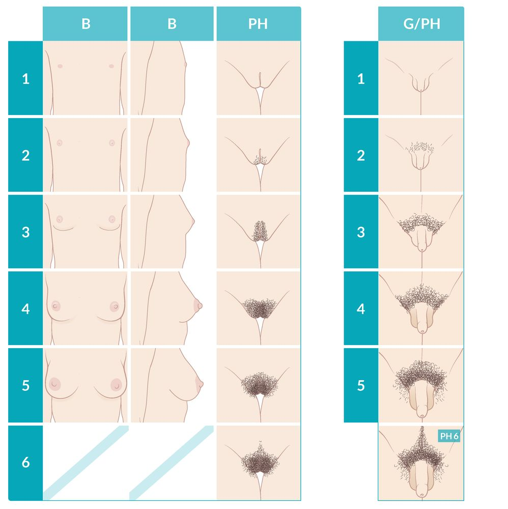

# Puberty

*Categories: Clinical knowledge > Obstetrics/gynecology > Sexuality and sexual development disorders > Puberty*

[Original Article Link](https://coursology-qbank.com/amboss/article/PM0WKg)

---

## Summary

Puberty is the phase of development between childhood and complete, functional maturation of the reproductive glands and external genitalia. Puberty typically starts with <u>gonadarche</u>, which is the stimulation of sex <u>hormone</u> production through the <u>hypothalamic-pituitary-adrenal axis</u>. Although there is considerable variation between individuals, puberty typically begins around the age of 11 in girls and 13 in boys. <u>Physical changes during puberty</u> include the development of <u>secondary sexual characteristics</u> (<u>breast</u> development, male <u>genitalia development</u>, and pubic <u>hair</u> growth), which can be measured using the <u>sexual maturity rating</u> (<u>SMR</u>), and the <u>adolescent growth spurt</u>. Factors affecting the onset and progression of puberty include genetics, environmental factors, race and ethnicity, and nutrition.

Disorders of puberty, such as <u>precocious puberty</u> and <u>delayed onset of puberty</u>, are covered separately.

---

## Definitions

* Adrenarche: activation of <u>adrenal</u> <u>androgen</u> production, which precedes other <u>pubertal changes</u> and leads to development of axillary and pubic <u>hair</u>, body odor, and <u>acne</u>

* Gonadarche: activation of reproductive glands by the <u>pituitary</u> <u>hormones</u> <u>FSH</u> and <u>LH</u>

* Thelarche: onset of <u>breast</u> development

* Pubarche: onset of pubic <u>hair</u> growth

* Menarche: onset of menstrual bleeding

---

## Physiology of puberty

* Unknown initial trigger → ↑ activators and/or ↓ inhibitors of <u>GnRH</u> secretion → pulsatile <u>GnRH</u> secretion→ ↑ <u>FSH</u> and ↑ <u>LH</u> secreted by the <u>anterior pituitary gland</u> → stimulation of the <u>Leydig cells</u> and <u>Sertoli cells</u> in the <u>testicles</u>, and the theca and <u>granulosa cells</u> in the <u>ovary</u>.

* The <u>hypothalamic-pituitary-gonadal axis</u> is tightly regulated by a negative feedback mechanism.

* <u>Testosterone</u> inhibits further <u>GnRH</u> secretion from the <u>hypothalamus</u>.

* <u>FSH</u>-stimulated <u>Sertoli cells</u> also secrete <u>inhibin</u>, which further inhibits <u>FSH</u> secretion from the <u>pituitary</u>.

---

## Timing of puberty

### Normal pubertal timing and progression

The age of pubertal onset varies, but the sequence of changes that occur is consistent.

#### Hormonal changes in both boys and girls [[2]](https://coursology-qbank.com/amboss/article/L8bwMv)

* <u>Adrenarche</u> typically precedes the onset of puberty.  [[3]](https://coursology-qbank.com/amboss/article/m-dVBs0)

* Puberty starts with <u>gonadarche</u>, which leads to development of <u>secondary sexual characteristics</u>.

* <u>Adrenarche</u> continues during puberty and contributes to physical changes (e.g., <u>pubarche</u>, axillary <u>hair</u>).

#### Physical changes in girls

Changes typically occur in the following order:[[1]](https://coursology-qbank.com/amboss/article/qgVCwF0)[[2]](https://coursology-qbank.com/amboss/article/L8bwMv)

1. * <u>Thelarche</u>: onset at age 8–12 years (average 10 years)
2. * <u>Adolescent growth spurt</u>: peak <u>growth velocity</u> between 11–12 years of age
3. * <u>Pubarche</u>: variable age of onset, ; but typically after <u>thelarche</u> [[4]](https://coursology-qbank.com/amboss/article/9jWNcl0)
4. * <u>Menarche</u>: 2.5 years after onset of <u>thelarche</u> (range: 9–15 years of age; average: 12.5 years of age) [[2]](https://coursology-qbank.com/amboss/article/L8bwMv)[[5]](https://coursology-qbank.com/amboss/article/BZVzdG0)

#### Physical changes in boys

Changes typically occur in the following sequence. [[1]](https://coursology-qbank.com/amboss/article/qgVCwF0)[[2]](https://coursology-qbank.com/amboss/article/L8bwMv)

1. * Testicular enlargement;  (testicular volume ≥ 4 mL and/or length ≥ 2.5 cm): onset at 9.5–14 years of age (average 11.5 years of age)
2. * <u>Pubarche</u>: Age of onset varies. [[4]](https://coursology-qbank.com/amboss/article/9jWNcl0)
3. * <u>Adolescent growth spurt</u>: peak <u>growth velocity</u> at 13–14 years of age

> [!TIP]
> The first visible sign of puberty in boys is testicular enlargement, while in girls it is <u>breast</u> development. [[2]](https://coursology-qbank.com/amboss/article/L8bwMv)

### Factors affecting timing and progression of puberty

* Genetics [[6]](https://coursology-qbank.com/amboss/article/90VNRG0)

* Environmental and social factors (e.g., family <u>stress</u>) [[7]](https://coursology-qbank.com/amboss/article/t0VX3G0)

* Race and ethnicity  [[7]](https://coursology-qbank.com/amboss/article/t0VX3G0)[[8]](https://coursology-qbank.com/amboss/article/Wv1P_i0)

* General health (e.g., <u>nutritional status</u>, body weight) [[9]](https://coursology-qbank.com/amboss/article/n-d7Bs0)[[10]](https://coursology-qbank.com/amboss/article/G0VBhG0)

* <u>Undernutrition</u> and excessive exercise are associated with <u>delayed onset of puberty</u>.

* <u>Obesity</u> is associated with early puberty (obesity-related precocious sexual development). [[11]](https://coursology-qbank.com/amboss/article/GZVB1G0)

* The exact association and mechanism are not well defined.  [[11]](https://coursology-qbank.com/amboss/article/GZVB1G0)

* Proposed central mechanism: <u>Obesity</u> → ↑ <u>leptin</u>→ ↑ <u>GnRH</u> pulsatility → ↑ production of <u>gonadotropins</u> and sex <u>hormones</u> → early development of <u>secondary sexual characteristics</u>. [[12]](https://coursology-qbank.com/amboss/article/uZVpWG0)

* Proposed peripheral mechanism: <u>Obesity</u> → <u>insulin resistance</u> and compensatory <u>hyperinsulinemia</u>  → ↑ sex <u>hormone</u> production.  [[11]](https://coursology-qbank.com/amboss/article/GZVB1G0)

* For other causes of abnormal pubertal progression, see "<u>Precocious puberty</u>" and "<u>Delayed onset of puberty</u>."

---

## Development of secondary sexual characteristics

Secondary sexual characteristics are physical features that develop during puberty, including <u>breasts</u>, male genitalia, and pubic <u>hair</u>.

### Sexual maturity rating (<u>Tanner staging</u>)  [[1]](https://coursology-qbank.com/amboss/article/qgVCwF0)[[13]](https://coursology-qbank.com/amboss/article/P8bW5v)

* A scale used to assess the development and progression of <u>secondary sexual characteristics</u> 

* <u>Breast</u> development (girls)

* <u>Genital development</u> (boys)

* Pubic <u>hair</u> (boys and girls)

* An <u>SMR</u> of 1 corresponds to prepubertal appearance; higher numbers indicate further sexual maturation.

#### Girls

|  Sexual maturity ratings in girls [[1]](https://coursology-qbank.com/amboss/article/qgVCwF0)[[3]](https://coursology-qbank.com/amboss/article/m-dVBs0)[[13]](https://coursology-qbank.com/amboss/article/P8bW5v)  |  |  |
| --- | --- | --- |
| <u>Sexual maturity rating</u> |  <u>Breast</u> development (B1–B5) | Pubic <u>hair</u> development (Ph1–Ph5) |
| 1 |  * Prepubertal appearance   |  * Prepubertal (usually no pubic <u>hair</u>)   |
| 2 |   * Enlarged <u>mammary glands</u> form a subareolar <u>breast</u> bud.  * Slight increase in areolar diameter; <u>nipple</u> protrusion    |  * Sparse, lightly pigmented <u>hair</u> (straight or curled) on the labia   |
| 3 |   * Further enlargement of <u>mammary glands</u>  * <u>Breast</u> bud extends beyond the areolar diameter    |  * Dark, coarse, curly <u>hair</u> spreading over the <u>pubic symphysis</u>   |
| 4 |  * <u>Nipple</u> and <u>areola</u> form a secondary mound, which projects above the <u>breast</u> tissue   |  * Adult pubic <u>hair</u> that does not extend to the inner thighs   |
| 5 |   * Adult <u>breast</u>  * <u>Areola</u> with projection of <u>nipple</u> only    |  * Adult pubic <u>hair</u> extending to the inner thighs with horizontal upper border   |

#### Boys

|  Sexual maturity ratings in boys [[1]](https://coursology-qbank.com/amboss/article/qgVCwF0)[[3]](https://coursology-qbank.com/amboss/article/m-dVBs0)[[13]](https://coursology-qbank.com/amboss/article/P8bW5v)  |  |  |
| --- | --- | --- |
| <u>Sexual maturity rating</u> |  <u>Genital development</u> (G1–G5) | Pubic <u>hair</u> development (Ph1–Ph6) |
| 1 |  * Prepubertal appearance and size of the <u>testes</u>, <u>scrotum</u>, and <u>penis</u>   |  * Prepubertal (usually no pubic <u>hair</u>)   |
| 2 |   * Testicular volume 4–5 mL and length ≥ 2.5 cm  * Increase in scrotal size  * Penile growth has not begun  * Scrotal <u>skin</u> reddens [[8]](https://coursology-qbank.com/amboss/article/Wv1P_i0)    |  * Sparse, lightly pigmented <u>hair</u> (straight or curled) on the base of the <u>penis</u>   |
| 3 |   * Continued enlargement of the <u>testes</u> and <u>scrotum</u>  * Penile growth begins    |  * Dark, coarse, curly <u>hair</u> spreading over the <u>pubic symphysis</u>   |
| 4 |   * Continued enlargement of the <u>testes</u>  * Continued scrotal enlargement and darkening  * Increase in penile growth and diameter  * Development of <u>glans penis</u>    |  * Adult pubic <u>hair</u> that does not extend to the inner thighs   |
| 5 |  * <u>Testes</u>, <u>scrotum</u>, and <u>penis</u> attain adult appearance and <u>proportions</u>   |  * Adult pubic <u>hair</u> extending to the inner thighs   |
|  6 (pubic <u>hair</u> only) |  * N/A   |  * Further growth of pubic <u>hair</u> along <u>linea alba</u> in the direction of the <u>umbilicus</u> [[5]](https://coursology-qbank.com/amboss/article/BZVzdG0)   |

---

## Additional physical changes during puberty

* <u>Physiologic leukorrhea</u> [[14]](https://coursology-qbank.com/amboss/article/C0VqRG0)

* Thin, white, odorless <u>vaginal discharge</u> caused by the effect of <u>estrogen</u> on vaginal <u>mucosa</u>

* Can begin during the 12 months before <u>menarche</u>

* <u>Pubertal gynecomastia</u> [[15]](https://coursology-qbank.com/amboss/article/7PX4Ty)

* Occurs in ∼ 50% of boys

* Onset typically during <u>SMR</u> stage 3–4

* Further evaluation indicated if not resolved within 18–24 months of onset [[2]](https://coursology-qbank.com/amboss/article/L8bwMv)

* Adolescent growth spurt [[2]](https://coursology-qbank.com/amboss/article/L8bwMv)

* Linear growth (↑ growth in trunk and limbs) during <u>adolescence</u> occurs at ∼ 5.1 cm/year from 4 years of age to puberty. [[1]](https://coursology-qbank.com/amboss/article/qgVCwF0)[[2]](https://coursology-qbank.com/amboss/article/L8bwMv)

* Peak <u>height velocity</u> (assessed using growth charts) can occur two years earlier in girls than boys.[[5]](https://coursology-qbank.com/amboss/article/BZVzdG0)

* Girls: peak <u>velocity</u> between <u>SMR</u> 2 and 3 (age 11–12 years)

* Boys: peak <u>velocity</u> between <u>SMR</u> 3 and 4 (age 13–14 years)

* Generally lasts ∼ 2 years; girls complete linear growth around 15 years of age and boys around 17 years of age. [[2]](https://coursology-qbank.com/amboss/article/L8bwMv)

* Bone growth: accelerated during puberty

* Increase in bone length precedes attainment of peak <u>bone mass</u> and strength.[[16]](https://coursology-qbank.com/amboss/article/H0VKhG0)[[17]](https://coursology-qbank.com/amboss/article/daVojG0)

* Influenced by sex <u>hormones</u>

* Body weight and body composition during adolescence [[18]](https://coursology-qbank.com/amboss/article/VaVGjG0)

* Boys: initial ↓ body fat (early puberty) → ↑ lean body mass (late puberty)

* Girls: gradual increase in body fat with increased distribution in the lower body

* Affected by <u>nutritional status</u>

* Dermatologic changes [[4]](https://coursology-qbank.com/amboss/article/9jWNcl0)

* Activation of the <u>adrenal cortex</u> → pubertal hormonal fluctuation → ↑ <u>sebum</u> secretion and excessive sweating → <u>skin</u> and <u>hair</u> changes

* Manifestations include <u>acne vulgaris</u>, axillary body odor, <u>seborrheic dermatitis</u>, and thicker <u>terminal hairs</u> (e.g., on face, body).

* Other changes

* Voice changes: deepening of the voice, increased <u>larynx</u> size in boys [[3]](https://coursology-qbank.com/amboss/article/m-dVBs0)

* <u>Myopia</u>: due to increased axial growth of the <u>eye</u> during rapid growth of <u>adolescence</u> [[9]](https://coursology-qbank.com/amboss/article/n-d7Bs0)

* <u>Clinical features of iron deficiency anemia</u>: may develop in post-menarchal girls.  [[19]](https://coursology-qbank.com/amboss/article/UaVbPG0)

> [!TIP]
> Early <u>menstrual cycles</u> may be irregular and anovulatory due to immaturity of the <u>hypothalamic-pituitary-gonadal axis</u>. [[3]](https://coursology-qbank.com/amboss/article/m-dVBs0)

---