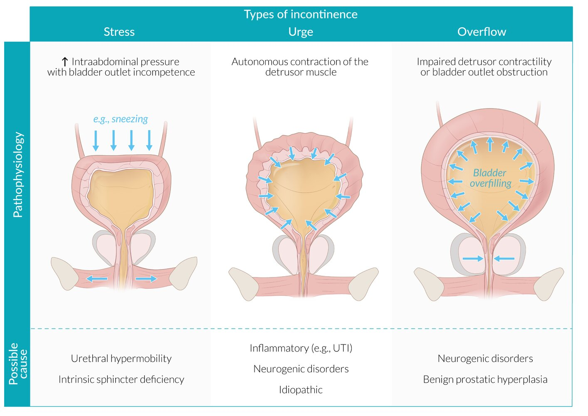

# Overactive bladder and urgency urinary incontinence

*Categories: Clinical knowledge > Obstetrics/gynecology > Urogynecology > Overactive bladder and urgency urinary incontinence*

[Original Article Link](https://coursology-qbank.com/amboss/article/yi0d8f)

---

## Summary

<u>Overactive bladder</u> (<u>OAB</u>) is a condition characterized by <u>nocturia</u>, <u>urinary frequency</u>, and <u>urinary urgency</u> with or without incontinence. <u>Urgency urinary incontinence</u> (<u>UUI</u>) is considered a severe form of <u>OAB</u> and is characterized by a sudden urge to urinate that results in the involuntary loss of urine. Both conditions are typically <u>idiopathic</u> but can also result from neurological conditions (e.g., <u>spinal cord injury</u>, <u>stroke</u>), <u>bladder</u> abnormalities (e.g., <u>bladder stones</u>, <u>tumor</u>), or infection. The <u>prevalence</u> of <u>OAB</u> and <u>UUI</u> increases with age, and women are more commonly affected than men. Diagnosis is usually made after performing an <u>initial evaluation of urinary incontinence</u>, assessing for <u>red flags in urinary incontinence</u>, and ruling out <u>stress urinary incontinence</u>. Additional studies are indicated if there is diagnostic uncertainty. <u>Conservative management</u> of <u>OAB</u> and <u>UUI</u> includes <u>pelvic floor physical therapy</u>, <u>bladder training</u>, lifestyle modifications, management of comorbidities, and use of <u>incontinence products</u>. Additional management options include pharmacological treatment with <u>beta-3 agonists</u> and/or <u>antimuscarinic agents</u>, and minimally invasive treatments (e.g., <u>botulinum toxin</u> injection or <u>posterior tibial nerve stimulation</u>). <u>Surgery</u> may be considered in refractory cases.

---

## Epidemiology

* <u>Prevalence</u> increases with age.

* Sex: <u>♀</u> > <u>♂</u>

Epidemiological data refers to the US, unless otherwise specified.

---

## Etiology

* <u>Idiopathic</u> <u>detrusor</u> overactivity (most common)

* Neurological conditions: lesions above the <u>brain stem</u>, <u>spinal cord injury</u>, <u>stroke</u>, <u>Parkinson disease</u>, <u>dementia</u>, and <u>multiple sclerosis</u>

* Genitourinary conditions: <u>bladder cancer</u>, inflammation, or <u>renal stones</u>

* <u>Risk factors</u> include:

* <u>Recurrent urinary tract infections</u>

* <u>Bladder</u> symptoms (e.g., <u>bed wetting</u>) in childhood

* <u>Constipation</u>

* See also “Etiology” in “<u>Urinary incontinence</u>.”

> [!TIP]
> <u>Detrusor</u> overactivity is a common cause of <u>OAB</u> and <u>UUI</u> and may be <u>idiopathic</u> or occur secondary to neurological conditions. [[5]](https://coursology-qbank.com/amboss/article/DbX1D9)

Urinary incontinence

Urinary bladder (male)

Urinary bladder (female)

---

## Clinical features

* Urinary urgency: a sudden urge to urinate

* Involuntary loss of urine with <u>urinary urgency</u> (<u>urgency incontinence</u>)

* <u>Urinary frequency</u>

* <u>Nocturia</u>

---

## Diagnosis

The diagnostic evaluation for <u>OAB</u> and <u>UUI</u> is the same.

* Perform <u>diagnostics for urinary incontinence</u>, including:

* <u>Urinary stress test</u> to exclude <u>stress urinary incontinence</u> [[5]](https://coursology-qbank.com/amboss/article/DbX1D9)[[7]](https://coursology-qbank.com/amboss/article/g5dFjq0)

* <u>Urinalysis</u>

* <u>Postvoid residual volume</u>   [[5]](https://coursology-qbank.com/amboss/article/DbX1D9)[[7]](https://coursology-qbank.com/amboss/article/g5dFjq0)

* <u>Diagnostics for BPH</u> (e.g., <u>PSA</u>) as appropriate [[8]](https://coursology-qbank.com/amboss/article/85dONq0)

* Assess for severity using:

* A validated symptom questionnaire [[8]](https://coursology-qbank.com/amboss/article/85dONq0)

* A <u>voiding diary</u> [[9]](https://coursology-qbank.com/amboss/article/Y51nih0)

* <u>Pad test</u> [[2]](https://coursology-qbank.com/amboss/article/5ndiFq0)[[7]](https://coursology-qbank.com/amboss/article/g5dFjq0)

* Refer to urology or urogynecology for additional studies (e.g., <u>urodynamic studies</u>, <u>cystoscopy</u>) for:

* <u>Red flags in urinary incontinence</u>

* Diagnostic uncertainty

---

## Differential diagnoses

* <u>Stress urinary incontinence</u>

* <u>Mixed urinary incontinence</u>

* <u>Overflow incontinence</u>

* <u>Total incontinence</u>

The differential diagnoses listed here are not exhaustive.

---

## Treatment

Treatment for <u>OAB</u> and <u>UUI</u> is the same.

### Approach [[3]](https://coursology-qbank.com/amboss/article/kodmXI0)[[5]](https://coursology-qbank.com/amboss/article/DbX1D9)[[8]](https://coursology-qbank.com/amboss/article/85dONq0)

* Offer <u>incontinence products</u>  to prevent dermatologic <u>complications of urinary incontinence</u>.

* Assess for features of <u>stress urinary incontinence</u>; manage as <u>mixed incontinence</u> if present.

* Educate on lifestyle and behavioral modifications (e.g., <u>bladder training</u>, <u>smoking cessation</u>, dietary changes).  [[7]](https://coursology-qbank.com/amboss/article/g5dFjq0)[[10]](https://coursology-qbank.com/amboss/article/-ndDDq0)

* Treat underlying conditions (e.g., <u>obesity</u>, <u>diabetes</u>, <u>genitourinary syndrome of menopause</u>).

* Use <u>shared decision-making</u> to determine further management, which includes (alone or in combination):

* <u>Pelvic floor physical therapy</u>

* Pharmacological treatment

* Referral for minimally invasive therapy

* Refer patients with <u>red flags in urinary incontinence</u> or refractory symptoms to urology or urogynecology.

> [!TIP]
> <u>Treatment of genitourinary syndrome of menopause</u> with topical <u>estrogen</u> may improve <u>urinary incontinence</u> symptoms. [[7]](https://coursology-qbank.com/amboss/article/g5dFjq0)

### Pharmacological treatment [[5]](https://coursology-qbank.com/amboss/article/DbX1D9)[[8]](https://coursology-qbank.com/amboss/article/85dONq0)

* Follow the <u>principles of prescribing for older adults</u>, especially the <u>Beers Criteria</u>.

* First-line pharmacological treatment: <u>beta-3 agonists</u> (preferred) or <u>antimuscarinic agents</u>  [[5]](https://coursology-qbank.com/amboss/article/DbX1D9)[[8]](https://coursology-qbank.com/amboss/article/85dONq0)

* Assess response to pharmacotherapy after 4–8 weeks; if there has been minimal or no response: [[8]](https://coursology-qbank.com/amboss/article/85dONq0)

* Change medications.

* Consider combination medical therapy.  [[3]](https://coursology-qbank.com/amboss/article/kodmXI0)[[8]](https://coursology-qbank.com/amboss/article/85dONq0)

|  Pharmacological therapy for overactive bladder and UUI [[5]](https://coursology-qbank.com/amboss/article/DbX1D9)[[8]](https://coursology-qbank.com/amboss/article/85dONq0)  |  |  |
| --- | --- | --- |
| Drug class | Mechanism of action | Agents |
|  Beta-3 <u>agonists</u> (preferred) |   * Stimulates beta-3 <u>adrenergic receptors</u> of the <u>detrusor muscle</u> → relaxation  * Increases <u>bladder</u> capacity for urine [[5]](https://coursology-qbank.com/amboss/article/DbX1D9)    |   * Mirabegron DOSAGE [[3]](https://coursology-qbank.com/amboss/article/kodmXI0)[[5]](https://coursology-qbank.com/amboss/article/DbX1D9)  * Vibegron DOSAGE    |
|  <u>Antimuscarinic agents</u> [[9]](https://coursology-qbank.com/amboss/article/Y51nih0)  |   * Competitive blockage of <u>acetylcholine</u> of the muscarinic <u>acetylcholine</u> <u>receptors</u> → impairment of <u>parasympathetic</u> effect → decreased overactivity of the <u>detrusor muscle</u>  * Reduces voiding frequency    |   * Selective <u>antimuscarinic agents</u>  * Darifenacin DOSAGE  * Solifenacin DOSAGE  * Nonselective <u>antimuscarinic agents</u>  * Oxybutynin: oral DOSAGE or transdermal DOSAGE  * Tolterodine DOSAGE  * Trospium DOSAGE (may be preferred in older adults)  [[3]](https://coursology-qbank.com/amboss/article/kodmXI0)[[7]](https://coursology-qbank.com/amboss/article/g5dFjq0)  * Fesoterodine DOSAGE    |

> [!WARNING]
> Discuss the risk of cognitive impairment and <u>major neurocognitive disorder</u> with patients before initiating antimuscarinic medications. [[8]](https://coursology-qbank.com/amboss/article/85dONq0)

> [!NOTE]
> Oxybutynin treats Overactive <u>bladder</u>.

### Minimally invasive therapy [[8]](https://coursology-qbank.com/amboss/article/85dONq0)

* Can be used first-line, alone, or in combination, to manage <u>OAB</u> and <u>UUI</u>

* Options include:

* Intradetrusor <u>botulinum toxin</u> injection

* <u>Sacral neuromodulation</u>

* <u>Posterior tibial nerve stimulation</u>

### Management of refractory <u>UUI</u>

Management of refractory <u>UUI</u> is usually overseen by a specialist (e.g., urology or urogynecology) and may include:

* Surgical treatment (e.g., <u>augmentation cystoplasty</u>, urinary diversion)

* Long-term urethral or <u>suprapubic catheters</u>  [[8]](https://coursology-qbank.com/amboss/article/85dONq0)

---