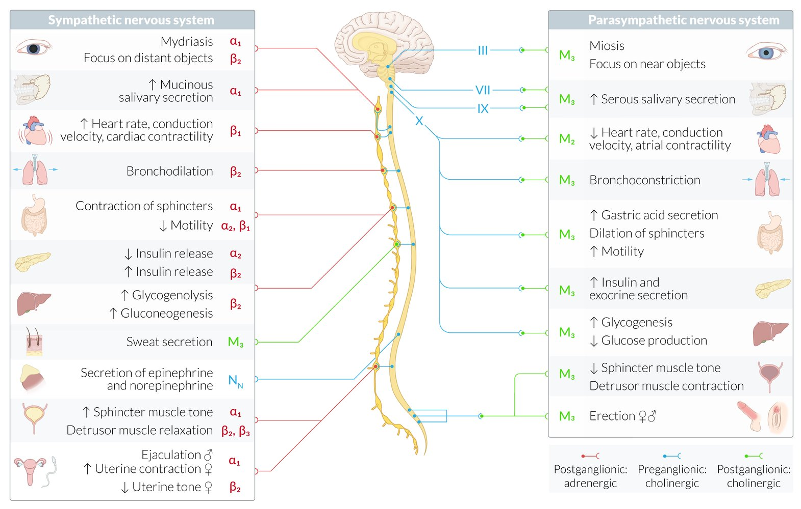
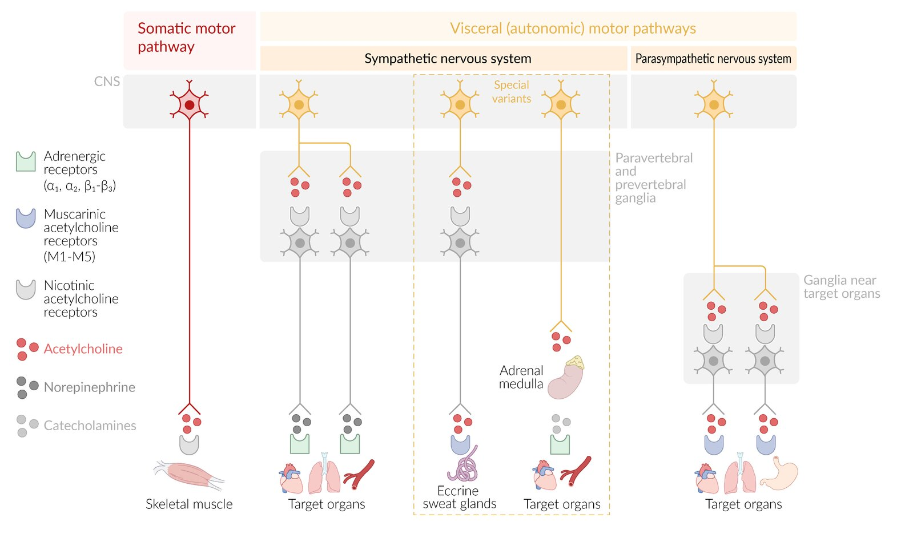
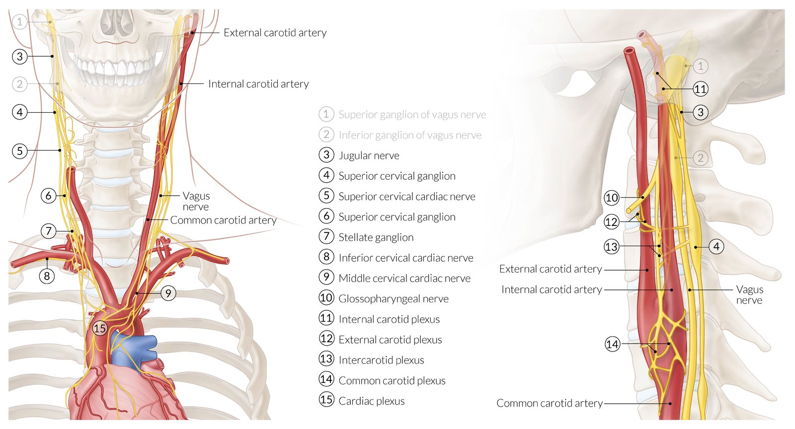
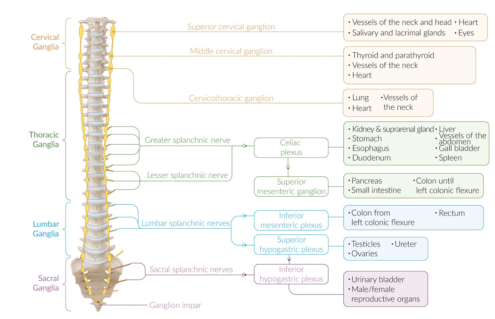
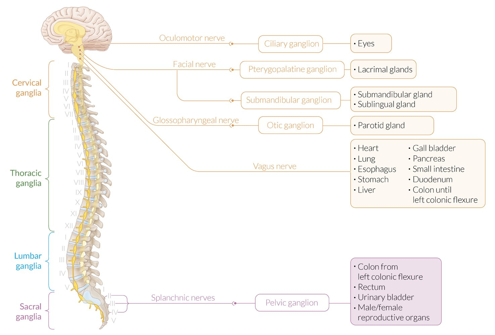
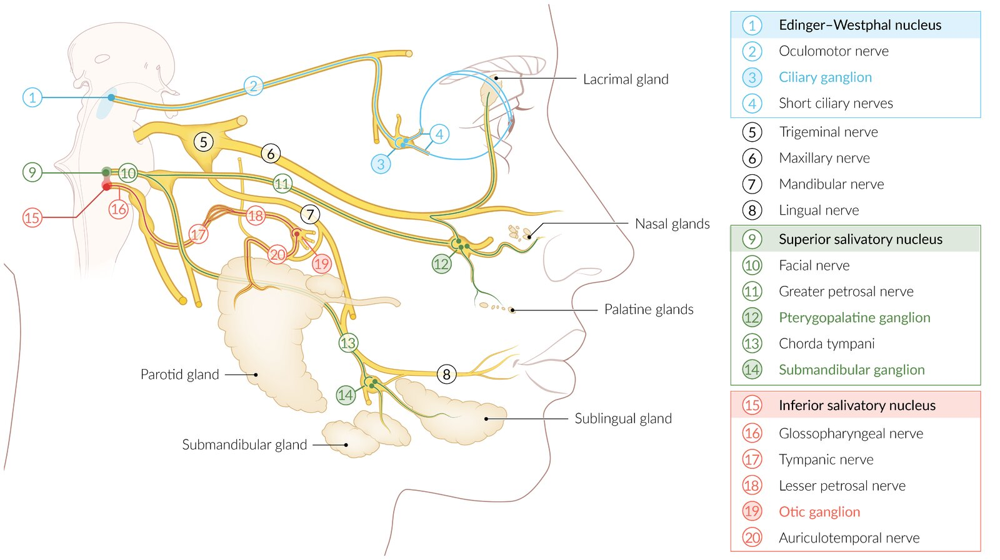
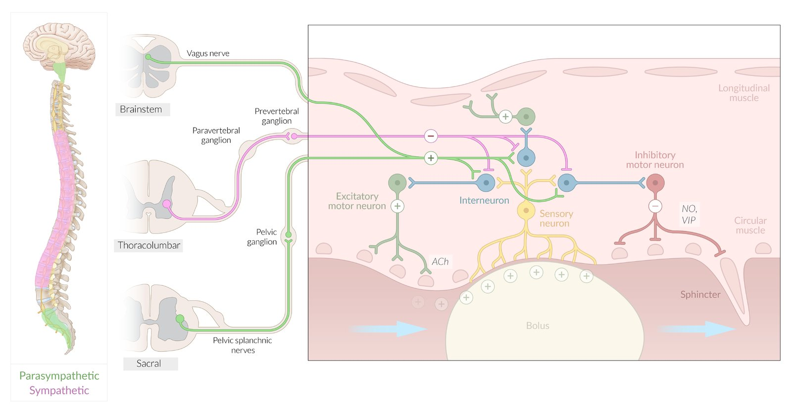
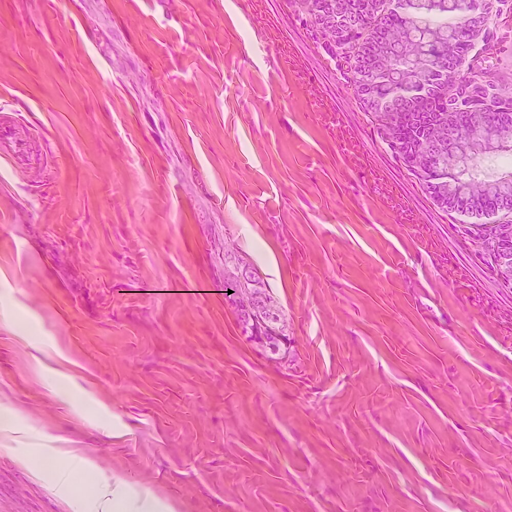
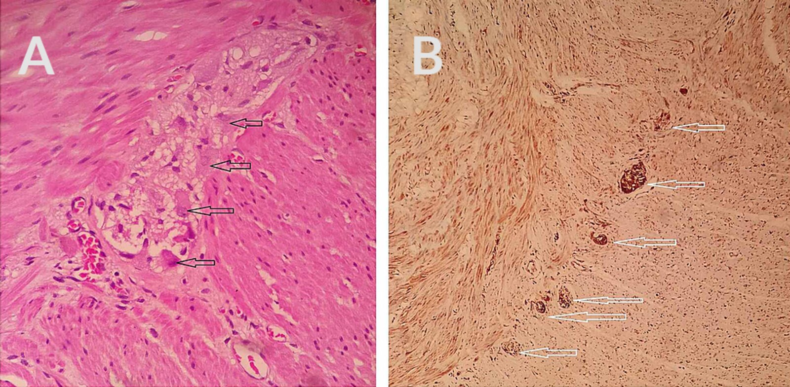

# Autonomic nervous system

*Categories: Clinical knowledge > Ophthalmology > Basics of ophthalmology > Autonomic nervous system*

[Original Article Link](https://coursology-qbank.com/amboss/article/560ilS)

---

## Summary

The autonomic nervous system (ANS) is part of the <u>peripheral nervous system</u> and regulates involuntary, <u>visceral</u> body functions in different organ systems (e.g., the cardiovascular, gastrointestinal, genitourinary systems). It is divided into the <u>sympathetic</u> and <u>parasympathetic</u> nervous systems. The <u>sympathetic nervous system</u> has a thoracolumbar outflow and is activated during fight or flight response, while the <u>parasympathetic nervous system</u> has a craniosacral outflow and is activated during digestion and rest. The <u>sympathetic</u> and <u>parasympathetic</u> nervous systems consist of <u>preganglionic</u> and <u>postganglionic neurons</u>. The <u>preganglionic</u> fibers of both ANS divisions and the <u>postganglionic</u> fibers of the <u>parasympathetic</u> division are cholinergic fibers (release <u>acetylcholine</u>) that act on <u>cholinergic receptors</u> (nicotinic or muscarinic). All <u>postganglionic</u> fibers of the <u>sympathetic</u> division are adrenergic fibers (release <u>norepinephrine</u>) that act on adrenergic alpha or <u>beta receptors</u> for neurotransmission, with the exception of the fibers innervating the <u>sweat glands</u>, which are cholinergic. The <u>adrenal medulla</u> does not have a postsynaptic <u>neuron</u>. The <u>sympathetic</u> <u>preganglionic</u> fibers stimulate the <u>chromaffin cells</u> of the <u>adrenal medulla</u> directly via <u>acetylcholine</u> on <u>nicotinic receptors</u>, which results in the release of <u>norepinephrine</u> and <u>epinephrine</u> mediating the fight or flight response. The <u>sympathetic</u> and <u>parasympathetic</u> nervous systems have antagonistic effects in some organ systems. The effects of the <u>sympathetic nervous system</u> on target organs include <u>mydriasis</u>, increased <u>heart rate</u>, contractility, and conduction <u>velocity</u>, bronchodilation, sweat secretion, decreased intestinal motility, and increased <u>renin</u> release. The effect of the <u>parasympathetic nervous system</u> on target organs include <u>miosis</u>, decreased <u>heart rate</u>, contractility, and conduction <u>velocity</u>; increased intestinal motility; and bronchoconstriction. In addition to the <u>sympathetic</u> and <u>parasympathetic</u> nervous systems, there is the <u>enteric nervous system</u>, which consists of <u>enteric</u> <u>ganglia</u>, the myenteric (Auerbach) and the <u>submucosal</u> (Meissner) plexuses, and the <u>interstitial cells of Cajal</u>. The <u>enteric nervous system</u> controls gastrointestinal motility and secretion. Autonomic function can be affected by medications (e.g., <u>selective serotonin reuptake inhibitors</u>, <u>anticholinergics</u>) as well as diseases (e.g., <u>diabetes mellitus</u>, <u>Parkinson disease</u>, <u>multiple system atrophy</u>).

---

## Overview

* Function: controls unconscious, involuntary, and <u>visceral</u> body functions, i.e., the cardiovascular, <u>thermoregulatory</u>, gastrointestinal, genitourinary, and <u>pupillary</u> systems

* Components

* <u>Visceral</u> motor (efferent) pathways: made up of preganglionic neurons (originate in <u>brain</u> or spinal cord) and postganglionic neurons (cell body in autonomic <u>ganglion</u> outside the <u>CNS</u>)

* <u>Sympathetic</u>

* <u>Parasympathetic</u>

* <u>Visceral</u> sensory (afferent) pathways: originate in <u>visceral</u> <u>receptors</u> that are sensitive to physiological stimuli (e.g., mechanical, thermal)

* Ganglia (neuroanatomy): in neuroanatomy, a ganglion is an accumulation of <u>neuron</u> cell bodies outside the <u>CNS</u>

* Nuclei (neuroanatomy): in neuroanatomy, a <u>nucleus</u> is an accumulation of <u>neuron</u> cell bodies in the <u>CNS</u>

* <u>Enteric nervous system</u>

| Overview of the sympathetic and parasympathetic nervous system |  |  |
| --- | --- | --- |
|  | <u>Sympathetic nervous system</u> | <u>Parasympathetic nervous system</u> |
| Effect |  * Fight or flight (↑ <u>heart rate</u>, ↓ GI motility, <u>pupil</u> and <u>airway</u> dilation)   |  * Rest and digest (e.g., ↓ <u>heart rate</u>, ↑ GI motility, ↑ <u>exocrine gland</u> secretions)   |
| Location |  * Thoracolumbar outflow   |  * Craniosacral outflow   |
| Characteristics |   * Short <u>preganglionic</u> fibers, long <u>postganglionic</u> fibers  * <u>Ganglia</u> close to the spinal cord    |   * Long <u>preganglionic</u> fibers, short <u>postganglionic</u> fibers  * <u>Ganglia</u> in <u>visceral</u> effector organs    |
| <u>Neurotransmitter</u> |  * <u>Preganglionic</u>: <u>acetylcholine</u>   |  |
|  * <u>Postganglionic</u>: <u>noradrenaline</u>   |  * <u>Postganglionic</u>: <u>acetylcholine</u>   |  |
|  Most common cotransmitters  |   * NO (<u>nitric oxide</u>)  * <u>ATP</u> (<u>adenosine triphosphate</u>)  * <u>VIP</u> (<u>vasoactive intestinal peptide</u>)  * <u>NPY</u> (<u>neuropeptide Y</u>)  * <u>Somatostatin</u>    |  |
| <u>Receptors</u> |   * <u>Nicotinic acetylcholine receptors</u>  * <u>Adrenoreceptors</u> (<u>α-receptors</u>, <u>β-receptors</u>)    |   * <u>Nicotinic acetylcholine receptors</u>  * <u>Muscarinic acetylcholine receptors</u>    |

Autonomic nervous system (overview)

Overview of somatic and autonomic motor pathways and neurotransmitters

### Types of <u>receptors</u>

* See “<u>Signal transduction</u>.”

| Types of <u>receptors</u> |  |  |  |  |  |  |
| --- | --- | --- | --- | --- | --- | --- |
| Class |  |  |  | Structure | Most important location | Effect of stimulation |
|  <u>Metabotropic receptors</u>: <u>G-protein</u>-coupled <u>receptors</u> acting through <u>second messengers</u> (see <u>signal transduction</u>) |  Adrenergic receptors  | Alpha-adrenergic receptors | Alpha-1 receptor |  * <u>Gq proteins</u>   |   * <u>Smooth muscle</u>  * <u>Blood vessels</u>  * <u>Bladder neck</u>  * <u>GI tract</u>  * <u>Eye</u> (<u>iris dilator muscle</u>)  * <u>Heart</u>  * Glands  * Neuronal terminals  * To a lesser extent: <u>liver</u>, <u>adipose tissue</u>    |   * Peripheral <u>vasoconstriction</u>  * <u>Arterioles</u> →↑ <u>afterload</u>  * <u>Veins</u> →↑ <u>preload</u>  * GI sphincter contraction  * <u>Bladder</u> sphincter contraction → <u>urinary retention</u>  * <u>Mydriasis</u>  * ↑ <u>Glycogenolysis</u>    |
| Alpha-2 receptor |  * <u>Gi proteins</u>   |   * Prejunctional nerve terminals  * <u>Pancreas</u>  * <u>Heart</u>  * Glands  * <u>Eye</u> (<u>ciliary body</u>)  * <u>Platelet</u>  * To a lesser extent: <u>smooth muscle</u> of <u>blood vessels</u>, <u>adipose tissue</u>, <u>bladder</u>    |   * ↓ <u>Norepinephrine</u> release and synthesis (negative feedback)  * ↓ <u>Insulin</u> release  * ↓ <u>Lipolysis</u>  * ↓ <u>Aqueous humor</u> production  * ↓ salivary secretion  * ↑ <u>Platelet aggregation</u>    |  |  |  |
| Beta-adrenergic receptors | Beta-1 receptor |  * <u>Gs proteins</u>   |   * <u>Heart</u>  * <u>SA node</u>  * <u>AV node</u>  * Atrial and ventricular muscle  * <u>CNS</u>  * <u>Kidney</u>  * To a lesser extent: <u>adipose tissue</u>    |   * Cardiac excitation   * ↑ <u>Heart rate</u> (<u>chronotropy</u>)  * ↑ Conduction <u>velocity</u> (<u>dromotropy</u>)  * ↑ Force of contraction (<u>inotropy</u>)  * ↑ <u>Renin</u> release    |  |  |
| Beta-2 receptor |  * <u>Gs proteins</u>   |   * <u>Liver</u>  * <u>Smooth muscle</u>  * <u>Blood vessels</u>  * <u>Bronchioles</u>  * <u>Uterus</u>  * <u>Skeletal muscle</u>  * <u>CNS</u>  * <u>Pancreas</u>  * To a lesser extent: <u>heart</u>    |   * Relaxation of <u>smooth muscle</u>  * <u>Vasodilation</u>  * Bronchodilation  * Relaxation of <u>uterus</u>  * <u>Bladder</u> relaxation  * ↑ Contractility  * ↑ <u>Glycogenolysis</u>  * ↑ <u>Insulin</u> release  * ↑ <u>Glucose</u> release    |  |  |  |
| Beta-3 receptor |  * <u>Gsproteins</u>   |   * <u>Bladder</u>  * <u>Adipose tissue</u>  * To a lesser extent: <u>heart</u>, <u>smooth muscle</u> of <u>blood vessels</u>    |   * <u>Bladder</u> relaxation  * ↑ <u>Lipolysis</u>  * <u>Thermogenesis</u>    |  |  |  |
|  Muscarinic acetylcholine receptors  | M1 |  |  * <u>Gq proteins</u>   |   * Autonomic <u>ganglia</u>  * <u>CNS</u>  * GI: salivatory glands    |   * Excitatory action in <u>neurons</u>  * ↑ Secretion of <u>exocrine gland</u> (e.g. salivation)    |  |
| M2 |  |  * <u>Gi proteins</u>   |  * <u>Heart</u>  * <u>SA node</u>  * <u>AV node</u>   |  * Cardiac (mostly atrial) inhibition  * ↓ <u>Heart</u> rate (<u>chronotropy</u>)  * ↓ Conduction <u>velocity</u> (<u>dromotropy</u>)   |  |  |
| M3 |  |  * <u>Gq proteins</u>   |   * <u>Exocrine glands</u>  * Salivary  * Lacrimal  * Sweat  * <u>Eye</u>  * <u>Bronchi</u>  * GI: <u>gastric parietal cells</u>  * <u>Bladder</u>    |   * ↑ Secretion of <u>exocrine glands</u> (e.g., <u>lacrimation</u>, salivation, <u>hidrosis</u>)  * Contraction of the following muscles in the <u>eye</u>  * <u>Iris sphincter muscle</u> → <u>miosis</u>  * <u>Ciliary muscle</u> → <u>accommodation</u>  * <u>Bronchospasm</u>  * ↑ Gut <u>peristalsis</u>  * ↑ <u>Gastric acid</u> secretion  * Relaxation of sphincters (except lower esophageal, which contracts)  * ↑ <u>Urination</u>  * Contraction of <u>detrusor</u>  * Relaxation of sphincter    |  |  |
| M4 |  |  * <u>Gi proteins</u>   |  * <u>CNS</u>   |  * Inhibitory (M4)/excitatory (M5)  * <u>Memory</u>  * Arousal  * Attention  * <u>Analgesia</u>   |  |  |
| M5 |  |  * <u>Gq proteins</u>   |  |  |  |  |
| <u>Ionotropic receptors</u> |  Nicotinic acetylcholine receptors  | N subtype |  |  * <u>Ligand-gated ion channels</u>   |   * Autonomic <u>ganglia</u>  * <u>Adrenal medulla</u>    |  * ↑ Pre- and postsynaptic excitation   |
| M subtype |  |  * <u>Neuromuscular junction</u> of <u>skeletal muscle</u> (somatic nervous system)   |  |  |  |  |

> [!NOTE]
> All <u>beta receptors</u> are coupled with <u>Gsproteins</u>. Odd <u>alpha receptors</u> and <u>muscarinic acetylcholine receptors</u> (alpha-1, M1, <u>M3</u>, and M5) are coupled with <u>Gq proteins</u>. Even <u>alpha receptors</u> and <u>muscarinic acetylcholine receptors</u> (alpha-2, M2, and M4) are coupled with <u>Gi proteins</u>.

### <u>Types of nerve fibers</u>

* Small myelinated fibers: transmit <u>preganglionic</u> autonomic efferents and somatic afferents (fast)

* Unmyelinated fibers (e.g., which innervate <u>sweat glands</u>): transmit <u>postganglionic</u> autonomic efferents and somatic/autonomic afferents (slow)

### <u>Neurotransmitters</u>

* <u>Acetylcholine</u> 

* All <u>preganglionic</u> fibers

* All <u>parasympathetic</u> <u>postganglionic</u> fibers

* <u>Sympathetic</u> <u>postganglionic</u> fibers for <u>sweat glands</u> and <u>arrector pili muscles</u>

* <u>Norepinephrine</u> 

* All <u>sympathetic</u> <u>postganglionic</u> fibers

* Exceptions: <u>sweat glands</u> and <u>arrector pili muscles</u> (<u>acetylcholine</u>), <u>adrenal medulla</u> (80% <u>epinephrine</u>, 20% <u>norepinephrine</u>), <u>renal arteries</u> (<u>dopamine</u>)

> [!NOTE]
> Transmitters of the <u>sympathetic nervous system</u> are <u>acetylcholine</u> (<u>preganglionic</u> → <u>postganglionic neurons</u>) and <u>norepinephrine</u> (<u>postganglionic neurons</u> → effector organ).

### ANS innervation of organs

| Overview of ANS innervation of organs |  |  |
| --- | --- | --- |
| Organs | <u>Sympathetic</u> | <u>Parasympathetic</u> |
| Head and Neck | T1–T4 |  <u>CN III</u>, VII, IX, X |
| <u>Heart</u> | T1–T5 |  <u>Vagus nerve</u> (occiput, C1, C2) |
| <u>Lung</u> | T2–T7 |  |
| <u>Esophagus</u> | T2–T8 |  |
| <u>Stomach</u> | T5–T9 |  |
| <u>Liver</u> |  |  |
| <u>Gallbladder</u> |  |  |
| <u>Spleen</u> |  |  |
| <u>Pancreas</u> |  |  |
| <u>Proximal</u> <u>duodenum</u> |  |  |
| <u>Distal</u> <u>duodenum</u> | T10–L1 |  |
| <u>Jejunum</u> |  |  |
| <u>Ileum</u> |  |  |
| <u>Ascending colon</u> |  |  |
| <u>Proximal</u> ⅔ <u>transverse colon</u> |  |  |
| <u>Kidney</u> |  |  |
| <u>Proximal</u> <u>ureter</u> |  |  |
| <u>Adrenal glands</u> | T8–T10 |  |
| <u>Ovaries</u>/<u>Testes</u> | T10–T11 |  |
| <u>Uterus</u> | T10–L2 | <u>S2</u>–<u>S4</u> |
| <u>Cervix</u> |  |  |
| <u>Prostate</u> |  |  |
| <u>Distal</u> <u>ureter</u> | T11–L2 |  |
| <u>Bladder</u> |  |  |
| <u>Distal</u> ⅓ <u>transverse colon</u> | L1–L2 |  |
| <u>Descending colon</u> |  |  |
| <u>Sigmoid colon</u> |  |  |
| <u>Rectum</u> |  |  |
|  * The corresponding segmental innervations may vary between sources.   |  |  |

---

## Sympathetic nervous system

For a rapid overview see table “<u>Overview of the sympathetic and parasympathetic nervous system</u>.” [[1]](https://coursology-qbank.com/amboss/article/lSYv-o)

### <u>Sympathetic nervous system</u>

* Structure

* Descends from <u>central nervous system</u> to T1–L2 (thoracolumbar outflow)

* <u>Neuron</u> cell bodies are located in the <u>lateral horn</u> of the spinal cord.

* <u>Preganglionic</u> <u>axons</u> (short myelinated, cholinergic fibers) exit the spinal cord through <u>ventral</u> roots, <u>spinal nerves</u>, and <u>white rami communicantes</u>. They either:

* Connect to <u>paravertebral ganglia</u>, which lie near the <u>vertebral column</u> and <u>synapse</u> with postsynaptic cells at the same level

* Travel up or down the chain of <u>paravertebral ganglia</u> to <u>synapse</u> in a more superior or inferior <u>paravertebral ganglion</u> with a postsynaptic cell

* Run through <u>paravertebral ganglia</u> without synapsing and further through the <u>splanchnic nerves</u> to <u>synapse</u> in the <u>prevertebral ganglia</u> (innervate <u>pelvic</u> <u>viscera</u>), which are located in front of the <u>vertebral column</u>, around the origins of the major <u>branches of the abdominal aorta</u>

* Or pass through paravertebral and <u>prevertebral ganglia</u> and directly <u>synapse</u> on <u>chromaffin cells</u> of the <u>adrenal medulla</u>.

* <u>Postganglionic</u> <u>axons</u>:  (long unmyelinated, mostly adrenergic fibers): leave the paravertebral or <u>prevertebral ganglia</u> and innervate end organs

### Sympathetic ganglia

#### Paravertebral ganglia

* Structure: form a chain of <u>ganglia</u> on each side of the <u>vertebral column</u> running from the <u>base of the skull</u> to the <u>coccyx</u>, which forms the sympathetic trunk

* Include: superior cervical, middle cervical, and cervicothoracic (stellate) <u>ganglia</u> ., the thoracic (12), lumbar (4), and sacral (4) <u>ganglia</u>, and the <u>ganglion</u> impar (unpaired)

* Function

* All <u>paravertebral ganglia</u>: innervation of <u>blood vessels</u>, <u>arrector pili muscles</u>, and <u>sweat glands</u>

* Superior cervical ganglion: innervates <u>sublingual gland</u>, <u>submandibular gland</u>, <u>parotid gland</u>, carotid body, <u>choroid plexus</u>, dilator pupillae, and <u>superior tarsal muscle</u>

* Middle cervical ganglion: branches to <u>thyroid gland</u>, supplies <u>heart</u>

* Stellate ganglion: supplies head, neck, arms, <u>heart</u>, and <u>lungs</u>

* Thoracic sympathetic ganglia 

* Upper <u>thoracic sympathetic trunk</u>: forms the <u>cardiac plexus</u>, <u>pulmonary plexus</u>, aortic plexus, and esophageal plexus, which supply the neck, upper limbs, and thorax (i.e., <u>heart</u>, aorta, <u>trachea</u>, <u>lungs</u>, and <u>esophagus</u>)

* Lower <u>thoracic sympathetic trunk</u> (T5–T12): mainly gives <u>preganglionic</u> fibers that form the splanchnic nerves, which go to the celiac and <u>aorticorenal ganglion</u> and supply the abdominal <u>viscera</u>

* Lumbar and sacral sympathetic ganglia: innervate the <u>pelvic floor</u> and lower limbs

Cervical sympathetic trunk

Sympathetic trunk

#### Prevertebral ganglia (or <u>preaortic ganglia</u>)

* Not part of the <u>sympathetic trunk</u>

* Closely associated with the major abdominal branches of the aorta:

* Celiac ganglion near the origin of the <u>celiac artery</u>: innervates the <u>liver</u> (via <u>hepatic plexus</u>), <u>gallbladder</u>, <u>bile</u> duct, <u>spleen</u> (via <u>splenic plexus</u>), <u>pancreas</u>, <u>adrenal glands</u> (via suprarenal plexus), and the first part of the <u>small intestine</u>

* Aorticorenal ganglion (detached part of lower <u>celiac ganglion</u>) close to the the <u>renal artery</u>: forms <u>renal plexus</u> and innervates the <u>kidneys</u>

* Superior mesenteric ganglion near the origin of the <u>superior mesenteric artery</u>: innervates the <u>small intestine</u>

* Inferior mesenteric ganglion near the origin of the <u>inferior mesenteric artery</u>: innervates the <u>descending colon</u>, <u>sigmoid colon</u>, <u>rectum</u>, <u>urinary bladder</u>, and sexual organs

> [!NOTE]
> Injury to the cervical <u>sympathetic trunk</u> (esp. the <u>superior cervical ganglion</u>, which supplies the <u>visceral</u> structures of the head and neck) may result in <u>Horner syndrome</u> (partial <u>ptosis</u>, <u>miosis</u>, <u>anhidrosis</u>).

---

## Parasympathetic nervous system

For a rapid overview see table “<u>Overview of the sympathetic and parasympathetic nervous system</u>.”

### General information

* Exits <u>central nervous system</u> (<u>dorsal</u> motor <u>nucleus</u>) with <u>cranial nerves</u> <u>CN III</u>, <u>CN VII</u>, <u>CN IX</u>, <u>CN X</u>, and the sacral spinal roots (craniosacral outflow)

* <u>Preganglionic</u> <u>axons</u>;  (long, myelinated cholinergic fibers): <u>synapse</u> in <u>ganglia</u> close to end organs

* <u>Postganglionic</u> <u>axons</u>;  (short, cholinergic fibers): leave <u>ganglia</u> and innervate end organs

Parasympathetic ganglia

### <u>Cranial</u> outflow

The <u>cranial</u> outflow supplies <u>visceral</u> structures of the head, neck and face via <u>CN III</u>, <u>CN VII</u>, <u>CN IX</u> and of the thorax and upper abdomen via <u>CN X</u>.

* Four bilateral autonomic <u>ganglia</u> in the head and neck:

* Edinger-Westphal nucleus → <u>oculomotor nerve</u> (<u>CN III</u>) → ciliary ganglion → <u>sphincter pupillae</u> (<u>miosis</u>) and <u>ciliary muscle</u> (<u>accommodation</u>)

* Superior salivatory <u>nucleus</u> → <u>facial nerve</u> → pterygopalatine ganglion and submandibular ganglion → <u>lacrimal gland</u>, glands of the <u>mucosa</u> of the oral and nasal cavity, <u>pharynx</u>, and sinuses

* Inferior salivatory <u>nucleus</u> → <u>glossopharyngeal nerve</u> → otic ganglion → salivation of <u>parotid gland</u>

* Dorsal nucleus of the vagus nerve → <u>CN X</u> → several <u>ganglia</u> close to/or within the walls of the <u>gastrointestinal tract</u> and <u>lungs</u>

Parasympathetic innervation to the head and neck

### Sacral outflow

* Supplies <u>pelvis</u> via 2nd–4th sacral <u>spinal nerves</u>

* <u>Lateral horn</u> of the sacral segments of <u>S2</u>–<u>S4</u> → pelvic splanchnic nerves → <u>inferior hypogastric plexus</u> or <u>ganglia</u> within walls of <u>pelvic</u> (e.g., descending and <u>sigmoid colon</u>, <u>rectum</u>, <u>ureter</u>, <u>prostate</u>, <u>bladder</u>, <u>urethra</u>) and genital organs.

---

## The sympathetic vs. parasympathetic nervous system

↑The <u>sympathetic</u> and <u>parasympathetic</u> nervous systems mediate numerous, sometimes antagonistic effects in the organs they innervate. In general, the <u>sympathetic nervous system</u> stimulates the body’s <u>fight-or-flight response</u>, while the <u>parasympathetic nervous system</u> controls <u>homeostasis</u> and the body at rest.

| Overview of receptor distribution of the sympathetic and parasympathetic nervous system |  |  |  |
| --- | --- | --- | --- |
| Target organ |  | <u>Sympathetic nervous system</u> | <u>Parasympathetic nervous system</u> |
| <u>Brain</u> |  |   * ↑ Blood flow and alertness  * α2: ↓ <u>neurotransmitter</u> release    |  * M1: <u>CNS</u> (increase <u>memory</u>, attention)   |
| <u>Eye</u> |  |   * α1: <u>mydriasis</u>  * β2: focus on distant objects  * α2: ↓ <u>aqueous humor</u> production  * β2: ↑ <u>aqueous humor</u> production    |  * <u>M3</u>  * <u>Miosis</u>  * Focus on near objects (<u>accommodation</u>)   |
| <u>Salivary glands</u> |  |  * α2: ↓ salivary secretion   |  * <u>M3</u>: ↑ salivary secretion   |
| <u>Blood vessels</u> |  |   * α1: <u>vasoconstriction</u> in <u>skin</u> and intestine  * β2: <u>vasodilation</u> in <u>skeletal muscle</u> (transmitter: only <u>epinephrine</u>)    |   * Most <u>blood vessels</u> in the body do not have <u>parasympathetic</u> innervation.  * <u>Vasodilation</u>  * Via <u>M3</u>: e.g., deep <u>arteries</u> of the <u>penis</u> (cavernosal <u>arteries</u>) during <u>erection</u> [[2]](https://coursology-qbank.com/amboss/article/sPYtT6)  * Indirectly: via withdrawal of <u>tonic</u> adrenergic <u>vasoconstriction</u>    |
| <u>Heart</u> |  |  * β1, β2  * ↑ <u>Heart rate</u> (positive <u>chronotropic</u>)  * ↑ Contractility (positive <u>inotropic</u>)  * ↑ Conduction <u>velocity</u> (positive <u>dromotropic</u>); controls <u>sinoatrial node</u>   |  * M2  * ↓ <u>Heart rate</u> (negative <u>chronotropic</u>)  * ↓ Contractility (negative <u>inotropic</u>)  * ↓ Conduction <u>velocity</u> (negative <u>dromotropic</u>)   |
| <u>Lungs</u> |  |  * β2: bronchodilation   |  * <u>M3</u>: bronchoconstriction   |
| Digestive system | <u>Stomach</u>, intestine |   * α1: sphincter contraction  * α2, β1: ↓ motility    |  * <u>M3</u>: ↑ <u>gastric acid</u> release, sphincter dilation, ↑ motility   |
| <u>Pancreas</u> |   * α2: ↓ <u>insulin</u> release  * β2: ↑ <u>insulin</u> release  * ↓ Exocrine secretion  [[3]](https://coursology-qbank.com/amboss/article/GPYBT6)    |  * <u>M3:</u>: ↑ <u>insulin</u> secretion, ↑ exocrine secretion   |  |
| <u>Liver</u> |  * β2: ↑ <u>glycogenolysis</u>, ↑ <u>gluconeogenesis</u>, ↓ <u>insulin</u> secretion   |  * <u>M3</u>: ↓ <u>gluconeogenesis</u> and ↑ <u>glycogenesis</u>   |  |
| Reproductive organs |  |   * α1: <u>ejaculation</u> in men  * In women:  * α1: uterine contractions  * β2: ↓ uterine tone (<u>tocolysis</u>)    |  * <u>M3</u>: <u>erection</u> in men  [[4]](https://coursology-qbank.com/amboss/article/rpXfI_)   |
| <u>Bladder</u> |  |   * α1: contraction of vesical sphincter muscle  * β2and β3: relaxation of <u>detrusor muscle</u>    |  * <u>M3</u>  * Relaxation of vesical sphincter muscle  * Contraction of <u>detrusor muscle</u>   |
| <u>Adrenal medulla</u> |  |  * ↑ <u>Catecholamine</u> release   |  * None   |
| <u>Kidneys</u> |  |  * β1: ↑ <u>renin</u> release   |  |
| <u>Skin</u> |  |  * Sweat secretion (diaphoresis) via <u>acetylcholine</u>   |  |
| Blood |  |  * α2: ↑ <u>platelet aggregation</u>   |  |
| <u>Adipose tissue</u> |  |   * α2: ↓ <u>lipolysis</u>  * β1, β2: ↑ <u>lipolysis</u>  * β3: ↑ <u>lipolysis</u>, <u>thermogenesis</u> (in <u>skeletal muscle</u>)    |  |

> [!NOTE]
> The <u>sympathetic nervous system</u> is for fight or flight. The <u>parasympathetic nervous system</u> is for rest and digest.

---

## Enteric nervous system

The <u>enteric nervous system</u> has complex networks of afferent and efferent nerve fibers. It can operate independently of the <u>brain</u> and the spinal cord but its activity is usually modulated by the <u>sympathetic</u> and <u>parasympathetic</u> nervous systems.

* Consists of:

* <u>Enteric</u> <u>ganglia</u>

* Plexuses of the <u>GI tract</u> (<u>enteric</u> <u>ganglia</u>)

* <u>Submucosal plexus</u> (<u>Meissner plexus</u>)

* <u>Myenteric plexus</u> (<u>Auerbach plexus</u>)

* Interstitial cells of Cajal (<u>ICCs</u>)

* Located in the wall of the intestine

* Act as pacemaker cells for <u>peristaltic</u> motor activity of the gut

* Connected to <u>smooth muscle cells</u> via <u>gap junctions</u>

* Generate spontaneous electrical slow waves and thus rhythmic contractions of the smooth musculature (i.e., <u>peristalsis</u>)

* Function: control of GI secretion and motility

### Plexuses

* Location: found within the intestinal wall, beginning in the <u>esophagus</u> and extending down to the <u>anus</u>

* Submucous plexus (<u>Meissner plexus</u>): found in <u>submucosa</u>

* Myenteric plexus (<u>Auerbach plexus</u>): found in muscularis propria (plexus is located between circular and longitudinal muscle layers)

* Structure

* Efferent <u>neurons</u>, afferent <u>neurons</u>, and interneurons

* Derived from <u>neural crest cells</u>

* Transmitter: e.g., <u>acetylcholine</u>, <u>dopamine</u>, and <u>serotonin</u>

* Function

* Promote GI secretions for digestion

* Allow sphincter relaxation for food to pass

* Stimulate GI <u>peristalsis</u>

* Input

* <u>Sympathetic</u>

* <u>Prevertebral ganglia</u>: celiac, superior <u>mesenteric</u>, and <u>inferior mesenteric ganglia</u>

* <u>Splanchnic</u>, hypogastric, and <u>colonic</u> nerves

* <u>Parasympathetic</u>

* <u>Vagus nerve</u>

* Sacral outflow <u>S2</u>–<u>S4</u>

* Effect of input

* <u>Sympathetic</u> fibers: ↓ GI <u>peristalsis</u> and secretion, constriction of GI sphincters

* <u>Parasympathetic</u> fibers: ↑ GI <u>peristalsis</u> and secretion, relaxation of GI sphincters

> [!NOTE]
> Whereas the <u>sympathetic</u> system has an inhibitory effect on the <u>gastrointestinal tract</u>, the <u>parasympathetic</u> system promotes secretion and motility. However, removal of <u>vagal</u> or <u>sympathetic</u> connections with the <u>gastrointestinal tract</u> only has a minor effect on GI function because of the <u>autonomy</u> of the <u>enteric nervous system</u>.

Autonomic innervation of the gastrointestinal tract

Meissner plexus (submucous plexus)

Myenteric plexus (Auerbach plexus)

---

## Clinical significance

* Autonomic dysfunction

* Can be caused by neurologic disease, metabolic disorders (e.g., <u>Wilson disease</u>), age-related changes, or effects of pharmacotherapy

* May present with any combination of dysfunction of autonomically-regulated processes (e.g., <u>urination</u>, defecation, sweating, salivation, <u>blood pressure regulation</u>, <u>heart rate</u>)

* <u>Multiple system atrophy</u>

* <u>Diabetes mellitus</u>

* <u>Multiple sclerosis</u>

* Medication-induced <u>autonomic dysfunction</u>

* <u>Guillain-Barré syndrome</u>

* <u>Lyme disease</u>

* <u>Achalasia</u>

* <u>GIST</u>

* <u>Sympathetic denervation</u>

* <u>Horner syndrome</u>

* <u>Hirschsprung disease</u>

* <u>Parasympathomimetic drug</u>

* <u>Parasympatholytic drugs</u>

* <u>Sympathomimetic drugs</u>

* <u>Sympatholytic drugs</u>

---