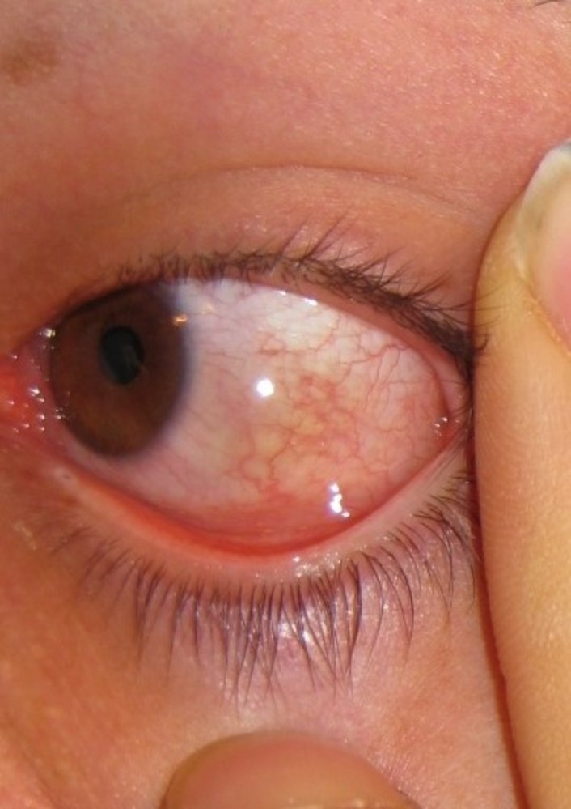
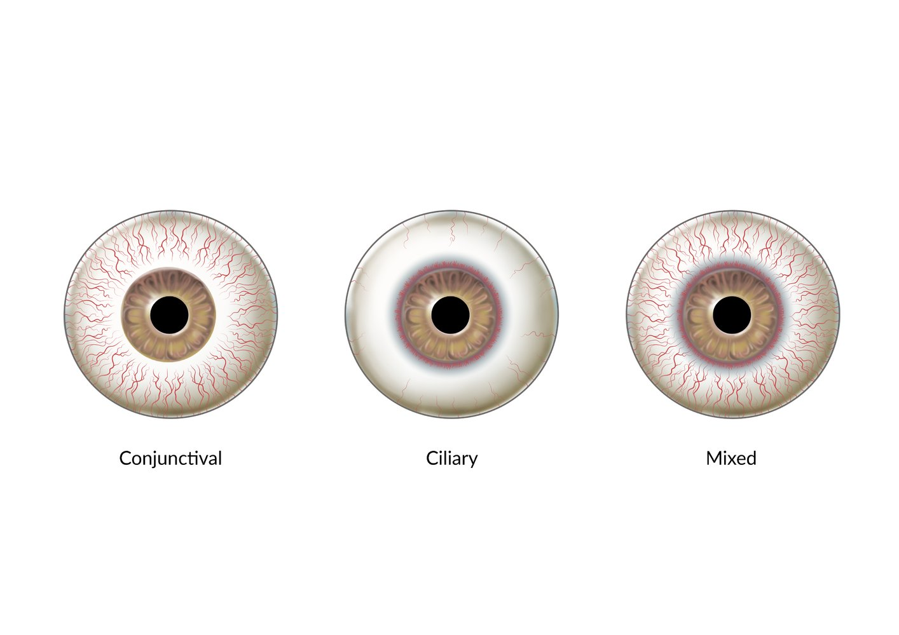

# Overview of conjunctivitis

*Categories: Clinical knowledge > Ophthalmology > Conjunctive, sclera, and cornea > Overview of conjunctivitis*

[Original Article Link](https://coursology-qbank.com/amboss/article/MO0MGT)

---

## Summary

Conjunctivitis is an inflammation of the <u>conjunctiva</u> that is sometimes accompanied by corneal inflammation (<u>keratoconjunctivitis</u>). The etiology of conjunctivitis can be infectious or noninfectious (e.g., <u>allergic conjunctivitis</u>). Common clinical findings include itching, burning, and ocular discharge; the clinical presentation sometimes suggests the underlying etiology (e.g., infections may manifest with <u>purulent</u> discharge, while <u>keratoconjunctivitis sicca</u> is characterized by dry <u>eye</u>). Conjunctivitis is the most common cause of <u>ocular hyperemia</u> but differential diagnoses include <u>keratitis</u>, acute <u>glaucoma</u>, and <u>subconjunctival hemorrhages</u>. Treatment depends upon the underlying cause; <u>viral conjunctivitis</u> is usually <u>self-limited</u> and requires only <u>supportive therapy for conjunctivitis</u>, whereas most types of <u>bacterial conjunctivitis</u> require <u>antibiotics</u>. Treatment of <u>noninfectious conjunctivitis</u> may include behavior changes (e.g., reducing contact <u>lens</u> use), topical treatment, or systemic treatments. If symptoms are severe or recurrent, or complex etiologies are suspected (e.g., autoimmune conditions), patients should be referred to an ophthalmologist early for specialized management. Surgical intervention is rarely necessary.

For more comprehensive information on the diagnosis and <u>management of conjunctivitis</u> subtypes, see “<u>Bacterial conjunctivitis</u>,” “<u>Viral conjunctivitis</u>,” and “<u>Noninfectious conjunctivitis</u>.” For management in <u>newborns</u>, see “<u>Neonatal conjunctivitis</u>.”

---

## Conjunctivitis subtypes

|  Overview of conjunctivitis subtypes in children and adults [[1]](https://coursology-qbank.com/amboss/article/2V1TFf0)[[2]](https://coursology-qbank.com/amboss/article/TV16Ff0)[[3]](https://coursology-qbank.com/amboss/article/SV1yFf0)  |  |  |  |  |  |  |
| --- | --- | --- | --- | --- | --- | --- |
|  | <u>Viral conjunctivitis</u> | <u>Bacterial conjunctivitis</u> |  |  |  <u>Allergic conjunctivitis</u> [[1]](https://coursology-qbank.com/amboss/article/2V1TFf0)[[4]](https://coursology-qbank.com/amboss/article/Me1Mzf0)  |  |
| <u>Acute bacterial conjunctivitis</u> |  <u>Gonococcal conjunctivitis</u> [[5]](https://coursology-qbank.com/amboss/article/2NcT010)  | <u>Trachoma</u> |  |  |  |  |
| Etiology |   * <u>Adenoviruses</u> (most common)  * <u>HSV</u>  * <u>VZV</u>    |   * <u>Streptococcus pneumoniae</u> and <u>Haemophilus influenzae</u> (most common in children)  * <u>Staphylococcus aureus</u> (most common in adults)    |  * <u>Neisseria gonorrhoeae</u>   |  * <u>Chlamydia trachomatis</u> <u>serotypes</u> A–C   |  * <u>IgE-mediated hypersensitivity reaction</u> (type I) against specific <u>allergens</u>   |  |
| Clinical features |   * Unilateral or bilateral  [[2]](https://coursology-qbank.com/amboss/article/TV16Ff0)  * Clear, watery discharge (with mucoid component)  * Increased <u>lacrimation</u> (<u>epiphora</u>)  * Extraocular signs of viral infections (e.g., upper respiratory symptoms, preauricular <u>lymphadenopathy</u>)    |   * Typically unilateral but may be bilateral  * Thick mucopurulent discharge  * Difficulty opening eyes in the morning    |   * Unilateral or bilateral  * <u>Hyperacute conjunctivitis</u>  * Marked <u>eye</u> swelling  * Profuse <u>purulent</u> discharge  * Preauricular <u>lymphadenopathy</u>  * Possibly, corneal infiltrates or <u>ulcers</u>  * May be accompanied by urogenital infection    |   * Unilateral or bilateral  * Often chronic infection  * Active phase   * <u>Conjunctival follicles</u>  * Inflamed upper tarsal <u>conjunctiva</u>  * Cicatricial phase   * <u>Conjunctival</u> scarring  * <u>Corneal ulcers</u> and opacities  * <u>Superficial</u> <u>neovascularization</u> with cellular infiltration (corneal <u>pannus</u>)  * <u>Entropion</u>  * <u>Trichiasis</u>  * May be accompanied by urogenital infection    |   * Bilateral  * Itching  * <u>Conjunctival injection</u>  * Discharge and <u>crust</u> formation  * <u>Chemosis</u>  * Burning or foreign-body sensation    |  |
| Diagnostics |  * <u>Clinical diagnosis</u> (often supported by a history of <u>upper respiratory infection</u>)   |   * <u>Clinical diagnosis</u>  * Obtain <u>conjunctival</u> scrapings and culture (or <u>PCR</u>) in patients with <u>risk factors</u> for severe and/or complicated disease.    |   * <u>Gram stain</u>: intracellular gram-negative <u>diplococci</u>  * Culture: <u>N. gonorrhoeae</u>    |  * <u>Clinical diagnosis</u>   |   * <u>Clinical diagnosis</u>  * <u>Allergy testing</u> (e.g., <u>skin prick test</u>, <u>conjunctival</u> <u>allergen</u> challenge) can confirm the diagnosis.    |  |
| Management |   * Most patients: symptomatic therapy (<u>self-limiting</u> condition)  * <u>Herpes simplex conjunctivitis</u>: topical and/or systemic antivirals    |   * Usually <u>self-limiting</u>  * Provide symptomatic and supportive therapy  * Consider topical <u>broad-spectrum antibiotics</u> (e.g., <u>erythromycin</u> or <u>trimethoprim</u>/<u>polymyxin</u> B).    |   * IV or IM <u>ceftriaxone</u>  * Consider the addition of oral <u>azithromycin</u> or <u>doxycycline</u>.  * Saline lavage    |   * Drug of choice: single oral dose <u>azithromycin</u>  * Alternative (topical or systemic): <u>tetracycline</u> or <u>erythromycin</u>    |   * Avoid exposure to known <u>allergens</u>.  * <u>Eye</u> hygiene  * Consider local <u>antihistamines</u> and mast-cell stabilizers (e.g., <u>ketotifen</u>).  * Specialist management: <u>corticosteroids</u>, <u>calcineurin inhibitors</u>    |  |

Gonococcal conjunctivitis

Trachoma

Bacterial conjunctivitis

Viral conjunctivitis

Allergic conjunctivitis

---

## Clinical features

* Typically nonspecific presentation; common clinical features include: [[3]](https://coursology-qbank.com/amboss/article/SV1yFf0)

* Burning or foreign body sensation

* Itching (most intense in <u>seasonal allergic conjunctivitis</u>)

* Conjunctival injection: <u>conjunctival hyperemia</u> with dilatation of blood vessels → <u>ocular hyperemia</u> and red <u>eye</u>

* Chemosis: <u>edema</u> of the <u>conjunctiva</u> due to <u>conjunctival</u> <u>vein</u> vasodilatation and increased blood flow

* Discharge and <u>crust</u> formation

* <u>Photophobia</u>

* Additional features may be present depending on etiology, including:

* Conjunctival follicle: seen in viral or <u>chlamydial conjunctivitis</u>

* A small, raised lymphoid follicle with a yellowish-white appearance due to <u>hyperplastic</u> tissue

* Vascularization is usually peripheral.

* Located in the palpebral or bulbar <u>conjunctiva</u>

* Preauricular <u>lymphadenopathy</u>: seen in viral or <u>gonococcal conjunctivitis</u>

* Concomitant corneal inflammation (keratoconjunctivitis): seen in viral and nonallergic conjunctivitis

> [!TIP]
> Conjunctivitis is the most common <u>cause of red eye</u> and is usually a <u>clinical diagnosis</u>. [[2]](https://coursology-qbank.com/amboss/article/TV16Ff0)

Chemosis

Conjunctivitis

Viral conjunctivitis

Bacterial conjunctivitis

---

## Treatment

### General principles

* Provide supportive therapy to all patients.

* Start specific treatment if needed based on the suspected cause; see:

* “<u>Bacterial conjunctivitis</u>”

* “<u>Viral conjunctivitis</u>”

* “<u>Noninfectious conjunctivitis</u>”

* Refer to ophthalmology if there are:

* <u>Red flags in conjunctivitis</u>

* Concerns for <u>differential diagnoses of conjunctivitis</u>

* Persistent or recurrent symptoms

> [!TIP]
> Conjunctivitis is usually a <u>self-limited</u> condition and complications (e.g., <u>vision loss</u>, permanent <u>eye</u> damage) are rare. Most patients only require supportive therapy. [[1]](https://coursology-qbank.com/amboss/article/2V1TFf0)

> [!TIP]
> Patient education is vital to prevent conjunctivitis <u>outbreaks</u>.

### Supportive therapy for conjunctivitis [[1]](https://coursology-qbank.com/amboss/article/2V1TFf0)[[2]](https://coursology-qbank.com/amboss/article/TV16Ff0)[[3]](https://coursology-qbank.com/amboss/article/SV1yFf0)

* Apply refrigerated artificial tears as often as needed.

* <u>Eyelid</u> hygiene e.g.,

* Saline <u>irrigation</u>

* Remove <u>eyelid</u> discharge frequently

* Avoiding touching the affected <u>eye</u>

* Wash hands before and after cleaning the <u>eye</u>/applying <u>eye</u> drops

* Compresses (can be warm or cold)

* Advise patients to stop using contact lenses for ≥ 2 weeks. [[6]](https://coursology-qbank.com/amboss/article/AN1Rdh0)

* Educate patients on the <u>prevention of conjunctivitis</u>.

---

## Differential diagnoses

* See “<u>Causes of red eye</u>,” e.g., <u>subconjunctival hemorrhage</u>

* See “<u>Causes of painful red eye</u>” and “<u>Vision-threatening causes of eye pain</u>” for conditions that require urgent ophthalmology consultation for management, e.g., <u>acute angle-closure glaucoma</u> .

* See also “<u>Noninfectious conjunctival conditions</u>.”

Types of ocular hyperemia (red eye)

Angle-closure glaucoma

Subconjunctival hemorrhage

The differential diagnoses listed here are not exhaustive.

---