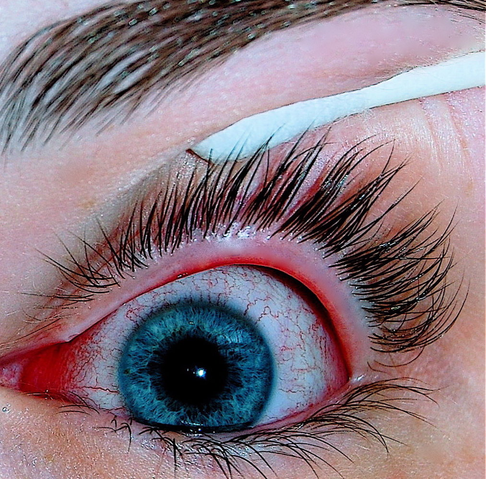
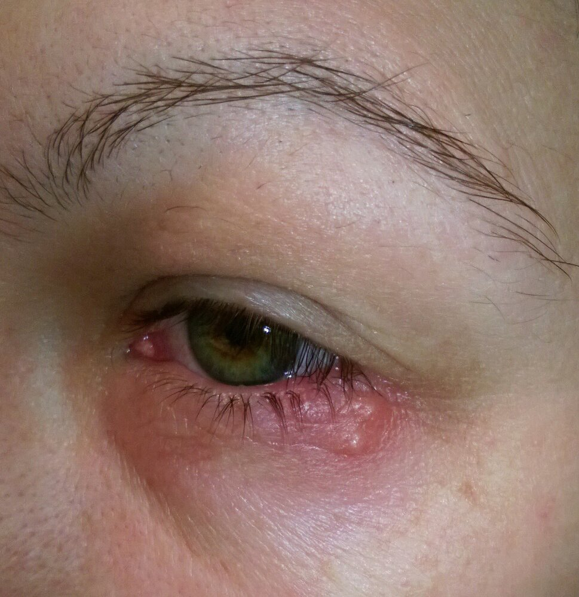
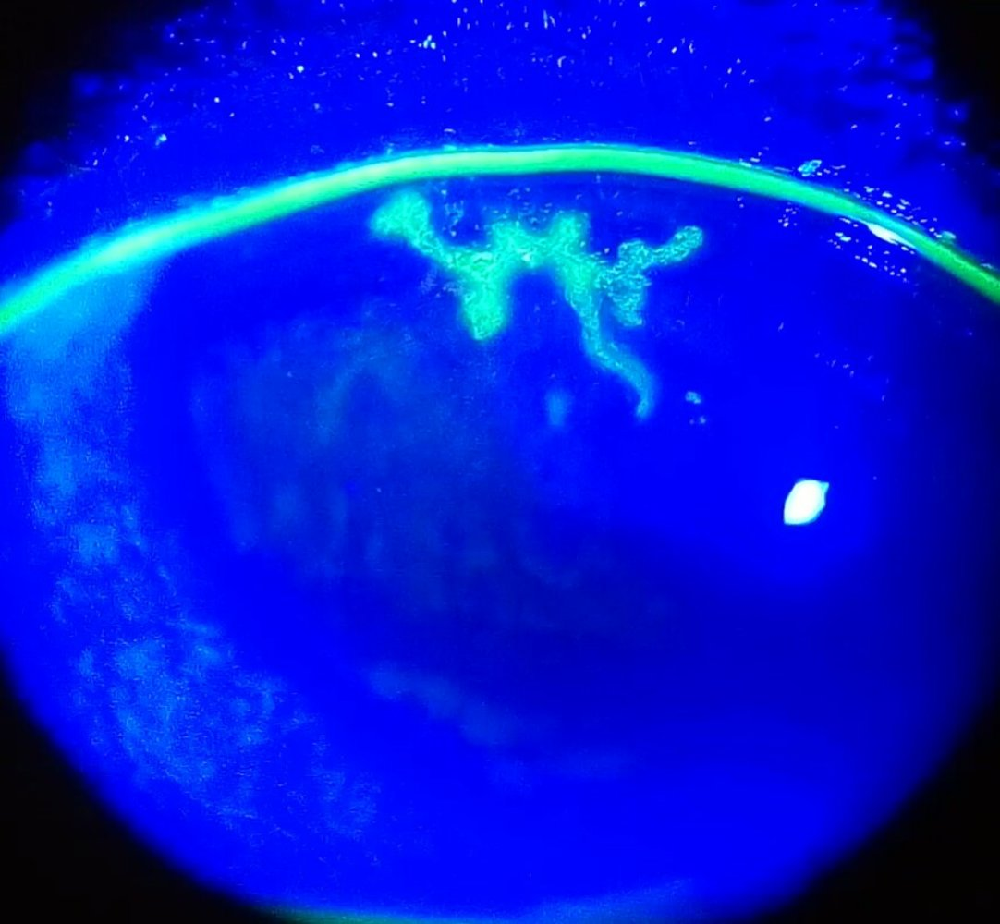
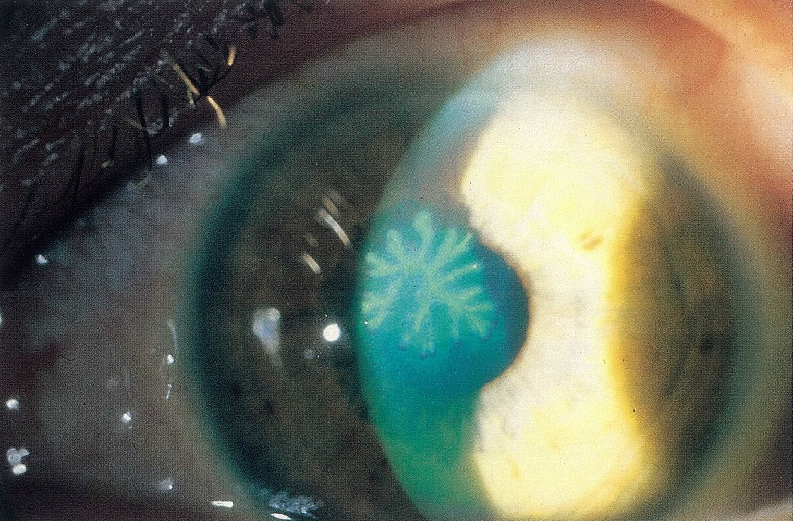

# Viral conjunctivitis

*Categories: Clinical knowledge > Ophthalmology > Conjunctive, sclera, and cornea > Viral conjunctivitis*

[Original Article Link](https://coursology-qbank.com/amboss/article/Ht0KU3)

---

## Summary

Viral <u>conjunctivitis</u> is the most common form of infectious <u>conjunctivitis</u> and is usually caused by <u>adenoviruses</u>. Patients present with <u>clinical features of conjunctivitis</u>, including <u>conjunctival injection</u>, watery discharge, and preauricular <u>lymphadenopathy</u>. Associated clinical features (e.g., <u>vesicular</u> <u>rash</u>, history of <u>upper respiratory tract infection</u>) may help determine the etiology. Diagnostic studies are typically not needed to start management. Treatment is usually supportive, but patients with <u>varicella-zoster conjunctivitis</u> or <u>herpes simplex conjunctivitis</u> (<u>HSV conjunctivitis</u>) are at increased risk of <u>keratitis</u> and should be referred to ophthalmology for management, including antivirals. Prevention measures are advised to limit the spread of infection.

---

## Epidemiology

* Most common type of <u>conjunctivitis</u> (∼ 80% of cases)  [[2]](https://coursology-qbank.com/amboss/article/SV1yFf0)

* <u>Incidence</u> increases during the winter. [[3]](https://coursology-qbank.com/amboss/article/TM16Lh0)

Epidemiological data refers to the US, unless otherwise specified.

---

## Etiology

* <u>Adenoviruses</u> (most common; ; highly contagious)

* <u>Herpes simplex virus</u> (<u>HSV</u>)

* <u>Varicella-zoster virus</u> (<u>VZV</u>)

* <u>Molluscum contagiosum virus</u>

* <u>SARS-CoV-2</u>

* <u>Measles virus</u>

* <u>Picornaviruses</u>, e.g., <u>coxsackievirus</u> and <u>enterovirus</u>  [[5]](https://coursology-qbank.com/amboss/article/0x1eEQ0)

---

## Clinical features

* <u>Clinical features of conjunctivitis</u> include: [[2]](https://coursology-qbank.com/amboss/article/SV1yFf0)

* <u>Conjunctival injection</u>

* <u>Chemosis</u>

* Watery discharge

* Preauricular <u>lymphadenopathy</u>

* Additional clinical features depend on the underlying etiology and include:

* History of an <u>upper respiratory tract infection</u> (<u>URTI</u>) in <u>adenovirus conjunctivitis</u> [[3]](https://coursology-qbank.com/amboss/article/TM16Lh0)

* <u>Vesicular lesions</u> in <u>HSV conjunctivitis</u> and <u>varicella-zoster conjunctivitis</u>

Viral conjunctivitis

---

## Diagnosis

* Viral <u>conjunctivitis</u> is usually a <u>clinical diagnosis</u>. [[4]](https://coursology-qbank.com/amboss/article/2V1TFf0)

* If there is diagnostic uncertainty between viral and <u>bacterial conjunctivitis</u>, consider : [[4]](https://coursology-qbank.com/amboss/article/2V1TFf0)

* <u>Conjunctival</u> swab for culture and staining (see “<u>Diagnostics for bacterial conjunctivitis</u>”)

* Viral diagnostic tests, e.g.: [[6]](https://coursology-qbank.com/amboss/article/wD1hgQ0)

* <u>PCR</u> (preferred)

* Rapid <u>antigen</u> testing

* Viral culture

* <u>Serology</u> for <u>IgM</u>

---

## Management

* Provide <u>supportive therapy for conjunctivitis</u>. [[4]](https://coursology-qbank.com/amboss/article/2V1TFf0)

* Start tailored treatment if necessary, e.g., topical <u>antiviral therapy</u> for <u>HSV conjunctivitis</u>.

* Refer to ophthalmology for any of the following: [[2]](https://coursology-qbank.com/amboss/article/SV1yFf0)[[4]](https://coursology-qbank.com/amboss/article/2V1TFf0)[[7]](https://coursology-qbank.com/amboss/article/TV16Ff0)

* Suspected <u>HSV conjunctivitis</u> or <u>herpes zoster ophthalmicus</u>

* Symptoms that persist for 7–10 days or longer

* <u>Red flag features of conjunctivitis</u>

* Educate patients on <u>preventive measures against infectious conjunctivitis</u>.

> [!TIP]
> Viral <u>conjunctivitis</u> is usually <u>self-limited</u> and only requires supportive therapy. [[8]](https://coursology-qbank.com/amboss/article/EW18Mf0)

---

## Adenovirus conjunctivitis

The most common cause of viral <u>conjunctivitis</u>; clinical presentations vary depending on the subtype. Management for all presentations is supportive.

### Etiology

* Caused by <u>Adenoviridae</u> spp.

* Multiple subtypes affect humans and can cause different clinical presentations.  [[3]](https://coursology-qbank.com/amboss/article/TM16Lh0)[[9]](https://coursology-qbank.com/amboss/article/FHagHN)

### Transmission [[3]](https://coursology-qbank.com/amboss/article/TM16Lh0)[[9]](https://coursology-qbank.com/amboss/article/FHagHN)

* Direct contact (<u>eye</u>, respiratory secretions)

* <u>Fecal-oral route</u>

* Contamination via:

* Objects (e.g., door handles)

* Water (e.g., from swimming pools)

* <u>Nosocomial infection</u>

### Clinical features [[6]](https://coursology-qbank.com/amboss/article/wD1hgQ0)

There are four presentations of <u>adenovirus conjunctivitis</u>. In addition to <u>conjunctivitis symptoms</u>, patients may have had a preceding <u>URTI</u>.

#### Epidemic keratoconjunctivitis [[2]](https://coursology-qbank.com/amboss/article/SV1yFf0)[[4]](https://coursology-qbank.com/amboss/article/2V1TFf0)[[6]](https://coursology-qbank.com/amboss/article/wD1hgQ0)

* Acute phase (typically 7–21 days) [[9]](https://coursology-qbank.com/amboss/article/FHagHN)

* Sudden onset

* Preauricular <u>lymphadenopathy</u>

* Tarsal <u>conjunctival follicles</u> [[3]](https://coursology-qbank.com/amboss/article/TM16Lh0)

* Subconjunctival and <u>petechial</u> hemorrhage

* <u>Epithelial</u> <u>keratitis</u>

* Development of membranes or pseudomembranes on the <u>conjunctiva</u> [[6]](https://coursology-qbank.com/amboss/article/wD1hgQ0)

* Chronic phase

* Corneal involvement  [[9]](https://coursology-qbank.com/amboss/article/FHagHN)

* <u>Symblepharon</u> [[6]](https://coursology-qbank.com/amboss/article/wD1hgQ0)

* Tarsal scarring [[6]](https://coursology-qbank.com/amboss/article/wD1hgQ0)

* Visual impairment

#### Pharyngoconjunctivitis [[2]](https://coursology-qbank.com/amboss/article/SV1yFf0)[[4]](https://coursology-qbank.com/amboss/article/2V1TFf0)

* Sudden onset of high <u>fever</u>

* <u>Pharyngitis</u>

* Acute follicular <u>conjunctivitis</u> (unilateral or bilateral)

* Tender preauricular <u>lymphadenopathy</u>

#### Acute nonspecific follicular conjunctivitis [[6]](https://coursology-qbank.com/amboss/article/wD1hgQ0)

* Mild <u>conjunctivitis</u> with <u>conjunctival injection</u>, mild <u>pain</u>, and <u>lacrimation</u>

* Tarsal follicles

* No corneal involvement

#### Chronic adenovirus conjunctivitis [[6]](https://coursology-qbank.com/amboss/article/wD1hgQ0)

* Recurrent episodes of <u>conjunctival injection</u>, <u>lacrimation</u>, and <u>photophobia</u>

* <u>Conjunctival</u> <u>papillae</u> predominate as opposed to follicles

* Patients typically have a history of viral <u>conjunctivitis</u> in the previous 6–9 months.

### Diagnostics

* Primarily a <u>clinical diagnosis</u> [[2]](https://coursology-qbank.com/amboss/article/SV1yFf0)[[4]](https://coursology-qbank.com/amboss/article/2V1TFf0)

* A <u>rapid antigen test</u> is available; consider if there is diagnostic uncertainty, to avoid unnecessary <u>antibiotic</u> use. [[6]](https://coursology-qbank.com/amboss/article/wD1hgQ0)

* Other <u>confirmatory tests</u> include: [[3]](https://coursology-qbank.com/amboss/article/TM16Lh0)[[4]](https://coursology-qbank.com/amboss/article/2V1TFf0)

* <u>PCR</u>

* <u>Enzyme immunoassay</u>

* Viral culture

* Raman spectroscopy (of tears)

* Assessment of <u>hyaluronic acid</u> levels in tears

### Treatment [[2]](https://coursology-qbank.com/amboss/article/SV1yFf0)[[4]](https://coursology-qbank.com/amboss/article/2V1TFf0)[[7]](https://coursology-qbank.com/amboss/article/TV16Ff0)

* Symptomatic therapy may include: [[4]](https://coursology-qbank.com/amboss/article/2V1TFf0)

* <u>Supportive therapy for conjunctivitis</u> (e.g., artificial tears, cold compresses)

* <u>Oral analgesics</u> (e.g., <u>NSAIDs</u>)

* Topical <u>antihistamines</u> for severe <u>pruritus</u>

* <u>Topical steroids</u> to relieve symptoms and reduce long-term complications; discuss use with ophthalmology.  [[4]](https://coursology-qbank.com/amboss/article/2V1TFf0)[[6]](https://coursology-qbank.com/amboss/article/wD1hgQ0)

* Refer patients to ophthalmology if they have: [[4]](https://coursology-qbank.com/amboss/article/2V1TFf0)

* Severe disease with either:

* Corneal <u>epithelial</u> <u>ulceration</u>

* Membranous <u>conjunctivitis</u>

* <u>Vision</u> changes

* Ongoing symptoms after 2–3 weeks of supportive treatment

* Educate patients on <u>preventive measures against infectious conjunctivitis</u>; <u>adenovirus conjunctivitis</u> is highly infectious. [[4]](https://coursology-qbank.com/amboss/article/2V1TFf0)

> [!WARNING]
> <u>Adenovirus conjunctivitis</u> and <u>HSV conjunctivitis</u> can manifest very similarly; use <u>topical steroids</u> with extreme caution as <u>steroids</u> worsen <u>HSV</u> disease. [[10]](https://coursology-qbank.com/amboss/article/Bw1zOQ0)

---

## Herpes simplex conjunctivitis

<u>HSV conjunctivitis</u> is usually caused by subtype <u>HSV-1</u>; it is transmitted through close contact and <u>inoculates</u> the <u>conjunctiva</u>. In <u>neonates</u>, <u>HSV</u> can cause severe symptoms; for diagnosis and management see “<u>Neonatal HSV conjunctivitis</u>.” [[11]](https://coursology-qbank.com/amboss/article/Ef18LT0)

### Clinical features [[4]](https://coursology-qbank.com/amboss/article/2V1TFf0)

* Typically unilateral

* Thin, watery discharge

* <u>Pain</u>

* <u>Vesicular</u> <u>blepharitis</u>

* Dendritic <u>epithelial</u> <u>keratitis</u> of <u>cornea</u> or <u>conjunctiva</u>

* May be accompanied by:

* Preauricular <u>lymphadenopathy</u>

* <u>Ulcer</u>(s) or <u>vesicular</u> <u>rash</u> on the <u>eyelid</u>

* Potential sequelae: <u>corneal endotheliitis</u>, <u>trabeculitis</u>, or <u>uveitis</u>

> [!WARNING]
> <u>HSV conjunctivitis</u> may manifest without a periocular <u>rash</u>; in these cases, it may be hard to distinguish from other forms of viral <u>conjunctivitis</u>, e.g., <u>adenovirus conjunctivitis</u>. [[10]](https://coursology-qbank.com/amboss/article/Bw1zOQ0)

Herpes simplex

Herpes simplex keratitis

Herpes simplex keratitis

### Diagnostics

* Primarily a <u>clinical diagnosis</u>

* Consider viral studies (e.g., <u>enzyme immunoassay</u>, <u>PCR</u>, viral cultures) if there is diagnostic uncertainty or to evaluate for antiviral susceptibilities. [[4]](https://coursology-qbank.com/amboss/article/2V1TFf0)[[11]](https://coursology-qbank.com/amboss/article/Ef18LT0)

### Treatment [[4]](https://coursology-qbank.com/amboss/article/2V1TFf0)

* Provide <u>supportive treatment of conjunctivitis</u>.

* Start topical antivirals, e.g.:

* <u>Ganciclovir</u> (<u>off-label</u>) DOSAGE  [[4]](https://coursology-qbank.com/amboss/article/2V1TFf0)

* OR trifluridine (<u>off-label</u>) DOSAGE   [[4]](https://coursology-qbank.com/amboss/article/2V1TFf0)

* Suspected <u>HSV keratitis</u>: Give oral antivirals in addition to topical antivirals. 

* <u>Acyclovir</u> (<u>off-label</u>) DOSAGE [[4]](https://coursology-qbank.com/amboss/article/2V1TFf0)

* OR <u>valacyclovir</u> (<u>off-label</u>) DOSAGE [[4]](https://coursology-qbank.com/amboss/article/2V1TFf0)

* OR <u>famciclovir</u> (<u>off-label</u>) DOSAGE

* Educate patients on <u>preventive measures against infectious conjunctivitis</u>.

> [!WARNING]
> <u>Topical steroids</u> can worsen <u>HSV infection</u> and should be avoided. [[4]](https://coursology-qbank.com/amboss/article/2V1TFf0)

> [!TIP]
> Long-term suppressive <u>antiviral therapy</u> may decrease the risk of recurrent <u>HSV keratitis</u>. [[4]](https://coursology-qbank.com/amboss/article/2V1TFf0)

---