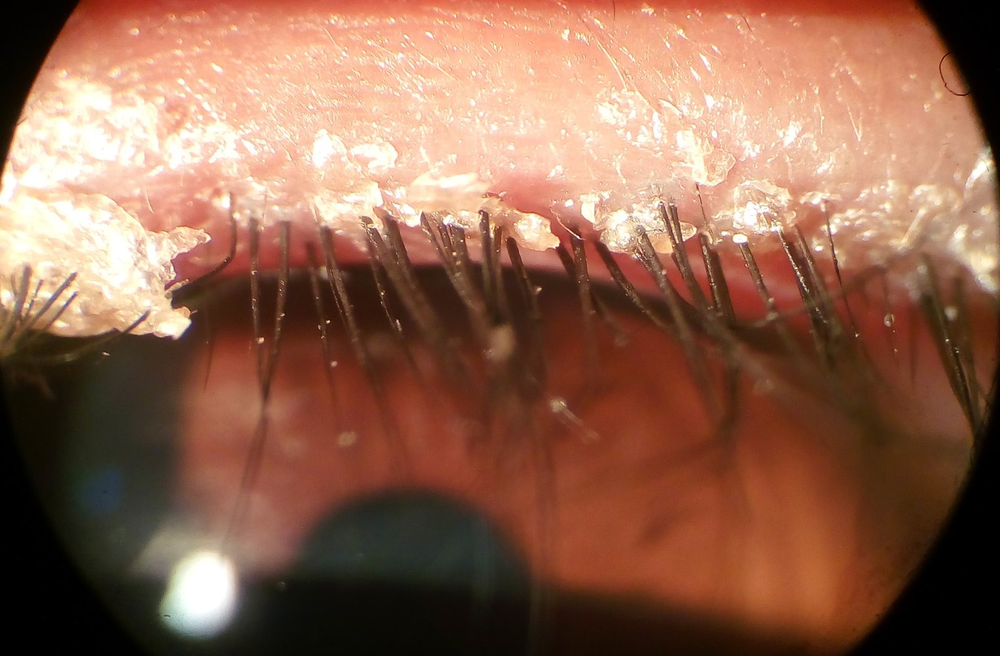
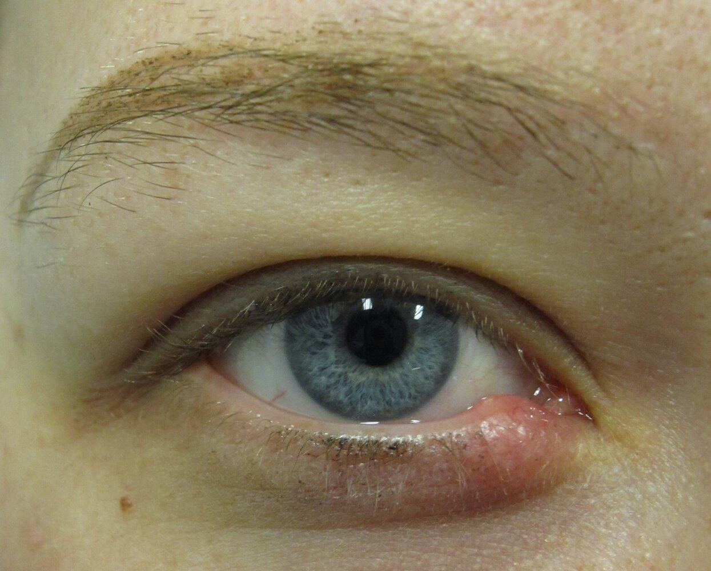
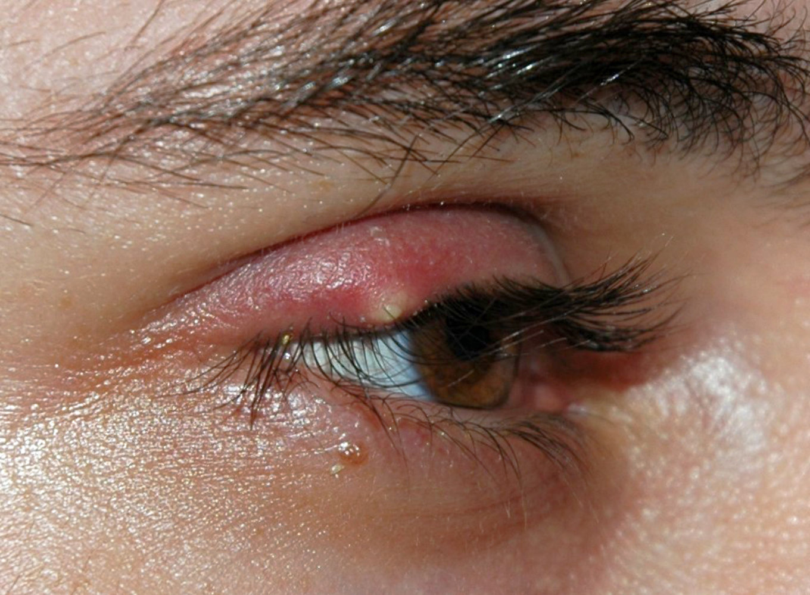
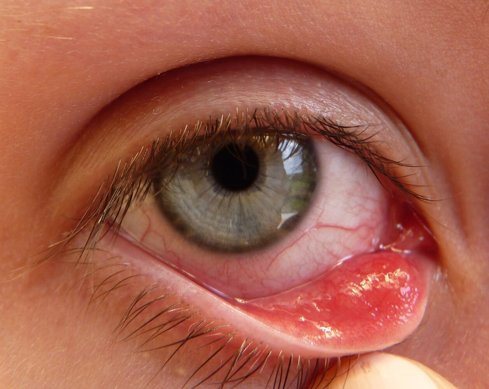
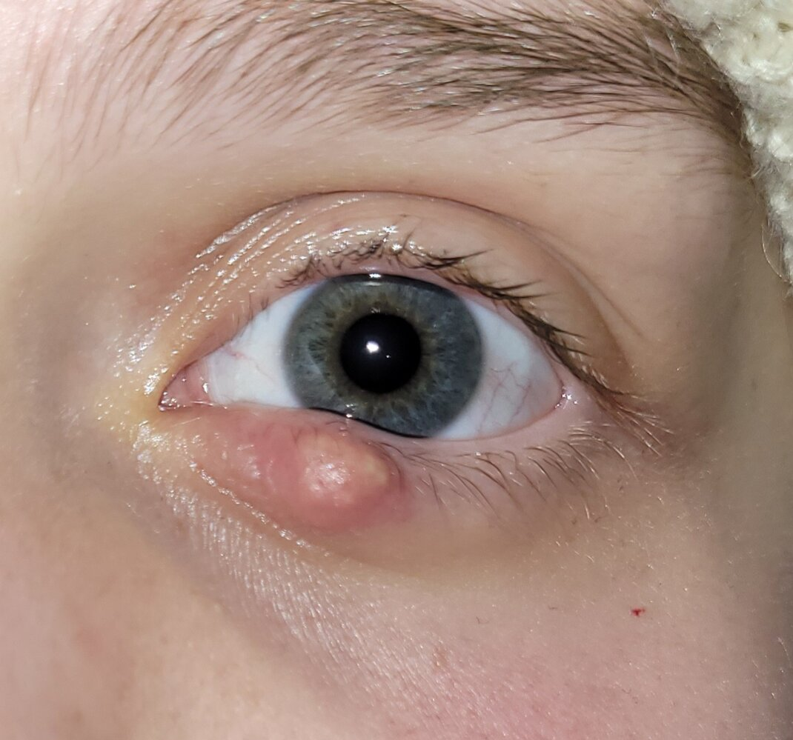

# Inflammation of the eyelids

*Categories: Clinical knowledge > Ophthalmology > Eyelid and lacrimal apparatus > Inflammation of the eyelids*

[Original Article Link](https://coursology-qbank.com/amboss/article/NO0-sT)

---

## Summary

Common inflammatory conditions of the <u>eyelid</u> include <u>blepharitis</u>, <u>hordeola</u> (<u>styes</u>), <u>chalazia</u>, and <u>eyelid</u> dermatitis. <u>Blepharitis</u> is a chronic condition that manifests with redness, swelling, crusty <u>scaling</u> and/or oily deposits on the <u>eyelid</u> margins. It is typically caused by <u>staphylococcal infection</u>, <u>seborrheic dermatitis</u>, or <u>meibomian gland</u> dysfunction. A <u>hordeolum</u> is an <u>acute inflammation</u> of the <u>meibomian glands</u> (<u>internal hordeolum</u>) or the Moll or Zeis glands (<u>external hordeolum</u>). It manifests suddenly as a painful, <u>erythematous</u>, <u>pus</u>-filled <u>nodule</u> and is typically caused by acute <u>staphylococcal infection</u>. A <u>chalazion</u> is a focal noninfectious lipogranulomatous swelling of the Zeis or <u>meibomian glands</u> and manifests as a slow-growing, firm, painless, rubbery <u>nodule</u>; it can develop from either <u>blepharitis</u> or a <u>hordeolum</u>. Diagnosis of these conditions is clinical and includes ruling out other <u>emergency causes of red eye</u>. Initial management is conservative, comprising warm compresses and <u>eyelid</u> hygiene. If symptoms persist or recur, patients should be referred to ophthalmology for additional management, which may include <u>antibiotics</u> and/or procedural intervention such as <u>incision</u> and <u>curettage</u>. Management of <u>eyelid</u> dermatitis (e.g., <u>contact dermatitis</u>, <u>atopic dermatitis</u>, <u>seborrheic dermatitis</u>) is tailored to the specific condition.

---

## Blepharitis

### Definition [[1]](https://coursology-qbank.com/amboss/article/LRdwnp0)

* <u>Blepharitis</u> is a common <u>eyelid</u> condition that manifests as a chronic and/or recurrent inflammation with <u>scaling</u> of the <u>eyelid</u> margins.

* Classified according to location

* <u>Anterior</u> <u>blepharitis</u>: inflammation of the <u>anterior</u> margin of the eyelids, involving the <u>skin</u>, eyelashes, and follicles

* <u>Posterior</u> <u>blepharitis</u>: inflammation of the <u>posterior</u> margin of the eyelids; associated with <u>meibomian gland</u> dysfunction

### Etiology [[1]](https://coursology-qbank.com/amboss/article/LRdwnp0)[[2]](https://coursology-qbank.com/amboss/article/9DWNgn0)

* <u>Anterior</u> <u>blepharitis</u>

* <u>Staphylococci</u> (most common causative <u>pathogen</u>)  [[1]](https://coursology-qbank.com/amboss/article/LRdwnp0)

* <u>Seborrheic dermatitis</u>

* <u>Posterior</u> <u>blepharitis</u>: <u>meibomian gland</u> dysfunction, e.g.: 

* Anatomical obstruction

* Hypersecretion

* Other <u>risk factors</u> and associated conditions

* Other infective etiologies: viral (e.g., <u>herpes simplex</u> or <u>varicella zoster</u>) or parasitic (<u>demodicosis</u> or <u>phthiriasis palpebrarum</u>)

* Other <u>dermatological diseases</u>: <u>rosacea</u>, <u>atopic dermatitis</u>, <u>psoriasis</u>

* <u>Allergic reactions</u> and irritation from smoke, dust, dry indoor climate, chemicals, cosmetics, drug toxicity

* Other ocular diseases: dry <u>eye</u> syndromes (e.g., <u>Sjogren syndrome</u>), <u>giant papillary conjunctivitis</u>

### Clinical features [[1]](https://coursology-qbank.com/amboss/article/LRdwnp0)[[3]](https://coursology-qbank.com/amboss/article/GzWB8L0)[[4]](https://coursology-qbank.com/amboss/article/tcdXVK0)

* Chronic or recurrent redness and swelling of the <u>eyelid</u> margins

* Crusty <u>scaling</u> and/or oily deposits on the <u>eyelid</u> margin and eyelashes

* A ringlike collection around the eyelashes (<u>collarette</u>) is typical of <u>staphylococcal disease</u>.

* A smooth cylindrical collection at the base of the eyelash is typical of <u>Demodex</u>.

* <u>Ulcerations</u> can occur with severe <u>staphylococcal disease</u> (ulcerative <u>blepharitis</u>).

* <u>Eye</u> irritation and visual abnormalities

* <u>Pain</u>

* Itchiness

* Foreign body sensation, watering of the <u>eye</u>

* <u>Photophobia</u>, blurred <u>vision</u> [[5]](https://coursology-qbank.com/amboss/article/H1dKRK0)

* Worsening of symptoms in the morning

Blepharitis

### Management [[1]](https://coursology-qbank.com/amboss/article/LRdwnp0)[[5]](https://coursology-qbank.com/amboss/article/H1dKRK0)

* Diagnosis is clinical.

* Refer urgently to ophthalmology for any of the following:

* Suspected <u>emergency cause of red eye</u> (e.g., <u>preseptal cellulitis</u>)

* <u>Vision</u> impairment

* Moderate to severe <u>pain</u>

* Severe, chronic, or recurrent symptoms

* Initial management: supportive therapy

* Warm <u>eyelid</u> compress for 15 minutes, 1–2 times daily  [[1]](https://coursology-qbank.com/amboss/article/LRdwnp0)[[5]](https://coursology-qbank.com/amboss/article/H1dKRK0)

* <u>Eyelid</u> cleansing with massage, 1–2 times daily  [[1]](https://coursology-qbank.com/amboss/article/LRdwnp0)

* Artificial tears as needed for dry eyes (preservative-free formulation if using > 4 times per day) [[1]](https://coursology-qbank.com/amboss/article/LRdwnp0)

* Explain to patient that the condition is chronic and long-term supportive therapy is necessary.

* Refractory symptoms: Refer to ophthalmology.

> [!WARNING]
> Patients with advanced <u>glaucoma</u> should avoid applying significant pressure to the eyelids, as this may increase <u>intraocular pressure</u>. [[1]](https://coursology-qbank.com/amboss/article/LRdwnp0)

### Complications [[1]](https://coursology-qbank.com/amboss/article/LRdwnp0)[[4]](https://coursology-qbank.com/amboss/article/tcdXVK0)

* <u>Hordeolum</u> and <u>chalazion</u>

* <u>Conjunctivitis</u>

* <u>Keratitis</u>

* <u>Ectropion</u>

* <u>Entropion</u>

* <u>Trichiasis</u>

* <u>Madarosis</u>

* <u>Preseptal cellulitis</u> or <u>orbital cellulitis</u> [[6]](https://coursology-qbank.com/amboss/article/fs1k8R0)

---

## Hordeolum and chalazion

### Definition [[4]](https://coursology-qbank.com/amboss/article/tcdXVK0)[[7]](https://coursology-qbank.com/amboss/article/ZVdZGK0)

* <u>Hordeolum</u> (<u>stye</u>)

* A common, <u>acute inflammation</u> of one of the sweat and <u>sebaceous glands</u> around eyelash follicles

* Classified according to location

* <u>External hordeolum</u>: inflammation of a Moll or Zeis gland on the <u>anterior</u> lid margin [[8]](https://coursology-qbank.com/amboss/article/bRdHlp0)

* <u>Internal hordeolum</u>: inflammation of a <u>meibomian gland</u> on the <u>posterior</u> <u>eyelid</u> (palpebral <u>conjunctiva</u>)

* <u>Chalazion</u>: a focal lipogranulomatous swelling of one of the <u>sebaceous glands</u> around eyelash follicles  [[9]](https://coursology-qbank.com/amboss/article/ORdIMp0)

### Etiology [[10]](https://coursology-qbank.com/amboss/article/nRd7np0)

* Primary causes

* <u>Hordeolum</u>: infection with <u>Staphylococcus aureus</u>

* <u>Chalazion</u>: obstruction of a <u>sebaceous gland</u> (Zeis or <u>meibomian gland</u>)

* <u>Risk factors</u>: similar for both <u>hordeolum</u> and <u>chalazion</u> [[8]](https://coursology-qbank.com/amboss/article/bRdHlp0)[[11]](https://coursology-qbank.com/amboss/article/MRdMnp0)

* Ocular: poor <u>eyelid</u> hygiene, chronic <u>blepharitis</u>, <u>eyelid trauma</u>, <u>meibomian gland</u> dysfunction

* Dermatologic: <u>rosacea</u>, <u>seborrheic dermatitis</u>

* <u>Demodicosis</u>

### Clinical features [[4]](https://coursology-qbank.com/amboss/article/tcdXVK0)[[6]](https://coursology-qbank.com/amboss/article/fs1k8R0)[[7]](https://coursology-qbank.com/amboss/article/ZVdZGK0)

|  Clinical features of hordeola and chalazia [[4]](https://coursology-qbank.com/amboss/article/tcdXVK0)[[6]](https://coursology-qbank.com/amboss/article/fs1k8R0)[[7]](https://coursology-qbank.com/amboss/article/ZVdZGK0)  |  |  |
| --- | --- | --- |
|  | <u>Hordeola</u> | <u>Chalazia</u> |
| Onset |  * Sudden   |  * Slow-growing (chronic)   |
| Appearance |  * Painful, <u>erythematous</u>, <u>pus</u>-filled <u>nodule</u> on the <u>eyelid</u> with associated <u>edema</u>   [[4]](https://coursology-qbank.com/amboss/article/tcdXVK0)   |   * Firm, painless, rubbery <u>nodule</u> on the <u>eyelid</u>    [[5]](https://coursology-qbank.com/amboss/article/H1dKRK0)[[12]](https://coursology-qbank.com/amboss/article/GcdBdK0)  * Everting the <u>eyelid</u> may allow for better visualization of the lesion.   [[3]](https://coursology-qbank.com/amboss/article/GzWB8L0)    |
| Other |  * May spontaneously rupture with <u>purulent</u> discharge   |   * Heaviness of the <u>eyelid</u>  * Can cause visual disturbances, if large enough  [[7]](https://coursology-qbank.com/amboss/article/ZVdZGK0)    |

> [!TIP]
> An <u>internal hordeolum</u> can progress to form a <u>chalazion</u>. [[7]](https://coursology-qbank.com/amboss/article/ZVdZGK0)

Internal hordeolum

External hordeolum

Chalazion

Chalazion

### Management [[2]](https://coursology-qbank.com/amboss/article/9DWNgn0)[[3]](https://coursology-qbank.com/amboss/article/GzWB8L0)[[7]](https://coursology-qbank.com/amboss/article/ZVdZGK0)

* Diagnosis is clinical.

* Refer urgently to ophthalmology if an <u>emergency cause of red eye</u> (e.g., <u>preseptal cellulitis</u>) is suspected.

* <u>Conservative management</u>: <u>Hordeola</u> typically resolve within 2 weeks; <u>chalazia</u> typically resolve in a month or more. [[3]](https://coursology-qbank.com/amboss/article/GzWB8L0)[[7]](https://coursology-qbank.com/amboss/article/ZVdZGK0)

* Gentle massage with a warm compress for 10–15 minutes, 3–5 times daily.  [[3]](https://coursology-qbank.com/amboss/article/GzWB8L0)[[6]](https://coursology-qbank.com/amboss/article/fs1k8R0)

* Regular <u>eyelid</u> hygiene

* If symptoms persist or recur, refer to ophthalmology for additional management. This may include:

* Topical <u>antibiotics</u> (e.g., <u>bacitracin</u>, <u>erythromycin</u>) +/- <u>topical corticosteroids</u>

* Oral <u>antibiotics</u> (e.g., <u>doxycycline</u>)

* Procedural intervention, e.g.:

* <u>Incision and drainage</u> or <u>curettage</u>

* Intralesional <u>steroid</u> injection for a <u>chalazion</u>

* <u>Biopsy</u>  [[7]](https://coursology-qbank.com/amboss/article/ZVdZGK0)

> [!TIP]
> Persistent or recurrent <u>chalazion</u> may be a sign of a <u>meibomian gland</u> <u>carcinoma</u> (a <u>sebaceous carcinoma</u>). <u>Chalazion</u> may also clinically resemble a <u>basal cell carcinoma</u>. [[7]](https://coursology-qbank.com/amboss/article/ZVdZGK0)

### Complications [[6]](https://coursology-qbank.com/amboss/article/fs1k8R0)

* <u>Preseptal cellulitis</u>

* <u>Orbital cellulitis</u>

---