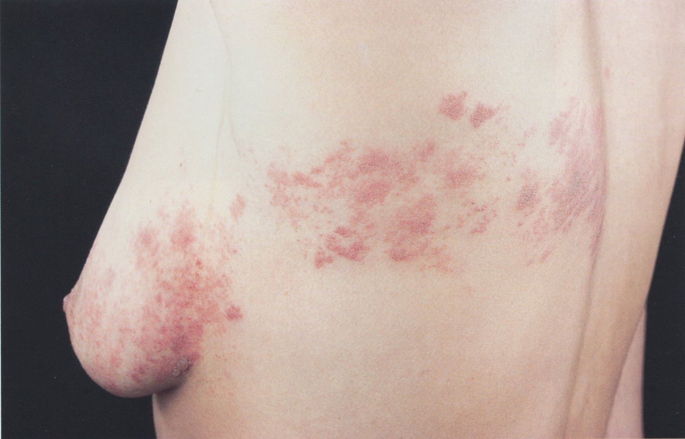
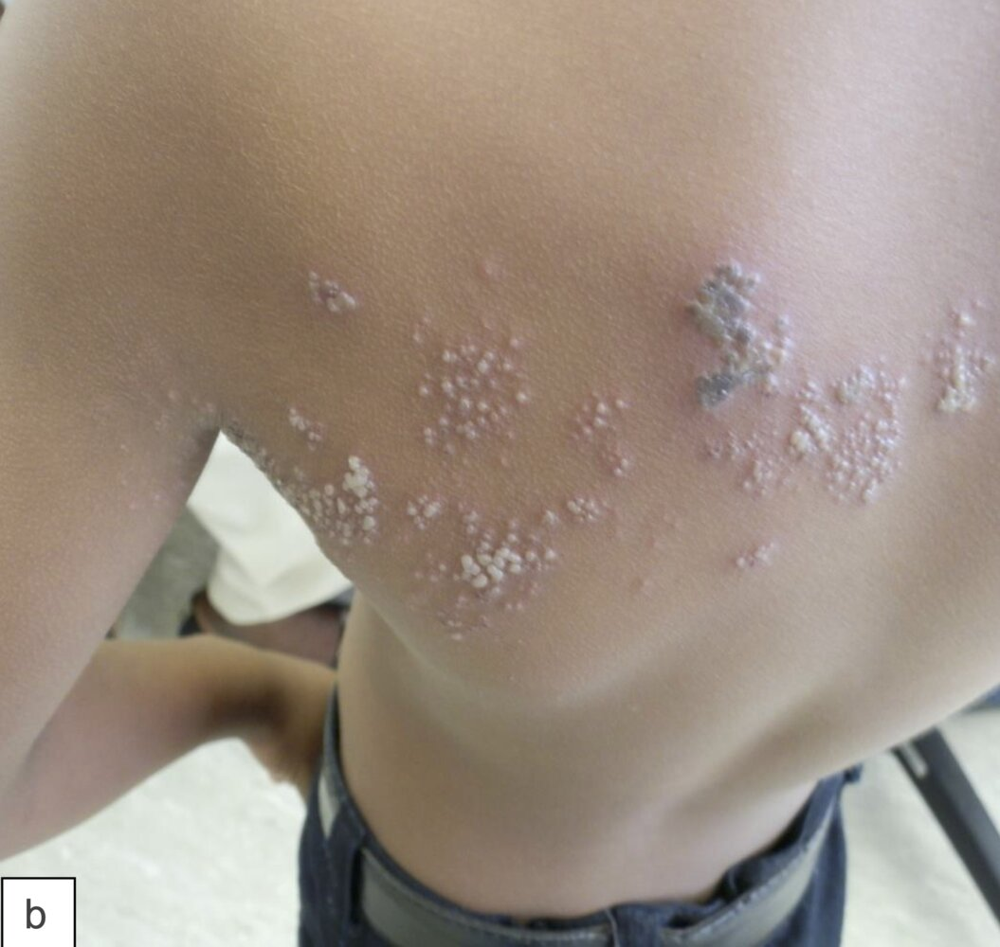
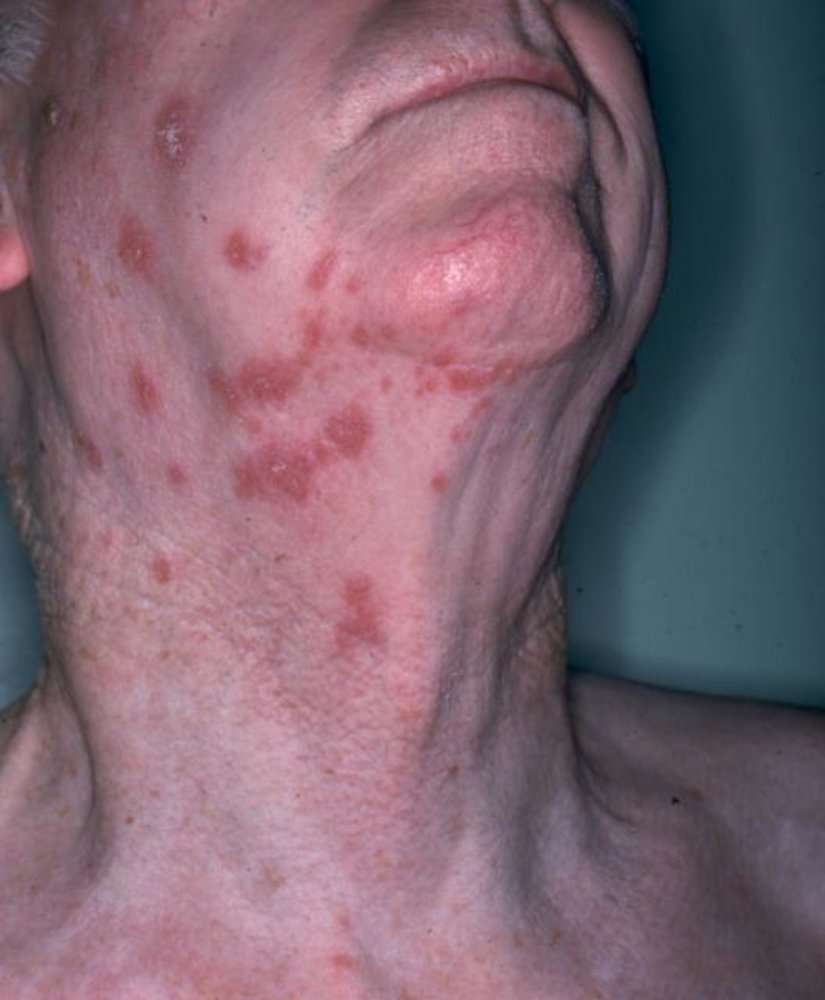
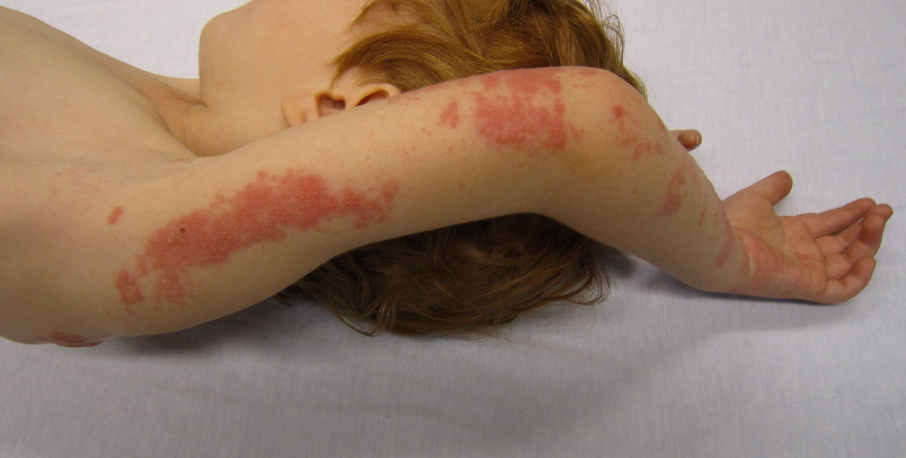
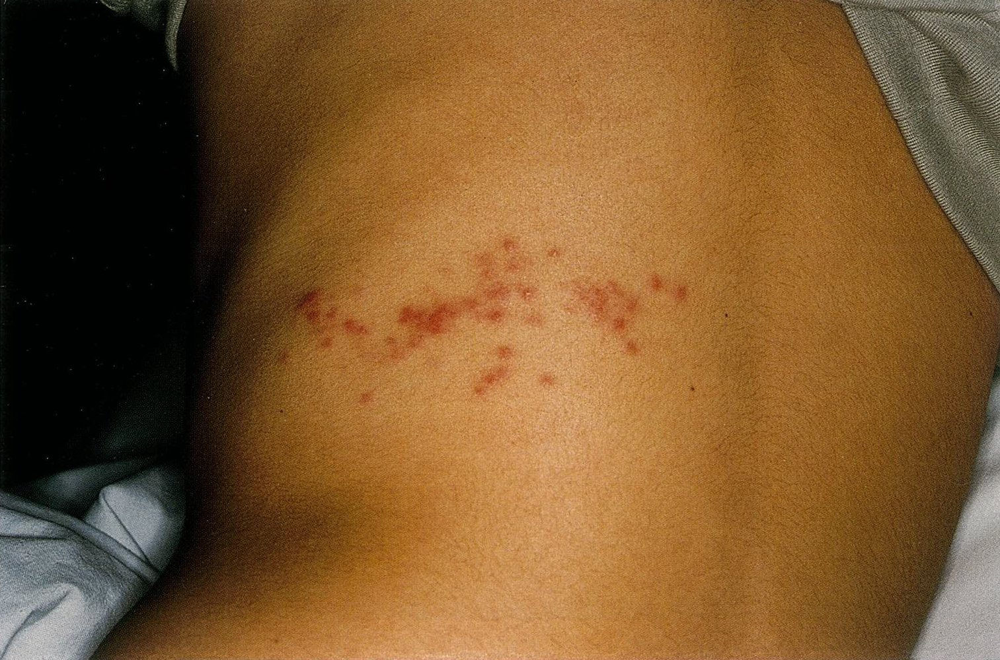
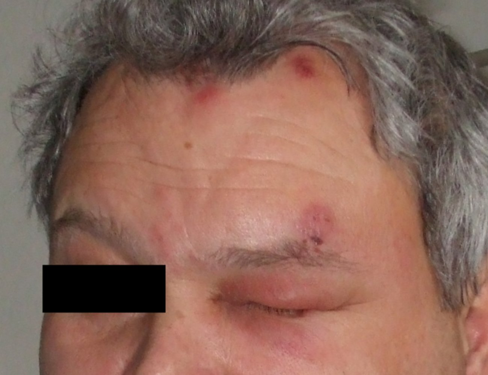
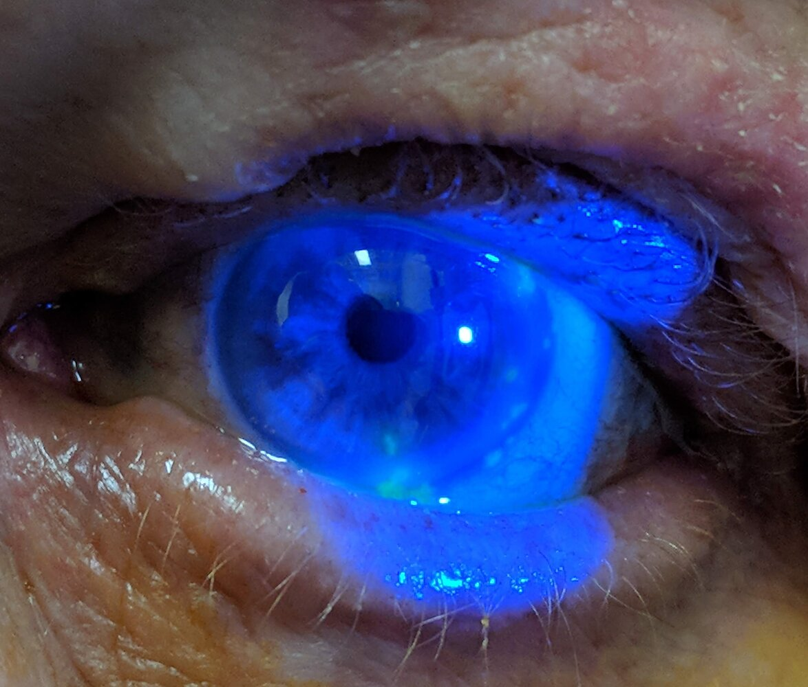
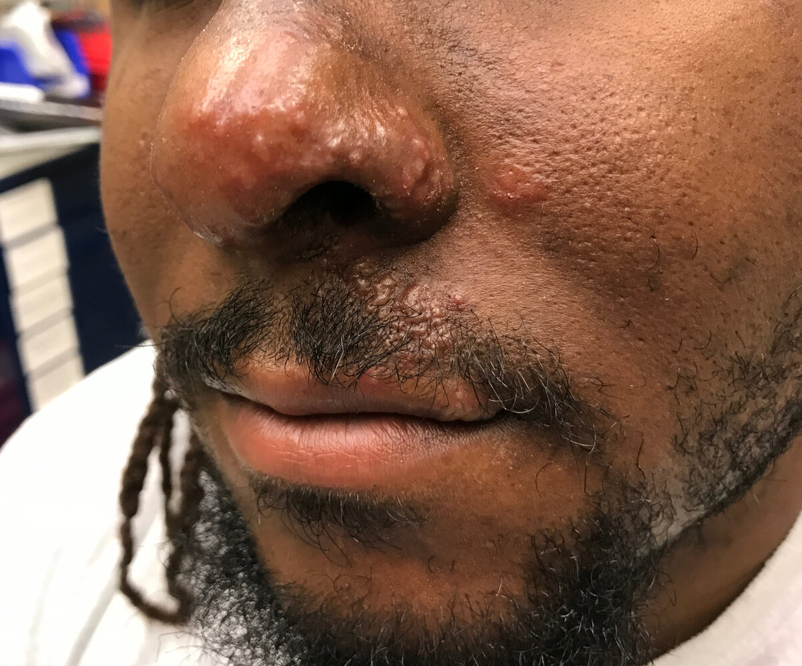
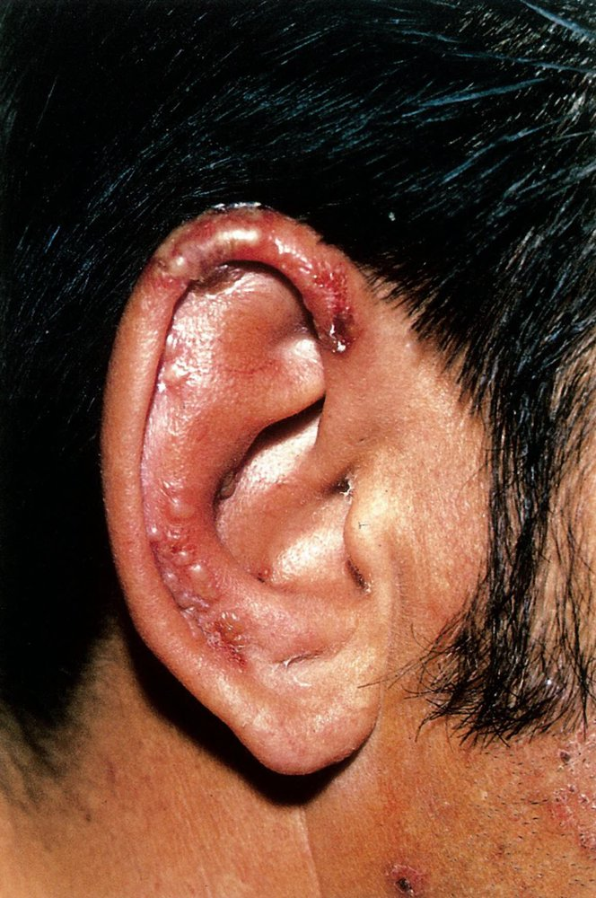
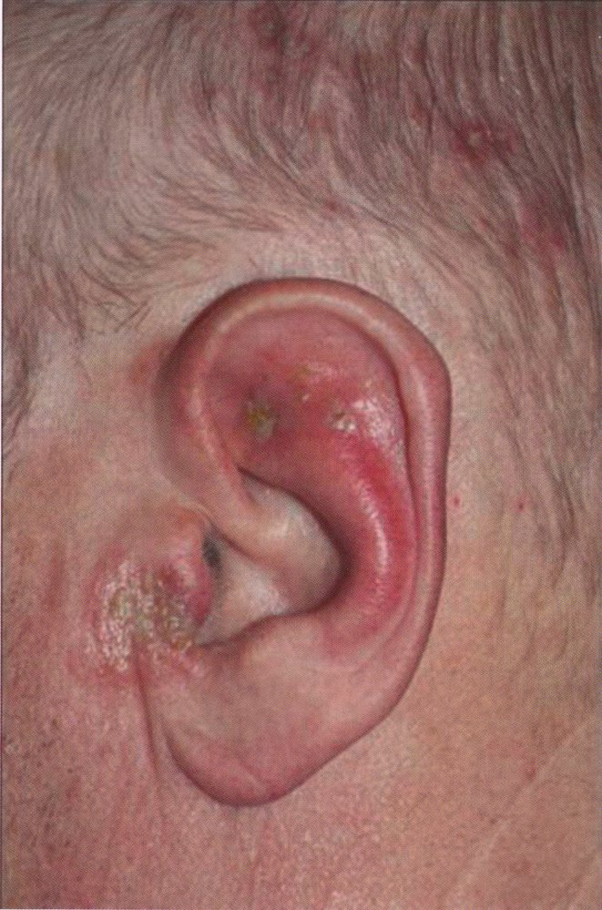

# Shingles

*Categories: Clinical knowledge > Ophthalmology > Eyelid and lacrimal apparatus > Shingles*

[Original Article Link](https://coursology-qbank.com/amboss/article/HR0Kof)

---

## Summary

Shingles (herpes zoster) is a <u>dermatomal</u> <u>rash</u> with painful <u>blistering</u> that is caused by the reactivation of the <u>varicella-zoster virus</u> (<u>VZV</u>). The initial infection with <u>VZV</u> usually occurs early in life, presenting as <u>chickenpox</u> (<u>varicella</u>), after which the <u>virus</u> remains dormant in the <u>dorsal root ganglia</u>. <u>Immunocompromised individuals</u> are at increased risk of <u>VZV</u> reactivation. Shingles is generally a <u>clinical diagnosis</u>, although further testing (e.g., <u>PCR</u>) may be indicated in unclear cases. Treatment with <u>antiviral drugs</u>, such as <u>acyclovir</u>, is usually effective. Potential complications include <u>encephalitis</u> and, particularly in the elderly population, painful <u>postherpetic neuralgia</u>. <u>VZV</u> may also affect the <u>cranial nerves</u>. Involvement of the <u>trigeminal nerve</u> may cause visual impairment up to blindness (<u>herpes zoster ophthalmicus</u>), while involvement of the facial and vestibulocochlear nerves can cause facial <u>paralysis</u> and <u>hearing loss</u> (<u>herpes zoster oticus</u>). These presentations, in particular, require urgent medical attention to prevent serious complications. The <u>recombinant zoster vaccine</u> is recommended for the <u>prevention of herpes zoster</u> in all individuals ≥ 50 years of age and <u>immunocompromised individuals</u> ≥ 19 years of age.

---

## Epidemiology

* <u>Incidence</u> [[1]](https://coursology-qbank.com/amboss/article/DP01ST)

* Overall: 2.5–4/1,000 per year in the US [[2]](https://coursology-qbank.com/amboss/article/jZX_Y9)

* Among individuals ≥ 60 years old: 10/1,000 per year in the US

* <u>Incidence</u> of recurrence: unknown

* <u>Prevalence</u>: increasing among adults in the US [[1]](https://coursology-qbank.com/amboss/article/DP01ST)[[3]](https://coursology-qbank.com/amboss/article/QZXuY9)

* Sex: <u>♀</u> > <u>♂</u> [[2]](https://coursology-qbank.com/amboss/article/jZX_Y9)

Epidemiological data refers to the US, unless otherwise specified.

---

## Etiology

* Causative <u>pathogen</u>: : <u>varicella-zoster virus</u> (<u>VZV</u>)

* Transmission: via respiratory droplets and direct contact with <u>VZV</u>-infected <u>vesicular</u> fluid, causing <u>chickenpox</u> in those infected

* <u>Risk factors</u> for <u>VZV</u> reactivation: Reactivation typically occurs in <u>immunocompromised individuals</u>. 

* Decline in immune function with advancing age

* <u>Malignancy</u>

* <u>HIV infection</u>

* <u>Immunosuppressive therapy</u>

* <u>Malnutrition</u>

* Chronic <u>stress</u>

---

## Pathophysiology

* Primary infection (<u>chickenpox</u>): respiratory transmission → <u>VZV</u> <u>inoculates</u> the lymphoid tissue of the <u>nasopharynx</u> and, subsequently, regional lymphoid tissue → <u>viremia</u> and <u>chickenpox</u> → recovery from <u>chickenpox</u>, but <u>virus</u> remains dormant in <u>dorsal root ganglia</u> (unless reactivated → recurrent infection)

* Reactivation (shingles): <u>VZV</u> reactivated, often many years after the primary infection (e.g., especially in <u>immunocompromised</u> individuals) → <u>virus</u> replicates in the <u>dorsal root ganglia</u> → travels through peripheral sensory nerves to the <u>skin</u> → shingles (less contagious than primary infection)  [[4]](https://coursology-qbank.com/amboss/article/iZXJY9)

---

## Clinical features

* Main symptoms: <u>dermatomal</u> distribution, typically affecting 1–3 <u>dermatomes</u> on one side of the body (most commonly affects the cervical, <u>trigeminal</u>, thoracic, and lumbar <u>dermatomes</u>) ;   [[5]](https://coursology-qbank.com/amboss/article/_4b5NF)

* <u>Pain</u> [[5]](https://coursology-qbank.com/amboss/article/_4b5NF)

* The most frequent symptom and may precede the <u>rash</u>

* Usually described as “burning”, “throbbing”, or “stabbing”

* <u>Allodynia</u> may occur.

* <u>Erythematous</u> <u>maculopapular rash</u> that quickly evolves into <u>vesicular lesions</u> ;  [[5]](https://coursology-qbank.com/amboss/article/_4b5NF)

* <u>Vesicles</u> are initially clear.

* Pustulation and rupture typically occur after 3 or 4 days.

* Crusting and <u>involution</u> typically occurs between day 7 and 10.

* Lesions may become <u>necrotic</u>, generalized, or may not be present at all.

* Additional symptoms [[5]](https://coursology-qbank.com/amboss/article/_4b5NF)

* <u>Fever</u>, <u>headache</u>, and fatigue

* <u>Paresthesia</u>

* Itching

* Motor deficits (rare)

* Children: usually milder course and lower risk of complications

* <u>Newborns</u>: See “<u>Congenital varicella syndrome</u>.”

* Disseminated herpes zoster

* Herpes zoster characterized by > 20 extradermatomal lesions, involvement of ≥ 3 <u>dermatomes</u>, and/or <u>visceral</u> organ involvement [[6]](https://coursology-qbank.com/amboss/article/z4brNF)[[7]](https://coursology-qbank.com/amboss/article/-4bDNF)

* <u>Pneumonia</u> [[8]](https://coursology-qbank.com/amboss/article/YrXnfz)

* Acute course with <u>dyspnea</u>, <u>tachypnea</u>, <u>chest pain</u>, <u>hemoptysis</u>

* Imaging shows nodular <u>interstitial</u> infiltrates

* <u>Hepatitis</u>

* <u>Meningoencephalitis</u>

* <u>Acute retinal necrosis</u>

* Typically seen in <u>immunocompromised</u> patients

* Atypical presentation: may be seen in <u>immunocompromised individuals</u>

* No <u>rash</u>

* Recurrent herpes zoster

* <u>Disseminated zoster</u>

Dermatome map

Herpes zoster

Herpes zoster

Herpes zoster

Shingles of the upper extremity

Shingles in a 10-year-old child

---

## Subtypes and variants

### Herpes zoster ophthalmicus (<u>HZO</u>) [[9]](https://coursology-qbank.com/amboss/article/PZXWb9)

* Definition: reactivation of <u>VZV</u> in the ophthalmic division of the <u>trigeminal nerve</u>

* <u>Epidemiology</u>: occurs in 10–20% of herpes zoster cases [[9]](https://coursology-qbank.com/amboss/article/PZXWb9)

* Clinical features [[10]](https://coursology-qbank.com/amboss/article/XwY9hr)

* <u>Fever</u> and <u>skin</u> symptoms as in shingles (see “Clinical features” above)

* <u>Herpes zoster conjunctivitis</u>

* <u>Herpes zoster keratitis</u>

* Involvement of the <u>ophthalmic nerve</u>: reduced corneal <u>sensitivity</u> with severe <u>pain</u> in the innervated regions (forehead, bridge and tip of the nose)

* Involvement of the nasociliary nerve: 

* Possible severe intraocular infection (<u>uveitis</u>, <u>iritis</u>, <u>conjunctivitis</u>, <u>keratitis</u>, and <u>optic neuritis</u>)

* Positive Hutchinson sign of the nose: a <u>vesicular</u> <u>rash</u> on the nasal alae

* Diagnosis

* <u>Slit-lamp examination</u> with <u>fluorescein staining</u>

* <u>Fundoscopy</u> to assess for retinal involvement

* Treatment [[10]](https://coursology-qbank.com/amboss/article/XwY9hr)[[11]](https://coursology-qbank.com/amboss/article/35YSPp)[[12]](https://coursology-qbank.com/amboss/article/bhcHcX0)

* Consult an ophthalmologist urgently, as <u>HZO</u> is a <u>vision</u>-threatening condition.

* Start <u>antiviral therapy for herpes zoster</u>.

* Consider IV <u>antiviral therapy</u> for <u>immunocompromised</u> patients or those with retinal involvement.

* Topical treatment may be added depending on the presentation.  [[10]](https://coursology-qbank.com/amboss/article/XwY9hr)[[12]](https://coursology-qbank.com/amboss/article/bhcHcX0)

* Consider <u>oral analgesia</u> and lubricating <u>eye</u> drops to help manage <u>pain</u>.

* See also “<u>HIV-associated ocular manifestations</u>” for the management of <u>HZO</u> in patients with <u>HIV</u>.

* Complication

* Can result in blindness, if not treated properly

* <u>Glaucoma</u>

Herpes zoster ophthalmicus

Herpes zoster keratitis

Hutchinson sign of the nose

### Herpes zoster oticus [[13]](https://coursology-qbank.com/amboss/article/xP0EST)

* Definition: reactivation of <u>VZV</u> in the geniculate <u>ganglion</u>, affecting the seventh (facial) and eighth (vestibulocochlear) <u>cranial nerves</u> (also known as <u>Ramsay Hunt syndrome</u>)

* <u>Epidemiology</u>: occurs in 0.3–18% of patients

* Clinical features

* <u>Fever</u> and <u>skin</u> symptoms as in shingles in the auditory canal and <u>pinna</u> (see “Clinical features” above)

* <u>Vestibulocochlear nerve</u> involvement → <u>vertigo</u> and <u>sensorineural hearing loss</u> (<u>SNHL</u>)

* <u>Facial nerve</u> involvement → <u>ipsilateral</u> facial <u>paralysis</u>

* Diagnosis: tone <u>audiometry</u>

Herpes zoster oticus

Herpes zoster oticus (Ramsay Hunt syndrome)

> [!TIP]
> Herpes zoster, <u>herpes zoster oticus</u>, and <u>herpes zoster ophthalmicus</u> present with identical rashes.

---

## Diagnosis

Clinical presentation is usually sufficient for a diagnosis. [[10]](https://coursology-qbank.com/amboss/article/XwY9hr)[[14]](https://coursology-qbank.com/amboss/article/cwYa3r)

* <u>PCR</u> of <u>VZV</u> <u>DNA</u>  [[10]](https://coursology-qbank.com/amboss/article/XwY9hr)[[15]](https://coursology-qbank.com/amboss/article/WyYPV7)

* Indications: confirmation of herpes zoster, recurrent herpes zoster, atypical presentations

* May be performed on a variety of specimens

* <u>Skin</u> lesions (<u>vesicular</u> fluid)  [[15]](https://coursology-qbank.com/amboss/article/WyYPV7)

* <u>CSF</u>

* Blood

* Additional tests to consider [[10]](https://coursology-qbank.com/amboss/article/XwY9hr)[[15]](https://coursology-qbank.com/amboss/article/WyYPV7)

* Serologic assay of <u>VZV</u> (<u>IgM</u> and <u>IgG</u>): can be used to identify active or <u>passive immunity</u> and diagnose primary <u>VZV</u> infection  [[16]](https://coursology-qbank.com/amboss/article/uibptt)

* Direct fluorescent <u>antibody</u> (<u>DFA</u>) of <u>skin</u> scrapings: not routinely recommended because it has a low <u>sensitivity</u>

* <u>Tzanck test</u> of <u>skin</u> <u>vesicles</u>

* Not routinely recommended because it has a low <u>sensitivity</u> and <u>specificity</u>

* <u>Multinucleated giant cells</u> with eosinophilic, intranuclear <u>Cowdry A inclusions</u> may be seen.

* Patients with recurrent herpes zoster infection or <u>disseminated zoster</u>: Consider evaluation for underlying malignancies, <u>immunosuppression</u>, or other causes (e.g., <u>herpes simplex</u>).

---

## Treatment

### Approach [[10]](https://coursology-qbank.com/amboss/article/XwY9hr)[[14]](https://coursology-qbank.com/amboss/article/cwYa3r)[[16]](https://coursology-qbank.com/amboss/article/uibptt)

* <u>Rash</u> onset < 72 hours

* Start oral <u>antiviral therapy for herpes zoster</u> in patients with clear indications.

* Start IV <u>antiviral therapy for herpes zoster</u> for:

* <u>Immunocompromised</u> patients

* <u>Disseminated zoster</u>

* Neurovascular involvement: e.g., <u>VZV encephalitis</u>, <u>VZV vasculopathy</u>, <u>HZO</u> with retinal involvement

* <u>Antiviral therapy</u> can also be considered in patients without clear indications.

* <u>Rash</u> onset ≥ 72 hours

* New <u>vesicles</u> continually appearing: same treatment as for <u>rash</u> onset < 72 hours

* No new <u>vesicles</u>

* Consider <u>supportive care</u> alone for patients with uncomplicated disease.

* Consider <u>antiviral therapy for herpes zoster</u> in patients aged ≥ 50 years, with <u>immune deficiency</u>, or evidence of complications (e.g., <u>disseminated zoster</u>, neurological involvement).

* <u>Supportive care</u>

* Provide routine <u>wound care</u> and adequate <u>analgesia</u> for all patients.

* Consider adjunctive <u>corticosteroids</u> in select patients.

* <u>Infection control</u> measures [[16]](https://coursology-qbank.com/amboss/article/uibptt)

* Use <u>airborne precautions</u> and <u>contact precautions</u> when evaluating or admitting patients with suspected shingles.

* Advise patients to avoid contact with pregnant or <u>immunocompromised individuals</u>, and <u>infants</u>, until all lesions have crusted over.

* Trace any at-risk patient contacts for consideration of <u>varicella-zoster</u> <u>immunoglobulin</u> (see “<u>VZIG</u>”).

* Disposition: See “Admission criteria and consultations.”

> [!WARNING]
> Patients seeking care for suspected shingles should be placed on both <u>airborne precautions</u> and <u>contact precautions</u> to prevent transmission to other at-risk individuals (e.g., <u>VZV</u>-naive or <u>immunocompromised individuals</u>) until all lesions have crusted over. [[17]](https://coursology-qbank.com/amboss/article/7Wc45Y0)

### Antiviral therapy for herpes zoster [[10]](https://coursology-qbank.com/amboss/article/XwY9hr)[[14]](https://coursology-qbank.com/amboss/article/cwYa3r)[[16]](https://coursology-qbank.com/amboss/article/uibptt)

<u>Antiviral therapy</u> speeds up the resolution of lesions, reduces viral shedding, reduces the formation of new lesions, and decreases <u>pain</u>. It is most effective if administered within approx. 72 hours or while new lesions are erupting.

* Indications [[10]](https://coursology-qbank.com/amboss/article/XwY9hr)

* Age > 50 years

* Moderate or severe <u>rash</u> and <u>pain</u>

* <u>Immunocompromised</u> patients

* Signs of <u>disseminated zoster</u> and/or neurological complications

* Nontruncal involvement (e.g., <u>herpes zoster ophthalmicus</u>)

* Regimens [[10]](https://coursology-qbank.com/amboss/article/XwY9hr)[[18]](https://coursology-qbank.com/amboss/article/05XeiA)

* For immunocompetent patients (or mild uncomplicated disease in <u>immunocompromised</u> patients) choose one of the following:

* <u>Acyclovir</u> DOSAGE [[10]](https://coursology-qbank.com/amboss/article/XwY9hr)

* <u>Valacyclovir</u> DOSAGE [[10]](https://coursology-qbank.com/amboss/article/XwY9hr)

* <u>Famciclovir</u> DOSAGE [[10]](https://coursology-qbank.com/amboss/article/XwY9hr)

* <u>Immunocompromised</u> patients;  and/or those with <u>disseminated zoster</u>: IV <u>acyclovir</u> DOSAGE

> [!TIP]
> <u>Antiviral therapy</u> should be initiated as early as possible since the <u>effectiveness</u> of antiviral treatment decreases as the disease progresses.

### Anti-inflammatory and <u>analgesic</u> therapy [[10]](https://coursology-qbank.com/amboss/article/XwY9hr)[[14]](https://coursology-qbank.com/amboss/article/cwYa3r)[[19]](https://coursology-qbank.com/amboss/article/QBYu07)

<u>Pain control</u> is vital to maintain patients' quality of life and prevent <u>postherpetic neuralgia</u>.

* General principles

* Consider prescribing medication regularly (e.g., every 6 hours) rather than as needed.

* Reassess frequently to ensure adequate <u>analgesia</u> and consider using standardized scales to monitor <u>pain</u>.

* For patients requiring <u>opioid</u> <u>analgesia</u>: Change to long-acting formulations once an effective dose is reached.

* For refractory or severe <u>pain</u>: Consider referral to a <u>pain</u> specialist for possible neural blockade.  [[10]](https://coursology-qbank.com/amboss/article/XwY9hr)

* Recommended regimens

* For mild <u>pain</u>, consider one or more of the following: [[10]](https://coursology-qbank.com/amboss/article/XwY9hr)

* <u>Acetaminophen</u> DOSAGE [[14]](https://coursology-qbank.com/amboss/article/cwYa3r)

* <u>NSAIDs</u>, e.g., <u>ibuprofen</u> DOSAGE [[14]](https://coursology-qbank.com/amboss/article/cwYa3r)

* A weak <u>opioid</u>, e.g., <u>tramadol</u> DOSAGE [[10]](https://coursology-qbank.com/amboss/article/XwY9hr)

* For moderate to severe <u>pain</u>, add one of the following: [[10]](https://coursology-qbank.com/amboss/article/XwY9hr)

* A strong <u>opioid</u>, e.g., <u>oxycodone</u> DOSAGE [[10]](https://coursology-qbank.com/amboss/article/XwY9hr)

* <u>Nortriptyline</u> DOSAGE [[19]](https://coursology-qbank.com/amboss/article/QBYu07)

* <u>Gabapentin</u> DOSAGE [[10]](https://coursology-qbank.com/amboss/article/XwY9hr)

* <u>Pregabalin</u> DOSAGE [[10]](https://coursology-qbank.com/amboss/article/XwY9hr)

* <u>Corticosteroids</u>

### <u>Corticosteroids</u> [[10]](https://coursology-qbank.com/amboss/article/XwY9hr)

* Consider adjunctive <u>corticosteroids</u> in patients with:

* <u>CNS</u> involvement

* <u>Cranial nerve</u> involvement (e.g., <u>facial nerve palsy</u>, <u>herpes zoster oticus</u>)

* <u>HZO</u>, especially if there is significant <u>periorbital edema</u>

* Severe <u>pain</u>

* Options

* <u>Prednisolone</u> DOSAGE [[14]](https://coursology-qbank.com/amboss/article/cwYa3r)

* <u>Prednisone</u> DOSAGE [[10]](https://coursology-qbank.com/amboss/article/XwY9hr)

### Admission criteria and consultations [[10]](https://coursology-qbank.com/amboss/article/XwY9hr)

* Consider hospitalization if:

* The patient is <u>immunocompromised</u>

* Symptoms are atypical and/or severe (e.g., refractory or severe <u>pain</u> and <u>rash</u>, involvement of more than two <u>dermatomes</u>, <u>disseminated zoster</u>)

* There are complications (e.g., signs of <u>myelitis</u>, <u>meningoencephalitis</u>, ophthalmic involvement, or severe bacterial <u>superinfection</u>)

* Consider the following specialist consultations:

* Infectious diseases: <u>disseminated zoster</u>, pregnant patients, complicated cases

* Ophthalmology: <u>herpes zoster ophthalmicus</u>

* <u>Pain</u> specialist: severe or refractory <u>pain</u>

* <u>Neurology</u>: neurological complications

---

## Complications

### Postherpetic neuralgia [[14]](https://coursology-qbank.com/amboss/article/cwYa3r)[[20]](https://coursology-qbank.com/amboss/article/2yYTe7)[[21]](https://coursology-qbank.com/amboss/article/aBYQzr)

* Definition: chronic <u>neuropathic pain</u> persisting for at least three months in the area previously affected by the <u>rash</u>

* <u>Epidemiology</u> [[20]](https://coursology-qbank.com/amboss/article/2yYTe7)

* Most common complication (occurs in 10–20% of overall herpes zoster cases)

* Strong association with age  [[20]](https://coursology-qbank.com/amboss/article/2yYTe7)

* <u>Risk factors</u> [[14]](https://coursology-qbank.com/amboss/article/cwYa3r)[[20]](https://coursology-qbank.com/amboss/article/2yYTe7)

* Age > 50 years

* Severe infection (severe <u>pain</u> or <u>rash</u>)

* Ocular involvement

* <u>Immunosuppression</u>

* Clinical features [[14]](https://coursology-qbank.com/amboss/article/cwYa3r)

* <u>Pain</u> (including <u>allodynia</u>, <u>paresthesias</u>, <u>dysesthesias</u>) in the same <u>dermatome</u> as the <u>rash</u>

* Duration of symptoms > 3 months but can persist for years

* Treatment [[10]](https://coursology-qbank.com/amboss/article/XwY9hr)[[14]](https://coursology-qbank.com/amboss/article/cwYa3r)[[19]](https://coursology-qbank.com/amboss/article/QBYu07)[[21]](https://coursology-qbank.com/amboss/article/aBYQzr)

* The initial choice of <u>analgesics</u> should be guided by side-effect profiles, the potential for <u>drug interactions</u>, and patient comorbidities.

* One of the following <u>tricyclic antidepressants</u>: [[10]](https://coursology-qbank.com/amboss/article/XwY9hr)[[19]](https://coursology-qbank.com/amboss/article/QBYu07)[[21]](https://coursology-qbank.com/amboss/article/aBYQzr)

* <u>Amitriptyline</u> DOSAGE [[21]](https://coursology-qbank.com/amboss/article/aBYQzr)

* <u>Nortriptyline</u> DOSAGE [[21]](https://coursology-qbank.com/amboss/article/aBYQzr)

* <u>Relative contraindications</u>: patients with <u>heart</u> disease, <u>epilepsy</u>, or <u>glaucoma</u>

* Should be used with caution in elderly patients

* One of the following <u>anticonvulsants</u>: [[10]](https://coursology-qbank.com/amboss/article/XwY9hr)[[19]](https://coursology-qbank.com/amboss/article/QBYu07)[[21]](https://coursology-qbank.com/amboss/article/aBYQzr)

* <u>Pregabalin</u> DOSAGE [[21]](https://coursology-qbank.com/amboss/article/aBYQzr)

* <u>Gabapentin</u> DOSAGE [[21]](https://coursology-qbank.com/amboss/article/aBYQzr)

* Topical treatments [[10]](https://coursology-qbank.com/amboss/article/XwY9hr)[[19]](https://coursology-qbank.com/amboss/article/QBYu07)[[21]](https://coursology-qbank.com/amboss/article/aBYQzr)

* <u>Capsaicin</u> patch DOSAGE or cream DOSAGE [[21]](https://coursology-qbank.com/amboss/article/aBYQzr)

* <u>Lidocaine</u> patch DOSAGE [[21]](https://coursology-qbank.com/amboss/article/aBYQzr)

* <u>Opioids</u>  [[21]](https://coursology-qbank.com/amboss/article/aBYQzr)

* <u>Morphine</u> DOSAGE [[21]](https://coursology-qbank.com/amboss/article/aBYQzr)

* <u>Oxycodone</u> DOSAGE [[21]](https://coursology-qbank.com/amboss/article/aBYQzr)

* <u>Tramadol</u> DOSAGE [[21]](https://coursology-qbank.com/amboss/article/aBYQzr)

* <u>Interventional pain therapy</u>: Consider intrathecal <u>glucocorticoid</u> injections and/or neural blockade for severe cases.

* Prognosis: <u>Pain</u> typically continues to decrease over the first year but may last for months to years. [[21]](https://coursology-qbank.com/amboss/article/aBYQzr)

### Herpes zoster encephalitis [[10]](https://coursology-qbank.com/amboss/article/XwY9hr)

* <u>Risk factors</u> [[10]](https://coursology-qbank.com/amboss/article/XwY9hr)

* <u>Immunosuppression</u>

* More than one prior episode of herpes zoster infection

* Herpes zoster with <u>cranial nerve</u> involvement

* <u>Disseminated herpes zoster</u> infection

* Clinical features [[10]](https://coursology-qbank.com/amboss/article/XwY9hr)

* Usually manifests as acute or subacute <u>delirium</u> within days of <u>vesicular</u> eruption

* <u>Focal neurologic deficits</u>

* Possible additional features

* <u>Headache</u>, <u>fever</u>, <u>meningismus</u>

* <u>Ataxia</u>

* <u>Seizures</u>

* Diagnostics

* <u>CSF analysis</u>

* Mononuclear <u>pleocytosis</u>

* <u>PCR</u> positive for <u>VZV</u> <u>DNA</u>

* <u>MRI</u> <u>brain</u> may show:

* <u>Plaque</u>-like lesions in <u>white matter</u>

* Signs of <u>demyelination</u>

* Late findings: <u>hemorrhagic infarcts</u> or <u>ischemia</u>

* Treatment [[10]](https://coursology-qbank.com/amboss/article/XwY9hr)

* <u>Acyclovir</u> DOSAGE  [[10]](https://coursology-qbank.com/amboss/article/XwY9hr)

* <u>Corticosteroids</u> (e.g., <u>prednisolone</u> DOSAGE) [[10]](https://coursology-qbank.com/amboss/article/XwY9hr)

* Prognosis

* Average <u>mortality rate</u> ∼ 10% [[10]](https://coursology-qbank.com/amboss/article/XwY9hr)

* Chronic <u>VZV encephalitis</u> in <u>immunocompromised</u> patients has a very poor prognosis.

### Additional complications [[10]](https://coursology-qbank.com/amboss/article/XwY9hr)

* <u>Cranial nerve</u> involvement: <u>Facial nerve palsy</u>

* <u>CNS</u> involvement

* <u>Meningitis</u>

* <u>Guillain-Barré syndrome</u>

* <u>Transverse myelitis</u>

* VZV vasculopathy: persistent postviral inflammation of intracerebral <u>arteries</u> that can increase the risk of <u>stroke</u>  [[22]](https://coursology-qbank.com/amboss/article/VhcG1X0)

We list the most important complications. The selection is not exhaustive.

---

## Prevention

Routine <u>chickenpox immunization</u> and <u>shingles vaccination</u> (see also “<u>Immunization schedule</u>”) are recommended for all eligible individuals.  [[23]](https://coursology-qbank.com/amboss/article/Ef18LT0)[[24]](https://coursology-qbank.com/amboss/article/g9YF5r)

### Shingles vaccination [[24]](https://coursology-qbank.com/amboss/article/g9YF5r)[[25]](https://coursology-qbank.com/amboss/article/6tdje70)[[26]](https://coursology-qbank.com/amboss/article/ptdLe70)[[27]](https://coursology-qbank.com/amboss/article/3I1ScR0)

* General principles

* Consists of 2 doses of recombinant zoster vaccine (<u>RZV</u>) administered 2–6 months apart

* At-risk individuals should begin an <u>RZV</u> <u>immunization</u> series regardless of previous shingles <u>outbreak</u> or <u>vaccination</u>.

* Indications

* All individuals ≥ 50 years of age without <u>contraindications to vaccination</u>

* <u>Immunocompromised individuals</u> ≥ 19 years of age, including those with <u>HIV</u>  [[27]](https://coursology-qbank.com/amboss/article/3I1ScR0)[[28]](https://coursology-qbank.com/amboss/article/aicQJX0)

* Special considerations

* Avoid <u>vaccination</u> of patients with active herpes zoster infection until symptoms improve. [[24]](https://coursology-qbank.com/amboss/article/g9YF5r)

* Consider deferring <u>vaccination</u> in pregnant individuals until after delivery.  [[29]](https://coursology-qbank.com/amboss/article/V61GP30)

> [!WARNING]
> <u>RZV</u> is different from the <u>varicella vaccine</u> and should not be administered for the <u>prevention of chickenpox</u>. [[24]](https://coursology-qbank.com/amboss/article/g9YF5r)

> [!TIP]
> Screening for <u>evidence of immunity to varicella</u> is not routinely required prior to <u>shingles vaccination</u>. [[30]](https://coursology-qbank.com/amboss/article/FJXgD_)

---