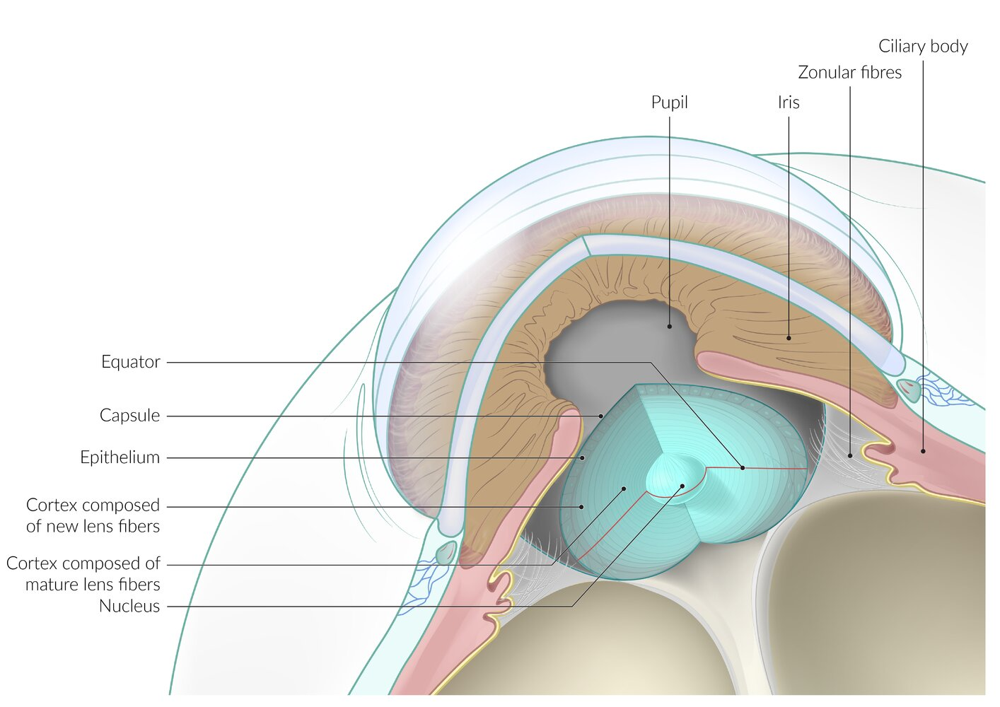
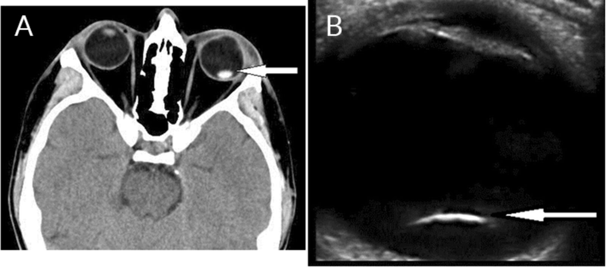
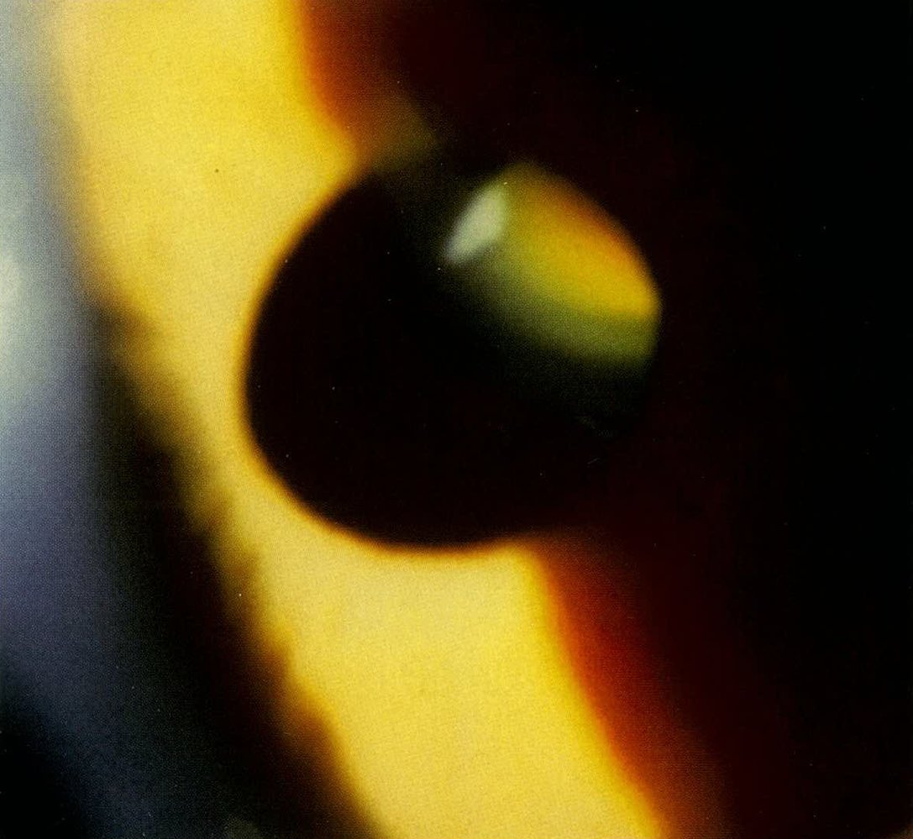
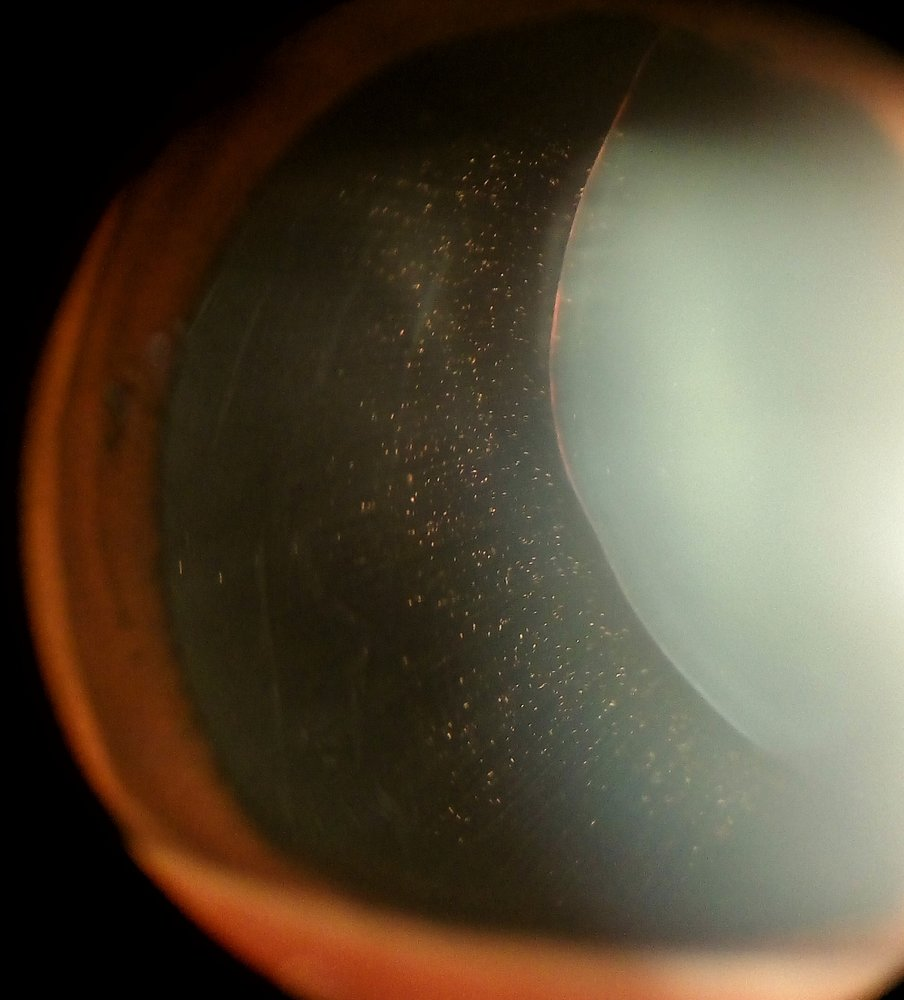
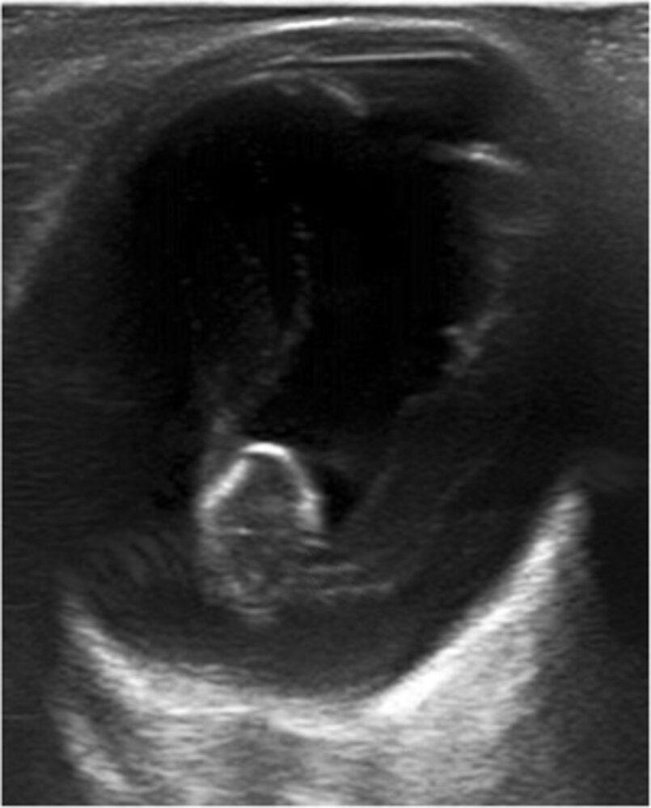

# Diseases of the lens

*Categories: Clinical knowledge > Ophthalmology > Lens and vitreous body > Diseases of the lens*

[Original Article Link](https://coursology-qbank.com/amboss/article/6O0jtT)

---

## Summary

The <u>lens</u>, together with the <u>cornea</u>, is responsible for refracting light onto the <u>retina</u>. <u>Zonular fibers</u> attach the <u>lens</u> to the <u>ciliary body</u>, which holds the <u>lens</u> in position and determines its degree of <u>accommodation</u>. Pathological conditions of the <u>lens</u> include <u>cataracts</u>, displacement of the <u>lens</u>, and <u>aphakia</u>. <u>Cataracts</u>, in which age-related degenerative processes lead to clouding of the <u>lens</u>, are the most common disease of the <u>lens</u>. <u>Ectopia lentis</u>, a displacement of the <u>lens</u>, can be caused by ocular diseases, trauma, or systemic conditions. While a partially displaced <u>lens</u> (subluxation) involves little to no loss of <u>visual acuity</u>, complete displacement of the <u>lens</u> (luxation) results in severe visual impairment. Subluxation is common in individuals with <u>Marfan syndrome</u> and <u>homocystinuria</u>. Treatment of a displaced <u>lens</u> involves refractive correction and/or surgical removal of the <u>lens</u>. <u>Aphakia</u> is the absence of the <u>lens</u>, which can be congenital or secondary to trauma or <u>surgery</u> (e.g., <u>cataract surgery</u>). Clinical features include poor <u>visual acuity</u> and total loss of visual <u>accommodation</u>. Treatment consists of refractive correction with aphakic glasses, contact lenses, or <u>surgery</u>.

For more information on <u>cataracts</u>, see the corresponding article.

---

## Anatomy of the lens

Anatomy of the eye

Intraocular lens

For more details, see “<u>Gross anatomy of the eye</u>” and “<u>Lens</u>.”

---

## Ectopia lentis

* Definition: displacement of the <u>lens of the eye</u>

* Etiology

* Trauma (most common)

* Ocular disease

* Simple ectopia lentis: a hereditary disorder in which <u>zonular fibers</u> degenerate, leading to <u>lens dislocation</u>.

* Ectopia lentis et pupillae: displaced <u>pupils</u> and lenses (usually in opposite directions); rare congenital disorder

* Pseudoexfoliation syndrome (mean age of onset is 69–75 years): deposition of fibrillary residue from the <u>lens</u> and <u>iris</u> onto the <u>lens</u> capsule, <u>ciliary body</u>, zonules, <u>iris</u>, and corneal <u>endothelium</u>

* Systemic disease

* <u>Marfan syndrome</u>

* <u>Homocystinuria</u>

* Clinical features

* Subluxation of the lens

* Partially displaced <u>lens</u>; still within the hyaloid fossa and attached to the <u>ciliary body</u>

* Little to no loss of <u>visual acuity</u>: If the displacement is more severe, monocular double-images, significant optical distortions, and visual impairment may occur.

* <u>Marfan syndrome</u>: superior, temporal <u>subluxation of the lens</u> (upward and outwards)

* <u>Homocystinuria</u>: inferior, <u>medial</u> <u>subluxation of the lens</u> (downward and inwards)

* Luxation of the lens

* Completely displaced <u>lens</u>; outside of the hyaloid fossa, in the <u>anterior</u> chamber, on the <u>retina</u>, or free-floating in the <u>vitreous</u>

* Severe visual impairment due to a change in total refractive power

* Diagnostics: <u>visual acuity</u>, <u>slit lamp examination</u>, retinoscopy, and <u>ultrasound</u> of the <u>eye</u>

* Ophthalmological assessment may include <u>visual acuity testing</u>, <u>slit lamp examination</u>, retinoscopy, <u>ultrasound</u> of the <u>eye</u>, and <u>tonometry</u>

* Findings include:

* <u>Iridodonesis</u>: <u>tremors</u> of the <u>iris</u> during <u>eye</u> movement

* Lentodonesis: <u>tremors</u> of the <u>lens</u> during <u>eye</u> movement

* The equator of the <u>lens</u> may be visible in the <u>pupil</u>

* The <u>lens</u> may dislocate into the <u>vitreous</u> or the <u>anterior</u> chamber

* Features of <u>glaucoma</u> (e.g., raised <u>intraocular pressure</u>) due to <u>pupillary block</u>

* Evaluation for underlying <u>Marfan syndrome</u> or <u>homocystinuria</u>

* Treatment

* Refractive correction

* Lensectomy/<u>vitrectomy</u>

* Treatment of the underlying condition

* Complications

* Acute secondary <u>angle closure glaucoma</u>

* <u>Amblyopia</u>

> [!NOTE]
> In <u>Marfan syndrome</u>, the <u>lens</u> subluxates superiorly and temporally (upward and outwards). In <u>homocystinuria</u>, the <u>lens</u> subluxates inferiorly and medially (downward and inwards).

Traumatic lens dislocation

Lens subluxation in Marfan syndrome

Lens subluxation

Dislocated lens

References:[[1]](https://coursology-qbank.com/amboss/article/APYRh6)

---