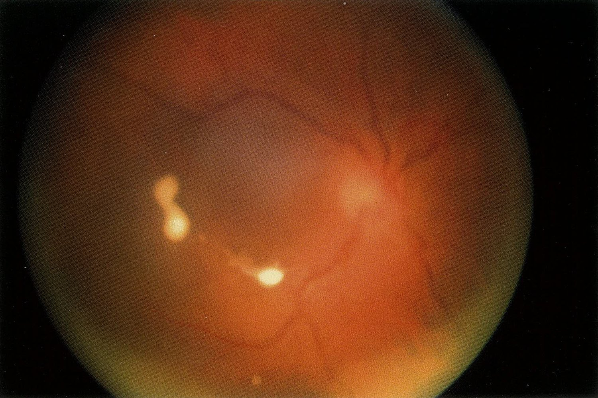
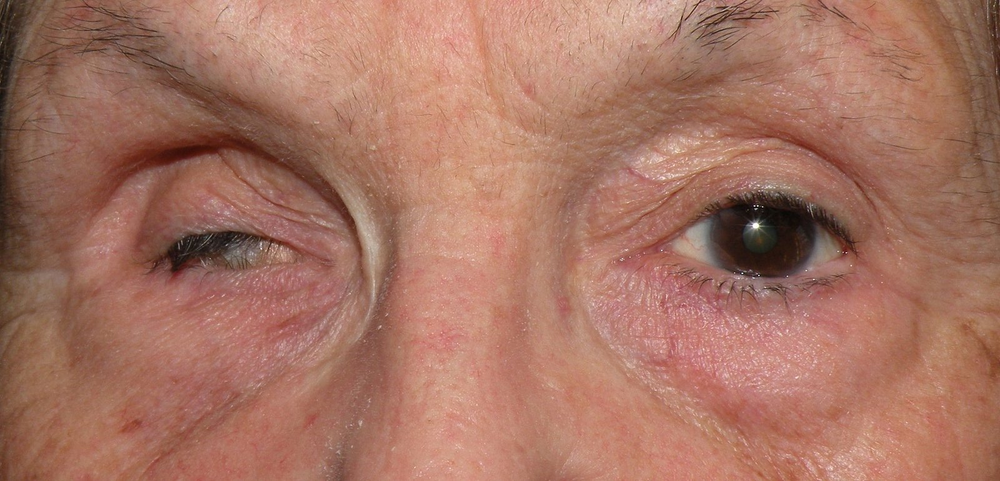

# Endophthalmitis

*Categories: Clinical knowledge > Ophthalmology > Lens and vitreous body > Endophthalmitis*

[Original Article Link](https://coursology-qbank.com/amboss/article/4M03Kg)

---

## Summary

Endophthalmitis is a rare, potentially sight-threatening inflammation of the <u>vitreous humor</u> (vitritis) that may be infectious (bacterial/fungal infection) or noninfectious (sterile). Infectious endophthalmitis can have either an <u>exogenous</u> (following ocular <u>surgery</u>/<u>penetrating trauma</u>) or <u>endogenous</u> (hematogenous spread) etiology. Staphylococcal/<u>streptococcal</u> infection after <u>cataract surgery</u> is the most common cause of <u>exogenous</u> bacterial endophthalmitis. Fungal endophthalmitis is often caused by <u>Candida</u> and is more common in <u>immunocompromised individuals</u>. Endophthalmitis may present either acutely with sudden, deep ocular <u>pain</u> and rapidly progressive loss of <u>vision</u> or indolently (chronic endophthalmitis). Clinical features include <u>conjunctival hyperemia</u>, corneal haziness, <u>hypopyon</u>, and decreased <u>visual acuity</u>. <u>Vitreous</u> infiltrates are seen on <u>slit lamp examination</u>. Diagnosis is often clear on history and <u>ocular examination</u>. In doubtful cases, <u>ultrasound</u> of the <u>eye</u> and <u>gram stain</u> and culture of the <u>vitreous humor</u> is indicated. Infectious endophthalmitis is treated with intravitreal injection of either <u>antibiotics</u> (<u>vancomycin</u> with <u>ceftazidime</u>/<u>amikacin</u>) or <u>antifungals</u> (<u>amphotericin B</u>/<u>voriconazole</u>). Surgical removal of the <u>vitreous humor</u> (<u>vitrectomy</u>) is done in sight-threatening cases. Patients with noninfectious endophthalmitis usually resolve completely with <u>topical steroids</u> alone. Untreated infectious endophthalmitis can progress to cause panophthalmitis, corneal rupture, and permanent <u>vision loss</u>.

---

## Etiology

### Infectious endophthalmitis

* Causative organism

* Bacteria: <u>coagulase-negative</u> <u>staphylococci</u> (most common), <u>S. aureus</u>, <u>streptococci</u>, <u>B. cereus</u> (in posttraumatic endophthalmitis)

* Fungi: <u>Candida</u> (most common), <u>mold</u> (<u>Aspergillus</u>, <u>Mucor</u>, and Fusarium species)

* Route of entry

* <u>Exogenous</u> (direct <u>inoculation</u>) 

* Intraocular surgeries/injections

* Postcataract <u>surgery</u> (most common cause of postoperative endophthalmitis)

* After <u>glaucoma</u> <u>surgery</u>; corneal transplant; intravitreal injections

* <u>Penetrating trauma</u> (less common)

* <u>Endogenous</u> (hematogenous spread) 
* Presence of a distant infectious focus  → <u>bacteremia</u>/<u>fungemia</u> → seeding of the vascular <u>choroid</u> by the organism → spread of infection to the <u>retina</u> and <u>vitreous</u>

### Noninfectious endophthalmitis (sterile)

* An inflammatory reaction to drugs injected into the <u>vitreous</u>

* Usually resolves completely without intravitreal <u>antibiotics</u>/<u>vitrectomy</u>

References:[[1]](https://coursology-qbank.com/amboss/article/g7aFON)[[2]](https://coursology-qbank.com/amboss/article/37aSlN)[[3]](https://coursology-qbank.com/amboss/article/R7allN)[[4]](https://coursology-qbank.com/amboss/article/i7aJlN)[[5]](https://coursology-qbank.com/amboss/article/Q7aulN)

---

## Clinical features

|  Acute vs. chronic endophthalmitis [[1]](https://coursology-qbank.com/amboss/article/g7aFON)[[5]](https://coursology-qbank.com/amboss/article/Q7aulN)  |  |  |
| --- | --- | --- |
|  | Acute endophthalmitis | Chronic endophthalmitis |
| <u>Pathogen</u> |  * Usually bacterial   |   * Usually fungal  * Less <u>virulent</u> bacteria    |
| Onset |  * Sudden (acute)   |  * Insidious   |
| Symptoms |   * Severe, deep-seated, dull ocular <u>pain</u>  * Acute loss of <u>vision</u>  * <u>Features of sepsis</u> may be present (in <u>endogenous</u> endophthalmitis).    |   * Ocular <u>pain</u> is usually absent/appears late.  * Gradually progressive loss of <u>vision</u>  * <u>Floaters</u> (fungal endophthalmitis)    |
| Signs |   * <u>Exogenous</u> endophthalmitis  * <u>Conjunctival hyperemia</u> and <u>chemosis</u> out of <u>proportion</u> to the surgical/traumatic insult  * Hazy <u>cornea</u> (due to <u>edema</u>)  * Hazy aqueous chamber or <u>hypopyon</u>  * <u>Endogenous</u> endophthalmitis: The above signs do not develop/develop until late in the course of the disease  * In both types  * <u>Relative afferent pupillary defect</u>  * Decreased <u>visual acuity</u>    |  |

---

## Diagnosis

### <u>Slit lamp</u> <u>examination of the eye</u>

* Indicated in all patients with endophthalmitis.

* <u>Cornea</u>: <u>edematous</u>/hazy

* Chambers containing <u>aqueous humor</u>: hazy; <u>hypopyon</u>

* <u>Vitreous</u> chamber; : inflammation (cells and protein); white and fluffy infiltrates (snowball appearance) in fungal endophthalmitis

### <u>Fundoscopy</u>

* Indicated in all patients with endophthalmitis.

* Loss of the <u>red reflex</u> (due to <u>chorioretinitis</u>)

* <u>Roth spots</u>;  may be seen in patients with <u>endogenous</u> endophthalmitis due to <u>infective endocarditis</u>, and occasionally in fungal endophthalmitis.

* Bacterial endophthalmitis: nonvisualization of retinal vessels

* Fungal endophthalmitis: creamy white retinal <u>nodules</u>

Fungal endophthalmitis

### <u>Ultrasound</u> of the <u>eye</u> (B-scan)

* Indicated if the <u>vitreous</u> cannot be seen on <u>slit lamp examination</u> (e.g., due to a hazy <u>cornea</u>/aqueous chamber)

* Findings: <u>hyperechogenicity</u> of the <u>vitreous</u> (due to inflammation), thickened chorioretinal membrane

### <u>Gram-stain</u> and culture of aqueous and/or <u>vitreous humor</u>

* The aqueous and/or <u>vitreous humor</u> can be extracted through a fine needle and cultured.

* Indicated in doubtful cases

### Workup for primary source of infection

* For patients with <u>endogenous</u> endophthalmitis

* <u>Blood cultures</u>: should be done in all patients with <u>endogenous</u> endophthalmitis

* When an infectious source is unknown, the following tests are indicated:

* <u>Urine culture</u> to rule out <u>UTI</u>

* <u>ECHO</u> to rule out <u>infective endocarditis</u> (suspect in people who inject drugs and patients with <u>prosthetic heart valves</u>)

* Abdominal USG to rule out <u>liver abscess</u> (suspect in patients with DM, hepatobiliary disease).

References:[[1]](https://coursology-qbank.com/amboss/article/g7aFON)[[6]](https://coursology-qbank.com/amboss/article/3q0SyS)[[7]](https://coursology-qbank.com/amboss/article/j7a_lN)[[8]](https://coursology-qbank.com/amboss/article/P7aWNN)[[9]](https://coursology-qbank.com/amboss/article/47a3NN)[[10]](https://coursology-qbank.com/amboss/article/k7amNN)[[11]](https://coursology-qbank.com/amboss/article/O7aINN)[[12]](https://coursology-qbank.com/amboss/article/l7avNN)

---

## Treatment

* Intravitreal drug administration

* Bacterial endophthalmitis: empirical intravitreal <u>antibiotic</u> administration in all cases (<u>vancomycin</u> and <u>ceftazidime</u>/<u>amikacin</u>)

* <u>Mold</u> endophthalmitis;  or sight-threatening <u>candida</u> endophthalmitis: intravitreal <u>antifungal</u> administration (<u>amphotericin B</u> or <u>voriconazole</u>)

* Systemic <u>antifungal</u> administration (IV <u>fluconazole</u> or <u>voriconazole</u>): early disease due to <u>Candida</u>, all patients with <u>endogenous</u> fungal endophthalmitis

* Pars plana <u>vitrectomy</u>: in patients with sight-threatening endophthalmitis

* Sterile endophthalmitis

* Mild/early disease: <u>topical steroids</u>

* Severe inflammation: treat as bacterial endophthalmitis

> [!NOTE]
> Early initiation of treatment (within hours) is critical to preserve eyesight.References:[[13]](https://coursology-qbank.com/amboss/article/N7a-NN)[[14]](https://coursology-qbank.com/amboss/article/m7aVmN)[[15]](https://coursology-qbank.com/amboss/article/57aimN)[[16]](https://coursology-qbank.com/amboss/article/J7as5N)[[17]](https://coursology-qbank.com/amboss/article/77a4MN)

---

## Complications

* Panophthalmitis

* Corneal perforation

* Phthisis bulbi

* <u>Glaucoma</u>

* Permanent loss of <u>vision</u>

Phthisis bulbi

References:[[18]](https://coursology-qbank.com/amboss/article/H7aKMN)[[19]](https://coursology-qbank.com/amboss/article/pHaLrN)

We list the most important complications. The selection is not exhaustive.

---