# Diseases of the retina

*Categories: Clinical knowledge > Ophthalmology > Retina and vision > Diseases of the retina*

[Original Article Link](https://coursology-qbank.com/amboss/article/sO0tFT)

---

## Summary

The <u>retina</u>, which contains the first three <u>neurons</u> of the <u>visual pathway</u>, mediates the conversion of light stimuli into nerve impulses. Diseases of the <u>retina</u> may lead to visual impairment, <u>visual field</u> loss, and more <u>complex disorders</u> such as <u>metamorphopsia</u> (distorted <u>vision</u>) and clouding. <u>Ophthalmoscopy</u> is the preferred diagnostic method for identifying retinal diseases, but depending on the suspected disorder, other methods such as <u>fluorescein angiography</u> and <u>optical coherence tomography</u> (<u>OCT</u>) may be appropriate.

---

## Color perception disorders

### Color blindness (<u>dyschromatopsia</u>) [[1]](https://coursology-qbank.com/amboss/article/Ssay8N)

* Description: altered color perception

* Etiology: congenital or acquired (e.g., optic neuropathy due to <u>ethambutol</u>)

* Congenital;  color perception disorders (especially red-green <u>color vision deficiency</u>; ) are very common and occur mostly in men.

* Affected individuals are generally unaware of their own color-perception disorders.

### Dichromacy [[2]](https://coursology-qbank.com/amboss/article/_ZY5Vn)[[3]](https://coursology-qbank.com/amboss/article/zZYrVn)

* Description: Only two of the three types of <u>cones</u> in the <u>retina</u> are fully functional.

* Types

* Deuteranomaly: green color deficiency (very common: ∼ 5% of the male population)

* <u>Deuteranopia</u>: green <u>color blindness</u> (∼ 1% of the male population)

* Protanomaly: red color deficiency (∼ 1% of the male population)

* Protanopia: red <u>color blindness</u> (∼ 1% of the male population)

* Tritanomaly: blue-yellow color <u>weakness</u> (very rare)

* Tritanopia: blue-yellow <u>color blindness</u> (very rare)

* Clinical features: difficulties distinguishing colors from one another

* Diagnostics

* <u>Ishihara color test</u>: set of color-dotted plates used to diagnose <u>deuteranopia</u> and protanopia

* Anomaloscope: instrument used to diagnose quantitative and qualitative defects in color perception

### Achromatism

* <u>Complete color blindness</u> (very rare)

---

## Degenerative diseases of the retina

### Central serous retinopathy (central serous chorioretinopathy)

* Definition: serous <u>retinal detachment</u> at the <u>posterior</u> pole of the eyeball (at the <u>macula</u> or in the perimacular region) due to a defect in the <u>pigment epithelium</u>

* Pathophysiology: defect in the area of <u>Bruch's membrane</u>/<u>pigment epithelium</u> → fluid leakage from the <u>sclera</u> into the subretinal space → serous <u>retinal detachment</u>

* Etiology

* Unknown

* <u>Glucocorticoids</u> and an increase in the <u>diastolic</u> blood pressure are possible <u>risk factors</u>.

* <u>Stress</u>-related

* <u>Epidemiology</u>
* Mostly affects men 20–45 years of age

* Clinical features

* <u>Hyperopia</u>

* <u>Metamorphopsia</u> (distorted <u>vision</u>)

* Patients perceive images as smaller than they are

* Relative <u>scotoma</u> (perception of a gray area or shadow in the central field of <u>vision</u>)

* Diagnostics

* <u>Ophthalmoscopy</u>: roundish detachment of the central <u>retina</u>

* <u>Fluorescein angiography</u>

* <u>Optical coherence tomography</u> (<u>OCT</u>)

* Treatment

* Often heals spontaneously

* <u>Stress</u> reduction

* Rarely: laser coagulation (in extramacular localization), <u>photodynamic therapy</u>

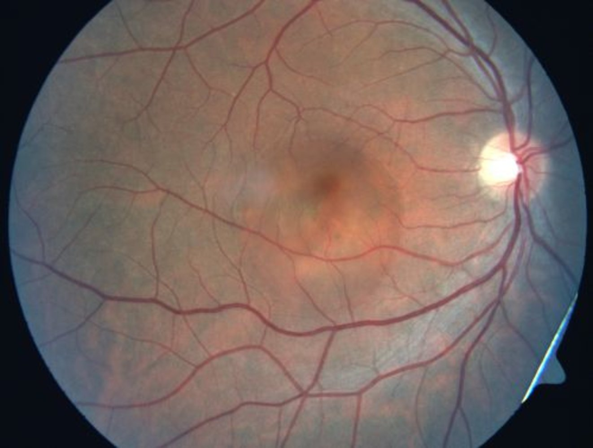

Acute central serous retinopathy

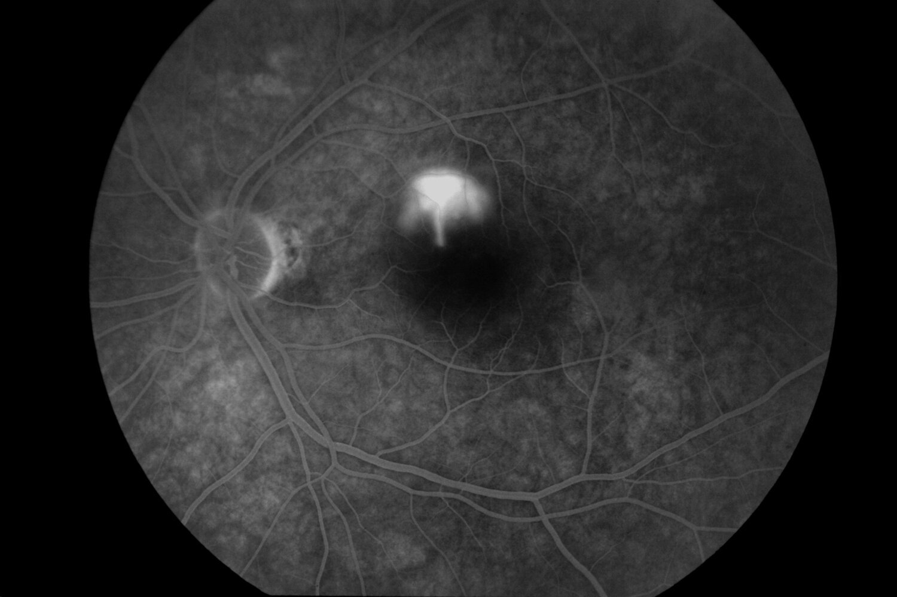

Central serous chorioretinopathy (CSC)

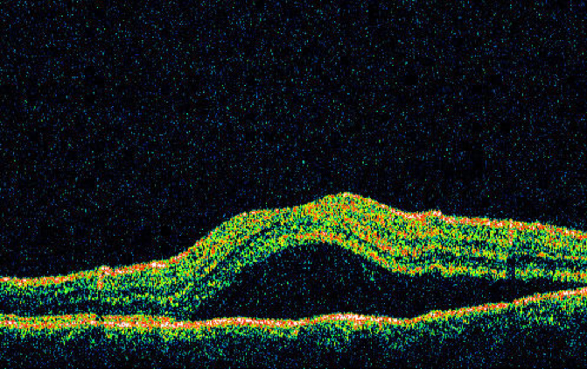

Central serous chorioretinopathy in OCT

### Macular hole

* Definition: central small break in the <u>macula</u>

* Etiology

* <u>Idiopathic</u>

* Secondary (e.g., to <u>vitreous detachment</u>, due to trauma, following laser therapy)

* Clinical features (stage-related)

* <u>Metamorphopsia</u>

* Central <u>visual field</u> losses

* Severe reduction of <u>visual acuity</u>

* Treatment: <u>vitrectomy</u> with removal of epiretinal membranes and the internal limiting membrane of the <u>retina</u>

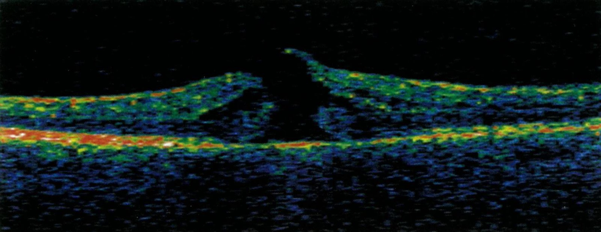

Macular hole

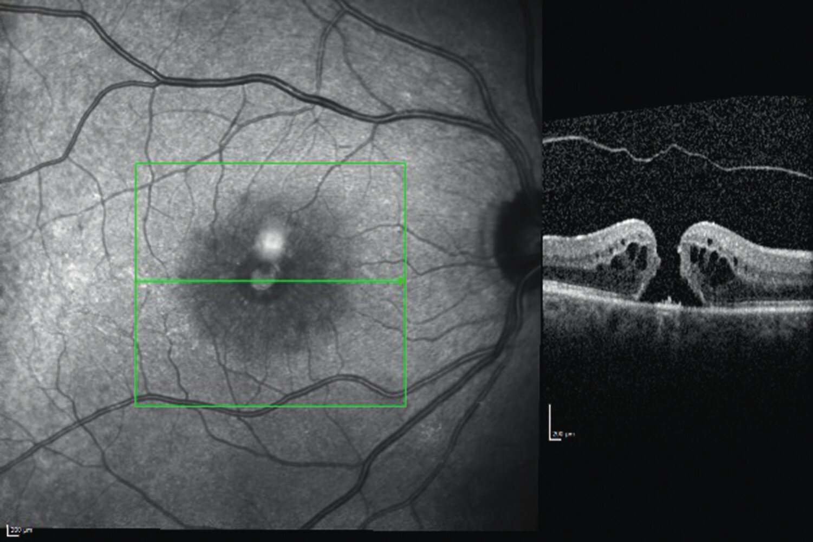

Full-thickness macular hole

### Age-related <u>macular degeneration</u>

See <u>age-related macular degeneration</u>.

### <u>Retinal detachment</u>

See <u>retinal detachment</u>.

References:[[4]](https://coursology-qbank.com/amboss/article/hsacuN)

---

## Dystrophic retinal diseases

### Retinitis pigmentosa

* Definition: progressive hereditary <u>dystrophy</u> of the <u>retina</u> or of the <u>photoreceptors</u> and the retinal <u>pigment epithelium</u>

* <u>Epidemiology</u>: early onset (5–30 years)

* Etiology

* Hereditary or spontaneous mutations (> 45 <u>genes</u> are known as triggers; e.g., mutations in the <u>rhodopsin</u> <u>gene</u>)

* Associated with <u>abetalipoproteinemia</u>

* Clinical features 

* In early stages

* Normal central <u>vision</u>; narrowing field of <u>vision</u> (ring-shaped area of blindness)

* <u>Night blindness</u> (<u>nyctalopia</u>)

* In advanced stages 

* Impaired peripheral <u>vision</u> (tunnel <u>vision</u>)

* Defects in the perception of contrast and color

* Glare <u>sensitivity</u>

* Diagnostics

* <u>Fundoscopy</u> 

* Pattern of dark spots and star-shaped blotches (deposits with bone <u>spicule</u> appearance) that develop from the periphery to the center of the <u>retina</u>

* Attenuation of retinal vessels

* Pale <u>optic disc</u>

* <u>Perimetry</u>

* <u>Electroretinography</u>

* Differential diagnosis: Drugs (<u>phenothiazines</u>, <u>chloroquine</u>) may induce similar symptoms to those of <u>retinitis pigmentosa</u> → <u>pseudoretinitis pigmentosa</u>

* Treatment: No effective treatment is known.

* Prognosis: often leads to blindness

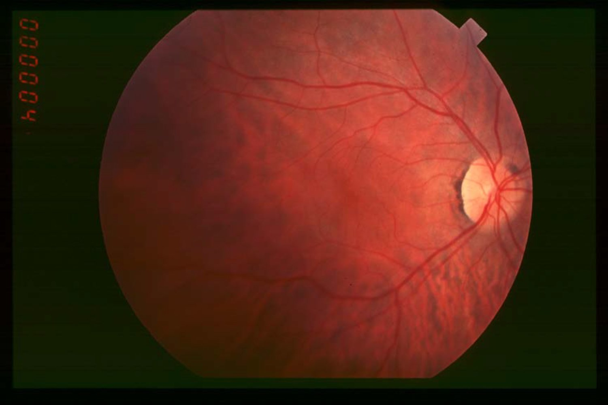

Retinitis pigmentosa: early stage (1/3)

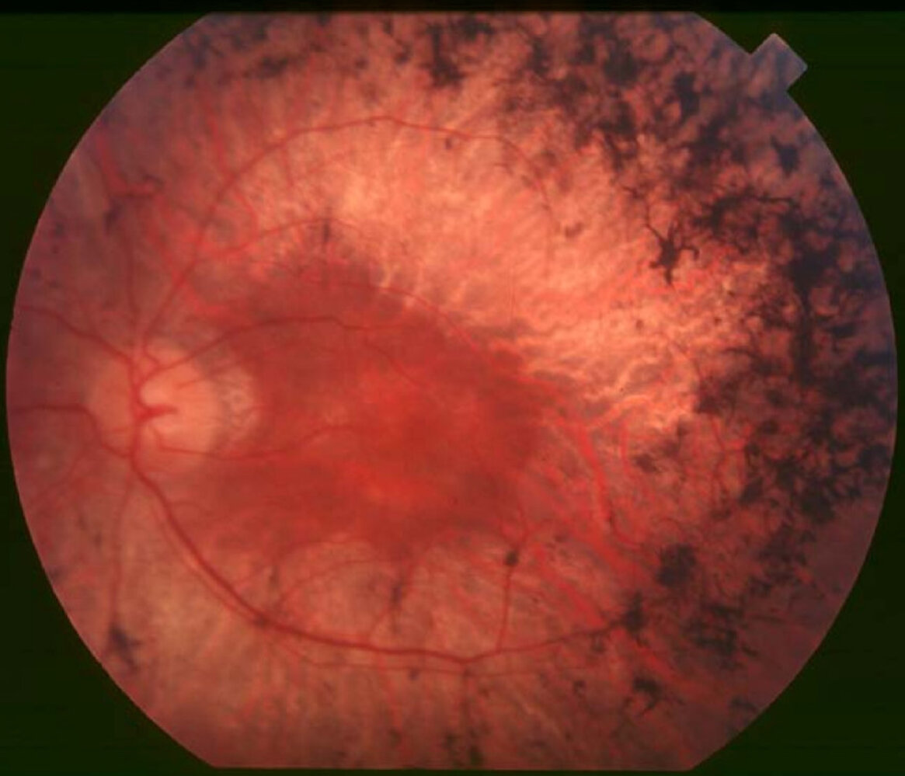

Retinitis pigmentosa: intermediate stage (2/3)

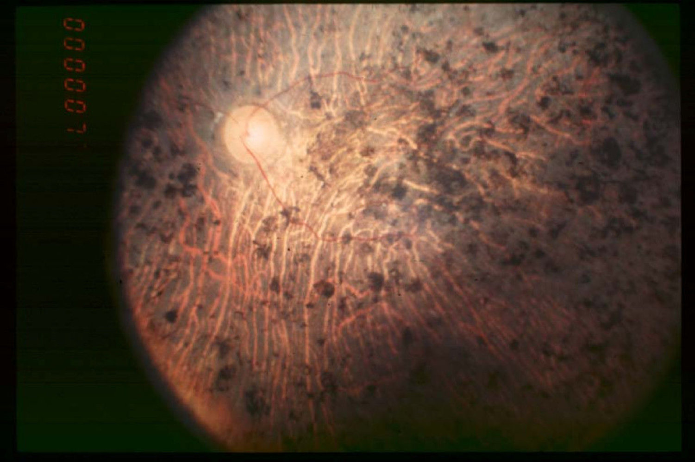

Retinitis pigmentosa: End stage (3/3)

### Stargardt's disease

* Definition: juvenile macular <u>dystrophy</u>, originating from the <u>retinal pigment epithelium</u>, <u>autosomal recessive</u> hereditary pattern

* Clinical features
* Chronic progressive loss of <u>visual acuity</u>; onset between 10–30 years

* Diagnostics

* <u>Ophthalmoscopy</u> (yellowish flecks in the area of the <u>macula</u> and <u>atrophy</u> of the <u>pigment epithelium</u>)

* <u>Fluorescein angiography</u>

* <u>OCT</u>

* Treatment / prevention

* No therapy or prevention is known.

* Poor prognosis for <u>vision</u>

### Best disease (<u>vitelliform macular dystrophy</u>)

* Definition: juvenile macular <u>dystrophy</u>, <u>autosomal dominant</u> inheritance

* Clinical features

* Chronic progressive visual impairment; onset typically between 4–10 years

* People often have <u>vision</u> of approx. 20/40

* Diagnostics

* <u>Ophthalmoscopy</u>: typical, yellowish, round yolk-like lesions (from Latin “vitellus” = yolk) in the region of the <u>macula</u>

* <u>Electrooculography</u> (<u>EOG</u>): pathological

* <u>Electroretinogram</u> (<u>ERG</u>): normal

* Treatment: No causal therapy is known.

* Prognosis: Some patients may not have visual deterioration beyond 20/40. However, the deterioration may progress after age 40.

---

## Vascular diseases of the retina

### Retinal hemorrhage [[5]](https://coursology-qbank.com/amboss/article/8mcOh10)

* Definition: bleeding of the vessels in the <u>retina</u>

* <u>Epidemiology</u> [[5]](https://coursology-qbank.com/amboss/article/8mcOh10)[[6]](https://coursology-qbank.com/amboss/article/tmcXh10)[[7]](https://coursology-qbank.com/amboss/article/Fmcgh10)

* Peak <u>incidence</u> in adults: approx. 40 years of age

* Peak <u>incidence</u> in children:

* 10–40%: <u>birth</u>-related (e.g., neonatal <u>retinal hemorrhages</u>)

* Approx. 15%: critical disease-related (e.g., <u>sepsis</u>)

* Approx. 30%: abuse-related (e.g., <u>child abuse</u>)

* Etiology [[6]](https://coursology-qbank.com/amboss/article/tmcXh10)[[8]](https://coursology-qbank.com/amboss/article/c5caQ10)

* Head and neck trauma (e.g., <u>child abuse</u>, <u>head trauma</u>)

* <u>Eye</u> diseases (e.g., age-related <u>macular degeneration</u>, <u>retinal vein occlusion</u>; , retinal <u>vasculitis</u>, <u>ocular ischemic syndrome</u>, <u>Coats disease</u>)

* <u>Eye</u> infections (e.g., <u>CMV retinitis</u>)

* Chronic disease (e.g., <u>diabetic retinopathy</u>, <u>hypertensive retinopathy</u>)

* <u>Preeclampsia</u>, <u>hypertensive emergency</u>

* <u>Coagulopathy</u>, <u>anemia</u>, <u>leukemia</u> (e.g., <u>hypofibrinogenemia</u>, <u>sickle cell anemia</u>, <u>Waldenstrom macroglobulinemia</u>)

* Neonatal <u>retinal hemorrhages</u> (e.g., instrumental <u>labor</u>, <u>cesarean delivery</u>)

* Other: cerebral <u>malaria</u>, <u>sepsis</u>, <u>systemic lupus erythematosus</u>

| Overview of <u>retinal hemorrhage</u> |  |  |
| --- | --- | --- |
| Classification | Fundoscopic findings of retinal hemorrhage | Examples |
|  Retinal nerve fiber layer hemorrhage  |   * Flame-shaped hemorrhages  * Disc-shaped hemorrhages  * <u>Roth spots</u>    |   * <u>Hypertensive retinopathy</u>, <u>retinal vein occlusion</u>  * <u>Diabetic retinopathy</u>  * <u>Endocarditis</u>    |
|  Intraretinal hemorrhage  |  * <u>Dot-blot hemorrhages</u>   |  * <u>Diabetic retinopathy</u>   |
|  Subretinal hemorrhage  |  * Dark red, amorphous hemorrhages   |   * <u>Age-related macular degeneration</u>  * Trauma    |
|  <u>Preretinal hemorrhage</u>  |  * Boat- or d-shaped hemorrhages   |   * <u>Retinal vein occlusion</u>  * <u>Abusive head trauma</u>    |
|  <u>Vitreous hemorrhage</u>  |  * Dark, red hemorrhagic patches usually seen in the macular region   |   * <u>Diabetic retinopathy</u>  * <u>Hypertensive retinopathy</u>  * <u>Central vein</u> occlusion  * <u>Sickle cell</u> <u>retinopathy</u>    |

* Clinical features: Symptoms vary according to hemorrhage severity.

* Asymptomatic during early stages

* Blurry <u>vision</u>

* <u>Floaters</u>, photopsias

* Partial or complete <u>vision loss</u>

* Diagnostics

* <u>Medical history</u> (e.g., <u>hypertension</u>, <u>diabetes mellitus</u>)

* <u>Visual acuity</u> and <u>fundoscopic exam</u>

* Ocular <u>ultrasound</u>

* Management

* Observation and follow up in the following:

* Solitary hemorrhages without visual impairment

* Mild hemorrhage without associated chronic disease

* Treatment of underlying cause (e.g., anti-<u>VEGF</u> injections, peripheral <u>retinal photocoagulation</u>, surgical intervention)

Retinal findings in abusive head trauma

### Coats disease (<u>exudative</u> <u>retinopathy</u>)

* Definition: a vascular disease of the <u>retina</u> characterized by retinal <u>telangiectasia</u>, subretinal <u>exudate</u>, and <u>retinal detachment</u>

* <u>Epidemiology</u>

* <u>Incidence</u>: ∼ 1:100,000

* Peak <u>incidence</u>: 5–9 years of age

* Predominantly affects boys

* Clinical features

* Almost always unilateral

* Gradual loss of <u>vision</u>

* Secondary <u>strabismus</u>

* <u>Leukocoria</u>

* Diagnostics

* <u>Ophthalmoscopy</u>: findings include <u>telangiectasias</u>, <u>aneurysms</u>, <u>hard exudates</u>, and <u>retinal detachment</u>

* <u>Fluorescein angiography</u>

* Differential diagnosis: See “<u>Differential diagnosis of leukocoria</u>.”

* Treatment

* Monitoring of mild cases with minimal vascular changes

* <u>Sclerotherapy</u>

* Indications: moderate alterations of peripheral retinal vessels

* Procedures: laser therapy or <u>cryotherapy</u>

* Retinal <u>surgery</u> or enucleation

* Indications: severe cases with <u>retinal detachment</u> and/or painful blindness

* Last resort

* See “<u>Management of retinal detachment</u>.”

* Complications: <u>retinal hemorrhage</u> and/or detachment, blindness

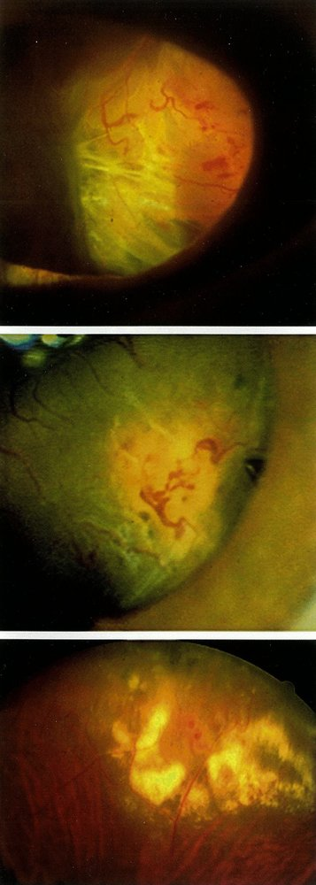

Coats disease (exudative retinopathy)

### Retinopathy of prematurity (<u>ROP</u>)

* Definition: disease of the <u>retina</u> with abnormal vessel proliferations that affects <u>preterm infants</u>

* Pathophysiology: <u>hypoxic</u> in utero environment → <u>preterm birth</u> → elevated and fluctuating <u>partial pressures</u> of oxygen (especially if <u>supplemental oxygen</u> is given for <u>neonatal respiratory distress syndrome</u>) → ↓ <u>VEGF</u> → arrest of normal <u>angiogenesis</u> → maturation and <u>hypoxia</u> of the avascular <u>retina</u> → ↑ <u>VEGF</u> → retinal <u>neovascularization</u> and possibly pathological extraretinal <u>neovascularization</u> → hemorrhages, formation of fibrovascular membranes, and, in severe cases, <u>retinal detachment</u> [[9]](https://coursology-qbank.com/amboss/article/FBWgcL0)

* Etiology

* <u>Premature birth</u>

* Ventilation or oxygen administration

* <u>Birth</u> weight < 1500 g

* <u>Blood transfusions</u>

* Clinical features: only in severe <u>leukocoria</u>

* Diagnostics: screening of all <u>premature infants</u>

* Screening is indicated in the following:

* <u>Gestational age</u> of < 32 weeks or if <u>gestational age</u> is unknown and <u>birth</u> weight ≤ 1500 g (regardless of oxygen administration)

* <u>Gestational age</u> between 32–36 weeks if oxygen has been administered for more than 3 days after <u>birth</u>

* Timing of examinations

* In <u>premature infants</u>, screening starts at the 30 weeks' <u>gestation</u>

* First examination 6 weeks postnatally

* Follow-up depending upon findings or state of the ocular fundus

* Examination of the ocular fundus to assess:

* Vascularization of the peripheral <u>retina</u>

* Demarcation line between vascularized and nonvascularized <u>retina</u>

* Extraretinal vessel formations

* Formation of membranes and distortion/detachment of the <u>retina</u>

* Plus disease: increased <u>tortuosity</u>, exudation, hemorrhage

* Follow-up screening until:

* Complete vascularization of the peripheral <u>retina</u>

* Significant decrease in alterations of the peripheral <u>retina</u> (however, only after the <u>expected date of delivery</u>)

* Treatment

* In early stages of the disease: no treatment, but regular follow-up

* In advanced stages: laser coagulation therapy may be indicated

* In onset of <u>retinal detachment</u>: <u>vitrectomy</u> may be indicated

* Complications 

* Tractive <u>retinal detachment</u>

* Retinal holes

* Blindness

* Prevention

* Monitoring oxygen pressures

* Regular fundoscopic exams to prevent delays in necessary treatments

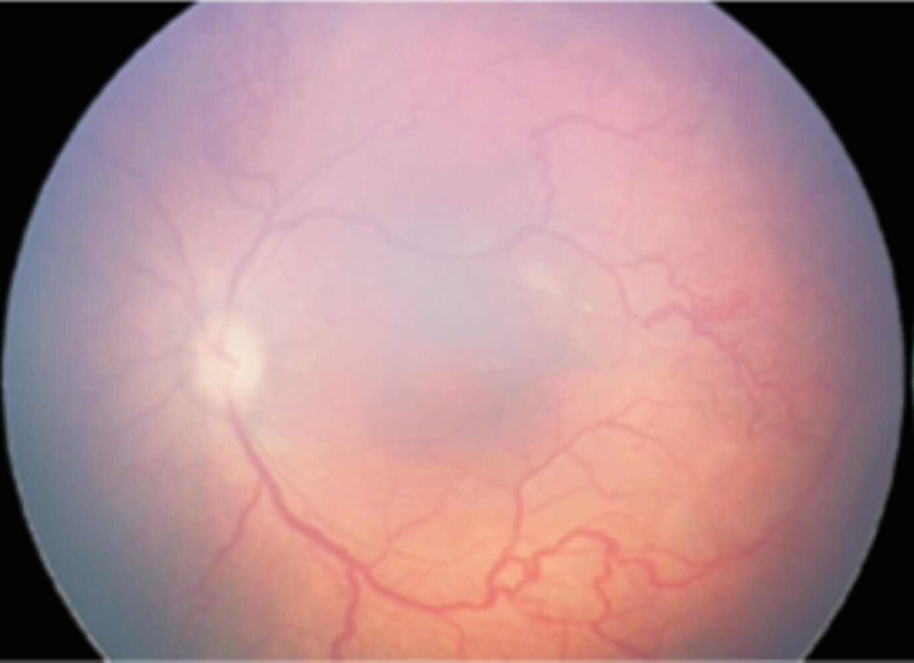

Stage 3 retinopathy of prematurity

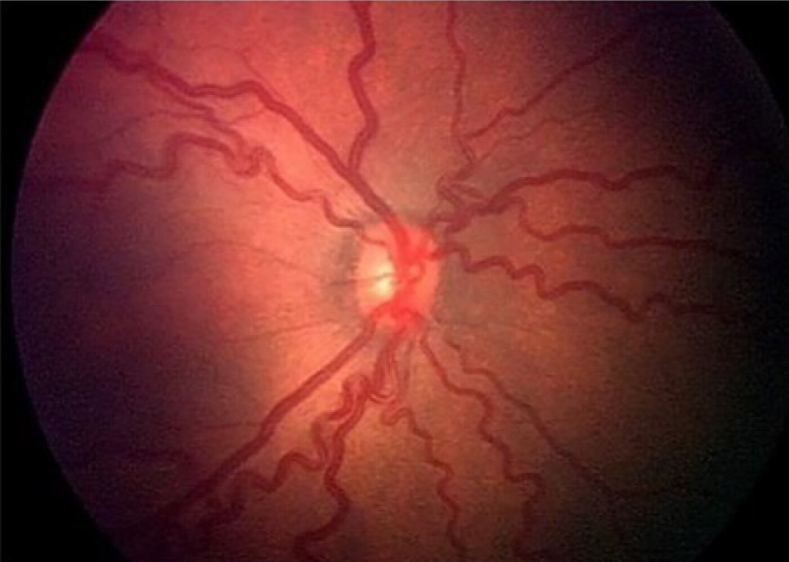

Plus disease of retinopathy of prematurity (ROP)

---

## Other retinal disorders

### Retinal emboli [[10]](https://coursology-qbank.com/amboss/article/a5cQi10)[[11]](https://coursology-qbank.com/amboss/article/Y5cni10)

* Definition: <u>plaque</u>-like lesions located in the lumen of the retinal <u>arterioles</u> or at bifurcations, generally consisting of <u>cholesterol</u>, calcification, and/or <u>platelet</u>-<u>fibrin</u>

* <u>Epidemiology</u>

* More common in male individuals

* <u>Prevalence</u> is approx. 0.9–3% in the general population

* <u>Risk factors</u>: <u>carotid artery stenosis</u>, <u>cardiac catheterization</u>, <u>diabetes mellitus</u>, <u>hypertension</u>, <u>valvular heart disease</u>, <u>atrial fibrillation</u>, history of tobacco use, vascular diseases, previous <u>surgery</u>

* Classification: <u>cholesterol</u> (<u>Hollenhorst plaques</u>), calcific, or <u>platelet</u>-<u>fibrin</u> <u>emboli</u>

* Clinical features: mostly asymptomatic, but manifestations may include blurry <u>vision</u> and the partial or complete loss of <u>vision</u>

* Associated clinical conditions

* <u>Amaurosis fugax</u>

* <u>Central retinal artery occlusion</u> or <u>branch retinal artery occlusion</u>

* Diagnostics

* <u>Fundoscopic exam</u> 

* <u>Cholesterol emboli</u> (Hollenhorst plaques): bright, yellow-colored, refractile bodies located at bifurcations of retinal vessels

* <u>Platelet</u>–<u>fibrin</u> <u>emboli</u>: long, thin, gray-colored bodies with a cast-like form located along the retinal vessels

* Calcific <u>emboli</u>: large, white, globoid-shaped bodies located at the bifurcation of the retinal vessels

* <u>Fluorescein angiography</u>

* <u>Carotid ultrasound</u> and <u>echocardiography</u>: to identify the underlying embolic source

* Management: treatment of the underlying cause, which may include anticoagulation and <u>antiplatelet therapy</u>

### Retinal periphlebitis (<u>Eales disease</u>) [[12]](https://coursology-qbank.com/amboss/article/05cei10)

* Definition: : a type of retinal <u>vasculitis</u> characterized by retinal venous inflammation, vascular occlusion, and retinal <u>neovascularization</u>

* Etiology: <u>idiopathic</u>

* <u>Epidemiology</u>

* Occurs predominantly in male individuals

* Peak <u>incidence</u>: 20 years of age [[12]](https://coursology-qbank.com/amboss/article/05cei10)

* Pathogenesis

* Overlapping stages of <u>ischemia</u>, retinal venous inflammation, and <u>neovascularization</u>

* <u>Tortuous</u> shunt vessels in the midperipheral <u>retina</u> → retinal <u>ischemia</u> → <u>neovascularization</u> with hemorrhaging

* Clinical features

* Asymptomatic in early stages

* Unilateral or bilateral decreased <u>vision</u>

* Photopsias and <u>floaters</u>

* Recurrent <u>vitreous hemorrhages</u>

* Diagnostics

* <u>Visual acuity</u> test

* <u>Fundoscopic examination</u>: perivascular venous sheathing, venous <u>tortuosity</u>, sclerosed vessels, <u>intraretinal hemorrhage</u>, retinal <u>neovascularization</u>, and <u>vitreous hemorrhages</u>

* <u>Fluorescein angiography</u>: leakage surrounding the retinal <u>veins</u>

* Differential diagnosis

* Autoimmune-related causes of retinal phlebitis (e.g., <u>multiple sclerosis</u>, <u>sarcoidosis</u>, <u>Bechet disease</u>) or retinal occlusive disease (e.g., <u>SLE</u>, <u>polyarteritis nodosa</u>, <u>Churg-Strauss syndrome</u>)

* Vascular diseases (e.g., <u>sickle cell</u> <u>retinopathy</u>, <u>branch retinal vein occlusion</u>)

* Infectious retinal <u>vasculitis</u> (e.g., due to <u>syphilis</u>, <u>tuberculosis</u>, <u>Lyme disease</u>)

* Treatment

* Early stages: <u>corticosteroids</u> (local, oral, or periocular), intravitreal injection of anti-<u>VEGF</u> agents

* Advanced stages: <u>photocoagulation</u>

* Surgical: <u>Vitrectomy</u> may be indicated in the event of <u>vitreous hemorrhage</u>.

* Complications: <u>vitreous hemorrhage</u>, <u>retinal detachment</u>

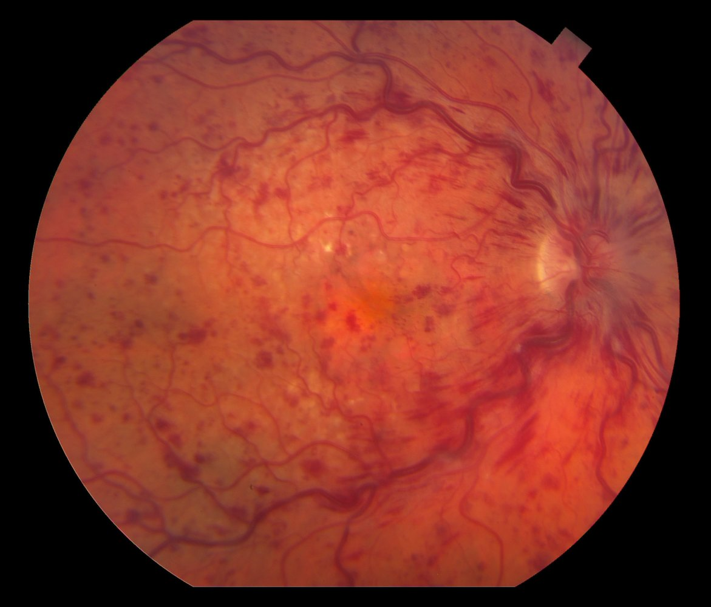

Central retinal vein occlusion

### <u>Ocular toxoplasmosis</u>

* Definition: a condition of retinal and <u>choroid</u> inflammation caused by infection with <u>Toxoplasmosis</u>

* Clinical features: yellow-white ocular lesions, marked <u>vitreous</u> reaction, concomitant <u>vasculitis</u>, and <u>visual field</u> defects.

* For more information on “<u>ocular toxoplasmosis</u>”, see “<u>Toxoplasmosis</u>.”

Juxtapapillary retinochoroiditis (Jensen disease)

Macular scar in congenital toxoplasmosis

---

## Tumors of the retina

* <u>Retinoblastoma</u>

* Retinal pigment epithelial hyperplasia (<u>retinal pigment epithelial hypertrophy</u>)

* Definition: benign <u>hyperplasia</u> of the <u>retinal pigment epithelium</u>

* Etiology: can be associated with <u>familial adenomatous polyposis</u> (<u>FAP</u>)

* Diagnostics: <u>fundoscopy</u> demonstrates well-demarcated, strongly pigmented grouped foci that may have surrounding halos of relative lucency; no prominence

* Treatment: not indicated

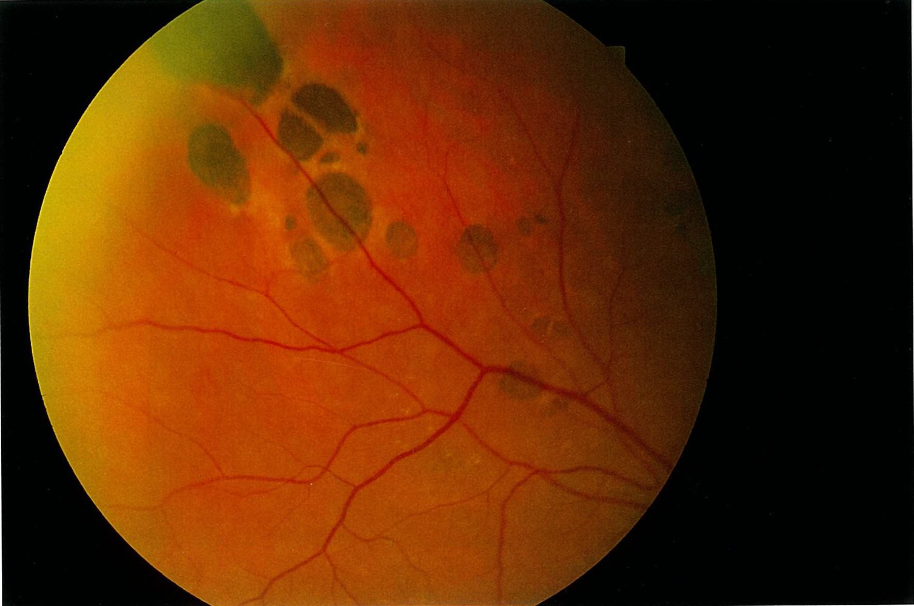

Congenital hypertrophy of the retinal pigment epithelial (CHRPE)

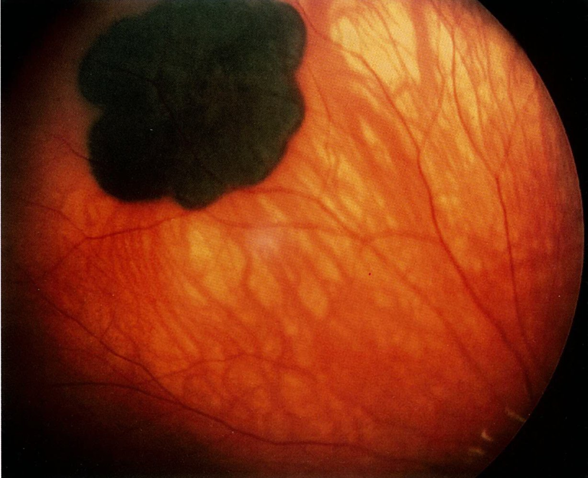

Congenital hypertrophy of the retinal pigment epithelium (CHRPE)

---

## Leukocoria

* Definition: <u>Leukocoria</u> is an abnormal white reflection from the <u>pupil</u> (instead of the normal red-<u>eye</u> reflex).

* Differential diagnosis of leukocoria

* <u>Retinoblastoma</u>

* <u>Cataract</u> (congenital or acquired)

* <u>Coats disease</u>

* <u>Retinopathy of prematurity</u>

* <u>Persistent fetal vasculature</u>

* <u>Vitreous hemorrhage</u>

* <u>Ocular toxocariasis</u>

* <u>Retinal dysplasia</u>

* <u>Retinal detachment</u>

* Fundus <u>coloboma</u>

* <u>Retinal astrocytic hamartoma</u>

* <u>Retinal myelinated fibers</u>

Leukocoria

---