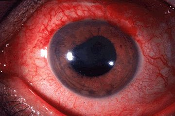
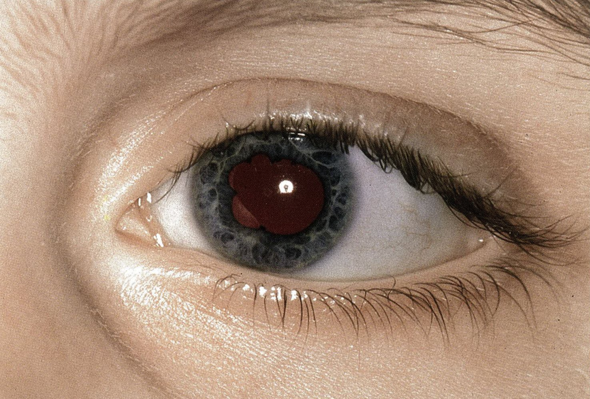
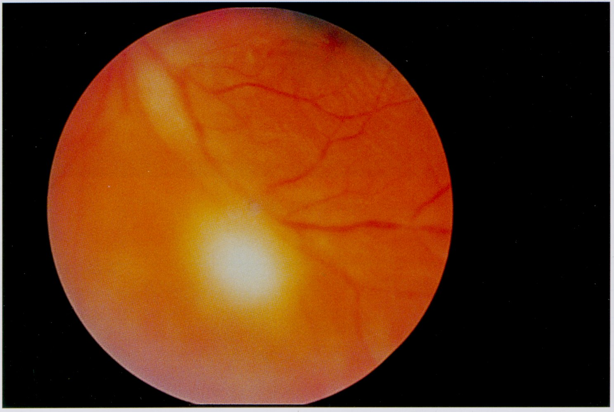
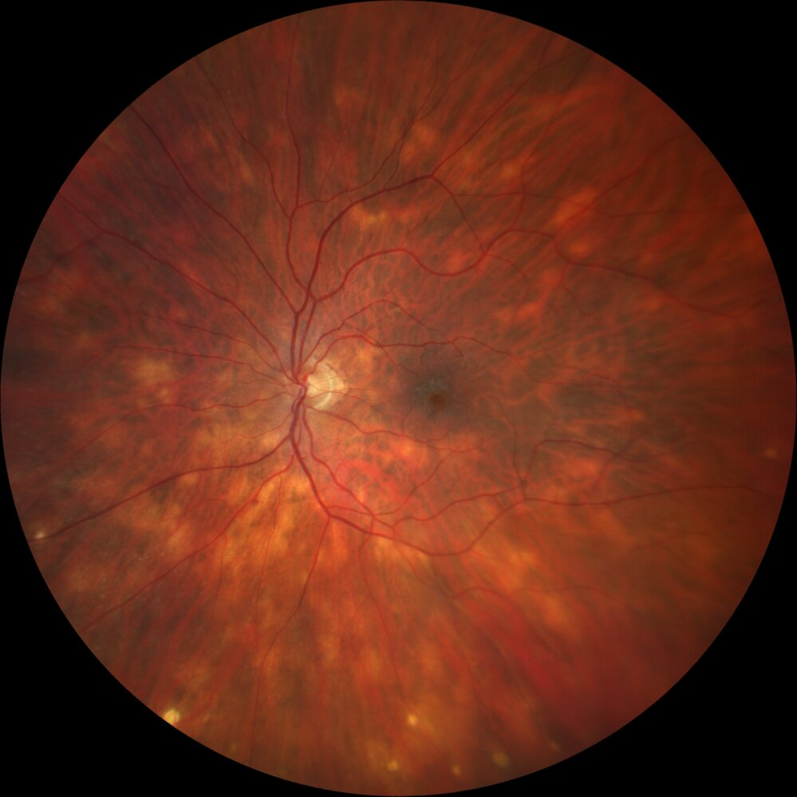
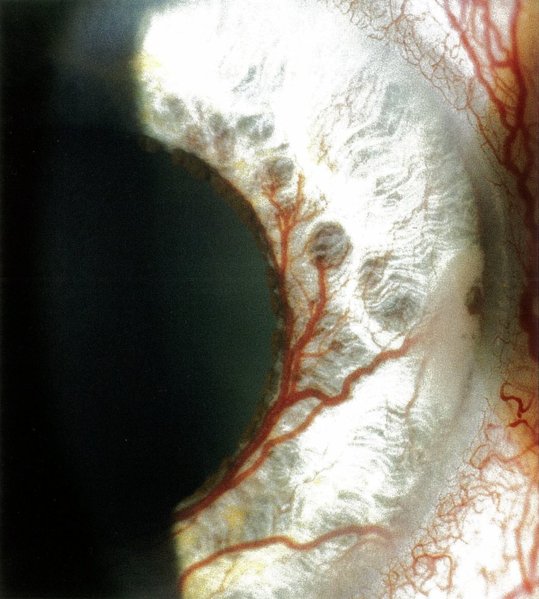
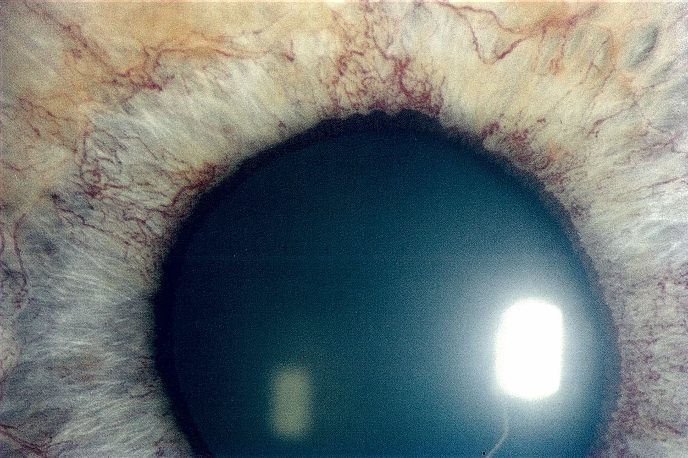
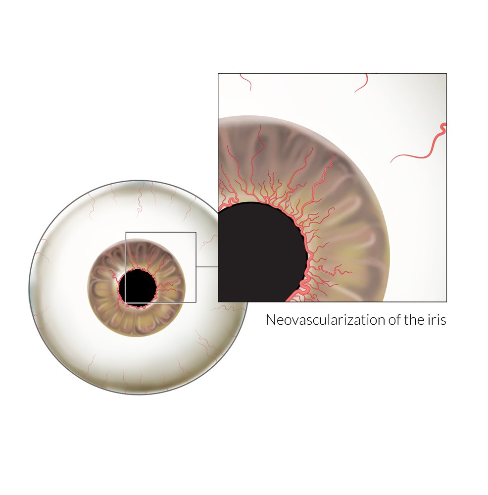
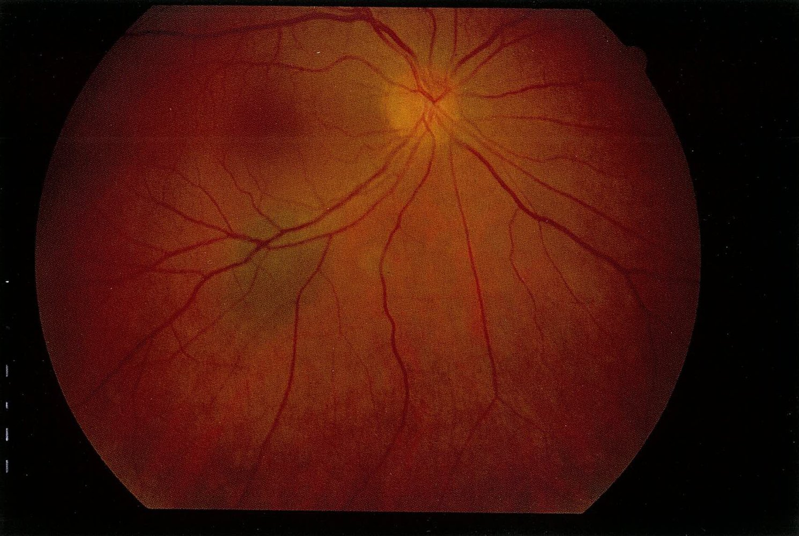
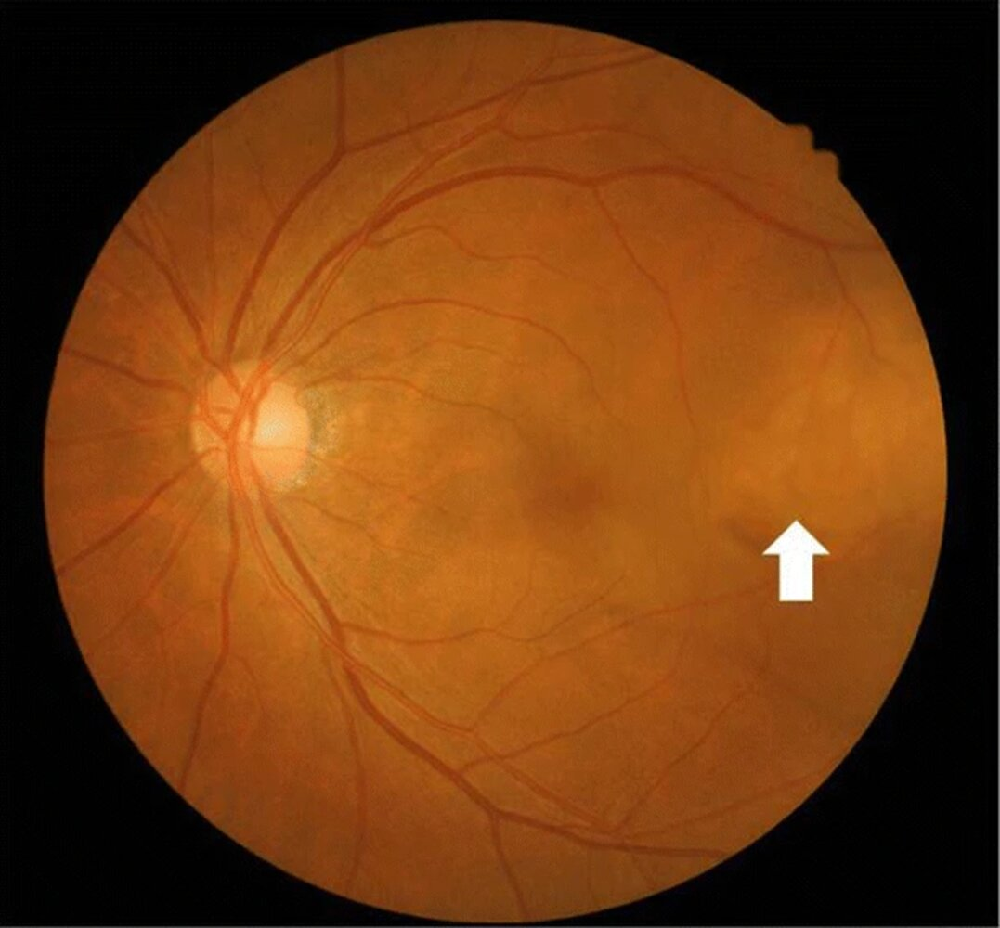
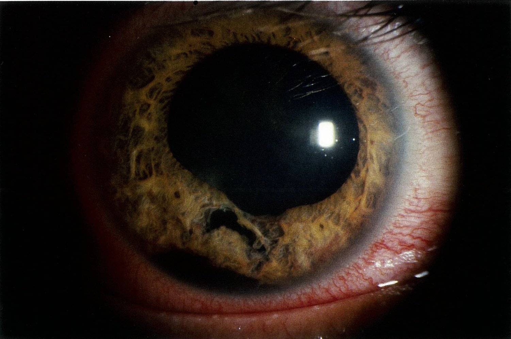

# Diseases of the uvea

*Categories: Clinical knowledge > Ophthalmology > Uvea and pupil > Diseases of the uvea*

[Original Article Link](https://coursology-qbank.com/amboss/article/JO0stT)

---

## Summary

<u>Uveitis</u> or inflammation of the <u>uveal tract</u> is often <u>idiopathic</u> but can be caused by noninfectious (especially <u>HLA-B27 syndromes</u>) and infectious etiologies. <u>Anterior uveitis</u> is the most common type and manifests with periocular <u>pain</u>, <u>ocular hyperemia</u> (red <u>eye</u>), and <u>photophobia</u>. <u>Posterior uveitis</u> manifests with painless visual disturbances, such as <u>floaters</u> and decreased <u>visual acuity</u>. <u>Uveitis</u> is typically <u>diagnosed clinically</u> based on history and <u>comprehensive eye examination</u> findings. <u>Uveitis</u> is typically treated with <u>topical corticosteroids</u>, <u>topical cycloplegics</u>, and management of the underlying etiology.

Other disorders of the <u>uvea</u> covered in this article are <u>neovascularization of the iris</u>, benign and malignant <u>uveal tumors</u>, <u>iridodialysis</u>, <u>iridodonesis</u>, heterochromia, and <u>Vogt-Koyanagi-Harada disease</u>.

---

## Uveitis

### Etiology [[1]](https://coursology-qbank.com/amboss/article/PadWko0)[[2]](https://coursology-qbank.com/amboss/article/Y-WnDL0)

<u>Uveitis</u> or inflammation of the <u>uveal tract</u> is often <u>idiopathic</u>.

#### Noninfectious uveitis

<u>Uveitis</u> caused by an inappropriate <u>immune response</u>; associated with systemic autoimmune and inflammatory conditions

* Systemic disease, especially <u>HLA-B27 syndromes</u> (e.g., <u>seronegative spondyloarthropathies</u>, <u>inflammatory bowel disease</u>)

* Trauma (including ocular <u>surgery</u>) can cause <u>traumatic iritis</u> or <u>traumatic iridocyclitis</u>

* Drug-induced <u>uveitis</u> is uncommon; causative agents include <u>cidofovir</u>, <u>rifabutin</u>, <u>prostaglandin</u> analogues

#### Infectious uveitis

<u>Uveitis</u> caused by an <u>immune response</u> to infection with a <u>pathogen</u>

* Viral infections: e.g., <u>herpes simplex conjunctivitis</u>, <u>herpes zoster ophthalmicus</u>, <u>cytomegalovirus infection</u>, <u>rubella</u>

* Bacterial infections: e.g., <u>bacterial keratitis</u>, <u>scleritis</u>, <u>tuberculosis</u>, <u>syphilis</u>, <u>lyme disease</u>

* Parasitic infections (causes <u>posterior uveitis</u>): <u>ocular toxoplasmosis</u>

> [!TIP]
> Acute <u>anterior uveitis</u> is most commonly <u>idiopathic</u> or associated with <u>HLA-B27</u> positivity (e.g., <u>ankylosing spondylitis</u>). [[1]](https://coursology-qbank.com/amboss/article/PadWko0)[[2]](https://coursology-qbank.com/amboss/article/Y-WnDL0)

### Classification [[1]](https://coursology-qbank.com/amboss/article/PadWko0)[[2]](https://coursology-qbank.com/amboss/article/Y-WnDL0)[[3]](https://coursology-qbank.com/amboss/article/dYdoLo0)

Based on the location of the affected structures, <u>uveitis</u> can be classified into:

* <u>Anterior uveitis</u> (most common type): inflammation of the <u>iris</u> and/or the <u>anterior</u> part of the <u>ciliary body</u> (pars plicata)

* <u>Posterior uveitis</u>: inflammation of the <u>retina</u> and/or <u>choroid</u>

* Intermediate uveitis: inflammation of the <u>vitreous</u> (vitritis) and the <u>posterior</u> part of the <u>ciliary body</u> (pars plana)

* Panuveitis: inflammation involving all structures of the <u>uvea</u>

Anatomy of the eye

### Clinical features [[1]](https://coursology-qbank.com/amboss/article/PadWko0)[[2]](https://coursology-qbank.com/amboss/article/Y-WnDL0)

* <u>Uveitis</u> typically manifests with decreased <u>visual acuity</u>.

* Symptom onset may be sudden or gradual depending on the cause.

* <u>Anterior uveitis</u> is painful; <u>posterior uveitis</u> may cause ocular discomfort or be painless.

* <u>Intermediate uveitis</u> manifests similarly to <u>posterior uveitis</u>. [[4]](https://coursology-qbank.com/amboss/article/tadXmo0)

|  Overview of <u>anterior</u> and <u>posterior uveitis</u> [[1]](https://coursology-qbank.com/amboss/article/PadWko0)[[2]](https://coursology-qbank.com/amboss/article/Y-WnDL0)  |  |  |
| --- | --- | --- |
|  |  Anterior uveitis (most common type)  | Posterior uveitis |
| Involved structures |   * <u>Iris</u> (<u>iritis</u>)  * <u>Ciliary body</u> (iridocyclitis, or <u>cyclitis</u>)    |   * <u>Choroid</u> (choroiditis)  * <u>Retina</u> (retinitis, chorioretinitis, or retinochoroiditis)    |
| Clinical features |   * Dull, progressive periocular <u>pain</u>  * <u>Ocular hyperemia</u> (red <u>eye</u>)  * <u>Photophobia</u>  * Blurred <u>vision</u>  * <u>Epiphora</u>  * Recurrences are common.    |  * Painless visual disturbances  * <u>Floaters</u>  * <u>Scotoma</u>  * Blurred <u>vision</u>   |
| <u>Comprehensive eye examination</u> findings |   * <u>Ciliary injection</u>  * <u>Pupillary exam</u>: <u>miosis</u>  * <u>Visual acuity</u>: mild/moderate decrease  * <u>Slit lamp</u> exam:  * <u>Leukocytes</u> in the <u>anterior</u> chamber  * <u>Cells and flare</u>  * <u>Cornea</u>: keratic precipitates on the corneal <u>endothelium</u>; may be clear  * <u>Hypopyon</u>  * <u>Iris</u> <u>nodules</u>    |   * <u>Visual acuity</u>: decreased  * <u>Slit lamp</u> exam: <u>leukocytes</u> in the <u>vitreous humor</u>  * <u>Fundoscopy</u>: foci of inflammation of the <u>choroid</u> and/or <u>retina</u>.    |
| Complications |   * Posterior synechiae   * Adhesions between the <u>iris</u> and the <u>lens</u>  * May lead to cloverleaf-shaped <u>pupillary</u> distortion  * Anterior synechiae:  * Adhesions between the <u>iris</u> and the <u>cornea</u> or <u>trabecular meshwork</u>  * May lead to <u>angle-closure glaucoma</u>  * <u>Open angle glaucoma</u>  * <u>Cataract</u>    |   * <u>Visual field</u> loss due to scarring  * Major loss of <u>visual acuity</u>, if <u>macula</u> is affected    |

> [!TIP]
> <u>Posterior uveitis</u> and panuveitis are more <u>vision</u>-threatening than <u>anterior uveitis</u>. [[3]](https://coursology-qbank.com/amboss/article/dYdoLo0)

> [!WARNING]
> Individuals with <u>eye</u> redness, sensitivity to light, vision changes, and/or <u>eye</u> pain (RSVP) require immediate evaluation by ophthalmology.

Anterior uveitis

Anterior uveitis

Anterior uveitis

Posterior synechiae in anterior uveitis

Chorioretinitis

Multifocal choroiditis in sarcoidosis

### Management [[1]](https://coursology-qbank.com/amboss/article/PadWko0)[[2]](https://coursology-qbank.com/amboss/article/Y-WnDL0)[[5]](https://coursology-qbank.com/amboss/article/AN1Rdh0)

* Urgent ophthalmology consultation or referral is recommended.

* Noninfectious or <u>idiopathic</u> <u>uveitis</u>

* Start supportive measures (<u>topical corticosteroid</u>, <u>topical cycloplegics</u>); identify and treat the underlying cause as needed. [[6]](https://coursology-qbank.com/amboss/article/oZd0co0)

* Further specialist referrals or consults (e.g., rheumatolgy, <u>immunology</u>) may be needed.

* <u>Infectious uveitis</u>: Initiate specific treatment and consider adjunctive supportive measures as needed.

### Diagnostics [[1]](https://coursology-qbank.com/amboss/article/PadWko0)[[2]](https://coursology-qbank.com/amboss/article/Y-WnDL0)

* <u>Uveitis</u> is <u>diagnosed clinically</u> based on history and findings on <u>eye examination</u> (see “Clinical features”).

* Imaging (e.g., ocular <u>ultrasound</u>, <u>optical coherence tomography</u>, fluoroscein <u>angiography</u>) may be required in select situations to confirm the diagnosis.

* Evaluation for the underlying etiology

* Not routinely required for the first episode of mild, unilateral <u>anterior uveitis</u> with no features of a systemic disease

* Indicated for:

* Recurrent, worsening, or bilateral <u>uveitis</u>

* Suspected undiagnosed systemic disease

* Targeted diagnostics as needed; examples include:

* <u>Diagnostics for ankylosing spondylitis</u>

* <u>Diagnostics for tuberculosis</u>

* <u>Diagnostics for sarcoidosis</u>

* <u>Syphilis testing</u>

* Consider typing for <u>HLA-B27</u> in individuals with recurrent <u>anterior uveitis</u>.

> [!TIP]
> Suspect drug-induced <u>uveitis</u> in individuals with unexplained <u>uveitis</u> occurring days or months after exposure to a new medication. [[2]](https://coursology-qbank.com/amboss/article/Y-WnDL0)

#### Treatment

* Supportive measures

* <u>Topical corticosteroids</u> (e.g., 1% <u>prednisolone</u> acetate, 0.1% <u>dexamethasone</u>) are often used as a first-line antiinflammatory agents. [[1]](https://coursology-qbank.com/amboss/article/PadWko0)

* <u>Topical cycloplegics</u> (e.g., 1% <u>cyclopentolate</u>, 1% <u>atropine</u>)  [[1]](https://coursology-qbank.com/amboss/article/PadWko0)

* Treatment of the underlying etiology [[3]](https://coursology-qbank.com/amboss/article/dYdoLo0)

* <u>Infectious uveitis</u>: Start specific treatment; see respective articles for details.

* <u>Noninfectious uveitis</u>: <u>multidisciplinary care</u> to address the underlying condition [[1]](https://coursology-qbank.com/amboss/article/PadWko0)[[7]](https://coursology-qbank.com/amboss/article/GzWB8L0)

* Options for refractory <u>uveitis</u> [[1]](https://coursology-qbank.com/amboss/article/PadWko0)

* Systemic or intraocular <u>corticosteroids</u>

* <u>Antimetabolites</u> (e.g., <u>methotrexate</u>)

> [!WARNING]
> Delayed treatment can result in <u>vision loss</u>. [[3]](https://coursology-qbank.com/amboss/article/dYdoLo0)

---

## Neovascularization of the iris

* Definition: pathological <u>neovascularization of the iris</u>

* Etiology

* Vascular <u>hypoxia</u> (e.g., <u>central retinal vein occlusion</u>, <u>central retinal artery occlusion</u>, <u>temporal arteritis</u>)

* Neural diseases (e.g., <u>diabetic retinopathy</u>)

* Inflammatory (e.g., chronic <u>uveitis</u>)

* <u>Neoplasms</u> of the <u>eye</u> (e.g., <u>uveal melanoma</u>)

* Pathophysiology: : chronic <u>ischemia</u> of the <u>retina</u> → release of vasoproliferative substances; , such as <u>VEGF</u>, which also affect the <u>anterior</u> segment of the <u>eye</u> → <u>neovascularization</u> of the <u>iris</u>

* Clinical features: initially asymptomatic; symptoms arise following complications of the condition (see below)

* Treatment

* Goal: reduce <u>ischemic</u> impetus for <u>neovascularization</u>

* Laser treatment: <u>panretinal photocoagulation</u>: Risks associated with laser treatment include night <u>vision</u> impairment, <u>visual field</u> loss, and/or further <u>fibrosis</u> of the <u>vitreous body</u> with risk of <u>retinal detachment</u>.

* <u>VEGF</u> inhibitors

* Complications

* <u>Anterior</u> chamber hemorrhage (<u>hyphema</u>)

* Progressive <u>neovascular glaucoma</u>: displacement of the chamber angle due to newly formed vessels → secondary <u>angle-closure glaucoma</u> → complications, including decreased <u>visual acuity</u>

Neovascularization of the iris (rubeosis iridis)

Neovascularization of the iris (rubeosis iridis)

Neovascularization of the iris (rubeosis iridis)

References:[[8]](https://coursology-qbank.com/amboss/article/8QYOBK)[[9]](https://coursology-qbank.com/amboss/article/uQYpBK)

---

## Tumors

### <u>Benign tumors</u>

* Choroidal nevus: benign melanocytic lesion (<u>nevus</u>) of the <u>posterior</u> <u>uvea</u>

* <u>Epidemiology</u>: common  [[10]](https://coursology-qbank.com/amboss/article/EQY8BK)

* Fundoscopic appearance 

* Flat or slightly elevated

* Gray-yellow in color

* Clearly defined margins

* Remains stable in size over time

* Treatment

* No treatment necessary

* Regular monitoring is important as malignant transformation is possible, though rare.

Benign choroidal nevus

### <u>Malignant tumors</u>

* <u>Uveal melanoma</u>: most common primary intraocular <u>malignancy</u> [[11]](https://coursology-qbank.com/amboss/article/vQYABK)

* Uveal metastasis

* <u>Epidemiology</u>

* Most common intraocular <u>malignancy</u> in adults

* Primary cancers most commonly leading to <u>uveal metastasis</u>: <u>breast cancer</u> and <u>lung cancer</u>

* <u>Fundoscopy</u> 

* Elevated edges

* Gray-yellow in color

* Indiscrete margins, irregular shape

* Grows over time

* Signs of serous <u>retinal detachment</u>

Choroidal metastasis

---

## Rare conditions

### Iridodialysis

* Definition: separation of the <u>iris</u> from the <u>ciliary body</u>

* Etiology: <u>blunt trauma</u> to the <u>eye</u>

* Clinical features

* <u>Diplopia</u>

* <u>Photophobia</u>

* Glare symptoms

* Other signs and symptoms of <u>blunt trauma</u> to the <u>eye</u> (e.g., <u>anterior</u> chamber hemorrhage, secondary <u>glaucoma</u>, <u>vision loss</u>)

* Diagnostics [[12]](https://coursology-qbank.com/amboss/article/DQY1yK)

* <u>Slit-lamp examination</u>

* Irregular <u>pupil</u>

* In cases of large <u>iridodialysis</u>: double <u>pupil</u>

* <u>Ophthalmoscopy</u> to exclude further traumatic bulb injuries

* Treatment [[13]](https://coursology-qbank.com/amboss/article/wQYhyK)

* Observation, bed rest

* <u>Topical cycloplegics</u> (e.g., <u>atropine</u>, <u>scopolamine</u>) and <u>glucocorticoids</u>

* In cases of <u>anterior</u> chamber hemorrhage: <u>anterior</u> chamber washout

* If <u>diplopia</u> or other visual disturbances persist: surgical repair

Iridodialysis

### Iridodonesis [[14]](https://coursology-qbank.com/amboss/article/9QYNyK)

* Definition: vibration or tremulous movement of the <u>iris</u> elicited by <u>eye</u> movement

* Etiology: <u>aphakia</u> (i.e., absent <u>lens of the eye</u>), <u>ectopia lentis</u>

### Heterochromia iridum

* Definition: <u>irises</u> of different color

* Types

* Congenital heterochromia

* Acquired heterochromia

* Injury or infection

* <u>Horner syndrome</u>

* <u>Glaucoma</u>

* Fuchs heterochromic iridocyclitis: a chronic low-grade inflammatory disease of the <u>eye</u> characterized by heterochromia and ciliary <u>fibrosis</u>.

* <u>Sympathetic</u> heterochromia

* <u>Ocular melanosis</u>

Heterochromia iridum

### Vogt-Koyanagi-Harada disease [[15]](https://coursology-qbank.com/amboss/article/5c1i1f0)[[16]](https://coursology-qbank.com/amboss/article/Mc1M1f0)

* Definition: a rare systemic condition characterized by a rapid loss of <u>vision</u>, <u>alopecia</u>, <u>vitiligo</u>, <u>poliosis</u>, and neurological symptoms (e.g., <u>vertigo</u>, drowsiness)

* <u>Epidemiology</u>

* Peak onset between 30–40 years of age [[15]](https://coursology-qbank.com/amboss/article/5c1i1f0)

* Most common in southeast Asian and Hispanic populations

* Etiology: The exact cause is unknown.

* Pathophysiology: thought to involve an autoimmune response to <u>antigens</u> associated with <u>retinal pigment epithelium</u>, <u>melanin</u>, and <u>melanocytes</u> [[16]](https://coursology-qbank.com/amboss/article/Mc1M1f0)

* Clinical features: manifests in 4 distinct stages
1. * <u>Prodromal</u> stage: unspecific, <u>flu-like symptoms</u> (e.g., <u>headache</u>, <u>fever</u>, <u>dizziness</u>, <u>eye pain</u>) for 3–5 days
2. * Acute uveitic stage: blurred <u>vision</u> that initially affects only one <u>eye</u>, but progresses to the second <u>eye</u> within 2 weeks
3. * Chronic stage: <u>vitiligo</u>, <u>poliosis</u>, and <u>choroid</u> depigmentation.
4. * Recurrent stage: panuveitis

* Diagnostics [[17]](https://coursology-qbank.com/amboss/article/ni17Hg0)

* Primary diagnosis is based on clinical features and characteristic <u>fundoscopy</u> findings

* Uveitic stage: <u>posterior uveitis</u> with multiple serous <u>retinal detachments</u> → panuveitis

* Chronic stage: sunset-glow fundus (orange-red discoloration of the <u>choroid</u> due to inflammatory depigmentation).

* Recurrent stage: panuveitis with acute exacerbations of <u>anterior uveitis</u> and <u>iris</u> <u>nodules</u>

* Additional tests (e.g., <u>optical coherence tomography</u>, fundus <u>fluorescein angiography</u>, <u>electroretinography</u>) may be indicated if findings are inconclusive or to assess treatment efficiency

* Treatment

* Acute phase: high dose <u>corticosteroids</u>

* Maintenance: oral <u>corticosteroids</u> for at least 6 months OR <u>immunosuppressants</u> (e.g., <u>azathioprine</u>, <u>cyclosporine A</u>)

* Complications: <u>secondary cataracts</u>, <u>glaucoma</u>, and/or subretinal <u>neovascularization</u> (potentially loss of <u>vision</u>)

* Prognosis: <u>Visual acuity</u> can be preserved when the condition is diagnosed early and treated aggressively.

---