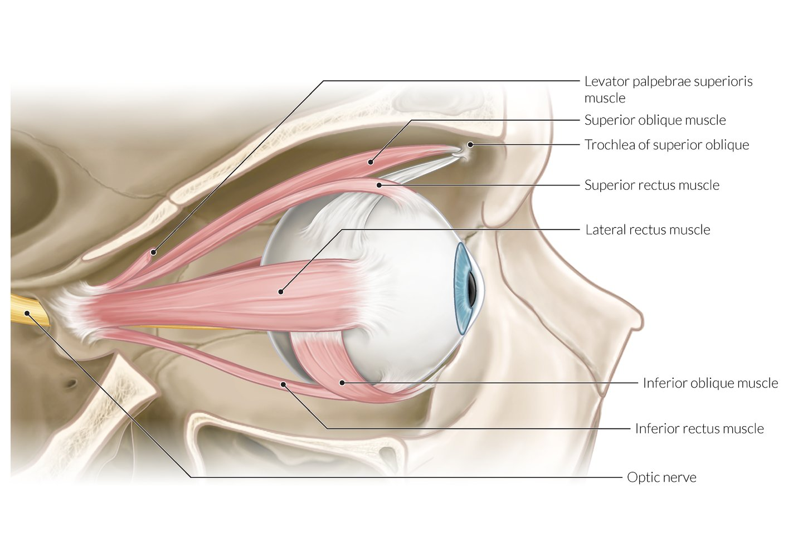
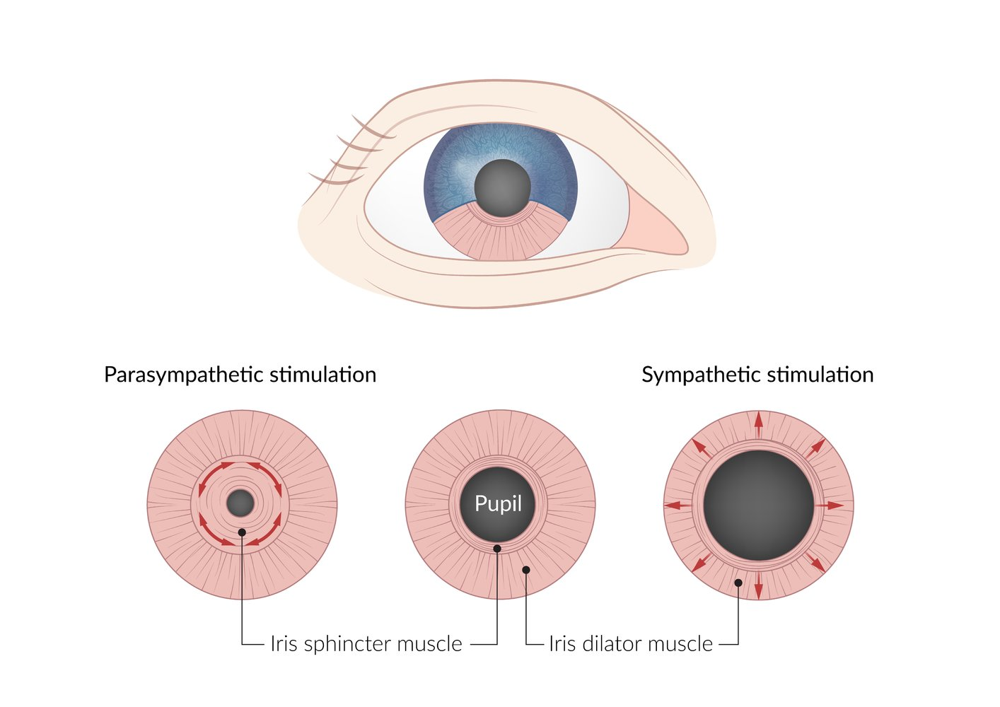
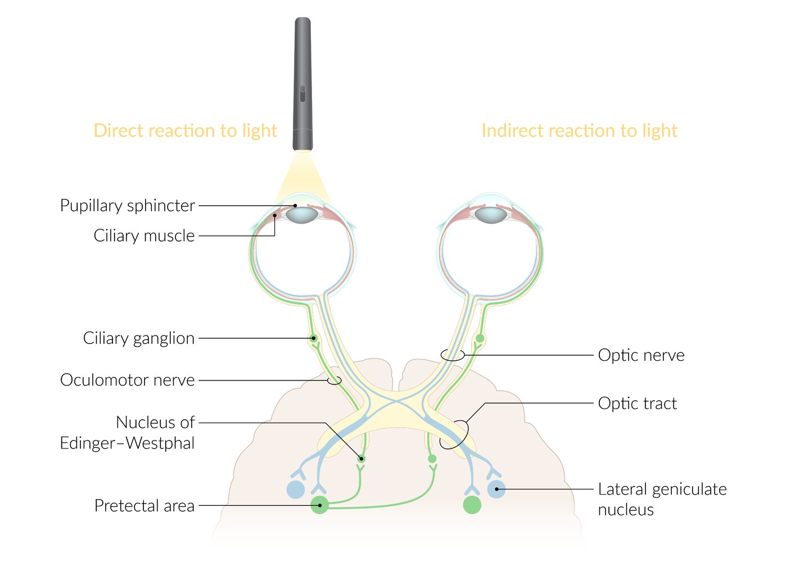
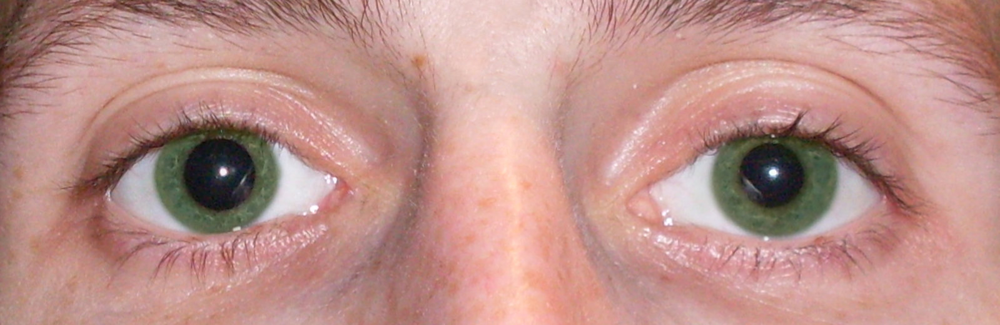

# Physiology and abnormalities of the pupil

*Categories: Clinical knowledge > Ophthalmology > Uvea and pupil > Physiology and abnormalities of the pupil*

[Original Article Link](https://coursology-qbank.com/amboss/article/qO0CtT)

---

## Summary

The <u>pupil</u> is an opening in the center of the <u>iris</u> through which light enters the <u>eye</u>. <u>Pupillary</u> size can vary in response to <u>light intensity</u> and neurologic stimuli. Increasing brightness causes <u>pupillary</u> constriction (<u>miosis</u>) while increasing darkness causes <u>pupillary</u> dilation (<u>mydriasis</u>). <u>Pupillary</u> abnormalities can be caused by a variety of conditions.

---

## Overview

* Isocoria: the <u>pupils</u> of both eyes are the same size
* Normal <u>pupil</u> diameter: [[1]](https://coursology-qbank.com/amboss/article/3mXS2A)

* In bright light: 2–4 mm

* In the dark: 4–8 mm

* Fixed pupil: the absence of <u>pupillary</u> response to a light stimulus or <u>convergence</u> testing

* Afferent neural pathway (afferent limb)

* Registration of light stimulus in the <u>eye</u> and transmission of the impulse to the <u>central nervous system</u>

* Isolated unilateral <u>afferent pupillary defect</u> (e.g. <u>optic neuritis</u>) → <u>pupils</u> are isocoric

* Illumination of the affected <u>eye</u> leads to reduced/absent constriction of both <u>pupils</u>.

* Illumination of the unaffected <u>eye</u> leads to normal <u>pupillary</u> constriction in both eyes.

* Efferent neural pathway (efferent limb): impulse transmission to the <u>iris sphincter muscle</u>

* <u>Parasympathetic nervous system</u> mediates motor innervation of the <u>iris sphincter muscle</u>

* <u>Sympathetic nervous system</u> mediates motor innervation of the <u>iris</u> dilatator muscle

* Isolated unilateral efferent <u>pupillary</u> defect (i.e. impairment of the <u>pupillary reflex</u>) → <u>pupils</u> are <u>anisocoric</u>

---

## Accommodation and convergence

* <u>Accommodation</u>

* Adjustment of the eyes to different distances (near <u>vision</u> versus far <u>vision</u>)

* Primarily managed by the <u>lens</u>'s convexity changes through the contraction and relaxation of <u>ciliary muscles</u>

* Mediated by the <u>Edinger-Westphal nuclei</u>

* <u>Convergence</u>

* The simultaneous inward movement of both eyes to focus on close objects

* Facilitated by the bilateral action of the <u>medial</u> recti muscles

* Mediated by the <u>oculomotor nerve</u> (<u>CN III</u>)

* <u>Accommodation reflex</u>

* The coordinated response to a suddenly closer object, involving <u>pupil</u> constriction (<u>miosis</u>), <u>eye</u> <u>convergence</u>, and increased <u>lens</u> convexity through the contraction of the <u>ciliary muscles</u>

* Mediated by the <u>oculomotor nerve</u> and the <u>Edinger-Westphal nucleus</u>

* For more information, please see "<u>Accommodation (eye)</u>" in "<u>Visual processing</u>."

Anatomy of the eye

Anatomy of the eye and surrounding structures

Anatomy of the extraocular muscles

---

## Pupillary response

### <u>Pupillary</u> control [[2]](https://coursology-qbank.com/amboss/article/uhYpfK)

<u>Pupillary</u> control is mediated by both <u>parasympathetic</u> and <u>sympathetic</u> innervation.

#### Mydriasis

* Definition: dilation of the <u>pupil</u> (> 4 mm in daylight)

* Mechanism

* Contraction of the <u>iris dilator muscle</u> (surrounds the peripheral part of <u>iris</u>)
* Innervated by <u>sympathetic</u> fibers

* First-order <u>neuron</u>: <u>sympathetic</u> <u>hypothalamic</u> fibers → <u>lateral</u> intermediate columns of the spinal cord → ciliospinal center of Budge (C8–T2)

* Second-order <u>neuron</u>: <u>preganglionic</u> <u>sympathetic</u> fibers (exit from the T1 segment of the spinal cord) → rises to the upper cervical region along the cervical <u>sympathetic trunk</u> (passes near subclavian vessels and <u>lung</u> apex) → <u>sympathetic</u> trunk → <u>superior cervical ganglion</u>

* Third-order <u>neuron</u>: <u>postganglionic</u> <u>sympathetic</u> fibers form a plexus along the internal carotid <u>artery</u> → <u>cavernous sinus</u> → plexus forms long ciliary nerve and enter <u>superior orbital fissure</u> → dilator muscle of the <u>iris</u> (<u>pupillary</u> dilation), <u>superior tarsal muscle</u> of the <u>eyelid</u> (upper <u>eyelid</u> <u>retraction</u>), <u>sweat glands</u> of the upper face

* Indirectly by relaxation of the <u>iris sphincter muscle</u>

#### Miosis

* Definition: constriction of the <u>pupil</u> (< 2 mm in daylight)

* Mechanism

* Contraction of the <u>iris sphincter muscle</u> (surrounds <u>pupil</u>)
* Innervated by <u>parasympathetic</u> fibers

* First-order <u>neuron</u>: fibers from <u>Edinger-Westphal nucleus</u> → <u>oculomotor nerve</u> fibers (located in the periphery of the <u>oculomotor nerve</u>) → <u>ciliary ganglion</u>

* Second-order <u>neuron</u>: <u>ciliary ganglion</u> → short ciliary nerves → <u>pupillary sphincter</u>

* Indirectly by relaxation of the <u>iris dilator muscle</u>

> [!NOTE]
> Short ciliary nerves make the <u>pupillary</u> muscle fibers short (leading to <u>miosis</u>), while long ciliary nerves make the <u>pupillary</u> muscle fibers long.

Miosis and mydriasis

Muscles of the iris

### Pupillary light reflex

* Definition: constriction of the <u>pupils</u> in response to light

* Types

* Direct pupillary reflex: constriction of the <u>pupil</u> in response to <u>ipsilateral</u> light stimulation

* Indirect pupillary reflex (<u>consensual pupillary reflex</u>): constriction of the <u>pupil</u> in response to illumination of the <u>contralateral</u> <u>eye</u>

* Anatomical pathway of nerve fibers 
1. * <u>Retinal ganglion cell</u> <u>neurons</u> (first-order)

* Impulses from the <u>retina</u> travel in the afferent <u>optic nerve</u> (<u>CN II</u>) to the <u>optic chiasm</u>

* At the <u>optic chiasm</u>

* Fibers from the temporal half of the <u>retina</u> → <u>ipsilateral</u> <u>optic tract</u> → <u>ipsilateral</u> pretectal <u>nucleus</u> in the <u>midbrain</u>

* Fibers from the nasal half of the <u>retina</u> crossover → <u>contralateral</u> <u>optic tract</u> → <u>contralateral</u> pretectal <u>nucleus</u>
2. * Internuncial <u>neurons</u> (second-order): Fibers from each pretectal <u>nucleus</u> innervate both the <u>ipsilateral</u> and <u>contralateral</u> <u>Edinger-Westphal nuclei</u>.
3. * <u>Preganglionic</u> <u>parasympathetic</u> motor <u>neurons</u> (third-order): efferent limb arises from <u>Edinger-Westphal nucleus</u> → <u>oculomotor nerve</u> (<u>CN III</u>) → <u>ciliary ganglion</u>
4. * <u>Postganglionic</u> <u>parasympathetic</u> motor <u>neurons</u> (fourth-order): arise from the <u>ciliary ganglion</u> → short ciliary nerves → <u>iris sphincter muscle</u> → direct and consensual <u>pupillary</u> constriction

Pupillary light reflex

---

## Afferent pupillary defect

* Description: impaired <u>pupillary</u> constriction due to a defect in the <u>afferent pathway</u> of the <u>pupillary light reflex</u>

* Etiology

* <u>Optic nerve</u> lesions (e.g., <u>optic neuritis</u>, <u>retrobulbar neuritis</u> in <u>multiple sclerosis</u>, <u>anterior ischemic optic neuropathy</u>, <u>glaucoma</u>)

* Severe retinal disease (e.g., <u>central retinal artery occlusion</u>, extensive <u>retinal detachment</u>)

* Maculopathy (<u>macular degeneration</u>)

* <u>Optic tract</u> lesions (e.g., <u>infarction</u>)

* Clinical features

* Unilateral afferent pupillary defect (<u>relative afferent pupillary defect</u>, <u>Marcus Gunn pupil</u>)

* Indicates a unilateral or asymmetric defect of the <u>afferent pathway</u> of the <u>pupillary light reflex</u>

* Positive <u>swinging flashlight test</u>

* Light stimulus shone onto a normal <u>eye</u> results in intact <u>direct pupillary reflex</u> and <u>indirect pupillary reflex</u> (i.e., constriction of both <u>pupils</u>).

* Light stimulus rapidly transferred to the affected <u>eye</u> results in impaired <u>direct pupillary reflex</u> and <u>indirect pupillary reflex</u> (i.e., dilation of both <u>pupils</u>).

* Bilateral: impaired direct and <u>indirect pupillary reflexes</u> in both eyes

---

## Anisocoria

* Definition: a difference in size between <u>pupils</u> > 1 mm

* Etiology

* Physiological <u>anisocoria</u>: <u>idiopathic</u>

* Occurs in up to 20% of individuals  [[3]](https://coursology-qbank.com/amboss/article/imXJ2A)

* Size difference between <u>pupils</u> is typically < 1 mm

* Degree of <u>anisocoria</u> does not change in response to changes in ambient light

* Typically intermittent and <u>self-limiting</u> but can be persistent in some individuals

* Nonphysiological <u>anisocoria</u>: size difference between <u>pupils</u> is typically > 1 mm

* Disorders of the <u>iris</u>

* <u>Anterior uveitis</u>

* Acute <u>angle closure glaucoma</u>

* <u>Eye trauma</u> or <u>eye</u> <u>surgery</u>

* Congenital defects (e.g., <u>iris</u> <u>coloboma</u>, <u>heterochromia iridis</u>)

* Disorders affecting <u>sympathetic</u> or <u>parasympathetic</u> innervation of the <u>pupil</u>

* If a <u>sympathetic</u> defect or <u>parasympathetic</u> overactivity → <u>pupillary</u> constriction

* If a <u>parasympathetic</u> defect or <u>sympathetic</u> overactivity → <u>pupillary</u> dilation

* May be pharmacological or nonpharmacological

| Extraocular causes of nonphysiological <u>anisocoria</u> |  |  |
| --- | --- | --- |
|  | <u>Pupillary</u> constriction | <u>Pupillary</u> dilation |
| Pharmacological |  * <u>Miotic</u> eyedrops (e.g., <u>pilocarpine</u>)   |  * <u>Mydriatic</u> eyedrops  * <u>M3</u> <u>antagonists</u> at <u>pupillary sphincter</u> (e.g., <u>atropine</u>, <u>homatropine</u>, <u>tropicamide</u>, <u>cyclopentolate</u>)  * <u>α-1 agonists</u> at <u>pupillary dilator</u> (e.g., <u>phenylephrine</u>, <u>cocaine</u>)   |
| Nonpharmacological |   * <u>Horner syndrome</u> (<u>sympathetic trunk</u> lesion → defective <u>iris dilator muscle</u> response)  * Central lesions: <u>stroke</u>, <u>multiple sclerosis</u>, <u>lateral medullary syndrome</u>, neck trauma  * Peripheral lesions: <u>Pancoast tumor</u>, <u>mediastinal</u>/<u>thyroid</u> mass    |   * <u>Adie tonic pupil</u>  * Damage to the basilar segment of the <u>oculomotor nerve</u> (with concomitant down-and-out gaze, <u>ptosis</u>, and <u>accommodation</u> loss)  * Benign episodic unilateral <u>mydriasis</u> (associated with <u>migraine</u>)    |

* Diagnostics: light reflex

* If the light reflex is poor in one <u>eye</u>, perform a <u>slit lamp</u> <u>examination of the eye</u> to rule out intraocular causes.
* If <u>slit lamp examination</u> is normal, administer low-dose <u>pilocarpine</u> (0.1%) or <u>methacholine</u> (2.5%) <u>eye</u> drops

* If <u>pupil</u> constricts: suspect <u>Adie tonic pupil</u>

* If <u>pupil</u> does not constrict: administer high-dose <u>pilocarpine</u> (1%) <u>eye</u> drops

* If <u>pupil</u> does not constrict: suspect pharmacological <u>mydriasis</u>

* If <u>pupil</u> constricts: suspect <u>oculomotor nerve palsy</u>

* If the light reflex is adequate in both eyes, perform a <u>slit lamp examination</u> to look for a dilation lag.

* If no dilation lag is present, administer <u>cocaine</u> (2–10%) or apraclonidine (0.5–1%) <u>eye</u> drops
* If <u>pupil</u> does not dilate: <u>Horner syndrome</u>

* If dilation lag is present, suspect <u>Horner syndrome</u>

> [!TIP]
> <u>Anisocoria</u> is not associated with <u>afferent pupillary defects</u>.

Anisocoria

---

## Drugs affecting pupillary size

| Most common drugs that affect <u>pupillary</u> size |  |  |  |
| --- | --- | --- | --- |
|  | <u>Receptor</u> | Drug class | Agents |
| Dilation |  * <u>M3 receptor</u> <u>antagonism</u>   |  * <u>Anticholinergic</u>   |   * <u>Atropine</u>  * <u>Tropicamide</u>  * <u>Scopolamine</u> (<u>hyoscine</u>)    |
|  * <u>Antipsychotics</u>   |   * <u>Haloperidol</u>  * <u>Risperidone</u>  * <u>Olanzapine</u>    |  |  |
|  * <u>Antihistamines</u>   |   * <u>Diphenhydramine</u>  * <u>Doxylamine</u>  * <u>Chlorpheniramine</u>    |  |  |
|  * <u>Opioids</u>   |  * <u>Meperidine</u>   |  |  |
|  * <u>Antidepressant</u>   |  * <u>Tricyclic antidepressants</u> (e.g., <u>amitriptyline</u>, <u>imipramine</u>, <u>desipramine</u>)   |  |  |
|  * <u>α1 receptor</u> <u>agonism</u>   |  * <u>Sympathomimetic drugs</u>   |   * <u>Epinephrine</u>  * <u>Amphetamines</u>  * <u>LSD</u>  * <u>Cocaine</u>    |  |
| Constriction |  * <u>M3 receptor</u> <u>agonism</u>   |  * <u>Parasympathomimetics</u>   |   * Direct  * <u>Pilocarpine</u>  * <u>Carbachol</u>  * <u>Organophosphates</u>  * Indirect  * <u>Physostigmine</u>  * <u>Echothiophate</u>    |
|  * <u>α1 receptor</u> <u>antagonism</u>   |  * α-Blocker   |   * <u>Tamsulosin</u>  * <u>Phenoxybenzamine</u>    |  |
|  * <u>α2 receptor</u> <u>agonism</u>   |  * <u>Sympatholytics</u>   |   * <u>Clonidine</u>  * <u>Methyldopa</u>    |  |
|  * <u>Opioid</u> <u>receptor</u> <u>agonism</u>   |  * <u>Opioids</u>   |   * <u>Heroin</u>  * <u>Morphine</u>    |  |

---

## Other pupillary defects

* Gardener pupil: <u>pupillary</u> dilation (<u>mydriasis</u>) due to ingestion of plant alkaloids, e.g., of Jimson <u>weed</u> (Datura stramonium)

* Blown pupil: <u>pupillary</u> dilation (may be accompanied by <u>ptosis</u>) due to a <u>saccular aneurysm</u>:  in the <u>posterior communicating artery</u> territory or <u>uncal herniation</u> causing compression of the <u>ipsilateral</u> oculomotor <u>cranial nerve</u>.

* Fixed dilated pupil: dilated, unresponsive <u>pupil</u>, e.g. due to <u>closed-angle glaucoma</u>

* Hutchinson pupil: <u>pupillary</u> abnormalities that lead to a <u>fixed dilated pupil</u> in 3 stages as a result of <u>increased intracranial pressure</u> (typically <u>uncal herniation</u>).

* Stage 1: irritation of the <u>ipsilateral</u> <u>parasympathetic</u> fibers overlying the <u>oculomotor nerve</u> → constriction of the <u>ipsilateral</u> <u>pupil</u>

* Stage 2

* Compression of the <u>ipsilateral</u> <u>parasympathetic</u> fibers overlying the <u>oculomotor nerve</u> → dilation of the <u>ipsilateral</u> <u>pupil</u>

* Irritation of the <u>contralateral</u> <u>parasympathetic</u> fibers overlying the <u>oculomotor nerve</u> → constriction of the <u>contralateral</u> <u>pupil</u>

* Stage 3: compression of the <u>contralateral</u> <u>parasympathetic</u> fibers overlying the <u>oculomotor nerve</u> → dilation of the <u>contralateral</u> <u>pupil</u> → both sides are paralyzed → both <u>pupils</u> are fixed and dilated

* Light-near dissociation: a sluggish reaction of the <u>pupil</u> to light with <u>accommodation</u> intact [[4]](https://coursology-qbank.com/amboss/article/vhYAfK)

* Unilateral <u>light-near dissociation</u>

* Adie tonic pupil: <u>light-near dissociation</u> due to <u>postganglionic</u> <u>parasympathetic</u> pupillomotor damage

* Holmes Adie syndrome: <u>Adie tonic pupil</u> accompanied by <u>photophobia</u>, diminished <u>deep tendon reflexes</u>, and <u>orthostatic hypotension</u>

* <u>Varicella-zoster</u> infection

* <u>Giant cell arteritis</u>

* Orbital trauma

* Bilateral light near-dissociation

* <u>Parinaud syndrome</u> (e.g., <u>pinealoma</u>, <u>multiple sclerosis</u>, <u>obstructive hydrocephalus</u>, <u>midbrain</u> <u>stroke</u>)

* <u>Argyll Robertson pupils</u> (<u>neurosyphilis</u>)

---