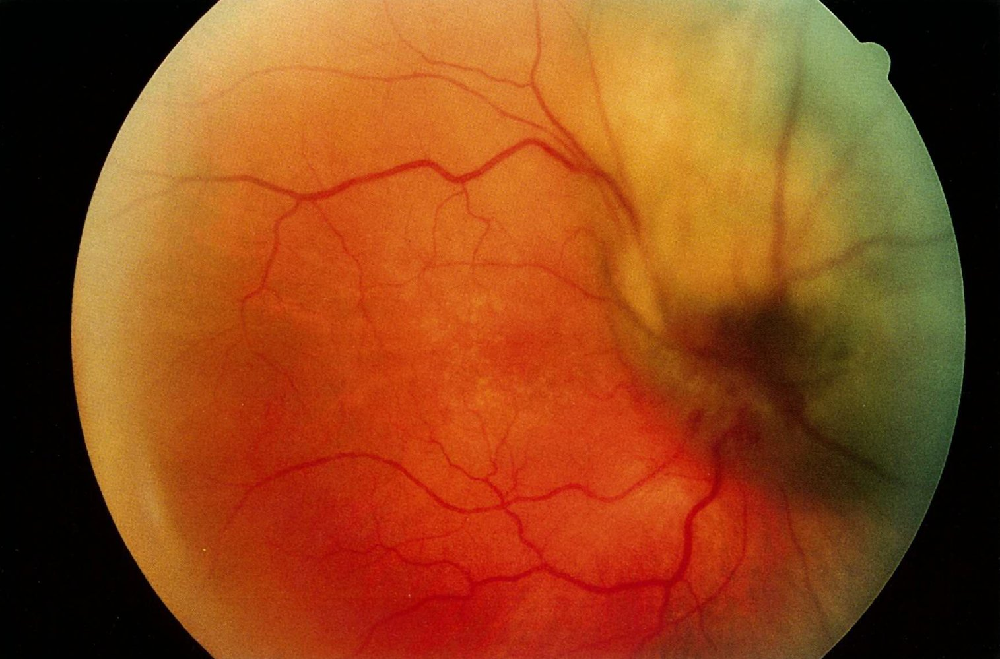

# Uveal melanoma

*Categories: Clinical knowledge > Ophthalmology > Uvea and pupil > Uveal melanoma*

[Original Article Link](https://coursology-qbank.com/amboss/article/NM0-Kg)

---

## Summary

Uveal <u>melanoma</u> is the most common primary <u>malignant tumor</u> of the <u>eye</u>. It develops from choroidal <u>melanocytes</u> and is therefore often pigmented. The <u>tumor</u> can arise from the <u>choroid</u>, <u>iris</u>, or <u>ciliary body</u>. Symptoms, which depend on the location of the <u>tumor</u>, begin when the <u>tumor</u> extends to the optical axis or if there is concomitant <u>retinal detachment</u> or interference with the function of the <u>ciliary body</u> or <u>pupil</u>. The condition is diagnosed through <u>fundoscopy</u> and <u>ultrasonography</u>. Treatment usually consists of <u>radiation therapy</u> or surgical removal of the <u>tumor</u> in advanced disease. With the exception of <u>iris</u> <u>melanoma</u>, uveal <u>melanoma</u> is typically diagnosed late because of the lack of early symptoms. Approximately half of patients go on to develop distant <u>metastases</u> via hematogenous spread, most commonly to the <u>liver</u>, which are then fatal.

---

## Clinical features

Symptoms vary depending on <u>melanoma</u> location.

* <u>Choroid</u> or <u>ciliary body</u> <u>melanoma</u>

* Initially asymptomatic

* Late symptoms

* <u>Vision loss</u> due to <u>tumor</u> growth into the optical axis

* <u>Visual field</u> defects, <u>floaters</u>, and/or <u>photopsia</u> due to <u>tumor</u>-related <u>retinal detachment</u>

* Blurred <u>vision</u> due to <u>tumor</u> growth in the <u>ciliary body</u>

* <u>Iris</u> <u>melanoma</u>

* Typically discovered earlier than choroidal or <u>ciliary body</u> <u>melanoma</u> because of visible signs

* Distortion of <u>pupil</u> shape

* A new brown <u>nodule</u> on the <u>iris</u> that becomes visible, or growth of a previous <u>nodule</u>

* Blurred <u>vision</u>

* Transscleral <u>melanoma</u> with extension into the <u>orbit</u>

* <u>Pain</u>

* <u>Vision loss</u>

* <u>Cataract</u>

* <u>Proptosis</u>

---

## Diagnosis

* <u>Fundoscopy</u>

* Nodular, dome-shaped subretinal mass

* Traits that are more likely to be found in <u>melanomas</u> than benign <u>nevi</u> :

* <u>Tumor</u> growth

* Thickness > 2 mm

* Orange-colored pigment on the surface of the lesion

* <u>Retinal detachment</u>

* Additional tests 

* <u>Ultrasonography</u>

* <u>Fluorescein angiography</u>

* Staging 

* <u>Liver function</u> tests

* CT/<u>MRI</u>

* Chest <u>x-ray</u>

Choroidal melanoma

Choroidal melanoma

References:[[4]](https://coursology-qbank.com/amboss/article/h4YcQ6)

---

## Differential diagnoses

* <u>Uveal metastases</u> (mainly <u>lung</u> and <u>breast cancer</u>, <u>lymphoma</u>) are more common than primary uveal <u>malignant melanoma</u>.

* <u>Choroidal nevus</u>

* <u>Retinal pigment epithelial hypertrophy</u>

* <u>Optic disc</u> melanocytoma

* <u>Hemangioma</u>

Benign choroidal nevus

The differential diagnoses listed here are not exhaustive.

---