# Embryogenesis

*Categories: Clinical knowledge > Pediatrics > Basics of pediatrics > Embryogenesis*

[Original Article Link](https://coursology-qbank.com/amboss/article/vo0AdS)

---

## Summary

Embryogenesis is the process of embryonic development occurring in the first eight weeks after <u>fertilization</u>. After <u>implantation of the blastocyst</u> in the <u>endometrium</u>, the embryo consists of the <u>embryoblast</u> and the <u>trophoblast</u>. While the <u>embryoblast</u> further develops into different structures of the body, the <u>trophoblast</u> is mainly involved in the development of the <u>placenta</u>. The <u>amniotic cavity</u>, <u>yolk sac</u>, extraembryonic <u>mesoderm</u>, and the <u>chorionic cavity</u> develop during the second week. In weeks 3 and 4, the <u>bilaminar disc</u> differentiates into a <u>trilaminar embryonic disc</u> through the process of <u>gastrulation</u>. A number of structures develop from the three germ layers. The nervous system also develops during weeks 3 and 4 through the process of <u>neurulation</u>. Weeks 5–8 are mainly characterized by <u>organogenesis</u> and continued differentiation of embryonic tissue.

---

## Overview

### Embryonic development

This table is based on time since <u>fertilization</u> (i.e., developmental age), instead of time since first day of <u>last menstrual period</u> (i.e., <u>gestational age</u>).

|  Overview   |  |  |  |
| --- | --- | --- | --- |
| Day/week |  | Characteristics | Possible disorders |
|  Day 0    |  |   * Capacitation: maturation of the <u>sperm</u> in the female genital tract  * Fertilization (<u>conception</u>): usually occurs in the <u>fallopian tubes</u> (most commonly in the ampulla) within 1 day of <u>ovulation</u>   * Consists of 2 phases: the acrosome reaction (dissolution of the spermatic <u>cell membrane</u> and the <u>zona pellucida</u> of the <u>ovum</u>) and impregnation (penetration of the <u>sperm</u> into the <u>ovum</u>)  * Conjugation (conception): fusion of the <u>sperm</u> and <u>ovum</u> to form the zygote (single cell)    |   * Genopathies: injury to the <u>gene</u> <u>locus</u>  * <u>Chromosomal aberrations</u> (e.g., <u>trisomy</u>)  * Both occur before <u>conception</u>    |
| Day 1–5 |  |   * The <u>zygote</u> travels down the <u>fallopian tube</u> towards the <u>uterus</u>  * Division of the <u>zygote</u> into the morula (16-cell mass) and then the <u>blastocyst</u>  * The blastocyst consists of 2 layers of cells: the outer <u>trophoblasts</u> and the inner <u>embryoblasts</u>.    |  * Blastopathies  * Congenital anomalies: complex congenital anomalies with double <u>malformations</u> or missing body parts  * Occurrence: up to 14 days after <u>conception</u>  * High risk of spontaneous <u>miscarriage</u>  * <u>Multiple pregnancies</u>: <u>conjoined twins</u> especially   |
| Day 6 |  |   * Implantation (embryology) of the <u>blastocyst</u> (most commonly into the <u>anterior</u> or <u>posterior</u> wall of the <u>uterus</u>)  * The <u>trophoblast</u> penetrates the <u>endometrium</u>.  * This may result in brief implantation bleeding: bloody <u>vaginal discharge</u> occurring during implantation (may be mistaken for <u>menstruation</u>)    |  |
|  Days 6–14    |  |   * Formation of the <u>fetoplacental unit</u>  * <u>Trophoblast</u> further divides into the <u>syncytiotrophoblast</u>, which is involved in the development of the <u>placenta</u>, and the <u>cytotrophoblast</u>, which forms the <u>chorionic cavity</u>, that surrounds the <u>embryoblast</u>.  * <u>Syncytiotrophoblast</u> begins secreting <u>hCG</u> (detectable in blood and urine one week and two weeks after <u>conception</u>, respectively)  * The maternal circulation becomes connected with the <u>placental</u> circulation  * The <u>bilaminar embryonic disc</u> develops (2 layers): <u>epiblast</u> and <u>hypoblast</u>  * <u>Epiblast</u> → <u>amniotic cavity</u>  * <u>Hypoblast</u> → yolk sac, lining of <u>chorionic cavity</u>    |  |
|  Weeks 3–4    |  |   * <u>Gastrulation</u>: <u>Epiblast</u> cells → <u>primitive streak</u> → <u>trilaminar disc</u> (<u>endoderm</u>, <u>mesoderm</u>, <u>ectoderm</u>)  * <u>Notogenesis</u>: axial <u>mesoderm</u> → <u>notochord</u> → induces development of <u>neural plate</u> from <u>ectoderm</u>  * <u>Neurulation</u>: <u>ectoderm</u> → <u>neural plate</u> → <u>neural tube</u> with neural pores, <u>neural crest</u> (closes by the end of week 4)  * Branchial apparatus → <u>pharyngeal arches</u>, <u>pharyngeal pouches</u>, <u>pharyngeal grooves</u>  * <u>Aortic arches</u>  * Development of upper and lower limb buds  * First heartbeat at week 4 of embryonic development (visible on <u>transvaginal ultrasound</u>)  * Primitive circulation with a tubular <u>heart</u> and initial intraembryonic <u>blood vessels</u>  * Morphogenesis  * <u>Differentiation of the embryonic disc</u>    |   * Embryopathies: complex anomalies of individual organs during a time when the developing embryo is particularly susceptible to injury  * Etiology  * Infections (e.g., <u>rubella</u>, <u>CMV</u>)  * Drug toxicity (e.g., <u>warfarin</u>)    |
| Week 5 |  |  * Weeks 5–8 of embryogenesis mainly involves organogenesis.  * Rapid head growth through development of the <u>brain</u> and facial structures  * The <u>mesonephros</u>, which is formed between weeks 3 and 5, bulges in the <u>urogenital ridge</u>.  * Development and differentiation of additional <u>pharyngeal arches</u>   |  |
| Week 6 |  |   * Digital ray development  * Auricular hillock development, which later becomes the <u>auricle</u>  * <u>Eye</u> is clearly recognizable through retinal pigment development  * Back starts to straighten  * Formation of a physiological <u>umbilical hernia</u>    |  |
| Week 7 |  |  * The <u>proximal</u> bones of the upper limbs start to ossify.   |  |
| Week 8 |  |   * <u>Organogenesis</u> is complete by the end of week 8.  * Recognizable human form  * Fingers are initially separated from one another by <u>skin</u> flaps, followed by complete separation.  * The <u>proximal</u> bones of the lower limbs start to ossify.  * Fetal movements begin.    |  |
| Week 9–12 |  |   * Fetogenesis: the fetus matures and grows  * Genitals have sex-specific characteristics; sex can be determined on <u>ultrasound</u> at week 12.    |   * Fetopathies: structural abnormalities that occur during the maturation and growth of the fetus once organ formation is complete  * Etiology  * Infections (e.g., <u>toxoplasmosis</u>, <u>syphilis</u>)  * <u>Antibodies</u> (e.g., <u>Rh incompatibility</u>)  * Metabolic (e.g., <u>fetal macrosomia</u>)    |

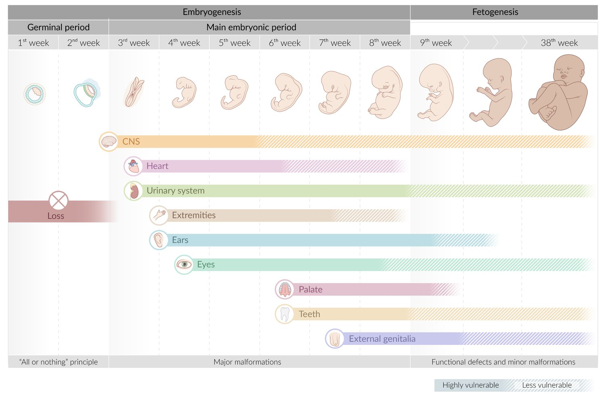

Overview of embryogenesis and fetogenesis

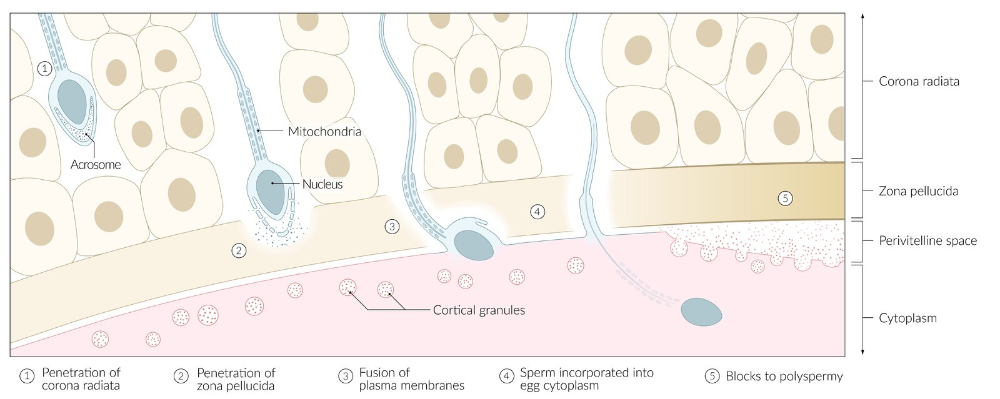

Fertilization

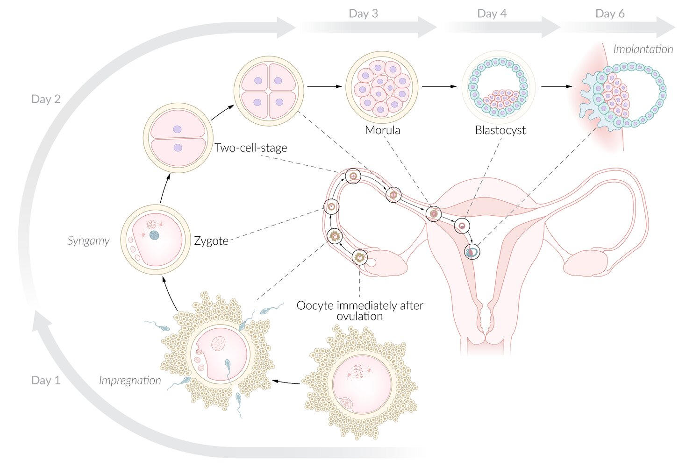

Overview of the 1st week of pregnancy and embryogenesis

Second week of embryogenesis (overview)

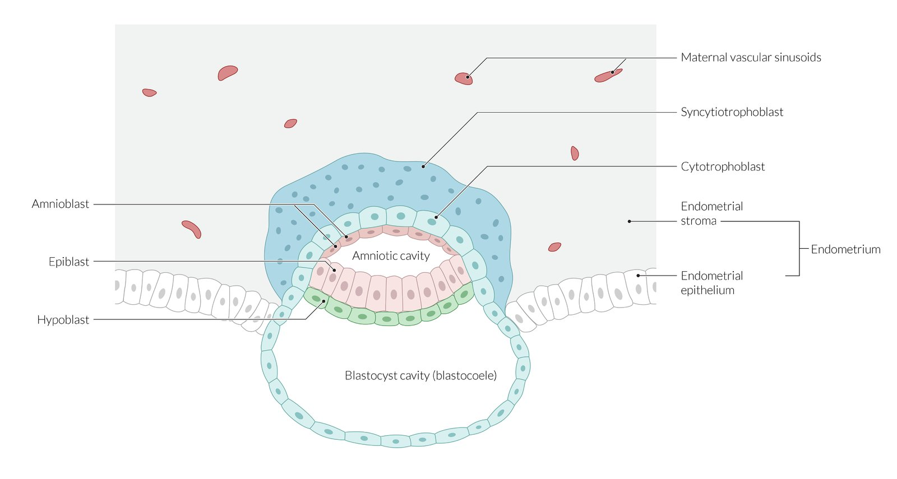

Day 8 of embryogenesis: formation of the amniotic cavity

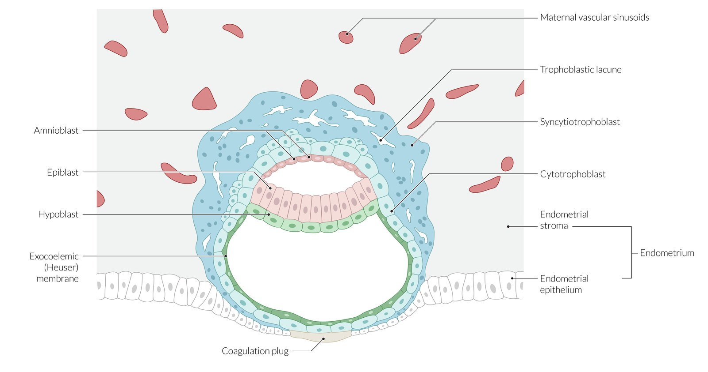

Day 9 of embryogenesis: formation of the yolk sac

Second week of embryogenesis (overview)

Endodermal developments

Gastrulation

> [!NOTE]
> The embryo is extremely susceptible to <u>teratogens</u> from week 3 to week 8, when the process of <u>organogenesis</u> occurs.

> [!NOTE]
> The developmental events from week 2 to week 4 can be remembered as follows: At 2 weeks there are 2 layers (<u>bilaminar disc</u>), 3 weeks there are 3 layers (<u>trilaminar disc</u>) and 4 weeks there are 4 limb buds and 4 <u>heart chambers</u> present.

---

## Embryoblast and trophoblast development

### Embryoblast

In the 2nd week of embryonic development (days 8–14), the <u>embryoblast</u> differentiates into two layers (<u>epiblast</u> and <u>hypoblast</u>), termed the <u>bilaminar disc</u>. After formation of the <u>amniotic cavity</u> and <u>yolk sac</u>, the <u>bilaminar disc</u> is sandwiched between them.

* <u>Embryoblast</u> → bilaminar disc

* Epiblast: columnar cells adjacent to amnioblasts → form the amniotic cavity → forms the embryo (begins the 3rd week of embryonic development)

* Hypoblast

* Cuboidal cells adjacent to the <u>blastocyst cavity</u> (blastocoel)

* Forms <u>yolk sac</u>, lining of <u>chorionic cavity</u>

* Fusion of <u>epiblast</u> and <u>hypoblast</u> → prechordal plate → mouth

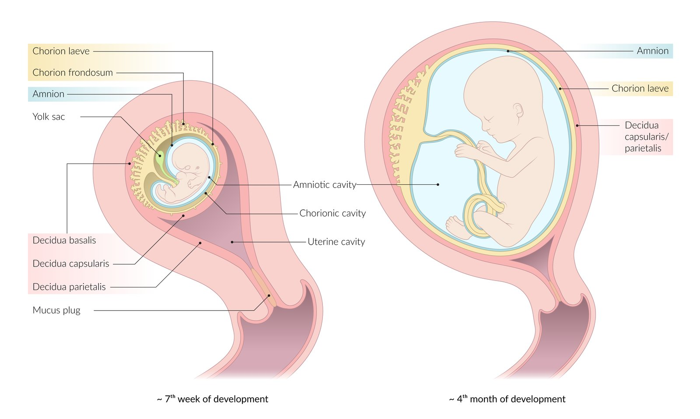

Development of the yolk sac and amniotic cavity

> [!NOTE]
> All three germ layers (<u>ectoderm</u>, <u>mesoderm</u>, and <u>endoderm</u>), as well as the <u>amniotic cavity</u> and therefore the entire embryonic tissue, arise from the <u>epiblast</u>. The extraembryonic <u>mesoderm</u> and the <u>yolk sac</u> are derived from the <u>hypoblast</u>.

> [!NOTE]
> The <u>bilaminar disc</u> forms the dividing layer between the <u>yolk sac</u> and <u>amniotic cavity</u>.

### Trophoblast

* The <u>trophoblast</u> is the layer of cells that surrounds the <u>blastocyst</u>.

* During week 2, the <u>trophoblast</u> divides into two layers, the <u>cytotrophoblast</u> and the <u>syncytiotrophoblast</u>.

* They form the embryonic component of the <u>placenta</u>.

#### Cytotrophoblast

* The inner layer of the <u>chorionic villi</u>; mitotically active

* Function: cells migrate outward and fuse to become the <u>syncytiotrophoblast</u>

> [!NOTE]
> Cytotrophobasts make “cytos” (cells); Syncytiotrophoblasts synthesize <u>hormones</u>.

#### Syncytiotrophoblast

* The outer layer of the <u>chorionic villi</u>; mitotically inactive

* Function: invades the <u>endometrium</u> to create lacunae (spaces that fill with maternal blood)

* Secretes <u>beta-hCG</u> to maintain the <u>corpus luteum</u> (which increases <u>progesterone</u> secretion by <u>corpus luteum</u> during the <u>first trimester</u>) and the <u>decidua</u> (starts when <u>implantation of the blastocyst</u> occurs)

* Invades the <u>endometrium</u> to create lacunae (spaces that fill with maternal blood)

* Proteolytic enzymes secreted by the <u>syncytiotrophoblast</u> break down the <u>extracellular matrix</u>

* Formation of <u>vacuoles</u> within the <u>syncytiotrophoblast</u>, fusion of <u>vacuoles</u> to form lacunae (lacunar stage)

* Invasion of <u>syncytiotrophoblast</u> into maternal <u>capillaries</u> (sinusoids)

* Maternal sinusoids and lacunae fuse; maternal blood flows through the <u>trophoblast</u> → <u>uteroplacental circulation</u>

* Does not express <u>MHC class I</u> on the surface of its cell and is, therefore, less susceptible to the mother's <u>immune cells</u> attack.

Second week of embryogenesis (overview)

#### Formation of the chorionic cavity

* Starting point: The <u>amniotic cavity</u> and primary <u>yolk sac</u> are surrounded by <u>trophoblast</u> cells.

* Sequence of events

* The <u>trophoblast</u> grows significantly faster than the surrounding structures → a gap forms between it and the <u>amniotic cavity</u>.

* The gap is lined by the extraembryonic <u>mesoderm</u>.

* Renewed gap formation in the extraembryonic <u>mesoderm</u> results in the formation of a new cavity

* The extraembryonic <u>mesoderm</u> splits into two layers (somatopleuric and splanchnopleuric <u>mesoderm</u>) but remains attached at a <u>connecting stalk</u>.

* Somatopleuric (parietal) <u>mesoderm</u>: lines the <u>trophoblast</u>

* Splanchnopleuric (<u>visceral</u>) <u>mesoderm</u>: surrounds the <u>amniotic cavity</u> and <u>yolk sac</u> with an intermediate embryonic disc

* <u>Extraembryonic coelom</u> (<u>chorionic cavity</u>)

* Cavity that is formed between the somatopleuric and splanchnopleuric layers → precursor of the <u>gestational sac</u>

* Lined by the chorion (outermost cell layer surrounding the embryo)

* <u>Connecting stalk</u>: A derivative of extraembryonic <u>mesoderm</u> that connects the <u>amniotic cavity</u> and primitive <u>yolk sac</u> to the chorion; precursor of the <u>umbilical cord</u>

> [!NOTE]
> The <u>extraembryonic coelom</u> is also called the <u>chorionic cavity</u>, which is lined by the chorion.

---

## Gastrulation

<u>Gastrulation</u> is the formation of the <u>trilaminar embryonic disc</u> or gastrula through the migration of <u>epiblast</u> cells. <u>Epiblast</u> cells migrate through the <u>primitive streak</u> between the <u>epiblast</u> and <u>hypoblast</u> layers and form an intermediate cell layer called the intraembryonic <u>mesoderm</u>. The <u>hypoblast</u> is replaced by <u>epiblast</u> cells, from which the <u>endoderm</u> arises. The original <u>epiblast</u> becomes the <u>ectoderm</u>.

* Origin: primitive streak, an elongated accumulation of <u>epiblasts</u>

* Result: formation of the trilaminar embryonic disc (<u>mesoderm</u>, <u>endoderm</u>, and <u>ectoderm</u>)

* Process: occurs in weeks 3–4

* <u>Mesoderm</u> development (intraembryonic <u>mesoderm</u>)

* <u>Epiblast</u> cells detach from the cellular complex below the <u>primitive streak</u>  → formation of the primitive pit

* <u>Mesoderm</u> cells migrate through <u>primitive pit</u>

* <u>Proliferation</u> of cells on both sides of the <u>primitive pit</u> and formation of the <u>mesoderm</u>, a new layer between the <u>epiblast</u> and the <u>hypoblast</u>

* <u>Endoderm</u> development

* <u>Epiblast</u> cells migrate from the <u>primitive streak</u> and the primitive node to the <u>hypoblast</u> layer.

* <u>Hypoblast</u> cells are invaded by <u>epiblast</u> cells and form an additional germ layer called the <u>endoderm</u>.

* <u>Ectoderm</u> development: differentiation of remaining <u>epiblast</u> cells into <u>ectoderm</u> after migration of cells for <u>endoderm</u>, <u>mesoderm</u>, and <u>notochord</u>

Gastrulation

Derivatives of the ectoderm

> [!NOTE]
> All embryonic tissue originates from the <u>epiblast</u>.

---

## Notogenesis

* Definition: development of the <u>notochord</u>, a rodlike structure between the <u>ectoderm</u> and <u>endoderm</u> that is essential for the development of the nervous system and primitive skeletal structures

* Location: the <u>notochord</u> migrates along the <u>primitive streak</u> (the future <u>craniocaudal axis</u>), and ends at the <u>prechordal plate</u>. It is part of the <u>axial mesoderm</u>

* Process: occurs weeks 3–4 (at the same time as development of the <u>trilaminar embryonic disc</u>)

* <u>Epiblast</u> cells migrate from the primitive nodes and extend cranially to form the notochordal process.

* Notochordal process margins converge until they merge into the rod-shaped <u>notochord</u> at the end of week 4

* Derivatives

* The <u>notochord</u> degenerates during the course of embryogenesis.

* The <u>nuclei pulposi</u> of the <u>intervertebral discs</u> are remnants of the <u>notochord</u>.

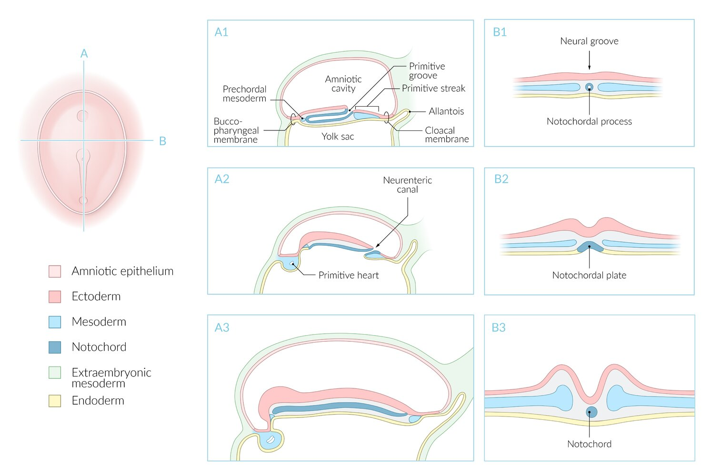

Notogenesis (development of the notochord)

---

## Neurulation

<u>Neurulation</u> is the formation of the <u>neural tube</u> and neural crests, which are the precursors to the central and peripheral nervous systems. During this process, the <u>surface ectoderm</u> is also formed, which gives rise to the <u>epidermis</u>.

* Definition: formation of the <u>neural tube</u> and neural crests via <u>neural plate</u> folding

* Process

* The <u>notochord</u> secretes signaling molecules that trigger differentiation of the <u>medial</u> <u>ectoderm</u> (located directly above the <u>notochord</u>) into neural cells.

* This region is termed the neural plate.

* Sequence

* The central area of the <u>neural plate</u> decreases (invagination) and becomes the neural groove.

* The neural folds are found on both longitudinal sides of the neural groove.

* The neural folds converge (week 3) and convert the neural groove into the neural tube.

* The <u>dorsal</u>-most part of the <u>neural tube</u> forms the specialized <u>neural crest</u>.

* The <u>neural tube</u> communicates with the <u>amniotic cavity</u> through <u>cranial</u> and <u>caudal</u> openings (neuropore).

* <u>Anterior neuropore</u>: closes on ∼ days 24–25

* <u>Posterior neuropore</u>: closes on ∼ days 26–27

* Fusion of the opposite sides of the neural folds results in the formation of the surface ectoderm.

* Neural fold fusion leads to several cells dissociating from the <u>epithelial</u> cluster, which deposit between the <u>neural tube</u> and <u>surface ectoderm</u> as the neural crest cells.

* Derivatives

* Neural tube derivatives

* <u>Central nervous system</u> (<u>brain</u> and spinal cord), including <u>neurons</u> and <u>glial cells</u> (except <u>microglia</u>)

* <u>Retina</u>

* Neural crest derivatives

* <u>Peripheral nervous system</u> <u>neurons</u> (in <u>cranial</u>, <u>dorsal</u> root, and autonomic <u>ganglia</u>) and <u>glia</u> (<u>satellite cells</u> and <u>Schwann cells</u>)

* <u>Melanocytes</u>

* <u>Adrenal medulla</u>

* <u>Leptomeninges</u> (<u>pia</u> and arachnoid)

* <u>Odontoblasts</u>

* <u>Enterochromaffin cells</u>

* <u>Aorticopulmonary septum</u> (spiral membrane)

* <u>Endocardial cushions</u> (partially derived also from <u>mesoderm</u>)

* <u>Cranial bones</u>

* <u>Surface ectoderm</u>: forms the <u>epidermis</u>, <u>adenohypophysis</u>, olfactory <u>epithelial</u> cells and sensory organs of <u>the ear</u>

* <u>Notochord</u>: differentiates into <u>nucleus pulposus</u> of the intervertebral disk

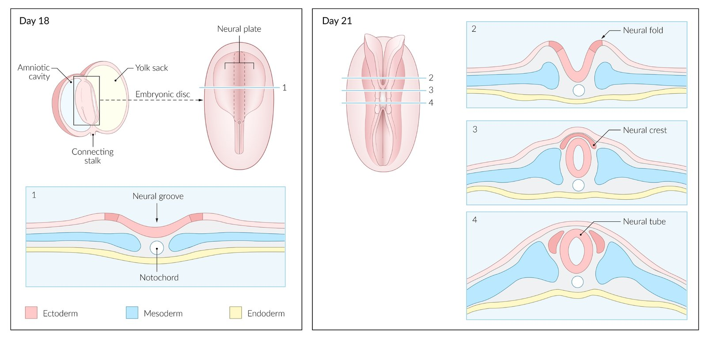

Neurulation

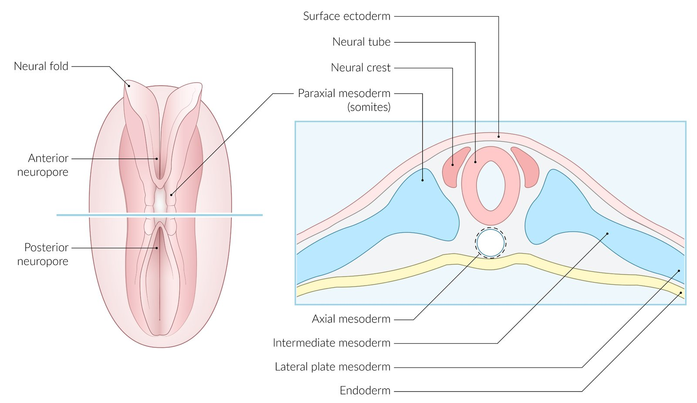

Neurulation (~ day 18)

Embryogenesis of the spinal cord, vertebral column, and intervertebral disc

Open spina bifida

Open spina bifida

> [!NOTE]
> The entire nervous system develops from the <u>ectoderm</u>.

> [!NOTE]
> <u>Neural tube defects</u> are one of the most common <u>CNS</u> <u>malformations</u> and develop as a result of incomplete closure of the <u>neural tube</u> (e.g., <u>spina bifida</u>, <u>anencephaly</u>).

> [!NOTE]
> <u>Neural crest derivatives</u> (Cranial bones, Adrenal medulla, Leptomeninges, Melanocytes, Enterochromaffin cells, Tracheal <u>cartilage</u>, PNS <u>ganglia</u>, Odontoblasts, Spiral membrane, and Endocardial cushions): Embryos have CALMEST POSE.

---

## Branchial apparatus

The <u>branchial apparatus</u> is an embryological structure with five paired arches composed of mesodermal and <u>neural crest cells</u> bound externally by an ectodermal cleft and internally by an <u>endodermal</u> pouch, which differentiate into various head and neck structures. The <u>branchial apparatus</u> is externally visible below the developing <u>brain</u> of a 4-week-old embryo. The fifth arch regresses in utero and does not contribute to the development of any head and neck structures.

* <u>Pharyngeal groove</u>: ectodermal origin

* <u>Pharyngeal arch</u>

* Central <u>mesenchymal</u> core, which contains a nerve, an <u>artery</u>, and <u>cartilage</u>

* Derived from the <u>neural crest</u> and <u>mesoderm</u>

* <u>Pharyngeal pouch</u>: <u>endodermal</u> origin

> [!NOTE]
> Derivatives from the outer to the inner layer (Groove: <u>ectoderm</u>; Arch: <u>mesoderm</u> and <u>neural crest</u>; Pouch: <u>endoderm</u>): GAP

### Pharyngeal arches

|  <u>Pharyngeal arch</u> derivatives   |  |  |  |  |  |
| --- | --- | --- | --- | --- | --- |
|  <u>Pharyngeal arches</u> (the fifth <u>pharyngeal arch</u> only exists transiently in human embryos) |  Nerves (innervate the structures derived from the arches; do not originate from them) | <u>Arteries</u> | Muscles | Skeletal structures | Related pathologies |
|  First pharyngeal arch (<u>mandibular arch</u>) |  * <u>CN V3</u>   |  * Maxillary <u>artery</u>   |   * <u>Muscles of mastication</u> (<u>masseter</u>, <u>temporalis</u>, <u>medial</u> and <u>lateral pterygoid muscles</u>)  * Mylohyoid muscle  * <u>Digastric muscle</u>, <u>anterior</u> belly  * <u>Tensor tympani muscle</u>  * <u>Tensor veli palatini muscle</u>  * <u>Anterior</u> two-thirds of the <u>tongue</u>    |   * Mandibular prominence  * Meckel cartilage: <u>malleus</u>, <u>incus</u>  * <u>Mandible</u>  * Maxillary prominence  * <u>Maxilla</u>  * <u>Zygomatic bone</u>  * <u>Palatine bone</u>  * Squamous <u>temporal bone</u>  * <u>Vomer</u>  * <u>Malleus</u> and <u>incus</u>  * <u>Sphenomandibular ligament</u>    |   * <u>Pierre Robin sequence</u>  * <u>Treacher Collins syndrome</u>  * Auricular <u>atresia</u>  * Isolated <u>micrognathia</u>  * <u>Cleft lip</u>  * <u>Cleft palate</u>    |
|  Second pharyngeal arch (<u>hyoid arch</u>) |  * <u>CN VII</u>   |  * Obliterates completely   |   * <u>Muscles of facial expression</u> (see development of the face)  * <u>Digastric muscle</u>, <u>posterior</u> belly  * <u>Stylohyoid muscle</u>  * <u>Stapedius muscle</u>  * <u>Platysma</u>  * <u>Posterior</u> one-third of the <u>tongue</u>    |   * All the osseous structures originating from the <u>second pharyngeal arch</u> are derived from Reichert cartilage  * <u>Stapes</u>  * Styloid process  * <u>Stylohyoid ligament</u>  * Hyoid bones: lesser horn and body    |  |
| Third pharyngeal arch |  * <u>CN IX</u>   |   * Common carotid <u>artery</u>  * <u>Proximal</u> <u>internal carotid artery</u>    |   * <u>Stylopharyngeus muscle</u>  * <u>Posterior</u> one-third of the <u>tongue</u>    |  * Hyoid bones: greater horn and body   |  * N/A   |
| Fourth pharyngeal arch |   * <u>CN X</u>  * <u>Superior laryngeal nerve</u>    |   * Left: <u>aortic arch</u>  * Right: <u>subclavian artery</u>    |   * Middle and inferior pharyngeal constrictor muscles  * <u>Cricothyroid muscle</u>  * <u>Palatopharyngeus muscle</u>  * <u>Levator veli palatini</u>  * <u>Posterior</u> one-third of the <u>tongue</u>    |  * Upper part of <u>thyroid</u> <u>cartilage</u>   |  * N/A   |
| <u>Sixth pharyngeal arch</u> |   * <u>CN X</u>  * <u>Recurrent laryngeal nerve</u>    |   * Left: <u>ductus arteriosus</u>  * <u>Truncus pulmonalis</u>, <u>left pulmonary artery</u>  * <u>Right pulmonary artery</u>    |  * Internal <u>larynx</u> muscles (other than <u>cricothyroid</u>)   |   * Lower part of <u>thyroid</u> <u>cartilage</u>  * Arytenoid <u>cartilage</u>  * Corniculate <u>cartilage</u>  * <u>Cuneiform</u> <u>cartilage</u>    |  * N/A   |

Pharyngeal arches overview

Pharyngeal arch derivatives

Meckel cartilage

> [!NOTE]
> Sensory and motor nerves do not derive from <u>pharyngeal arches</u>, but from the <u>neural crest</u> and <u>neuroectoderm</u> respectively.

### Pharyngeal pouch

* Derivatives

* First pharyngeal pouch

* <u>Eustachian tube</u>

* <u>Tympanic cavity</u>

* <u>Mastoid air cells</u> (<u>ear</u> structures covered by <u>endoderm</u>)

* Second pharyngeal pouch: <u>epithelial</u> crypts of palatine tonsil, supratonsillar fossa

* Third pharyngeal pouch

* <u>Dorsal</u> wings: inferior <u>parathyroid glands</u>

* <u>Ventral</u> wings: <u>thymus</u>

* Fourth pharyngeal pouch

* <u>Dorsal</u> wings: superior <u>parathyroid glands</u>

* <u>Ventral</u> wings: ultimobranchial body, <u>parafollicular cells</u> (<u>C cells</u>) of the <u>thyroid</u>

Endodermal development

> [!NOTE]
> The inferior <u>parathyroid glands</u> arise cranially (3rd pouch) but migrate <u>caudally</u> (lower poles of the <u>thyroid gland</u>). The superior <u>parathyroid glands</u> arise <u>caudally</u> (4th pouch) but migrate cranially (superior poles of the <u>thyroid gland</u>).

### Pharyngeal grooves

* Derivatives

* The first <u>pharyngeal groove</u> develops into the <u>external auditory meatus</u>, the auditory canal, and the external aspect of the <u>tympanic membrane</u>.

* The second to fourth <u>pharyngeal grooves</u> are obliterated in utero by the rapid growth of the <u>second pharyngeal arch</u>, and they do not differentiate into any of the head and neck structures.

* Cervical sinus

* The <u>second pharyngeal arch</u>;  develops faster than the others → overlap and merging with the third and fourth arches;  → grooves lose their connection with the <u>amnion</u> → formation of cervical sinus.

* The cervical sinus is obliterated during later development due to the <u>proliferation</u> of the 2nd arch <u>mesenchyme</u>

* Failure of the cervical sinus to obliterate completely results in branchial cleft sinus, which can lead to <u>lateral</u> cervical <u>fistula</u> formation

* Located <u>anterior</u> to the <u>sternocleidomastoid muscles</u>

* In contrast to a <u>thyroglossal duct cyst</u>, the swelling caused by the <u>branchial cleft sinus</u> does not move with <u>swallowing</u>.

> [!NOTE]
> A <u>lateral</u> cervical <u>fistula</u> is <u>prone</u> to infection and is a clear indication for operative treatment.

---

## Aortic arches

The <u>aortic arches</u> are <u>blood vessels</u> that run in between the <u>pharyngeal pouches</u> and form the major head and neck <u>arteries</u>. The arches develop in craniocaudal order, with the first two arches obliterating early and the fifth either never developing or also obliterating without giving rise to a vessel.

|  Overview of aortic arch derivatives   |  |
| --- | --- |
| <u>Aortic arches</u> | Derivatives |
| First |  * Maxillary <u>artery</u>: remnant of obliterated first arch   |
| Second |  * Most parts of the second <u>aortic arch</u> obliterate early  * Hyoid <u>artery</u>: remnant of the largely obliterated second arch  * Stapedial <u>artery</u>: transient branch of the hyoid <u>artery</u> (typically regresses around week 10 of development)   |
| Third |   * <u>Common carotid</u>  * <u>Proximal</u> <u>internal carotid</u>    |
| Fourth |   * Right: <u>proximal</u> <u>right subclavian artery</u>  * Left: <u>aortic arch</u> (from left <u>common carotid</u> to left subclavian)    |
| Sixth |   * Right: <u>right pulmonary artery</u>  * Left: <u>left pulmonary artery</u>, <u>ductus arteriosus</u>    |

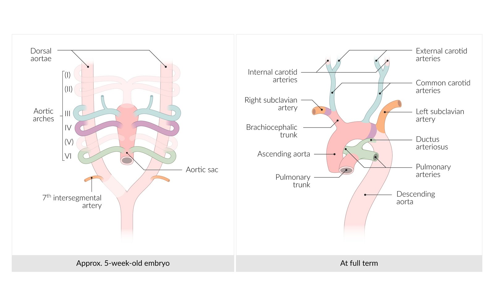

Aortic arch derivatives

> [!NOTE]
> 1st is maximal (maxillary <u>artery</u>); Second for Stapedial; C is the 3rd letter of the alphabet (Common Carotid, <u>proximal</u> internal Carotid); 4th arch and 4 limbs (systemic arch).

---

## Morphogenesis

Morphogenesis is the process by which the shape of an organism is generated. The embryo undergoes folding, resulting in transformation of the flat, embryonic disc into an embryo that approaches the human form during the course of the <u>pregnancy</u>. During the folding processes, the <u>abdominal cavity</u>, the abdominal wall, and the gut tube are formed. At the <u>cranial</u> and <u>caudal</u> embryonic poles, there is an area devoid of the <u>mesoderm</u> where the <u>endoderm</u> and <u>ectoderm</u> come into direct contact with one another, called the buccopharyngeal or <u>cloacal membrane</u>. The mouth and <u>anus</u> will later form in these areas.

### Body axis determination

* Dorsoventral body axis: formed as the <u>bilaminar disc</u> develops

* <u>Dorsal</u> body axis: <u>epiblast</u>

* <u>Ventral</u> body axis: <u>hypoblast</u>

* Craniocaudal body axis

* Formed by the extension of the <u>primitive streak</u>

* <u>Cranial</u> pole: primitive nodes

* Right-left differentiation: The positioning of unpaired chest and abdominal organs is determined by asymmetric expression of signaling molecules in the <u>lateral plate mesoderm</u>.

> [!NOTE]
> Situs inversus is a very rare congenital condition in which the chest and abdominal organs are reversed or mirrored. It is usually considered a benign condition, but can also present as part of a syndrome, e.g., <u>Kartagener syndrome</u>.

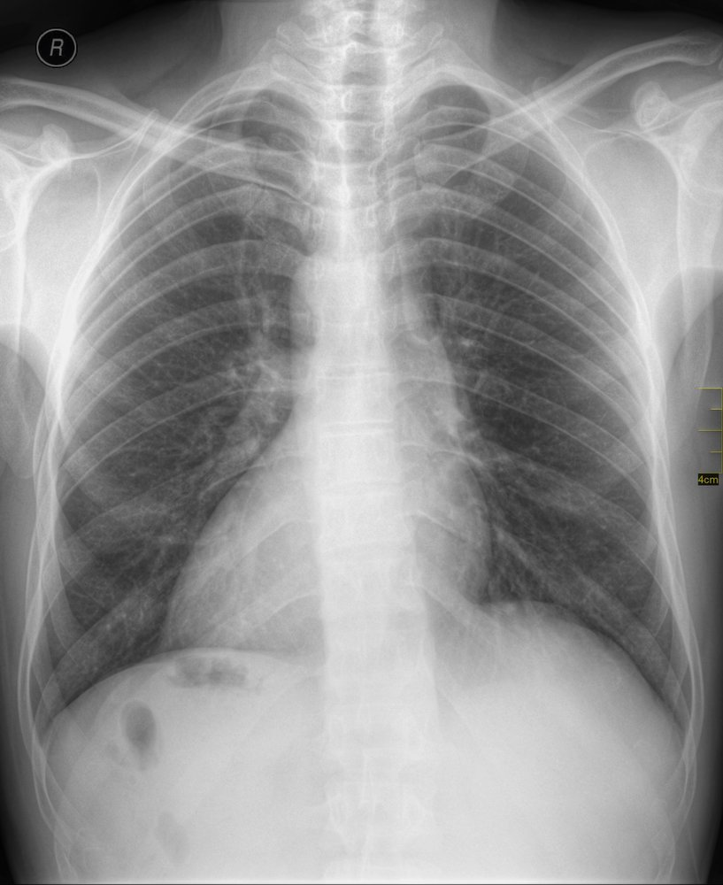

Situs inversus with dextrocardia (situs inversus totalis)

### Craniocaudal folding

* Process: The <u>cranial</u> and <u>caudal</u> embryonic poles curl, resulting in curving of the embryonic disc.

* Result

* The embryo develops a C form.

* <u>Caudal</u> end: tail fold

* <u>Cranial</u> end: head fold

* Constriction of the <u>yolk sac</u>

Craniocaudal folding of the embryo

### <u>Lateral</u> folding [[1]](https://coursology-qbank.com/amboss/article/FhYgfK)

* Process

* <u>Ventral</u> outgrowth of the <u>lateral</u> margins of the embryonic disc

* The <u>ectoderm</u> and the overlying <u>lateral plate mesoderm</u> on both sides converge.

* Adhesion of both sides results in the formation of a <u>lateral</u> and <u>anterior</u> body wall as well as a cavity, the intraembryonic coelom

* The <u>endoderm</u> and the overlying <u>lateral plate mesoderm</u> on both sides converge → gut tube formation

* Result

* <u>Intraembryonic coelom</u>

* <u>Pericardial cavity</u>

* <u>Pleural cavity</u>

* <u>Peritoneal cavity</u>

* Gut tube 

* <u>Anterior</u> end of the <u>foregut</u>

* <u>Foregut</u>

* <u>Midgut</u>

* <u>Hindgut</u>

* Further constriction of the <u>yolk sac</u>

Craniocaudal and lateral folding (embryogenesis)

> [!NOTE]
> The <u>midgut</u> stays connected to <u>yolk sac</u> remnants via the <u>vitelline duct</u> (<u>omphalomesenteric duct</u>). This duct is obliterated during the course of embryogenesis. Persistence of this duct most commonly results in <u>Meckel diverticulum</u> but could also cause retroumbilical cysts and <u>fistulae</u>.

### Buccopharyngeal and <u>cloacal membrane</u> formation

#### Process

* Buccopharyngeal membrane: region without <u>mesoderm</u> at the <u>cranial</u> embryonic pole 

* Stomodeum formation as a result of deep <u>depression</u> by the <u>buccopharyngeal membrane</u> due to expansion of the <u>brain</u>

* The <u>buccopharyngeal membrane</u> ruptures shortly after folding → development of a link between the <u>stomodeum</u> (and therefore also the <u>amniotic cavity</u>) and the gut tube

* Cloacal membrane: region without <u>mesoderm</u> at the <u>caudal</u> embryonic pole 

* Proctodeum formation as a result of inward folding of the <u>ectoderm</u>

* The <u>cloacal membrane</u> tears significantly later than the <u>buccopharyngeal membrane</u> → a link develops between the <u>amniotic cavity</u> and urogenital tract/<u>anal canal</u>

Primitive gut (4th week of development)

#### Results

* Formation of future body orifices

* The embryo is connected to its external environment (e.g., <u>amniotic fluid</u>) via the body orifices.

### Abnormalities of morphogenesis

| Overview |  |  |  |
| --- | --- | --- | --- |
| Process | Definition | Characteristics | Example |
| Agenesis |  * The organ is not present.   |  * Primordial tissue from which the organ is derived is absent.   |   * <u>Agenesis</u> of the corpus callosum  * <u>Renal agenesis</u>  * <u>Müllerian agenesis</u>    |
| Aplasia |  * The organ is not present.   |  * Primordial tissue from which the organ is derived is present.   |   * <u>Aplasia cutis congenita</u>  * <u>Thymic</u> <u>aplasia</u>    |
| Hypoplasia |  * Underdevelopment of an organ   |  * Primordial tissue from which the organ is derived is present.   |  * <u>Hypoplastic</u> right <u>heart</u> syndrome   |
| Disruption |  * Breakdown of a previously normal structure or tissue   |  * N/A   |  * Amniotic band syndrome  * Entrapment of fetal parts in fibrous amniotic bands  * Clinical features   * Constriction rings or bands  * Autoamputation of digits or limbs  * <u>Syndactyly</u>  * <u>Abdominal wall defects</u>, <u>visceral</u> protrusions  * Craniofacial anomalies   |
| Deformation |  * Interruption of the normal development of an organ due to an extrinsic force (e.g., in case of <u>multiple gestations</u> or large <u>leiomyomas</u>)   |  * Occurs after week 8   |   * <u>Congenital talipes equinovarus</u>  * <u>Congenital torticollis</u>  * <u>Developmental dysplasia of the hip</u>    |
| Malformation |  * Interruption of the normal development of an organ due to an intrinsic process   |  * Occurs between week 3 and week 8   |   * <u>Arnold-Chiari malformation</u>  * Arteriovenous malformation (an abnormal, high-flow connection between <u>arteries</u> and <u>veins</u> bypassing <u>capillaries</u> which develops due to disrupted <u>angiogenesis</u>)    |
| Sequence |  * A single event that causes multiple abnormalities   |  * N/A   |   * <u>Pierre Robin sequence</u>  * <u>Potter sequence</u>    |
| Syndrome |  * A set of clinical features that consistently occur together   |  * Commonly caused by genetic mutations (e.g., <u>trisomy 21</u>)   |   * <u>Down syndrome</u>  * <u>Patau syndrome</u>  * Edward syndrome    |
| <u>Field defect</u> |  * Development of <u>malformations</u> in specific, contiguous area   |  * N/A   |  * <u>Holoprosencephaly</u>   |

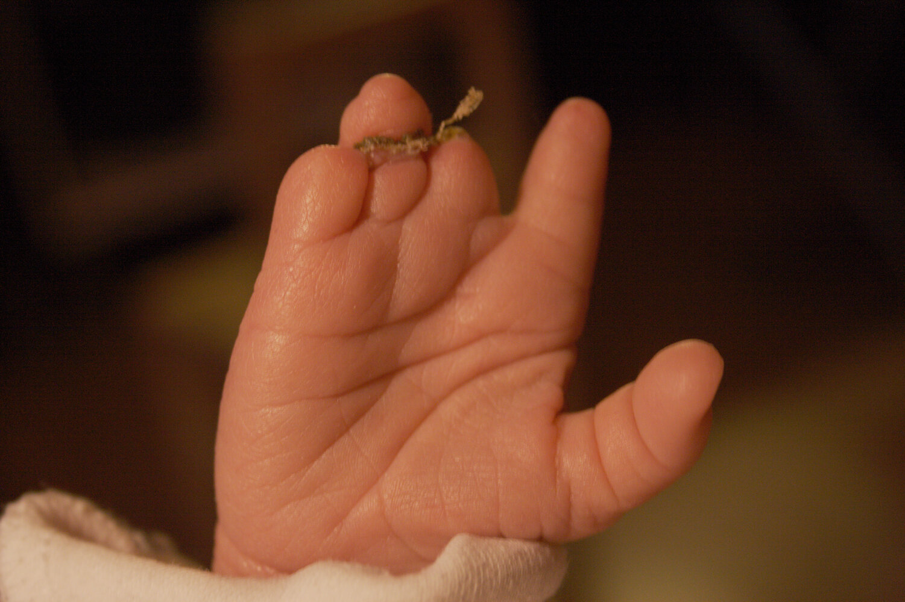

Hand affected by amniotic band syndrome

---

## Differentiation of the embryonic disc

### Differentiation of the <u>mesoderm</u>

#### Axial mesoderm

* Location: central region of the <u>mesoderm</u>

* Components: <u>notochord</u> and prechordal <u>mesoderm</u>

#### Paraxial mesoderm

* Location: tube-shaped area of the <u>mesoderm</u> surrounding the <u>notochord</u>

* Components: somites

* Process

* The <u>paraxial mesoderm</u> becomes divided into segmented round cell <u>clusters</u> (<u>somites</u>) along the <u>neural tube</u> (week 4)

* Up to the beginning of week 5, an initial 42–44 <u>somite</u> pairs are formed in a craniocaudal direction.

* Degeneration of several <u>somite</u> pairs, so that 35–37 <u>somite</u> pairs remain

* As primitive segments, <u>somites</u> determine body segmentation

* <u>Somite</u> segments

* Sclerotome: <u>medial</u> migration of cells toward the <u>notochord</u> and fusion of both sclerotomes of a <u>somite</u> pair

* Dermomyotome

* <u>Dermatome</u>: migration toward the <u>surface ectoderm</u>

* <u>Myotome</u>: subdivision into the <u>dorsal</u> epaxial and <u>ventral</u> hypaxial <u>skeletal muscles</u> in the <u>lateral</u> and <u>anterior</u> regions of the thorax and abdomen

Somites development

#### Intermediate mesoderm

* Location: <u>lateral</u> to the <u>paraxial mesoderm</u>

* Components: <u>urogenital fold</u>, consisting of the nephrogenic ridge and genital ridge

#### Lateral plate mesoderm

* Location: <u>lateral</u> to the <u>intermediate mesoderm</u>

* Sequence of events

* In the second week of development, small folds develop in <u>lateral</u> aspect of the <u>mesoderm</u>.

* These folds split horizontally to form two components.

* Somatic (parietal) <u>mesoderm</u>: the <u>dorsal</u> layer that underlies the <u>ectoderm</u> and differentiates into the lining of the pleural, <u>pericardial</u>, and <u>peritoneal cavities</u>.

* <u>Splanchnic</u> (<u>visceral</u>) <u>mesoderm</u>: the <u>ventral</u> layer that overlies the <u>endoderm</u> and differentiates into the <u>visceral</u> lining of internal organs.

* The space between these components is called the coelom

* The two coeloms from either side fuse at the end of the <u>lateral</u> folding of the embryo to form one large cavity, the <u>intraembryonic coelom</u>, which will differentiate into the thoracic and abdominal cavities (see “Morphogenesis” above).

Embryonic mesoderm

> [!NOTE]
> <u>Mesenchyme</u> ≠ <u>mesoderm</u>: The <u>mesoderm</u> is one of the three germinal layers that differentiates into different tissues. The <u>mesenchyme</u> is embryonic <u>connective tissue</u> that develops from the <u>mesoderm</u> and other germ layers.

### Fate mapping

A fate map is used to determine the origin of a cell lineage, e.g., a germ layer. The following table provides an overview of the various tissue types and structures that arise from the three germ layers.

| Overview |  |  |  |
| --- | --- | --- | --- |
| Germ layer | Germ layer structures |  | Differentiated tissue/organs |
|  Ectoderm    |  * Neuroectoderm (<u>neural tube</u>)   |  |   * <u>Central nervous system</u> (except the <u>anterior pituitary</u>)  * <u>CNS</u> <u>neurons</u>  * <u>Glia</u> (<u>astrocytes</u>, <u>oligodendrocytes</u>, <u>ependymal cells</u>)  * <u>Pineal gland</u>  * <u>Posterior pituitary</u> (<u>neurohypophysis</u>)  * <u>Retina</u>    |
|  * <u>Neural crest</u>   |  |   * Nervous tissue    * <u>Neurons</u> and <u>glia</u> of the <u>peripheral nervous system</u>  * <u>Dorsal root ganglion</u> cells  * Autonomic <u>ganglion</u> cells  * <u>Schwann cells</u>  * Satellite <u>glial cells</u>  * <u>Enteric nervous system</u>  * <u>Cranial</u> and head structures  * <u>Dermis</u> and <u>subcutaneous tissue</u> in the head region  * Bones, <u>cartilage</u>, and <u>connective tissue</u> of the head region  * <u>Arachnoid mater</u> and <u>pia mater</u>  * <u>Odontoblasts</u> (<u>dentin</u>) and dental cement  * Other cell types  * <u>Chromaffin cells</u> of the <u>adrenal medulla</u>  * <u>Skin</u> <u>melanocytes</u>  * Carotid body  * Cardiac septum in the outflow tract  * Cardiac tissue  * <u>Endocardial cushions</u> (form from the cells that undergo <u>epithelial</u>-<u>mesenchymal</u> transition)  * Aortopulmonary septum    |  |
|  * Surface ectodermal placodes   |  |   * <u>Olfactory epithelium</u>  * <u>Inner ear</u>  * <u>Lens</u>  * <u>Cranial nerve</u> <u>ganglia</u> (partial)    |  |
|  * <u>Surface ectoderm</u>   |  |   * <u>Epithelium</u>  * <u>Oral cavity</u>  * Nasal cavity  * <u>Paranasal sinuses</u>  * Lacrimal ducts,  * <u>Ear</u> canal,  * <u>Anal canal</u> <u>below the dentate line</u>  * <u>Epidermis</u> and <u>skin appendages</u>: including <u>hair</u>, <u>nails</u>, glands (including sweat and <u>mammary glands</u>)  * Other cell types  * Ameloblasts (<u>enamel</u> organ) of the <u>teeth</u>  * <u>Anterior pituitary</u> (derived from Rathke pouch)  * <u>Parotid gland</u>  * <u>Inner ear</u> sensory organs    |  |
|  Mesoderm (intraembryonic <u>mesoderm</u>)     |  * Axial   |  * Prechordal   |   * Bones that make up the <u>base of the skull</u> (partially)  * <u>Extraocular muscles</u>    |
|  * <u>Notochord</u>   |  * <u>Nucleus pulposus</u> of the <u>intervertebral discs</u>   |  |  |
|  * Paraxial   |  * <u>Sclerotome</u>   |   * <u>Vertebral bodies</u>  * <u>Annulus fibrosus</u> of the <u>intervertebral discs</u>  * <u>Ribs</u>    |  |
|  * <u>Dermatome</u>   |   * Spinal <u>meninges</u>  * <u>Dermis</u> and <u>cutis</u> of the back and, partially, the head    |  |  |
|  * <u>Myotome</u>   |  * <u>Skeletal muscles</u>  * Neck (<u>hypomere</u>)  * Walls of the <u>lateral</u> and <u>ventral</u> trunk (<u>hypomere</u>)  * Intrinsic <u>back muscles</u> (<u>epimere</u>)  * Limbs (<u>hypomere</u>)   |  |  |
|  * Intermediate   |  |   * <u>Kidneys</u> (<u>pronephros</u>, <u>mesonephros</u>, <u>metanephros</u>)  * <u>Gonads</u>  * Renal and genital <u>excretory ducts</u>    |  |
|  * <u>Lateral plate mesoderm</u>   |  * <u>Splanchnic</u> (splanchnopleuric) <u>mesoderm</u>   |   * <u>Cardiovascular system</u>  * <u>Heart</u>  * <u>Blood vessels</u>  * <u>Stem cells</u> of erythroid, lymphoid, and myeloid origin (including <u>microglia</u>)  * <u>Lymph nodes</u> and vessels  * Other cell types  * <u>Adrenal cortex</u>  * <u>Spleen</u>  * <u>Visceral</u> layers of the <u>pericardium</u>, <u>pleura</u>, and <u>peritoneum</u>  * <u>Connective tissue</u> and <u>smooth muscle</u> of the intestinal wall    |  |
|  * Somatic (somatopleuric) <u>mesoderm</u>   |   * <u>Connective tissue</u> of the <u>anterior</u> and <u>lateral</u> trunk wall  * Parietal layers of the <u>pericardium</u>, <u>pleura</u>, and <u>peritoneum</u>  * <u>Sternum</u>  * Limbs (all tissues except the muscles)    |  |  |
|  Endoderm    |  |  |   * <u>Epithelium</u>  * <u>Pharynx</u>  * <u>Eustachian tube</u>  * <u>Tonsils</u>  * <u>Thymus</u>  * <u>Epithelium</u> and glands  * <u>Esophagus</u> and <u>gastrointestinal tract</u> (except the <u>parotid gland</u> and the <u>anal canal</u> <u>below the dentate line</u>)  * <u>Liver</u>, <u>gallbladder</u>, <u>pancreas</u>  * <u>Lungs</u>  * <u>Bladder</u>, <u>prostate</u>, <u>urethra</u>, and <u>distal</u> <u>vagina</u>  * Follicular and <u>parafollicular cells</u> (<u>C cells</u>) in the <u>thyroid</u>  * <u>Parathyroid gland</u>    |

Neurulation (~ day 18)

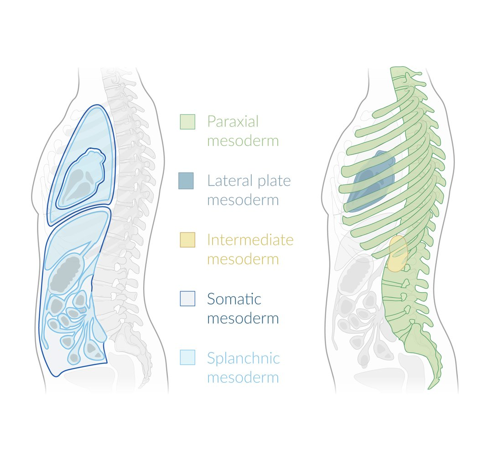

Mesoderm derivatives

Endodermal development

> [!NOTE]
> Ectoderm: ec-sternal layer; Mesoderm: middle layer; Endoderm: en-ternal layer.

---