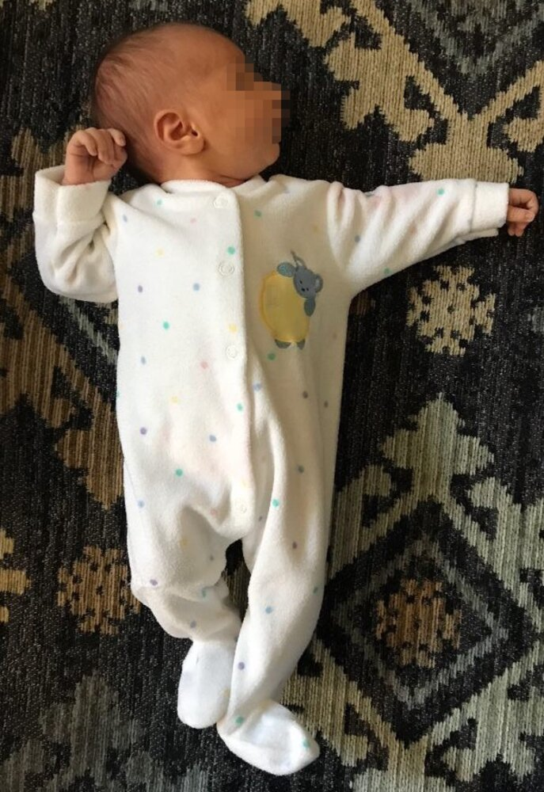
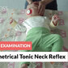
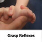
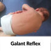
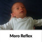
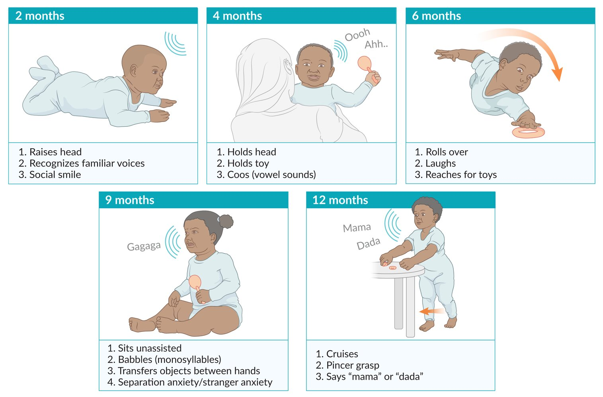

# Child development and milestones

*Categories: Clinical knowledge > Pediatrics > Child development and wellbeing > Child development and milestones*

[Original Article Link](https://coursology-qbank.com/amboss/article/b40H3T)

---

## Summary

Early childhood, which typically spans from <u>birth</u> to 8 years of age, is characterized by rapid growth and development. Close monitoring during this period ensures children are meeting age-specific milestones and that deviations from expected developmental trajectories are quickly identified. <u>Developmental delays</u> affect ∼ 15% of children and can impact more than one domain (i.e., physical, language, cognitive, and social and emotional development); early identification and treatment can improve outcomes. <u>Developmental milestones</u> are an important component used to track a child's progress over time and provide a framework by establishing a set of skills or behaviors that most children are expected to achieve by a certain age. A child's development should be assessed at every <u>well-child visit</u> and whenever there is a concern for abnormal development. For children who are not meeting their milestones, an <u>evaluation of abnormal pediatric development</u> and relevant referrals are indicated.

See “<u>Well-child visits</u>” for more information on routine health assessments. For information on growth below the expected parameters for age, see “<u>Growth faltering</u>.”

---

## Overview of normal development

Normal development in childhood involves the evolution and resolution of <u>primitive reflexes</u>, and the sequential development of motor, language, cognitive and social skills (tracked using <u>developmental milestones</u>). Throughout childhood, various behaviors (e.g., <u>stranger anxiety</u>, <u>magical thinking</u>, <u>imaginary companions</u>) may also be temporarily observed and are part of normal development; caregivers should be reassured that these behaviors will resolve as children age.

---

## Primitive reflexes

### General principles [[1]](https://coursology-qbank.com/amboss/article/LZWwXP0)

* <u>Primitive reflexes</u> are transient reflexes that manifest during <u>infancy</u> and disappear when subcortical motor inhibitory pathways develop (usually within the 1st year of life).

* Evaluation of <u>primitive reflexes</u> is an essential part of the <u>newborn examination</u>.

* Abnormal primitive reflexes are those that are absent, asymmetric, and/or persist past the expected age range.

* Bilateral absence or prolonged reflexes: most commonly <u>CNS</u> dysfunction

* Unilaterally absent or asymmetric reflexes are usually caused by one of the following: [[2]](https://coursology-qbank.com/amboss/article/GeWBZk0)

* Peripheral nerve dysfunction (e.g., <u>brachial plexus injuries</u>)

* Musculoskeletal involvement (e.g., <u>neonatal clavicle fracture</u>)

* Unilateral <u>CNS</u> injury (e.g., <u>perinatal</u> <u>brain injury</u>)

> [!TIP]
> Multiple <u>primitive reflexes</u> in adults (i.e., frontal release signs) indicate <u>frontal lobe</u> dysfunction. [[3]](https://coursology-qbank.com/amboss/article/kIYm1q)[[4]](https://coursology-qbank.com/amboss/article/oZW0cP0)

### <u>Overview of primitive reflexes</u>

|  Overview of primitive reflexes [[5]](https://coursology-qbank.com/amboss/article/ju1_Ii0)[[6]](https://coursology-qbank.com/amboss/article/Rc1lXf0)  |  |  |  |
| --- | --- | --- | --- |
| Reflex | Description |  Typical age range [[5]](https://coursology-qbank.com/amboss/article/ju1_Ii0)  | Clinical significance |
|  Glabellar tap sign [[4]](https://coursology-qbank.com/amboss/article/oZW0cP0)  |  * Tapping the <u>glabella</u> elicits blinking.   |  * <u>Birth</u>–6 months   |  * Clinical significance unknown   |
|  Snout reflex [[4]](https://coursology-qbank.com/amboss/article/oZW0cP0)  |  * Applying light pressure to closed <u>lips</u> causes the <u>lips</u> to pucker.   |  * <u>Birth</u>–4 months [[7]](https://coursology-qbank.com/amboss/article/xVWE940)   |  |
| Rooting reflex |  * Stroking the cheek causes the mouth to open and the head to turn towards the stimulus.   |  * 24 weeks' <u>gestation</u>–4 months  [[5]](https://coursology-qbank.com/amboss/article/ju1_Ii0)   |  * Required for <u>newborn</u> feeding  [[8]](https://coursology-qbank.com/amboss/article/BVWz940)   |
| Sucking reflex |  * Touching the <u>lips</u> and/or oral <u>palate</u> elicits sucking of the stimulus.   |  * Early in utero –3 months  [[5]](https://coursology-qbank.com/amboss/article/ju1_Ii0)   |  |
|  Asymmetrical tonic neck reflex (<u>ATNR</u>) |  * When the <u>infant</u> is lying <u>supine</u>, turning the head to one side elicits extension of the <u>ipsilateral</u> extremities and <u>flexion</u> of the <u>contralateral</u> extremities (<u>fencing posture</u>).   |  * <u>Birth</u>–7 months [[5]](https://coursology-qbank.com/amboss/article/ju1_Ii0)[[6]](https://coursology-qbank.com/amboss/article/Rc1lXf0)   |  * Affects rolling   |
| Moro reflex (Startle reflex) |  * When the <u>infant</u> experiences a loud noise or sudden movement, they <u>abduct</u> and extend their arms and fingers before bringing them back to midline.   |  * 28 weeks' <u>gestation</u>–6 months [[5]](https://coursology-qbank.com/amboss/article/ju1_Ii0)   |   * Protective reflex to grasp mother when falling [[9]](https://coursology-qbank.com/amboss/article/xeWEak0)  * May be unilaterally reduced or absent in <u>infants</u> with <u>ipsilateral</u> <u>brachial plexus injuries</u> or <u>neonatal clavicle fracture</u> [[1]](https://coursology-qbank.com/amboss/article/LZWwXP0)    |
| Palmar grasp reflex |  * Pressing or placing something into the <u>infant</u>'s palm causes the fingers to flex towards the palm.   |  * 32 weeks' <u>gestation</u>–4 months [[5]](https://coursology-qbank.com/amboss/article/ju1_Ii0)   |   * No clinical significance; evolutionary remnant  [[10]](https://coursology-qbank.com/amboss/article/BeWzak0)  * May be unilaterally reduced or absent in <u>infants</u> with <u>ipsilateral</u> <u>brachial plexus injuries</u>  [[1]](https://coursology-qbank.com/amboss/article/LZWwXP0)    |
| Plantar grasp reflex |  * Pressing the <u>infant</u>'s sole beneath the toes causes their toes to flex towards the sole.   |  * 32 weeks' <u>gestation</u>–12 months [[5]](https://coursology-qbank.com/amboss/article/ju1_Ii0)   |  * No clinical significance; evolutionary remnant  [[10]](https://coursology-qbank.com/amboss/article/BeWzak0)   |
| Extensor plantar reflex (Babinski reflex) |  * Stroking the sole of the foot upwards elicits <u>dorsiflexion</u> of the big toe and fanning of the other toes.   |  * <u>Birth</u>–12 months (may be a normal finding up to 24 months) [[5]](https://coursology-qbank.com/amboss/article/ju1_Ii0)[[11]](https://coursology-qbank.com/amboss/article/feWky40)[[12]](https://coursology-qbank.com/amboss/article/TeW6y40)   |   * Clinical significance unknown  * A positive <u>Babinski sign</u> at > 24 months of age is a <u>sign of an upper motor lesion</u>. [[3]](https://coursology-qbank.com/amboss/article/kIYm1q)    |
| Landau reflex |   * When the <u>infant</u> is held <u>prone</u> in the air, the head raises, the back arches, and the legs extend.  * When the head is flexed downwards, the legs will also flex downwards.    |  * 3–24 months [[5]](https://coursology-qbank.com/amboss/article/ju1_Ii0)   |   * Aids in core strength and is required to roll from <u>supine</u> to <u>prone</u> [[13]](https://coursology-qbank.com/amboss/article/nR07nf)  * <u>Infants</u> with <u>hypotonia</u> will have a weak <u>Landau reflex</u> (e.g., hang in an inverted U-shape), while those with hypertonia will remain stiff and resist head <u>flexion</u>. [[11]](https://coursology-qbank.com/amboss/article/feWky40)    |
| Parachute reflex |  * When the <u>infant</u> is held <u>prone</u> in the air, lowering the <u>infant</u> towards a flat surface causes the arms and the hands to reach towards the surface.   |  * 7 months–throughout life [[5]](https://coursology-qbank.com/amboss/article/ju1_Ii0)   |   * Protective reflex when falling [[6]](https://coursology-qbank.com/amboss/article/Rc1lXf0)  * Absence may suggest neuromotor deficit [[6]](https://coursology-qbank.com/amboss/article/Rc1lXf0)    |
|  Truncal incurvation reflex (Galant reflex) [[14]](https://coursology-qbank.com/amboss/article/DeW1ak0)  |  * When the <u>infant</u> is held <u>prone</u> in the air, stroking the paravertebral region causes the lower back and hip to curve inwards on the same side.   |  * <u>Birth</u>–4 months  [[14]](https://coursology-qbank.com/amboss/article/DeW1ak0)[[15]](https://coursology-qbank.com/amboss/article/weWhak0)   |  * Clinical significance unknown   |
|  Stepping reflex [[16]](https://coursology-qbank.com/amboss/article/9eWNak0)  |  * Holding the <u>infant</u> upright in a standing position elicits a walking motion, with alternating <u>flexion</u> and extension of the legs.   |  * <u>Birth</u>–3 months [[16]](https://coursology-qbank.com/amboss/article/9eWNak0)   |  |

Asymmetrical tonic neck reflex (ATNR)

Asymmetrical Tonic Neck Reflex - Clinical Examination

Babinski Reflex in Infants - Clinical Examination

Grasp Reflexes - Clinical Examination

Galant Reflex - Clinical Examination

Moro Reflex - Clinical Examination

---

## Developmental milestones

### General principles [[17]](https://coursology-qbank.com/amboss/article/FZWgWP0)

* Developmental milestones are the expected abilities that most children can do by a defined age and are:

* Divided into physical, cognitive, social, and emotional domains

* Continuously progressing as the child ages

* Adjusted to compensate for <u>prematurity</u> in <u>infants</u> < 2 years of age

* Assessed during routine <u>well-child examinations</u> and inpatient <u>pediatric history and physical examinations</u>

* Abnormal development occurs when children fail to attain <u>developmental milestone</u>(s) by the expected age and/or in the expected order.

* ∼15% of children have <u>developmental delay</u>. [[18]](https://coursology-qbank.com/amboss/article/40W3TP0)

* Common etiologies include:

* <u>Neurodevelopmental disorders</u>  [[19]](https://coursology-qbank.com/amboss/article/GaWBNP0)

* Neurologic injury

* <u>Child neglect</u>

### Developmental domains [[5]](https://coursology-qbank.com/amboss/article/ju1_Ii0)

* Motor development

* Gross motor development: the development of movements (e.g., sitting up, walking) that require the use of large muscle groups

* Fine motor development: the development of precise movements using hands and smaller muscles (e.g., picking up a small object)

* Language development: the development of communication through either spoken or signed language

* Receptive language: the ability to understand and process language

* Expressive language: the ability to formulate language

* Cognitive development: the development of reasoning and problem-solving skills

* Social and emotional development: the development of self-regulation and attachment and interaction with others

### Age-specific <u>developmental milestones</u>

* In 2022, the <u>CDC</u> recommended using the 75th<u>percentile</u> rather than the 50th<u>percentile</u> for <u>developmental surveillance</u>; the following tables reflect this change. [[20]](https://coursology-qbank.com/amboss/article/sz1t8j0)[[21]](https://coursology-qbank.com/amboss/article/uVWpw40)

* If a child is not meeting milestones, conduct an immediate <u>evaluation of abnormal pediatric development</u>.  [[20]](https://coursology-qbank.com/amboss/article/sz1t8j0)[[22]](https://coursology-qbank.com/amboss/article/k0WmTP0)

> [!WARNING]
> A wait-and-see approach is no longer recommended for potential <u>developmental delay</u>. [[20]](https://coursology-qbank.com/amboss/article/sz1t8j0)[[22]](https://coursology-qbank.com/amboss/article/k0WmTP0)

#### Developmental milestones in infants [[20]](https://coursology-qbank.com/amboss/article/sz1t8j0)[[21]](https://coursology-qbank.com/amboss/article/uVWpw40)

|  Overview of <u>developmental milestones in infants</u>  [[20]](https://coursology-qbank.com/amboss/article/sz1t8j0)[[21]](https://coursology-qbank.com/amboss/article/uVWpw40)  |  |  |  |
| --- | --- | --- | --- |
|  | <u>Motor development</u> | <u>Speech development</u> | Cognitive and social development |
| 2 months |   * Gross motor  * When <u>prone</u>, raises head up  * Moves all extremities equally  * Fine motor: hands are not always fisted    |   * In addition to crying, makes other sounds  * Reacts to startling noises    |   * Social smile  * Calms down when held or spoken to  * Focuses on a face or toy  * Recognizes caregivers  * Eyes track caregiver (without crossing midline)    |
| 4 months |   * Gross motor  * Good head control (may still bob)  * When <u>prone</u>, uses forearms to prop self up  * Brings hands to midline  * Swats at toys  * Fine motor: holds a toy when placed in the palm    |   * Coos (i.e., makes vowel sounds)  * Vocalizes when being spoken to  * Orients to sound    |   * Attempts to gain the attention of others  * Chuckles  * Interested in hands  * When <u>breast</u> or bottle is visible, opens mouth to express hunger    |
| 6 months |  * Gross motor  * Rolls from front to back  [[5]](https://coursology-qbank.com/amboss/article/ju1_Ii0)[[20]](https://coursology-qbank.com/amboss/article/sz1t8j0)  * When <u>prone</u>, uses hands to prop self up with straight arms  * Sits in <u>tripod position</u>  [[20]](https://coursology-qbank.com/amboss/article/sz1t8j0)   |   * Back and forth vocalizing  * Squeals  * Blows raspberries    |   * Laughs  * Recognizes familiar individuals  * Enjoys looking in the mirror  * Reaches for desired objects  * Shows disinterest in food if not hungry  * Explores objects with mouth    |
| 9 months |   * Gross motor: independently gets into a steady seated position  * Fine motor  * Transfers objects from one hand to the other (voluntary <u>palmar grasp</u>)  * Raking grasp    |   * Repetitive babbling: repeats consonant sounds  * Raises arms to express desire to be picked up    |   * <u>Stranger anxiety</u>  * Orients to name  * Has a range of facial expressions  * Enjoys playing peek-a-boo  * Develops <u>object permanence</u>, e.g.:  * Looks for an object out of view  * <u>Separation anxiety</u>  * Bangs two objects together    |
| 12 months |   * Gross motor  * Pulls self to a stand  * Cruises  * Drinks from an open cup with assistance  * Fine motor: pincer grasp  [[20]](https://coursology-qbank.com/amboss/article/sz1t8j0)    |   * Waves good-bye  * Pauses or stops when told “no”  * Specifies mama/dada    |   * Engages in interactive games  * Places an object in a container  * Looks for objects after they are hidden    |

> [!WARNING]
> Children, including twin siblings, develop at different speeds and one child's milestones should not be used to evaluate another child's development.

Child development milestones

#### Developmental milestones in childhood [[20]](https://coursology-qbank.com/amboss/article/sz1t8j0)[[21]](https://coursology-qbank.com/amboss/article/uVWpw40)

|  Overview of <u>developmental milestones</u> in children 1–5 years [[20]](https://coursology-qbank.com/amboss/article/sz1t8j0)[[21]](https://coursology-qbank.com/amboss/article/uVWpw40)  |  |  |  |
| --- | --- | --- | --- |
| Age | <u>Motor development</u> | <u>Speech development</u> | Cognitive and social development |
| 15 months |   * Gross motor: takes a few independent steps  * Fine motor: brings food to mouth with fingers/hands    |   * Protoimperative pointing  * Says one specific word in addition to “mama/dada”  * Follows one-step verbal commands with prompting  * Glances at a familiar object when mentioned    |   * Shares interests with others  * Imitates actions  * Attempts to use objects correctly  * Claps to express excitement  * Demonstrates affection  * Stack two objects    |
| 18 months |   * Gross motor  * Walks unassisted  * Climbs on furniture independently  * Fine motor  * Scribbles  * Drinks from an open cup independently  * Independently feeds self with fingers/hands (no utensils)  * Attempts feeding with spoon    |   * Three specific words in addition to mama/dada  * Follows one-step verbal commands without prompting    |   * <u>Protodeclarative pointing</u> (indicates <u>joint attention</u>)  * Tentatively moves away from caregiver  * Assists with self-care routines  * Looks at a book for short periods of time  * Imitates household chores  * Plays correctly with simple toys    |
| 2 years |   * Gross motor  * Runs  * Independently goes up the stairs with both feet on each step  * Kicks ball independently  * Fine motor: feeds self with spoon    |   * Points to named objects  * Combines two words together  * Half of speech (∼ 50%) is understood by strangers [[23]](https://coursology-qbank.com/amboss/article/QeWuA40)  * In addition to waving and pointing, uses gestures to communicate    |   * Shares in the emotions of others  * In new situations, looks at the caregiver's face to guide reactions  * Uses both hands to manipulate an object  * Attempts to use complex toys  * Plays with more than one toy at a time    |
| 2.5 years (30 months) |   * Gross motor: jumps with 2 feet off the ground  * Fine motor  * Removes some clothing  * Twists wrist to open things  * Turns single pages of a book    |   * Says 50 words  * Makes a 2-word sentence (noun + verb)  * Names objects when pointed to  * Uses personal pronouns  [[20]](https://coursology-qbank.com/amboss/article/sz1t8j0)    |   * Parallel play  * Picks up toys after playing  * Requests a caregiver watch them do something  * Follows simple routines  * Early pretend play with objects  * Problem solves to obtain desired objects  * Follows 2-step commands  * Points to one color correctly    |
| 3 years |   * Gross motor: Can independently put on some clothes  * Fine motor  * Can string large items  * Uses a fork    |   * When asked, can say their first name  * Uses question words  * Correctly names actions in a picture  * Converses back and forth at least two times  * Most of speech (∼ 75%) is understood by strangers [[23]](https://coursology-qbank.com/amboss/article/QeWuA40)    |   * Resolving <u>separation anxiety</u>  * Engages in cooperative play with other children  * Copies a circle when demonstrated  * Avoids dangers when warned    |
| 4 years |   * Gross motor: catches a big ball  * Fine motor  * Can undo buttons  * Tripod pencil grasp    |   * Makes 4-word sentences  * Describes at least one event from the day  * Can repeat some words from a story or rhyme  * Correctly states the purpose of objects    |   * Asks to play with children even if not present  * Likes being assigned a role or task  * Appropriately comforts others  * Moderates behavior in different settings  * Avoids dangers without a warning  * Imaginative pretend play (e.g., dress-up)  * Names a few colors  * Repeats parts of a well-known story  * Draws a person with three body parts    |
| 5 years |   * Gross motor: hops on a single foot  * Fine motor: fastens buttons    |   * Tells stories  * Answers simple questions about a short story  * Converses back and forth at least three times  * Rhymes simple words  * All of speech (∼ 100%) is understood by strangers [[23]](https://coursology-qbank.com/amboss/article/QeWuA40)    |   * Understands rules and taking turns  * Performs for caregivers  * Can perform simple chores  * Can count to 10  * Names some letters and numbers (e.g., 1–5)  * Writes some letters from their name  * Developing a concept of time  * Attention span of 5–10 minutes (excluding screen time)    |

---

## Common developmental behaviors

Certain temporary pediatric behaviors are considered normal parts of cognitive, imaginative, and creative development, e.g.:

* Stranger anxiety: when an <u>infant</u> is fearful of unknown individuals

* Expected ages: 6 months–3 years [[24]](https://coursology-qbank.com/amboss/article/M1WMh40)

* Clinical features: crying and/or clinging to a known caregiver when around strangers

* Separation anxiety: when an <u>infant</u> or young child is afraid of being separated from their caregiver

* Expected ages: peaks between 9 and 18 months and resolves by 3 years of age  [[25]](https://coursology-qbank.com/amboss/article/n1W7h40)

* Clinical features

* Crying and/or clinging to a caregiver if the caregiver tries to leave

* Continued crying after a caregiver has left

* Pretend play: when a young child imitates adult activities and/or interactions [[26]](https://coursology-qbank.com/amboss/article/7aW4NP0)

* Expected ages: starts around 15–18 months

* Examples

* The use of real or toy items to imitate activities

* Symbolic play: the use of an item to represent other things

* Benefits: enhances creativity and provides practice for social skills, <u>emotional regulation</u>, and <u>language development</u> [[5]](https://coursology-qbank.com/amboss/article/ju1_Ii0)

* Temper tantrums

* Common from 2 to 5 years of age

* Characterized by behaviors such as stomping and screaming

* No physical harm to others

* Usually only occurs in the presence of parents (not, e.g., in daycare)

* Child behaves normally in between tantrums

* Typically ceases by approx. 5 years of age

* Ignoring the child is the most effective approach to handle a <u>temper tantrum</u> (leads to <u>behavioral extinction</u> by eliminating <u>positive reinforcement</u>).

* Magical thinking: when thoughts are believed to affect change and nonrelated events are causally linked [[5]](https://coursology-qbank.com/amboss/article/ju1_Ii0)[[6]](https://coursology-qbank.com/amboss/article/Rc1lXf0)

* Expected ages: ∼4–5 years

* Decreases with age

* Some persistence into adulthood may occur.  [[5]](https://coursology-qbank.com/amboss/article/ju1_Ii0)[[27]](https://coursology-qbank.com/amboss/article/rC1ftQ0)

* Examples

* Assuming their actions cause unrelated events

* Attributing emotions to an inanimate object

* Believing that wishing for something causes it to come true

* Imaginary companion: when a fictitious human, animal, or object is treated as if it were alive [[28]](https://coursology-qbank.com/amboss/article/Lr1w3R0)

* Expected ages: Preschool and young <u>school-aged children</u>  [[28]](https://coursology-qbank.com/amboss/article/Lr1w3R0)

* Benefits are similar to those of pretend play. [[28]](https://coursology-qbank.com/amboss/article/Lr1w3R0)

---

## Common reactions to specific life events

### Arrival of a sibling [[29]](https://coursology-qbank.com/amboss/article/qhWCUO0)[[30]](https://coursology-qbank.com/amboss/article/IhWY2O0)

* The arrival of a sibling can pose significant <u>stress</u> to a child, who may react with negative emotions (e.g., <u>jealousy</u>, <u>anxiety</u>, resentment, anger) and changes in behavior. Further typical reactions include:

* <u>Regression (psychiatry)</u>

* <u>Bedwetting</u> in a toilet-trained child

* Finger or thumb sucking

* Demanding help with eating

* Wanting to drink from baby's bottle and/or wanting to breastfeed

* Speaking like a baby

* Changes in sleeping pattern

* Violent behavior towards the sibling and/or caregivers (e.g., hitting, biting)

* Counsel caregivers about the older child's possible reactions and advise them to:

* Avoid other major changes at the same time as the anticipated arrival (e.g., moving houses, starting new kindergarten).

* Organize caregiving support from other family and friends.

* Spend alone time with the older child after the baby's arrival.

* Encourage the older child to take part in the caretaking of their sibling and praise them for doing so.

* Acknowledge the older child's negative emotions and reinforce their importance and sense of security.

### Understanding of <u>death</u> [[31]](https://coursology-qbank.com/amboss/article/rhWf2O0)

* A child's understanding of <u>death</u> depends strongly on their developmental age, personal experiences, and parental communication about <u>death</u> (including parents' spiritual and religious beliefs).

* An adult understanding of <u>death</u> involves the comprehension of the following concepts:

* Irreversibility: <u>Death</u> is permanent.

* Universality: All living things will die eventually, including oneself.

* Nonfunctionality: Upon <u>death</u>, all bodily processes end.

* Causation: <u>Death</u> is caused by a breakdown of bodily functions.

#### Concepts of <u>death</u> at different ages

* <u>Infants</u> and <u>toddlers</u> (0–2 years): no understanding of <u>death</u>

* <u>Preschoolers</u> (3–5 years):

* Typically perceive <u>death</u> as something temporary and reversible

* May believe that they can influence <u>death</u> (“<u>magical thinking</u>”)

* <u>School-age children</u> (6–12 years):

* Typically know that <u>death</u> is irreversible and universal, may understand the concept of nonfunctionality

* Often personify <u>death</u> (e.g., as a ghost)

* Have a strong interest in <u>death</u>, and may feel anxious and fearful about their own <u>death</u> or the <u>death</u> of caregivers

* <u>Adolescents</u> (13–18 years): typically have an adult understanding of <u>death</u>

---

## Overview of abnormal development

### General principles

* Early identification and treatment of <u>developmental delay</u> improve outcomes.

* In children < 2 years old who were born prematurely, the chronological age must be adjusted for <u>gestational age</u>.   [[6]](https://coursology-qbank.com/amboss/article/Rc1lXf0)

* Developmental surveillance should be performed at every <u>well-child visit</u> and includes: [[32]](https://coursology-qbank.com/amboss/article/rI1fVR0)

* Inquiring if caregivers have any concerns

* Reviewing and updating developmental history

* Observing the child

* Identifying <u>risk factors</u> for <u>developmental delay</u>

* Developmental screening uses validated tools and should be used at set <u>well-child visits</u>  or if there are concerns. [[18]](https://coursology-qbank.com/amboss/article/40W3TP0)[[32]](https://coursology-qbank.com/amboss/article/rI1fVR0)

* Parent-completed tools can be used for initial screening.

* If abnormal, directly administered tools are used for further evaluation.

### Types of abnormal development [[6]](https://coursology-qbank.com/amboss/article/Rc1lXf0)[[17]](https://coursology-qbank.com/amboss/article/FZWgWP0)[[33]](https://coursology-qbank.com/amboss/article/Od1IJf0)

* Developmental delay: Milestones occur in the expected order but not by the expected ages. 

* 1 domain affected: isolated developmental delay

* ≥ 2 domains affected: <u>global developmental delay</u> [[6]](https://coursology-qbank.com/amboss/article/Rc1lXf0)

* Developmental dissociation

* Significant <u>developmental delay</u> in one domain when compared to the other domains

* Can occur in children with <u>isolated developmental delay</u> and in those with a <u>global developmental delay</u>

* Developmental deviation: <u>Developmental milestones</u> within a given domain are not achieved in the expected order.

* Developmental regression: the loss of previously acquired skills

### Evaluation of abnormal pediatric development [[6]](https://coursology-qbank.com/amboss/article/Rc1lXf0)[[18]](https://coursology-qbank.com/amboss/article/40W3TP0)

* Confirm developmental abnormalities are present using validated <u>developmental screening</u> (if not already performed).

* Obtain a full <u>medical history</u> (e.g., in utero, <u>birth</u>, <u>past medical history</u>, and <u>family history</u>).

* Evaluate for abnormal physical findings.  [[34]](https://coursology-qbank.com/amboss/article/l-1vxj0)

* Perform a detailed <u>neurological examination</u>.

* Rule out <u>hearing loss</u> and <u>vision loss</u>.

* Screen and test for common underlying etiologies.

* For children with suspected <u>global developmental delay</u>, see also “<u>Diagnostics of global developmental delay</u>.”

> [!TIP]
> <u>Abnormal pediatric development</u> can result from neglect and other forms of abuse; consider assessing for <u>red flags for child maltreatment</u>.

### Management of abnormal pediatric development [[18]](https://coursology-qbank.com/amboss/article/40W3TP0)

* Identify and treat underlying medical comorbidities (e.g., <u>hearing loss</u>).

* Refer to a specialist based on clinical features and local availability.  [[18]](https://coursology-qbank.com/amboss/article/40W3TP0)

* Speech and language or social delay: developmental <u>pediatrician</u> or psychologist for <u>autism</u> assessment

* Abnormal muscle tone or <u>global developmental delay</u>: <u>neurology</u>

* Dysmorphic features or <u>clusters</u> of physical abnormalities : genetics

* Involve relevant therapy services, as needed. 

* Behavioral issues: <u>behavioral therapy</u>

* Emotional and/or cognitive issues: psychology

* Gross motor delay: <u>physical therapy</u>

* Fine motor delay: <u>occupational therapy</u>

* Speech delay: <u>speech therapy</u>

* Ensure regular follow-up.

* See also “<u>Neurodevelopmental disorders</u>.”

---