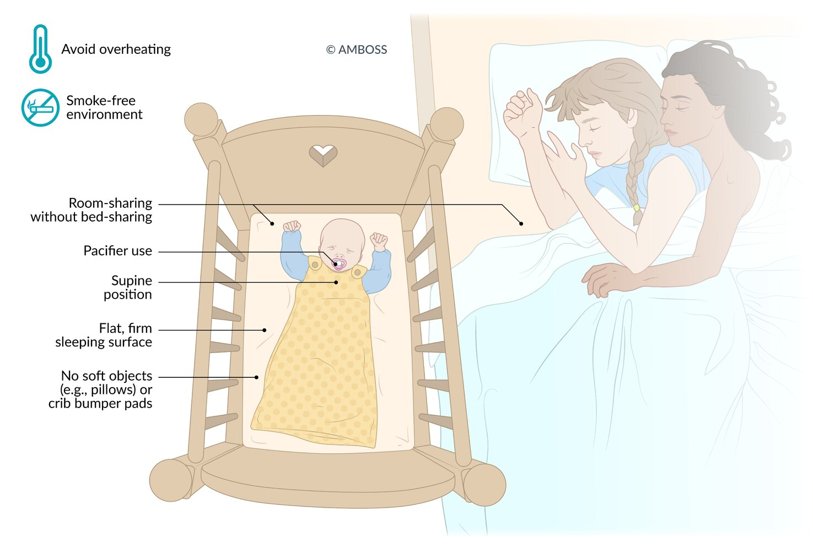

# Sudden infant death syndrome

*Categories: Clinical knowledge > Pediatrics > Child development and wellbeing > Sudden infant death syndrome*

[Original Article Link](https://coursology-qbank.com/amboss/article/T406iT)

---

## Summary

Sudden <u>infant</u> <u>death</u> syndrome (SIDS) is the sudden, unexplained <u>death</u> of a child < 1 year of age, presumed to have occurred during <u>sleep</u>. SIDS is a diagnosis of exclusion and can only be made after a thorough postmortem examination has excluded other causes such as a cardiac abnormality or <u>child maltreatment</u>. The cause of SIDS is unknown but is likely due to a combination of intrinsic and extrinsic factors. Preventive measures include the avoidance of prenatal tobacco and <u>alcohol</u> exposure, <u>exclusive feeding of breast milk</u> for the first 6 months, and <u>safe sleep practices</u>. Parents should receive education on <u>SIDS prevention</u> during <u>routine prenatal care</u> and <u>well-child visits</u>.

---

## Definitions

* Sudden <u>infant</u> <u>death</u> syndrome (SIDS) [[1]](https://coursology-qbank.com/amboss/article/DPd1SJ0)

* The sudden, unexpected <u>death</u> of a child < 1 year of age

* <u>Cause of death</u> remains unexplained after a complete postmortem examination.

* <u>Death</u> is usually presumed to have occurred during <u>sleep</u>.

* Sudden unexpected infant death (<u>SUID</u>) [[2]](https://coursology-qbank.com/amboss/article/vPdAgJ0)

* An umbrella term for any sudden, unexpected <u>death</u> of a child < 1 year of age

* <u>Cause of death</u> may be unexplained (e.g., SIDS) or explained (e.g., trauma, <u>poisoning</u>, metabolic disorder).

* Sudden unexplained death in children (<u>SUDC</u>) [[2]](https://coursology-qbank.com/amboss/article/vPdAgJ0)

* The sudden, unexpected <u>death</u> of a child ≥ 1 year of age

* <u>Cause of death</u> remains unexplained after a complete postmortem examination.

> [!TIP]
> SIDS is a diagnosis of exclusion and cannot be made until a thorough postmortem examination has been completed. [[3]](https://coursology-qbank.com/amboss/article/3PdSeJ0)[[4]](https://coursology-qbank.com/amboss/article/SPdyVJ0)

---

## Epidemiology

* Peak <u>incidence</u>: 2–4 months  [[5]](https://coursology-qbank.com/amboss/article/gYWFoP0)

* Sex: <u>♂</u> > <u>♀</u>

Epidemiological data refers to the US, unless otherwise specified.

---

## Etiology

The etiology of SIDS remains unclear. Evidence suggests that it is caused by a combination of both extrinsic and intrinsic factors, which ultimately lead to acute or chronic <u>hypoxia</u>. [[6]](https://coursology-qbank.com/amboss/article/3IaScN)[[7]](https://coursology-qbank.com/amboss/article/hYWcKP0)

### Extrinsic factors [[7]](https://coursology-qbank.com/amboss/article/hYWcKP0)[[8]](https://coursology-qbank.com/amboss/article/iWWJO40)

* Sleeping in the <u>prone position</u>

* Exposure to <u>nicotine</u> during <u>pregnancy</u> and after <u>birth</u> (including 2nd-hand smoking)

* Young maternal age (especially < 20 years)

* Overheating

* Unsafe sleeping environment or CO2 rebreathing, e.g., a shared blanket, stuffed animals in the crib, soft bedding

### Intrinsic factors [[6]](https://coursology-qbank.com/amboss/article/3IaScN)

* Male sex

* <u>Prematurity</u>

* Prenatal and/or postnatal exposure to smoking, <u>alcohol</u>, and/or drugs

* <u>Polymorphisms</u> in the serotonergic pathway

* <u>Brainstem</u> abnormality that affects serotonergic modulation of cardiorespiratory control and impairs protective responses to external stressors

---

## Prevention

Include education on <u>SIDS prevention</u> during <u>prenatal care</u> and <u>well-child visits</u>.

### Prenatal interventions [[14]](https://coursology-qbank.com/amboss/article/vLdAzq0)[[15]](https://coursology-qbank.com/amboss/article/DLd1-q0)

* Avoid <u>nicotine</u> and <u>tobacco smoke</u> exposure.

* Avoid <u>alcohol</u>, <u>marijuana</u>, <u>opioids</u>, and other <u>substance use during pregnancy</u>. [[16]](https://coursology-qbank.com/amboss/article/4Ia31N)

* Obtain <u>routine prenatal care</u>.

### Postnatal interventions [[14]](https://coursology-qbank.com/amboss/article/vLdAzq0)[[15]](https://coursology-qbank.com/amboss/article/DLd1-q0)

#### General measures

* Maintain a smoke-free environment (including second-hand smoke exposure).

* Avoid maternal use of all <u>nicotine products</u>.

* Avoid maternal use of <u>alcohol</u>, <u>marijuana</u>, <u>opioids</u>, and other substances.

* Recommend <u>exclusive feeding of breast milk</u> for the first 6 months.

* Promote neck and shoulder muscle development with supervised awake <u>prone positioning</u> (i.e., <u>tummy time</u>).

* Follow the <u>ACIP immunization schedule</u>.

#### Safe sleep practices

* Avoid overheating the room and <u>infant</u>.

* Ensure <u>infants</u> <u>sleep</u> in the caregiver's room for the first 6 months.

* Avoid bed-sharing.

* Place the <u>infant</u> in the <u>supine position</u> for <u>sleep</u> until 1 year of age.

* Use a firm, flat, noninclined <u>sleep</u> surface.

* Keep soft objects (e.g., quilts, pillows, soft toys) away from the sleeping area.

* Offer a pacifier when putting the <u>infant</u> to <u>sleep</u>.  [[13]](https://coursology-qbank.com/amboss/article/6D1j2Q0)

* To provide warmth, layered light clothing or wearable <u>sleep</u> sacks are preferred over blankets.

* If swaddling is desired, follow safe sleep swaddling recommendations to prevent suffocation. [[14]](https://coursology-qbank.com/amboss/article/vLdAzq0)

* Swaddle the chest snugly to prevent loose swaddling from covering the face  [[17]](https://coursology-qbank.com/amboss/article/h8dcm70)

* Stop swaddling once the child starts attempting to roll over (typically at around 3–4 months of age).  [[14]](https://coursology-qbank.com/amboss/article/vLdAzq0)

* See “<u>Healthy hip swaddling</u>” for additional swaddling recommendations.

Safe sleep practices to reduce the risk of sudden infant death syndrome

---