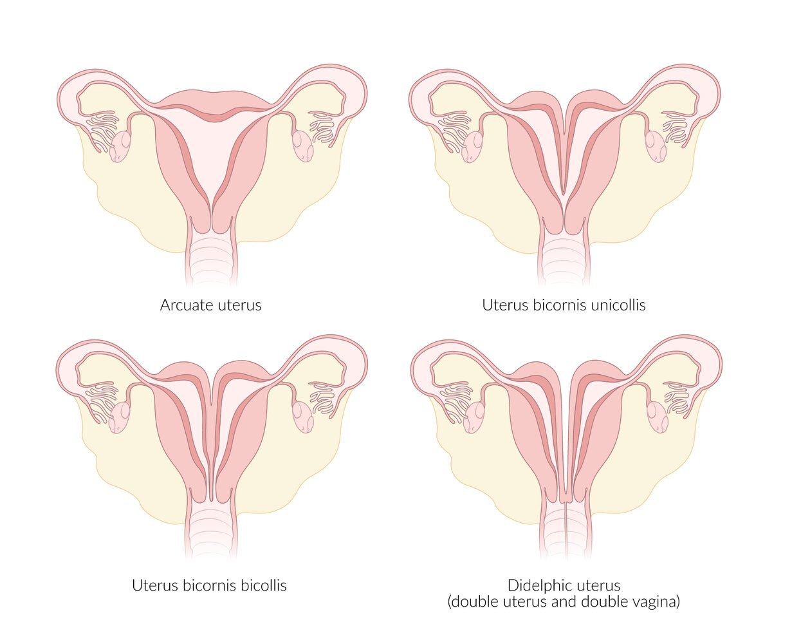
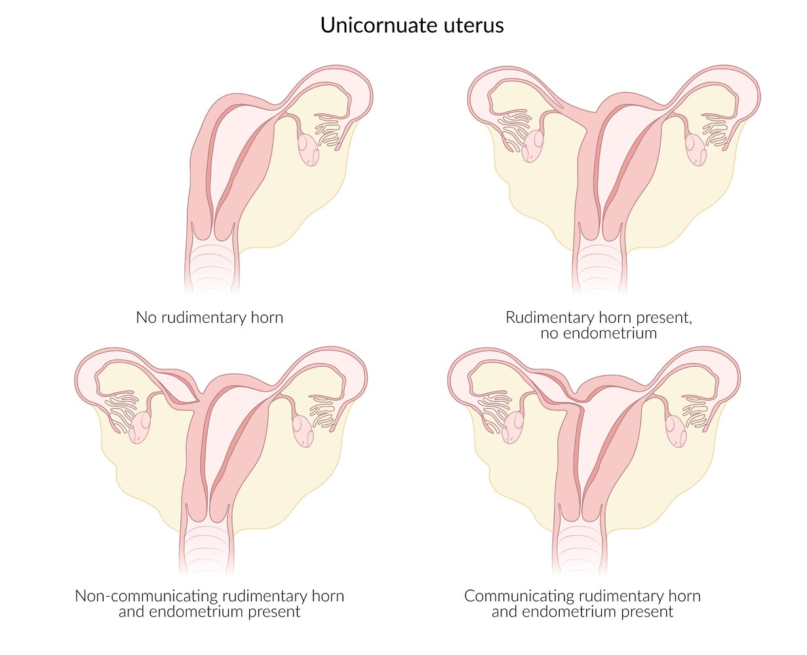
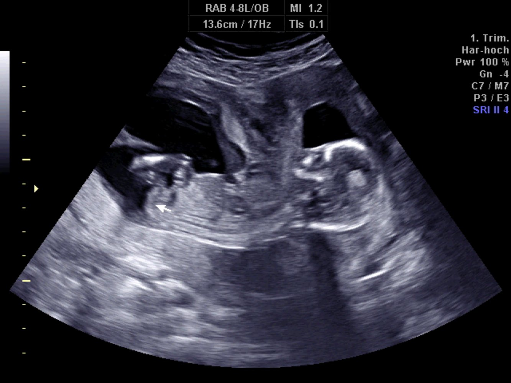
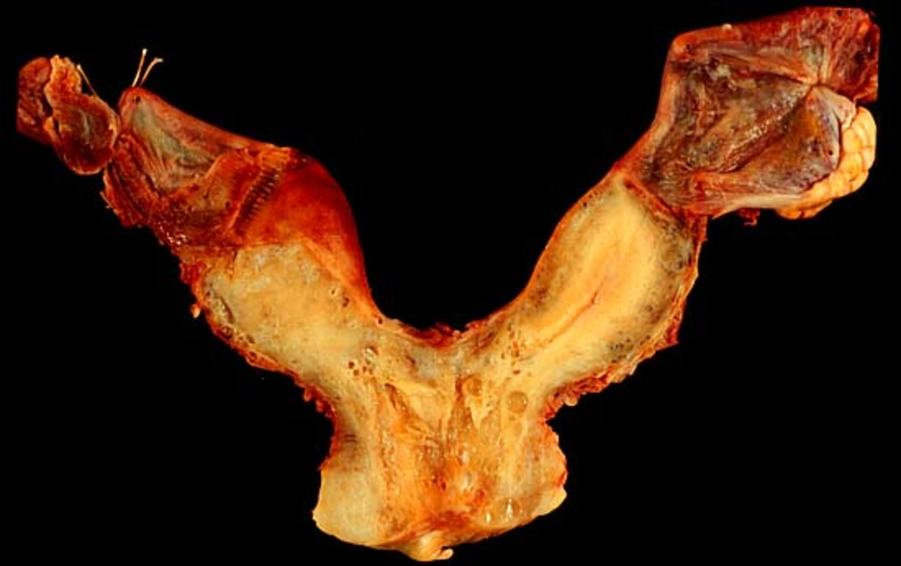
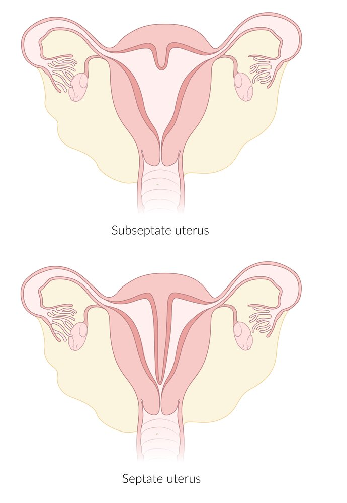
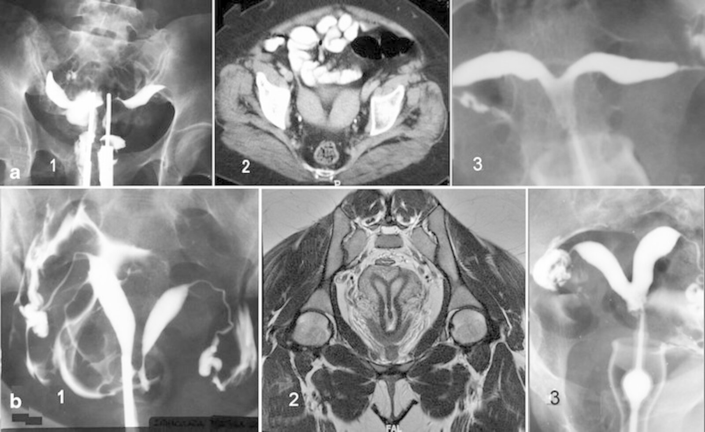

# Anomalies of the female genital tract

*Categories: Clinical knowledge > Pediatrics > Hereditary malformations > Anomalies of the female genital tract*

[Original Article Link](https://coursology-qbank.com/amboss/article/vk0ApT)

---

## Summary

Structural anomalies of the female genital tract may be present at <u>birth</u> or may be acquired later in life. Common congenital anomalies of the female genital tract are <u>anomalies of Müllerian duct fusion</u> and an <u>imperforate hymen</u>. Impaired fusion of the <u>Müllerian ducts</u> can result in duplication of the <u>uterus</u>, <u>cervix</u>, and/or <u>vagina</u>, while incomplete fusion results in an intrauterine and/or intravaginal septum. Rarely, the <u>Müllerian duct</u> may be completely absent (<u>Müllerian agenesis</u>), resulting in the absence of the <u>uterus</u>, <u>cervix</u>, and <u>vagina</u>. Acquired structural anomalies include <u>intrauterine adhesions</u> and <u>labial adhesions</u>. <u>Intrauterine adhesions</u> occur following <u>uterine curettage</u> or as a result of <u>pelvic inflammatory disease</u>. <u>Labial adhesions</u> are the result of <u>estrogen deficiency</u> during childhood. Most patients with structural anomalies of the female genital tract remain asymptomatic until <u>puberty</u>. <u>Intrauterine adhesions</u> present with <u>secondary amenorrhea</u>, while <u>Müllerian agenesis</u> and <u>imperforate hymen</u> present with <u>primary amenorrhea</u>. <u>Infertility</u> may be the initial symptom in all structural anomalies of the genital tract. Structural anomalies of the <u>uterus</u> and <u>cervix</u> are diagnosed with imaging such as <u>transvaginal ultrasonography</u>. Surgical reconstruction or resection is the main treatment for both the congenital and acquired genital tract anomalies. <u>Labial adhesions</u> are a primarily <u>clinical diagnosis</u>, and are treated with topical <u>estrogen</u>.

---

## Anomalies of the uterus

### <u>Anomalies of Müllerian duct fusion</u>

* <u>Incidence</u>: 3–4/100 female individuals

* Pathophysiology

* Defective fusion of the <u>Müllerian ducts</u> during embryonal development

* Normally functioning <u>gonads</u> and female <u>karyotype</u> → normal development of <u>secondary sexual characteristics</u> (e.g., <u>breast</u>, pubic <u>hair</u> development)

|  Anomalies of Müllerian duct fusion [[1]](https://coursology-qbank.com/amboss/article/0eXexC)  |  |  |
| --- | --- | --- |
| Types of fusion anomalies | Relative frequency | Pathophysiology |
| Müllerian agenesis |  * Rare   |  * Both of the <u>Müllerian ducts</u> fail to develop, leading to the absent or <u>hypoplastic</u> <u>uterus</u>, absent <u>cervix</u>, and <u>vaginal agenesis</u> (but functional <u>ovaries</u>)   |
|  Unicornuate uterus   |  * 10%   |  * One of the <u>Müllerian ducts</u> fails to develop   |
|  Didelphic uterus   |  * 8%   |  * Complete lack of <u>Müllerian duct</u> fusion → double <u>uterus</u>, double <u>cervix</u>, double <u>vagina</u>   |
|  Bicornuate uterus   |  * 26%   |  * Incomplete fusion of the <u>Müllerian ducts</u> to various degrees  * <u>Uterus bicornis</u> unicollis: double <u>uterus</u>, single <u>cervix</u>, and single <u>vagina</u>  * <u>Uterus bicornis</u> bicollis: double <u>uterus</u> and double <u>cervix</u> with/without a vaginal septum   |
|  Septate uterus   |  * 35%   |  * The <u>Müllerian ducts</u> fuse, but the septa between the two ducts persists either partially (subseptate <u>uterus</u>) or completely (<u>septate uterus</u>).   |
| <u>DES</u>-related abnormality |  * Rare   |  * In-utero exposure to <u>diethylstilbestrol</u>  * <u>Vagina</u>: adenosis, <u>adenocarcinoma</u>  * <u>Cervix</u>: cockscomb <u>cervix</u>, <u>cervical collar</u>  * <u>Uterus</u>: T-shaped <u>uterine cavity</u>, <u>hypoplasia</u>, <u>uterine synechiae</u>  * <u>Fallopian tube</u>: abnormal <u>fimbriae</u>, cornual <u>budding</u>   |

* Clinical features

* Asymptomatic before <u>puberty</u>

* <u>Infertility</u> and <u>dyspareunia</u>

* In some cases, periodic lower abdominal <u>pain</u>

* <u>Menorrhagia</u> 
* <u>Müllerian agenesis</u>: <u>primary amenorrhea</u> in a female individual with fully-developed <u>secondary sexual characteristics</u>

* Increased risk of the following obstetric complications:

* <u>Cervical incompetence</u>

* <u>Ectopic pregnancy</u>

* <u>Preterm labor</u>

* <u>Malpresentation</u>

* Obstructed or <u>prolonged labor</u>

* Retained <u>placenta</u> → <u>postpartum hemorrhage</u>

* Recurrent midtrimester abortions

* Associated with urological complications;  (e.g., <u>renal agenesis</u>, <u>pelvic kidney</u>, <u>horseshoe kidney</u>)  and skeletal <u>malformations</u> (e.g., cervicothoracic <u>somite</u> <u>dysplasia</u>)

* Diagnostics

* <u>Screening tests</u>

* Transvaginal or abdominal <u>ultrasound</u>

* <u>Hysterosalpingography</u>

* <u>Confirmatory test</u>: <u>MRI</u>

* <u>Renal ultrasound</u> should be performed in all patients to screen for renal abnormalities. [[2]](https://coursology-qbank.com/amboss/article/4o13X30)

* Treatment

* Surgical treatment is usually not recommended in the following situations:

* Another treatable cause of <u>infertility</u> co-exists

* The woman is asymptomatic

* Metroplasty: reconstruction of the <u>uterus</u>

* <u>Septoplasty</u>: a type of metroplasty that only involves resection of the septum in a separate <u>uterus</u>

> [!TIP]
> In patients with <u>infertility</u> and congenital uterine anomalies, it is important to rule out other <u>causes of infertility</u> before surgical therapy is considered.

> [!TIP]
> The mere presence of a <u>Müllerian duct</u> anomaly does not necessitate surgical therapy.

Anomalies of the uterus I

Anomalies of the uterus II

Bicornuate uterus (Uterus bicornis bicollis)

Bicornuate uterus

Anomalies of the uterus III

Imaging of uterine anomalies

### Intrauterine adhesions (<u>Asherman syndrome</u>)

* Definition: <u>endometrial</u> adhesions or <u>fibrosis</u>

* Etiology

* Following uterine dilation or <u>curettage</u> (most common cause)

* Postinflammatory (e.g., <u>chlamydia</u>)

* Pathophysiology: uterine dilation or <u>curettage</u> → <u>endometrial</u> basal layer damage

* Clinical features

* Usually asymptomatic

* <u>Abnormal uterine bleeding</u>

* <u>Secondary amenorrhea</u>

* <u>Infertility</u>

* <u>Recurrent pregnancy loss</u>

* Periodic abdominal <u>pain</u>

* Diagnostics [[3]](https://coursology-qbank.com/amboss/article/3v1S-i0)

* Negative <u>progesterone withdrawal test</u>: No bleeding after <u>progesterone</u> cessation suggests blockage of the outflow tract.

* <u>Confirmatory test</u>: <u>hysteroscopy</u> to directly visualize adhesions

* <u>Hysterosalpingography</u>: honeycomb appearance of the <u>uterus</u>

* Treatment

* Hysteroscopic resection of the adhesions

* Treatment is only indicated if patients are symptomatic.

> [!NOTE]
> Individuals with Asherman syndrome have intrauterine Adhesions.

References:[[4]](https://coursology-qbank.com/amboss/article/hF0c33)[[5]](https://coursology-qbank.com/amboss/article/RF0l33)[[6]](https://coursology-qbank.com/amboss/article/iF0J33)

---

## Anomalies of the vagina

### Agenesis of the upper vagina

* Definition: a condition in which the <u>vagina</u> is abnormally closed or absent

* <u>Epidemiology</u>: 1/5000 female individuals [[7]](https://coursology-qbank.com/amboss/article/47c3Nd0)

* Etiology: <u>Müllerian agenesis</u>

* Pathophysiology

* <u>Agenesis</u> or <u>hypoplasia</u> of the <u>Müllerian duct</u> → <u>atresia</u> of the upper-third of the <u>vagina</u>

* Normally functioning <u>gonads</u> and female <u>karyotype</u> → normal development of <u>secondary sexual characteristics</u> (e.g., <u>breast</u>, pubic <u>hair</u> development)

* Associated anomalies

* Absent or malformed <u>uterus</u> and <u>cervix</u> (in almost all cases)

* Urological <u>malformations</u> (25–50% of cases): <u>single kidney</u>, <u>pelvic kidney</u>, <u>horseshoe kidney</u>

* Skeletal <u>malformations</u> (10–15% of cases)

* Clinical features

* Asymptomatic before <u>puberty</u>

* <u>Primary amenorrhea</u>

* <u>Infertility</u>

* <u>Dyspareunia</u>

* Perineal examination: vaginal dimple and a hymenal fringe

* Diagnostics

* Normal levels of <u>LH</u>, <u>FSH</u>, <u>prolactin</u>, <u>estradiol</u>, and <u>testosterone</u>

* <u>Ultrasound</u>

* Absent or malformed <u>uterus</u> (e.g., hemiuterus, rudimentary <u>uterus</u>)

* Normal <u>ovaries</u>

* Possible associated <u>malformations</u> of the <u>kidneys</u> or <u>urinary tract</u>

* <u>MRI</u> to determine if functional <u>endometrium</u> is present

* Treatment: <u>vaginoplasty</u>

### Agenesis of the lower vagina

* Etiology: abnormal development of the sinovaginal bulbs and vaginal plate

* Clinical features

* <u>Primary amenorrhea</u>

* Cyclic <u>pelvic pain</u>

* Diagnostics

* Vaginal dimple may be present on <u>physical exam</u>

* Palpable abdominal mass due to distention of the upper <u>vagina</u>

* <u>Confirmatory tests</u>: <u>ultrasound</u> or <u>MRI</u>

* Normal <u>ovaries</u>, <u>uterus</u>, <u>cervix</u>, and upper <u>vagina</u>

* Measurement of the distance from introitus to obstruction

* Treatment: surgical pull-through procedure

### Transverse vaginal septum

* <u>Incidence</u>: 1/70,000 female individuals

* Pathophysiology

* Failure of recanalization of the <u>Müllerian duct</u> → transverse septum in the upper-third (45%), lower third (15–20%), and/or middle third (35–40%) of the <u>vagina</u>

* Associated with cervical <u>hypoplasia</u> or absence

* <u>Cryptomenorrhea</u> → <u>hematocolpos</u>

* Clinical features

* Asymptomatic before <u>puberty</u>

* <u>Primary amenorrhea</u>

* <u>Infertility</u>

* Periodic lower abdominal <u>pain</u>

* Possibly, palpable lower abdominal mass

* Perineal examination: normal <u>vulva</u> and external genitalia

* Diagnostics: <u>transvaginal ultrasonography</u> or <u>MRI</u>

* Treatment

* First-line: nonsurgical dilation over 6–12 months using graduated vaginal dilators

* Second-line: <u>vaginoplasty</u>

---

## Imperforate hymen

An <u>imperforate hymen</u> is a congenital anomaly in which the <u>hymen</u> obstructs the opening to the <u>vagina</u>. [[8]](https://coursology-qbank.com/amboss/article/NhV-V80)

### <u>Epidemiology</u>

* <u>Incidence</u>: 1:1000–2000 individuals born with female genitalia [[9]](https://coursology-qbank.com/amboss/article/P7cWNd0)[[10]](https://coursology-qbank.com/amboss/article/mhVVe80)

### Pathophysiology

Central cells of the Müllerian eminence in the <u>urogenital sinus</u> do not disintegrate → <u>imperforate hymen</u> → cryptomenorrhea at <u>puberty</u> (outflow tract obstruction leads to backup of menstrual blood) →  hematocolpos;  (accumulation of blood in the <u>vagina</u>) and/or hematometra (accumulation of blood in the <u>uterus</u>)

### Clinical features [[8]](https://coursology-qbank.com/amboss/article/NhV-V80)[[11]](https://coursology-qbank.com/amboss/article/2MdTLq0)

* <u>Neonates</u>: a mass in the introitus (i.e., <u>mucocolpos</u> or <u>hydrocolpos</u>) may be visible due to accumulation of vaginal secretions after <u>birth</u>   [[10]](https://coursology-qbank.com/amboss/article/mhVVe80)

* Pubertal individuals

* <u>Primary amenorrhea</u>

* Lower abdominal or <u>pelvic pain</u>: cyclic, acute, or constant

* Symptoms from <u>mass effect</u> , e.g.:

* <u>Constipation</u> and/or <u>dyschezia</u>

* <u>Urinary retention</u>, <u>dysuria</u>, and/or frequency

* <u>Back pain</u> [[9]](https://coursology-qbank.com/amboss/article/P7cWNd0)

* Examination findings

* Possible palpable lower abdominal mass (due to <u>hematometra</u>)

* Tense, bulging, blue membrane in the <u>vulva</u> (due to <u>hematocolpos</u>)

* <u>Tanner stages</u> 4–5 for <u>breast</u> and pubic <u>hair</u> development  [[10]](https://coursology-qbank.com/amboss/article/mhVVe80)

> [!TIP]
> <u>Imperforate hymen</u> may resolve spontaneously during <u>puberty</u> due to the effects of <u>estrogen</u>. [[8]](https://coursology-qbank.com/amboss/article/NhV-V80)

### Differential diagnoses [[8]](https://coursology-qbank.com/amboss/article/NhV-V80)[[10]](https://coursology-qbank.com/amboss/article/mhVVe80)

* Other hymenal variants (e.g., microperforate, septate)  [[8]](https://coursology-qbank.com/amboss/article/NhV-V80)

* <u>Distal vaginal atresia</u>  [[8]](https://coursology-qbank.com/amboss/article/NhV-V80)

* <u>Transverse vaginal septum</u>, <u>agenesis of the upper vagina</u>, or cervical <u>atresia</u>  [[8]](https://coursology-qbank.com/amboss/article/NhV-V80)

* <u>Urogenital sinus</u> <u>malformation</u>

* Obstructed <u>uterine horn</u>

* <u>Labial adhesions</u>

### Diagnosis [[8]](https://coursology-qbank.com/amboss/article/NhV-V80)[[10]](https://coursology-qbank.com/amboss/article/mhVVe80)

* Make a preliminary <u>clinical diagnosis</u> based on <u>physical examination</u>.  [[8]](https://coursology-qbank.com/amboss/article/NhV-V80)

* Confirm diagnosis with <u>pelvic</u> <u>ultrasonography</u>.

* Transabdominal <u>ultrasound</u> is typically preferred over <u>transvaginal ultrasound</u>.

* Findings: 

* <u>Hematocolpos</u>, <u>hematometra</u>

* Normal vaginal and uterine anatomy

* Diagnostic uncertainty: Perform <u>MRI</u> to exclude obstructive abnormalities of the internal reproductive tract (see "Differential diagnoses").

### Treatment [[8]](https://coursology-qbank.com/amboss/article/NhV-V80)

Refer all patients to gynecology.

* <u>Surgery</u>: definitive treatment

* Timing: typically after onset of <u>puberty</u>  [[10]](https://coursology-qbank.com/amboss/article/mhVVe80)[[11]](https://coursology-qbank.com/amboss/article/2MdTLq0)

* Technique: excision of the <u>imperforate hymen</u> (hymenectomy) and evacuation of the accumulated blood

* <u>Conservative management</u>: Consider for symptom relief while awaiting definitive treatment.

* Indwelling urinary catheter for <u>urinary retention</u>

* <u>Stool softeners</u>

* <u>Analgesia</u>

* Menstrual suppression

> [!WARNING]
> Do not perform <u>incision</u> of an <u>imperforate hymen</u> with drainage of the associated <u>hematocolpos</u>, as there is an increased risk of complications (e.g., infection). [[10]](https://coursology-qbank.com/amboss/article/mhVVe80)[[11]](https://coursology-qbank.com/amboss/article/2MdTLq0)

---

## Labial adhesions

* Definition: partial or complete adhesion of the <u>labia minora</u>

* <u>Epidemiology</u>: occurs in 2–5% of female individuals up to 4 years of age

* Etiology:

* Absence of <u>estrogen</u> → predisposition to mild infection ;  → local inflammation → raw <u>surface epithelium</u> of the <u>labia minora</u> → adhesions

* In rare cases: trauma (<u>sexual abuse</u>), congenital defect

* Clinical features

* Usually asymptomatic

* If external urethral opening is obstructed: recurrent attacks of <u>UTI</u>, <u>vaginitis</u>, vestibulitis

* Perineal examination

* A thin vertical midline fold in the <u>perineum</u>

* The labia, vaginal opening, and occasionally the urethral meatus are not visible.

* Diagnostics: : primarily <u>clinical diagnosis</u>

* Treatment: : application of topical <u>estrogen</u>

---