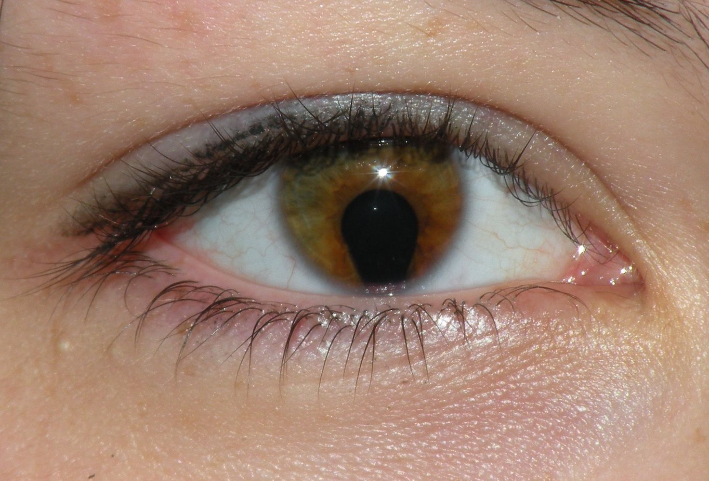
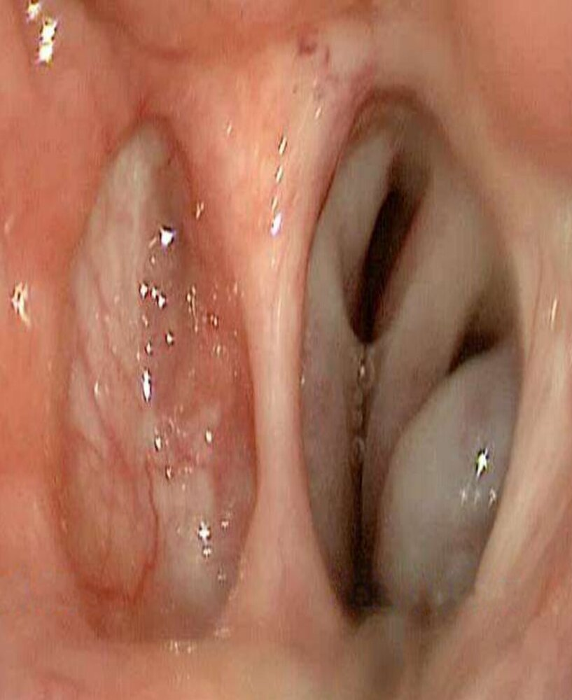

# Choanal atresia

*Categories: Clinical knowledge > Pediatrics > Hereditary malformations > Choanal atresia*

[Original Article Link](https://coursology-qbank.com/amboss/article/M40MPT)

---

## Summary

<u>Choanal</u> <u>atresia</u> is a congenital condition characterized by a bony and/or membranous obstruction of the <u>posterior</u> nasal passage. This obstruction may occur either unilaterally or bilaterally. Unilateral <u>choanal</u> <u>atresia</u> often presents late with <u>chronic inflammation</u> (e.g., <u>rhinorrhea</u>, congestion) of the affected nasal passage. <u>Bilateral choanal atresia</u> manifests as obstructed nasal breathing with intermittent <u>cyanosis</u> immediately after <u>birth</u>; breathing improves when crying, as it allows the <u>infant</u> to breathe through his or her mouth. The diagnosis is confirmed with contrast rhinography or CT imaging. The definitive treatment is <u>surgery</u>, in which the obstructive membrane or bony portion is perforated.

---

## Definitions

* Congenital condition;  characterized by a bony (90% of cases) and/or membranous (10%) obstruction of the <u>posterior</u> nasal passage

References:[[1]](https://coursology-qbank.com/amboss/article/qXYC_n)

---

## Epidemiology

* Sex: <u>♀</u> > <u>♂</u> (∼ 2:1)

* Unilateral <u>choanal</u> <u>atresia</u> is twice as common as <u>bilateral choanal atresia</u>.

* Frequently associated with other anomalies (“CHARGE syndrome” - coloboma, heart defects, atresia <u>choanae</u> (also known as <u>choanal</u> <u>atresia</u>), retardation of growth, genital abnormalities, and ear abnormalities)

Coloboma of the iris

References:[[2]](https://coursology-qbank.com/amboss/article/xG0EY3)

Epidemiological data refers to the US, unless otherwise specified.

---

## Clinical features

* Bilateral <u>choanal</u> <u>atresia</u>

* Early presentation

* <u>Infants</u> are only able to breathe through the mouth (immediately postpartum)

* <u>Cyanosis</u> that worsens when feeding and improves when crying

* <u>Upper airway</u> obstruction (e.g., noisy breathing, <u>dyspnea</u>)

* Food intake impossible: Complete <u>airway obstruction</u> is a life-threatening condition immediately following <u>birth</u> because of the worsening <u>dyspnea</u> associated with feeding.

* Unilateral <u>choanal</u> <u>atresia</u> 

* Typically presents later in life

* Chronic <u>rhinitis</u> in the affected nasal passage with <u>purulent</u> nasal discharge over several weeks

Choanal atresia

References:[[2]](https://coursology-qbank.com/amboss/article/xG0EY3)[[4]](https://coursology-qbank.com/amboss/article/BG0zY3)

---

## Diagnosis

* The inability to pass the catheter through the nasal cavity is an indication of <u>choanal</u> <u>atresia</u>.

* <u>Confirmatory tests</u>: contrast rhinography in the <u>supine position</u> or <u>CT scan</u>

* Unilateral or bilateral narrowing of the <u>posterior</u> nasal passage

* <u>Airway</u> width < 3 mm

References:[[2]](https://coursology-qbank.com/amboss/article/xG0EY3)[[5]](https://coursology-qbank.com/amboss/article/wG0hY3)[[6]](https://coursology-qbank.com/amboss/article/9G0NY3)

---

## Treatment

* Bilateral <u>choanal</u> <u>atresia</u>

* Urgent insertion of an <u>oropharyngeal airway</u> (or even <u>intubation</u>) as a temporary <u>airway</u> until <u>surgery</u>

* Surgical perforation (e.g., endoscopic resection of the <u>posterior</u> <u>nasal septum</u>)

* Local use of <u>chemotherapeutic agents</u> (e.g., <u>mitomycin</u> C) may reduce the need for <u>stenting</u>, dilatations, and second <u>surgery</u>.

* Unilateral <u>choanal</u> <u>atresia</u>
* Observation and subsequent <u>surgery</u> when the <u>infant</u> is 1–2 years old

> [!WARNING]
> In suspected cases of <u>bilateral choanal atresia</u>, do not feed. A <u>feeding tube</u> is required due to the increased risk of <u>aspiration</u>.
> References:[[4]](https://coursology-qbank.com/amboss/article/BG0zY3)[[7]](https://coursology-qbank.com/amboss/article/yG0db3)

---