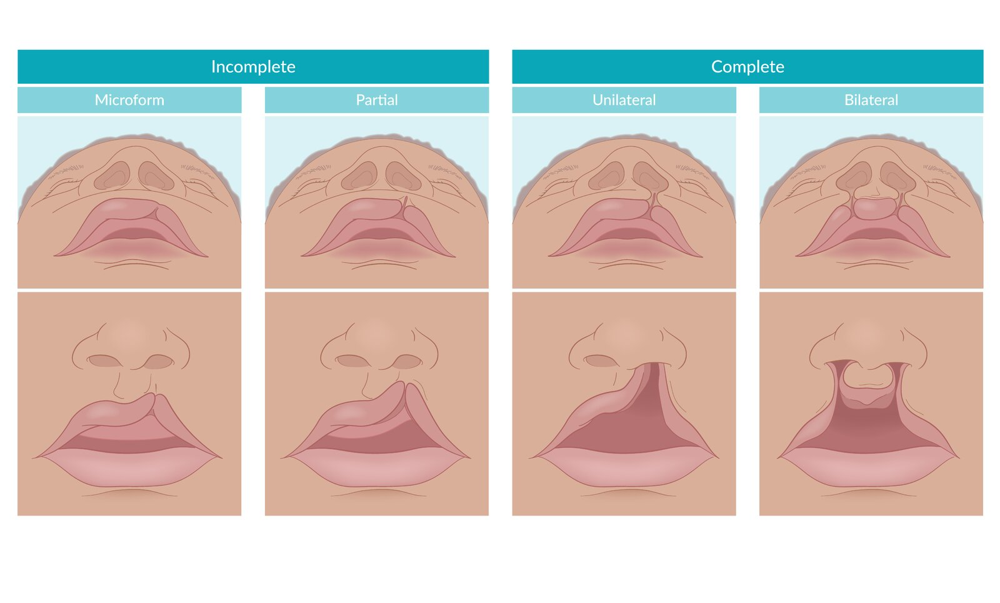
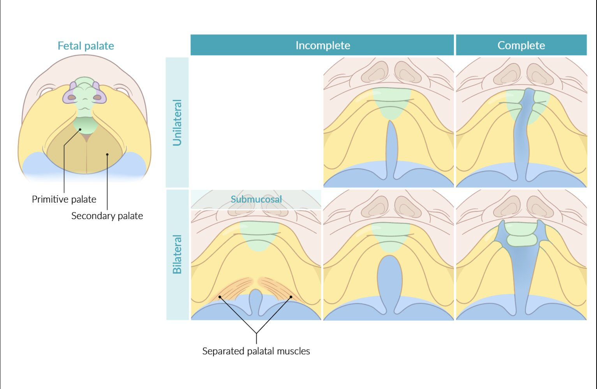

# Cleft lip and cleft palate

*Categories: Clinical knowledge > Pediatrics > Hereditary malformations > Cleft lip and cleft palate*

[Original Article Link](https://coursology-qbank.com/amboss/article/FM0gqg)

---

## Summary

<u>Cleft lip</u> (CL) and <u>cleft palate</u> (CP) are the most common congenital orofacial deformities. A combination of genetic predisposition and in-utero exposure to <u>teratogens</u> (<u>nicotine</u>, <u>alcohol</u>, <u>antiepileptic drugs</u>) can arrest the fusion of the facial processes required for normal facial development. Failure of fusion of the maxillary prominence with the <u>medial</u> nasal prominence causes <u>cleft lip</u> (CL). Failure of fusion of the palatine prominences causes <u>cleft palate</u> (CP). <u>Cleft lip</u> and/or <u>palate</u> may be unilateral or bilateral and complete or incomplete. In addition to facial deformity, <u>infants</u> with CL and CP have feeding, <u>hearing</u>, speech difficulties, and defects in the dentition. <u>Infants</u> with <u>cleft lips</u> and/or <u>palate</u> require special feeding techniques (feeding in upright position, special feeding bottles) since they cannot effectively create negative sucking pressure. Treatment should be initiated as early as possible and may involve an interdisciplinary team of plastic surgeons, oral maxillofacial surgeons, otolaryngologists, <u>pediatricians</u>, and speech therapists. Nasoalveolar molding and lip taping are non-surgical techniques used to decrease the size of the lip/palatal defects and should be initiated early (at 2 weeks of age). Repair of the <u>cleft lip</u> is done at 3 months of age and of the <u>cleft palate</u> at 6 months of age with the aim of optimizing feeding and <u>speech development</u> without interrupting normal maxillofacial growth.

---

## Etiology

The development of CL/CP is dependent on the interaction of environmental factors and genetic predisposition. [[5]](https://coursology-qbank.com/amboss/article/tNaX1O)

* Genetic predisposition

* <u>Family history</u>: multifactorial <u>inheritance pattern</u> (Mendelian inheritance is rare)

* Part of genetic disorders

* <u>Pierre Robin sequence</u>

* <u>Patau syndrome</u> (<u>trisomy 13</u>)

* <u>Edwards syndrome</u> (<u>trisomy 18</u>)

* <u>DiGeorge syndrome</u> (<u>22q11.2 deletion syndrome</u>)

* <u>Loeys-Dietz syndrome</u>: <u>bifid uvula</u>

* Environmental factors: exposure to <u>teratogenic substances</u> in utero

* <u>Nicotine</u> and/or <u>alcohol</u>

* Drugs: <u>antiepileptics</u>;  (e.g., <u>phenytoin</u>, <u>sodium</u> <u>valproate</u>, <u>carbamazepine</u>, <u>phenobarbital</u>), <u>folate</u> <u>antagonists</u> (e.g., <u>methotrexate</u>, <u>trimethoprim</u>), and excessive <u>vitamin A</u> intake during <u>pregnancy</u>

---

## Pathophysiology

<u>Cleft lip</u> and <u>palate</u> involves a disrupted fusion of the 5 embryonic facial prominences (the midline frontonasal prominence, the bilateral maxillary prominences, and the bilateral mandibular prominences) and  results in congenital orofacial deformities.  [[6]](https://coursology-qbank.com/amboss/article/nc171f0)

* <u>Cleft lip</u>

* Partial or total failure of <u>primary palate</u> formation during the 6–7th week of development

* Failed fusion of the maxillary prominences and <u>medial</u> nasal prominences at the midline

* <u>Cleft palate</u>

* Failed formation of the <u>secondary palate</u> during the 8–12th week of development

* Failed fusion of either the <u>lateral</u> <u>palatine processes</u> (palatine shelves) or of the palatine shelves with the <u>nasal septum</u> and/or <u>primary palate</u>

> [!NOTE]
> Partial or total failure of <u>primary palate</u> formation leads to <u>cleft lip</u>. Failed formation of the <u>secondary palate</u> leads to <u>cleft palate</u>.

---

## Clinical features

### Facial features [[2]](https://coursology-qbank.com/amboss/article/HNaKcO)[[7]](https://coursology-qbank.com/amboss/article/6TYj7o)

CL/CP may be unilateral or bilateral, complete or incomplete.

#### <u>Cleft lip</u>

* Microform <u>cleft lip</u>: slight, incomplete cleft characterized by a notch on the <u>vermillion border</u> of the upper lip (unilateral)

* <u>Incomplete cleft lip</u>: cleft on the upper lip that does not extend into the nostril (unilateral/bilateral)

* <u>Complete cleft lip</u>

* Cleft on the upper lip that extends into the nostrils (unilateral/bilateral)

* <u>Cleft palate</u> is more commonly associated with complete than <u>incomplete cleft lip</u>

* Unilateral <u>cleft lip</u>: the <u>orbicularis oris</u> inserts into the nasal ala on the cleft side and the columella on the unaffected side

* Bilateral <u>cleft lip</u>: the <u>orbicularis oris</u> inserts into the nasal alae bilaterally

Incomplete vs. complete cleft lip

#### <u>Cleft palate</u>

* Incomplete <u>cleft palate</u>: clefting only of the <u>secondary palate</u> (<u>anterior</u> or <u>posterior</u> to the <u>incisive foramen</u>)

* Complete <u>cleft palate</u>

* Cleavage of the entire <u>hard palate</u>, <u>soft palate</u>, and the uvula (<u>anterior</u> and <u>posterior</u> to the <u>incisive foramen</u>)

* Often associated with <u>cleft lip</u>

* Bifid uvula

* A split or forked uvula, typically containing less <u>muscle tissue</u> than a normal uvula.

* Least severe form of <u>cleft palate</u>

* <u>Submucosal</u> <u>cleft palate</u> (occult <u>cleft palate</u>): muscular and/or bony palatal defect that is masked by intact palatine <u>mucosa</u>

### Other features [[8]](https://coursology-qbank.com/amboss/article/wyahhM)[[9]](https://coursology-qbank.com/amboss/article/oTY07o)

* Feeding difficulties: depends on the type and severity of the cleft

* <u>Bifid uvula</u>: may cause nasal <u>regurgitation</u>

* <u>Cleft lip</u>

* Sucking difficulties may occur.

* Minimal feeding difficulties

* Cleft <u>Palate</u>

* Sucking difficulties

* Nasal <u>regurgitation</u> of milk

* Choking/<u>coughing</u> during feeds

* Excessive <u>aerophagia</u>

* Speech difficulties: hypernasal, unintelligible speech due to velopharyngeal insufficiency (a structural disorder that causes the inability to form a seal between the <u>nasopharynx</u> and <u>oropharynx</u> and that is characterized by hypernasal speech, which may impair intelligibility)

* Dentition defects (in CP): due to clefts creating gaps in the <u>maxilla</u>

* <u>Hearing loss</u>: due to recurrent/persistent <u>otitis media with effusion</u> (<u>OME</u>)

---

## Treatment

### Approach [[11]](https://coursology-qbank.com/amboss/article/ENa81O)[[12]](https://coursology-qbank.com/amboss/article/xNaEWO)

* Management requires an interdisciplinary approach involving oral maxillofacial surgeons, plastic surgeons otolaryngologists, <u>pediatricians</u>, and speech therapists.

* A <u>cleft lip</u> or <u>palate</u> should always receive surgical repair.

* <u>Speech assessment</u> at 12–14 months and therapy of <u>velopharyngeal insufficiency</u>

### <u>Conservative measures</u> before <u>surgery</u> [[13]](https://coursology-qbank.com/amboss/article/DNa1WO)

* Proper feeding techniques: feeding in upright position to prevent nasal <u>regurgitation</u>; use of specialized feeding bottles  ; frequent burping

* Nasoalveolar molding: Use of a custom made orthodontic prosthesis to bridge and reduce the palatal gap and passively <u>mold</u> the maxillary, palatal, and nasal structures into a normal shape

* Nasal <u>stent</u>: to lift the drooping nostril and shape the nose

* Lip taping: use of adhesive tape to reduce the defect; makes definitive <u>surgery</u> easier

* Lip adhesion: <u>suturing</u> the edges of the <u>cleft lip</u>, in conjunction with <u>NAM</u> can be done in <u>infants</u> with complete CL/CP who are not responding well to lip taping

### Surgical repair [[14]](https://coursology-qbank.com/amboss/article/wNahWO)

* <u>Cleft lip</u> repair (cheiloplasty)

* Goals: achieving normal lip contour and nose, improve oral competence

* Timing: at age 3 months, <u>surgery</u> is usually staged with <u>cleft lip</u> being the first <u>surgery</u> and <u>cleft palate</u> done at a later time due to risk of <u>surgery</u> to <u>infant</u>

* <u>Tympanostomy</u> tubes are placed at the same sitting: in children with <u>OME</u> causing <u>hearing loss</u>/recurrent infections

* <u>Cleft palate</u> repair (palatoplasty) [[15]](https://coursology-qbank.com/amboss/article/yNaddO)

* Goals: closure of the defect, optimal <u>speech development</u>, and normal maxillofacial growth

* Timing: at age 6–9 months

* Further <u>surgery</u> is often required as the child grows older.

---