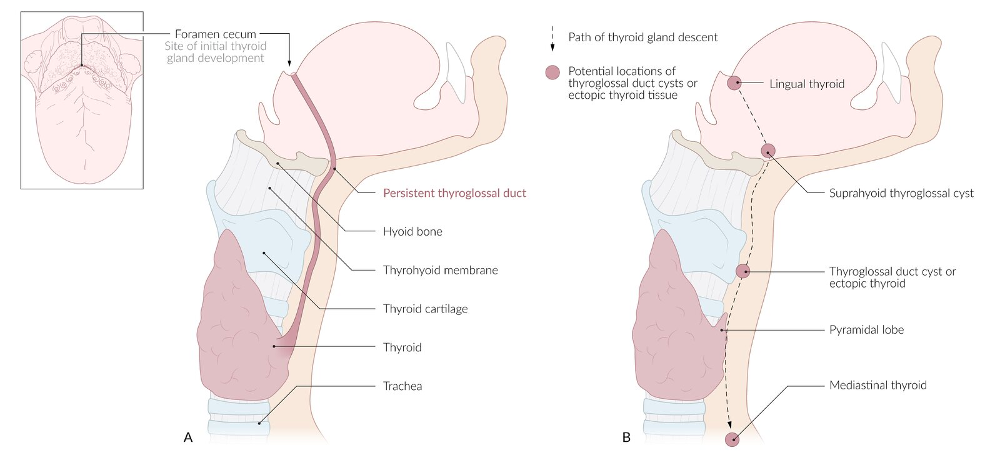
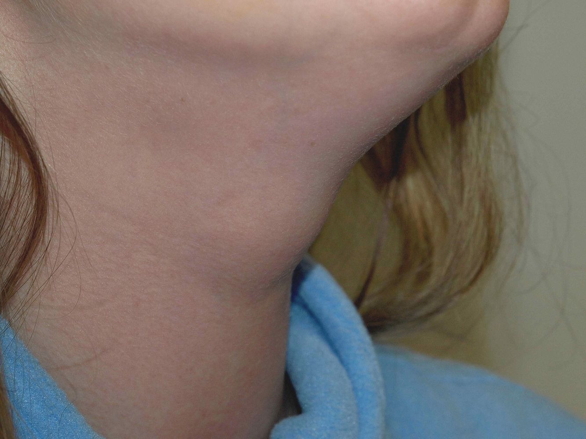
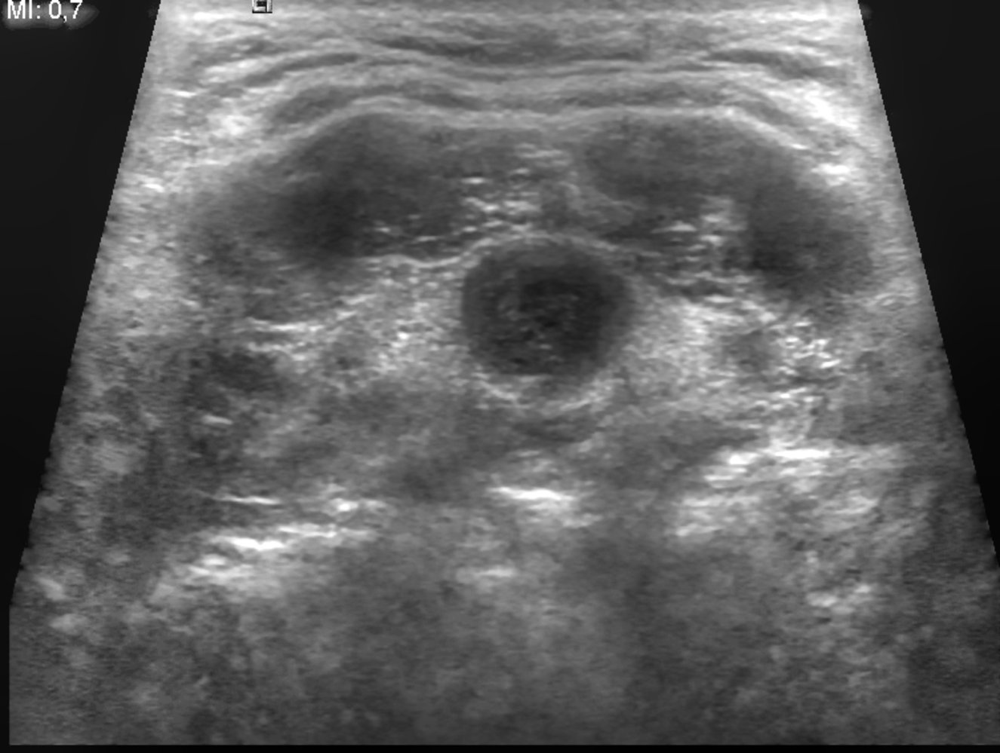
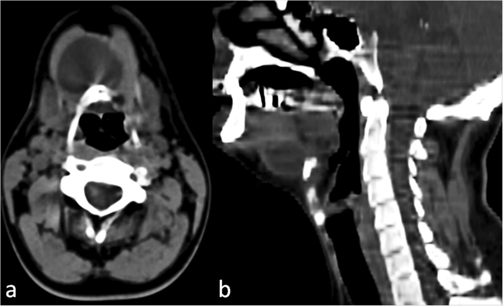
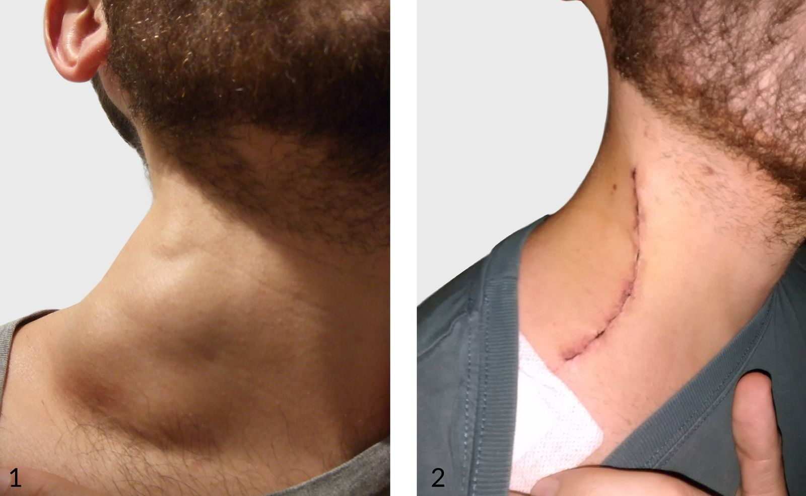
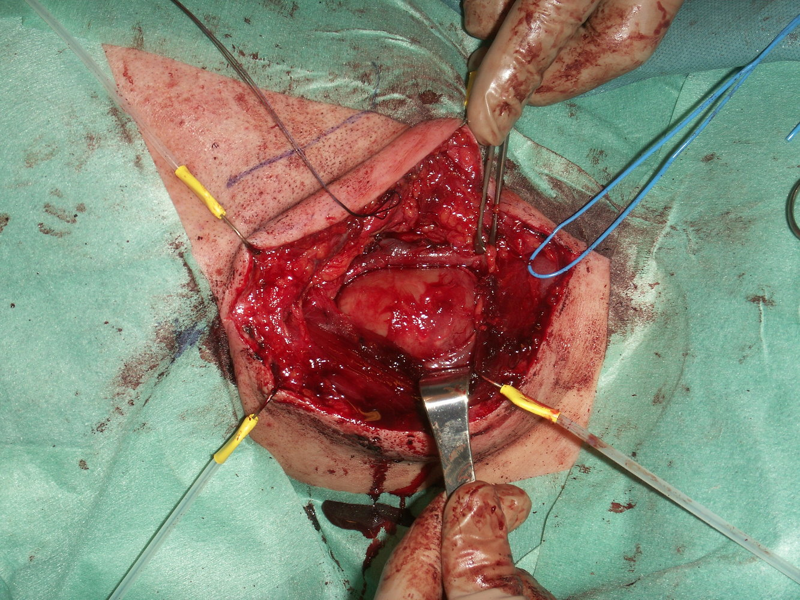

# Congenital neck masses

*Categories: Clinical knowledge > Pediatrics > Hereditary malformations > Congenital neck masses*

[Original Article Link](https://coursology-qbank.com/amboss/article/aP0QWT)

---

## Summary

Congenital neck masses are developmental anomalies that can manifest either at <u>birth</u> or later in life, usually following a respiratory infection. The most common congenital neck masses are <u>thyroglossal duct cysts</u>, <u>branchial cleft cysts</u>, and <u>cystic hygromas</u>. These <u>malformations</u> manifest as painless neck masses that, as they grow, can cause <u>dysphagia</u>, <u>respiratory distress</u>, and <u>neck pain</u> by compressing surrounding structures. The location of the mass depends on the embryological structure the cyst arises from. Diagnosis is based on clinical findings and imaging results (<u>ultrasound</u>, CT, <u>MRI</u>), which also help in surgical planning. Treatment consists of complete surgical resection to prevent recurrence and complications such as infection or <u>abscess</u> formation.

---

## Thyroglossal duct cyst

* Definition: a remnant of the <u>thyroglossal duct</u>, which forms during the <u>embryonic development</u> of the <u>thyroid gland</u> and normally regresses before <u>birth</u>

* <u>Epidemiology</u>

* <u>Incidence</u>: ∼ 7% of the population

* Second most common neck abnormality after <u>lymphadenopathy</u>

* Pathophysiology [[1]](https://coursology-qbank.com/amboss/article/jz0_si)

* The <u>thyroid gland</u> originates from the <u>foramen cecum</u> at the base of the <u>tongue</u> and descends <u>caudally</u> into the neck, forming the <u>thyroglossal duct</u>.

* If the <u>thyroglossal duct</u> fails to obliterate, midline neck cysts or <u>ectopic</u> <u>thyroid</u> tissue can develop anywhere along its path.

* Clinical features: The cyst is present from <u>birth</u> and is usually detected during early childhood.

* Painless, firm, midline neck mass that elevates with <u>swallowing</u> and <u>tongue</u> protrusion

* Usually located near the <u>hyoid bone</u>

* May cause <u>dysphagia</u> or neck/throat <u>pain</u> if the cyst enlarges

* Diagnostics

* Neck and <u>thyroid examination</u>

* <u>Ultrasound</u> of the neck to evaluate the cyst and confirm the location of the <u>thyroid</u>  

* Patients with <u>thyroglossal duct cysts</u> can have an <u>ectopic</u> <u>thyroid gland</u>. [[1]](https://coursology-qbank.com/amboss/article/jz0_si)

* In the absence of ectopy, it is important to assess the anatomical relation of the cyst to the <u>thyroid</u> for preoperative planning.

* Contrast-enhanced CT of the neck: preferred imaging modality

* <u>Thyroglossal duct cysts</u> are demonstrated as well-defined lesions with homogenous fluid attenuation and surrounding <u>rim enhancement</u>, typically close to the <u>hyoid bone</u>.

* Allows for assessment of anatomical location, relation, and extent of the cyst as well as its relation to normal <u>orthotopic</u> <u>thyroid</u> tissue.

* <u>TSH</u> levels

* If an infection is suspected, <u>fine needle aspiration</u> should be performed for <u>Gram stain</u> and culture (including AFB and <u>mycobacterial</u> culture).

* Treatment [[2]](https://coursology-qbank.com/amboss/article/4z03Gi)

* Elective surgical excision (Sistrunk procedure) to prevent infection: includes removal of the cyst, a portion of the <u>hyoid bone</u>, and excision of tissue comprising the path of descent from the <u>foramen cecum</u>

* Treatment of any active infection with <u>antibiotics</u> before <u>surgery</u>

* Complications [[3]](https://coursology-qbank.com/amboss/article/Pz0WGi)

* Infection of the cyst with possible <u>abscess</u> formation

* Sinus tract formation with persistent drainage

* <u>Ectopic</u> <u>thyroid</u> tissue

* <u>Malignancy</u> arising from <u>ectopic</u> <u>thyroid</u> tissue

> [!NOTE]
> <u>Thyroglossal duct cysts</u> manifest as a painless, firm, midline neck mass that moves with <u>swallowing</u> and <u>tongue</u> movement.

Thyroglossal duct

Thyroglossal duct cyst

Thyroglossal duct cyst

Thyroglossal duct cyst

---

## Branchial cleft cyst

* Definition: remnants of the embryological second <u>branchial cleft</u> or cervical sinus, which normally regresses before <u>birth</u>

* <u>Epidemiology</u>

* Accounts for ∼ 20% of pediatric neck masses

* ∼ 95% of all <u>branchial cleft</u> <u>malformations</u> are anomalies of the second <u>branchial cleft</u>.

* Pathophysiology: : formed due to incomplete obliteration of <u>branchial clefts</u> and pouches

* Clinical features: usually diagnosed in late childhood or in adulthood after a previously undiagnosed cyst becomes infected [[3]](https://coursology-qbank.com/amboss/article/Pz0WGi)

* History of <u>upper respiratory infection</u>

* Painless, firm mass 

* Located <u>lateral</u> to the midline, usually <u>anterior</u> to the <u>sternocleidomastoid muscle</u>

* Does not move with <u>swallowing</u>

* There may be a small draining opening if a <u>fistula</u> is present.

* Diagnostics

* <u>Neck examination</u>

* <u>Ultrasound</u>

* CT or <u>MRI</u> to further assess anatomical structures for surgical planning

* Treatment: : complete surgical excision of both the cyst and any associated tracts  [[2]](https://coursology-qbank.com/amboss/article/4z03Gi)

* Complications: : infection of the cyst, tract, or sinus, with possible <u>abscess</u> formation

> [!NOTE]
> <u>Branchial cleft cysts</u> manifest as a painless, firm neck mass <u>lateral</u> to the midline.

---

## Cystic hygroma

* Definition 

* A congenital lymphatic cyst (macrocystic <u>lymphangioma</u>) caused by <u>malformation</u> and obstruction of the fetal <u>lymphatic system</u>

* Usually located in the neck (most commonly <u>posterior triangle of the neck</u>)  [[4]](https://coursology-qbank.com/amboss/article/1kX25y)

* <u>Epidemiology</u>

* ∼ 1:6,000 <u>live births</u> [[4]](https://coursology-qbank.com/amboss/article/1kX25y)

* Strongly associated with fetal <u>aneuploidy</u>;  (e.g., <u>Turner syndrome</u>, <u>trisomy 21</u>) and congenital <u>malformations</u> (e.g., <u>congenital heart defects</u>)

* Clinical features

* Present at <u>birth</u> as a soft, compressible, painless mass

* Usually in the <u>posterior</u> triangle of the neck

* Can cause <u>dysphagia</u> or <u>airway</u> compromise

* Positive <u>transillumination</u> test

* Diagnostics

* <u>Prenatal ultrasound</u> : fluid-filled neck mass with or without septations [[5]](https://coursology-qbank.com/amboss/article/ldYvJL)

* <u>Ultrasound</u> to identify mass in <u>infancy</u>

* CT or <u>MRI</u> may be used to further assess anatomical structures for surgical planning

* Treatment: : Small masses may regress spontaneously, but surgical excision is usually indicated to prevent infection or <u>airway</u> compromise, as well as for cosmesis.  [[2]](https://coursology-qbank.com/amboss/article/4z03Gi)

* Prognosis: Recurrence is common following surgical excision of extensive hygromas.

Cystic hygroma

Surgical excision of cystic hygroma

---

## Differential diagnoses

* <u>Unilateral cervical lymphadenopathy</u>

* <u>Fistula</u>

* <u>Hemangioma</u>

* Cervical <u>teratoma</u>

* <u>Dermoid cysts</u>

* Midline cervical cleft cyst

The differential diagnoses listed here are not exhaustive.

---