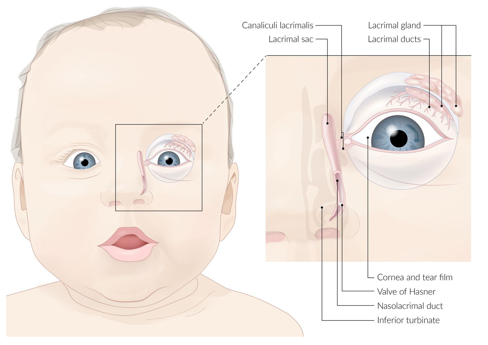
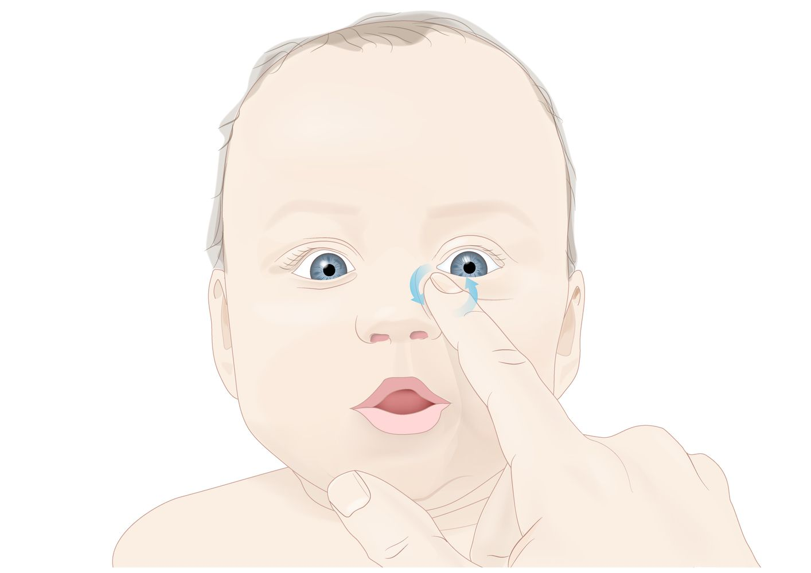
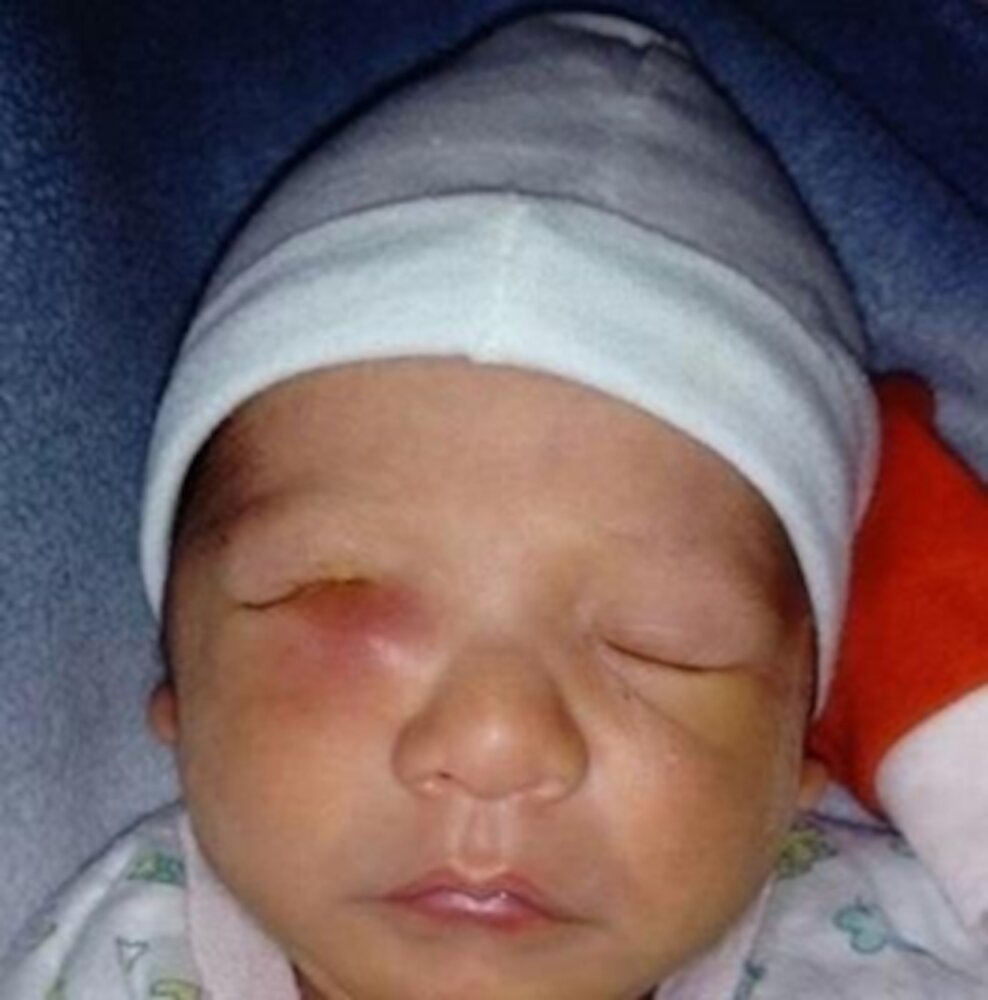
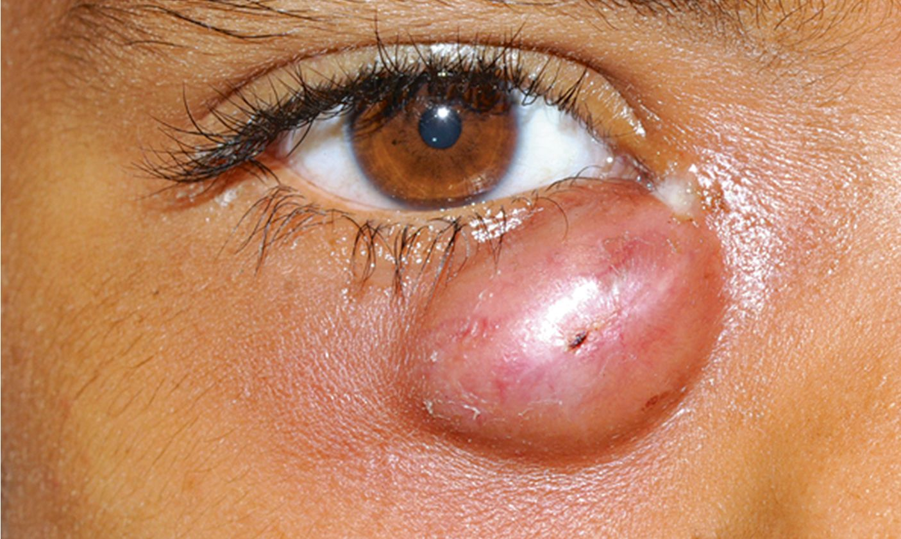
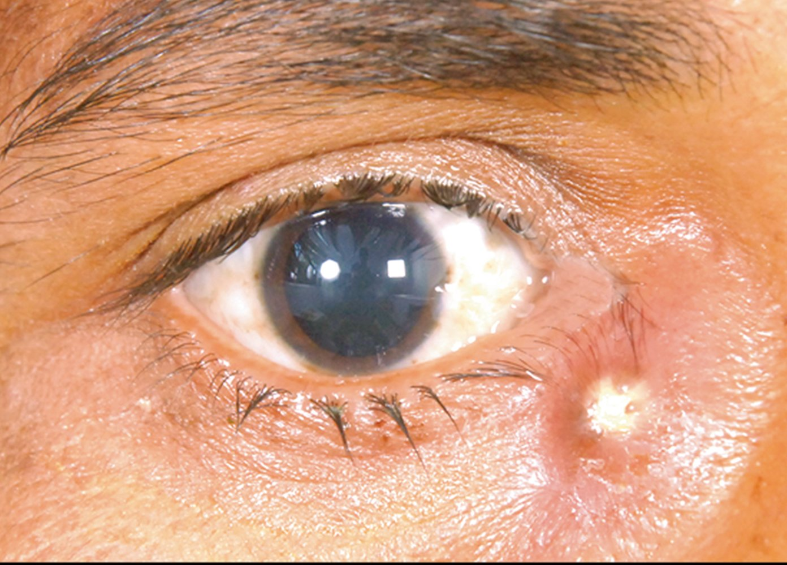
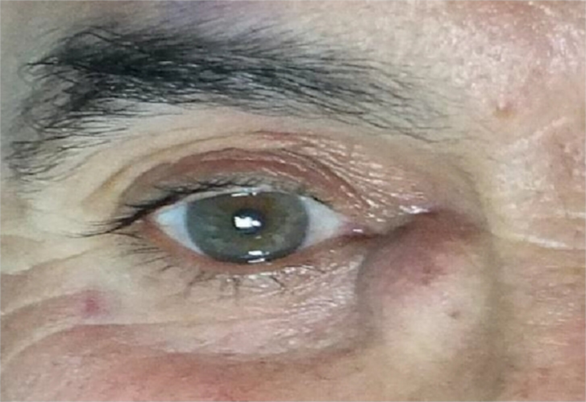
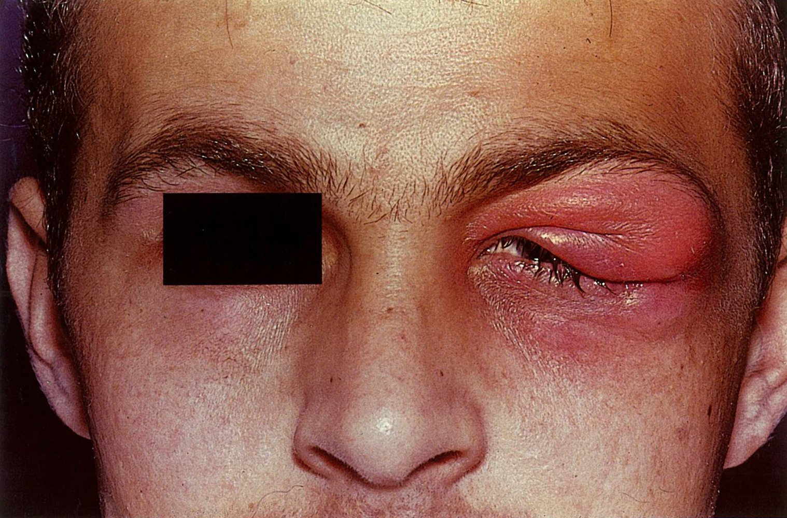

# Diseases of the lacrimal apparatus

*Categories: Clinical knowledge > Pediatrics > Hereditary malformations > Diseases of the lacrimal apparatus*

[Original Article Link](https://coursology-qbank.com/amboss/article/5O0iGT)

---

## Summary

<u>Dacryostenosis</u> is a congenital or acquired obstruction of the <u>nasolacrimal duct</u> and manifests with <u>epiphora</u>. It is usually <u>diagnosed clinically</u> and confirmed with the <u>fluorescein dye disappearance test</u>. <u>Congenital dacryostenosis</u> is common, typically manifests in <u>neonates</u>, and usually resolves spontaneously within the first year of life; <u>lacrimal sac massage</u> is recommended to promote resolution. <u>Acquired dacryostenosis</u> may be <u>idiopathic</u> or secondary to conditions affecting the <u>nasolacrimal duct</u> (e.g., trauma, inflammation). Treatment includes management of the underlying cause and surgical intervention in selected cases. <u>Dacryostenosis</u> often causes <u>dacryocystitis</u> (<u>inflammation of the lacrimal sac</u>). <u>Dacryocystitis</u> may be acute or chronic and manifests with local <u>erythema</u>, <u>edema</u>, <u>pain</u>, <u>epiphora</u>, and mucopurulent discharge. <u>Dacryoadenitis</u> (inflammation of the <u>lacrimal gland</u>) is commonly <u>idiopathic</u> but can also be caused by infection or autoimmune or inflammatory diseases. It may be acute or chronic, unilateral or bilateral, and manifests with circumscribed swelling and <u>erythema</u> of the <u>lateral</u> upper <u>eyelid</u>. Features may also include a palpable mass, <u>pain</u>, <u>ptosis</u>, and/or mucopurulent discharge. Diagnosis of <u>dacryoadenitis</u> and <u>dacryocystitis</u> is clinical; <u>laboratory studies</u> and imaging may be obtained to evaluate for the underlying cause and to rule out <u>orbital cellulitis</u>. Treatment includes <u>supportive care</u>, <u>antibiotics</u> or antivirals as indicated, and <u>surgery</u> for selected patients. <u>Lacrimal gland tumors</u> are rare; <u>benign tumors</u> generally occur in younger patients, while <u>malignant tumors</u> are more common in patients > 40 years of age. Diagnosis involves imaging and <u>biopsy</u> of the <u>lacrimal gland</u>, and treatment depends on whether the <u>tumor</u> is benign or malignant.

See also "<u>Lacrimal duct laceration</u>."

---

## Dacryostenosis

### Congenital dacryostenosis

#### Background [[1]](https://coursology-qbank.com/amboss/article/yDddSH0)[[2]](https://coursology-qbank.com/amboss/article/wach5a0)

* Definition: congenital obstruction of the <u>nasolacrimal duct</u>

* <u>Incidence</u>: occurs in 5–20% of children

Congenital dacryostenosis (valve of Hasner)

#### Clinical features [[1]](https://coursology-qbank.com/amboss/article/yDddSH0)[[2]](https://coursology-qbank.com/amboss/article/wach5a0)

Symptoms typically manifest within the first month of life.

* <u>Epiphora</u>: excessive watery or mucopurulent secretions

* Possible debris on the <u>eyelid</u> and <u>conjunctival</u> irritation

* Usually unilateral but may be bilateral

#### Diagnosis [[1]](https://coursology-qbank.com/amboss/article/yDddSH0)[[2]](https://coursology-qbank.com/amboss/article/wach5a0)

<u>Congenital dacryostenosis</u> is <u>diagnosed clinically</u>.

* <u>Fluorescein dye disappearance test</u>: <u>confirmatory test</u>

* Instill 1% fluorescein into the <u>conjunctival</u> sac.

* The presence of fluorescein under blue light after ≥ 5 minutes indicates <u>dacryostenosis</u>.

* Compression of the <u>lacrimal sac</u>

* Compress the <u>lacrimal sac</u> against its <u>medial</u> border.

* Expression of mucopurulent secretions indicates likely obstruction in or <u>distal</u> to the <u>lacrimal sac</u>.

#### Treatment [[1]](https://coursology-qbank.com/amboss/article/yDddSH0)[[2]](https://coursology-qbank.com/amboss/article/wach5a0)

##### General principles

* <u>Congenital dacryostenosis</u> usually resolves spontaneously within the first year of life.

* Initial management consists of measures to promote spontaneous resolution.

* Invasive management is reserved for selected patients.

> [!WARNING]
> Refer patients with recurrent infections, <u>amblyopia</u>, or nonresolving <u>dacryostenosis</u> to ophthalmology.

##### Initial management

* Lacrimal sac massage: Apply gentle downward pressure below the <u>medial</u> <u>canthus</u> of the <u>eye</u> 3–4 times a day.

* Regular cleaning of the eyelids and warm compresses

* <u>Antibiotics</u> are not indicated unless there is evidence of infection.

Lacrimal sac massage (Crigler massage)

##### Invasive management

* Indications

* Initial management is unsuccessful

* Complications: e.g., recurrent infections, chronic <u>dacryocystitis</u>, <u>amblyopia</u>

* Procedures

* Nasolacrimal duct irrigation and probing

* Endoscopic and/or balloon dilatation of the <u>nasolacrimal duct</u>

* Dacryocystorhinostomy: surgical connection between the <u>lacrimal sac</u> and nasal cavity

### Acquired dacryostenosis [[1]](https://coursology-qbank.com/amboss/article/yDddSH0)[[3]](https://coursology-qbank.com/amboss/article/pBdLbs0)

* Etiology

* Primary <u>acquired dacryostenosis</u>: <u>idiopathic</u>

* Secondary <u>acquired dacryostenosis</u>

* Concretions in the <u>nasolacrimal duct</u>

* Inflammatory conditions: e.g., <u>granulomatous diseases</u>

* Scarring: e.g., secondary to viral infection or radiation

* Trauma

* Space-occupying lesions: e.g., tumors, <u>encephalocele</u>, <u>mucocele</u>

* Nasal abnormalities: e.g., <u>nasal septum deviation</u>, <u>rhinitis</u>

* Clinical features and diagnostics: similar to those of <u>congenital dacryostenosis</u>

* Treatment: often requires surgical intervention in addition to treatment of the underlying cause

---

## Dacryocystitis

### Acute <u>dacryocystitis</u>

#### Background [[4]](https://coursology-qbank.com/amboss/article/fsak8N)

* Definition: acute <u>inflammation of the lacrimal sac</u>

* <u>Epidemiology</u>: most commonly occurs in women and young <u>infants</u>

* Etiology: usually a staphylococcal or <u>streptococcal</u> infection in individuals with underlying <u>dacryostenosis</u>

* Pathophysiology: <u>dacryostenosis</u> → retention of tears and detritus in the <u>lacrimal sac</u> → bacterial overgrowth, causing infection

#### Clinical features [[4]](https://coursology-qbank.com/amboss/article/fsak8N)[[5]](https://coursology-qbank.com/amboss/article/zBdrWs0)[[6]](https://coursology-qbank.com/amboss/article/oBW0bL0)

* <u>Erythema</u>, <u>edema</u>, warmth, and <u>pain</u> below the <u>medial</u> <u>canthus</u>

* <u>Epiphora</u>

* Mucopurulent discharge

> [!TIP]
> In <u>dacryocystitis</u>, applying pressure over the <u>lacrimal sac</u> typically elicits <u>pain</u> and <u>purulent</u> discharge from the <u>lacrimal punctum</u>.

Dacryocystitis

#### Diagnostics [[4]](https://coursology-qbank.com/amboss/article/fsak8N)[[5]](https://coursology-qbank.com/amboss/article/zBdrWs0)[[6]](https://coursology-qbank.com/amboss/article/oBW0bL0)

<u>Dacryocystitis</u> is a <u>clinical diagnosis</u>.

* All patients: Culture and <u>Gram stain</u> secreted or expressed ocular discharge or aspirated fluid from the <u>lacrimal sac</u>.

* Further studies

* <u>Blood cultures</u>: indicated in children, <u>immunocompromised individuals</u>, and patients with <u>signs of sepsis</u>

* Additional <u>sepsis diagnostics</u> as indicated

* Imaging: Consider if <u>red flags for orbital cellulitis</u> are present or if an <u>abscess</u> or <u>sinusitis</u> is suspected.

* CT <u>orbits</u> and sinuses with contrast

* <u>MRI</u>: Consider in children to avoid radiation exposure.

#### Treatment [[4]](https://coursology-qbank.com/amboss/article/fsak8N)[[5]](https://coursology-qbank.com/amboss/article/zBdrWs0)[[6]](https://coursology-qbank.com/amboss/article/oBW0bL0) [[7]](https://coursology-qbank.com/amboss/article/ThV6W80)

* Mild infection in adults and children > 12 months of age

* Initiate oral <u>empiric antibiotic therapy</u>: similar to oral <u>antibiotics</u> for <u>preseptal cellulitis</u>.

* Consider concurrent topical <u>antibiotic therapy</u>: e.g., <u>tobramycin</u>. DOSAGE [[4]](https://coursology-qbank.com/amboss/article/fsak8N)

* Recommend supportive therapy, i.e., <u>analgesics</u>, warm compresses, <u>lacrimal duct massage</u>.

* Refer for ophthalmology follow-up within 3 days.

* Surgical intervention for <u>dacryostenosis</u> is often pursued after resolution of the acute infection.

* <u>Infants</u> and/or severe infection (e.g., <u>sepsis</u>, orbital involvement)

* Obtain ophthalmology consult.

* Consider <u>incision and drainage</u> if an <u>abscess</u> is present.

* Initiate IV <u>empiric antibiotic therapy</u>: similar to IV <u>antibiotics</u> for <u>orbital cellulitis</u>.

* Consider concurrent topical <u>antibiotic therapy</u> with ophthalmology guidance.

* Admit for inpatient monitoring.

* Surgical intervention for <u>dacryostenosis</u> is often pursued for <u>respiratory distress</u> or if there is no improvement within 24–48 hours.

> [!WARNING]
> Consider <u>empiric antibiotic</u> coverage for <u>MRSA</u> in aggressive or atypical infections or if <u>risk factors for MRSA</u> are present; follow local protocols and expert advice. [[4]](https://coursology-qbank.com/amboss/article/fsak8N) [[8]](https://coursology-qbank.com/amboss/article/MhVMe80)

#### Complications [[5]](https://coursology-qbank.com/amboss/article/zBdrWs0)[[6]](https://coursology-qbank.com/amboss/article/oBW0bL0)

* <u>Abscess</u> of the <u>lacrimal sac</u>

* Local extension: <u>preseptal cellulitis</u>, <u>orbital cellulitis</u>, <u>meningitis</u>

* <u>Thrombosis</u>: superior <u>ophthalmic vein</u> <u>thrombosis</u>, <u>cavernous sinus thrombosis</u>

* Dacryocutaneous <u>fistula</u>

* Chronic <u>dacryocystitis</u>

Lacrimal abscess in dacryocystitis

Lacrimal abscess in dacryocystitis

### Chronic <u>dacryocystitis</u> [[4]](https://coursology-qbank.com/amboss/article/fsak8N)

#### Background [[4]](https://coursology-qbank.com/amboss/article/fsak8N)

* Definition: chronic <u>inflammation of the lacrimal sac</u>

* Etiology: bacterial infection, e.g., with <u>Staphylococcus aureus</u>, <u>Streptococcus pneumoniae</u>, <u>Haemophilus influenzae</u>, <u>Pseudomonas aeruginosa</u> [[4]](https://coursology-qbank.com/amboss/article/fsak8N)

* Pathophysiology: congenital/<u>acquired dacryostenosis</u> → stasis of tears → secondary bacterial infection → <u>lacrimal sac</u> inflammation

#### Clinical features [[4]](https://coursology-qbank.com/amboss/article/fsak8N)

* Persistent <u>epiphora</u>

* Mucopurulent discharge from the punctum

* No <u>signs of acute inflammation</u>; no <u>fever</u>

Dacryocystitis

#### Diagnostics

* <u>Clinical diagnosis</u>

* Culture of the discharge

#### Treatment

* <u>Antibiotics</u> (culture-specific)

* <u>Dacryocystorhinostomy</u> (to prevent recurrence)

* Children < 12 months of age with chronic <u>dacryocystitis</u>: See “Treatment” in "<u>Congenital dacryostenosis</u>."

#### Complications

* Chronic <u>conjunctivitis</u>

* Dacryocystocele formation

---

## Dacryoadenitis

### Acute dacryoadenitis

#### Background [[9]](https://coursology-qbank.com/amboss/article/nDd7UH0)[[10]](https://coursology-qbank.com/amboss/article/LDdwUH0)[[11]](https://coursology-qbank.com/amboss/article/8xdOyH0)

* Definition: <u>acute inflammation</u> of the <u>lacrimal gland</u>

* <u>Epidemiology</u>

* Noninfectious <u>dacryoadenitis</u> (common): Most often seen in adults; <u>♀</u>> <u>♂</u>

* Infectious <u>dacryoadenitis</u> (rare): More common in children and young adults

* Etiology

* <u>Idiopathic</u> (common)

* Autoimmune or inflammatory disease (common): e.g., <u>sarcoidosis</u>, <u>granulomatosis with polyangiitis</u>, <u>IgG4-related disease</u>

* Infection (rare), e.g.:

* Viral: <u>EBV</u>, <u>mumps</u>, <u>VZV</u>, <u>HSV</u>

* Bacterial: <u>Staphylococcus aureus</u>, <u>Streptococcus</u> spp., <u>Gonococcus</u> spp.

#### Clinical features [[9]](https://coursology-qbank.com/amboss/article/nDd7UH0)[[10]](https://coursology-qbank.com/amboss/article/LDdwUH0)

<u>Dacryoadenitis</u> manifests with circumscribed swelling and <u>erythema</u> of the <u>lateral</u> upper <u>eyelid</u>; a palpable mass may be present.

* Noninfectious <u>dacryoadenitis</u>: 

* Often bilateral

* Onset and degree of <u>pain</u> vary

* Inflammatory signs (e.g., <u>fever</u>) typically absent

* Infectious <u>dacryoadenitis</u>: acute onset and painful

* Viral

* May be unilateral

* Nonpurulent

* <u>Fever</u> and <u>lymphadenopathy</u>

* Bacterial

* Typically unilateral

* <u>Purulent</u> conjuctival discharge

* <u>Fever</u> (uncommon)

> [!WARNING]
> Acute unilateral painful <u>dacryoadenitis</u> with <u>purulent</u> discharge suggests a bacterial cause. Consider a lacrimal duct <u>abscess</u> if <u>fever</u> is also present. [[9]](https://coursology-qbank.com/amboss/article/nDd7UH0)

Acute dacryoadenitis

#### Diagnosis [[9]](https://coursology-qbank.com/amboss/article/nDd7UH0)[[10]](https://coursology-qbank.com/amboss/article/LDdwUH0)[[11]](https://coursology-qbank.com/amboss/article/8xdOyH0)[[12]](https://coursology-qbank.com/amboss/article/AN1Rdh0)

<u>Dacryoadenitis</u> is a <u>clinical diagnosis</u>.

* All patients: Culture ocular discharge if present.

* Further studies

* <u>Laboratory studies</u>: Consider based on clinical suspicion. 

* <u>Inflammatory markers</u>: e.g., <u>WBC count</u>, <u>CRP</u>

* <u>Serology</u>: e.g., <u>EBV serology</u>, <u>antineutrophil cytoplasmic antibodies</u>

* Imaging: in patients with <u>red flags for orbital cellulitis</u> or a suspected <u>lacrimal gland</u> <u>abscess</u>

* CT <u>orbits</u> and sinuses with contrast

* <u>MRI</u>: Consider in children to avoid radiation exposure.

* <u>Lacrimal gland</u> <u>biopsy</u>: Consider in consultation with an ophthalmologist.

* Often required to identify the cause

* Usually performed transcutaneously

> [!WARNING]
> Consider <u>sepsis diagnostics</u> and orbital imaging in patients with <u>red flags for orbital cellulitis</u>.

#### Treatment [[9]](https://coursology-qbank.com/amboss/article/nDd7UH0)[[10]](https://coursology-qbank.com/amboss/article/LDdwUH0)[[12]](https://coursology-qbank.com/amboss/article/AN1Rdh0)

Treatment of <u>acute dacryoadenitis</u> depends on the underlying cause.

* All patients: <u>supportive care</u>(e.g., <u>analgesics</u>, warm compresses)

* Viral <u>dacryoadenitis</u>

* Most cases are <u>self-limited</u> and resolve within 4–6 weeks.

* <u>Antiviral therapy</u> may be indicated for specific causes (e.g., <u>antiviral therapy for VZV</u>)

* Bacterial <u>dacryoadenitis</u> [[7]](https://coursology-qbank.com/amboss/article/ThV6W80)

* Consult ophthalmology for <u>incision and drainage</u> if an <u>abscess</u> is suspected.

* Start <u>empiric antibiotic therapy</u>.

* Mild disease: similar to oral <u>antibiotics</u> for <u>preseptal cellulitis</u>

* Moderate or severe disease (e.g., <u>sepsis</u>): similar to IV <u>antibiotics</u> for <u>orbital cellulitis</u>

* Consider early <u>MRSA</u> coverage (e.g., IV <u>vancomycin</u>), especially in patients with <u>skin</u> wounds and those without <u>sinusitis</u> or preceding <u>upper respiratory tract infection</u>. [[10]](https://coursology-qbank.com/amboss/article/LDdwUH0)

* Transition to <u>targeted antibiotic therapy</u> based on culture results.

* Noninfectious <u>dacryoadenitis</u>

* Consult ophthalmology to guide treatment.

* Options include:

* <u>Immunosuppressive therapy</u>: e.g., local or <u>systemic corticosteroids</u>

* <u>Debulking</u> or excisional <u>surgery</u>

* <u>Radiotherapy</u>

> [!WARNING]
> If the etiology is unclear, consider starting <u>empiric antibiotic therapy</u> with close monitoring to assess for a response.

#### Disposition [[12]](https://coursology-qbank.com/amboss/article/AN1Rdh0)

* Patients with mild <u>dacryoadenitis</u> may be discharged with outpatient ophthalmology follow-up.

* Consider admission for patients who lack social support or those with moderate or severe disease.

### Chronic dacryoadenitis

#### Background

* Definition: <u>chronic inflammation</u> of the <u>lacrimal gland</u>

* Etiology

* Inflammatory or granulomatous conditions (most common): e.g., <u>sarcoidosis</u>, <u>granulomatosis with polyangiitis</u>

* Autoimmune conditions: e.g., <u>Graves disease</u>, <u>Sjogren syndrome</u>

* <u>Neoplastic</u>: e.g., <u>lacrimal gland</u> <u>tumor</u>, <u>lymphomas</u>

* Chronic infections, e.g., fungal, <u>mycobacterial</u> (less common)

#### Clinical features

* Can be unilateral or bilateral

* Insidious onset with painless swelling over the <u>lacrimal gland</u>

* S-shaped <u>ptosis</u>; <u>proptosis</u> rare

* Features of underlying disease may be present (see “Etiology” above).

#### Diagnosis

* <u>Eye</u> swabs: in patients with ocular discharge

* Screening for chronic infections (e.g., <u>tuberculosis</u>, <u>Chlamydia trachomatis</u>, <u>gonorrhea</u>)

* <u>CT scan</u>: to rule out a malignant etiology

* Fine needle/<u>incisional biopsy</u> of the <u>lacrimal gland</u>: indicated only if imaging/blood tests are inconclusive

* Investigations based on the suspected etiology

#### Treatment

* <u>Supportive care</u>

* Treatment of the underlying disease

---