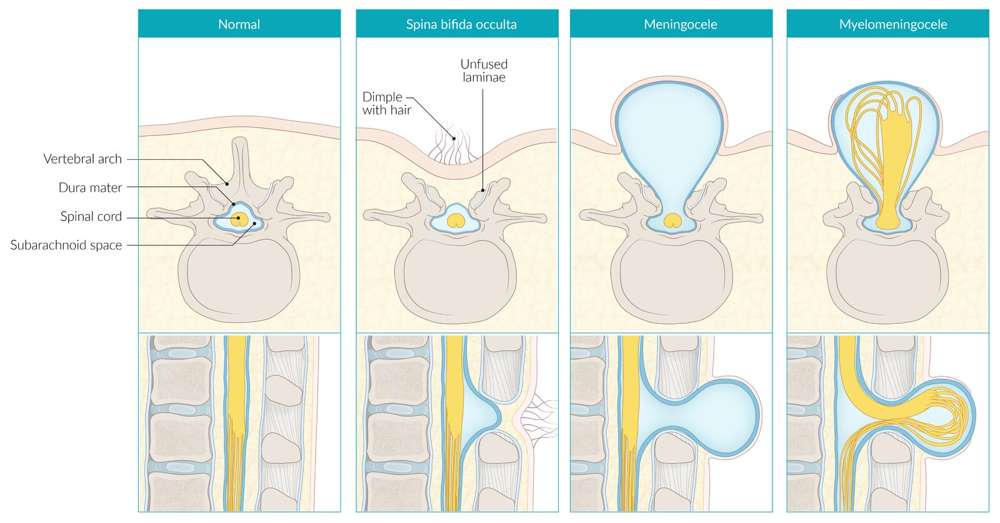
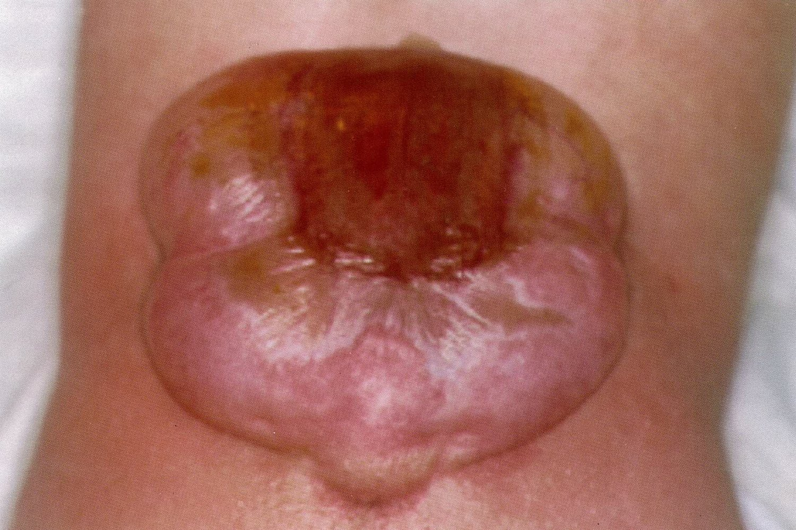
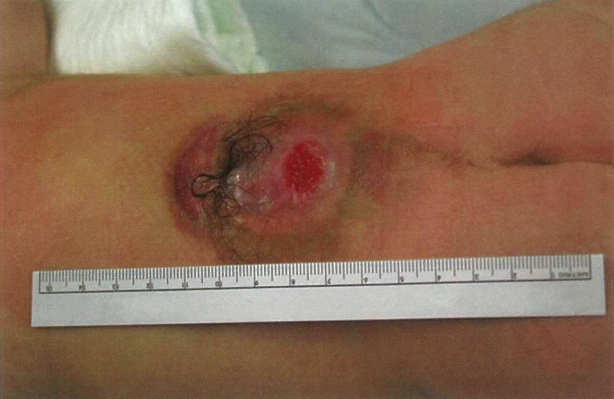
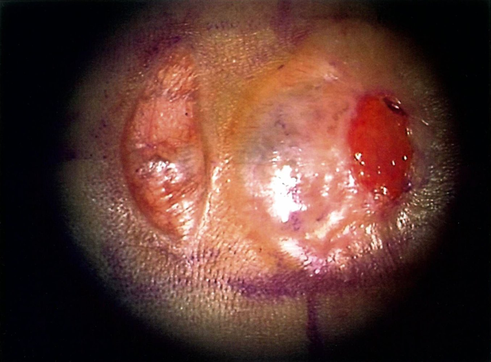
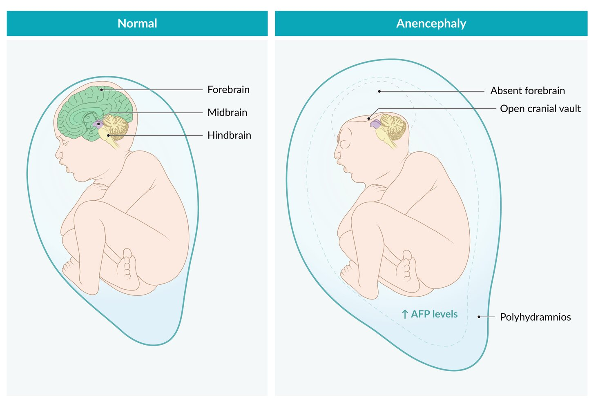
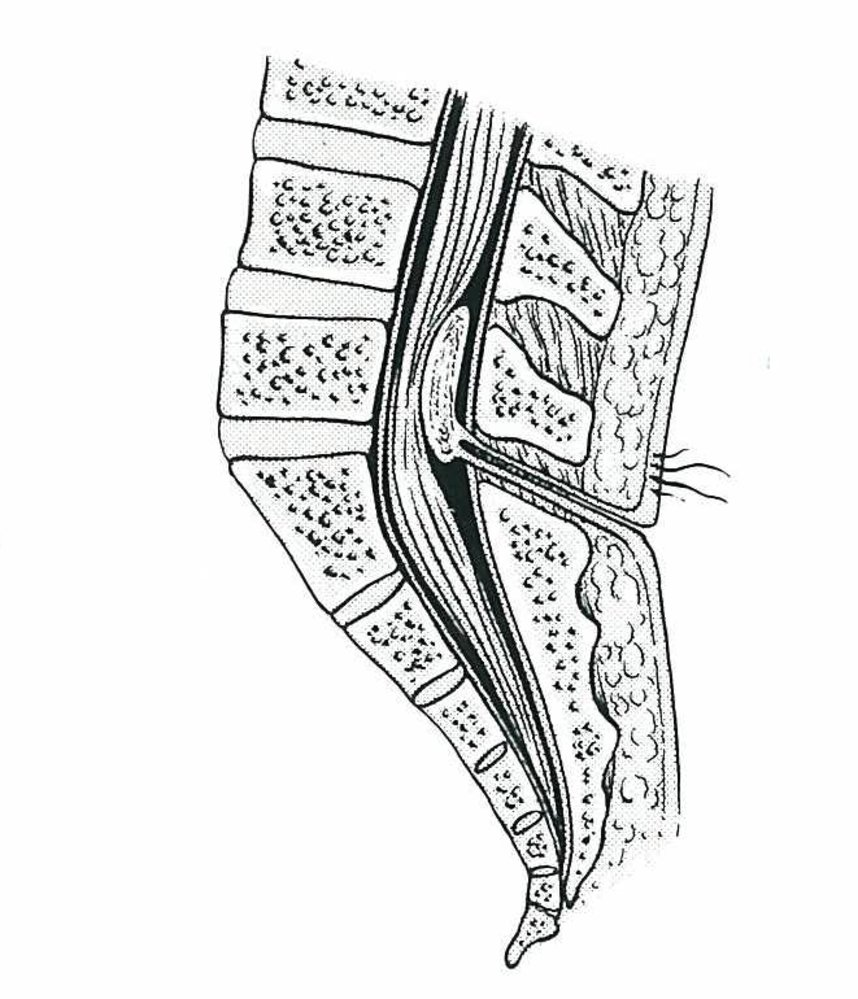

# Neural tube defects

*Categories: Clinical knowledge > Pediatrics > Hereditary malformations > Neural tube defects*

[Original Article Link](https://coursology-qbank.com/amboss/article/el0xDT)

---

## Summary

<u>Neural tube</u> defects (NTDs) are the most common congenital <u>malformations</u> of the <u>central nervous system</u> (<u>CNS</u>). They develop between the 3rd and 4th weeks of <u>pregnancy</u> and are often caused by <u>folate deficiency</u>. Most commonly, a deficiency in <u>folate</u> results in improper closure of the <u>neural tube</u> in the embryo, mainly at the <u>caudal</u> or <u>cranial</u> ends. The formation of defects at the <u>caudal</u> end is more common and is known as <u>spina bifida</u>. <u>Spina bifida</u> may occur without any apparent clinical features (<u>spina bifida occulta</u>) or manifest with protrusion of the <u>meninges</u> and, potentially, the spinal cord (<u>myelomeningocele</u>) through a gap in the <u>vertebrae</u>. <u>Myelomeningoceles</u> predominantly cause symptoms of sensory and <u>motor function</u> loss, such as <u>bladder</u> dysfunction and <u>paraplegia</u>. NTDs at the <u>cranial</u> end can cause <u>cranial</u> <u>fissure</u> <u>malformations</u>; the most severe manifestation of this, <u>anencephaly</u>, is incompatible with life. The diagnosis of NTDs is often established during <u>pregnancy</u> via <u>ultrasound</u> and detection of elevated <u>alpha-fetoprotein</u> levels in the maternal serum or <u>amniotic fluid</u>. Treatment involves prophylactic administration of <u>antibiotics</u> and rapid surgical closure of the defect to avoid <u>CNS</u> infections. Supplementation with <u>folic acid</u> is an important preventative measure; because of the high rate of <u>unplanned pregnancies</u>, daily <u>folic acid</u> is recommended for all individuals capable of <u>pregnancy</u>. For individuals with a personal, family, or partner history of NTD, a higher <u>folic acid</u> dose is recommended.

---

## Definitions

* <u>Neural tube</u> defects (NTDs) are congenital <u>malformations</u> of the <u>central nervous system</u> (<u>CNS</u>), <u>spine</u>, and <u>cranium</u>.

* NTDs are caused by incomplete closure of the <u>neural tube</u> during <u>neurulation</u>, which takes place during the 3rd and 4th weeks after <u>conception</u>.

* <u>Cranial</u> defects: incomplete closure of <u>anterior neuropores</u> → <u>cranial</u> cleft formation (mostly open defects) with involvement of the <u>skull</u> and <u>brain</u>

* Spinal defects: incomplete closure of <u>posterior neuropores</u> → bone defects of the <u>vertebral arches</u> (mostly lower lumbar or sacral region ) → possible <u>herniation</u> of spinal neural tissue and <u>meninges</u>

* NTDs can be classified according to affected structure and degree to which the defect is covered by tissue.

* Open NTDs: <u>Meninges</u> and/or neural tissue are uncovered  and, therefore, exposed to the surroundings (e.g., <u>amniotic fluid</u>).  [[1]](https://coursology-qbank.com/amboss/article/wsbhCE)

* Closed NTDs: Defect is covered by <u>skin</u> and/or <u>connective tissue</u>.

---

## Epidemiology

* NTDs are among the most common severe congenital <u>malformations</u>.  [[2]](https://coursology-qbank.com/amboss/article/oCY0Gr)

* <u>Spina bifida</u> and <u>anencephaly</u> are the most frequent NTDs, with a combined <u>incidence</u> of approx. 6.5:10,000 <u>live births</u> per year in the US. [[3]](https://coursology-qbank.com/amboss/article/46Y3OJ)

Epidemiological data refers to the US, unless otherwise specified.

---

## Etiology

Most NTDs are isolated <u>malformations</u> with multifactorial etiology; they are more likely to occur when <u>risk factors</u> are present.

### <u>Risk factors for neural tube defects</u> [[4]](https://coursology-qbank.com/amboss/article/5G1i-R0)[[5]](https://coursology-qbank.com/amboss/article/okd0KJ0)

* <u>Folate deficiency</u> during <u>pregnancy</u> due to: 

* Insufficient <u>folic acid supplementation in pregnancy</u>

* Drugs that interfere with folate metabolism

* <u>Methotrexate</u>

* <u>Anticonvulsants</u>: <u>valproate</u>, <u>carbamazepine</u>

* <u>Sulfonamides</u>, <u>trimethoprim</u>

* <u>Pregestational diabetes mellitus</u>

* <u>Obesity</u>

* <u>Fever</u>/<u>hyperthermia</u> during the <u>first trimester</u>

* Personal, family, or partner history of NTD

### Fetal causes

* <u>Chromosomal aberrations</u> (e.g., <u>trisomy 13</u>, <u>trisomy 18</u>) and other genetic factors

* <u>Amniotic band syndrome</u>

* <u>Chiari II malformation</u>

---

## Overview

|  Spinal defects (subtypes of spina bifida) [[6]](https://coursology-qbank.com/amboss/article/TWY6kL)   |  |  |  |  |
| --- | --- | --- | --- | --- |
| Condition |  | Description | Clinical features | Diagnosis |
| Closed spinal dysraphism |  |  |  |  |
| <u>Spina bifida occulta</u> |  |   * Most common closed NTD  * <u>Vertebral</u> bone defect without <u>herniation</u>  * The spinal cord, <u>meninges</u>, and overlying <u>skin</u> remain intact.    |   * Most commonly affects the lower lumbar or sacral region  * Often asymptomatic (may be an incidental finding in imaging)  * Possible symptoms at the level of the <u>vertebral</u> defect:  * Lumbar <u>skin</u> dimple  * Collection of fat  * Patch of <u>hair</u>    |  * Normal <u>AFP</u>   |
| Lipomyelomeningocele |  |  * <u>Myelomeningocele</u> that also contains <u>fat tissue</u> and is covered by <u>skin</u>   |   * Often asymptomatic  * Subcutaneous mass in the lumbar or sacral region  * Possibly <u>skin</u> dimple and/or patch of <u>hair</u>    |  * Normal <u>AFP</u>   |
| Lipomeningocele |  |  * <u>Meningocele</u> that also contains <u>fat tissue</u> and is covered by <u>skin</u>   |  |  |
|  Open spinal dysraphism    |  |  |  |  |
| Meningocele |  |  * <u>Meninges</u> (without neural tissue) herniate through <u>vertebral</u> bone defect.   |   * Most commonly affects the lower lumbar and/or sacral region  * Neurological symptoms vary depending on the location and extent of neuronal damage.  * Motor loss, <u>flaccid paralysis</u> (rare)  * Sensory deficits  * <u>Bladder and bowel dysfunction</u>  * Additional symptoms  * <u>Hydrocephalus</u> (common)  * Associated skeletal <u>malformations</u>, especially of the <u>spine</u> and lower extremities (e.g., <u>club foot</u>, sacral dimpling), <u>joint contractures</u>, <u>back pain</u>  * <u>Developmental delays</u>, cognitive impairment, progressive neurological symptoms    |  * ↑ <u>AFP</u>   |
| Myelomeningocele |  |   * <u>Meninges</u> and parts of the spinal cord herniate through the <u>vertebral</u> bone defect.  * Characteristic feature of <u>Chiari II malformation</u>  * Associated with <u>maternal diabetes</u> and <u>folate deficiency</u>    |  * ↑ <u>AFP</u>   |  |
| Myeloschisis (<u>rachischisis</u>) |  |   * Portions of the <u>neural tube</u> completely fail to fuse, leading to bare, exposed neural tissue without coverage of <u>meninges</u>, bones, or <u>skin</u>.  * Most severe subtype    |  * ↑ <u>AFP</u>   |  |
| Myelocele |  |  * Parts of the spinal cord (without meningeal coverage) herniate through the <u>vertebral</u> bone defect.   |  * ↑ <u>AFP</u>   |  |

Spinal defects

Open spina bifida

Open spina bifida

Open spina bifida

|  <u>Cranial</u> defects [[6]](https://coursology-qbank.com/amboss/article/TWY6kL) |  |  |  |  |
| --- | --- | --- | --- | --- |
| Condition |  | Description | Clinical features | Diagnosis |
|  Anencephaly    |  |  * The <u>rostral neuropore</u> remains open, leading to the absence of the forebrain and an open <u>cranial vault</u>.   |   * <u>Polyhydramnios</u>  * Incompatible with life    |  * ↑ <u>AFP</u>   |
| Encephalocele |  |   * <u>Brain</u> tissue herniates through occipital or <u>frontal bone</u> defect.  * Covered by <u>skin</u>    |   * <u>Malformations</u> and neurological deficits that vary in severity  * Lethal in severe cases    |  * Normal <u>AFP</u> (usually not elevated)   |
| Acrania |  |   * Failure of <u>cranial bones</u> to form  * Often associated with <u>anencephaly</u>    |  * Incompatible with life   |  * ↑ <u>AFP</u>   |

> [!NOTE]
> The most common NTDs are <u>spina bifida</u> and <u>anencephaly</u>.

Anencephaly

---

## Diagnosis

### Prenatal period [[1]](https://coursology-qbank.com/amboss/article/wsbhCE)

* <u>Screening test</u> (16–18 weeks' <u>gestation</u>): ↑ <u>AFP</u> in maternal serum (<u>MSAFP</u>) 

* <u>MSAFP</u> is only elevated in open NTDs.

* <u>MSAFP</u> is not elevated in <u>spina bifida occulta</u>.

* Usually part of the <u>quad screen test</u>

* <u>Ultrasonography</u> (18–20 weeks' <u>gestation</u>) 

* Characteristic findings depend on the specific defect. 
* Findings in <u>anencephaly</u>

* <u>Cranial vault</u> and <u>brain</u> tissue are absent.

* Residual, disorganized <u>cerebellar</u> and/or <u>brainstem</u> tissue may be present.

* Bulging eyes and underdeveloped forehead

* Associated with <u>polyhydramnios</u>

* Screen for <u>malformations</u> of other structures (e.g., <u>abdominal wall defects</u>).

* Rule out other causes of elevated <u>MSAFP</u> (e.g., miscalculated <u>gestational age</u>, <u>multiple gestations</u>, fetal <u>death</u>).

* <u>Amniocentesis</u>: ↑ <u>AFP</u> and ↑ <u>AChE</u> in <u>amniotic fluid</u> (increase in open NTDs only)

* Used as confirmation test when <u>MSAFP</u> is elevated but <u>ultrasound</u> findings are inconclusive

* When both <u>AFP</u> and <u>AChE</u> are elevated, an open NTD is very likely.

* <u>Amniocentesis</u> may also be used to test for <u>chromosomal abnormalities</u> associated with NTDs (e.g., <u>trisomy 13</u>, <u>trisomy 18</u>).

> [!TIP]
> <u>AFP</u> is only elevated in open NTDs.

### Postnatal period [[1]](https://coursology-qbank.com/amboss/article/wsbhCE)

* Complete <u>physical examination</u>

* Lumbar <u>skin</u> dimple or tuft of <u>hair</u> (often seen in <u>spina bifida occulta</u>)

* Associated <u>malformations</u> (e.g., <u>abdominal wall defects</u>)

* Extent of neurological deficits (e.g., <u>muscle weakness</u>, <u>spasticity</u>, abnormal reflexes)

* <u>Signs of elevated intracranial pressure</u> (e.g., bulging <u>fontanelle</u>)

* Imaging

* <u>Cranial</u> <u>ultrasonography</u>: to monitor <u>hydrocephalus</u>

* <u>CT scans</u> and/or <u>MRI</u> 

* Monitor <u>hydrocephalus</u>

* Evaluate bone defects and/or neural tissue lesion (imaging is especially important to plan <u>surgery</u>).

---

## Differential diagnoses

### Tethered cord syndrome [[7]](https://coursology-qbank.com/amboss/article/gWYFkL)[[8]](https://coursology-qbank.com/amboss/article/TxY6Dr)

* Definition: a <u>functional neurological disorder</u> caused by abnormal stretching of the spinal cord as a result of adhesions or obstructions attaching the <u>caudal</u> spinal cord to the <u>spinal canal</u>

* Etiology

* <u>Myelomeningocele</u>/lipomyelomeningocele (most common cause)

* <u>Lipoma</u>, <u>dermoid cysts</u>

* Meningeal adhesions (e.g., after <u>surgery</u> for <u>myelomeningocele</u> or spinal trauma)

* Adhesion or thickening of the <u>filum terminale</u>

* <u>Tumor</u>

* Clinical features

* <u>Lower back pain</u> (aggravated by <u>flexion</u> of lower <u>spine</u>)

* Sensory and motor deficits of the lower limbs (e.g., <u>muscle weakness</u>, <u>spasticity</u>, abnormal reflexes)

* <u>Bladder</u> and/or bowel dysfunction

* Skeletal <u>malformations</u> (e.g., <u>foot deformities</u>, <u>scoliosis</u>)

* Visible tumors or <u>skin</u> lesions on lower back (e.g., discoloration, hairy patch, dimple, <u>lipoma</u>)

* Diagnostics: <u>MRI</u> may show abnormally low position of the <u>conus medullaris</u>, thickening of the <u>filum terminale</u>, meningeal adhesions, <u>lipomas</u>, <u>dermoid</u>, cysts, or tumors.

* Treatment: removal of structure tethering the spinal cord (e.g., adhesiolysis, resection of <u>lipoma</u>)

### Congenital dermal sinus

* Definition: : mostly lumbar or lumbosacral <u>fistulae</u> that extend from the surface of the <u>skin</u> to the <u>spinal canal</u> and frequently end in a <u>dermoid</u> or <u>epidermoid cyst</u>

* Etiology: incomplete or lack of separation of the <u>neural ectoderm</u> from the <u>dermal</u> <u>ectoderm</u>

* Clinical features

* Visible ostium, dimple, possible <u>hyperpigmentation</u> of the <u>skin</u>, and <u>hypertrichosis</u>

* May manifest with clinical features of <u>tethered cord syndrome</u> (see above)

* Complications: intradural infections (recurrent <u>meningitis</u>, <u>abscesses</u>)

* Treatment: neurosurgical exploration and potential resection of the <u>dermoid</u> or <u>epidermoid cysts</u>

Dermal sinus

The differential diagnoses listed here are not exhaustive.

---

## Treatment

* Prenatal

* After counseling, patients should be referred to specialized clinics for continuation or termination of the <u>pregnancy</u>.

* <u>Myelomeningocele</u>: Fetal <u>surgery</u> may be indicated based on fetal and maternal <u>risk factors</u>.

* Delivery

* Should take place in a specialized center (providing <u>neonatal ICU</u> and pediatric neurosurgery)

* <u>Birth</u> mode: usually <u>cesarean delivery</u> (prelabor)  [[9]](https://coursology-qbank.com/amboss/article/YlXnvy)[[10]](https://coursology-qbank.com/amboss/article/blXHvy)

* Postnatal

* General management

* Cover defect with sterile, wet compresses (avoid pressure on defect).

* Prophylactic administration of <u>broad-spectrum antibiotics</u>

* Surgical treatment

* Open NTDs: <u>Surgery</u> should be performed within 72 hours after delivery (to reduce the risk of <u>CNS</u> infection).

* Closed NTDs: monitoring and possibly elective <u>surgery</u>

* <u>Hydrocephalus</u>: Consider placement of a <u>ventriculoperitoneal shunt</u>.

* Long-term care

* Complex treatment

* May involve <u>physical therapy</u>, <u>rehabilitation</u> programs, and specific treatment of neurological disorders (e.g., <u>neurogenic bladder dysfunction</u>)

---

## Prevention

Counseling on modifiable <u>risk factors for NTD</u> and folic acid supplementation is a routine part of <u>preconception care</u> and <u>prenatal care</u>.

### Management of modifiable <u>risk factors for NTD</u>

* Optimize management of underlying conditions, e.g.:

* <u>Management of obesity</u>

* <u>Management of diabetes</u>

* Reduce the dose, stop, and/or avoid prescribing <u>drugs that interfere with folate metabolism</u>.

* See also “<u>Epilepsy in pregnancy</u>.”

* See also “<u>Pharmacotherapy during pregnancy</u>.”

* Reduce the risk of <u>hyperthermia</u>.

* Limit use of saunas and hot tubs in <u>pregnancy</u>.  [[4]](https://coursology-qbank.com/amboss/article/5G1i-R0)[[11]](https://coursology-qbank.com/amboss/article/lF1vRi0)

* Take precautions against <u>febrile</u> illnesses.

### Folic acid supplementation in pregnancy [[4]](https://coursology-qbank.com/amboss/article/5G1i-R0)[[5]](https://coursology-qbank.com/amboss/article/okd0KJ0)[[12]](https://coursology-qbank.com/amboss/article/CLdq-q0)

Folic acid supplementation reduces the risk of <u>neural tube</u> defects. [[4]](https://coursology-qbank.com/amboss/article/5G1i-R0)

#### Standard prevention [[5]](https://coursology-qbank.com/amboss/article/okd0KJ0)[[12]](https://coursology-qbank.com/amboss/article/CLdq-q0)[[13]](https://coursology-qbank.com/amboss/article/uF1pPi0)

* Recommended for all individuals capable of <u>pregnancy</u>

* Advise oral <u>folic acid</u> 0.4–0.8 mg once daily, continued until 12 weeks' <u>gestation</u>. [[5]](https://coursology-qbank.com/amboss/article/okd0KJ0)[[12]](https://coursology-qbank.com/amboss/article/CLdq-q0)[[13]](https://coursology-qbank.com/amboss/article/uF1pPi0)

* For individuals planning <u>pregnancy</u> who are not already taking <u>folic acid</u>, recommend starting ≥ 4 weeks before trying to conceive. [[4]](https://coursology-qbank.com/amboss/article/5G1i-R0)

> [!TIP]
> Because of the high rate of <u>unplanned pregnancies</u>, the <u>USPSTF</u> recommends that all individuals capable of <u>pregnancy</u> take a <u>folic acid</u> supplement. [[5]](https://coursology-qbank.com/amboss/article/okd0KJ0)

> [!WARNING]
> Checking serum <u>vitamin B12</u> levels to rule out an undiagnosed <u>vitamin B12 deficiency</u> <u>anemia</u> is not required before starting <u>folic acid supplementation</u>. [[14]](https://coursology-qbank.com/amboss/article/HLdK_q0)

#### Prevention for high-risk individuals [[4]](https://coursology-qbank.com/amboss/article/5G1i-R0)[[14]](https://coursology-qbank.com/amboss/article/HLdK_q0)

* Individuals with any of the following have an increased risk of <u>pregnancy</u> affected by NTD:

* Previous <u>pregnancy</u> with NTD from either the birthing parent or partner

* Partner history of NTD

* Personal history of NTD

* A standard dose of oral <u>folic acid</u> (0.4–0.8 mg PO daily) is recommended throughout reproductive life. [[12]](https://coursology-qbank.com/amboss/article/CLdq-q0)

* A high dose of oral <u>folic acid</u> (4 mg daily) is recommended from 3 months before <u>conception</u> until 12 weeks' <u>gestation</u>. [[4]](https://coursology-qbank.com/amboss/article/5G1i-R0)[[14]](https://coursology-qbank.com/amboss/article/HLdK_q0)

> [!TIP]
> There is limited evidence for the <u>efficacy</u> of reducing NTDs with higher doses of <u>folic acid</u> in individuals with <u>diabetes</u>, maternal <u>obesity</u>, genetic disorders, and <u>epilepsy</u> (including individuals on <u>antiepileptics</u>). [[4]](https://coursology-qbank.com/amboss/article/5G1i-R0)

---