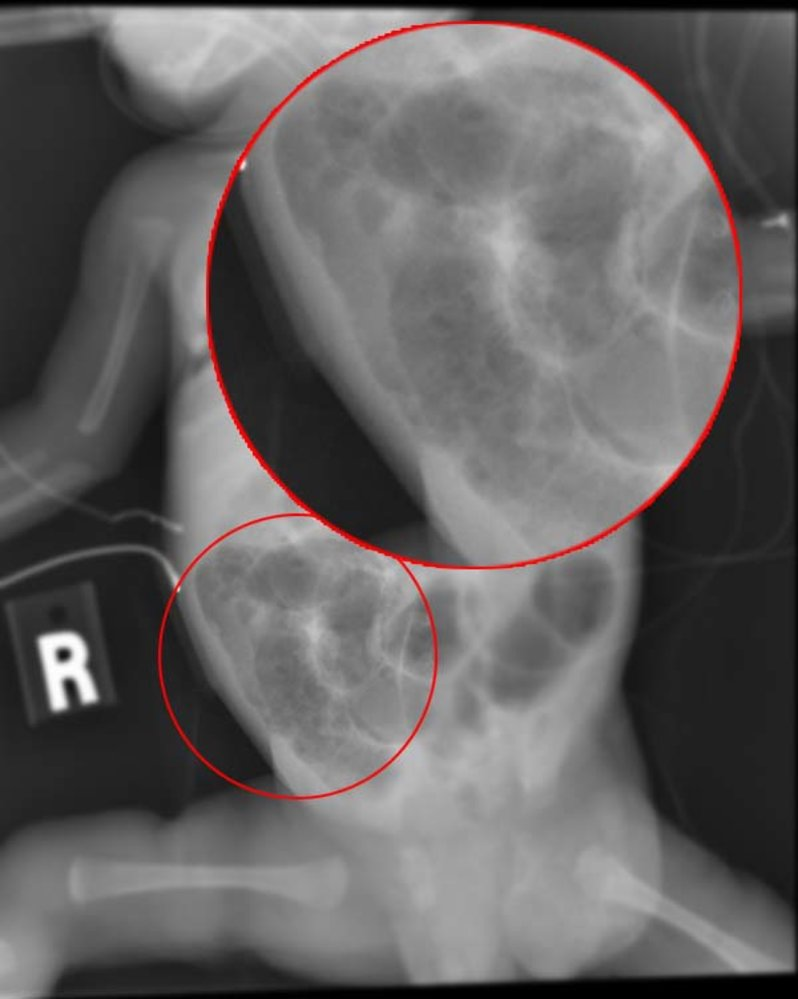
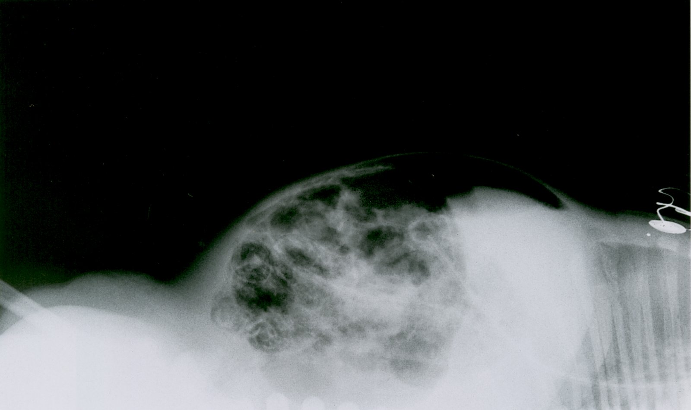
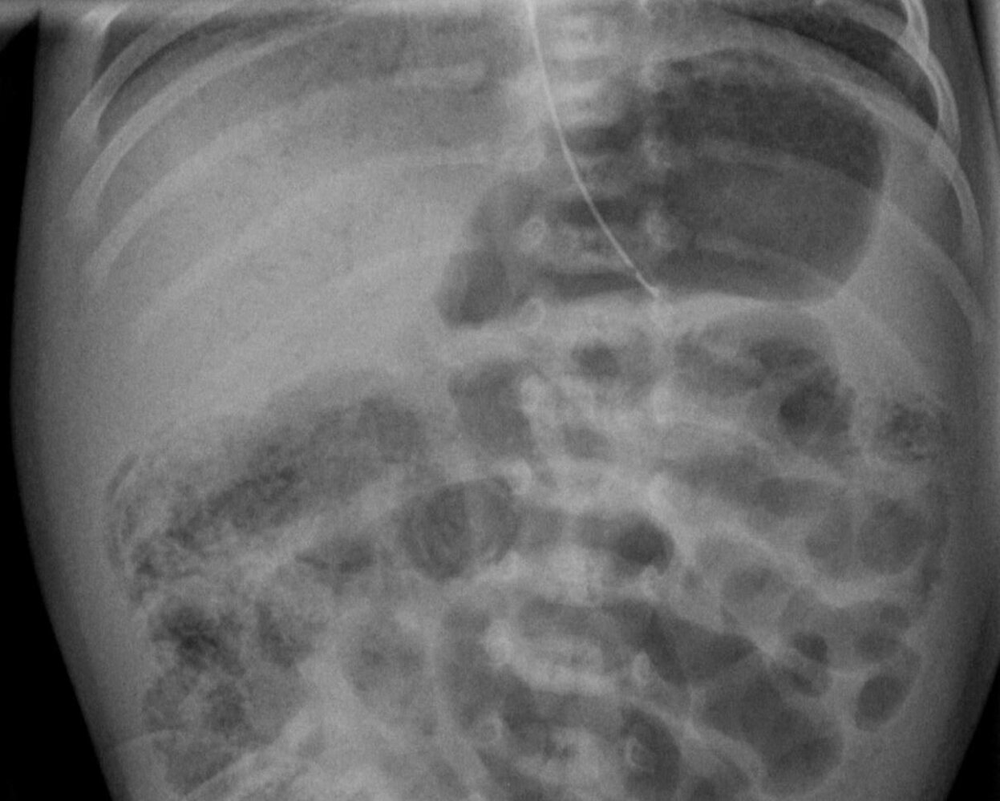

# Necrotizing enterocolitis

*Categories: Clinical knowledge > Pediatrics > Neonatology > Necrotizing enterocolitis*

[Original Article Link](https://coursology-qbank.com/amboss/article/o4004T)

---

## Summary

Necrotizing enterocolitis (NEC) is a life-threatening inflammation of the intestinal wall that results in tissue <u>death</u>. It most often affects <u>premature infants</u>. Typical symptoms include abdominal distention, feeding intolerance, <u>rectal bleeding</u>, and <u>lethargy</u>. An <u>x-ray</u> finding of gas within the wall of the intestine (<u>pneumatosis intestinalis</u>) confirms the diagnosis. Management is mainly supportive, involving bowel rest, <u>parenteral nutrition</u>, and <u>antibiotics</u>. <u>Surgery</u> is necessary for severe NEC with <u>intestinal perforation</u>. <u>Mortality rates</u> are high, and surviving <u>infants</u> may develop <u>short bowel syndrome</u> or other long-term complications.

---

## Definitions

* Hemorrhagic <u>necrotizing inflammation</u> of the intestinal wall

* Most commonly affects the <u>distal</u> <u>ileum</u> and <u>proximal</u> <u>colon</u>

---

## Epidemiology

* NEC is the most common cause of <u>acute abdomen</u> in <u>premature infants</u>. [[1]](https://coursology-qbank.com/amboss/article/WbaPsQ)

* Peak <u>incidence</u>: 2nd–4th week after <u>birth</u>  [[2]](https://coursology-qbank.com/amboss/article/dbaosQ)

Epidemiological data refers to the US, unless otherwise specified.

---

## Etiology

The causes of necrotizing enterocolitis are not fully understood but multiple factors contribute to the development of the condition. [[3]](https://coursology-qbank.com/amboss/article/ebaxsQ)[[4]](https://coursology-qbank.com/amboss/article/UbabGQ)[[5]](https://coursology-qbank.com/amboss/article/2baTGQ)[[6]](https://coursology-qbank.com/amboss/article/fbakGQ)

* Intestinal wall <u>perfusion</u> and motility disorders

* Defective or underdeveloped <u>immune system</u>

* Intestinal microbial overgrowth

* Formula feeding

* Rapid increase of <u>enteral nutrition</u>

---

## Clinical features

### General features [[7]](https://coursology-qbank.com/amboss/article/-odDeI0)[[8]](https://coursology-qbank.com/amboss/article/YKdnUI0)

* Feeding intolerance

* Abdominal distention

* Abdominal discoloration

* <u>Vomiting</u>

* <u>Rectal bleeding</u>

* Unstable temperature

* <u>Lethargy</u>

* <u>Apnea</u>, <u>bradycardia</u>

### Advanced features [[7]](https://coursology-qbank.com/amboss/article/-odDeI0)[[8]](https://coursology-qbank.com/amboss/article/YKdnUI0)

* Stage II (proven NEC)

* Lack of <u>bowel sounds</u>

* Abdominal tenderness

* <u>Cellulitis</u> of the abdominal wall

* Stage III (severe NEC)

* Generalized <u>peritonitis</u>

* Significant abdominal tenderness and/or distention

* Cardiorespiratory instability

* See “<u>Bell staging criteria</u>” for details.

---

## Diagnosis

NEC is a <u>clinical diagnosis</u> supported by typical imaging findings; see also “<u>Bell staging criteria</u>” for an overview of clinical and imaging findings by stage.

### Imaging [[9]](https://coursology-qbank.com/amboss/article/AN1Rdh0)[[10]](https://coursology-qbank.com/amboss/article/VbaGsQ)

* <u>Abdominal x-ray</u>: standard imaging modality

* Pneumatosis intestinalis: <u>pathognomonic</u> finding of gas within the intestinal wall

* <u>Portal venous gas</u>

* <u>Radiological signs of bowel obstruction</u>: e.g., bowel dilatation, <u>air-fluid levels</u>

* Increased intestinal wall thickness

* <u>Pneumoperitoneum</u> in cases of <u>intestinal perforation</u>

* Abdominal <u>ultrasound</u>: adjunctive imaging modality  [[11]](https://coursology-qbank.com/amboss/article/WKdP2I0)

* May show intramural, intravenous, and <u>intraperitoneal</u> gas

* <u>Ultrasound</u>-specific findings include:

* Reduced or absent <u>peristalsis</u>

* Increased intestinal wall thickness

* Decreased intestinal wall <u>perfusion</u>

* Free <u>intraperitoneal</u> fluid

Necrotizing enterocolitis

Pneumatosis intestinalis and free air in necrotizing enterocolitis

Necrotizing enterocolitis

### <u>Laboratory studies</u> [[8]](https://coursology-qbank.com/amboss/article/YKdnUI0)[[9]](https://coursology-qbank.com/amboss/article/AN1Rdh0)

<u>Laboratory studies</u> can help establish the severity of NEC and guide resuscitation efforts, but they are not diagnostic.

* Basic <u>laboratory studies</u>, <u>blood cultures</u>, and <u>urine cultures</u> should be obtained in all patients.

* Potential findings include:

* <u>CBC</u>: <u>neutropenia</u>, <u>thrombocytopenia</u>

* <u>CMP</u>: <u>laboratory findings of hypovolemia</u>

* <u>Coagulation studies</u>: <u>signs of DIC</u> (see “<u>Diagnosis of DIC</u>”)

* <u>Blood gas analysis</u>: <u>metabolic acidosis</u>

---

## Differential diagnoses

|  Differential diagnoses of necrotizing enterocolitis [[12]](https://coursology-qbank.com/amboss/article/hbactQ) |  |  |  |  |  |
| --- | --- | --- | --- | --- | --- |
| Features |  NEC [[8]](https://coursology-qbank.com/amboss/article/YKdnUI0) |  Spontaneous <u>intestinal perforation</u> [[13]](https://coursology-qbank.com/amboss/article/GrdBir0)   |  <u>Intestinal obstruction</u>   | Infectious enteritis | <u>Food protein-induced colitis</u> |
| Symptoms |  * Distended abdomen   |  |  |  |  |
|   * Abdominal <u>pain</u>  * <u>Vomiting</u>    |   * <u>Vomiting</u>  * <u>Constipation</u>    |   * Abdominal <u>pain</u>  * <u>Vomiting</u>    |  * Bloody stools   |  * <u>Rectal bleeding</u>   |  |
| Other findings |   * X-Ray and <u>ultrasound</u>: <u>pneumatosis intestinalis</u>  * After the first week and after feeding was begun    |  * No <u>portal venous gas</u> or <u>pneumatosis intestinalis</u>   |  * Failure to pass <u>meconium</u>   |  * Positive <u>stool cultures</u>   |  * Cow's milk-specific <u>IgE</u>   |

Management of bilious vomiting in the newborn

The differential diagnoses listed here are not exhaustive.

---

## Treatment

### General principles [[7]](https://coursology-qbank.com/amboss/article/-odDeI0)[[9]](https://coursology-qbank.com/amboss/article/AN1Rdh0)

* Management is mainly supportive and includes bowel rest, <u>gastric decompression</u>, <u>antibiotics</u>, and <u>parenteral feeding</u>.

* Drainage or <u>laparotomy</u> is required if there is evidence of bowel <u>necrosis</u>.

* All patients with NEC require observation in a <u>neonatal ICU</u> and surgical consultation.

### Nonoperative management [[7]](https://coursology-qbank.com/amboss/article/-odDeI0)[[8]](https://coursology-qbank.com/amboss/article/YKdnUI0)

* Initiate cardiovascular (e.g., <u>IV fluids</u>) and <u>respiratory support</u> as needed.

* Stop all <u>enteral feeding</u> and begin <u>parenteral feeding</u>.

* Place a <u>nasogastric suction tube</u> for decompression; use <u>Broselow tape</u> for tube size.

* Initiate <u>broad-spectrum IV antibiotics</u>. [[7]](https://coursology-qbank.com/amboss/article/-odDeI0)[[8]](https://coursology-qbank.com/amboss/article/YKdnUI0)[[16]](https://coursology-qbank.com/amboss/article/bpYHLJ)

* There is no preferred <u>antibiotic</u> regimen; follow local protocols and consult a specialist as needed.  [[17]](https://coursology-qbank.com/amboss/article/8rdOQr0)

* Common regimens include:

* <u>Ampicillin</u> PLUS <u>gentamicin</u> PLUS <u>metronidazole</u>

* <u>Piperacillin/tazobactam</u>

* If <u>MRSA</u> infection is likely: Add <u>vancomycin</u>.

* See “<u>Empiric antibiotics for neonatal sepsis</u>” for dosages in term and late-<u>preterm infants</u>.

* Provide adequate <u>pain management in children</u>.

### Surgical management [[7]](https://coursology-qbank.com/amboss/article/-odDeI0)[[18]](https://coursology-qbank.com/amboss/article/ZKdZUI0)

* Indications

* Absolute: <u>bowel perforation</u> indicated by free intra-abdominal air on <u>x-ray</u>

* Relative

* Findings concerning for bowel <u>necrosis</u> (e.g., <u>peritonitis</u>, <u>shock</u>, <u>acidosis</u>)

* Clinical worsening despite medical therapy

* Procedures

* <u>Exploratory laparotomy</u> with excision of <u>necrotic</u> bowel and/or <u>enterostomy</u>

* Primary <u>peritoneal</u> drainage

---

## Complications

### Acute

* <u>Intestinal perforation</u>

* <u>Peritonitis</u>

* <u>Sepsis</u>

### Chronic [[9]](https://coursology-qbank.com/amboss/article/AN1Rdh0)

* <u>Short bowel syndrome</u>

* Intestinal stricture

* <u>Intestinal fistula</u>

Pneumatosis intestinalis and free air in necrotizing enterocolitis

We list the most important complications. The selection is not exhaustive.

---