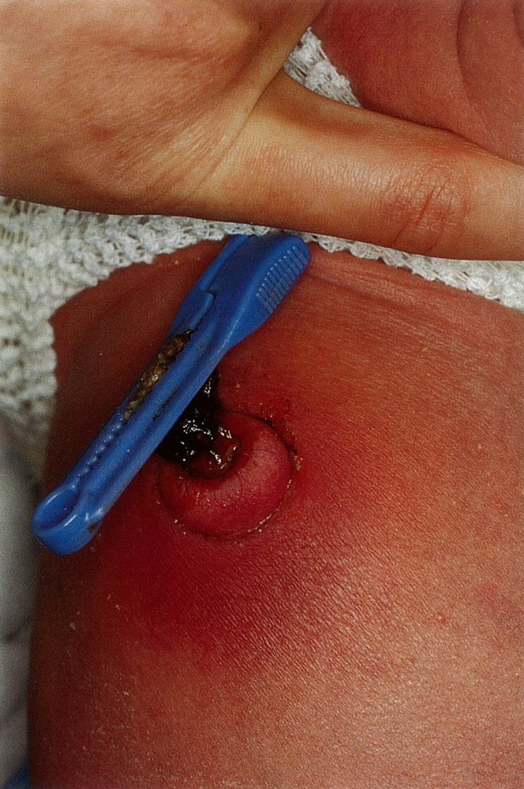

# Neonatal bacterial infections

*Categories: Clinical knowledge > Pediatrics > Neonatology > Neonatal bacterial infections*

[Original Article Link](https://coursology-qbank.com/amboss/article/gM0FLg)

---

## Summary

Neonatal bacterial infections include <u>neonatal sepsis</u>, <u>neonatal meningitis</u>, neonatal <u>urinary tract infection</u>, <u>neonatal pneumonia</u>, <u>neonatal conjunctivitis</u>, and <u>omphalitis</u>. Neonatal bacterial infections are often classified as early-onset if they occur within 72 hours of life and late-onset if they occur between 73 hours and 28 days of life. The clinical manifestations of these infections are similar and often nonspecific (e.g., temperature instability, respiratory symptoms, poor feeding, irritability). The diagnostic approach and management differ according to clinical presentation, <u>risk factors</u>, and age. If untreated, systemic neonatal infections are associated with a high risk for complications and increased mortality. Screening for maternal Group B <u>streptococcus</u> (<u>GBS</u>) and <u>GBS prophylaxis</u> have drastically reduced rates of <u>early-onset neonatal sepsis</u>. <u>Infection prevention and control</u> in neonatal <u>intensive care units</u> (<u>NICU</u>) can help decrease the risk of <u>late-onset neonatal sepsis</u>.

This article discusses late-preterm <u>neonates</u> ≥ 35 weeks' <u>gestation</u> and <u>full-term</u> <u>neonates</u>. <u>Congenital TORCH infections</u> and <u>neonatal HSV infections</u> are described in a separate article. For <u>sepsis</u> in <u>infants</u> > 28 days of age, see "<u>Pediatric sepsis</u>."

---

## Overview

### Classification [[1]](https://coursology-qbank.com/amboss/article/XLW9wN0)[[2]](https://coursology-qbank.com/amboss/article/Rvdl-70)

Neonatal bacterial infections are often classified based on the timing of disease onset.  [[3]](https://coursology-qbank.com/amboss/article/H9dKKH0)[[4]](https://coursology-qbank.com/amboss/article/MmbMT8)[[5]](https://coursology-qbank.com/amboss/article/_Id52r0)

* Early-onset infection: disease onset within 72 hours of life

* Late-onset infection: disease onset between 73 hours (3 days) and 28 days of life

### Types of neonatal bacterial infections

* <u>Neonatal bacterial sepsis</u>

* <u>Neonatal bacterial meningitis</u>

* <u>Neonatal bacterial pneumonia</u>

* Neonatal <u>urinary tract infection</u>

* <u>Neonatal conjunctivitis</u>

* Respiratory infections (e.g., <u>pertussis</u>)

* <u>Neonatal osteomyelitis</u>

* <u>Skin and soft tissue infections</u>

* <u>Necrotizing enterocolitis</u>

* <u>Omphalitis</u>

> [!TIP]
> <u>Neonates</u> have an immature <u>immune system</u> and an increased risk for life-threatening infections. [[2]](https://coursology-qbank.com/amboss/article/Rvdl-70)[[5]](https://coursology-qbank.com/amboss/article/_Id52r0)

### Clinical features of neonatal bacterial infection

#### Systemic features [[6]](https://coursology-qbank.com/amboss/article/f4Wkil0)

Systemic features of infection are often subtle and nonspecific.

* General: low <u>Apgar score</u>, irritability, excessive crying, <u>lethargy</u>

* Temperature instability: <u>fever</u> (temperature ≥ 38°C (≥ 100.4°F)) and/or <u>hypothermia</u> (temperature < 36°C (< 96.8°F))  [[6]](https://coursology-qbank.com/amboss/article/f4Wkil0)

* Cardiovascular: <u>tachycardia</u>:  (<u>pulse</u> > 160/minute) or <u>bradycardia</u> (<u>pulse</u> < 100/minute), <u>hypotension</u>, <u>cyanosis</u>

* Respiratory: <u>tachypnea</u> (≥ 60/minute), <u>hypoxia</u>, expiratory <u>grunting</u>, <u>nasal flaring</u>, <u>apnea</u>, <u>retractions</u>

* Gastrointestinal: poor feeding, <u>diarrhea</u>, <u>vomiting</u>, abdominal distension, <u>hepatosplenomegaly</u>

* <u>Skin</u>: <u>jaundice</u>, <u>cyanosis</u>, <u>pallor</u>, <u>petechiae</u>, <u>purpura</u>, <u>erythema</u> (e.g., due to <u>cellulitis</u>, <u>impetigo</u>, <u>abscess</u>)

#### Localized features

<u>Localized signs</u> of infection depend on the underlying cause, e.g.:

* <u>Neonatal pneumonia</u>: adventitious breath sounds and respiratory symptoms

* <u>Neonatal meningitis</u>: <u>seizures</u> and/or bulging <u>fontanelle</u>

* <u>Neonatal conjunctivitis</u>: <u>eye</u> redness or discharge

* <u>Osteomyelitis</u> and/or <u>septic arthritis</u>: swelling or redness of <u>joints</u> or limbs

* <u>Omphalitis</u>: umbilical redness or discharge

> [!WARNING]
> Symptoms may be subtle and/or nonspecific in <u>neonates</u> even in severe infection. [[2]](https://coursology-qbank.com/amboss/article/Rvdl-70)[[6]](https://coursology-qbank.com/amboss/article/f4Wkil0)[[7]](https://coursology-qbank.com/amboss/article/Wt1Pci0)

### Differential diagnoses [[8]](https://coursology-qbank.com/amboss/article/YqdnCI0)

* Viral infections (e.g., <u>neonatal herpes simplex virus infection</u>)

* <u>Fungal infections</u> [[9]](https://coursology-qbank.com/amboss/article/o9d0oH0)

* <u>Congenital heart disease</u>

* <u>Adrenal insufficiency</u> (e.g., from <u>congenital adrenal hyperplasia</u>)

* <u>Inborn errors of metabolism</u>

---

## Neonatal bacterial sepsis

There is no consensus on the definition of <u>neonatal bacterial sepsis</u>, but it is commonly defined as an infection with a positive bacterial blood or <u>CSF</u> culture in a <u>neonate</u> ≤ 28 days of age.  [[1]](https://coursology-qbank.com/amboss/article/XLW9wN0)[[2]](https://coursology-qbank.com/amboss/article/Rvdl-70)[[3]](https://coursology-qbank.com/amboss/article/H9dKKH0)[[8]](https://coursology-qbank.com/amboss/article/YqdnCI0)

### Classification

|  Overview of <u>neonatal bacterial sepsis</u> [[1]](https://coursology-qbank.com/amboss/article/XLW9wN0)[[2]](https://coursology-qbank.com/amboss/article/Rvdl-70)  |  |  |
| --- | --- | --- |
|  | Early-onset bacterial sepsis | Late-onset bacterial sepsis |
| Timing |  * Within 72 hours of life [[1]](https://coursology-qbank.com/amboss/article/XLW9wN0)[[2]](https://coursology-qbank.com/amboss/article/Rvdl-70)   |  * Between 73 hours (3 days) and 28 days of life [[1]](https://coursology-qbank.com/amboss/article/XLW9wN0)[[2]](https://coursology-qbank.com/amboss/article/Rvdl-70)   |
| Pathogenesis |  * <u>Vertical transmission</u> from:  * Intrauterine infection  * Colonized maternal GI or <u>urinary tract</u>   |  * <u>Horizontal transmission</u> from:  * Hospital environment (e.g., <u>nosocomial</u>)  * Community environment   |
|  Common pathogens [[12]](https://coursology-qbank.com/amboss/article/toWXdm0)[[13]](https://coursology-qbank.com/amboss/article/eCdxIH0)[[14]](https://coursology-qbank.com/amboss/article/5vdi0H0)[[15]](https://coursology-qbank.com/amboss/article/UCdbrH0)  |   * Most common: <u>group B Streptococcus</u>, <u>Escherichia coli</u>  * Less common: <u>viridans streptococci</u>, <u>CoNS</u>, <u>Listeria monocytogenes</u>, <u>Haemophilus influenzae</u>, <u>Klebsiella</u> spp, <u>Enterococcus</u> spp., <u>Streptococcus pyogenes</u>    |   * Most common: <u>CoNS</u>, <u>Staphylococcus aureus</u>, <u>E. coli</u>, <u>Klebsiella</u> spp.  * Less common: <u>Enterococcus</u> spp., <u>group B Streptococcus</u>, <u>Pseudomonas aeruginosa</u>, <u>Enterobacter</u> spp.    |
|  <u>Risk factors</u> [[6]](https://coursology-qbank.com/amboss/article/f4Wkil0)  |  * See “<u>Risk factors for early-onset GBS infection</u>”   |   * Prolonged <u>NICU</u> hospitalization  * Indwelling medical devices or catheters    |

### Clinical features [[6]](https://coursology-qbank.com/amboss/article/f4Wkil0)

* Clinical features are often nonspecific.

* See “<u>Clinical features of neonatal bacterial infection</u>.”

### Diagnostics for neonatal bacterial sepsis [[1]](https://coursology-qbank.com/amboss/article/XLW9wN0)[[2]](https://coursology-qbank.com/amboss/article/Rvdl-70)[[6]](https://coursology-qbank.com/amboss/article/f4Wkil0)

* Testing in all patients

* <u>Blood culture</u> (ideally of two different samples): <u>pathogen</u> identification confirms diagnosis  [[1]](https://coursology-qbank.com/amboss/article/XLW9wN0)[[2]](https://coursology-qbank.com/amboss/article/Rvdl-70)

* <u>CBC with differential</u>

* <u>Leukopenia</u> or <u>leukocytosis</u>

* ↓ <u>ANC</u>

* <u>I/T ratio</u> ≥ 0.2 [[1]](https://coursology-qbank.com/amboss/article/XLW9wN0)[[2]](https://coursology-qbank.com/amboss/article/Rvdl-70)

* <u>Thrombocytopenia</u>

* <u>Inflammatory markers</u> (e.g., <u>CRP</u>, <u>procalcitonin</u>, <u>IL-6</u>, <u>IL-8</u>): typically elevated  [[1]](https://coursology-qbank.com/amboss/article/XLW9wN0)[[6]](https://coursology-qbank.com/amboss/article/f4Wkil0)

* Additional testing in selected patients

* <u>CSF analysis</u> and culture

* Obtain in all patients with critical illness or positive <u>blood cultures</u>.

* Consider for all other patients if it does not delay management.

* If available, a <u>multiplex PCR meningitis panel</u> can facilitate rapid identification of certain pathogens. [[16]](https://coursology-qbank.com/amboss/article/s9dtKH0)

* <u>Urinalysis</u> and <u>urine culture</u>: in <u>late-onset neonatal sepsis</u>  [[1]](https://coursology-qbank.com/amboss/article/XLW9wN0)[[6]](https://coursology-qbank.com/amboss/article/f4Wkil0)

* Blood <u>PCR</u> (if available): Consider for rapid <u>pathogen</u> detection.  [[11]](https://coursology-qbank.com/amboss/article/L9dwLH0)[[17]](https://coursology-qbank.com/amboss/article/Bedza60)

* Cultures of localized sources of infection (e.g., <u>conjunctiva</u>, <u>umbilicus</u>)

* <u>Neonatal HSV testing</u>: for patients with clinical features of or <u>risk factors for neonatal HSV infection</u>

* <u>CMP</u> and <u>blood gas</u>: to assess for organ dysfunction in patients with suspected <u>septic shock</u> [[10]](https://coursology-qbank.com/amboss/article/aqdQCI0)

* <u>Chest x-ray</u>: in patients with respiratory symptoms to assess for <u>pneumonia</u> [[18]](https://coursology-qbank.com/amboss/article/JIdsdr0)[[19]](https://coursology-qbank.com/amboss/article/pJ1LE30)

> [!TIP]
> In <u>neonates</u> ≤ 72 hours of age, <u>urine culture</u> is not recommended to evaluate for <u>sepsis</u>. [[1]](https://coursology-qbank.com/amboss/article/XLW9wN0)

### Management [[1]](https://coursology-qbank.com/amboss/article/XLW9wN0)[[17]](https://coursology-qbank.com/amboss/article/Bedza60)

* Perform an <u>ABCDE survey</u>.

* Start cardiovascular (e.g., <u>IV fluids</u>) and <u>respiratory support</u> as needed.

* Start <u>empiric antibiotics for neonatal sepsis</u> based on:

* <u>Neonate</u> age (i.e., early-onset vs. late-onset <u>sepsis</u>)

* Suspected source of infection

* <u>Risk factors</u> (e.g., <u>gestational age</u>, comorbidities, <u>risk factors for MRDO infection</u>)

* Obtain daily <u>blood cultures</u> until there is no growth. [[1]](https://coursology-qbank.com/amboss/article/XLW9wN0)

* Perform <u>CSF analysis</u> and culture if not previously done. [[6]](https://coursology-qbank.com/amboss/article/f4Wkil0)

* Narrow <u>antibiotics</u> based on culture results and the source of infection.

* Consult infectious diseases for <u>antibiotic</u>-resistant and/or atypical pathogens.

* Determine duration of therapy based on causative organism and site of involvement. [[1]](https://coursology-qbank.com/amboss/article/XLW9wN0)

> [!TIP]
> Continued <u>empiric antibiotics</u> may be indicated for symptomatic <u>neonates</u> with culture-negative <u>sepsis</u>. [[1]](https://coursology-qbank.com/amboss/article/XLW9wN0)

### Prevention

See “<u>Prevention of neonatal bacterial infection</u>.”

---

## Empiric antibiotics for neonatal sepsis

The <u>antibiotic therapy</u> regimens below are recommended for <u>neonates</u> who were born ≥ 35 weeks' <u>gestation</u> with <u>sepsis</u> due to an unknown source. For well-appearing <u>neonates</u> with an isolated <u>fever</u>, see “<u>Fever in infants ≤ 60 days of age</u>” for <u>empiric antibiotics</u>. [[2]](https://coursology-qbank.com/amboss/article/Rvdl-70)[[17]](https://coursology-qbank.com/amboss/article/Bedza60)

### <u>Early-onset bacterial sepsis</u> [[1]](https://coursology-qbank.com/amboss/article/XLW9wN0)

* No concern for <u>meningitis</u>

* <u>Ampicillin</u> DOSAGE [[17]](https://coursology-qbank.com/amboss/article/Bedza60)

* PLUS an <u>aminoglycoside</u>, e.g., <u>gentamicin</u> DOSAGE [[17]](https://coursology-qbank.com/amboss/article/Bedza60)

* Concern for <u>meningitis</u> [[16]](https://coursology-qbank.com/amboss/article/s9dtKH0)

* <u>Ampicillin</u>  DOSAGE PLUS an <u>aminoglycoside</u>, e.g., <u>gentamicin</u> DOSAGE [[17]](https://coursology-qbank.com/amboss/article/Bedza60)

* If high suspicion for gram-negative <u>meningitis</u>, use one of the following in addition to or instead of <u>gentamicin</u>:

* Third- or <u>fourth-generation cephalosporin</u>, e.g., <u>cefotaxime</u> DOSAGE   [[17]](https://coursology-qbank.com/amboss/article/Bedza60)

* OR <u>carbapenem</u>, e.g., <u>meropenem</u> (<u>off-label</u>) DOSAGE  [[2]](https://coursology-qbank.com/amboss/article/Rvdl-70)[[17]](https://coursology-qbank.com/amboss/article/Bedza60)

### <u>Late-onset bacterial sepsis</u>

Provide coverage for both gram-negative and gram-positive pathogens. Tailor specific <u>antibiotic</u> choice based on <u>risk factors</u> and suspected source of infection. Suspected <u>meningitis</u> may require higher dosages. [[6]](https://coursology-qbank.com/amboss/article/f4Wkil0)[[20]](https://coursology-qbank.com/amboss/article/yIdd2r0)

* Gram-positive coverage

* <u>Vancomycin</u> DOSAGE [[17]](https://coursology-qbank.com/amboss/article/Bedza60)

* <u>Ampicillin</u> DOSAGE [[17]](https://coursology-qbank.com/amboss/article/Bedza60)

* <u>Nafcillin</u> DOSAGE  [[2]](https://coursology-qbank.com/amboss/article/Rvdl-70)[[14]](https://coursology-qbank.com/amboss/article/5vdi0H0)[[17]](https://coursology-qbank.com/amboss/article/Bedza60)

* Gram-negative coverage

* <u>Aminoglycoside</u>, e.g., <u>gentamicin</u> DOSAGE [[17]](https://coursology-qbank.com/amboss/article/Bedza60)

* Third- or <u>fourth-generation cephalosporin</u>, e.g., <u>cefotaxime</u> DOSAGE  [[17]](https://coursology-qbank.com/amboss/article/Bedza60)

* <u>Carbapenem</u>, e.g., <u>meropenem</u> (<u>off-label</u>) DOSAGE  [[17]](https://coursology-qbank.com/amboss/article/Bedza60)

> [!WARNING]
> Avoid <u>ceftriaxone</u> during the first 1–2 weeks of life due to the risk for <u>kernicterus</u>; other <u>cephalosporins</u> (e.g., <u>cefotaxime</u>, <u>ceftazidime</u>, or <u>cefepime</u>) are preferred. [[6]](https://coursology-qbank.com/amboss/article/f4Wkil0)[[21]](https://coursology-qbank.com/amboss/article/Ef18LT0)

> [!TIP]
> For patients with suspected intra-abdominal sources of <u>sepsis</u> (e.g., <u>necrotizing enterocolitis</u>, <u>midgut volvulus</u>), include anaerobic coverage (e.g., <u>metronidazole</u>, <u>piperacillin/tazobactam</u>). [[11]](https://coursology-qbank.com/amboss/article/L9dwLH0)[[17]](https://coursology-qbank.com/amboss/article/Bedza60)

---

## Neonatal bacterial meningitis

### Etiology [[16]](https://coursology-qbank.com/amboss/article/s9dtKH0)[[17]](https://coursology-qbank.com/amboss/article/Bedza60)[[22]](https://coursology-qbank.com/amboss/article/G9dBKH0)

* Commonly: <u>GBS</u>; , <u>E. coli</u>

* Less common: <u>Klebsiella</u> spp., <u>Enterobacter</u> spp., <u>L. monocytogenes</u>

* See also “<u>Most common causative agents of bacterial meningitis by age group and underlying condition</u>.”

### Clinical features [[4]](https://coursology-qbank.com/amboss/article/MmbMT8)[[8]](https://coursology-qbank.com/amboss/article/YqdnCI0)

* Systemic <u>clinical features of neonatal bacterial infection</u> (often nonspecific)

* <u>Altered mental status</u>: <u>lethargy</u>; , irritability, <u>seizures</u>

* <u>Signs of increased intracranial pressure</u> (e.g., bulging <u>fontanelle</u>)

* High-pitched crying

* <u>Hypotonia</u>

> [!TIP]
> <u>Meningismus</u> does not typically occur in <u>neonates</u>. [[8]](https://coursology-qbank.com/amboss/article/YqdnCI0)

### Diagnostics for neonatal bacterial meningitis [[4]](https://coursology-qbank.com/amboss/article/MmbMT8)[[16]](https://coursology-qbank.com/amboss/article/s9dtKH0)

* Perform <u>diagnostics for neonatal bacterial sepsis</u> in all patients with suspected <u>meningitis</u>.

* Confirm <u>diagnosis of meningitis</u> through <u>pathogen</u> detection on <u>CSF</u> culture and/or <u>PCR</u>.  [[4]](https://coursology-qbank.com/amboss/article/MmbMT8)[[22]](https://coursology-qbank.com/amboss/article/G9dBKH0)[[23]](https://coursology-qbank.com/amboss/article/t9dX6H0)

* Consider <u>neuroimaging</u> in all <u>neonates</u> to assess for complications (e.g., <u>brain abscess</u>, <u>brain injury</u>) and predict neurodevelopmental outcomes. [[24]](https://coursology-qbank.com/amboss/article/a7WQ450)

* <u>Cranial</u> <u>ultrasound</u>  [[25]](https://coursology-qbank.com/amboss/article/p7WL550)

* <u>MRI</u> or CT <u>brain</u>

> [!TIP]
> <u>Clinical features of meningitis</u> and <u>sepsis</u> are similar in <u>neonates</u>. Perform <u>diagnostics for neonatal sepsis</u> for all patients with suspected <u>meningitis</u>. [[8]](https://coursology-qbank.com/amboss/article/YqdnCI0)

> [!WARNING]
> <u>Lumbar puncture</u> is contraindicated in patients with clinical instability or <u>criteria for imaging prior to LP</u>. [[2]](https://coursology-qbank.com/amboss/article/Rvdl-70)

### Management of neonatal bacterial meningitis [[6]](https://coursology-qbank.com/amboss/article/f4Wkil0)[[17]](https://coursology-qbank.com/amboss/article/Bedza60)[[26]](https://coursology-qbank.com/amboss/article/89dO6H0)

Management of <u>neonatal meningitis</u> is typically performed in consultation with specialists (e.g., infectious diseases, intensive care, and/or <u>neurology</u>).

* Unstable patients: Provide <u>immediate stabilization for meningitis</u>.

* Start <u>empiric antibiotics</u>.

* Treatment typically includes <u>ampicillin</u> plus <u>gentamicin</u> and/or <u>cefotaxime</u>.

* See <u>empiric antibiotics for neonatal sepsis</u> for details.

* Narrow <u>antibiotics</u> based on cultures; see “<u>Pathogen-specific therapy in meningitis</u>.”

* Complete 14–21 days of <u>antibiotics</u> depending on the organism.  [[6]](https://coursology-qbank.com/amboss/article/f4Wkil0)

* Consider repeat <u>lumbar puncture</u> to assess for <u>CSF</u> clearance.

* Ensure follow-up for long-term complications of <u>neonatal meningitis</u>, e.g.:

* Audiology evaluation for <u>hearing loss</u>

* Monitoring for <u>developmental delay</u>

> [!TIP]
> There is insufficient evidence to support the use of <u>glucocorticoids</u> in <u>neonates</u> with <u>meningitis</u>. [[17]](https://coursology-qbank.com/amboss/article/Bedza60)[[27]](https://coursology-qbank.com/amboss/article/w7WhL50)

### Complications [[2]](https://coursology-qbank.com/amboss/article/Rvdl-70)

* <u>Brain abscess</u>

* Ventriculitis

* <u>Septic</u> <u>brain</u> <u>infarcts</u>

* <u>Hydrocephalus</u>

* Subdural effusions

---

## Neonatal bacterial pneumonia

### Etiology [[5]](https://coursology-qbank.com/amboss/article/_Id52r0)

* Congenital <u>pneumonia</u>: <u>vertical transmission</u> from intrauterine <u>TORCH infections</u>

* Early-onset <u>pneumonia</u>

* Pathogens

* Similar to <u>early-onset neonatal sepsis</u>

* See “Overview of <u>neonatal bacterial sepsis</u>” for details.

* <u>Risk factors</u>

* Same as <u>risk factors for early-onset sepsis</u>

* Male sex

* Low <u>socioeconomic status</u>

* <u>Galactosemia</u>

* Late-onset <u>pneumonia</u>

* Main pathogens

* Similar to <u>late onset neonatal sepsis</u>

* See “Overview of <u>neonatal bacterial sepsis</u>” for details.

* Additional pathogens

* <u>Gram-negative bacilli</u>: <u>Enterobacter</u> spp., <u>Klebsiella</u> spp., <u>Proteus</u> spp., Citrobacter spp., Acinetobacter spp., Stenotrophomonas maltophilia

* <u>Gram-positive cocci</u>: <u>Enterococcus</u> spp.

* See also “<u>Etiology of pediatric CAP</u>.”

* <u>Risk factors</u>

* <u>Prematurity</u> and/or <u>low birth weight</u>

* <u>Mechanical ventilation</u>

### Clinical features [[5]](https://coursology-qbank.com/amboss/article/_Id52r0)

* Nonspecific <u>clinical features of neonatal bacterial infection</u>

* <u>Tachypnea</u>

* <u>Signs of increased work of breathing</u>

* Adventitious breath sounds (e.g., <u>wheezes</u>, <u>rales</u>, <u>rhonchi</u>)

* New onset of or increase in <u>purulent</u> <u>sputum</u>

* <u>Hypoxia</u>

* <u>Cyanosis</u>, especially <u>central cyanosis</u> [[8]](https://coursology-qbank.com/amboss/article/YqdnCI0)

> [!WARNING]
> Abnormal respiratory findings may also be seen in <u>neonates</u> with <u>sepsis</u> who do not have <u>pneumonia</u>. [[5]](https://coursology-qbank.com/amboss/article/_Id52r0)

### Diagnostics [[5]](https://coursology-qbank.com/amboss/article/_Id52r0)

Perform <u>diagnostics for neonatal bacterial sepsis</u> in all patients with ill appearance or nonspecific <u>clinical features of neonatal infection</u>. <u>Diagnosis of pneumonia</u> is based on a combination of clinical, laboratory, and imaging findings.

* Clinical evaluation for signs of impaired oxygenation, i.e.:

* Oxygen desaturation

* Increased oxygen requirement

* Increased ventilator support

* <u>Chest x-ray</u> [[5]](https://coursology-qbank.com/amboss/article/_Id52r0)[[8]](https://coursology-qbank.com/amboss/article/YqdnCI0)

* Indicated in all patients to assess for <u>CXR findings in pneumonia</u> (e.g., consolidation, infiltrates)

* Findings may be normal in early stages of infection.

* <u>CBC</u> findings include:

* <u>WBCs</u> ≤ 4,000/mm³

* <u>WBCs</u> ≥ 15,000/mm³

* ≥ 10% bands

* <u>Sputum analysis</u>

* <u>PCR</u> of pharyngeal <u>sputum</u> (e.g., with <u>RV PCR</u> panel): to exclude viral causes of late-onset <u>pneumonia</u>

* <u>Tracheal</u> <u>sputum</u> culture (if intubated): can show leukocytic infiltrate with a predominant organism  [[5]](https://coursology-qbank.com/amboss/article/_Id52r0)[[28]](https://coursology-qbank.com/amboss/article/GvdBYH0)

> [!TIP]
> Evaluate for <u>congenital TORCH infections</u> in <u>neonates</u> with <u>pneumonia</u> and other <u>common findings in TORCH infections</u>. [[5]](https://coursology-qbank.com/amboss/article/_Id52r0)

### Management [[5]](https://coursology-qbank.com/amboss/article/_Id52r0)

For suspected congenital <u>pneumonia</u>, see “<u>TORCH infection</u>.”

* Perform an <u>ABCDE survey</u>.

* Start cardiovascular (e.g., <u>IV fluids</u>) and <u>respiratory support</u> as needed.

* Consider <u>NICU</u> admission based on level of acuity.

* Start <u>empiric antibiotics</u> based on <u>newborn</u> age, severity of illness, and suspected <u>pathogen</u>.

* <u>Antibiotics</u> are the same as <u>empiric antibiotics for neonatal sepsis</u>.

* Use a three-drug regimen for severely ill <u>neonates</u>.

* Narrow <u>antibiotics</u> based on suspected or proven pathogens.

* Complete at least 7–14 days of <u>antibiotics</u>.  [[5]](https://coursology-qbank.com/amboss/article/_Id52r0)

* Consider <u>surfactant</u> replacement therapy (e.g., in <u>GBS</u> <u>pneumonia</u>).

### Prevention [[5]](https://coursology-qbank.com/amboss/article/_Id52r0)

* Follow recommended <u>prevention of neonatal bacterial infection</u>.

* In ventilated patients, use strategies for the <u>prevention of ventilator-associated infections</u>.

---

## Omphalitis

<u>Omphalitis</u> is a bacterial infection of the <u>umbilical cord</u> stump. [[29]](https://coursology-qbank.com/amboss/article/erdxTr0)

### Etiology [[29]](https://coursology-qbank.com/amboss/article/erdxTr0)[[30]](https://coursology-qbank.com/amboss/article/wvdhXH0)

* <u>S. aureus</u>: <u>MRSA</u> is more common than <u>MSSA</u>.

* <u>Group A Streptococcus</u> and <u>GBS</u>

* <u>Gram negative</u> <u>bacilli</u>: <u>E. coli</u>, <u>Klebsiella pneumoniae</u>, <u>Pseudomonas</u> spp.

* <u>Anaerobes</u> (rare)

* <u>Clostridium tetani</u>: common cause of <u>omphalitis</u> and <u>neonatal tetanus</u> in low-income countries

### <u>Risk factors</u> [[29]](https://coursology-qbank.com/amboss/article/erdxTr0)[[30]](https://coursology-qbank.com/amboss/article/wvdhXH0)

* Inadequate umbilical hygiene

* <u>Low birth weight</u>

* <u>Prolonged rupture of membranes</u>

* Maternal intrauterine infection

* Umbilical catheterization

* Unplanned home <u>birth</u>

### Clinical features [[29]](https://coursology-qbank.com/amboss/article/erdxTr0)[[31]](https://coursology-qbank.com/amboss/article/Trd6gr0)

* Periumbilical redness, tenderness, swelling

* <u>Purulent</u> discharge, <u>fluctuance</u>

* Possible systemic symptoms (see “<u>Clinical features of neonatal bacterial infection</u>”)

### Diagnosis [[29]](https://coursology-qbank.com/amboss/article/erdxTr0)[[31]](https://coursology-qbank.com/amboss/article/Trd6gr0)

Diagnosis is clinical. Consider diagnostic studies based on <u>patient presentation</u>.

* All patients

* Obtain wound culture if possible. [[31]](https://coursology-qbank.com/amboss/article/Trd6gr0)

* Consider <u>urinalysis</u> and <u>urine culture</u>.

* Consider an <u>ultrasound</u> to evaluate for a <u>urachal</u> abnormality and <u>abscess</u> in patients with:

* Umbilical drainage

* Other clinical features of <u>abscess</u>

* Patients with <u>fever</u> or other systemic <u>clinical features of neonatal bacterial infection</u>: Obtain diagnostic studies for <u>neonatal sepsis</u>.

* Afebrile patients without systemic symptoms: Consider <u>blood culture</u> if ≤ 21 days of age. [[29]](https://coursology-qbank.com/amboss/article/erdxTr0)

> [!TIP]
> Blood and <u>CSF</u> cultures may not be necessary in well-appearing <u>neonates</u> > 21 days of age. [[29]](https://coursology-qbank.com/amboss/article/erdxTr0)

### Management [[29]](https://coursology-qbank.com/amboss/article/erdxTr0)[[31]](https://coursology-qbank.com/amboss/article/Trd6gr0)

* <u>Febrile</u> and/or ill-appearing: Start <u>empiric antibiotics for neonatal sepsis</u>.

* Afebrile and well-appearing: Start <u>antibiotics</u> to cover common pathogens (e.g., <u>S. aureus</u> and <u>gram-negative organisms</u>). 

* Strongly consider <u>MRSA</u> coverage based on local resistance patterns.

* Agents are similar to those used for late-onset <u>sepsis</u>; see “<u>Empiric antibiotics for neonatal sepsis</u>” for details.

* Concern for necrotizing infection or <u>abscess</u>: Consult <u>surgery</u> for possible <u>debridement</u> and/or <u>incision and drainage</u>.

### Differential diagnosis [[31]](https://coursology-qbank.com/amboss/article/Trd6gr0)

* Irritant dermatitis

* Umbilical <u>granuloma</u>

### Complications [[29]](https://coursology-qbank.com/amboss/article/erdxTr0)[[30]](https://coursology-qbank.com/amboss/article/wvdhXH0)

Serious complications can occur due to direct access to the bloodstream and <u>peritoneum</u>.

* <u>Neonatal sepsis</u>

* <u>Skin and soft tissue infections</u>: periumbilical <u>cellulitis</u>, <u>necrotizing fasciitis</u>

* Intra-abdominal complications: <u>peritonitis</u>, intestinal <u>necrosis</u>, <u>small bowel</u> <u>evisceration</u>, <u>abscess</u>

* <u>Portal vein thrombosis</u> and/or <u>umbilical vein</u> <u>thrombosis</u>

> [!TIP]
> Serious bacterial infections are a rare (< 1% of cases) complication of <u>omphalitis</u> in high-income countries. [[29]](https://coursology-qbank.com/amboss/article/erdxTr0)

### Prevention [[30]](https://coursology-qbank.com/amboss/article/wvdhXH0)

* Follow <u>hand hygiene</u> practices during <u>labor</u> and delivery.

* Use <u>sterile technique</u> when cutting the <u>umbilical cord</u>.

* Educate caregivers on neonatal umbilical hygiene: [[32]](https://coursology-qbank.com/amboss/article/vedA060)

* Dry cord care: The umbilical stump should be kept clean and loosely covered with a clean cloth or left exposed to the air to dry out.

* If the stump becomes soiled (e.g., with stool), it should be cleaned with soap and sterile water.

* Topical <u>antiseptics</u> (e.g., <u>chlorhexidine</u>) are not recommended unless in a setting with:

* Poor hygienic practices  [[32]](https://coursology-qbank.com/amboss/article/vedA060)

* High rates of <u>omphalitis</u>

Omphalitis in a newborn

---