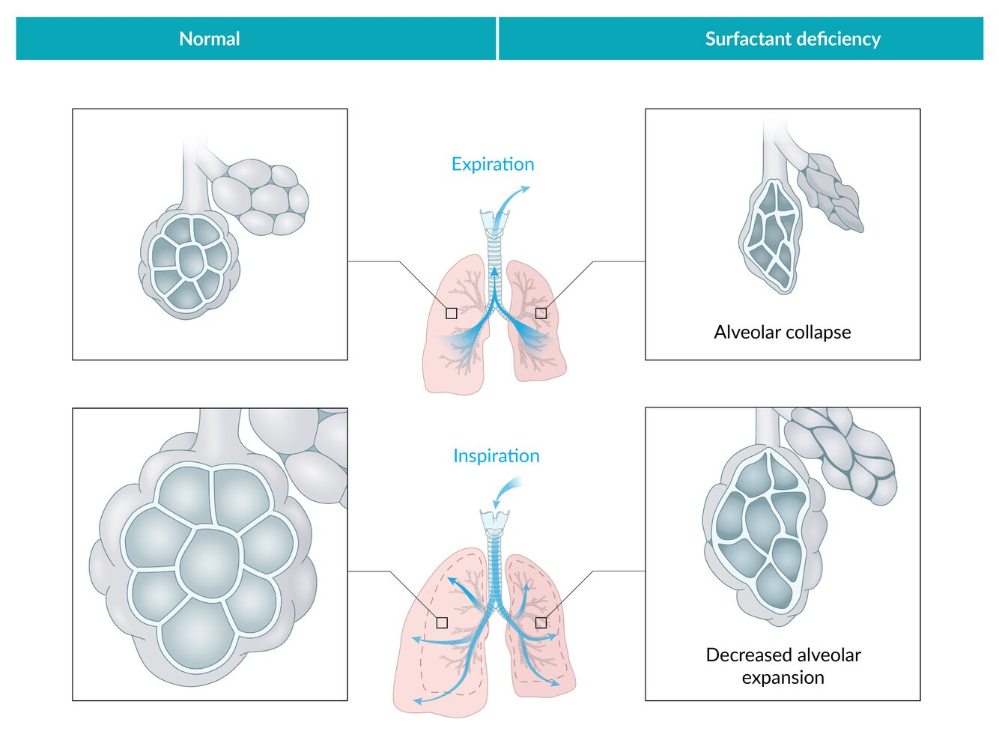
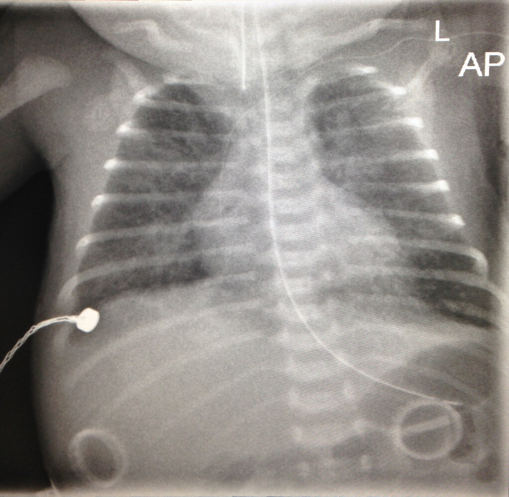
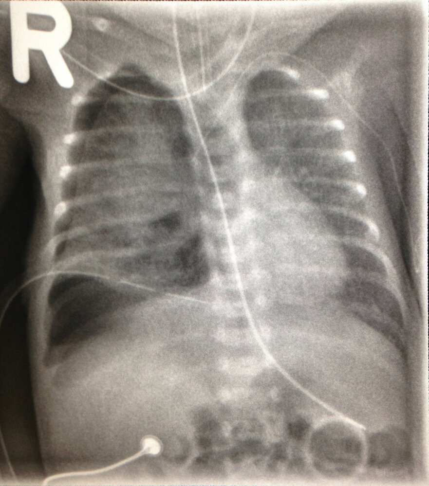
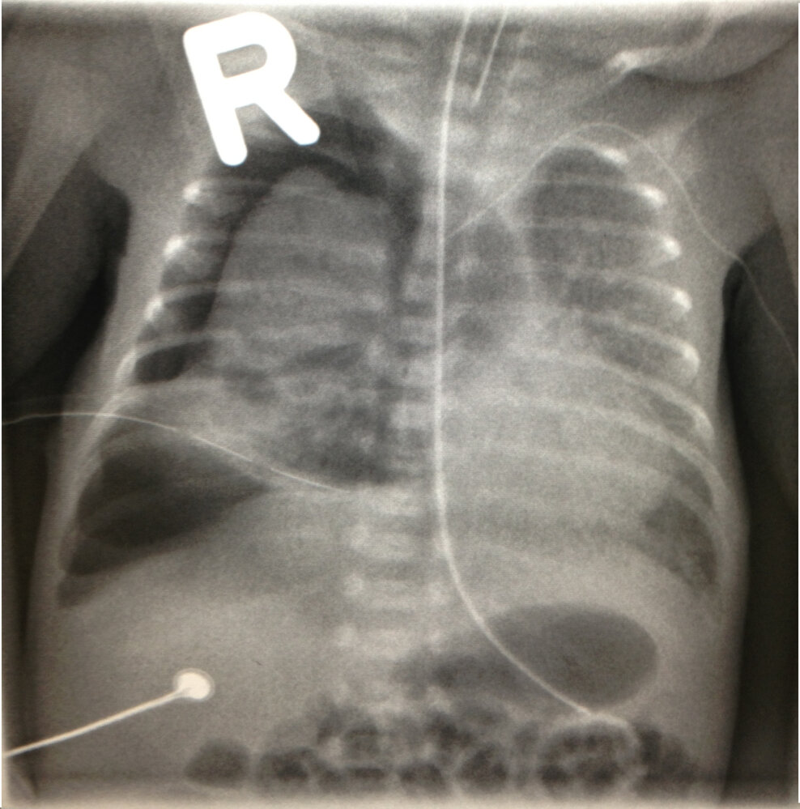
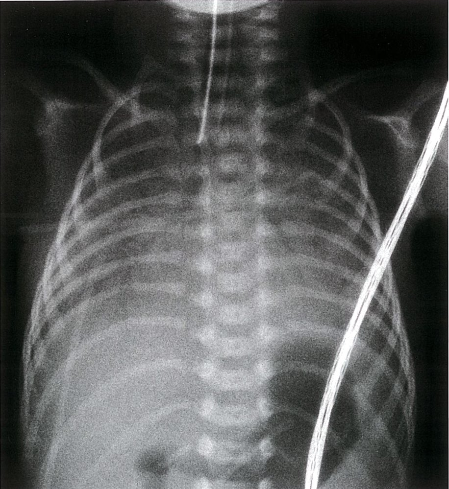
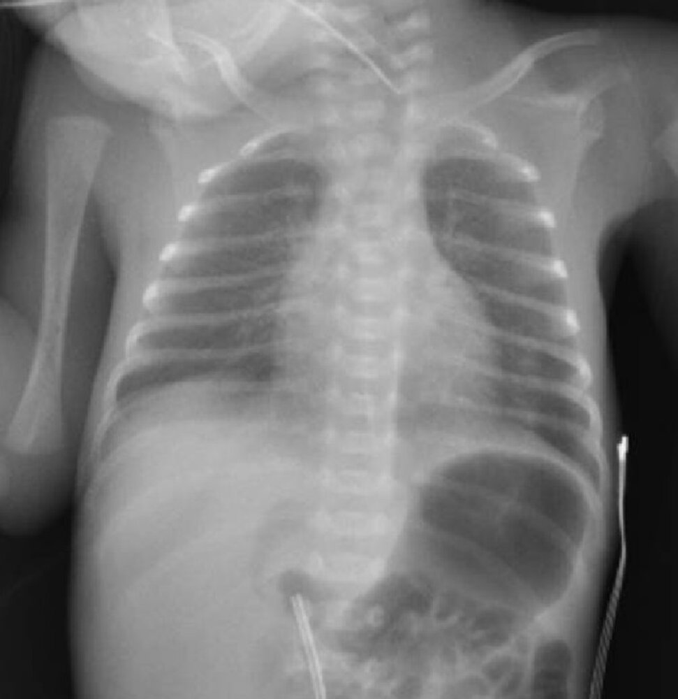
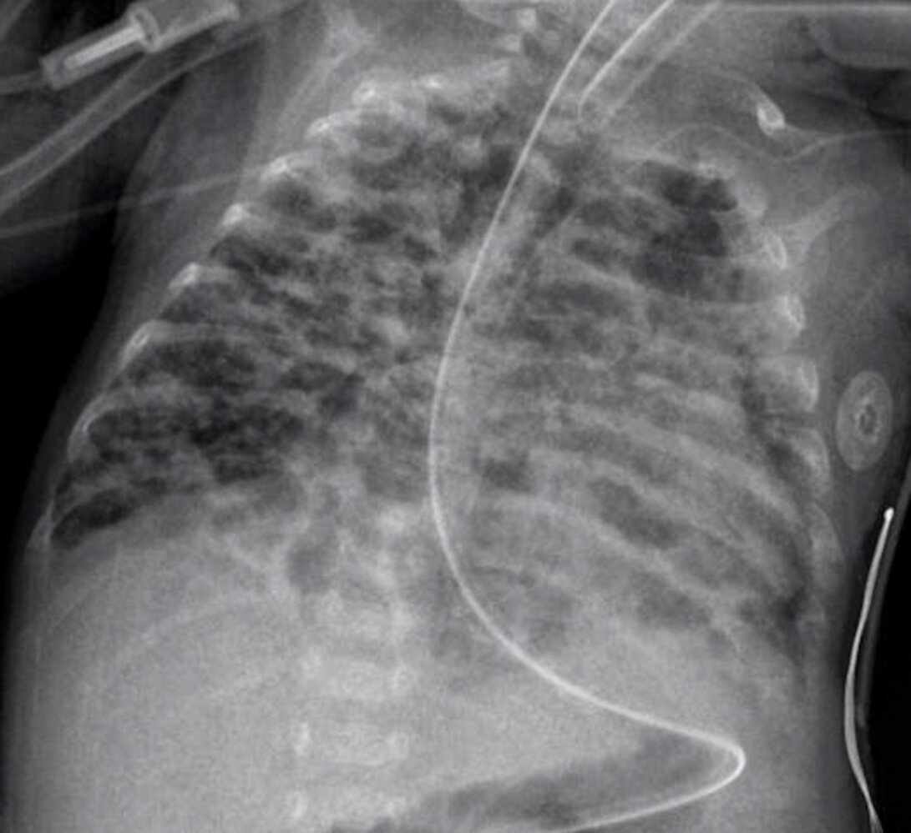

# Neonatal respiratory distress syndrome

*Categories: Clinical knowledge > Pediatrics > Neonatology > Neonatal respiratory distress syndrome*

[Original Article Link](https://coursology-qbank.com/amboss/article/340SQT)

---

## Summary

Neonatal <u>respiratory distress</u> syndrome (NRDS), or <u>surfactant deficiency</u> disorder, is a <u>lung</u> disorder in <u>infants</u> that is caused by a deficiency of <u>pulmonary surfactant</u>. It is most common in <u>preterm infants</u>, with the <u>incidence</u> and severity decreasing with <u>gestational age</u>. <u>Surfactant deficiency</u> causes the <u>alveoli</u> to collapse, resulting in impaired <u>blood gas</u> exchange. Symptoms manifest shortly after <u>birth</u> and include <u>tachypnea</u>, <u>tachycardia</u>, increased breathing effort, and/or <u>cyanosis</u>. Suspected diagnosis is based on clinical features and confirmed by evaluating the extent of <u>atelectasis</u> via an <u>x-ray</u> of the chest. Blood gases show respiratory and <u>metabolic acidosis</u> in addition to <u>hypoxia</u>. Treatment primarily involves emergency resuscitative measures, including nasal <u>continuous positive airway pressure</u> (<u>CPAP</u>) and the stabilization of blood sugar levels and <u>electrolytes</u>. Intratracheal <u>surfactant</u> should be administered if <u>infants</u> require an increased <u>FiO2</u> to maintain a sufficient <u>oxygen saturation</u> despite receiving <u>noninvasive positive pressure ventilation</u>. Intratracheal <u>surfactant</u> should be administered if ventilation alone is unsuccessful. Most cases resolve within 3–5 days of treatment. However, complications such as <u>hypoxemia</u>, <u>tension pneumothorax</u>, <u>bronchopulmonary dysplasia</u>, or <u>sepsis</u> may still occur. In rare cases, NRDS may lead to neonatal <u>death</u>. NRDS can be prevented by administering antenatal <u>glucocorticoids</u> to the mother if <u>premature delivery</u> is expected.

---

## Etiology

Neonatal <u>respiratory distress</u> syndrome is caused by impaired synthesis and secretion of <u>surfactant</u>. <u>Risk factors</u> include:

* <u>Premature birth</u>

* <u>Maternal diabetes</u> mellitus: leads to ↑ fetal <u>insulin</u>, which inhibits <u>surfactant</u> synthesis

* Hereditary  [[1]](https://coursology-qbank.com/amboss/article/lNcvY10)

* <u>Cesarean delivery</u>: results in lower levels of fetal <u>glucocorticoids</u> than vaginal delivery, in which higher levels are released as a <u>response to stress</u> from uterine contractions

* <u>Hydrops fetalis</u>

* Multifetal <u>pregnancies</u>

* Male sex

---

## Epidemiology

* <u>Incidence</u> [[2]](https://coursology-qbank.com/amboss/article/PbYWFn)

* 1% of all <u>newborns</u>

* 10% of all preterm babies

* The risk of developing NRDS depends on <u>gestational age</u>. [[2]](https://coursology-qbank.com/amboss/article/PbYWFn)

* < 28 weeks of <u>gestation</u>: > 50%

* > 37 weeks of <u>gestation</u>: < 5%

Epidemiological data refers to the US, unless otherwise specified.

---

## Pathophysiology

### <u>Surfactant</u> [[3]](https://coursology-qbank.com/amboss/article/RbYltn)

* <u>Pulmonary surfactant</u> is a mixture of phospholipids and <u>proteins</u> produced by <u>lamellar bodies</u> of <u>type II alveolar cells</u>. These phospholipids reduce alveolar surface tension, preventing the <u>alveoli</u> from collapsing.

* <u>Surfactant deficiency</u> is most likely to occur in <u>preterm infants</u>, because:

* <u>Surfactant</u> production begins at approximately 20 weeks <u>gestation</u>.

* Distribution throughout the <u>lungs</u> begins at 28-32 weeks' <u>gestation</u> and does not reach sufficient concentration until 35 weeks <u>gestation</u>.

### Surfactant deficiency

* Little or no reduction of alveolar surface tension → increased alveolar collapse → <u>atelectasis</u> → decreased <u>lung compliance</u> and functional residual capacity → <u>hypoxemia</u> and <u>hypercapnia</u>

* <u>Hypoxemia</u> and <u>hypercapnia</u> → <u>vasoconstriction</u> of the pulmonary vessels (<u>hypoxic</u> <u>vasoconstriction</u>) and respiratory <u>acidosis</u> → intrapulmonary <u>right-to-left shunt</u> → increased permeability due to alveolar <u>epithelial</u> damage → fibrinous exudation within the <u>alveoli</u> → development of <u>hyaline membranes</u> in the <u>lungs</u> (<u>hyaline membrane</u> disease)

Alveolar collapse in surfactant deficiency

Hyaline membranes in ARDS

---

## Clinical features

* Maternal history of <u>premature birth</u>

* Onset of symptoms: usually immediately after <u>birth</u> but can occur up to 72 hours postpartum

* <u>Signs of increased respiratory effort</u>

* <u>Tachypnea</u>

* <u>Nasal flaring</u> and moderate to severe subcostal/intercostal and jugular <u>retractions</u>

* Characteristic expiratory <u>grunting</u>

* Decreased breath sounds on <u>auscultation</u>

* <u>Cyanosis</u> due to pulmonary <u>hypoxic</u> <u>vasoconstriction</u>

Reference:[[4]](https://coursology-qbank.com/amboss/article/4gY3vo)

---

## Diagnosis

* <u>Physical examination</u>: see “Clinical features” above

* Maternal history: previous <u>preterm birth</u>

* <u>X-ray chest</u>

* <u>Interstitial</u> <u>pulmonary edema</u> with perihilar streaking

* Diffuse, fine, reticulogranular (ground-glass) densities with low <u>lung volumes</u> and <u>air bronchograms</u>

* <u>Atelectasis</u>

* <u>Blood gas analysis</u>

* <u>Hypoxia</u> with <u>respiratory acidosis</u>; may lead to increased <u>lactate</u> levels

* Evaluate for partial <u>respiratory failure</u> or <u>global</u> <u>respiratory failure</u>

* <u>Amniocentesis for prenatal testing of NRDS</u>: screening for markers of fetal <u>lung</u> immaturity

* Lecithin-sphingomyelin ratio < 1.5 (≥ 2 is considered mature)

* The amount of <u>sphingomyelin</u> in the <u>amniotic fluid</u> remains relatively consistent during <u>pregnancy</u>.

* The amount of lecithin, which is the major component of <u>surfactant</u>, starts increasing after week 26 of <u>gestation</u>.

* The lower the lecithin-<u>sphingomyelin</u> <u>ratio</u>, the more likely it is that the <u>lungs</u> are immature.

* Foam stability index < 0.48

* A semi-quantitative test used to assess <u>fetal lung maturity</u>

* <u>Amniotic fluid</u> is mixed with ethanol until foam formation ceases to occur

* The index refers to the highest quantity of ethanol that can be added to <u>amniotic fluid</u> still permitting the formation of foam.

* Low surfactant-albumin ratio

* Histological findings [[5]](https://coursology-qbank.com/amboss/article/kJYm8J)

* Hyaline membranes lining the <u>alveoli</u>  

* Composed of <u>fibrin</u>, cellular debris, and <u>red blood cells</u>

* Eosinophilic appearance, amorphous material lining the alveolar surface

* Engorged and congested <u>capillary</u> vessels in the <u>interstitium</u>

Respiratory distress syndrome (1/3)

Respiratory distress syndrome (2/3)

Respiratory distress syndrome (3/3)

Neonatal respiratory distress syndrome

Hyaline membranes in ARDS

Neonatal respiratory distress syndrome

References:[[2]](https://coursology-qbank.com/amboss/article/PbYWFn)[[6]](https://coursology-qbank.com/amboss/article/6QYjCK)[[7]](https://coursology-qbank.com/amboss/article/pQYLCK)

---

## Differential diagnoses

* Pulmonary hypoplasia

* Underdevelopment of the <u>lungs</u> characterized by a decreased number of <u>alveoli</u> and small <u>airways</u> and reduced <u>lung volumes</u> in one or both lobes

* Results in impaired <u>gas exchange</u> and severe <u>respiratory distress</u> that may require <u>intubation</u>

* Associated with <u>congenital diaphragmatic hernia</u> (usually left-sided), <u>oligohydramnios</u>, and <u>Potter sequence</u>

* Congenital <u>diaphragmatic hernia</u>

* <u>Pneumothorax</u>

* <u>Neonatal pneumonia</u>

| Overview of NRDS and its differential diagnoses |  |  |  |  |  |
| --- | --- | --- | --- | --- | --- |
| Characteristics | Neonatal <u>respiratory distress</u> syndrome |  Apnea of prematurity (AOP) |  Transient tachypnea of the newborn (<u>wet lung disease</u>) [[8]](https://coursology-qbank.com/amboss/article/FbYgvn)  |  Persistent pulmonary hypertension of the newborn (<u>PPHN</u>) [[9]](https://coursology-qbank.com/amboss/article/HpYKIJ)[[10]](https://coursology-qbank.com/amboss/article/fmWkUN0)  |  Meconium aspiration syndrome [[11]](https://coursology-qbank.com/amboss/article/spYtIJ)[[12]](https://coursology-qbank.com/amboss/article/GpYBIJ)[[13]](https://coursology-qbank.com/amboss/article/CSXqbB)  |
| Term |  * Preterm   |  |  * Most commonly <u>full-term</u> and near-term <u>infants</u>   |  * Most commonly term and <u>preterm infants</u>; can also occur in <u>postterm infants</u>   |  * Most commonly <u>postterm</u>   |
| Etiology |  * Deficiency of <u>pulmonary surfactant</u>   |  * Immature respiratory control   |  * Delayed resorption and clearance of fetal <u>lung</u> fluid   |   * Elevated <u>pulmonary vascular resistance</u> → <u>right-to-left shunting</u> through the foramen ovale and <u>patent ductus arteriosus</u> (bypassing the <u>lungs</u>) → pre- and postductal oxygenation gradient (e.g., preductal <u>O2 saturation</u> is often higher than postductal).  * Associated with abnormal prenatal development of or <u>perinatal</u> maladaptation of pulmonary vasculature    |  * Intrauterine passage of <u>meconium</u> and <u>aspiration</u> leading to <u>airway obstruction</u>   |
| <u>Risk factors</u> |   * <u>Preterm delivery</u>  * Male sex  * <u>Maternal diabetes</u>    |   * <u>Preterm delivery</u>  * <u>Extremely low birth weight</u>    |   * <u>Cesarean delivery</u>, especially before the onset of <u>labor</u>  * Delivery before 39 weeks' <u>gestation</u>  * Maternal <u>asthma</u>  * <u>Maternal diabetes</u>  * <u>Small-for-gestational-age infant</u>  * Male sex  [[14]](https://coursology-qbank.com/amboss/article/ZfXZkx)  * <u>Macrosomia</u>    |   * <u>Perinatal asphyxia</u>  * Prolonged <u>premature rupture of the membranes</u>  * Infection  * <u>Neonatal pneumonia</u>  * <u>Meconium aspiration syndrome</u>    |   * <u>Postterm</u> delivery  * <u>Nonreassuring fetal heart rate tracing</u>  * <u>Perinatal asphyxia</u>  * <u>Placental insufficiency</u>  * <u>Oligohydramnios</u>  * <u>Cesarean delivery</u>  * Maternal <u>hypertension</u> and <u>diabetes</u>  * Maternal infection/<u>chorioamnionitis</u>    |
| Onset of symptoms |  * Within the first minutes/hours after <u>birth</u>   |  * Within 2–3 days after <u>birth</u>   |  * Immediately after <u>birth</u> and within the next 2 hours   |  * Within 24 hours after <u>birth</u>   |  * Immediately after <u>birth</u>   |
| Clinical features |   * <u>Tachypnea</u>  * Increased breathing effort  * <u>Cyanosis</u>  * <u>Hypoxia</u>  * Decreased breathing sounds    |  * Episodes of breathing pauses (usually > 20 seconds) that are frequently accompanied by <u>hypoxemia</u> and/or <u>bradycardia</u>   |   * <u>Tachypnea</u>  * Increased breathing effort  * Diffuse <u>crackles</u>, diminished, or normal breathing sounds on <u>auscultation</u>    |   * Low APGAR scores  * <u>Cyanosis</u> and <u>signs of respiratory distress</u>  * <u>Heart</u> examination: prominent precordial impulse and a narrowly split and accentuated <u>S2</u>    |   * Green <u>amniotic fluid</u>  * Low APGAR score  * <u>Tachypnea</u>  * Increased breathing effort  * <u>Hypoxia</u>  * <u>Lung</u> <u>rales</u> and <u>rhonchi</u>    |
| Imaging |   * Diffuse, fine, reticulogranular (ground-glass) densities  * Low <u>lung volumes</u> and <u>air bronchograms</u>    |   * Usually not necessary, since AOP is a <u>clinical diagnosis</u> of exclusion.  * Imaging may be used to rule out other causes of <u>apnea</u> (e.g., <u>sepsis</u>, <u>intracranial hemorrhage</u>).    |  * Fluid in the <u>lung</u> fissures and increased <u>lung volumes</u>   |  * <u>Pulmonary hypertension</u> on <u>echocardiography</u>   |   * Increased <u>lung volumes</u>  * Asymmetric, patchy opacities  * <u>Pleural effusion</u>    |
| Treatment |   * <u>Supportive care</u>  * Nasal <u>CPAP</u>  * Endotracheal administration of artificial <u>surfactant</u>    |   * <u>Supportive care</u> (e.g., <u>supplemental oxygen</u>, neutral thermal environment, maintaining a physiological neck position, avoidance of excessive <u>nasal suctioning</u>)  * Nasal <u>CPAP</u>  * <u>Methylxanthine</u> therapy (e.g., <u>caffeine</u>, <u>theophylline</u>)    |  * <u>Supportive care</u> (e.g., <u>supplemental oxygen</u>, neutral thermal environment, adequate nutrition)   |   * <u>Supportive care</u>  * Continuous <u>pulse oximetry</u> screening  [[15]](https://coursology-qbank.com/amboss/article/KhXUUB)  * Severe cases: <u>inhaled nitric oxide</u>  * Last resort: <u>ECMO</u>    |   * <u>Supportive care</u> (e.g., <u>supplemental oxygen</u> administration )  * Continuous <u>pulse oximetry</u>  * Severe cases: standard steps of <u>neonatal resuscitation</u>, <u>inhaled nitric oxide</u>, administration of <u>surfactant</u>    |
| Complications |   * <u>Bronchopulmonary dysplasia</u>  * <u>Pneumothorax</u>  * <u>PDA</u>    |  * Resolves without complications in the majority of cases at approx. 43 to 44 weeks of postmenstrual age   |  * Resolves without complications in the majority of cases   |  * Severe <u>PPHN</u>  * <u>Developmental delay</u>  * Motor deficit  * <u>Hearing</u> deficit   |   * <u>Persistent pulmonary hypertension of the newborn</u> (<u>PPHN</u>)  * <u>Pneumothorax</u>  * <u>Pneumomediastinum</u>    |

The differential diagnoses listed here are not exhaustive.

---

## Treatment

* Ventilation [[8]](https://coursology-qbank.com/amboss/article/FbYgvn)

* Nasal <u>CPAP</u> with a <u>PEEP</u> of 3–8 cm H2O

* If <u>respiratory insufficiency</u> persists, start <u>intubation</u> with <u>mechanical ventilation</u> and O2inhalation.

* Endotracheal administration of artificial <u>surfactant</u> within 2 hours postpartum

* Supportive measures: IV fluid replacement; stabilization of blood sugar levels and <u>electrolytes</u>

> [!WARNING]
> Physiologic <u>O2saturation</u> in <u>neonates</u> is around 90%. A saturation of 100% is considered toxic for <u>neonates</u>!

---

## Complications

### Bronchopulmonary dysplasia (<u>BPD</u>) [[16]](https://coursology-qbank.com/amboss/article/8bYOvn)

* Definition: chronic <u>lung</u> condition secondary to prolonged <u>mechanical ventilation</u> and <u>oxygen therapy</u> for NRDS

* Etiology: <u>Pulmonary barotrauma</u> and <u>oxygen toxicity</u> with subsequent inflammation of <u>lung tissue</u> due to ventilation of the immature <u>lung</u> (ventilation for more than 28 days)

* Clinical features

* Seen in <u>infants</u> < 32 weeks

* Persistence of symptoms similar to NRDS (e.g., <u>tachypnea</u>, <u>grunting</u>, <u>nasal flaring</u>)

* Episodes of desaturation

* Diagnostics

* <u>X-ray</u> chest: diffuse, fine, granular densities, areas of <u>atelectasis</u> interspersed with areas of hyperinflation

* <u>Blood gas analysis</u>: respiratory and <u>metabolic acidosis</u>

* <u>Histology</u>: <u>atelectasis</u>, <u>fibrosis</u>, <u>emphysematous</u> alveolar changes (decreased number and septation of <u>alveoli</u>)

* Treatment: controlled oxygenation, <u>diuretics</u>, rarely <u>glucocorticoids</u>

Bronchopulmonary dysplasia

### Further complications

* <u>Pneumothorax</u>

* <u>Patent ductus arteriosus</u> (the persistently low <u>partial pressure</u> of oxygen in the blood contributes to <u>PDA</u>)

* <u>Hypoxia</u>

* Cardiovascular arrest

* <u>Neonatal sepsis</u>

* Complications of O2inhalation: <u>retinopathy of prematurity</u>, <u>bronchopulmonary dysplasia</u>, <u>intraventricular hemorrhage</u>

> [!NOTE]
> Baby oxen have RIBs: Babys receiving too much oxygen get Retinopathy of <u>prematurity</u>, Intraventricular hemorrhage, and Bronchopulmonary <u>dysplasia</u>.

We list the most important complications. The selection is not exhaustive.

---

## Prevention

* Prevent <u>premature birth</u> if possible. See <u>tocolysis</u>.

* Antenatal <u>corticosteroid</u> therapy administered to the mother (stimulates <u>infant</u> <u>lung</u> maturation) [[18]](https://coursology-qbank.com/amboss/article/EbY8vn)

* Given 48 hours before delivery

* 2 doses of IM <u>betamethasone</u> 24 hours apart or 4 doses of IM <u>dexamethasone</u> 12 hours apart

---