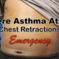
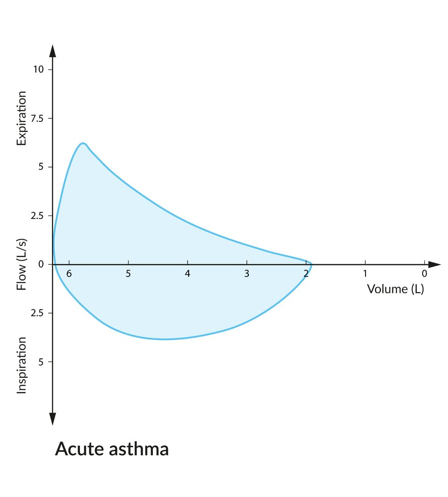
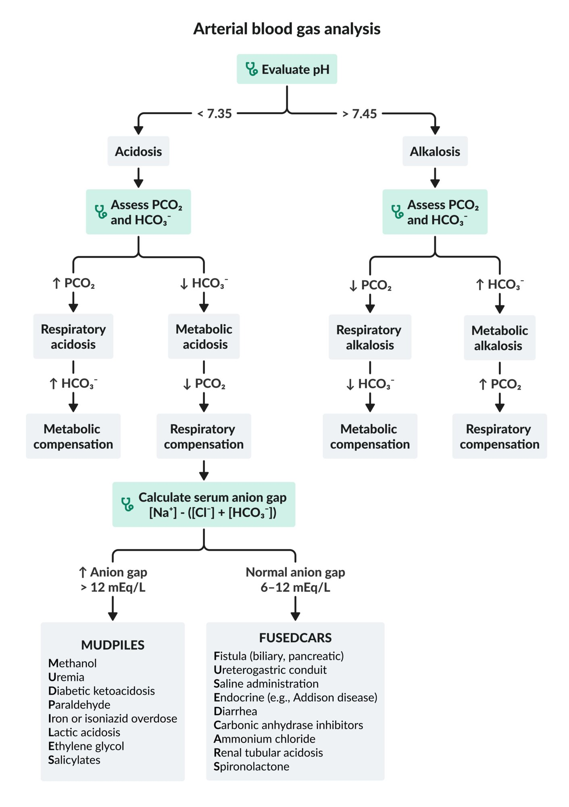
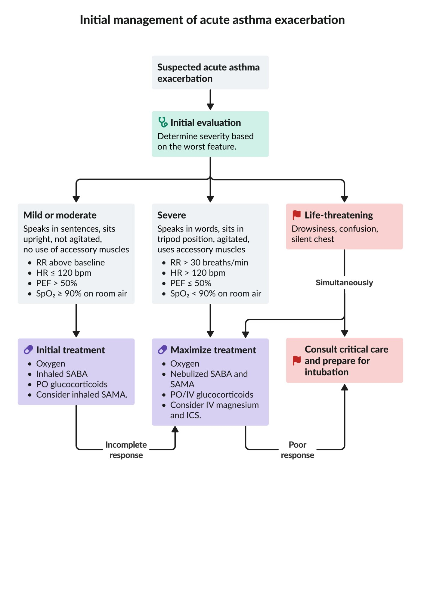

# Acute asthma exacerbation

*Categories: Clinical knowledge > Pediatrics > Pediatric ENT and pulmonology > Acute asthma exacerbation*

[Original Article Link](https://coursology-qbank.com/amboss/article/or00Rh)

---

## Summary

An <u>asthma</u> exacerbation is the acute or subacute worsening of <u>asthma symptoms</u> resulting from reversible <u>lower airway</u> obstruction in response to a trigger (e.g., <u>upper respiratory tract infection</u>, <u>allergens</u>, medication nonadherence). The diagnosis is usually clinical and involves early evaluation of the <u>severity of asthma exacerbation</u> based on <u>peak expiratory flow</u> (<u>PEF</u>), <u>oxygen saturation</u>, and/or <u>physical examination</u> findings (e.g., use of <u>accessory muscles of breathing</u>). Additional diagnostic studies can include <u>arterial blood gas analysis</u> (<u>ABG</u>) and <u>chest x-ray</u> (<u>CXR</u>) depending on initial severity and response to treatment. Immediate treatment is essential as <u>asthma</u> exacerbations can be life-threatening and may progress to <u>respiratory arrest</u>. Treatment includes <u>oxygen therapy</u>, short-acting <u>bronchodilators</u>, i.e., <u>short-acting beta agonists</u> (<u>SABA</u>) and <u>short-acting muscarinic antagonists</u> (<u>SAMA</u>), and <u>systemic glucocorticoids</u>. See “<u>Asthma</u>" for details on long-term management.

The information in this article applies to patients > 5 years of age. For younger children, see "<u>Asthma in children ≤ 5 years of age</u>."

---

## Definitions

* <u>Asthma</u> exacerbation: a typically reversible episode of <u>lower airway</u> obstruction (<u>bronchospasm</u>) characterized by a worsening of <u>asthma symptoms</u> within a short period of time (acute or subacute) and accompanied by a change in baseline <u>lung function</u> [[2]](https://coursology-qbank.com/amboss/article/8DdOTH0)

* Bronchospasm: a constriction in the bronchial muscles that results in <u>airway obstruction</u> within seconds to minutes. It is the characteristic symptom of <u>asthma</u> exacerbations, but it may also be triggered by certain medications or <u>mechanical ventilation</u>.

* Status asthmaticus:  a term used to describe <u>severe asthma</u> exacerbations that progress rapidly and do not respond to standard <u>acute asthma therapy</u>  [[3]](https://coursology-qbank.com/amboss/article/g6bF4u)

---

## Etiology

### <u>Risk factors for asthma</u> exacerbations [[2]](https://coursology-qbank.com/amboss/article/8DdOTH0)

<u>Uncontrolled asthma</u> symptoms significantly increase the risk of exacerbations. The additional <u>risk factors</u>, which increase risk regardless of whether symptoms are well-controlled, are listed here for patients older than 5 years of age. For younger children, see "<u>Risk factors for asthma exacerbations in children ≤ 5 years</u>."

* Exposure to <u>asthma triggers</u>

* <u>SABA</u>-only treatment and/or overuse of <u>SABA</u>

* Inadequate <u>inhaled corticosteroid</u> (<u>ICS</u>) prescription and/or <u>poor adherence</u> to <u>ICS</u>

* Incorrect inhaler technique

* Prior <u>intubation</u> or <u>ICU</u> admission for <u>asthma</u>

* ≥ 1 severe exacerbations in the previous year [[2]](https://coursology-qbank.com/amboss/article/8DdOTH0)

* <u>FEV1</u> < 60% of predicted average value [[2]](https://coursology-qbank.com/amboss/article/8DdOTH0)

* High <u>bronchodilator</u> responsiveness  [[2]](https://coursology-qbank.com/amboss/article/8DdOTH0)

* Blood <u>eosinophilia</u>

### Risk factors for fatal or near-fatal asthma exacerbations [[2]](https://coursology-qbank.com/amboss/article/8DdOTH0)[[4]](https://coursology-qbank.com/amboss/article/LKawSl)

Near-fatal episodes include those requiring <u>intubation</u> and/or <u>ICU</u> admission.

* Exacerbation history

* History of ≥ 1 near-fatal <u>asthma</u> episodes

* Hospital admission or emergency department visit for <u>asthma</u> exacerbation within the past year

* Medication-related factors

* Current or recent use of oral <u>glucocorticoids</u>

* No current use of or <u>poor adherence</u> to <u>ICS</u>

* Heavy reliance on <u>SABA</u>, e.g., ≥ 200 doses used per month [[2]](https://coursology-qbank.com/amboss/article/8DdOTH0)

* Comorbidities

* <u>Pneumonia</u>, <u>cardiac arrhythmias</u>

* Psychiatric disorders

* <u>Diabetes mellitus</u>

* <u>Food allergies</u>

* Social risk: e.g., isolation, precarious employment

---

## Clinical features

Signs and symptoms vary depending on the <u>severity of asthma exacerbation</u>. For some individuals, an acute exacerbation may be the first manifestation of <u>asthma</u>. [[2]](https://coursology-qbank.com/amboss/article/8DdOTH0)[[3]](https://coursology-qbank.com/amboss/article/g6bF4u)

* Common symptoms

* <u>Dyspnea</u>

* Increased <u>coughing</u>

* <u>Vital signs</u> and general appearance

* <u>Tachypnea</u>

* <u>Tachycardia</u>

* <u>Pulsus paradoxus</u>  [[4]](https://coursology-qbank.com/amboss/article/LKawSl)

* <u>Hypoxemia</u> (<u>SpO2</u> < 90% on ambient air, possible <u>cyanosis</u>)

* <u>Altered mental status</u>

* Signs of bronchoconstriction

* Prolonged expiratory phase

* Expiratory <u>wheezing</u>

* Silent chest

* <u>Hyperresonance</u> on percussion

* Inferior displacement and poor movement of the <u>diaphragm</u>

* <u>Signs of increased work of breathing</u>:  (<u>WOB</u>): e.g., use of accessory muscles

> [!WARNING]
> Characteristic features of <u>imminent respiratory arrest</u> include silent chest, <u>altered mental status</u>, <u>bradycardia</u>, <u>paradoxical breathing</u>, respiratory muscle exhaustion, and <u>signs of respiratory failure</u> on <u>ABG</u> (e.g., normalization of <u>pH</u> and <u>PaCO2</u> in a fatiguing patient). [[5]](https://coursology-qbank.com/amboss/article/Jobs1u)

> [!TIP]
> <u>Crackles</u> on <u>auscultation</u> are rare in <u>asthma</u> exacerbations and may indicate a viral or bacterial trigger (e.g., <u>pneumonia</u>). [[5]](https://coursology-qbank.com/amboss/article/Jobs1u)

Chest Retractions in a Severe Asthma Attack

---

## Diagnosis

Acute <u>asthma</u> exacerbation is a <u>clinical diagnosis</u> based on the worsening of <u>asthma symptoms</u> and <u>lung function</u> from an individual's baseline. This content is for individuals > 5 years of age. For younger children, see "<u>Diagnosis of asthma in children ≤ 5 years of age</u>" and "<u>Management of asthma exacerbations by severity in children ≤ 5 years</u>."

### Approach [[2]](https://coursology-qbank.com/amboss/article/8DdOTH0)

* Classify <u>asthma exacerbation severity</u> based on clinical features and measurements of <u>SpO2</u> and <u>PEF</u> or <u>FEV1</u>.

* Consider additional diagnostic tests (e.g., <u>ABG</u>, <u>CXR</u>) after stabilization to:

* Evaluate for underlying causes.

* Rule out differential diagnoses (e.g., <u>COPD</u>, <u>acute heart failure</u>).

* Patients with suspected viral trigger: Start <u>isolation precautions</u> in accordance with local protocols.

> [!WARNING]
> Patients with severe or <u>life-threatening asthma</u> exacerbations require aggressive therapy. Do not delay immediate stabilization for diagnostic testing.

> [!TIP]
> Early recognition of <u>hypercapnic respiratory failure</u> and/or <u>hypoxemic respiratory failure</u> is vital.

### <u>PFTs</u> [[2]](https://coursology-qbank.com/amboss/article/8DdOTH0)

<u>PFTs</u> may not be feasible in children or in patients with a <u>life-threatening asthma exacerbation</u>.

* Uses

* Stable patients: Assess severity before initiating treatment.

* All patients: Monitor response to treatment.

* Modalities

* <u>Peak flow meter</u> (PFM): measures <u>PEF</u>, easy to obtain in exacerbations

* <u>Spirometry</u>: more reliable measurement, may not be feasible during exacerbations

* Interpretation

* Compare <u>PEF</u> and/or <u>FEV1</u> with previous personal best (preferred) or predicted average values

* <u>PEF</u> < 60% of predicted value is consistent with <u>severe asthma exacerbation</u>. [[2]](https://coursology-qbank.com/amboss/article/8DdOTH0)

* See also “<u>Severity assessment in asthma exacerbation</u>.”

Flow-volume loop in acute asthma

Peak Expiratory Flow Prediction

### <u>ABG</u> [[2]](https://coursology-qbank.com/amboss/article/8DdOTH0)

Obtain <u>ABG</u> without interrupting <u>supplemental oxygen</u> administration. [[2]](https://coursology-qbank.com/amboss/article/8DdOTH0)

* Indications

* <u>PEF</u> or <u>FEV1</u> < 50% of the predicted average value [[2]](https://coursology-qbank.com/amboss/article/8DdOTH0)

* Clinical worsening or <u>poor response to acute asthma therapy</u>

* Initial findings

* <u>Respiratory alkalosis</u>

* <u>Hypoxemia</u> may be present.

* Late findings (indicate severe exacerbation and <u>respiratory failure</u>)

* <u>Respiratory acidosis</u>

* Severe <u>hypoxemia</u> (<u>PaO2</u>< 60 mm Hg) [[2]](https://coursology-qbank.com/amboss/article/8DdOTH0)

* <u>Hypercapnia</u> (<u>PaCO2</u>> 45 mm Hg) [[2]](https://coursology-qbank.com/amboss/article/8DdOTH0)

> [!WARNING]
> Patients with acute <u>asthma</u> exacerbations initially present with <u>hypocapnia</u> (↓ <u>PaCO2</u>) and <u>respiratory alkalosis</u> (↑ <u>pH</u>) due to <u>tachypnea</u>. Rising <u>PaCO2</u> and normalizing <u>pH</u> in a patient with <u>respiratory muscle fatigue</u> are <u>signs of impending respiratory failure</u>!

Arterial blood gas analysis

### <u>Chest x-ray</u> [[2]](https://coursology-qbank.com/amboss/article/8DdOTH0)

<u>Chest x-rays</u> are not routinely recommended. [[2]](https://coursology-qbank.com/amboss/article/8DdOTH0)

* Indications

* Suspected comorbidity (e.g., <u>pneumonia</u>, <u>pneumothorax</u>)

* Evaluation of differential diagnoses (e.g., <u>ARDS</u>, <u>CHF</u>, <u>foreign body aspiration</u>)

* Lack of improvement with treatment

* Supportive findings [[6]](https://coursology-qbank.com/amboss/article/pIWLd50)

* Signs of <u>pulmonary hyperinflation</u>

* Horizontal appearance of <u>ribs</u>

* Increased number of <u>ribs</u> above <u>diaphragm</u> level

* Flat <u>diaphragm</u>

* Bronchial thickening

### Additional diagnostic studies [[4]](https://coursology-qbank.com/amboss/article/LKawSl)

* <u>Laboratory studies</u>

* <u>CBC</u>: Consider when concomitant <u>pneumonia</u> is suspected.

* <u>BMP</u>: Consider in patients already being treated with <u>SABAs</u> and/or <u>glucocorticoids</u>.

* Consider <u>baseline ECG</u> in:

* Patients > 50 years of age [[4]](https://coursology-qbank.com/amboss/article/LKawSl)

* Patients with <u>COPD</u>-<u>asthma</u> overlap and/or cardiovascular comorbidities (e.g., <u>coronary artery disease</u>)

> [!TIP]
> In patients with acute <u>asthma</u>, evaluate for complications, such as <u>pneumonia</u>, <u>atelectasis</u>, or <u>pneumothorax</u>.

---

## Differential diagnoses

The following conditions manifest as sudden <u>dyspnea</u> with or without altered breath sounds.  [[7]](https://coursology-qbank.com/amboss/article/JuXsH-)

* <u>AECOPD</u>

* <u>Anaphylaxis</u>

* <u>Acute bronchitis</u>

* <u>Foreign body aspiration</u>

* <u>Pulmonary embolism</u>

* <u>Pneumothorax</u>

* <u>Pneumonia</u>

* <u>Acute heart failure</u>

* Sudden <u>tracheal</u> or bronchial compression

* <u>Allergic bronchopulmonary aspergillosis</u>

* <u>Vocal cord dysfunction</u>

* Dysfunctional breathing disorder (e.g., <u>hyperventilation</u>, thoracic dominant breathing) [[8]](https://coursology-qbank.com/amboss/article/IuXYs-)

* Specific to <u>infants</u> or young children

* <u>Bronchiolitis</u> (children < 2 years old; caused by <u>RSV</u>)

* Laryngotracheomalacia (<u>infants</u>; causes <u>inspiratory stridor</u>)

* <u>Bronchopulmonary dysplasia</u> (in <u>premature infants</u>)

* See also “<u>Wheezing in children</u>”.

* <u>Croup</u>

* See also “<u>Differential diagnosis of dyspnea</u>.”

The differential diagnoses listed here are not exhaustive.

---

## Classification

* Severity is determined by the most severe clinical feature or functional assessment parameter. [[2]](https://coursology-qbank.com/amboss/article/8DdOTH0)

* The following severity assessment score for acute exacerbation is based on the 2025 <u>GINA</u> guidelines for individuals > 5 years of age. For younger children, see "<u>Management of asthma exacerbations by severity in children ≤ 5 years</u>."  [[2]](https://coursology-qbank.com/amboss/article/8DdOTH0)[[4]](https://coursology-qbank.com/amboss/article/LKawSl)

* Pediatric assessment: Specific severity assessment scores for acute exacerbation of <u>asthma</u> in children can be used to determine disposition and guide treatment decisions.

|  Classification of asthma exacerbation severity [[2]](https://coursology-qbank.com/amboss/article/8DdOTH0)  |  |  |
| --- | --- | --- |
| Severity | Clinical features | Functional assessment parameters |
| Mild or moderate asthma exacerbation |   * Able to speak in complete phrases or sentences  * Prefers upright to <u>supine position</u>  * No <u>agitation</u>  * No use of <u>accessory muscles of breathing</u>  * <u>Respiratory rate</u> above baseline  * HR 100–120 bpm    |   * <u>SpO2</u> 90–95%  * <u>PEF</u> > 50% of predicted average value or personal best    |
| Severe asthma exacerbation |   * Unable to speak in complete phrases or sentences  * <u>Tripod position</u>  * <u>Agitation</u>  * Use of <u>accessory muscles of breathing</u>  * <u>Respiratory rate</u> > 30 breaths/min  * <u>Heart rate</u> > 120 bpm    |   * <u>SpO2</u> < 90% on ambient air  * <u>PEF</u> ≤ 50% of predicted average value or personal best    |
| Life-threatening asthma exacerbation |   * Drowsiness  * Confusion  * Silent chest (absence of <u>wheezing</u>)    |   * <u>Respiratory failure</u>: e.g., <u>PaCO2</u> ≥ 45 mm Hg and/or <u>PaO2</u> < 60 mm Hg  * <u>SpO2</u> < 90% on ambient air [[9]](https://coursology-qbank.com/amboss/article/7KW43m0)  * <u>PEF</u> < 25% of predicted average value (if performed)  [[4]](https://coursology-qbank.com/amboss/article/LKawSl) [[2]](https://coursology-qbank.com/amboss/article/8DdOTH0)    |

Initial management of acute asthma exacerbation

PRAM Score for Pediatric Asthma Exacerbation Severity

---

## Management

The following content is for individuals > 5 years of age. For younger children, see "<u>Management of acute asthma exacerbations in children ≤ 5 years</u>."

### Approach [[2]](https://coursology-qbank.com/amboss/article/8DdOTH0)[[4]](https://coursology-qbank.com/amboss/article/LKawSl)

* Initiate management depending on <u>asthma exacerbation severity</u> and care setting; see: 

* <u>Management of asthma exacerbation in the emergency department and hospital setting</u>

* <u>Management of asthma exacerbation in the outpatient setting</u>

* Treatment usually involves a combination of: [[2]](https://coursology-qbank.com/amboss/article/8DdOTH0)[[4]](https://coursology-qbank.com/amboss/article/LKawSl)

* Inhaled <u>SABA</u> (e.g., <u>albuterol</u>)

* Inhaled <u>SAMA</u> (e.g., <u>ipratropium bromide</u>)

* Oral (preferred) or IV <u>glucocorticoids</u> (e.g., <u>prednisolone</u>, <u>prednisone</u>, and <u>methylprednisolone</u>)  [[2]](https://coursology-qbank.com/amboss/article/8DdOTH0)

* Reassess <u>response to acute asthma therapy</u> regularly; adjust management and disposition accordingly.

* Treat co-occurring conditions, e.g.:

* <u>Anaphylaxis</u>: Combine treatment with <u>epinephrine</u>; see “<u>Management of anaphylaxis</u>” for details.

* <u>Pneumonia</u>: Combine treatment with <u>antibiotic therapy</u>; see “<u>Treatment of pneumonia</u>” and "<u>Management of pediatric pneumonia</u>" for details.

* Provide close <u>follow-up after asthma exacerbations</u>.

> [!TIP]
> Frequent administration of an inhaled <u>SABA</u> is the treatment of choice to reverse <u>airway obstruction</u> caused by <u>bronchospasm</u>. [[2]](https://coursology-qbank.com/amboss/article/8DdOTH0)

> [!WARNING]
> Treat all patients with severe or <u>life-threatening asthma</u> exacerbations in the emergency department or hospital setting.

> [!NOTE]
> ASTHMA: Albuterol, STeroids, Humidified O2, Magnesium (severe exacerbations), and Anticholinergics (<u>ipratropium bromide</u>) are the therapies for <u>asthma</u> exacerbations.

### Response to acute asthma therapy [[2]](https://coursology-qbank.com/amboss/article/8DdOTH0)[[4]](https://coursology-qbank.com/amboss/article/LKawSl)

* Perform serial examinations to assess <u>asthma exacerbation severity</u>.

* Frequently monitor <u>vital signs</u>, <u>O2saturation</u>, and <u>PaCO2</u> levels.

* Measure <u>pulmonary function</u> after 1 hour of initial treatment.

* Response to treatment should be seen within:

* Inhaled <u>SABA</u> (e.g., <u>albuterol</u>)

* Initial response within 5 minutes

* Significant clinical improvement is typically expected within the first hour of treatment.

* Inhaled <u>SAMA</u> (e.g., <u>ipratropium bromide</u>): ∼ 15 minutes

* <u>Glucocorticoid</u>: 4 hours

* Adjust treatment based on response to therapy.

* Evaluate post-treatment parameters to determine disposition and guide further treatment decisions.

* Escalate treatment in patients with a poor or <u>incomplete response to acute asthma therapy</u>.

|  Response to therapy [[2]](https://coursology-qbank.com/amboss/article/8DdOTH0)[[4]](https://coursology-qbank.com/amboss/article/LKawSl)  |  |
| --- | --- |
| Poor response to acute asthma therapy |  * Any of the following:  * <u>PEF</u> < 40% of predicted average value  * <u>PaCO2</u>≥ 42 mm Hg  * ≥ 1 symptom of <u>severe asthma exacerbation</u>  * Drowsiness and/or confusion  * Increasingly pronounced <u>signs of increased WOB</u>   |
| Incomplete response to acute asthma therapy |  * Either of the following:  * <u>PEF</u> 40–60% of predicted average value or personal best  * Persistent symptoms of <u>mild or moderate asthma exacerbation</u>   |
| Good response to acute asthma therapy |  * All of the following sustained for ≥ 60 minutes:  * <u>PEF</u> ≥ 60% of predicted average value or personal best  * No evidence of <u>respiratory distress</u>  * Normal <u>physical examination</u>   |

Initial management of acute asthma exacerbation

---

## Emergency department and hospital settings

Manage according to <u>asthma exacerbation severity</u> and assess <u>response to acute asthma therapy</u> frequently. The following content is for individuals > 5 years of age. For younger children, see "<u>Management of acute asthma exacerbations in children ≤ 5 years</u>."[[2]](https://coursology-qbank.com/amboss/article/8DdOTH0)[[4]](https://coursology-qbank.com/amboss/article/LKawSl)

### Severe to <u>life-threatening asthma exacerbation</u>

* Initiate pharmacological treatment and simultaneously provide <u>respiratory support in asthma exacerbation</u>, e.g.:

* Administer supplemental <u>oxygen therapy in asthma</u>.

* Prepare for <u>intubation and mechanical ventilation in asthma</u> (i.e., have equipment and induction agents ready).

* Monitor for signs of <u>impending respiratory failure</u>.

* Consider continuous cardiac and <u>pulse oximetry</u> monitoring in patients with <u>risk factors for fatal or near-fatal asthma exacerbations</u>.

* Consider fluid repletion (preferably oral) in <u>infants</u> and young children with signs of <u>dehydration</u>.  [[4]](https://coursology-qbank.com/amboss/article/LKawSl)

> [!WARNING]
> Do not delay <u>intubation</u> once an <u>indication to intubate in asthma</u> is identified. [[4]](https://coursology-qbank.com/amboss/article/LKawSl)

#### Pharmacological treatment

* Inhaled <u>SABA</u>  

* <u>Nebulized</u> <u>albuterol</u> DOSAGE [[4]](https://coursology-qbank.com/amboss/article/LKawSl)

* OR <u>albuterol</u> <u>MDI</u> DOSAGE with a <u>spacer</u>  [[2]](https://coursology-qbank.com/amboss/article/8DdOTH0)

* PLUS inhaled <u>SAMA</u> ;  [[2]](https://coursology-qbank.com/amboss/article/8DdOTH0)

* <u>Nebulized</u> <u>ipratropium bromide</u> (<u>off-label</u>) DOSAGE [[4]](https://coursology-qbank.com/amboss/article/LKawSl)

* OR <u>ipratropium bromide</u> <u>MDI</u> (<u>off-label</u>) DOSAGE

* PLUS oral or IV <u>glucocorticoids</u>, e.g.:   [[2]](https://coursology-qbank.com/amboss/article/8DdOTH0); 

* <u>Prednisolone</u> DOSAGE

* OR equivalent dosage of <u>prednisone</u>

* OR equivalent dosage of <u>methylprednisolone</u>

* Consider: 

* IV <u>magnesium</u> sulfate (<u>off-label</u>) DOSAGE for: [[2]](https://coursology-qbank.com/amboss/article/8DdOTH0)

* Patients with persistent <u>hypoxemia</u> after initial therapy

* Adults with <u>FEV</u> < 25–30% of predicted average value at presentation

* Children with <u>FEV</u> < 60% of predicted average value after 1 hour of treatment

* <u>ICS</u>/<u>LABA</u> (e.g., <u>budesonide</u>/<u>formoterol</u>) or high-dose <u>ICS</u>

> [!WARNING]
> Monitor patients receiving IV <u>magnesium sulfate</u> for <u>signs of hypermagnesemia</u>.

#### Advanced therapies [[2]](https://coursology-qbank.com/amboss/article/8DdOTH0)[[4]](https://coursology-qbank.com/amboss/article/LKawSl)

Consider only under specialist guidance.

* Continuous <u>SABA</u> <u>nebulizer</u>  [[2]](https://coursology-qbank.com/amboss/article/8DdOTH0)

* Helium <u>oxygen therapy</u> (<u>heliox</u>)  [[2]](https://coursology-qbank.com/amboss/article/8DdOTH0)

* IV <u>beta-2 agonists</u>  [[2]](https://coursology-qbank.com/amboss/article/8DdOTH0)

* IV <u>leukotriene receptor antagonists</u>

* <u>ECLS</u> for refractory <u>asthma</u> in adults and children [[10]](https://coursology-qbank.com/amboss/article/ogV0wF0)

> [!WARNING]
> The following therapies should be avoided because their benefits are limited and outweighed by risks and adverse effects: <u>theophylline</u>, aminophylline, <u>mucolytics</u>, sedatives, and chest <u>physiotherapy</u>. [[4]](https://coursology-qbank.com/amboss/article/LKawSl)

### Mild to moderate exacerbation [[2]](https://coursology-qbank.com/amboss/article/8DdOTH0)[[4]](https://coursology-qbank.com/amboss/article/LKawSl)

* Administer supplemental <u>oxygen therapy in asthma</u> and start pharmacological treatment simultaneously.

* Based on the response to therapy, determine <u>disposition in acute asthma</u>.

#### Pharmacological treatment

* All patients: inhaled <u>SABA</u>

* <u>Albuterol</u> <u>MDI</u> (<u>off-label</u>) DOSAGE with a <u>spacer</u> [[2]](https://coursology-qbank.com/amboss/article/8DdOTH0)

* OR <u>nebulized</u> <u>albuterol</u> (<u>off-label</u>) DOSAGE [[4]](https://coursology-qbank.com/amboss/article/LKawSl)

* For moderate exacerbation, add:

* Inhaled <u>SAMA</u>: <u>ipratropium bromide</u> <u>MDI</u> (<u>off-label</u>) DOSAGE OR <u>nebulized</u> <u>ipratropium bromide</u> (<u>off-label</u>) DOSAGE [[4]](https://coursology-qbank.com/amboss/article/LKawSl)

* PLUS oral <u>glucocorticoids</u> (e.g., <u>prednisolone</u>  DOSAGE OR equivalent) OR high-dose <u>ICS</u>

> [!TIP]
> Administer <u>glucocorticoids</u> within 1 hour of presentation to reduce the risk of inpatient admission. [[2]](https://coursology-qbank.com/amboss/article/8DdOTH0)

Corticosteroid equivalence

### Respiratory support in acute asthma exacerbation

#### Oxygen therapy in asthma [[2]](https://coursology-qbank.com/amboss/article/8DdOTH0)

* Provide controlled <u>oxygen therapy</u> (e.g., via a <u>Venturi mask</u>).

* Titrate as needed to attain <u>target SpO2</u>. [[2]](https://coursology-qbank.com/amboss/article/8DdOTH0)

* Individuals aged ≥ 12 years: 93–95% [[2]](https://coursology-qbank.com/amboss/article/8DdOTH0)

* Children aged 6–11 years: ≥ 94% (See “<u>Oxygen therapy in children</u>” for details.)  [[2]](https://coursology-qbank.com/amboss/article/8DdOTH0)[[11]](https://coursology-qbank.com/amboss/article/5AYi47)

> [!WARNING]
> <u>SpO2</u> may be overestimated in people with dark <u>skin</u> tones and <u>hypoxemia</u>. [[2]](https://coursology-qbank.com/amboss/article/8DdOTH0)

> [!TIP]
> Administration of 100% <u>oxygen therapy</u> in patients with severe exacerbations is associated with worse <u>clinical outcomes</u> than controlled low-flow <u>oxygen therapy</u>. [[2]](https://coursology-qbank.com/amboss/article/8DdOTH0)

#### <u>Intubation</u> [[4]](https://coursology-qbank.com/amboss/article/LKawSl)[[12]](https://coursology-qbank.com/amboss/article/9obNVu)

* Indications for intubation in asthma include: [[12]](https://coursology-qbank.com/amboss/article/9obNVu)

* Cardiac and/or <u>respiratory arrest</u>

* <u>Life-threatening asthma exacerbation</u> that does not respond to initial medical therapy

* <u>Imminent respiratory arrest</u> despite maximal treatment, as evidenced by:

* Persistent or worsening <u>hypoxia</u> and/or <u>hypercapnia</u>

* <u>Respiratory acidosis</u>

* Worsening mental status

* Experienced clinical judgment: based on a multifactorial estimate of the likelihood of progression to <u>respiratory failure</u>

* Associated risks

* Worsening <u>bronchospasm</u>

* Increased peri-<u>intubation</u> mortality

* <u>Hypoxic</u> <u>brain injury</u>

* <u>Cardiac arrest</u>

* Circulatory collapse

* Recommendations

* Administer an <u>intubation</u> induction agent, e.g., <u>ketamine</u> (preferred) DOSAGE; see “<u>Intubation medications</u>” for more details. [[13]](https://coursology-qbank.com/amboss/article/35YSPp)

* See “<u>High-risk indications for mechanical ventilation</u>” for peri-<u>intubation</u> risk reduction.

#### <u>Mechanical ventilation</u>

* <u>Invasive mechanical ventilation</u>

* Start <u>mechanical ventilation</u> with 100% oxygen using a <u>ventilation strategy for obstructive lung disease</u>.

* <u>Permissive hypercapnia</u> is typically applied to prevent <u>ventilator-induced lung injury</u> (e.g., <u>barotrauma</u>).

* Continue <u>bronchodilator</u> therapy via ventilator tubing once the patient is mechanically ventilated.

* See “<u>Troubleshooting of mechanical ventilation</u>” for strategies to optimize <u>gas exchange</u> and manage complications (e.g., hemodynamic impairment, <u>dynamic hyperinflation</u>).

* <u>Noninvasive positive-pressure ventilation</u> (<u>NIPPV</u>)

* May be considered as a bridge to <u>intubation</u>; consult critical care  [[14]](https://coursology-qbank.com/amboss/article/biVHJ80)

* May be more effective for <u>preoxygenation</u> than a <u>nonrebreather mask</u>

* Consult a critical care specialist if considering <u>NIPPV</u>.

> [!TIP]
> <u>Intubation</u> and <u>mechanical ventilation</u> are challenging, high-risk procedures that should be performed by an experienced practitioner whenever possible.

### Disposition

Disposition in acute asthma is determined by the <u>severity of asthma exacerbation</u> at presentation and the response to initial therapy. [[2]](https://coursology-qbank.com/amboss/article/8DdOTH0)[[4]](https://coursology-qbank.com/amboss/article/LKawSl)

* Management at home

* Consider when all of the following parameters are met:

* <u>Mild or moderate asthma exacerbation</u> at presentation

* <u>Good response to acute asthma therapy</u> 60 minutes after last <u>SABA</u> dose

* <u>SpO2</u> ≥ 94% on room air

* <u>PEF</u> has improved and is >60–80% of predicted or personal best

* Ability to continue treatment at home

* Ensure close <u>follow-up after asthma exacerbations</u>.[[2]](https://coursology-qbank.com/amboss/article/8DdOTH0)

* Hospital admission
* Mild, moderate, or <u>severe asthma exacerbation</u> at presentation with either:

* <u>Risk factors</u> for fatal or near-fatal <u>asthma</u>

* <u>Incomplete response to acute asthma therapy</u>

* <u>ICU</u> admission

* <u>Life-threatening asthma</u> at presentation

* Any severity with a <u>poor response to acute asthma therapy</u>

---

## Outpatient settings

Manage according to <u>asthma exacerbation severity</u> and continuously adjust as needed. The following content is for individuals > 5 years of age. For younger children, see "<u>Management of acute asthma exacerbations in children ≤ 5 years</u>."[[2]](https://coursology-qbank.com/amboss/article/8DdOTH0)[[4]](https://coursology-qbank.com/amboss/article/LKawSl)

### Severe to life-threatening exacerbation

* Arrange for transfer to the emergency department.

* Administer all of the following while awaiting higher <u>level of care</u>:

* Supplemental <u>oxygen therapy in asthma</u>

* Inhaled <u>SABA</u>: <u>albuterol</u> <u>MDI</u>  DOSAGE with a <u>spacer</u> OR <u>nebulized</u> <u>albuterol</u> DOSAGE [[2]](https://coursology-qbank.com/amboss/article/8DdOTH0)[[4]](https://coursology-qbank.com/amboss/article/LKawSl)

* Inhaled <u>SAMA</u>: <u>ipratropium bromide</u> <u>MDI</u> (<u>off-label</u>) DOSAGE OR <u>nebulized</u> <u>ipratropium bromide</u> (<u>off-label</u>) DOSAGE [[4]](https://coursology-qbank.com/amboss/article/LKawSl)

* Oral <u>glucocorticoids</u>: <u>prednisolone</u> DOSAGE OR equivalent  [[2]](https://coursology-qbank.com/amboss/article/8DdOTH0)

### Mild to moderate exacerbation

* Administer supplemental <u>oxygen therapy in asthma</u>, if needed.

* Start pharmacological treatment.

* All patients: <u>albuterol</u> <u>MDI</u> DOSAGE with a <u>spacer</u> [[2]](https://coursology-qbank.com/amboss/article/8DdOTH0)

* Moderate exacerbation: Add oral <u>glucocorticoids</u> (e.g., <u>prednisolone</u> DOSAGE OR equivalent) OR high-dose <u>ICS</u>.

* Assess <u>response to acute asthma therapy</u> within 1 hour.

* For patients with worsening symptoms or lack of treatment response, transfer to the emergency department.

* If patients meet all of the following criteria, continue management at home:

* <u>Good response to acute asthma therapy</u> 60 minutes after last <u>SABA</u> dose

* <u>SpO2</u> ≥ 94% on room air

* <u>PEF</u> has improved and is >60–80% of predicted or personal best

* Ability to continue treatment at home

* Provide a written <u>asthma action plan</u> and arrange for <u>follow-up after asthma exacerbation</u> within: [[2]](https://coursology-qbank.com/amboss/article/8DdOTH0)

* 2–7 days for adults

* 1–3 days for children

> [!TIP]
> Oral <u>glucocorticoids</u> are indicated for all patients with acute exacerbations of <u>asthma</u>, except those with mild exacerbations being managed on an outpatient basis.

---