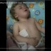
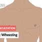

# Airway obstruction

*Categories: Clinical knowledge > Pediatrics > Pediatric ENT and pulmonology > Airway obstruction*

[Original Article Link](https://coursology-qbank.com/amboss/article/Pu0Wr3)

---

## Summary

An <u>upper airway</u> or <u>central airway</u> obstruction can be rapidly fatal. <u>Stridor</u> is a common clinical feature of <u>airway</u> obstruction and is a <u>red flag</u> for <u>respiratory failure</u> and <u>difficult airway management</u>. Patients with <u>respiratory distress</u> or <u>signs of respiratory failure</u> require immediate <u>airway management</u>, <u>respiratory support</u>, and/or treatment of rapidly reversible <u>causes of airway obstruction</u>. <u>Upper airway</u> obstruction is often managed with <u>endotracheal intubation</u>. <u>Central airway</u> obstruction may require <u>rigid bronchoscopy</u>, <u>flexible bronchoscopy</u>, and/or <u>endobronchial intubation</u>. Advanced evaluation and diagnostic testing are done only after <u>securing the airway</u> and/or excluding life-threatening <u>causes of airway obstruction</u>. <u>Airway</u> obstruction may be caused by infectious, inflammatory, or structural changes in the <u>airway</u> and/or neuromuscular conditions that reduce <u>airway</u> patency. <u>Airway</u> obstruction is <u>diagnosed clinically</u>, but <u>airway</u> endoscopy and imaging may be necessary to determine the specific etiology. Definitive treatment is based on the underlying cause.

<u>Distal airway</u> obstruction involving <u>bronchioles</u> and/or <u>alveoli</u> usually manifests with <u>wheezing</u>, and the causes and progression vary from those of upper and <u>central airway</u> obstruction. See “<u>Wheezing</u>” an approach and management specific to <u>distal airway</u> obstruction.

---

## Clinical features

### Clinical features of partial airway obstruction [[8]](https://coursology-qbank.com/amboss/article/3qXSy_)

* <u>Stridor</u>

* Noisy breathing

* <u>Stertor</u>

* Hoarse voice

* Gurgling from secretions

* <u>Hypoxia</u> or <u>hypercarbia</u>

* <u>Signs of increased work of breathing</u>

### Clinical features of complete airway obstruction [[8]](https://coursology-qbank.com/amboss/article/3qXSy_)

* Inability to speak or <u>cough</u>

* Inaudible breaths

* <u>Paradoxical movement of the chest</u> and abdomen

* Profound <u>hypoxia</u>

### Clinical features of central airway obstruction [[3]](https://coursology-qbank.com/amboss/article/v7dAnr0)[[4]](https://coursology-qbank.com/amboss/article/w7dhLr0)

* <u>Dyspnea</u> and <u>stridor</u> (most common)

* Prolonged and/or gradual onset of symptoms

* Unilateral <u>wheezing</u>

* Worsens with exercise  [[3]](https://coursology-qbank.com/amboss/article/v7dAnr0)

* Late signs: <u>dyspnea</u> at rest, <u>cough</u>, <u>wheezing</u>, diminished <u>sputum</u> production  [[3]](https://coursology-qbank.com/amboss/article/v7dAnr0)

> [!TIP]
> <u>Central airway</u> obstruction is easy to misdiagnose because it is less common than other <u>lower airway</u> diseases (e.g., <u>asthma</u>) but has similar clinical features. [[4]](https://coursology-qbank.com/amboss/article/w7dhLr0)

### Stridor [[9]](https://coursology-qbank.com/amboss/article/5bdi8o0)

<u>Stridor</u> is a harsh, high-pitched vibratory breath sound produced by <u>upper airway</u> obstruction.

* Inspiratory stridor 

* Typically caused by extrathoracic <u>airway</u> obstruction, most commonly at or above the <u>glottis</u>

* Characteristic of <u>epiglottitis</u>, <u>spasmodic croup</u>, <u>upper airway FBA</u>, bilateral <u>vocal cord palsy</u>

* Expiratory stridor

* Suggests intrathoracic <u>tracheal</u> obstruction

* Characteristic of <u>lower airway FBA</u>, <u>tracheal cancer</u>

* Inspiratory and expiratory (biphasic) <u>stridor</u>: suggests a fixed obstruction, typically <u>glottic</u> or <u>subglottic</u>

> [!WARNING]
> Although <u>stridor</u> is a key clinical feature of <u>airway</u> obstruction, it does not always occur.

baby with Croup Stridor Barking Cough visual & audio sound - When to Hospitalize.

### Stertor [[10]](https://coursology-qbank.com/amboss/article/AN1Rdh0)[[11]](https://coursology-qbank.com/amboss/article/MXdMAo0)

* Definition: a low-pitched flapping or snoring sound caused by nasal or <u>nasopharyngeal</u> obstruction [[10]](https://coursology-qbank.com/amboss/article/AN1Rdh0)[[11]](https://coursology-qbank.com/amboss/article/MXdMAo0)

* Common causes 

* <u>Laryngomalacia</u>

* <u>Nasal foreign body</u>

* Nasal congestion

* <u>Adenoid hypertrophy</u>

* <u>Nasal turbinate hypertrophy</u>

* <u>Nasolacrimal duct</u> cyst

* <u>Obstructive sleep apnea</u>

Obstructive sleep apnea

### <u>Wheezing</u>

* Definition: A prolonged, musical, high-pitched sound most commonly heard during expiration and typically caused by <u>distal airway</u> obstruction

* Common causes: See “<u>Wheezing</u>.”

> [!TIP]
> Differentiating <u>wheezing</u> from <u>expiratory stridor</u> is difficult. <u>Wheezing</u> is a musical sound produced primarily during expiration, whereas <u>expiratory stridor</u> is typically a single harsh, high-pitched expiratory sound. [[12]](https://coursology-qbank.com/amboss/article/PHdWqr0)

Sibilant Wheezing - Lung Auscultation - Episode 4 LC

---

## Infectious causes

|  Infectious causes of airway obstruction [[10]](https://coursology-qbank.com/amboss/article/AN1Rdh0)  |  |  |  |  |
| --- | --- | --- | --- | --- |
| Etiology | Cause | Characteristic clinical features | Diagnostics | Management |
|  <u>Croup</u> [[14]](https://coursology-qbank.com/amboss/article/pd1LIf0)  |  * Viral: primarily <u>parainfluenza viruses</u>   |   * Onset: 12–48 hours  * Appearance: well-appearing  * <u>Cough</u>: barking  * Voice: hoarse  * Difficulty <u>swallowing</u>/drooling: absent    |   * <u>Clinical diagnosis</u>  * <u>X-ray</u> neck: <u>steeple sign</u>    |   * Systemic <u>dexamethasone</u>  * Consider <u>nebulized epinephrine</u>.  * See “<u>Acute management checklist for croup</u>.”    |
|  <u>Epiglottitis</u> [[15]](https://coursology-qbank.com/amboss/article/x0dERo0)  |  * Bacterial  * <u>H. influenza</u> type B or nontypeable  * <u>S. pyogenes</u>  * <u>S. pneumoniae</u>  * <u>S. aureus</u>   |   * Onset: 4–12 hours  * Appearance  * Ill-appearing, <u>febrile</u>, <u>lethargic</u>  * <u>Tripod position</u>, <u>sniffing position</u>  * <u>Signs of poor tissue perfusion</u>  * <u>Cough</u>: absent  * Voice: muffled  * Difficulty <u>swallowing</u>/drooling: present    |   * <u>Clinical diagnosis</u>  * <u>X-ray</u> neck: <u>thumbprint sign</u>  * <u>Flexible laryngoscopy</u>    |   * Monitor for <u>airway</u> obstruction.  * Prepare for <u>difficult intubation</u>.  * Administer IV <u>antibiotics</u>.  * See “<u>Acute management checklist for epiglottitis</u>.”    |
|  <u>Diphtheria</u> [[6]](https://coursology-qbank.com/amboss/article/VbdGso0)[[16]](https://coursology-qbank.com/amboss/article/HbdKEo0)  |  * Bacterial: <u>C. diphtheriae</u>   |   * Onset: 4–5 days  * Appearance  * Ill-appearing  * <u>Cervical lymphadenopathy</u>  * Pseudomembrane on <u>posterior</u> <u>pharynx</u>  * <u>Cough</u>: barking  * Voice: hoarse  * Difficulty <u>swallowing</u>/drooling: present    |   * <u>X-ray</u> neck: <u>subglottic</u> narrowing  * Nasal and pharyngeal cultures    |   * Monitor for <u>airway</u> obstruction.  * Administer <u>diphtheria antitoxin</u> immediately.  * Initiate <u>antibiotic therapy</u>.  * See ”Management of <u>diphtheria</u>.”    |
|  <u>Bacterial tracheitis</u> [[6]](https://coursology-qbank.com/amboss/article/VbdGso0)[[17]](https://coursology-qbank.com/amboss/article/ZV1ZGf0)  |  * Bacterial  * <u>S. aureus</u> (most common)  * <u>H. influenzae</u>  * <u>S. pneumoniae</u>  * <u>S. pyogenes</u>  * <u>M. catarrhalis</u>   |   * Onset: 2–10 hours  * <u>Prodrome</u>: <u>URI symptoms</u>  * Appearance: ill-appearing, <u>febrile</u>  * <u>Cough</u>: productive  * Voice: hoarse  * Difficulty <u>swallowing</u>/drooling: absent    |   * <u>Clinical diagnosis</u>  * <u>Bronchoscopy</u> or <u>flexible laryngoscopy</u>  * <u>X-ray</u> neck: <u>subglottic</u> narrowing and/or <u>tracheal</u> wall irregularities    |   * Monitor for <u>airway</u> obstruction.  * Prepare for <u>difficult intubation</u>.  * Initiate <u>empiric antibiotic therapy</u>.  * See “<u>Acute management checklist for bacterial tracheitis</u>.”    |
|  <u>Retropharyngeal abscess</u> [[15]](https://coursology-qbank.com/amboss/article/x0dERo0)  |  * Bacterial (often polymicrobial)  * <u>Streptococcus</u> ssp.  * <u>Staphylococcus</u> ssp.  * <u>Anaerobes</u>   |   * Appearance  * Ill-appearing, <u>febrile</u>  * Unilateral neck swelling  * <u>Cervical lymphadenopathy</u>  * <u>Cough</u>: absent  * Voice: muffled  * Difficulty <u>swallowing</u>/drooling: present    |   * CT neck with contrast (first-line)  * <u>X-ray</u> neck: widened prevertebral space  * <u>Laryngoscopy</u>  * Wound/<u>abscess</u> culture    |   * See “<u>Emergency airway management of deep neck infections</u>.”  * See “<u>Acute management checklist for deep neck infections</u>.”    |

---

## Allergic or inflammatory causes

|  Allergic or inflammatory causes of airway obstruction [[10]](https://coursology-qbank.com/amboss/article/AN1Rdh0)  |  |  |  |
| --- | --- | --- | --- |
| Etiology | Characteristic clinical features | Diagnostics | Management |
|  <u>Spasmodic croup</u> [[18]](https://coursology-qbank.com/amboss/article/OH1IqR0)  |   * Barking <u>cough</u>  * Hoarse voice  * Nightly symptoms that resolve during the day    |   * <u>Clinical diagnosis</u>  * <u>X-ray</u> neck: <u>steeple sign</u>    |   * Systemic <u>dexamethasone</u>  * Consider <u>nebulized epinephrine</u>.  * See “<u>Acute management checklist for croup</u>.”  * Manage underlying cause (e.g., <u>GERD</u>).    |
|  <u>Angioedema</u> [[19]](https://coursology-qbank.com/amboss/article/C0dqRo0)  |   * Swelling of the face, <u>tongue</u>, oral <u>mucosa</u>, extremities, or genitalia  * <u>Urticaria</u>    |  * <u>Clinical diagnosis</u>   |   * Prepare for <u>difficult intubation</u>.  * Identify and treat underlying cause  * <u>Histamine-mediated angioedema treatment</u>  * <u>Bradykinin-mediated angioedema treatment</u>  * See “<u>Acute management checklist for angioedema</u>.”    |
|  <u>Anaphylaxis</u> [[20]](https://coursology-qbank.com/amboss/article/K1YU3L)  |   * Exposure to a known <u>allergen</u>  * Chest or throat tightness  * <u>Shortness of breath</u>, <u>cough</u>, <u>wheezing</u>  * <u>Hypotension</u>  * Abdominal <u>pain</u>, <u>nausea</u>, <u>vomiting</u>    |  * <u>Clinical diagnosis</u>   |   * Remove inciting <u>allergen</u>.  * Administer <u>IM epinephrine</u>.  * Monitor the <u>airway</u>.  * See “<u>Acute management checklist for anaphylaxis</u>.”    |
|  <u>Inhalation injury</u> [[21]](https://coursology-qbank.com/amboss/article/IbdYEo0)[[22]](https://coursology-qbank.com/amboss/article/mzcVtU0)  |   * Exposure to smoke, irritants, and/or <u>asphyxiants</u>  * <u>Cough</u>, <u>wheezing</u>  * <u>Chest pain</u>  * <u>Lacrimation</u>, <u>rhinorrhea</u>  * Burning sensation in the eyes, nose, and throat    |   * <u>ABG</u>  * <u>CO-oximetry</u>  * <u>X-ray</u> chest  * <u>Flexible laryngoscopy</u> and/or <u>bronchoscopy</u>    |   * Consider early <u>intubation</u>.  * Use <u>lung protective ventilation strategy</u>.  * See “<u>Inhalation injury</u>.”  * See “<u>Approach to asphyxiant and irritant exposure</u>.”    |
|  Autoimmune disease [[4]](https://coursology-qbank.com/amboss/article/w7dhLr0)  |   * <u>Clinical features of granulomatosis with polyarteritis</u>  * Clinical features of <u>amyloidosis</u>  * Clinical features of <u>pulmonary sarcoidosis</u>  * <u>Clinical features of relapsing polychondritis</u>    |   * <u>Serology</u> (e.g., <u>c-ANCA</u>)  * <u>Bronchoscopy</u> and <u>mucosal</u> <u>biopsy</u>  * Chest CT    |   * Provide <u>respiratory support</u>.  * Consult pulmonology.  * Treat the underlying condition.    |

---

## Structural causes

### Acquired

|  Acquired structural <u>causes of airway obstruction</u> [[10]](https://coursology-qbank.com/amboss/article/AN1Rdh0)  |  |  |  |
| --- | --- | --- | --- |
| Etiology | Characteristic clinical features | Diagnostics | Management |
|  <u>FBA</u> [[6]](https://coursology-qbank.com/amboss/article/VbdGso0)[[23]](https://coursology-qbank.com/amboss/article/YEYn8I)  |   * Witnessed or suspected <u>aspiration</u>  * Choking and/or <u>cough</u>  * <u>Hemoptysis</u>  * <u>Chest pain</u>  * <u>Signs of pneumonia</u>    |   * <u>X-ray</u> chest and neck  * CT chest  * <u>Laryngoscopy</u> and/or <u>bronchoscopy</u>    |   * Initiate <u>maneuvers to dislodge the aspirated FB</u>.  * Consider <u>laryngoscopy-guided FB retrieval</u>.  * See “<u>Acute management checklist for FBA</u>.”    |
|  Blood, vomit, and/or liquid <u>aspiration</u> [[24]](https://coursology-qbank.com/amboss/article/v9cA6e0)[[25]](https://coursology-qbank.com/amboss/article/EQ18Bg0)  |   * <u>Risk factors for aspiration</u>  * <u>Vomiting</u> or <u>hematemesis</u>  * Recent instrumentation of the upper <u>GI tract</u>  * Clinical features of <u>aspiration pneumonitis</u> (e.g., <u>bronchospasm</u>, <u>dyspnea</u>, <u>wheezing</u>, <u>hypoxia</u>)  * <u>Clinical features of ARDS</u>    |   * <u>Clinical diagnosis</u>  * <u>ABG</u>: <u>hypoxemia</u>  * Chest imaging (e.g., <u>CXR</u>): infiltrate in dependent lobes  * See “<u>Diagnostics of pulmonary aspiration</u>” for details.    |   * Standard <u>airway management</u>  * Oropharyngeal and <u>tracheal</u> suctioning  * <u>Supplemental O2</u>  * <u>Bronchodilators</u>  * See “<u>Treatment of pulmonary aspiration</u>” for details.  * See also “<u>Management of ARDS</u>.”    |
| <u>Tumor</u> |   * <u>Lymphadenopathy</u>  * Progressive <u>dysphagia</u> and/or <u>dysphonia</u>  * <u>Constitutional symptoms</u>  * <u>Clinical features of oral cavity cancer</u>  * <u>Clinical features of pharyngeal cancer</u>  * <u>Clinical features of laryngeal cancer</u>  * <u>Clinical features of lung cancer</u>    |   * Head and neck imaging (e.g., CT)  * Chest imaging  * Endoscopy  * See “<u>Overview of head and neck cancers</u>” for details.    |   * <u>Airway management of head and neck cancers</u>: <u>difficult airway management</u>, possible <u>emergency surgical airway</u>  * See “<u>Treatment of pharyngeal cancer</u>.”  * See “<u>Treatment of laryngeal cancer</u>.”  * See “<u>Oral cavity cancer</u>.”  * See “<u>Tracheal carcinoma</u>.”    |
|  <u>OSA</u> [[26]](https://coursology-qbank.com/amboss/article/xbdEDo0)  |   * <u>OSA risk factors</u> (e.g., <u>obesity</u>)  * <u>Clinical features of OSA</u> (e.g., <u>apneas</u>, snoring, daytime sleepiness)    |   * Screening with <u>STOP-BANG questionnaire</u>  * <u>Sleep study</u> for diagnostic confirmation  * See “<u>Diagnostics for OSA</u>.”    |   * <u>Airway management for OSA</u>: <u>ramp position</u>, <u>NIPPV</u> for <u>preoxygenation</u>, <u>difficult airway management</u>  * See “<u>Treatment of OSA</u>.”    |
|  Postextubation laryngeal edema [[27]](https://coursology-qbank.com/amboss/article/1Zb20H)[[28]](https://coursology-qbank.com/amboss/article/rbdfEo0)  |   * Manifests immediately after <u>extubation</u>  * <u>Signs of acute respiratory distress</u>    |  * <u>Clinical diagnosis</u>   |   * Signs of severe <u>respiratory distress</u>: Reintubate immediately.  * Respiratory status stable: Consider <u>nebulized epinephrine</u> and <u>systemic corticosteroids</u>.    |
|  <u>Laryngotracheal stenosis</u> [[29]](https://coursology-qbank.com/amboss/article/VadGjo0)[[30]](https://coursology-qbank.com/amboss/article/1ad2jo0)  |   * History of prolonged <u>tracheal intubation</u>  * <u>Stridor</u>, <u>respiratory distress</u>  * <u>Dysphonia</u>  * <u>Chronic cough</u>    |   * <u>Flexible laryngoscopy</u> and/or <u>bronchoscopy</u>  * CT head and neck    |   * Acute management: <u>endotracheal intubation</u> or <u>tracheostomy</u>  * Definitive management: surgical or endoscopic dilation and/or resection    |

### Congenital

| Congenital structural causes of airway obstruction |  |  |  |
| --- | --- | --- | --- |
|  | Distinguishing clinical features | Diagnosis | Management |
|  <u>Airway malacias</u> [[31]](https://coursology-qbank.com/amboss/article/OadIko0)  |   * <u>Stridor</u> exacerbated by <u>supine position</u>, <u>agitation</u>, crying, or increased respiratory effort  * <u>Growth faltering</u>  * Feeding difficulty  * <u>Dyspnea</u>    |   * <u>Bronchoscopy</u>  * <u>Flexible laryngoscopy</u>    |   * See “<u>Laryngomalacia</u>.”  * See “<u>Tracheomalacia</u>.”    |
| Syndromes with craniofacial abnormalities |   * <u>Pierre Robin syndrome</u>: <u>micrognathia</u>, feeding difficulty, <u>glossoptosis</u>, <u>cleft palate</u>  * <u>Treacher Collins syndrome</u>: facial asymmetry, <u>micrognathia</u>, feeding difficulty  * <u>Down syndrome</u>: small <u>oral cavity</u>, protruding <u>tongue</u>, other <u>clinical features of Down syndrome</u>    |   * Clinical evaluation  * <u>Genetic testing</u>    |   * <u>Difficult airway management</u>  * <u>Respiratory support</u>  * Surgical correction or reconstruction in select patients  * Treatment of the underlying condition    |
| Congenital <u>macroglossia</u> |   * Enlarged <u>tongue</u>  * Feeding difficulty  * Speech impairment  * Features of the underlying disorder (e.g., <u>Down syndrome</u>, <u>MEN 2B</u>, <u>Beckwith-Wiedemann syndrome</u>)    |   * Clinical evaluation  * Imaging for underlying causes    |   * <u>Difficult airway management</u>  * <u>Emergency surgical airway</u> may be required.  * <u>Respiratory support</u>  * Surgical correction for select patients  * Treatment of the underlying condition    |
| <u>Choanal atresia</u> |   * <u>Cyanosis</u> that is worse with feeding and relieved by crying  * Nasal obstruction at <u>birth</u>  * <u>Stertor</u>  * <u>Dyspnea</u>  * Features of <u>CHARGE syndrome</u>    |   * Failure of nasal catheter passage  * <u>CT scan</u> of nasal passages    |   * <u>OPA</u> placement and/or <u>endotracheal intubation</u>  * Surgical repair  * See “<u>Choanal atresia</u>.”    |
| Mass |   * <u>Lingual thyroid</u>  * <u>Hemangioma</u>  * <u>Thyroglossal duct cyst</u>  * <u>Branchial cleft cyst</u>  * <u>Laryngocele</u>    |   * Clinical evaluation  * Head and neck imaging (e.g., CT, <u>MRI</u>)  * Chest imaging (e.g., CT, <u>MRI</u>)    |   * <u>Difficult airway management</u>  * Surgical excision in select patients    |
| <u>Vascular ring</u> |   * <u>Stridor</u>  * Feeding difficulty  * Persistent respiratory symptoms    |   * CT or <u>MRI</u> <u>angiography</u>  * <u>Barium swallow</u>    |   * <u>Difficult airway management</u>  * Surgical correction  * See “<u>Double aortic arch</u>.”    |

---

## Neuromuscular causes

|  Neuromuscular <u>causes of airway obstruction</u> [[10]](https://coursology-qbank.com/amboss/article/AN1Rdh0)  |  |  |  |
| --- | --- | --- | --- |
| Etiology | Characteristic clinical features | Diagnostics | Management |
| <u>AMS and coma</u> |   * Depressed mental status (e.g., <u>GCS</u> ≤ 8, low <u>AVPU score</u>)  * <u>Clinical features of TBI</u>  * <u>Sedative hypnotic toxidrome</u> or <u>opioid toxidrome</u>  * Impaired <u>airway protective reflexes</u>    |   * <u>Clinical diagnosis</u> of <u>airway</u> compromise  * <u>Neuroimaging</u>  * Toxicological workup  * See “<u>Diagnostics for AMS</u>.”    |   * Usually standard <u>airway management</u> for <u>airway</u> protection  * <u>Intubation</u> with <u>C-spine immobilization</u> for trauma  * Caution for <u>intubation of patients with increased ICP</u>  * Treatment of reversible <u>critical causes of AMS and coma</u> (e.g., <u>naloxone for opioid overdose</u>, dextrose for <u>hypoglycemia</u>)  * See “<u>Initial management of AMS and coma</u>.”    |
| <u>Neuromuscular weakness</u> involving the <u>airway</u> |   * <u>Bulbar palsy</u>  * <u>Pseudobulbar palsy</u>  * Clinical features of the underlying <u>cause of neuromuscular weakness</u> (e.g., <u>myasthenia gravis</u>, <u>botulism</u>, <u>Miller-Fisher variant of GBS</u>, <u>brainstem</u> <u>stroke</u>)    |   * <u>Neuroimaging</u>  * <u>CSF analysis</u>  * <u>Serology</u> (e.g., <u>AChR-Ab</u>)  * See “<u>Diagnostics for neuromuscular weakness</u>.”    |   * <u>Airway management</u> for <u>airway</u> protection  * Avoid <u>depolarizing NMJ blockers</u>.  * See “<u>Acute stabilization for neuromuscular weakness</u>” for details.  * Manage the underlying <u>cause of neuromuscular weakness</u>.  * See also “<u>Acute or rapidly progressive causes of neuromuscular weakness</u>.”    |
|  Laryngospasm [[32]](https://coursology-qbank.com/amboss/article/RqdlyI0)  |   * Onset during <u>general anesthesia</u> or <u>procedural sedation</u>, especially induction or emergence  * <u>Clinical features of partial airway obstruction</u> rapidly progressing to <u>clinical features of complete airway obstruction</u>  * Resistance to <u>basic airway maneuvers</u>  * <u>Hypoxia</u>  * <u>Bradycardia</u>    |  * <u>Clinical diagnosis</u>   |   * <u>Jaw thrust maneuver</u> and placement of an <u>OPA</u> or <u>NPA</u>  * Removal of triggers (e.g., suctioning of secretions)  * <u>Positive pressure ventilation</u> (e.g., <u>CPAP</u> with 100% <u>FiO2</u> or <u>BMV</u> with <u>PEEP valve</u>)  * Deepening sedation (e.g., <u>propofol</u>)  * <u>NMJ blockers</u> (e.g., <u>succinylcholine</u>)  * Management of <u>reexpansion pulmonary edema</u> after relief of <u>laryngospasm</u>    |
|  <u>Vocal cord paralysis</u> [[33]](https://coursology-qbank.com/amboss/article/B0dzRo0)[[34]](https://coursology-qbank.com/amboss/article/W7WPk50)  |   * Preceding <u>iatrogenic</u> injury (e.g., <u>thyroid surgery</u>)  [[33]](https://coursology-qbank.com/amboss/article/B0dzRo0)  * <u>Inspiratory stridor</u>  [[6]](https://coursology-qbank.com/amboss/article/VbdGso0)  * Change in voice quality (e.g., <u>hoarseness</u>)  [[6]](https://coursology-qbank.com/amboss/article/VbdGso0)    |  * <u>Flexible laryngoscopy</u> (awake)   |   * Acute management:  * Monitor for <u>signs of airway compromise</u>  * <u>Intubation</u> may be required.  * Consult otolaryngology.  * Chronic management: tracheotomy and/or laryngeal <u>surgery</u>  * See also “<u>Vagus nerve palsy</u>.”    |

---