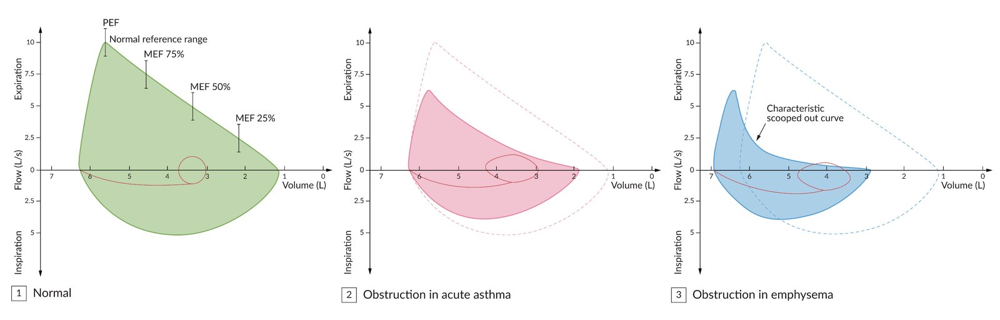
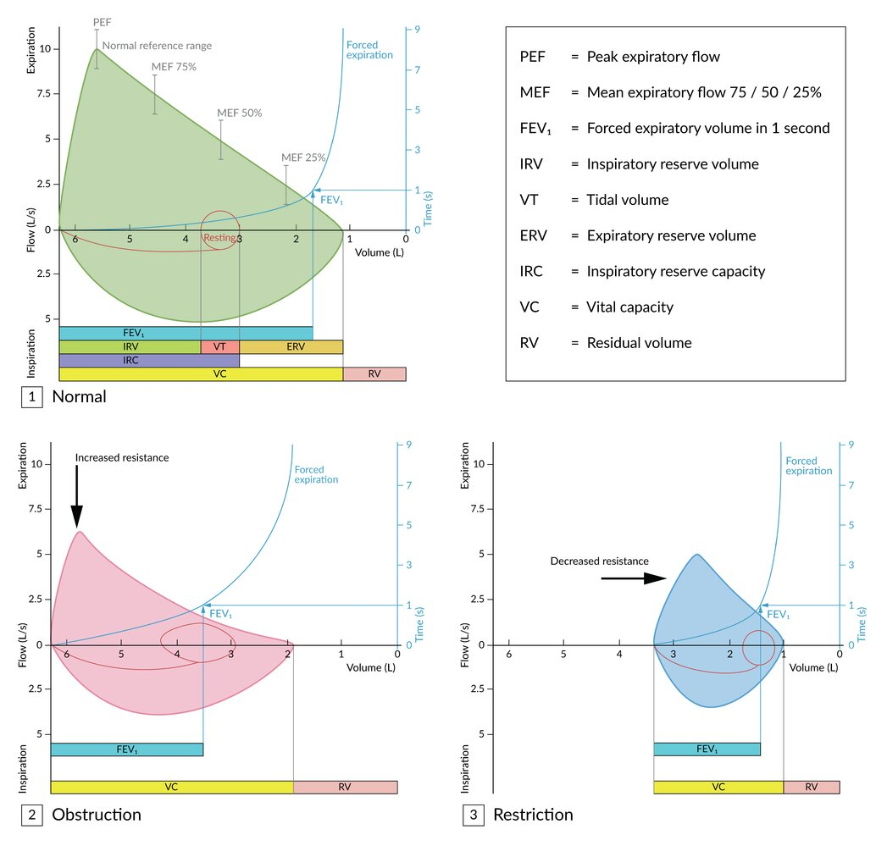
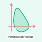
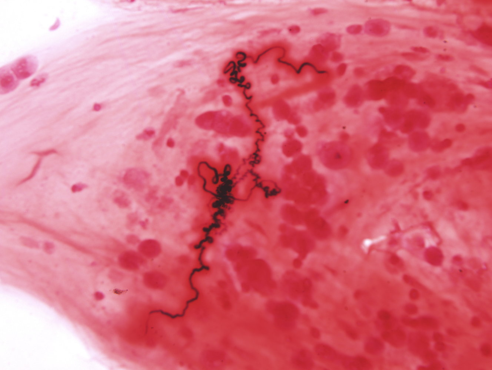
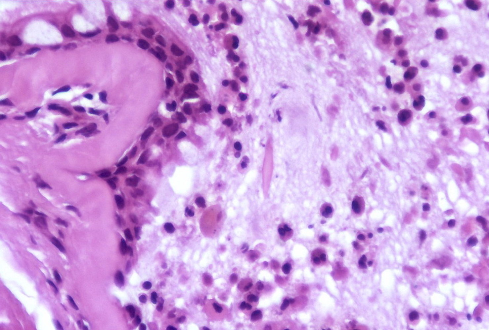
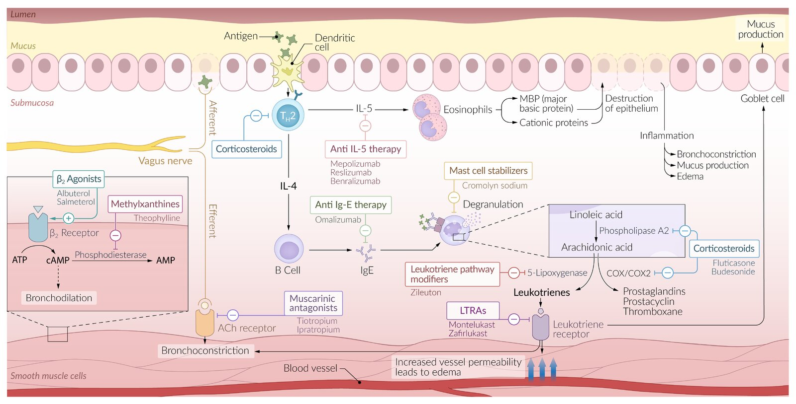

# Asthma

*Categories: Clinical knowledge > Pediatrics > Pediatric ENT and pulmonology > Asthma*

[Original Article Link](https://coursology-qbank.com/amboss/article/Ph0WVf)

---

## Summary

Asthma is a heterogeneous disease that is characterized by chronic <u>airway</u> inflammation and defined by a history of respiratory symptoms (e.g., <u>wheezing</u>, <u>shortness of breath</u>, chest tightness, <u>cough</u>). Symptom intensity and expiratory flow characteristically vary over time. Airflow limitation may become persistent in later stages. <u>Allergic asthma</u> often commences in childhood and is triggered by <u>allergens</u> such as pollen, dust <u>mites</u>, and certain foods. <u>Nonallergic asthma</u> and <u>adult-onset asthma</u> (which is typically nonallergic) can develop in individuals aged > 40 years. Triggers for asthma generally include cold air, medications (e.g., <u>aspirin</u>), exercise, and viral infections. <u>Clinical features of asthma</u> include <u>dyspnea</u>, <u>wheezing</u> (often end-expiratory), and <u>cough</u>. Symptoms characteristically worsen at night and/or on exposure to triggers. Symptoms and airflow limitation may abate in response to <u>asthma medications</u> or resolve upon removal of the trigger. Diagnosis in individuals ≥ 6 years of age is supported by variable expiratory airflow on <u>pulmonary function tests</u> (<u>PFTs</u>), e.g., by confirming significant variability in <u>FEV1</u> or <u>PEF</u> (e.g., after <u>bronchodilator</u> or over time). If <u>lung function testing</u> is not available or is normal in a patient with typical <u>asthma symptoms</u>, elevated <u>fractional exhaled nitric oxide</u> (<u>FeNO</u>) and/or blood <u>eosinophil</u> count are biomarkers that can be used to support the diagnosis. Additional tests may be performed to identify <u>asthma triggers</u> and comorbidities that increase the risk of acute exacerbations. <u>Management of asthma</u> in individuals ≥ 6 years of age is based on severity and primarily involves <u>inhaled corticosteroids</u> (<u>ICS</u>) and, often, <u>ICS</u>/<u>formoterol</u>. <u>Systemic glucocorticoids</u> are usually reserved for the treatment of <u>acute asthma exacerbations</u> but may be used in patients with <u>severe asthma</u>. Avoidance of <u>asthma triggers</u> and management of comorbidities (e.g., <u>rhinosinusitis</u>) are important to achieve symptomatic control and minimize the risk of exacerbations. Frequent follow-up is essential for monitoring response to therapy and for stepwise adjustment of treatment regimens.

“<u>Asthma in children ≤ 5 years of age</u>,” “<u>Acute asthma exacerbations</u>,” and “<u>Exercise-induced bronchoconstriction</u>” are discussed separately.

---

## Definitions

* Asthma: a respiratory disease that is characterized by chronic <u>airway</u> inflammation and manifests with variable respiratory symptoms and variable expiratory airflow

* <u>Acute asthma exacerbation</u>: a reversible worsening of the <u>clinical features of asthma</u> that develops over a short period of time and can progress to <u>life-threatening asthma</u>

---

## Epidemiology

* <u>Prevalence</u>

* 5–10% of the US population

* More common in Black than in White individuals

* For unknown reasons, the <u>prevalence</u> of asthma has been increasing over the past 20 years. [[1]](https://coursology-qbank.com/amboss/article/ULYbCp)

* Sex: differs depending on age of onset

* <u>♂</u> > <u>♀</u> in patients < 18 years

* <u>♀</u> > <u>♂</u> in patients > 18 years

* Age of onset 

* <u>Allergic asthma</u>: typically in childhood

* <u>Nonallergic asthma</u>: typically > 40 years

References:[[2]](https://coursology-qbank.com/amboss/article/nKa7Sl)

Epidemiological data refers to the US, unless otherwise specified.

---

## Etiology

* The exact etiology of asthma remains unknown.

* Risk factors for asthma include:

* <u>Atopy</u>

* <u>Allergies</u>

* Genetic predisposition

* Environmental and socioeconomic factors that increase exposure to <u>asthma triggers</u>, e.g., <u>pollution</u> from heating and cooking sources

| Asthma triggers |  |
| --- | --- |
| <u>Allergic asthma</u> (<u>extrinsic asthma</u>) | <u>Nonallergic asthma</u> (<u>intrinsic asthma</u>) |
|   * Cardinal <u>risk factor</u>: <u>atopy</u>  * Environmental <u>allergens</u>: pollen (seasonal), dust <u>mites</u>, domestic animals  , <u>mold</u> spores  * Allergic <u>occupational asthma</u> from exposure to <u>allergens</u> in the workplace (e.g., flour dust)    |   * Viral respiratory tract infections (one of the most common stimuli, especially in children) [[3]](https://coursology-qbank.com/amboss/article/LKawSl)  * Extreme weather (e.g., extreme cold, extreme heat)  * Physical exertion (laughter, <u>exercise-induced asthma</u>)  * <u>Gastroesophageal reflux disease</u> (<u>GERD</u>): often exists concurrently with asthma  * <u>Chronic sinusitis</u> or <u>rhinitis</u>  * Medication, e.g.:   * <u>Aspirin</u>  * <u>NSAIDs</u>  * <u>Beta blockers</u>  * <u>Stress</u>  * Irritant-induced <u>occupational asthma</u> (e.g., from exposure to solvents, <u>ozone</u>, tobacco or wood smoke, cleaning agents)    |

> [!NOTE]
> Childhood exposure to <u>secondhand smoke</u> increases the risk of developing asthma.

---

## Pathophysiology

### Common underlying pathophysiology

Asthma is an inflammatory disease driven by <u>T-helper</u> type 2 cells (<u>Th2-cell</u>) that manifests in individuals with a genetic predisposition. It consists of the following three pathophysiologic processes:

1. * Bronchial hyperresponsiveness
2. * Bronchial inflammation 

* Symptoms are primarily caused by inflammation of the <u>terminal bronchioles</u>, which are lined with <u>smooth muscle</u> but lack the <u>cartilage</u> found in larger <u>airways</u>.

* Overexpression of <u>Th2</u>-cells → inhalation of <u>antigen</u> results in production of <u>cytokines</u> (<u>IL-3</u>, <u>IL-4</u>, <u>IL-5</u>, <u>IL-13</u>) → activation of <u>eosinophils</u> and induction of cellular response (<u>B-cell</u> <u>IgE</u> production) → bronchial <u>submucosal</u> <u>edema</u> and <u>smooth muscle</u> contraction → <u>bronchioles</u> collapse [[4]](https://coursology-qbank.com/amboss/article/3LYSxp)[[5]](https://coursology-qbank.com/amboss/article/zLYrZJ)
3. * Endobronchial obstruction caused by:

* Increased <u>parasympathetic</u> tone

* Reversible <u>bronchospasm</u>

* Increased mucus production

* <u>Mucosal</u> <u>edema</u> and <u>leukocyte</u> infiltration into the <u>mucosa</u> with <u>hyperplasia</u> of <u>goblet cells</u>

* <u>Hypertrophy</u> of <u>smooth muscle cells</u>

### Type-specific pathophysiology

* <u>Allergic asthma</u>

* <u>IgE</u>-mediated <u>type 1 hypersensitivity</u> to a specific <u>allergen</u>

* Characterized by <u>mast cell</u> <u>degranulation</u> and release of <u>histamine</u> after a prior phase of sensitization

* <u>Nonallergic asthma</u>

* Irritant asthma: irritant enters <u>lung</u> → ↑ release of <u>neutrophils</u> → <u>submucosal</u> <u>edema</u> → <u>airway obstruction</u>

* <u>Aspirin-exacerbated respiratory disease</u> is characterized by the <u>Samter triad</u>:

* Inhibition of <u>COX-1</u> → ↓ <u>PGE2</u>;   → ↑ <u>leukotrienes</u> and inflammation → <u>submucosal</u> <u>edema</u> → <u>airway obstruction</u>

* <u>Chronic rhinosinusitis with nasal polyposis</u>

* <u>Asthma symptoms</u>

---

## Clinical features

* Typical features: variable; can occur sporadically or in response to an <u>asthma trigger</u> 

* Persistent, dry <u>cough</u> that worsens at night, with exercise, or on exposure to triggers/irritants (e.g., cold air, <u>allergens</u>, smoke)

* End-expiratory <u>wheezes</u>

* <u>Dyspnea</u> (<u>shortness of breath</u>)

* Chest tightness

* Prolonged expiratory phase on <u>auscultation</u>

* <u>Hyperresonance</u> to <u>lung percussion</u>

* Atypical features: See “Subtypes and variants.”

* Features of common comorbid conditions: : e.g., <u>atopic</u> conditions like <u>allergic rhinitis</u> or <u>eczema</u>

* <u>Acute asthma exacerbations</u>: covered in detail separately

> [!TIP]
> Characteristic examination findings may not be present between <u>asthma exacerbations</u>, especially in children. [[6]](https://coursology-qbank.com/amboss/article/8DdOTH0)

---

## Subtypes and variants

The following is a list of asthma <u>phenotypes</u> and variants.

* Allergic asthma

* Most common <u>phenotype</u>

* Begins with intermittent symptoms in childhood

* Triggered by <u>allergens</u>

* Usually associated with <u>atopy</u> (e.g., <u>eczema</u>, <u>rhinitis</u>)

* Responds well to <u>ICS</u>-containing treatment

* Nonallergic asthma

* Less common than <u>allergic asthma</u>

* Triggered by, e.g., viral <u>upper respiratory tract infections</u>, cold air, <u>GERD</u>

* Not associated with <u>atopy</u>

* Responds poorly to <u>ICS</u>-containing treatment

* Adult-onset asthma:

* An uncommon <u>phenotype</u> in which symptoms first manifest in adulthood

* Typically nonallergic

* Responds poorly to <u>ICS</u>-containing treatment

* Cough variant asthma: a type of asthma characterized by chronic dry <u>cough</u> without other typical <u>symptoms of asthma</u> (see also “<u>Cough</u>”)

* <u>Aspirin-exacerbated respiratory disease</u>

* <u>Asthma-COPD overlap</u>

* <u>Occupational asthma</u>

* Asthma with <u>obesity</u>: Some individuals with <u>obesity</u> and asthma exhibit prominent respiratory symptoms with little eosinophilic <u>airway</u> inflammation.

### Asthma-COPD overlap [[6]](https://coursology-qbank.com/amboss/article/8DdOTH0)

#### Definition [[6]](https://coursology-qbank.com/amboss/article/8DdOTH0)[[7]](https://coursology-qbank.com/amboss/article/I61Ym30)[[8]](https://coursology-qbank.com/amboss/article/zw1rlQ0)

<u>Asthma-COPD overlap</u> is the concurrent presence of features of asthma and <u>COPD</u>.  [[6]](https://coursology-qbank.com/amboss/article/8DdOTH0)[[7]](https://coursology-qbank.com/amboss/article/I61Ym30)[[8]](https://coursology-qbank.com/amboss/article/zw1rlQ0)

#### Clinical features [[6]](https://coursology-qbank.com/amboss/article/8DdOTH0)

* Chronic presentation, most commonly with intermittent or episodic symptoms

* Common symptoms include <u>cough</u>, <u>SOB</u>, chest tightness, and <u>wheezing</u>.

* Symptoms may:

* Worsen after exposure to common triggers for asthma, e.g., pollen

* Improve after use of <u>asthma medications</u>

* May develop in patients with a known history of asthma or <u>COPD</u>

> [!TIP]
> Individuals with <u>asthma-COPD overlap</u> experience more symptoms, more frequent exacerbations, and higher mortality than individuals with either asthma or <u>COPD</u> alone. [[6]](https://coursology-qbank.com/amboss/article/8DdOTH0)

#### Diagnostics [[6]](https://coursology-qbank.com/amboss/article/8DdOTH0)[[7]](https://coursology-qbank.com/amboss/article/I61Ym30)

* Take a comprehensive history, including smoking history and toxin exposure.

* All patients require <u>spirometry</u> and diagnostic studies for asthma and <u>diagnostic studies for COPD</u>, if not already performed.

* The diagnosis of <u>asthma-COPD overlap</u> can be made when all of the following criteria are met:  [[7]](https://coursology-qbank.com/amboss/article/I61Ym30)[[9]](https://coursology-qbank.com/amboss/article/D611M30)[[10]](https://coursology-qbank.com/amboss/article/Z91ZNQ0)

* Persistent airflow limitation (<u>FEV1/FVC</u> < 0.7) on <u>PFTs</u> (suggests <u>COPD</u>)

* History of asthma and/or some <u>clinical features of asthma</u>  [[9]](https://coursology-qbank.com/amboss/article/D611M30)

* Episodic nature of symptoms

> [!WARNING]
> Do not wait for diagnostic confirmation before initiating <u>treatment for asthma</u> in patients with suspected <u>asthma-COPD overlap</u>; untreated patients are at risk of life-threatening acute asthma attacks. [[6]](https://coursology-qbank.com/amboss/article/8DdOTH0)

> [!TIP]
> Asthma and <u>COPD</u> both cause an obstructive pattern on <u>PFTs</u>. A positive response to <u>post-bronchodilator testing</u> is more common in asthma, but reversibility of bronchoconstriction is not a reliable factor for differentiating between <u>COPD</u> and asthma. [[8]](https://coursology-qbank.com/amboss/article/zw1rlQ0)

#### Management [[6]](https://coursology-qbank.com/amboss/article/8DdOTH0)

* Refer to a pulmonologist for any of the following:

* Presence of symptoms atypical of asthma or <u>COPD</u>

* Suspected chronic <u>airway</u> disease but minimal <u>symptoms of asthma</u> or <u>COPD</u>

* Uncertain diagnosis or suspicion of an alternative diagnosis

* Comorbidities causing difficulty with work-up or management

* All other patients

* Initiate <u>asthma treatment</u> with low-dose or medium-dose <u>ICS</u>, even if the diagnosis is not yet confirmed.  [[6]](https://coursology-qbank.com/amboss/article/8DdOTH0)

* Add <u>LABA</u> and/or <u>LAMA</u> as needed for the treatment of <u>COPD</u> according to the <u>GOLD group</u> classification system.

* Optimize management of both underlying conditions with:

* <u>Adjunctive therapy for asthma</u> (e.g., reduce trigger exposure, have an <u>asthma action plan</u>)

* <u>Supportive measures for COPD</u> (e.g., <u>smoking cessation</u>, immunizations, <u>pulmonary rehabilitation</u>)

* If no improvement after 2–3 months, refer to a pulmonologist.

> [!WARNING]
> Patients with concurrent asthma and <u>COPD symptoms</u> should never be treated with a <u>LABA</u> or <u>long-acting muscarinic antagonist</u> (<u>LAMA</u>) alone; these must always be given in combination with an <u>ICS</u>. [[6]](https://coursology-qbank.com/amboss/article/8DdOTH0)

### Occupational asthma

#### Background

* Definition [[11]](https://coursology-qbank.com/amboss/article/PHWWq50)

* <u>Occupational asthma</u>: asthma that is induced by specific workplace <u>allergens</u> and/or irritants

* Work-exacerbated asthma: preexisting asthma that is worsened by specific workplace <u>allergens</u> and/or irritants

* <u>Epidemiology</u>

* The most commonly affected occupations include farmers, grain workers, and bakery workers.

* Up to 25% of <u>adult-onset asthma</u> is attributable to <u>occupational asthma</u>. [[6]](https://coursology-qbank.com/amboss/article/8DdOTH0)[[12]](https://coursology-qbank.com/amboss/article/fTWkJk0)

* Subtypes

* Sensitizer-induced (i.e., <u>IgE</u>-mediated, allergic): caused by exposure to high-molecular-weight (e.g., flour, animal <u>proteins</u>) and low-molecular-weight (e.g., diisocyanates) agents  [[12]](https://coursology-qbank.com/amboss/article/fTWkJk0)[[13]](https://coursology-qbank.com/amboss/article/2TWTJk0)

* Irritant-induced: caused by acute <u>inhalation injury</u> or repeated exposure to the irritant agent (e.g., vapors, gas, fumes)

* Reactive airways dysfunction syndrome: a type of irritant-induced <u>occupational asthma</u> characterized by the sudden onset of symptoms within 24 hours of exposure to a high concentration of corrosive gas, vapors, or fumes [[14]](https://coursology-qbank.com/amboss/article/WIWPb50)

#### Clinical features [[6]](https://coursology-qbank.com/amboss/article/8DdOTH0)

* <u>Asthma symptoms</u> develop in a working environment with sensitizers and/or irritants and improve when outside of the workplace.

* <u>Rhinitis</u> and <u>conjunctivitis</u> often precede <u>asthma symptoms</u>. [[13]](https://coursology-qbank.com/amboss/article/2TWTJk0)

* Exacerbations after repeat exposures can be severe.

#### Diagnostics [[6]](https://coursology-qbank.com/amboss/article/8DdOTH0)[[13]](https://coursology-qbank.com/amboss/article/2TWTJk0)[[15]](https://coursology-qbank.com/amboss/article/3HWSJ50)

Refer to a specialist for diagnostic confirmation.

* Obtain a comprehensive work exposure history.

* Confirm <u>diagnosis of asthma</u> with <u>PFTs</u>.

* Perform serial <u>peak expiratory flow</u> (<u>PEF</u>) monitoring: A decrease in <u>PEF</u> with exposure to the offending agent supports the diagnosis.

* Obtain <u>skin prick test</u> or <u>allergy</u>-specific serum <u>IgE</u> testing to identify the causative agent.

#### Treatment [[6]](https://coursology-qbank.com/amboss/article/8DdOTH0)

* Most important: Eliminate or reduce exposure to the offending agent (e.g., use of respiratory <u>PPE</u> or stop the exposure through work reassignment or removal of the agent).

* Provide <u>stepwise asthma treatment</u> with <u>ICS</u>-containing therapy.

#### Complications

* Persistent bronchial hyperresponsiveness

#### Prevention

* <u>Primary prevention</u>: reducing or avoiding exposure by removing, replacing, or isolating the <u>hazard</u>

* Screening: medical surveillance programs in the workplace (e.g., regular <u>spirometry</u>) for early detection of <u>occupational asthma</u>

---

## Diagnosis

“<u>Diagnosis of acute asthma exacerbation</u>” is covered separately. The following applies to individuals > 5 years of age. For younger children, see "<u>Diagnosis of asthma in children ≤ 5 years of age</u>".

### Approach [[6]](https://coursology-qbank.com/amboss/article/8DdOTH0)

* Perform <u>lung function tests</u> (e.g., <u>spirometry</u> or <u>PEF</u>) before and after use of a <u>bronchodilator</u>.

* Consider biomarkers (e.g., blood <u>eosinophil</u> count, <u>FeNO</u>) if <u>lung function tests</u> are normal or not available.

* Consider additional studies to rule out <u>differential diagnoses of asthma</u> and/or assess for comorbidities.

* Consult an asthma specialist if there is difficulty in confirming the diagnosis.

> [!TIP]
> <u>Spirometry</u> is the <u>gold standard test</u> for diagnosing asthma.

### Diagnostic confirmation [[6]](https://coursology-qbank.com/amboss/article/8DdOTH0)

* The presence of both of the following confirms the diagnosis (including in patients already receiving <u>ICS</u>):   [[6]](https://coursology-qbank.com/amboss/article/8DdOTH0)

* Typical <u>symptoms of asthma</u> that vary in severity

* Excessive variability in expiratory <u>lung function</u> parameters (<u>FEV1</u>, <u>PEF</u>)  [[6]](https://coursology-qbank.com/amboss/article/8DdOTH0)

* Expiratory airflow limitation (obstructive pattern) on <u>PFTs</u> further supports the diagnosis.

* Patients with typical symptoms, but non-variable <u>lung function</u> already receiving <u>ICS</u>: 

* Consider diagnostic biomarkers (i.e., blood <u>eosinophil</u> count or <u>FeNO</u>) to support the diagnosis.

* <u>Asthma diagnosis</u> is confirmed if stepping down treatment results in increased symptoms and excessive variability in <u>FEV1</u> and/or <u>PEF</u>.

* Review symptom control and repeat <u>lung function tests</u> in 2–4 weeks. [[6]](https://coursology-qbank.com/amboss/article/8DdOTH0)

* Consider tapering <u>ICS</u> by 25–50% or stopping other maintenance medication (if feasible).  [[6]](https://coursology-qbank.com/amboss/article/8DdOTH0)

> [!TIP]
> More variation or frequent instances of excessive variation in <u>PFTs</u> increase diagnostic certainty. [[6]](https://coursology-qbank.com/amboss/article/8DdOTH0)

Flow-volume loop in obstructive lung diseases

### <u>Spirometry</u> [[6]](https://coursology-qbank.com/amboss/article/8DdOTH0)

<u>Spirometry</u> can be paired with specialized tests in <u>obstructive lung diseases</u> (e.g., <u>bronchodilator responsiveness testing</u> or <u>bronchial challenge tests</u>).

* Indication: first-line test

* Supportive findings

* Expiratory airflow limitation (e.g., <u>post-bronchodilator</u> <u>FEV1</u> and <u>FEV1/FVC ratio</u>; ) below <u>LLN</u>

* Excessive variability in expiratory <u>lung function</u>, defined as ≥ 1 of the following:

* ↑ <u>FEV1</u> of ≥ 12% and ≥ 200 mL (reversibility of airflow obstruction), in response to either:  [[16]](https://coursology-qbank.com/amboss/article/fJ1kt30)[[17]](https://coursology-qbank.com/amboss/article/dLXo9A); 

* <u>Bronchodilator responsiveness testing</u>

* 4 weeks of <u>ICS</u>-containing therapy

* Variation in <u>FEV1</u> of ≥ 12% and ≥ 200 mL from one appointment to the next

* Response during <u>bronchial challenge testing</u> (may be ordered if initial <u>PFTs</u> are inconclusive)

* ↓ <u>FEV1</u> ≥ 20% from baseline with <u>methacholine challenge test</u>

* ↓ <u>FEV1</u> ≥ 15% from baseline with <u>hypertonic saline</u>, <u>hyperventilation</u>, or inhaled <u>mannitol</u>

* ↓ <u>FEV1</u> > 10% and > 200 mL from baseline with standardized exercise challenge

> [!TIP]
> A <u>bronchial challenge test</u> is sensitive but not specific for asthma. This test is most useful for ruling out asthma in patients with inconclusive <u>spirometry</u> results or in those with atypical symptoms and/or response to therapy. [[18]](https://coursology-qbank.com/amboss/article/fq1kB30)

Flow-volume loop in obstructive and restrictive lung diseases

Flow-volume loop in obstructive lung diseases

Pulmonary Function Testing: Pathological Findings

### Peak flow meter (PFM) [[6]](https://coursology-qbank.com/amboss/article/8DdOTH0)

* Indication: <u>Spirometry</u> is normal or not available.  [[6]](https://coursology-qbank.com/amboss/article/8DdOTH0)

* Technique: Use the same meter each time.  [[6]](https://coursology-qbank.com/amboss/article/8DdOTH0)

* Stand up, inhale deeply, close mouth around the PFM mouthpiece, and blow out as forcefully as possible.

* Note the level recorded on the meter.

* Repeat three times in succession.

* Record the highest reading every morning and evening.

* Supportive findings
* Excessive variability in expiratory <u>lung function</u>, defined as ≥ 1 of the following:

* Daily diurnal variability of <u>PEF</u> of > 10% (averaged over 2 weeks)

* An increase in <u>PEF</u> by ≥ 20% after any of the following:

* 4 weeks of <u>ICS</u>-containing therapy

* <u>Bronchodilator responsiveness testing</u>

* ↓ <u>PEF</u> from baseline while symptomatic

### Additional studies [[6]](https://coursology-qbank.com/amboss/article/8DdOTH0)

* Biomarkers of eosinophilic and/or allergic inflammation  [[6]](https://coursology-qbank.com/amboss/article/8DdOTH0)

* Fractional exhaled nitric oxide (<u>FeNO</u>): the concentration of <u>nitric oxide</u> in exhaled air

* May be elevated in response to <u>airway</u> inflammation (e.g., <u>allergic asthma</u>, <u>atopy</u>, <u>eosinophilic bronchitis</u>)  [[6]](https://coursology-qbank.com/amboss/article/8DdOTH0)[[19]](https://coursology-qbank.com/amboss/article/wKWhim0)

* Can also be elevated in response to other inflammatory conditions (e.g., <u>atopy</u>, <u>eosinophilic bronchitis</u>)

* <u>CBC</u>: ↑ blood <u>eosinophil</u> count

* <u>Allergy</u> workup: Obtain if <u>allergens</u> are suspected to play a significant role in exacerbations.

* <u>Antibody</u> testing: ↑ total <u>IgE</u>, ↑ <u>allergen-specific IgE</u> [[6]](https://coursology-qbank.com/amboss/article/8DdOTH0)

* <u>Skin</u> <u>allergy</u> tests: <u>skin prick testing</u> or intradermal <u>skin</u> testing [[3]](https://coursology-qbank.com/amboss/article/LKawSl)

* Clinical uses [[6]](https://coursology-qbank.com/amboss/article/8DdOTH0)

* ↑ Blood <u>eosinophil</u> count and/or ↑ <u>FeNO</u> support a <u>diagnosis of asthma</u> in patients with typical <u>asthma symptoms</u> who have normal <u>spirometry</u> and/or PFM.

* Normal results do not rule out asthma.

* Used to predict response to <u>asthma medications</u> (e.g., <u>biologics</u> in patients with <u>severe asthma</u>).

* Serum <u>alpha-1 antitrypsin</u> level: Obtain in individuals with <u>adult-onset asthma</u> or asthma that is unresponsive to treatment. [[20]](https://coursology-qbank.com/amboss/article/mMWV6N0)

* <u>Single-breath diffusion capacity</u>: : normal or ↑ <u>DLCO</u>

* <u>Sputum analysis</u> (not routinely recommended) 

* Curschmann spiral: a spiral mucus plug in <u>sputum</u> that is formed from shed <u>bronchial epithelium</u>

* Charcot-Leyden crystals: histopathologic finding in patients with eosinophilic inflammation and/or <u>proliferation</u>

* Creola bodies: aggregate of desquamated <u>epithelial</u> cells [[21]](https://coursology-qbank.com/amboss/article/TLY6Cp)

* Imaging studies (e.g., <u>HRCT</u>)

* Not routinely recommended; useful for differential diagnosis

* Usually normal; may reveal <u>air trapping</u> and bronchial thickness

Curschmann spirals

Charcot-Leyden crystal

---

## Differential diagnoses

For more information on the differential diagnoses below, see “<u>Differential diagnosis of chronic cough</u>,” “<u>Differential diagnosis of dyspnea</u>,” “<u>Differential diagnosis of acute asthma</u>,” and “<u>Wheezing in children</u>.”

* Pulmonary

* <u>COPD</u> or <u>asthma-COPD overlap</u>

* <u>Exercise-induced bronchoconstriction</u>

* <u>Allergic bronchopulmonary aspergillosis</u>

* <u>Cystic fibrosis</u>

* <u>Primary ciliary dyskinesia</u>

* <u>Bronchiectasis</u>

* <u>α1-antitrypsin deficiency</u>

* <u>Interstitial lung disease</u>

* <u>Central airway</u> obstruction

* Infection, e.g., <u>tuberculosis</u>, <u>pertussis</u>

* <u>Reactive airway disease</u>

* Cardiac

* <u>Heart failure</u>

* <u>Congenital heart disease</u>

* Upper respiratory

* <u>Upper airway cough syndrome</u>

* Laryngeal obstruction (e.g., <u>inhaled foreign body</u>)

* <u>Vocal cord dysfunction</u>

* Gastrointestinal: <u>GERD</u>

* Other

* Adverse effect of medication, e.g., <u>cough</u> due to <u>ACE inhibitors</u>

* <u>Hyperventilation</u>

> [!TIP]
> Consider <u>allergic bronchopulmonary aspergillosis</u> if respiratory symptoms worsen and/or features of <u>bronchiectasis</u> develop despite <u>asthma treatment</u>.

### <u>Comparison of asthma and COPD</u>

| Comparison of asthma and COPD |  |  |
| --- | --- | --- |
|  |  Asthma [[6]](https://coursology-qbank.com/amboss/article/8DdOTH0) |  <u>COPD</u> [[8]](https://coursology-qbank.com/amboss/article/zw1rlQ0) |
| Age at diagnosis |   * Usually in childhood or <u>adolescence</u>  * <u>Nonallergic asthma</u> typically manifests at > 40 years of age.    |  * Typically > 40 years   |
| Etiology |  * Allergic or nonallergic; see “<u>Asthma triggers</u>.”   |  * <u>Tobacco smoking</u> and/or exposure to <u>air pollution</u>   |
| Clinical presentation |   * Intermittent <u>wheezing</u>, <u>shortness of breath</u>, chest tightness, and/or <u>cough</u>  * Episodic <u>acute asthma exacerbations</u>  * Asymptomatic periods    |   * Chronic productive <u>cough</u>, <u>dyspnea</u>  * Symptoms are minimal or nonspecific until the disease reaches an advanced stage.  * Typically progressive over years    |
| <u>Flow volume loop</u> pattern on <u>PFTs</u> |  * Obstructive pattern   |  |
| Bronchial obstruction |   * Variable  * Longstanding asthma can lead to persistent airflow limitation with incomplete response to <u>bronchodilators</u>.    |   * Persistent  * Marked reversibility on <u>post-bronchodilator testing</u> is uncommon.    |
| First-line medication |  * <u>ICS</u>/<u>formoterol</u>   |  * <u>LABA</u> and/or <u>LAMA</u>   |

Flow-volume loop in obstructive lung diseases

### Reactive airway disease [[22]](https://coursology-qbank.com/amboss/article/2OcT7c0)

* Description

* A nonspecific term used to describe symptoms and findings that are similar to those of asthma (e.g., <u>wheezing</u>, <u>coughing</u>, <u>airway</u> <u>sensitivity</u>)

* Underlying conditions include asthma, <u>pneumonia</u>, <u>COPD</u>, and/or <u>bronchitis</u>

* Most commonly used in pediatric settings when asthma is suspected, but not yet confirmed

* Clinical features: <u>wheezing</u>, <u>coughing</u>, <u>dyspnea</u>, and/or <u>sputum</u> production

> [!TIP]
> Ascription of the label “<u>Reactive airway disease</u>” may prevent a thorough workup of the actual underlying condition and/or lead to the prescription of ineffective medication.

The differential diagnoses listed here are not exhaustive.

---

## Classification

The age cutoff used for the <u>diagnosis of asthma</u> in young children varies among guidelines. This section includes information for individuals > 5 years of age. For younger children, see "<u>Initial maintenance management of asthma in children ≤ 5 years</u>."

### <u>GINA</u> classification for individuals ≥ 6 years of age [[6]](https://coursology-qbank.com/amboss/article/8DdOTH0)

* Uncontrolled asthma (any of the following)

* Poor symptom control

* Exacerbations requiring oral <u>corticosteroids</u> ≥ 2 times per year

* Exacerbations requiring ≥ 1 hospitalization per year

* Difficult-to-treat asthma

* <u>Uncontrolled asthma</u> despite the use of medium- or high-dose <u>ICS</u> plus either a second controller (e.g., <u>LABA</u>) or maintenance oral <u>corticosteroid</u>

* Asthma controlled only by high-dose therapy

* May result from modifiable factors

* Severe asthma

* <u>Difficult-to-treat asthma</u> with either of the following:

* Uncontrolled symptoms despite optimized high-dose <u>ICS</u>/<u>LABA</u> therapy and management of modifiable contributory factors

* Worsens when high-dose treatment is reduced

* Use of this term may guide appropriate referral, further evaluation, and eligibility for advanced treatments (e.g., <u>biologics</u>).

* Mild or moderate asthma: use of these terms is discouraged; may be misinterpreted as indicating low risk  [[6]](https://coursology-qbank.com/amboss/article/8DdOTH0)

### American Thoracic Society/European Respiratory Society (<u>ATS</u>/<u>ERS</u>) task force severity classification for individuals ≥ 5 years of age  [[3]](https://coursology-qbank.com/amboss/article/LKawSl)[[23]](https://coursology-qbank.com/amboss/article/5CdisH0)[[24]](https://coursology-qbank.com/amboss/article/MCdMsH0)

The <u>National Asthma Education and Prevention Program</u> (<u>NAEPP</u>) guideline classifies <u>asthma severity</u> as intermittent or persistent in individuals who are not receiving <u>asthma maintenance therapy</u>. [[3]](https://coursology-qbank.com/amboss/article/LKawSl)

|  <u>Classification of asthma severity</u> in individuals ≥ 5 years of age  [[3]](https://coursology-qbank.com/amboss/article/LKawSl)  |  |  |  |
| --- | --- | --- | --- |
| Severity |  Impairment over the past 2–4 weeks   | <u>Lung function</u> | Exacerbation |
|  Intermittent asthma   |   * Symptom frequency: ≤ 2 days/week  * Waking up because of symptoms: ≤ 2 ×/month  * No limitation of daily activities  * Use of <u>short-acting beta agonist</u> (<u>SABA</u>) ≤ 2 days/week    |   * <u>FEV1</u> normal between exacerbations  * <u>FEV1</u> > 80% of the predicted average value  * <u>FEV1/FVC</u>  * Individuals ≥ 12 years: normal  * Children 5–11 years: > 85%    |  * ≤ 1 ×/year   |
| Mild persistent asthma |   * Symptom frequency: 3–6 days/week  * Waking up because of symptoms: 3–4 ×/month  * Minor limitation of daily activities  * Use of <u>SABA</u>  * Individuals ≥ 12 years: 3 days/week to 1 ×/day  * Children 5–11 years: > 2 days/week; not daily [[3]](https://coursology-qbank.com/amboss/article/LKawSl)    |   * <u>FEV1</u> ≥ 80% of the predicted average value  * <u>FEV1/FVC</u>  * Individuals ≥ 12 years: normal  * Children 5–11 years: > 80%    |  * ≥ 2 ×/year   |
| Moderate persistent asthma |   * Symptom frequency: daily  * Waking up because of symptoms 2–6 ×/week  * Some limitation of daily activities  * Use of <u>SABA</u> 7 days/week    |   * Predicted <u>FEV1</u> percent  * Individuals ≥ 12 years: 60–79%  * Children 5–11 years: 60–80%  * <u>FEV1/FVC</u>  * Individuals ≥ 12 years: reduced by 5%  * Children 5–11 years: 75–80%    |  |
| Severe persistent asthma |   * Symptoms throughout the day  * Waking up because of symptoms: often daily  * Extreme limitation of daily activities  * Use of <u>SABA</u> several times a day    |   * <u>FEV1</u> < 60% of the predicted average value  * <u>FEV1/FVC</u>  * Individuals ≥ 12 years: reduced by ≥ 5%  * Children 5–11 years: < 75%    |  |

> [!TIP]
> In individuals who are not receiving <u>asthma maintenance therapy</u>, severity is classified based on impairment over the previous 4 weeks, <u>lung function</u> (e.g., <u>spirometry</u>), and number of exacerbations in the past year. [[3]](https://coursology-qbank.com/amboss/article/LKawSl)

---

## Management

The following applies to individuals > 5 years of age. For younger children, see "<u>Initial maintenance management of asthma in children ≤ 5 years</u>."

### General principles [[6]](https://coursology-qbank.com/amboss/article/8DdOTH0)[[25]](https://coursology-qbank.com/amboss/article/uBdpcs0)

* Follow a step-wise approach to management.

* Manage comorbidities; reduce exposure to <u>asthma triggers</u> (see “Adjunctive therapy”).

* Schedule frequent follow-ups, e.g.: 

* Appointments: 1–3 months after initiating treatment, every 3–12 months thereafter

* <u>PFTs</u>: 3–6 months after initiating treatment, every 1–2 years once stable

* <u>Management of acute asthma exacerbation</u> and <u>management of exercise-induced bronchoconstriction</u> are discussed separately.

> [!TIP]
> Long-term <u>management of asthma</u> involves a continuous cycle of clinical assessment and adjustment of <u>stepwise asthma treatment</u>.

### Stepwise asthma treatment [[6]](https://coursology-qbank.com/amboss/article/8DdOTH0)[[25]](https://coursology-qbank.com/amboss/article/uBdpcs0)

Prescribe <u>asthma relievers</u> and maintenance <u>bronchodilators</u> depending on the severity and previous response to treatment. See “<u>Asthma pharmacotherapy for individuals age 12 years and older</u>,” “<u>Asthma pharmacotherapy for children age 6–11 years</u>,” and "<u>Maintenance management of asthma in children ≤ 5 years</u>."

* Before initiating treatment

* Document supporting evidence for <u>asthma diagnosis</u>, <u>asthma severity</u>, and <u>risk factors for asthma</u>.

* Provide education on proper inhaler technique.

* Before stepping up treatment

* Consider alternative causes for new or persistent symptoms.

* Assess adherence and review proper inhaler technique.

* Identify any persistent exposures to <u>asthma triggers</u>.

* Before stepping down treatment

* Consider stepping down treatment in patients with good symptom control and stable <u>lung function</u> for ≥ 3 months. [[6]](https://coursology-qbank.com/amboss/article/8DdOTH0)

* Optimize timing.

* Provide a written <u>asthma action plan</u>  and instructions for how and when to restart the previous regimen if symptoms worsen.

* Schedule a follow-up visit to evaluate progress.

### Indications for referral

For individuals > 5 years, refer to an asthma specialist if a patient has <u>risk factors for asthma</u>-related <u>death</u> or any of the indications listed below. For younger children, see "<u>Management of asthma in children ≤ 5 years</u>" for additional indications.

* Frequent exacerbations

* Treatment side effects

* Persistent or severe symptoms despite correct use of inhaler and adherence to <u>ICS</u>/<u>LABA</u>

* Need for advanced therapies, e.g., asthma <u>biologics</u>

### Overview of asthma medications [[3]](https://coursology-qbank.com/amboss/article/LKawSl)[[6]](https://coursology-qbank.com/amboss/article/8DdOTH0)[[26]](https://coursology-qbank.com/amboss/article/qlXCBy)

The goal of asthma pharmacotherapy is to counteract bronchoconstriction by reducing bronchial inflammation and <u>parasympathetic</u> tone.

* Asthma relievers

* Medications that are effective in <u>acute asthma exacerbation</u>

* Examples: <u>ICS</u>/<u>formoterol</u>, <u>SABAs</u>, <u>SAMAs</u>, <u>systemic glucocorticoids</u>

* Asthma maintenance therapy 

* Medications that are effective in the long-term <u>management of asthma</u>

* Examples: <u>ICS</u>/<u>formoterol</u>, <u>ICS</u>, <u>LAMA</u>, <u>leukotriene receptor antagonists</u>

> [!WARNING]
> Patients with asthma should not be on <u>LABAs</u> or <u>LAMAs</u> without an <u>ICS</u>. [[6]](https://coursology-qbank.com/amboss/article/8DdOTH0)

> [!TIP]
> <u>PRN</u> low-dose <u>ICS</u>/<u>formoterol</u> results in fewer severe exacerbations and ED visits than <u>PRN</u> <u>SABA</u> regimens regardless of baseline severity. [[6]](https://coursology-qbank.com/amboss/article/8DdOTH0)

### Commonly used asthma medication

|  Overview of commonly used asthma medications [[3]](https://coursology-qbank.com/amboss/article/LKawSl)[[6]](https://coursology-qbank.com/amboss/article/8DdOTH0)[[26]](https://coursology-qbank.com/amboss/article/qlXCBy)  |  |  |  |
| --- | --- | --- | --- |
| Class | Examples | Indications and uses | Mechanism |
| <u>ICS</u>/<u>LABA</u> (combination of <u>inhaled corticosteroid</u> and <u>long-acting beta agonist</u>) |  * <u>Budesonide</u>/<u>formoterol</u>   |  * Maintenance and reliever therapy   |  * Combination of action of <u>ICS</u> plus bronchodilation   |
|  * <u>Fluticasone</u>/<u>salmeterol</u>   |  * <u>Maintenance therapy</u>   |  |  |
|  <u>Inhaled corticosteroids</u> (<u>ICS</u>) [[3]](https://coursology-qbank.com/amboss/article/LKawSl)[[6]](https://coursology-qbank.com/amboss/article/8DdOTH0)  |   * <u>Budesonide</u>  * <u>Fluticasone</u>  * <u>Mometasone</u>  * Others: <u>beclomethasone</u>, ciclesonide, <u>triamcinolone</u>    |  * <u>Maintenance therapy</u>   |  * Inhibit <u>transcription factors</u> (e.g., <u>NF-κB</u>) → ↓ expression of proinflammatory <u>genes</u> (see “<u>Glucocorticoids</u>”)   |
| Short-acting <u>beta-2 agonists</u> (<u>SABA</u>) |   * Inhaled: <u>albuterol</u>  * Oral: <u>terbutaline</u>(not usually recommended, inhaled <u>SABAs</u> are preferred)    |  * Reliever therapy   |  * Dilation of bronchial <u>smooth muscles</u> (see “<u>long-acting beta agonists</u>”)   |
| <u>Long-acting beta-2 agonists</u> (<u>LABA</u>) |   * <u>Salmeterol</u>  * <u>Formoterol</u>    |   * <u>Maintenance therapy</u>  * Use in combination with <u>ICS</u>.    |  |
| <u>Short-acting muscarinic antagonists</u> (<u>SAMA</u>) |  * <u>Ipratropium bromide</u>   |  * Reliever therapy for severe and <u>life-threatening asthma</u> exacerbations   |  * <u>Competitively inhibit</u> <u>postganglionic</u> <u>muscarinic receptors</u> in bronchial <u>smooth muscle</u> → <u>bronchodilator</u>  (see “<u>Muscarinic antagonists</u>”)   |
| <u>Long-acting muscarinic antagonists</u> (<u>LAMA</u>) |  * <u>Tiotropium bromide</u>   |   * <u>Maintenance therapy</u>  * Use in combination with <u>ICS</u>.    |  |
| Oral <u>glucocorticoids</u> |   * <u>Methylprednisolone</u>  * <u>Prednisone</u> [[3]](https://coursology-qbank.com/amboss/article/LKawSl)  * <u>Equivalent dose</u> of other oral <u>glucocorticoids</u>    |   * <u>Severe persistent asthma</u>  * Management of <u>acute asthma exacerbations</u>  * 3–10 day burst to achieve control during a period of deterioration    |  * Inhibit <u>transcription factors</u> (e.g., <u>NF-κB</u>) → ↓ expression of proinflammatory <u>genes</u> (see “<u>Glucocorticoids</u>”)   |
| Leukotriene receptor antagonists (<u>LTRAs</u>) |   * Montelukast  * Zafirlukast    |   * <u>Exercise-induced asthma</u>  * <u>Aspirin-induced asthma</u>  * <u>Maintenance therapy</u> (particularly in children)    |  * Prevent <u>leukotrienes</u> from binding to their <u>G protein-coupled receptors</u> (<u>CysLT1</u>) → ↓ bronchoconstriction and inflammation   |

* See “<u>Side effects of glucocorticoid therapy</u>” for details.

* See “<u>Contraindications for glucocorticoid therapy</u>” for details.

* See “<u>Antimuscarinic side effects</u>” for details.

> [!NOTE]
> Adverse effects of <u>LABA</u> therapy can include <u>arrhythmias</u>, <u>tachycardia</u>, <u>tremor</u>, <u>hyperglycemia</u>, and <u>hypokalemia</u>.

> [!TIP]
> <u>Inhaled corticosteroids</u> do not take full effect until they have been used for approx. 1 week.

Mechanism of action: asthma medication

### Additional medications

These medications are typically reserved for patients under the care of a specialist.

| Overview of additional asthma drugs |  |  |  |  |
| --- | --- | --- | --- | --- |
| Agents |  |  | Indications and uses | Mechanism |
|  <u>Leukotriene</u> pathway modifiers (e.g., zileuton) [[27]](https://coursology-qbank.com/amboss/article/hdccpY0)  |  |   * <u>Exercise-induced asthma</u>  * <u>Aspirin-induced asthma</u>    |  |  * Inhibit <u>5-lipoxygenase</u> → ↓ production of <u>leukotrienes</u> → ↓ bronchoconstriction and inflammation   |
|  Mast cell stabilizers (chromones; e.g., cromolyn sodium)   [[28]](https://coursology-qbank.com/amboss/article/3dcSpY0)  |  |   * No longer recommended  * Previously used for preventive treatment before exercise    |  |  * Prevent release of inflammatory mediators from <u>mast cells</u>   |
| <u>Methylxanthines</u> (e.g., <u>theophylline</u>) |  |   * No longer routinely used, cardiotoxic, <u>neurotoxic</u>  [[6]](https://coursology-qbank.com/amboss/article/8DdOTH0)  * Minimally effective    |  |  * Inhibit <u>phosphodiesterase</u> (<u>PDE</u>) → ↑ <u>cAMP</u> levels → anti-inflammatory and mild bronchodilatory effect   |
| <u>Biologics</u> |  Anti-<u>IgE antibodies</u> (<u>omalizumab</u>) [[29]](https://coursology-qbank.com/amboss/article/RdclpY0)  |  * Refractory <u>severe asthma</u>   |  |   * Bind to serum <u>IgE</u> → ↓ expression of high-affinity <u>IgE</u> <u>receptors</u> (<u>FcεRI</u>) on <u>mast cells</u> and <u>basophils</u>  * Prevent binding of <u>IgE</u> to <u>FcεRI</u> → ↓ release of inflammatory mediators → ↓ asthma symptoms and exacerbations    |
|  <u>IL-4</u> <u>antibodies</u> (i.e., <u>dupilumab</u>) |  * Moderate to severe eosinophilic asthma   |  |  * Blocks the effects of cells that express IL-4Rα (e.g., <u>eosinophils</u>, <u>mast cells</u>, <u>macrophages</u>, <u>lymphocytes</u>) → blocks inflammatory responses (e.g., release of <u>cytokines</u>, <u>IgE</u>, and <u>nitric oxide</u>)   |  |
|  <u>IL-5</u> <u>antibodies</u> (e.g., <u>mepolizumab</u>, reslizumab, benralizumab) [[30]](https://coursology-qbank.com/amboss/article/idcJpY0)  |  * Refractory severe eosinophilic asthma   |  |  * Block the effects of <u>IL-5</u> on <u>eosinophils</u> → ↓ <u>chemotaxis</u> and ↓ cell differentiation, maturation, and activation   |  |

> [!WARNING]
> <u>Theophylline</u> is no longer routinely prescribed because of the risk of toxicity. It is used solely as an adjunctive or alternative therapy.

> [!WARNING]
> The following drugs are not effective during an <u>acute asthma attack</u>: <u>LABAs</u> without <u>ICS</u>, <u>leukotriene</u> pathway modifiers, <u>theophylline</u>, <u>mast-cell stabilizers</u>, and <u>biologics</u>.

---

## Pharmacotherapy for individuals age 12 years and older

| Preferred medications for <u>stepwise asthma treatment</u> for individuals ≥ 12 years of age |  |  |
| --- | --- | --- |
|  |  <u>GINA</u> 2025 [[6]](https://coursology-qbank.com/amboss/article/8DdOTH0) |  <u>NAEPP</u> 2020 [[26]](https://coursology-qbank.com/amboss/article/qlXCBy) |
| Step 1 |  * Symptoms < 4–5 days/week: <u>PRN</u> low-dose <u>budesonide</u>/<u>formoterol</u> (<u>off-label</u>) DOSAGE [[6]](https://coursology-qbank.com/amboss/article/8DdOTH0)   |  * <u>Intermittent asthma</u>: <u>PRN</u> <u>SABA</u>, e.g., <u>albuterol</u> DOSAGE   |
| Step 2 |  * <u>Mild persistent asthma</u>  * <u>PRN</u> <u>SABA</u>, e.g., <u>albuterol</u> DOSAGE  * PLUS scheduled low-dose <u>ICS</u> (e.g., <u>budesonide</u> DOSAGE )  * OR concomitant use of <u>PRN</u> <u>SABA</u> with <u>PRN</u> low-dose <u>ICS</u> [[26]](https://coursology-qbank.com/amboss/article/qlXCBy)   |  |
| Step 3 |  * Symptoms most days of the week or waking with symptoms ≥ 1 ×/week: scheduled and <u>PRN</u> low-dose <u>ICS</u>/<u>formoterol</u>, e.g., <u>budesonide</u>/<u>formoterol</u> (<u>off-label</u>) DOSAGE [[6]](https://coursology-qbank.com/amboss/article/8DdOTH0)   |  * <u>Moderate persistent asthma</u>:   * Preferred: scheduled and <u>PRN</u> low-dose <u>ICS</u>/<u>formoterol</u>, e.g., <u>budesonide</u>/<u>formoterol</u> DOSAGE [[26]](https://coursology-qbank.com/amboss/article/qlXCBy)  * Alternative: <u>PRN</u> <u>SABA</u> PLUS scheduled medium-dose <u>ICS</u> OR low-dose <u>ICS</u>-<u>LABA</u>   |
| Step 4 |  * Daily symptoms or waking with symptoms ≥ 1 ×/week and low <u>lung function</u>  * Scheduled medium-dose <u>budesonide</u>/<u>formoterol</u> DOSAGE  * PLUS <u>PRN</u> low-dose <u>budesonide</u>/<u>formoterol</u> (<u>off-label</u>) DOSAGE [[6]](https://coursology-qbank.com/amboss/article/8DdOTH0)   |  * <u>Moderate persistent asthma</u> not controlled with step 3 treatment: scheduled and <u>PRN</u> medium-dose <u>ICS</u>/<u>LABA</u>, e.g., <u>budesonide</u>/<u>formoterol</u> (<u>off-label</u>) DOSAGE [[26]](https://coursology-qbank.com/amboss/article/qlXCBy)   |
| Step 5 |   * Inadequate symptom relief with step 4 treatment (<u>difficult-to-treat asthma</u>)  * Encourage adherence to step 4 treatment and address modifiable factors (e.g., tobacco use, <u>obesity</u>).  * Consider <u>LAMA</u> (e.g., <u>tiotropium</u> DOSAGE).  * Consider a trial of high-dose <u>ICS</u>/<u>LABA</u> for 3–6 months.  * Refer patients with <u>severe asthma</u> to a specialist for assessment of the inflammatory <u>phenotype</u> using biomarkers (e.g., <u>FeNO</u>).  * Add-on therapies  for <u>severe asthma</u> include:  * <u>Biologics</u> (anti-<u>IgE</u>, anti-<u>IL-5</u>, anti-IL-5R, anti-IL-4R)  * <u>Azithromycin</u>  * Low-dose oral <u>glucocorticoids</u>  * <u>LTRAs</u>    |  * <u>Severe persistent asthma</u>  * Scheduled medium-dose to high-dose <u>ICS</u>/<u>LABA</u>, e.g., <u>budesonide</u>/<u>formoterol</u> (<u>off-label</u>) DOSAGE  * PLUS scheduled <u>LAMA</u>, e.g., <u>tiotropium</u> DOSAGE  * PLUS <u>PRN</u> <u>SABA</u>, e.g., <u>albuterol</u> DOSAGE [[26]](https://coursology-qbank.com/amboss/article/qlXCBy)   |
| Step 6 |  * N/A   |  * <u>Severe persistent asthma</u> not controlled with step 5 therapy  * Daily high-dose <u>ICS</u>/<u>LABA</u>, e.g., <u>budesonide</u>/<u>formoterol</u> [[26]](https://coursology-qbank.com/amboss/article/qlXCBy)  * PLUS oral <u>glucocorticoids</u>, e.g., <u>methylprednisolone</u> (<u>off-label</u>) DOSAGE OR <u>equivalent dose</u> of <u>prednisone</u> (<u>off-label</u>) , PLUS <u>PRN</u> <u>SABA</u>, e.g., <u>albuterol</u> DOSAGE [[26]](https://coursology-qbank.com/amboss/article/qlXCBy)   |

> [!WARNING]
> Advise patients to seek medical care if they require > 12 inhalations from their <u>ICS</u>/<u>LABA</u> inhaler in a single day. [[6]](https://coursology-qbank.com/amboss/article/8DdOTH0)

---

## Adjunctive therapy

Implementing <u>tertiary prevention</u> measures improves symptom control and decreases the frequency of <u>acute asthma exacerbations</u>. [[6]](https://coursology-qbank.com/amboss/article/8DdOTH0)[[26]](https://coursology-qbank.com/amboss/article/qlXCBy)

* Reduce exposure to triggers or <u>allergens</u>.

* Indoor/outdoor <u>allergens</u> (e.g., dust, pollen, dust <u>mites</u>)

* <u>Occupational exposure</u>

* Medications

* Consider <u>allergen immunotherapy</u> in <u>allergic asthma</u>.

* Manage comorbidities.

* <u>Obesity</u>

* <u>Rhinosinusitis</u> and <u>nasal polyps</u>

* <u>Anxiety</u> and <u>depression</u>

* <u>PPI</u> if <u>GERD</u> is suspected

* Reduce the risk of infection-induced exacerbations.

* Early treatment of infections in infection-triggered asthma

* Immunizations (<u>influenza</u>, <u>COVID-19</u>, <u>pneumococcal vaccines</u>)

* Lifestyle recommendations

* Provide information and tools for self-monitoring and self-management (e.g., written action plan, <u>peak flow meter</u>).

* Encourage physical activity.

* Encourage a diet rich in fruits and vegetables, e.g., <u>Mediterranean diet</u>, <u>DASH diet</u>

* <u>Smoking cessation</u>

* Promote strategies to reduce <u>stress</u>

* Social interventions  [[31]](https://coursology-qbank.com/amboss/article/1pX2o_)[[32]](https://coursology-qbank.com/amboss/article/WpXPo_)[[33]](https://coursology-qbank.com/amboss/article/dpXoo_)

* Screen for systemic <u>barriers to care</u> and socioeconomic/environmental <u>risk factors</u> contributing to poor outcomes.

* Provide support to enhance access to care, <u>treatment adherence</u>, and sustainable functional improvement.

---

## Special patient groups

* Asthma in pregnancy

* <u>Asthma symptoms</u> may be worse, better, or unchanged during <u>pregnancy</u>.

* Same stepwise management as with other patients

* Inhalation treatments preferred

* Poorly managed asthma can increase the risk of <u>pregnancy complications</u> (e.g., <u>preeclampsia</u>, <u>premature birth</u>, congenital abnormalities).

* Monthly monitoring of asthma is recommended.

* <u>Asthma management</u> in the perioperative patient [[6]](https://coursology-qbank.com/amboss/article/8DdOTH0)

* For elective <u>surgery</u>, optimize <u>stepwise treatment of chronic asthma</u>.

* Continue prescribed <u>ICS</u>-containing therapy through the perioperative period.

* Administer perioperative <u>hydrocortisone</u> for patients at high risk of <u>adrenal crisis</u>, e.g.:

* Patients on long-term high-dose <u>ICS</u>

* Patients on oral <u>glucocorticoids</u> for ≥ 2 weeks in the past 6 months [[6]](https://coursology-qbank.com/amboss/article/8DdOTH0)

* Asthma in young children: See "<u>Asthma in children ≤ 5 years of age</u>."

> [!TIP]
> Severe perioperative <u>bronchospasm</u> is uncommon but may be life-threatening. [[6]](https://coursology-qbank.com/amboss/article/8DdOTH0)

---