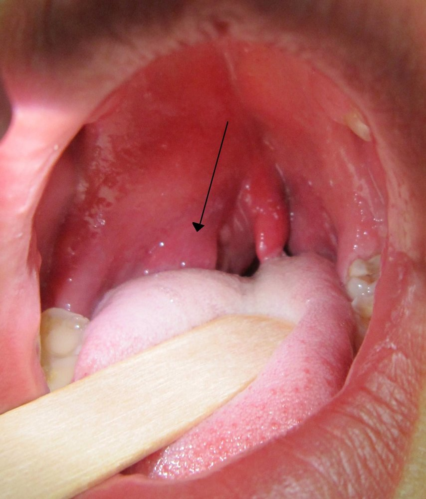
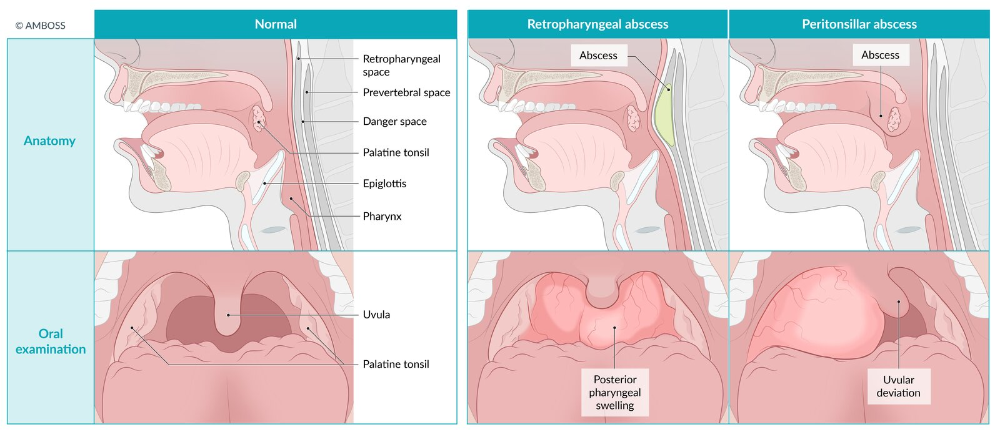
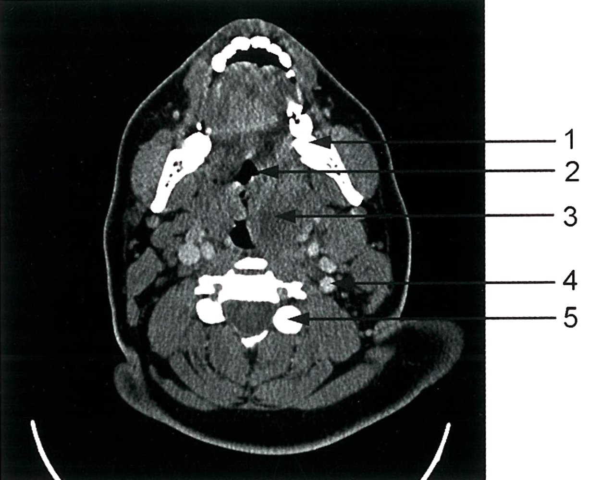
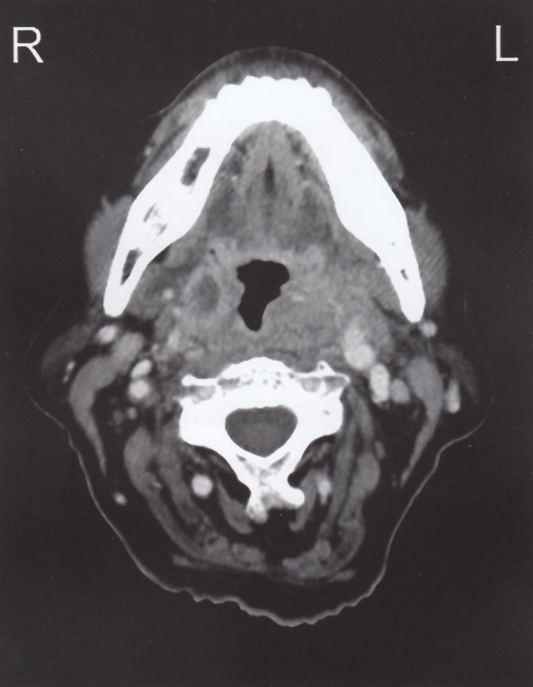
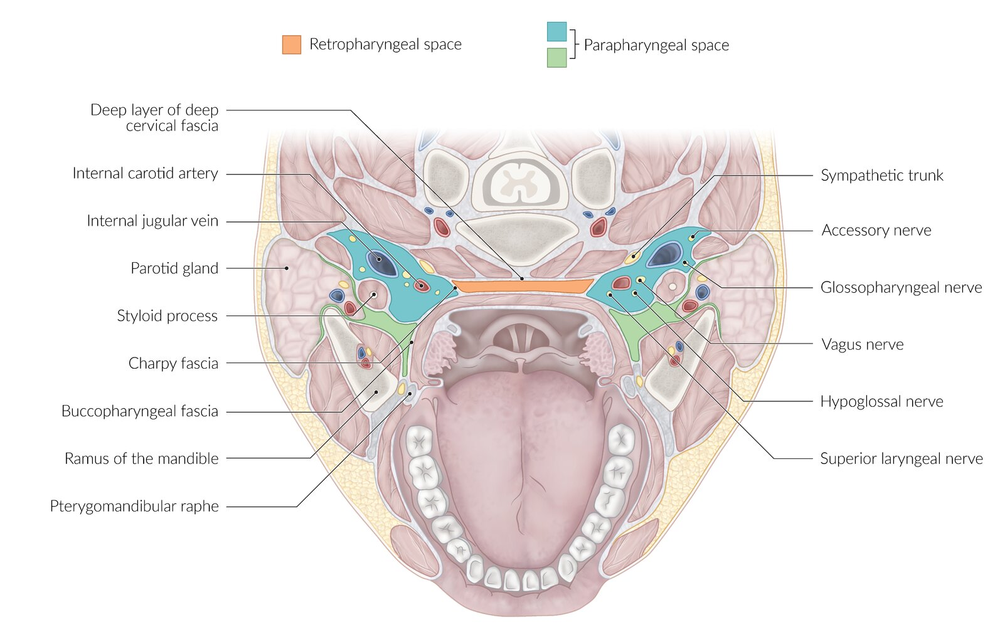
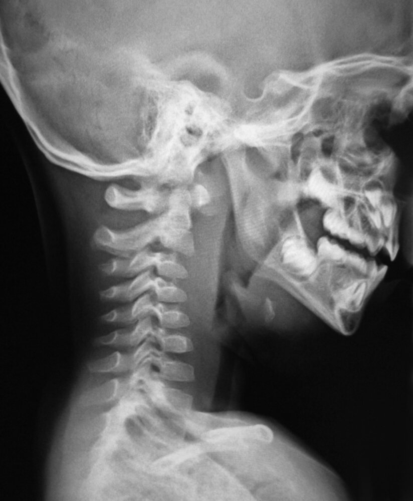

# Deep neck infections

*Categories: Clinical knowledge > Pediatrics > Pediatric ENT and pulmonology > Deep neck infections*

[Original Article Link](https://coursology-qbank.com/amboss/article/7M04Jg)

---

## Summary

Deep neck infections include <u>peritonsillar abscess</u>, <u>parapharyngeal abscess</u> (<u>PPA</u>), and <u>retropharyngeal abscess</u> (<u>RPA</u>). While uncommon, deep neck infections are clinically significant because of their potentially life-threatening complications, including the spread of infection to vital nearby structures and <u>airway</u> compromise. Consultation with <u>airway</u> specialists is recommended if there are <u>clinical features of airway compromise</u>. Early recognition, aggressive <u>airway management</u>, <u>broad-spectrum IV antibiotic</u> therapy, and urgent ENT consultation for <u>abscess</u> drainage and/or other surgical interventions reduce the risk of complications and <u>death</u> from <u>sepsis</u> or <u>airway</u> compromise.

---

## Overview

|  Overview of deep neck infections [[1]](https://coursology-qbank.com/amboss/article/7m04Sg)[[2]](https://coursology-qbank.com/amboss/article/6n1j8h0)  |  |  |  |
| --- | --- | --- | --- |
|  | <u>Peritonsillar abscess</u> | <u>Parapharyngeal abscess</u> | <u>Retropharyngeal abscess</u> |
| Definition |  * An accumulation of <u>pus</u> between the muscles of the <u>pharynx</u> and the palatine tonsillar capsule [[3]](https://coursology-qbank.com/amboss/article/JM1sph0)   |  * A collection of <u>pus</u> <u>lateral</u> to the peritonsillar space and divided anteriorly and posteriorly into pre- and post-styloid compartments [[2]](https://coursology-qbank.com/amboss/article/6n1j8h0)   |  * A collection of <u>pus</u> <u>anterior</u> to the <u>deep cervical fascia</u> and <u>posterior</u> to the <u>pharynx</u> [[2]](https://coursology-qbank.com/amboss/article/6n1j8h0)   |
| <u>Epidemiology</u> |   * Most common in <u>adolescents</u> and young adults  * Most common deep neck infection    |  * Most common in children < 5 years of age   |  * Most common in children < 5 years of age   |
| Etiology |  * <u>Acute tonsillitis</u>   |   * Dental infections (most common)  * <u>Acute tonsillitis</u>  * <u>Peritonsillar abscess</u>  * Pharyngeal or <u>salivary gland</u> infections    |   * Contiguous or lymphatic spread from <u>upper respiratory tract infections</u> (most common) or other nearby infections  * Local penetrating pharyngeal trauma    |
| Clinical Features |   * <u>Features of tonsillitis</u>  * “Hot potato” voice  * <u>Trismus</u>  * Uvula shifted to the <u>contralateral</u> side  * Inflamed <u>ipsilateral</u> tonsil: <u>fluctuant</u>, swollen, <u>erythematous</u> with <u>exudates</u> (<u>ipsilateral</u> bulging of the palatine arch)    |   * <u>Features of tonsillitis</u>  * Sometimes <u>trismus</u>  * <u>Medial</u> displacement of the <u>lateral</u> pharyngeal wall and tonsil (<u>posterior</u> space <u>abscess</u>) or indurated swelling below the angle of the <u>mandible</u> down to the <u>hyoid bone</u> (<u>anterior</u> space <u>abscess</u>)    |   * <u>Features of tonsillitis</u>  * Sometimes <u>trismus</u>  * Unilateral swelling of the <u>posterior</u> pharyngeal wall (possible <u>fluctuance</u>)  * Neck asymmetry, with neck swelling and <u>anterior</u> <u>cervical lymphadenopathy</u>(→ inability to extend neck)    |
| Diagnosis |  * <u>Clinical diagnosis</u>   |  * CT   |   * <u>Lateral</u> <u>x-ray</u>: widened prevertebral (<u>soft tissue</u>) space  * CT    |
| Treatment |   * <u>Airway management</u>  * IV <u>antibiotics</u>  * Surgical drainage    |  |  |

---

## Peritonsillar abscess

<u>Peritonsillar abscess</u>, also known as <u>quinsy</u>, is the most common deep neck infection.

### <u>Epidemiology</u> [[3]](https://coursology-qbank.com/amboss/article/JM1sph0)

* Most frequently occurs in adults aged 20–40 years

* Increased risk of <u>airway obstruction</u> in children with <u>peritonsillar abscess</u>

### Etiology [[7]](https://coursology-qbank.com/amboss/article/45034g)[[8]](https://coursology-qbank.com/amboss/article/V50GQg)

* Pathogens: <u>Streptococcus pyogenes</u> (most common), <u>Streptococcus anginosus</u>, <u>viridans streptococci</u>, <u>Staphylococcus aureus</u>, and <u>Haemophilus</u> species, often in a polymicrobial environment

* <u>Acute bacterial tonsillitis</u> (see <u>acute tonsillitis</u>)

### Clinical features [[8]](https://coursology-qbank.com/amboss/article/V50GQg)[[9]](https://coursology-qbank.com/amboss/article/e50xQg)

* Features of <u>tonsillitis</u>: <u>fever</u>, <u>malaise</u>, severe <u>sore throat</u>, <u>dysphagia</u>, and <u>odynophagia</u>

* “Hot potato” voice (muffled speech), drooling, or <u>halitosis</u>

* <u>Trismus</u>

* Uvula shifted to the <u>contralateral</u> side, with inferior and <u>medial</u> displacement of tonsil

* Unilateral <u>fluctuant</u>, swollen, <u>erythematous</u> tonsil with <u>exudates</u> (<u>ipsilateral</u> bulging of the palatine arch)

* <u>Ipsilateral</u> <u>ear</u> <u>pain</u>

* <u>Ipsilateral</u> <u>cervical lymphadenopathy</u> (and neck swelling)

> [!TIP]
> Palpate with a gloved index finger for peritonsillar <u>fluctuance</u> to distinguish an <u>abscess</u> from <u>cellulitis</u>. [[10]](https://coursology-qbank.com/amboss/article/3wYSir)

Peritonsillar abscess

Retropharyngeal abscess and peritonsillar abscess

### Diagnostics [[3]](https://coursology-qbank.com/amboss/article/JM1sph0)[[11]](https://coursology-qbank.com/amboss/article/hn1cGh0)

<u>Peritonsillar abscess</u> is typically a <u>clinical diagnosis</u>; obtain imaging if there is diagnostic uncertainty and/or concern for complications.

#### Microbiological studies

* <u>Bacterial culture</u> of <u>abscess</u> <u>aspirate</u> can help to direct therapy for the causative <u>pathogen</u>.

* Obtain a <u>rapid group A streptococcus antigen detection test</u>. [[12]](https://coursology-qbank.com/amboss/article/Nq1-A30)

* Consider obtaining <u>EBV serology</u> to rule out <u>infectious mononucleosis</u>.

> [!TIP]
> Evidence of <u>pus</u> on needle <u>aspiration</u> confirms the diagnosis.

#### Imaging [[3]](https://coursology-qbank.com/amboss/article/JM1sph0)

* <u>Ultrasound</u> neck (intraoral or transcutaneous) [[13]](https://coursology-qbank.com/amboss/article/Rn1lGh0)

* Indication: diagnostic uncertainty

* Findings: irregular <u>hypoechoic</u> cavity with a defined circumference

* CT or <u>MRI</u> neck with IV contrast [[14]](https://coursology-qbank.com/amboss/article/3n1SGh0)

* Indication: clinical suspicion of other diagnoses or complications

* Findings

* Fluid collection adjacent to tonsil with <u>rim enhancement</u>

* Uvula deviation

* May show extension of <u>abscess</u> beyond the peritonsillar space [[3]](https://coursology-qbank.com/amboss/article/JM1sph0)

* May show complications (e.g., internal jugular <u>thrombosis</u>, <u>carotid sheath</u> <u>abscess</u> <u>erosion</u>)

Peritonsillar mass

### Treatment [[3]](https://coursology-qbank.com/amboss/article/JM1sph0)[[11]](https://coursology-qbank.com/amboss/article/hn1cGh0)

* Patients with <u>respiratory distress</u>: prompt <u>airway management</u>

* Systemic <u>antibiotics</u> (IV or oral) with <u>abscess</u> drainage are the mainstay of therapy.

* Consult ENT and/or <u>oral maxillofacial surgery</u> for consideration of <u>abscess</u> drainage.

* Provide <u>supportive care</u> (e.g., <u>pain management</u>, <u>antipyretic therapy</u>, <u>IV fluid therapy</u>)

* Consider <u>corticosteroids</u> (e.g., <u>dexamethasone</u> DOSAGE) to reduce inflammation.  [[3]](https://coursology-qbank.com/amboss/article/JM1sph0)[[15]](https://coursology-qbank.com/amboss/article/pn1L8h0)

#### <u>Antibiotic therapy</u> [[3]](https://coursology-qbank.com/amboss/article/JM1sph0)

* Start <u>empiric antibiotic therapy</u> for deep neck infections.

* Target coverage for aerobes (e.g., <u>Streptococcus</u> spp.) and <u>anaerobes</u>.

* E.g., <u>clindamycin</u>  DOSAGE or <u>ampicillin/sulbactam</u> DOSAGE)  [[3]](https://coursology-qbank.com/amboss/article/JM1sph0)

* Tailor to <u>culture and sensitivity</u> results.

* Duration: 10–14 days

#### <u>Abscess</u> drainage [[3]](https://coursology-qbank.com/amboss/article/JM1sph0)

* Indications [[10]](https://coursology-qbank.com/amboss/article/3wYSir)

* Obvious <u>abscess</u> (unless it is < 1 cm and there is no drooling, <u>trismus</u>, or muffled voice)

* Suspected <u>abscess</u> with <u>signs of sepsis</u> or <u>signs of airway compromise</u>

* Lack of rapid response to medical therapy

* Contraindications: severe <u>trismus</u>, <u>coagulopathy</u> [[10]](https://coursology-qbank.com/amboss/article/3wYSir)

* Method 

* Preferred: needle <u>aspiration</u> or <u>incision and drainage</u>

* <u>Tonsillectomy</u>: may be indicated in certain groups of children and/or for recurrent or treatment-resistant <u>abscesses</u>  [[3]](https://coursology-qbank.com/amboss/article/JM1sph0)[[16]](https://coursology-qbank.com/amboss/article/uybpSw)

### Complications  [[17]](https://coursology-qbank.com/amboss/article/550ikg)[[18]](https://coursology-qbank.com/amboss/article/N50-4g)

* Can become life-threatening due to <u>airway</u> compromise

* Further spread of infection into the parapharyngeal space (<u>PPA</u>), <u>retropharyngeal space</u> (<u>RPA</u>), <u>mediastinum</u> (<u>mediastinitis</u>), or <u>fascia</u> (<u>necrotizing fasciitis</u>)

* <u>Aspiration pneumonia</u>

* <u>Internal jugular vein thrombosis</u> or <u>thrombophlebitis</u>

* <u>Bacteremia</u> and <u>sepsis</u>

### Disposition [[15]](https://coursology-qbank.com/amboss/article/pn1L8h0)[[19]](https://coursology-qbank.com/amboss/article/2n1Tsh0)

* Outpatient management may be appropriate, unless there are risks for complications  or previous outpatient therapy was unsuccessful.

* Consider admission for patients who, e.g.: [[6]](https://coursology-qbank.com/amboss/article/AN1Rdh0)

* Have <u>sepsis</u>, <u>immunocompromise</u>, and/or <u>signs of airway compromise</u>

* Have evidence of <u>abscess</u> extension beyond the peritonsillar region on CT

---

## Parapharyngeal abscess

### <u>Epidemiology</u> [[20]](https://coursology-qbank.com/amboss/article/U50bjg)

* Most common in children < 5 years of age

* <u>♂</u> > <u>♀</u>

### Etiology [[7]](https://coursology-qbank.com/amboss/article/45034g)

* Pathogens: <u>streptococci</u> (<u>viridans streptococci</u>, <u>S. pneumoniae</u>), <u>staphylococci</u> (including <u>MRSA</u>), <u>Haemophilus influenzae</u>, oral <u>anaerobes</u> (peptostreptococci, <u>Bacteroides</u> species), often in a polymicrobial environment

* Oropharyngeal infections

* Dental infections (most commonly)

* <u>Acute tonsillitis</u>

* <u>Peritonsillar abscess</u> through the <u>superior constrictor muscle</u> into the parapharyngeal space

* Pharyngeal or <u>salivary gland</u> infections

### Clinical features [[21]](https://coursology-qbank.com/amboss/article/f50kjg)

* Features of <u>peritonsillar abscess</u>, especially <u>trismus</u>

* <u>Posterior</u> space <u>abscess</u>: <u>medial</u> displacement of the <u>lateral</u> pharyngeal wall and tonsil

* <u>Anterior</u> space <u>abscess</u>: indurated swelling below the angle of the <u>mandible</u> down to the <u>hyoid bone</u>

* <u>Respiratory distress</u>: <u>dyspnea</u>, <u>stridor</u>

* Limited cervical neck extension

### Diagnostics [[2]](https://coursology-qbank.com/amboss/article/6n1j8h0)[[15]](https://coursology-qbank.com/amboss/article/pn1L8h0)

* Imaging: required for diagnostic confirmation [[22]](https://coursology-qbank.com/amboss/article/P-YWx7)

* CT neck with IV contrast (preferred) may show:  [[22]](https://coursology-qbank.com/amboss/article/P-YWx7)[[23]](https://coursology-qbank.com/amboss/article/Ln1wFh0)

* <u>Hypodense</u> collection with <u>rim enhancement</u> in the <u>lateral</u> pharyngeal space

* Single or multiloculated lesion with central fluid and/or air

* <u>MRI</u> neck [[2]](https://coursology-qbank.com/amboss/article/6n1j8h0)

* Indication: concern for complications

* Findings: similar to CT but with better visualization of <u>soft tissue</u> (e.g., for <u>cellulitis</u>) [[15]](https://coursology-qbank.com/amboss/article/pn1L8h0)

* Microbiological studies (e.g., <u>bacterial culture</u> of <u>abscess</u> <u>aspirate</u>): can help to direct therapy for the causative <u>pathogen</u>

Parapharyngeal inflammation with abscess

Peripharyngeal space

### Treatment [[23]](https://coursology-qbank.com/amboss/article/Ln1wFh0)[[24]](https://coursology-qbank.com/amboss/article/Fn1gEh0)

Systemic IV <u>antibiotics</u> with <u>abscess</u> drainage and <u>supportive care</u> are the mainstays of therapy.

* Patients with <u>respiratory distress</u>: prompt <u>airway management</u>

* Start empiric IV <u>broad-spectrum antibiotics</u>: see “<u>Empiric antibiotic therapy for deep neck infections</u>” for more detail and dosing.

* Switch to <u>targeted antibiotics</u> based on <u>culture and sensitivity</u> results.

* Most patients require surgical drainage or image-guided drainage: Consult ENT and/or <u>oral maxillofacial surgery</u>.

* Provide <u>supportive care</u> (e.g., <u>pain management</u>, <u>antipyretic therapy</u>, <u>IV fluid therapy</u>)

* Consider <u>corticosteroids</u> (e.g., <u>dexamethasone</u> DOSAGE) to reduce inflammation.  [[3]](https://coursology-qbank.com/amboss/article/JM1sph0)[[15]](https://coursology-qbank.com/amboss/article/pn1L8h0)

* Consult dentistry for <u>abscesses</u> with an <u>odontogenic</u> source for possible removal of the infected <u>tooth</u>.

* Patients should be managed as inpatients.

> [!TIP]
> <u>Conservative treatment</u> with IV <u>antibiotics</u> alone may be considered in select patients (e.g., clinically stable patients with a small <u>abscess</u>).

### Complications [[7]](https://coursology-qbank.com/amboss/article/45034g)

* <u>Airway obstruction</u>

* Spread of infection to <u>retropharyngeal space</u>, <u>carotid sheath</u> (presents with <u>torticollis</u>) and then <u>mediastinum</u> (<u>internal carotid artery</u> <u>erosion</u> jugular <u>vein</u> <u>thrombophlebitis</u>, and <u>mediastinitis</u>), or <u>cranial nerves</u> (<u>Horner syndrome</u>, <u>hoarseness</u>, unilateral <u>paresis</u> of the <u>tongue</u>, and other neurologic deficits)

* <u>Aspiration pneumonia</u> with spontaneous <u>pus</u> drainage

* <u>Bacteremia</u> and <u>sepsis</u>

> [!WARNING]
> Parapharyngeal infections can become life-threatening because of their proximity to the <u>retropharyngeal space</u>, <u>carotid sheath</u>, and <u>airway</u>!

---

## Retropharyngeal abscess

### <u>Epidemiology</u> [[20]](https://coursology-qbank.com/amboss/article/U50bjg)[[25]](https://coursology-qbank.com/amboss/article/350SPg)

* Generally the most dangerous deep neck infection

* Most common in children < 5 years of age

* <u>♂</u> > <u>♀</u>

* Overall <u>incidence</u> in the U.S. has increased.

### Etiology [[26]](https://coursology-qbank.com/amboss/article/m50Vkg)

* <u>Pathogen</u>: <u>streptococci</u> (<u>viridans streptococci</u>, <u>S. pneumoniae</u>), <u>staphylococci</u> (including <u>MRSA</u>), <u>Haemophilus influenzae</u>, oral <u>anaerobes</u> (peptostreptococci, <u>Bacteroides</u> species), often in a polymicrobial environment

* Direct or indirect causes

* Contiguous or lymphatic spread from oral (most common) or <u>upper respiratory tract infections</u>

* Local penetrating pharyngeal trauma;  (e.g., from small bones such as of fish or chicken, or medical instruments)

* Spread from other deep neck infections (<u>nasopharynx</u>, sinuses, <u>adenoids</u>)

### Clinical features [[27]](https://coursology-qbank.com/amboss/article/O50I4g)

* <u>Features of tonsillitis</u> and <u>trismus</u> (minimal)

* Neck asymmetry with unilateral swelling of the <u>posterior</u> pharyngeal wall;  (possible <u>fluctuance</u>)  → inability to extend neck

* <u>Torticollis</u>

* <u>Anterior</u> <u>cervical lymphadenopathy</u>

* <u>Respiratory distress</u>

* <u>Infants</u> may also present with <u>lethargy</u>, <u>cough</u>, poor intake, <u>rhinorrhea</u>, and <u>agitation</u>.

### Diagnostics [[28]](https://coursology-qbank.com/amboss/article/3L1Sxh0)

Imaging is required for diagnostic confirmation. Microbiological studies can help identify the causative <u>pathogen</u>.

* CT neck with IV contrast (preferred study) [[22]](https://coursology-qbank.com/amboss/article/P-YWx7)

* Indication: suspicion of <u>RPA</u> with a negative <u>x-ray</u>

* Findings [[29]](https://coursology-qbank.com/amboss/article/iL1Jxh0)

* <u>Hypodense</u> fluid collection with <u>ring enhancement</u> in the <u>retropharyngeal space</u>

* <u>Posterior</u> <u>pharynx</u> wall with <u>anterior</u> displacement

* May detect spread of infection to other spaces and the presence of foreign bodies

* Differentiates between <u>cellulitis</u> and <u>abscess</u>

* <u>Lateral</u> <u>x-ray</u> neck ;  [[29]](https://coursology-qbank.com/amboss/article/iL1Jxh0)[[30]](https://coursology-qbank.com/amboss/article/S-Yy97)

* Indication: initial screening study in patients with <u>airway</u> compromise or if there is a low level of suspicion for <u>RPA</u>

* Findings

* Widened prevertebral (<u>soft tissue</u>) space with gas or <u>air-fluid levels</u>

* <u>Lordosis</u>

* Evidence of foreign body, if present

* <u>MRI</u> neck [[2]](https://coursology-qbank.com/amboss/article/6n1j8h0)[[15]](https://coursology-qbank.com/amboss/article/pn1L8h0)

* Indication: <u>contraindication to CT</u>

* Findings are similar to CT with improved detection of:

* <u>Soft tissue</u> changes (e.g., <u>necrosis</u>)

* Complications (e.g., extension of <u>abscess</u> to prevertebral space)

* Microbiological studies (e.g., <u>bacterial culture</u> of <u>abscess</u> <u>aspirate</u>): can help to direct therapy for the causative <u>pathogen</u>

Deep neck infection

Retropharyngeal abscess and peritonsillar abscess

### Treatment [[15]](https://coursology-qbank.com/amboss/article/pn1L8h0)[[19]](https://coursology-qbank.com/amboss/article/2n1Tsh0)[[28]](https://coursology-qbank.com/amboss/article/3L1Sxh0)

Systemic IV <u>antibiotics</u> with <u>abscess</u> drainage and <u>supportive care</u> are the mainstays of therapy.

* Patients with <u>respiratory distress</u>: prompt <u>airway management</u>

* Start broad-spectrum <u>empiric antibiotics</u> (e.g., <u>clindamycin</u>  DOSAGE or <u>ampicillin/sulbactam</u> DOSAGE): See “<u>Empiric antibiotic therapy for deep neck infections</u>.”

* Switch to <u>targeted antibiotics</u> based on <u>culture and sensitivity</u> results.  [[28]](https://coursology-qbank.com/amboss/article/3L1Sxh0)

* Adult patients usually require needle <u>aspiration</u> or surgical drainage: Consult ENT and/or maxillofacial <u>surgery</u>.  [[15]](https://coursology-qbank.com/amboss/article/pn1L8h0)[[28]](https://coursology-qbank.com/amboss/article/3L1Sxh0)[[31]](https://coursology-qbank.com/amboss/article/GL1B_h0)

* Consult dentistry for <u>abscesses</u> with an <u>odontogenic</u> source for possible removal of the infected <u>tooth</u>.

* Provide <u>supportive care</u> (e.g., <u>pain management</u>, <u>antipyretic therapy</u>, <u>IV fluid therapy</u>)

* Consider <u>corticosteroids</u> (e.g., <u>dexamethasone</u> DOSAGE) to reduce inflammation.  [[3]](https://coursology-qbank.com/amboss/article/JM1sph0)[[15]](https://coursology-qbank.com/amboss/article/pn1L8h0)

* Patients should be managed as inpatients.

> [!WARNING]
> <u>Airway management</u> is always the first step if the patient has <u>signs of respiratory distress</u>.

### Complications [[32]](https://coursology-qbank.com/amboss/article/l50v4g)

* <u>Airway obstruction</u>

* Spread of infection to <u>carotid sheath</u> including <u>internal carotid artery</u> <u>erosion</u> and jugular <u>vein</u> <u>thrombophlebitis</u> (<u>Lemierre syndrome</u>)

* Descending <u>mediastinitis</u> (acute necrotizing <u>mediastinitis</u>); . May be visible on <u>chest x-ray</u> as a <u>widened mediastinum</u> +/- bilateral <u>pleural effusions</u>

* Infection can spread and enter the <u>skull base</u> (epidural <u>abscess</u>) or the <u>posterior mediastinum</u> (<u>pericarditis</u>).

* <u>Aspiration pneumonia</u>

* <u>Atlantoaxial dislocation</u>

* <u>Bacteremia</u> and <u>sepsis</u>

---