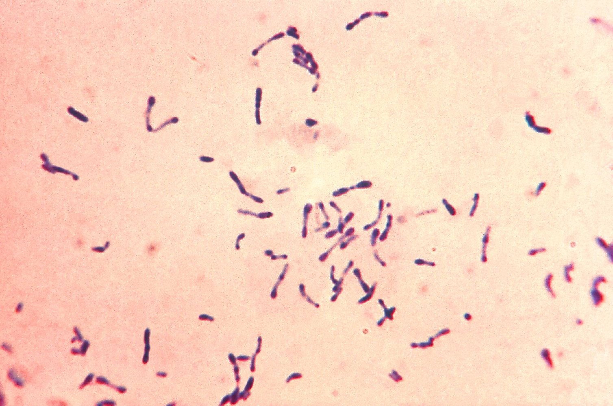
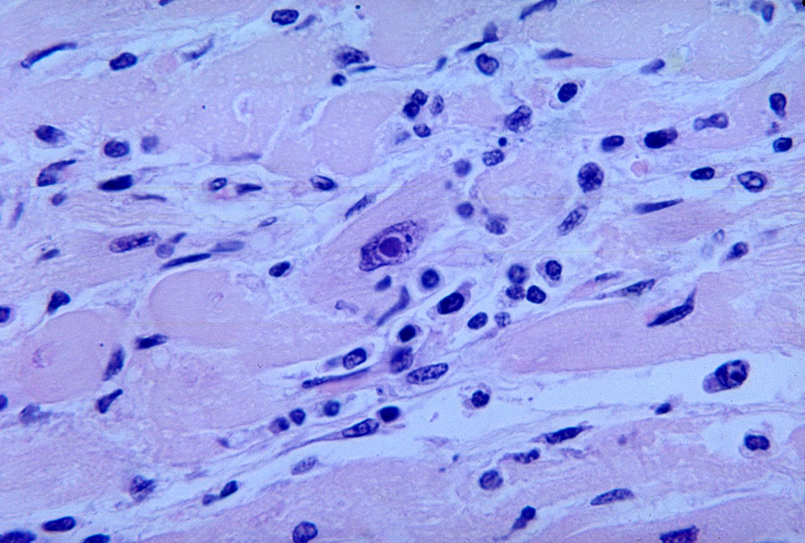
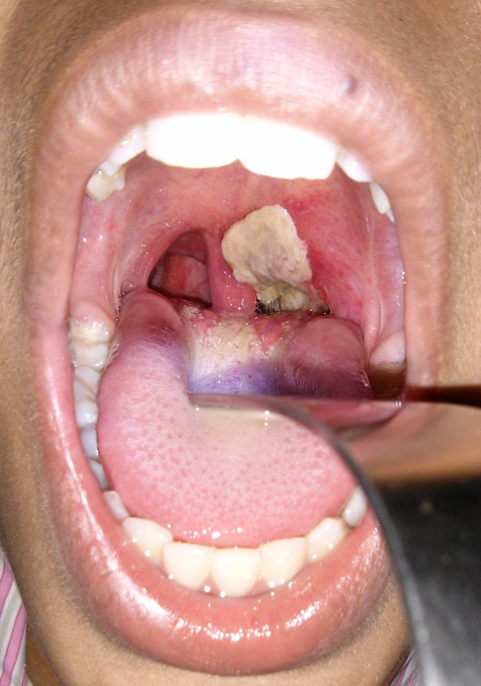
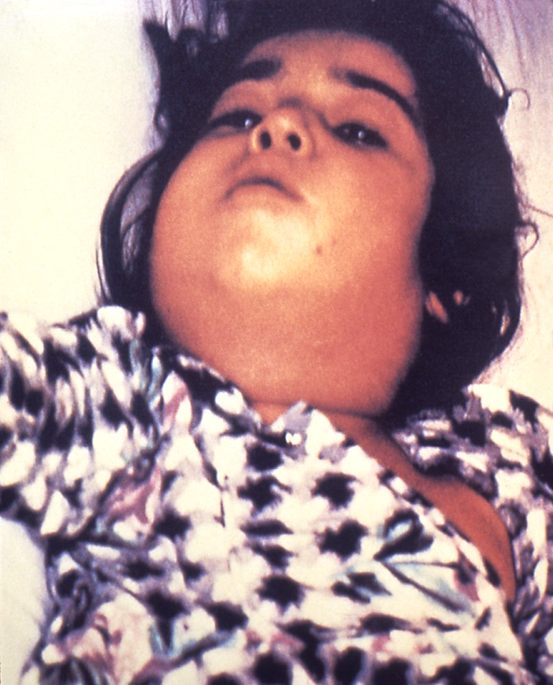
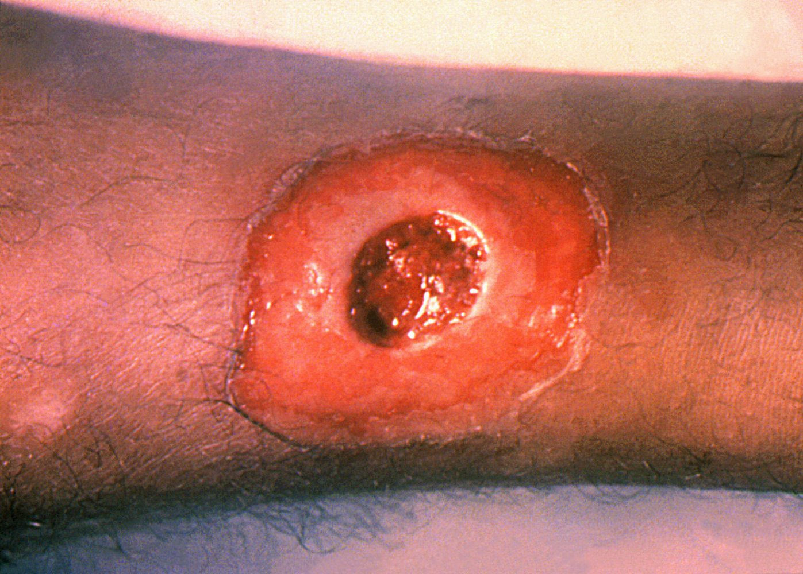

# Diphtheria

*Categories: Clinical knowledge > Pediatrics > Pediatric ENT and pulmonology > Diphtheria*

[Original Article Link](https://coursology-qbank.com/amboss/article/df0oO2)

---

## Summary

Diphtheria is an infectious disease caused by <u>Corynebacterium diphtheriae</u>, which is usually transmitted via respiratory droplets. The clinical features of diphtheria are caused by a toxin produced by <u>C. diphtheriae</u> after it colonizes the <u>upper respiratory tract</u>. Patients initially present with <u>fever</u>, <u>malaise</u>, and <u>sore throat</u>. Within a few days, a grayish-white pseudomembrane develops over the <u>tonsils</u>, <u>posterior</u> pharyngeal wall, and/or <u>larynx</u>. Other manifestations include <u>cervical lymphadenopathy</u>, <u>soft tissue</u> swelling of the neck, <u>stridor</u>, and/or difficulty breathing as a result of partial <u>airway obstruction</u>. Systemic absorption of the toxin can result in <u>myocarditis</u>, <u>acute tubular necrosis</u>, and/or <u>polyneuropathy</u>. Even before culture reports come back positive, patients should be promptly treated with <u>penicillin</u> and <u>antitoxins</u>, as untreated diphtheria is associated with a high <u>mortality rate</u>. In tropical countries, there is also a cutaneous form of diphtheria without systemic manifestations. <u>Cutaneous diphtheria</u> manifests as a scaly <u>erythematous</u> <u>rash</u> and/or a deep punched-out <u>ulcer</u> following direct entry of <u>C. diphtheriae</u> into the <u>skin</u>. Since the introduction of <u>routine immunization</u> against diphtheria in the 1920s, the <u>incidence</u> of the disease has decreased dramatically in the US.

---

## Etiology

* <u>Pathogen</u>: <u>Corynebacterium diphtheriae</u>

* A gram-positive, nonsporulating, club-shaped <u>bacillus</u>

* Contains metachromatic granules;  (volutin granules; stain red with a blue dye)

* Route of infection 

* <u>Droplet transmission</u>

* Less commonly through direct or indirect contact with open lesions

* <u>Infectious period</u>: variable

Corynebacterium diphtheriae

References:[[2]](https://coursology-qbank.com/amboss/article/1ca2Yj)

---

## Pathophysiology

* <u>C. diphtheriae</u> colonizes the <u>mucous membrane</u> of the respiratory tract (<u>respiratory diphtheria</u>) and, less commonly, preexisting <u>skin</u> lesions (<u>cutaneous diphtheria</u>) .

* <u>C. diphtheriae</u> has both toxigenic and nontoxigenic strains; toxigenic strains contain a beta-<u>prophage</u> <u>gene</u> (tox), which encodes for the <u>exotoxin</u> diphtheria toxin

* General characteristics: a heat-labile protein with a molecular weight of 62,000 kDa made of A and B fragments

* Mechanism of action: : the A fragment enters cells and catalyzes the transfer of <u>ADP-ribosylation</u> of the <u>elongation factor-2</u> (<u>EF-2</u>) → inhibition of <u>EF-2</u> → arrested protein <u>translation</u> and synthesis → <u>cell death</u> and <u>necrosis</u>

* Local effects of the toxin: destruction of the <u>respiratory epithelium</u> with a subsequent inflammatory response

* Deposition of <u>necrotic</u> <u>epithelium</u> embedded within fibrinosuppurative inflammatory <u>exudate</u> (pseudomembrane) over the <u>pharynx</u>, <u>tonsils</u>, and/or <u>larynx</u>

* Enlargement of the cervical <u>lymph nodes</u> and <u>edema</u> of the <u>soft tissue</u> of the neck → <u>bull neck appearance</u>, <u>airway obstruction</u>

* Systemic effects of the toxin 

* Fatty changes and focal <u>necrosis</u> of the <u>myocardium</u> and, less commonly, the <u>liver</u>, <u>kidney</u>, and <u>adrenal glands</u>

* Nerve <u>demyelination</u>

Diphtheritic myocarditis

> [!NOTE]
> ABCDEFG of C. diphtheria: ADP-ribosylation, Beta-<u>prophage</u>, Club-shaped, Diphtheria, Elongation Factor 2, metachromatic Granules.

References:[[2]](https://coursology-qbank.com/amboss/article/1ca2Yj)[[3]](https://coursology-qbank.com/amboss/article/U30b3f)[[4]](https://coursology-qbank.com/amboss/article/p30Ljf)

---

## Clinical features

### Respiratory diphtheria

Patients initially present with <u>prodromal</u> symptoms: <u>fever</u>, <u>malaise</u>, and <u>sore throat</u>. Four to five days after the onset of <u>prodromal</u> symptoms, symptoms due to the local and systemic effects of the toxin occur.

* <u>Incubation period</u>: 2–5 days

* Local features

* <u>Anterior</u> nasal diphtheria: bloody <u>rhinorrhea</u>

* Tonsillar and pharyngeal diphtheria

* Grayish-white pseudomembrane over the <u>posterior</u> pharyngeal wall, and/or <u>tonsils</u>

* Any attempt to scrape off the pseudomembrane exposes the underlying <u>capillaries</u> and results in heavy bleeding.

* <u>Bull neck</u> due to <u>cervical lymphadenopathy</u> and swelling of the <u>soft tissue</u> of the neck → <u>airway obstruction</u>

* Foul mouth odor

* Laryngeal diphtheria: difficulty breathing, <u>inspiratory stridor</u>

* Systemic features (due to dissemination of toxin)

* Cardiac

* <u>Myocarditis</u>

* <u>Arrhythmias</u>

* Rarely, <u>endocarditis</u>

* Reversible <u>polyneuropathy</u>

* <u>Acute tubular necrosis</u>

* <u>Adrenal insufficiency</u>

* <u>Septic arthritis</u>

Tonsillar and pharyngeal diphtheria

Bull neck

### Cutaneous diphtheria

* <u>Cutaneous diphtheria</u> is the result of direct <u>inoculation</u> of <u>C. diphtheriae</u> into the <u>skin</u> (e.g., <u>skin</u> <u>abrasions</u>) or preexisting <u>skin</u> lesions.

* Usually seen in tropical regions, where it is more common than <u>respiratory diphtheria</u>

* Patients present with scaly <u>erythematous</u> <u>rash</u>, <u>impetigo</u>, or deep, punched-out <u>ulcers</u>

* <u>Cutaneous diphtheria</u> does not result in systemic effects.

Cutaneous diphtheria

References:[[3]](https://coursology-qbank.com/amboss/article/U30b3f)

---

## Diagnosis

* Cultures: Obtain from all suspected patients (before initiating <u>antibiotic therapy</u>) to confirm the diagnosis. 

* <u>Respiratory diphtheria</u>: Obtain nasal and pharyngeal cultures.

* <u>Cutaneous diphtheria</u>: Obtain cultures from <u>skin</u> lesions

* Microscopic examination: multiple Gram-positive club-shaped <u>bacilli</u> clustered in angular arrangements

* Culture media of choice

* <u>Cystine-tellurite agar</u>:  <u>C. diphtheriae</u> appears as black colonies.

* <u>Loffler medium</u>: shows metachromatic granules

* Tests to identify toxigenic strains (if the culture reveals <u>C. diphtheriae</u>)

* Elek test

* An immunoprecipitation test in which <u>C. diphtheriae</u> are grown in an agar culture that is embedded with an <u>antitoxin</u>-impregnated filter paper

* Positive if the strain is toxicogenic

* <u>Polymerase chain reaction</u>: to identify the tox <u>gene</u>

> [!WARNING]
> Therapy (including <u>antitoxin</u> administration) should be started immediately upon clinical suspicion, even before diagnostic confirmation of diphtheria. [[5]](https://coursology-qbank.com/amboss/article/Ef18LT0)

---

## Differential diagnoses

* <u>Acute tonsillitis</u>

* <u>Croup</u>

* <u>Oropharyngeal candidiasis</u>

The differential diagnoses listed here are not exhaustive.

---

## Treatment

* The patient should be isolated as soon as diphtheria is suspected. [[2]](https://coursology-qbank.com/amboss/article/1ca2Yj)[[5]](https://coursology-qbank.com/amboss/article/Ef18LT0)

* <u>Respiratory diphtheria</u>: Initiate <u>droplet precautions</u>.

* <u>Cutaneous diphtheria</u>: Initiate <u>contact precautions</u>.

* Continue isolation until: [[6]](https://coursology-qbank.com/amboss/article/i2WJhk0)

* Cultures are negative for toxigenic C. diphtheria

* OR, if a toxigenic strain is isolated, two consecutive cultures taken ≥ 24 hours apart and ≥ 24 hours after completing <u>antibiotic therapy</u> are negative

* <u>Antibiotic therapy</u>;  : <u>penicillin G</u> (IM injection) OR <u>erythromycin</u> (oral/IV) for 14 days [[5]](https://coursology-qbank.com/amboss/article/Ef18LT0)

* Immediate administration of diphtheria antitoxin: The <u>antitoxin</u> can only neutralize the unbound toxin and should therefore be administered early in the course of the disease. [[7]](https://coursology-qbank.com/amboss/article/a0VQeG0)

* Contact the Center for Disease Control (<u>CDC</u>) urgently to request <u>diphtheria antitoxin</u>.

* Monitor closely during administration: Ensure <u>anaphylaxis management</u> is immediately available. [[7]](https://coursology-qbank.com/amboss/article/a0VQeG0)

* Laryngeal/<u>pharyngeal diphtheria</u> lasting < 48 hours: 20,000–40,000 units IV over 60 minutes

* <u>Nasopharyngeal</u> diphtheria: 40,000–60,000 units IV over 60 minutes

* <u>Bull neck</u> or diphtheria lasting > 3 days: 80,000–120,000 units IV over 60 minutes

* <u>Airway</u> support

* Monitor for <u>myocarditis</u>; : Conduct multiple <u>ECGs</u>;  and serial measurement of cardiac markers.

> [!TIP]
> Diphtheria is a nationally <u>notifiable disease</u>: Report all cases of <u>respiratory diphtheria</u> and toxigenic <u>cutaneous diphtheria</u> to the appropriate health departments. [[5]](https://coursology-qbank.com/amboss/article/Ef18LT0)

> [!NOTE]
> Administration of the <u>antitoxin</u> is a critical part of treatment, as the clinical features of diphtheria are not caused by the <u>pathogen</u> itself but rather by the <u>exotoxin</u> that <u>C. diphtheriae</u> produces.

---

## Prevention

### <u>Immunization</u> [[8]](https://coursology-qbank.com/amboss/article/LWWwN40)[[9]](https://coursology-qbank.com/amboss/article/6WWjm40)[[10]](https://coursology-qbank.com/amboss/article/pWWLm40)

* The diphtheria vaccine is a <u>toxoid vaccine</u>.

* Four diphtheria <u>vaccines</u> are available in the US:

* <u>Diphtheria, tetanus, acellular pertussis vaccine</u> (<u>DTaP</u>)

* <u>Tetanus diphtheria acellular pertussis vaccine</u> (<u>Tdap</u>)

* Diphtheria and <u>tetanus vaccine</u> (DT)

* <u>Tetanus</u> and <u>diphtheria vaccine</u> (Td)

* See “<u>ACIP immunization schedule</u>” for details.

### Exposure control [[6]](https://coursology-qbank.com/amboss/article/i2WJhk0)[[11]](https://coursology-qbank.com/amboss/article/R2Wlhk0)[[12]](https://coursology-qbank.com/amboss/article/XgW9Fk0)

#### Close contacts [[5]](https://coursology-qbank.com/amboss/article/Ef18LT0)[[6]](https://coursology-qbank.com/amboss/article/i2WJhk0)[[12]](https://coursology-qbank.com/amboss/article/XgW9Fk0)

* Those with frequent direct contact with the patient

* Anybody exposed to secretions from the infected source .

* For healthcare workers, exposure includes:

* Unprotected face-to-face contact with an individual with <u>respiratory diphtheria</u> )

* Unprotected exposure to <u>skin</u> lesions in a patient with <u>cutaneous diphtheria</u>

#### Management of exposed contacts

In addition to isolating and treating infected patients, the following measures should be performed in exposed close contacts regardless of their diphtheria <u>immunity</u> status. [[5]](https://coursology-qbank.com/amboss/article/Ef18LT0)[[6]](https://coursology-qbank.com/amboss/article/i2WJhk0)[[12]](https://coursology-qbank.com/amboss/article/XgW9Fk0)

* All exposed contacts

* Obtain cultures for C. diphtheria.

* Provide <u>postexposure prophylaxis for diphtheria</u>.

* <u>Quarantine</u> while awaiting culture results.

* Monitor for clinical features of diphtheria for 7–10 days.

* If cultures are negative: Discontinue <u>quarantine</u> and complete <u>chemoprophylaxis</u>. [[12]](https://coursology-qbank.com/amboss/article/XgW9Fk0)

* If cultures are positive: [[12]](https://coursology-qbank.com/amboss/article/XgW9Fk0)

* Asymptomatic individuals (carriers): Isolate until completion of <u>chemoprophylaxis</u> and two cultures are negative.

* Symptomatic patients: See “Treatment.”

#### Postexposure prophylaxis for diphtheria [[5]](https://coursology-qbank.com/amboss/article/Ef18LT0)[[12]](https://coursology-qbank.com/amboss/article/XgW9Fk0)

All exposed close contacts should receive prophylactic <u>antibiotics</u> and be assessed for <u>immunization</u>.

* <u>Antibiotic</u> <u>chemoprophylaxis</u>: <u>erythromycin</u>  DOSAGE OR a single IM dose of benzathine <u>penicillin G</u> DOSAGE [[5]](https://coursology-qbank.com/amboss/article/Ef18LT0)[[13]](https://coursology-qbank.com/amboss/article/yTWdtk0)

* <u>Active immunization</u> with a diptheria <u>vaccine</u> [[6]](https://coursology-qbank.com/amboss/article/i2WJhk0)[[12]](https://coursology-qbank.com/amboss/article/XgW9Fk0)

* Unknown or incomplete <u>diphtheria vaccine</u> status (see “<u>ACIP immunization schedule</u>”): Administer an immediate dose of a <u>diphtheria vaccine</u>.

* Up-to-date <u>diphtheria vaccine</u> status (see “<u>ACIP immunization schedule</u>”):

* Last dose ≥ 5 years prior: Immediately administer a booster dose of a <u>diphtheria vaccine</u>.

* Last dose < 5 years prior: No dose is required at this time.

---