# Foreign body aspiration

*Categories: Clinical knowledge > Pediatrics > Pediatric ENT and pulmonology > Foreign body aspiration*

[Original Article Link](https://coursology-qbank.com/amboss/article/K50UOg)

---

## Summary

Foreign body <u>aspiration</u> (FBA) is a potentially life-threatening emergency that most commonly occurs in children 1–3 years of age. A foreign body (FB) can become lodged in either the upper or <u>lower airway</u> and cause either a partial or complete <u>airway obstruction</u>. Complete obstruction of the <u>larynx</u> or upper <u>trachea</u> is a potentially life-threatening situation that causes severe <u>respiratory distress</u>, <u>cyanosis</u>, and suffocation; it should be managed with first-aid maneuvers (e.g., <u>CPR</u> in unresponsive patients or <u>maneuvers to dislodge an aspirated FB</u> in responsive patients) and, if needed, <u>emergency airway procedures for FBA</u>. Partial obstructions that do not cause significant <u>respiratory distress</u> can be removed via <u>laryngoscopy</u>, <u>nasal endoscopy</u>, or <u>bronchoscopy</u> if <u>coughing</u> fails to dislodge the FB. <u>Lower airway FBA</u> typically manifests with sudden-onset <u>coughing</u> and choking, followed by <u>wheeze</u> and <u>dyspnea</u>. Most commonly, the FB becomes lodged in the main and intermediate <u>bronchi</u>; approx. 60% of foreign bodies become lodged in the right main <u>bronchus</u> because of its more vertical orientation compared to the left main <u>bronchus</u>. If initial maneuvers fail to dislodge the FB and the patient is stable, imaging (e.g., <u>x-ray</u> of the neck or chest, CT chest, <u>bronchoscopy</u>) to localize the FB should be obtained, followed by a <u>planned removal of the aspirated FB</u>. If an FB remains undetected, it may result in <u>chronic cough</u> and recurrent pulmonary infections.

---

## Pathophysiology

* <u>Aspiration</u> of an FB → <u>airway obstruction</u>

* Complete <u>airway obstruction</u> → collapse of the respiratory structures <u>distal</u> to the obstruction (e.g., <u>atelectasis</u>)

* Partial <u>airway obstruction</u>: formation of a ball-valve obstruction with <u>air trapping</u> → build-up of pressure <u>distal</u> to the obstruction

* Localization

* <u>Upper airway</u> obstruction: a minority of FB are lodged in the <u>larynx</u> or <u>trachea</u>

* <u>Bronchi</u>: the right main <u>bronchus</u> is more often affected than the left main <u>bronchus</u> 

* Aspirated particles are most likely to become lodged at the junction of the right inferior and right middle <u>bronchi</u> → right lower and middle lobe <u>aspiration pneumonia</u>

* Upper right lobe affected in bedridden patients, particularly while lying on their right side.

* In children, the two main <u>bronchi</u> are affected with similar frequency (compared to adults); however, there is still a slight right-sided predominance.

* Less severe than <u>upper airway</u> obstructions

> [!NOTE]
> Approximately 60% of foreign bodies become lodged in the right main <u>bronchus</u> because of its more vertical orientation compared to the left main <u>bronchus</u>.

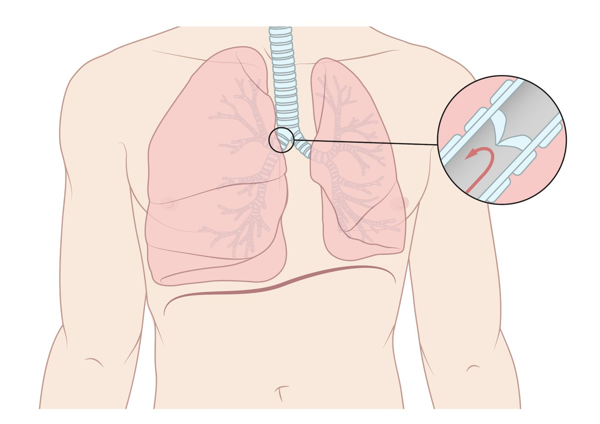

Hyperinflation due to foreign body aspiration

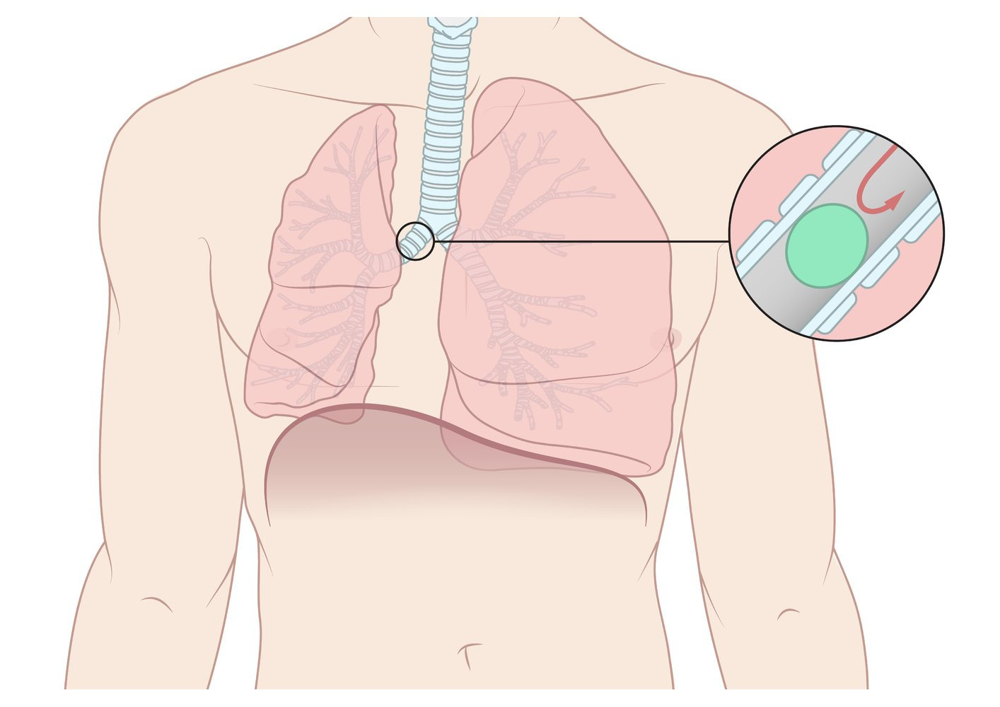

Atelectasis due to foreign body aspiration

Distribution of affected bronchi in foreign body aspiration

References:[[6]](https://coursology-qbank.com/amboss/article/9gYNxo)[[7]](https://coursology-qbank.com/amboss/article/CgYqxo)

---

## Clinical features

Clinical features depend on the degree of <u>airway obstruction</u> and the duration of time since <u>aspiration</u> of the FB. See also “<u>Upper airway FB obstruction</u>” and “<u>Lower airway FB obstruction</u>” for differentiating features. [[8]](https://coursology-qbank.com/amboss/article/35YSPp)

| Clinical features in FBA |  |  |
| --- | --- | --- |
|  Complete <u>airway obstruction</u> [[9]](https://coursology-qbank.com/amboss/article/16X2P_) | Partial <u>airway obstruction</u> | Chronic FB airway obstruction |
|   * Unresponsiveness  * Inability to speak, cry out, or <u>cough</u>  * Paradoxical movements of the chest and abdomen  * Use of <u>accessory muscles of respiration</u>  * <u>Agitation</u> followed by <u>loss of consciousness</u>  * Absent breath sounds  * <u>Cyanosis</u>    |   * Choking and <u>coughing</u>  * Acute <u>dyspnea</u>  * <u>Hoarseness</u>  * <u>Signs of respiratory distress</u>, <u>cyanosis</u>, <u>altered mental state</u>  * Diminished breath sounds on the affected side  * <u>Stridor</u>, <u>wheezing</u>  [[2]](https://coursology-qbank.com/amboss/article/YEYn8I)  * On inspiration: indicates laryngotracheal localization  * On expiration: indicates bronchial localization  * <u>Hyperresonance</u> on the affected side    |   * Symptom onset may occur days or weeks later  * Persistent or recurrent <u>cough</u>  * <u>Purulent</u> or mucopurulent <u>sputum</u> [[2]](https://coursology-qbank.com/amboss/article/YEYn8I)  * <u>Wheeze</u>  * <u>Fever</u>    |

> [!WARNING]
> Findings can change as organic foreign bodies absorb water and swell in the <u>lung</u>, converting a partial obstruction into a complete one. [[6]](https://coursology-qbank.com/amboss/article/9gYNxo)

---

## Differential diagnoses

* Children

* See “<u>Differential diagnoses of stridor</u>”.

* See “<u>Wheezing in children</u>”.

* Acute obstructive <u>bronchitis</u>

* <u>Laryngomalacia</u> [[10]](https://coursology-qbank.com/amboss/article/XMa9MO)

* All ages [[10]](https://coursology-qbank.com/amboss/article/XMa9MO)

* <u>Tracheal</u> <u>blunt trauma</u>, <u>tumor</u>, or stenosis

* Laryngeal trauma, <u>tumor</u>/papilloma

* <u>Anaphylaxis</u>

* Acute bilateral <u>vocal cord paralysis</u>

* <u>Bronchial asthma</u> (presents with bilateral <u>wheezing</u>, as opposed to the unilateral <u>wheeze</u> seen in FBA)

* <u>Spontaneous pneumothorax</u>

* <u>Pneumonia</u>

* Tracheobronchial <u>tumor</u>

* Extrinsic compression or infiltration of a large <u>airway</u> from an adjacent mass

The differential diagnoses listed here are not exhaustive.

---

## Initial management (overview)

* Prioritize <u>airway management</u> and respiratory stabilization. [[8]](https://coursology-qbank.com/amboss/article/35YSPp)

* Defer diagnostic imaging if there are <u>signs of respiratory distress</u> or <u>respiratory failure</u>.

> [!WARNING]
> In patients with signs of life-threatening <u>airway obstruction</u>, immediately initiate critical interventions such as first aid (e.g., <u>CPR</u>), <u>basic airway maneuvers</u>, and <u>emergency airway procedures for FBA</u> (see “Unresponsive patients” below for details).

| Overview of diagnostic and therapeutic approach to FBA |  |  |
| --- | --- | --- |
|  |  Upper airway FB obstruction [[11]](https://coursology-qbank.com/amboss/article/9abN5H) |  Lower airway FB obstruction [[2]](https://coursology-qbank.com/amboss/article/YEYn8I) |
| Physical findings |   * <u>Stridor</u>  * Sternal <u>retraction</u>  * Use of <u>accessory muscles of respiration</u>  * Difficulty <u>swallowing</u>  * Drooling    |   * <u>Cough</u>  * Absent breath sounds in the affected <u>lung</u> field  * <u>Wheeze</u> (inspiratory/expiratory)    |
| Initial imaging |  * Neck <u>x-ray</u> (<u>lateral</u> view)   |  * <u>Chest x-ray</u> (PA, <u>lateral</u>, and expiratory views)   |
|  Advanced imaging and/or  dual diagnostic/therapeutic procedures   |   * <u>Laryngoscopy</u>  * <u>Nasal endoscopy</u>    |   * CT chest without contrast  * <u>Bronchoscopy</u>    |
| Management: <u>unresponsive patient with suspected FBA</u> |   * Start <u>CPR</u>.  * FB not dislodged: Attempt <u>laryngoscopy-guided FB retrieval</u>.  * If ineffective: <u>emergency surgical airway</u>    |  * Objects small enough to pass into the <u>lower airway</u> are rarely immediately life-threatening but can cause significant complications.  * <u>Hypoxia</u>: Optimize oxygenation (see “<u>Oxygen therapy</u>”).  * <u>Aspiration pneumonia</u>: Start IV <u>antibiotics</u> (see “<u>Pneumonia treatment</u>”).   |
| Management: <u>responsive patient with suspected FBA</u> |   * <u>Suspected complete airway obstruction</u>  * Initiate <u>back blows</u>  * If ineffective: Proceed to <u>chest thrusts</u> (<u>infants</u>) or <u>abdominal thrusts</u> (adults and children ≥ 1 year)  * <u>Suspected partial airway obstruction</u>  * Encourage <u>coughing</u> to dislodge FB.  * Inability to dislodge the FB: planned <u>removal of upper airway FB</u>    |   * Optimize oxygenation (see “<u>Basic oxygen delivery systems</u>”).  * Encourage <u>coughing</u> to dislodge the FB.  * Inability to dislodge the FB: <u>planned removal of lower airway FB</u>  * First-line in <u>infants</u>: <u>rigid bronchoscopy</u>  * First-line in adults and children ≥ 1 year: <u>flexible bronchoscopy</u>    |

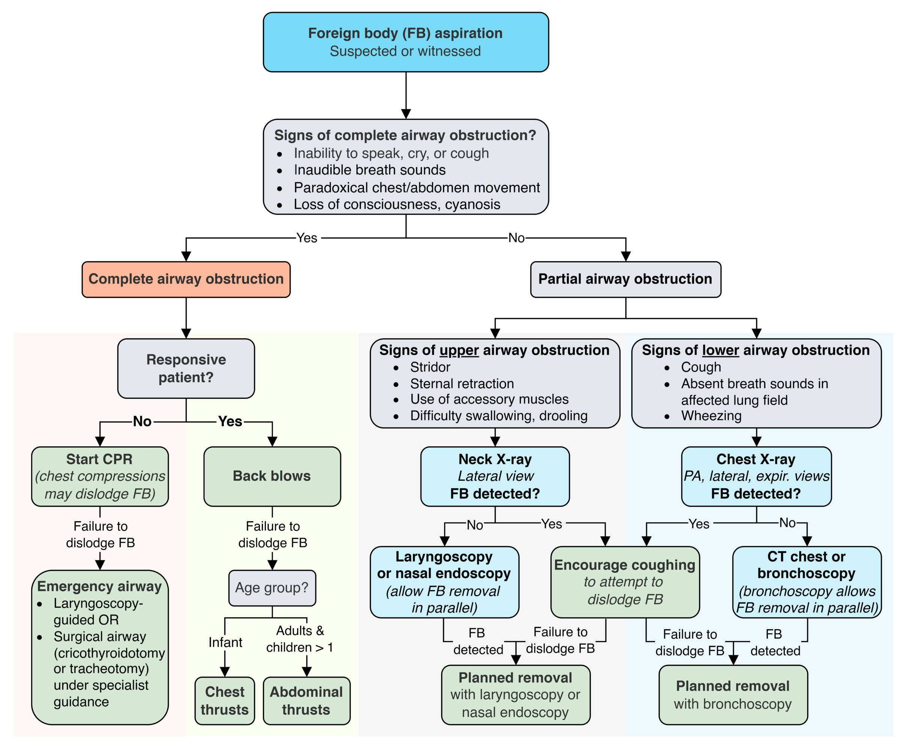

Foreign body aspiration diagnostics & management

---

## Unresponsive patient

### Commence <u>CPR</u>

* <u>Chest compressions</u> may dislodge the object by raising intrapulmonary pressure.  [[12]](https://coursology-qbank.com/amboss/article/6hbjUt)

* Attempt to remove the FB while <u>CPR</u> is ongoing.

* <u>Head-tilt/chin-lift maneuver</u> to open the <u>airway</u>

* At every 2-minute <u>pulse</u> check, check the <u>airway</u> for a dislodged FB; remove if present.

* Do not perform blind finger sweeps if a FB is not visible. [[13]](https://coursology-qbank.com/amboss/article/hSXczx)

* Attempt <u>laryngoscopy-guided FB retrieval</u>.

### Emergency airway procedures in FBA

* Indication: failed first-aid attempts to dislodge the FB

* Anesthesia

* Unresponsive patients: none required

* Responsive patients: See “Planned <u>removal of upper airway FB</u>.”

#### <u>Laryngoscopy</u> [[14]](https://coursology-qbank.com/amboss/article/LzYwt7)

* Laryngoscopy-guided FB retrieval: Under <u>direct laryngoscopy</u>, attempt to remove any visible FB with <u>Magill forceps</u>.

* Inability to remove FB with forceps: Intubate using an <u>endotracheal tube</u> (<u>ETT</u>) to displace the FB as distally as possible into either main <u>bronchus</u>. 

* Successful <u>distal</u> displacement: Withdraw the <u>ETT</u> to the standard tip-to-lip distance and ventilate if possible.

* Unsuccessful <u>distal</u> displacement: <u>emergency surgical airway</u> (see below)

> [!WARNING]
> <u>Laryngoscopy</u> risks converting a partial obstruction into a total obstruction by displacing the object or causing laryngeal trauma and/or hemorrhage [[15]](https://coursology-qbank.com/amboss/article/wyahhM)

#### <u>Emergency surgical airway</u> [[16]](https://coursology-qbank.com/amboss/article/XYb9nH)

* Indication: failure of the above maneuvers to remove the FB in an unresponsive patient

* Options

* Adults: <u>scalpel cricothyroidotomy</u> (or emergency tracheotomy if expertise is readily available) [[17]](https://coursology-qbank.com/amboss/article/GJXBv_)

* <u>Infants</u> and children < 12 years old: <u>needle cricothyroidotomy</u> with percutaneous transtracheal ventilation [[18]](https://coursology-qbank.com/amboss/article/ZyYZd7)

* Further management (after establishing an emergency <u>airway</u>)

* <u>Planned removal of the aspirated FB</u>.

* Urgently consult the relevant department (e.g., ENT, anesthesia) for a <u>definitive airway</u> as needed.

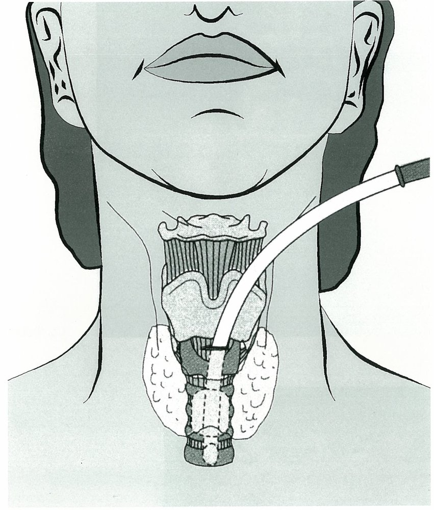

Cricothyroidotomy

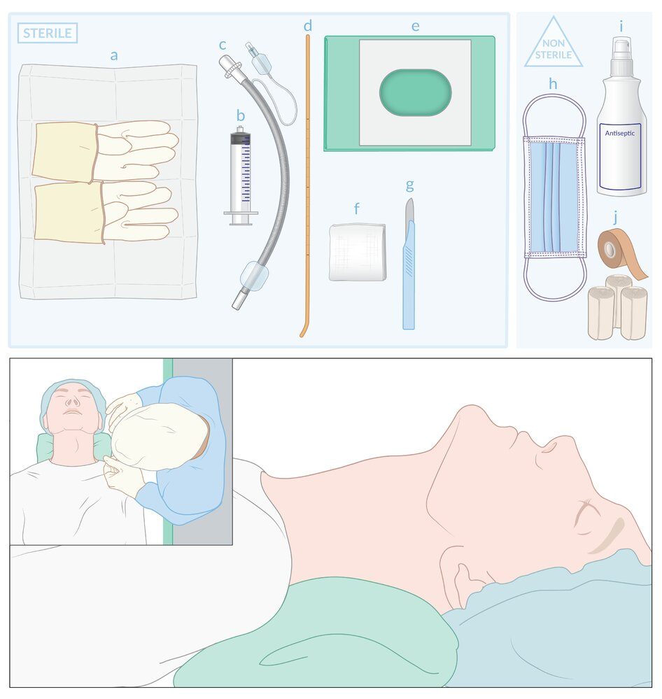

Surgical cricothyrotomy: stab-twist-bougie-tube technique equipment

Surgical cricothyrotomy: stab-twist-bougie-tube technique

---

## Responsive patient

### Suspected complete <u>airway obstruction</u> (patient unable to speak, cry, or <u>cough</u>) [[13]](https://coursology-qbank.com/amboss/article/hSXczx)

> [!WARNING]
> If the patient can speak, cry, or <u>cough</u>, do not attempt <u>back blows</u> or <u>abdominal thrusts</u>, as these maneuvers risk dislodging the FB and converting a partial obstruction into a complete obstruction.

#### Approach

* Initiate <u>maneuvers to dislodge the aspirated FB</u> (see table below for technique instructions). 

* <u>Back blows</u>: preferred initial maneuver in all patients

* If <u>back blows</u> are ineffective

* <u>Infants</u>: Perform <u>chest thrusts</u>.

* Adults and children ≥ 1 year old: Perform <u>abdominal thrusts</u> (formerly known as the <u>Heimlich maneuver</u>).  [[19]](https://coursology-qbank.com/amboss/article/SwYyRr)

* Failure to dislodge the FB with repeated <u>back blows</u> and chest/<u>abdominal thrusts</u>

* If trained: Proceed with <u>emergency airway procedures for FBA</u>.

* Untrained or instruments not on hand: Continue <u>maneuvers to dislodge the aspirated FB</u> until help arrives.

* Patient becomes unresponsive

* If trained, proceed to <u>emergency airway procedures in FBA</u>.

* If not trained, start <u>CPR</u> (see “Unresponsive patient”).

#### Technique

| Maneuvers to dislodge an aspirated foreign body |  |
| --- | --- |
| <u>Infants</u> | Adults and children ≥ 1 year old |
|  Initial maneuver: Back blows  |  |
|   * Place the <u>infant</u> <u>prone</u> along the provider's forearm with the head lower than the chest.  * Support the <u>infant</u>'s head by holding the <u>jaw</u> (avoid compressing <u>soft tissues</u> of the neck).  * Using the heel of the hand, deliver a <u>back blow</u> between the shoulder blades.  * Repeat up to 5 times.  * Check if FB has dislodged.  * If ineffective, proceed to give <u>chest thrusts</u> (see below)    |   * Stand or kneel posterolateral to the patient.  * Place one hand on their chest to support their body weight while they lean forward.  * Using the heel of the hand, deliver a <u>back blow</u> between the shoulder blades, repeat as needed.  [[20]](https://coursology-qbank.com/amboss/article/bKXHU_)  * Check if FB has dislodged.  * If ineffective, proceed to <u>abdominal thrusts</u>. (see below)    |
|  Next step: chest thrusts  |  Next step: abdominal thrusts [[21]](https://coursology-qbank.com/amboss/article/tabXmH)[[22]](https://coursology-qbank.com/amboss/article/FabgmH)  |
|   * Place the child in a <u>supine position</u>.  * Tilt the head back.  * Apply pressure swiftly and firmly to the lower third of the <u>sternum</u> (similar location as <u>CPR</u>).  * Repeat up to 5 times at the rate of 1 compression per second.  * Check if FB has dislodged.  * If <u>chest thrusts</u> are ineffective, give another 5 back blows.  * Alternate cycles of <u>chest thrusts</u> and <u>back blows</u> as needed.    |   * Stand or kneel behind the person.  * Place one fist slightly above the <u>navel</u> (but below the <u>xiphoid process</u>).  * Grasp the fist with the other hand.  * Perform a quick inward and upward thrust.  * Check if FB has dislodged.  * Repeat up to 5 times or until the FB is expelled.    |

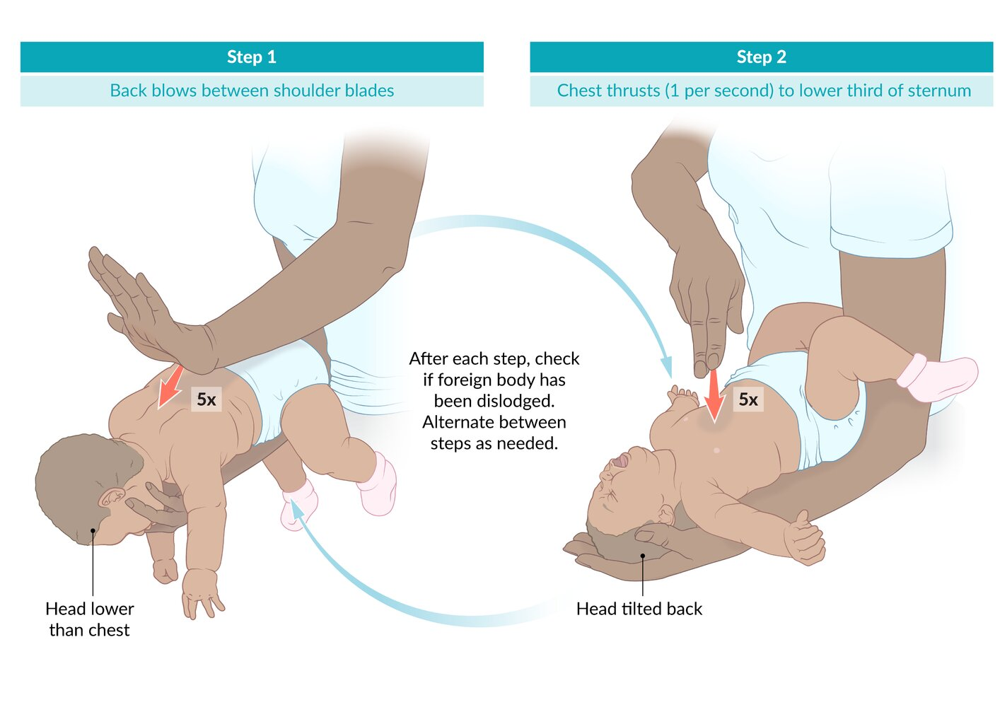

Back blows and chest thrusts in infants

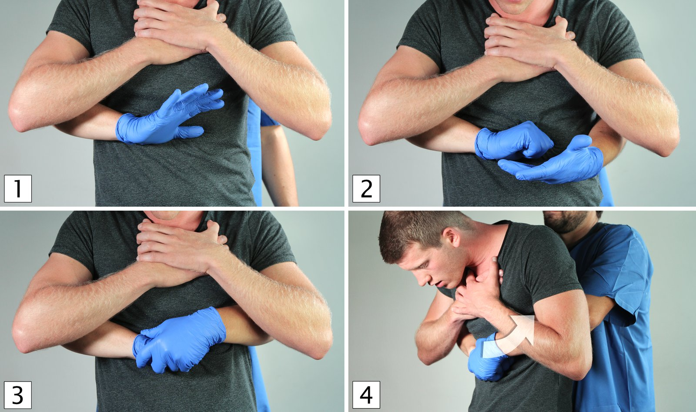

Heimlich maneuver

### Suspected partial <u>upper airway FBA</u>

* Sit the patient upright.

* Encourage <u>coughing</u> to dislodge FB.

* Monitor for signs of deterioration.

* <u>Signs of increased work of breathing</u>

* Signs of poor <u>gas exchange</u> (e.g., <u>cyanosis</u>)

* Weak or ineffective <u>cough</u>

* Inability to dislodge the FB and patient remains stable: urgent ENT referral for <u>planned removal of an upper airway FB</u>

### Suspected partial <u>lower airway FBA</u>

* Optimize oxygenation (see “<u>Basic oxygen delivery systems</u>”).

* Encourage <u>coughing</u> to dislodge the FB.

* Inability to dislodge the FB and patient remains stable: urgent pulmonology referral for <u>planned removal of a lower airway FB</u>

> [!WARNING]
> If at any time the patient becomes unresponsive despite treatment, start <u>CPR</u>, and, if trained, proceed to <u>emergency airway procedures in FBA</u>.

---

## Diagnosis

> [!TIP]
> Prioritize <u>airway management</u> and respiratory stabilization over diagnostics if there are any <u>signs of respiratory distress</u> or <u>respiratory failure</u> (see the “Initial management” sections above).

### Imaging in suspected <u>upper airway FBA</u>

#### Neck <u>x-ray</u> (<u>lateral</u> view)

* Indications: <u>suspected upper airway FB</u> [[23]](https://coursology-qbank.com/amboss/article/PzYWG7)

* Findings

* <u>Radiopaque</u> foreign objects may be visible.

* Widened prevertebral shadow, loss of cervical <u>lordosis</u> (secondary signs) [[24]](https://coursology-qbank.com/amboss/article/Dab15H)

> [!WARNING]
> An <u>x-ray</u> may not detect a FB due to <u>radiolucency</u> or if the aspirated object is further down than suspected.

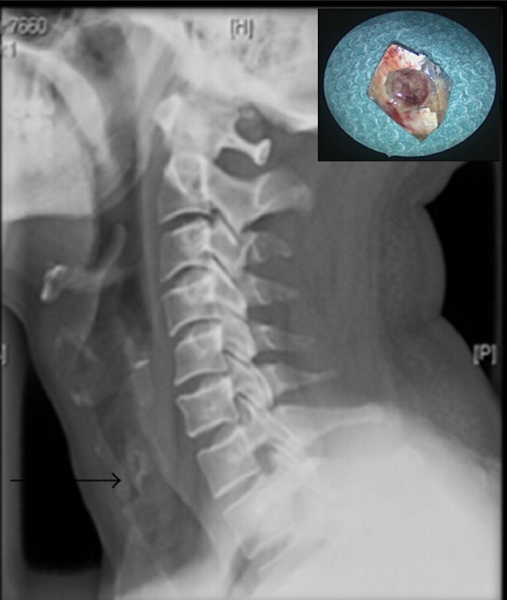

Foreign body aspiration

#### <u>Laryngoscopy</u> [[25]](https://coursology-qbank.com/amboss/article/aYbQnH)

* Indications: next management step after failed first-aid attempts to dislodge an <u>upper airway FB</u>

* Findings

* Direct visualization of the FB

* Potentially surrounding <u>mucosal</u> <u>edema</u>, <u>abrasions</u>, or blood

* Additional considerations: <u>Nasal endoscopy</u> can be used to remove a nasal FB or ensure there is no FB remnant in the <u>upper airway</u> that can be re-aspirated.

### Imaging in suspected <u>lower airway FBA</u>

#### <u>Chest x-ray</u> [[2]](https://coursology-qbank.com/amboss/article/YEYn8I)

* Indications

* Initial screening modality in <u>suspected lower airway FBA</u>

* Exclusion of alternative diagnoses

* Views

* PA, <u>lateral</u>, and expiratory

* Left and right <u>lateral</u> <u>decubitus</u> views in patients unable to cooperate with inspiratory/expiratory views   [[11]](https://coursology-qbank.com/amboss/article/9abN5H)

* Findings

* FB may be visualized if <u>radiopaque</u> (∼ 25%).

* <u>Lung parenchyma</u> changes suggestive of FBA are described in the table below.

* Disadvantages

* False reassurance if <u>chest x-ray</u> is normal

* Insufficient detail for planning removal of FB; further imaging usually necessary

|  Chest x-ray findings suggestive of FBA [[2]](https://coursology-qbank.com/amboss/article/YEYn8I)  |  |  |
| --- | --- | --- |
|  | Early findings |  Late findings  |
| Partial <u>airway obstruction</u> |  * Evidence of focal hyperinflation   * Focal hyperlucency  * Reduced <u>pulmonary markings</u> in the affected <u>lung</u>  * Severe causes: flattening of the <u>ipsilateral</u> hemidiaphragm and <u>mediastinal</u> shift to the unaffected side   |   * Focal consolidation  * <u>Ipsilateral</u> <u>pleural effusion</u>  [[26]](https://coursology-qbank.com/amboss/article/_ab5MH)  * <u>Ipsilateral</u> hilar <u>lymphadenopathy</u>    |
| Complete <u>airway obstruction</u> |  * <u>Atelectasis</u>   |  |

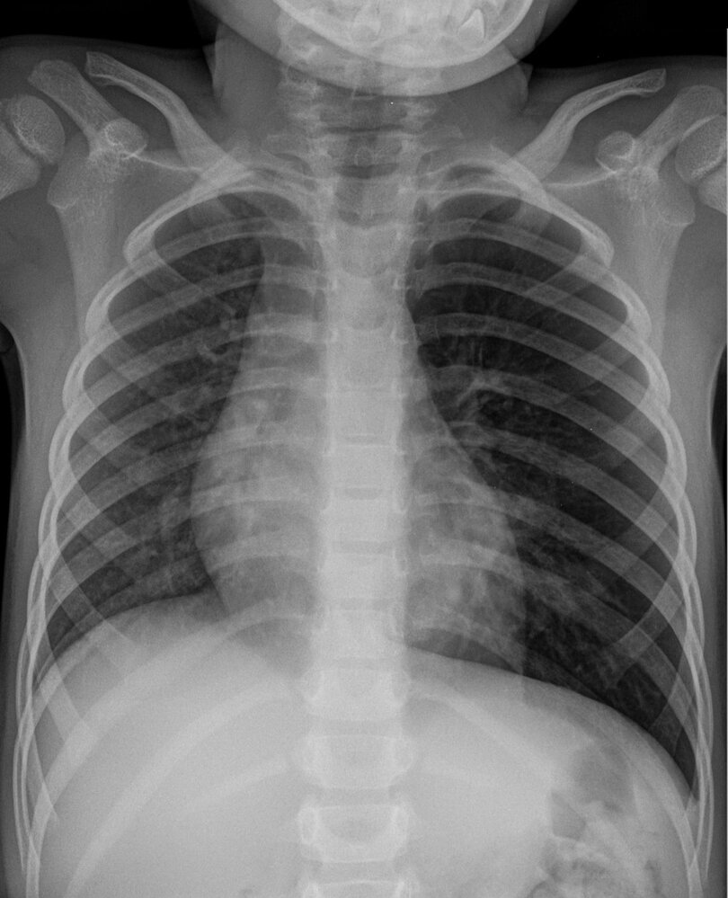

Foreign body aspiration

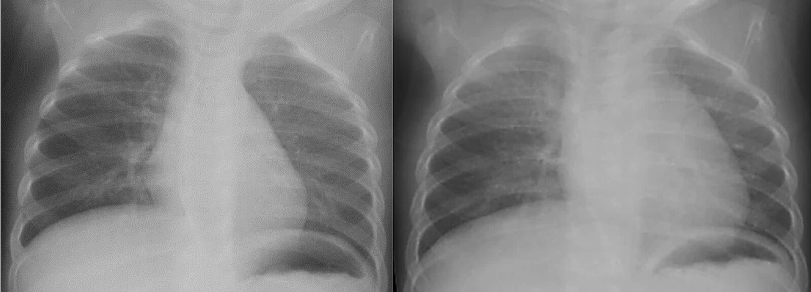

Foreign body aspiration

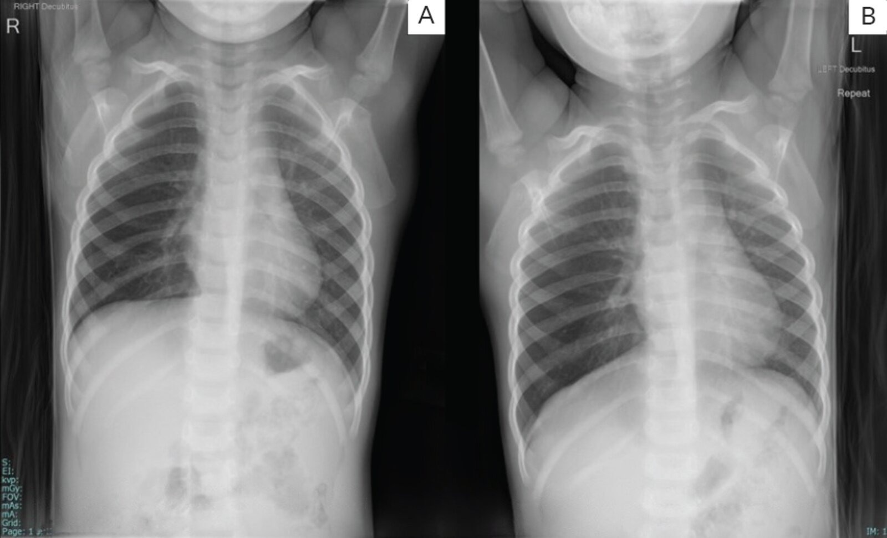

Foreign body aspiration

> [!WARNING]
> Chest <u>x-ray</u> may be normal in patients with FB <u>aspiration</u>.

> [!TIP]
> If there is a high suspicion of FBA, CT chest or <u>bronchoscopy</u> should be performed even if the <u>chest x-ray</u> is inconclusive.

#### CT chest without contrast (∼ 100% <u>sensitivity</u>) [[2]](https://coursology-qbank.com/amboss/article/YEYn8I)

* Indications

* Second-line test in <u>suspected lower airway FBA</u> with a normal or inconclusive chest <u>x-ray</u>

* To guide <u>planned removal of FB</u>  [[2]](https://coursology-qbank.com/amboss/article/YEYn8I)

* Findings

* Similar to <u>chest x-ray</u>

* Additionally includes: [[27]](https://coursology-qbank.com/amboss/article/zabrMH)

* Focal <u>bronchial wall thickening</u> adjacent to the FB

* <u>Tree-in-bud opacities</u>  [[28]](https://coursology-qbank.com/amboss/article/0YbenH)

* Disadvantages: <u>false-negative</u> CT if the FB is very small or in patients with severe <u>dyspnea</u>  [[27]](https://coursology-qbank.com/amboss/article/zabrMH)

#### <u>Bronchoscopy</u> [[2]](https://coursology-qbank.com/amboss/article/YEYn8I)

<u>Bronchoscopy</u> is the <u>gold standard</u> diagnostic and therapeutic modality for a <u>suspected lower airway FBA</u>.

* Indications

* Preferred modality in patients with <u>signs of respiratory distress</u> suspected to be due to a <u>lower airway FB</u> [[2]](https://coursology-qbank.com/amboss/article/YEYn8I)

* Next step in stable patients high clinical <u>suspicion of lower airway FBA</u> despite inconclusive imaging.

* Findings

* Direct visualization of the FB

* <u>Granulation tissue</u> if localized irritation has occurred

* Disadvantages: requires sedation and/or anesthesia

### Investigation of the underlying causes

In adults with suspected neurological or neuromuscular abnormalities, consider a <u>clinical swallow evaluation</u> and other <u>diagnostics for dysphagia</u>. [[29]](https://coursology-qbank.com/amboss/article/6zYjF7)[[30]](https://coursology-qbank.com/amboss/article/pzYLF7)

---

## Treatment

Emergency management of suspected FBA is covered in the “Initial management” sections above.
This section describes procedures to remove a FB in stable/stabilized patients  if <u>CPR</u> or initial <u>maneuvers to dislodge the aspirated FB</u> have failed.

### Planned removal of an upper airway FB

* Indication: stable patients with an <u>upper airway FB</u> if attempted <u>maneuvers to dislodge an aspirated FB</u> have failed

* <u>Anesthetic</u> considerations [[15]](https://coursology-qbank.com/amboss/article/wyahhM)[[31]](https://coursology-qbank.com/amboss/article/5zYit7)

* <u>Local anesthesia</u> (1% topical <u>lidocaine</u>) can be considered in alert, cooperative patients with an oropharyngeal FB.

* If <u>general anesthesia</u> is required, IV induction with spontaneous breathing or smooth mask inhaled anesthesia is preferred. [[5]](https://coursology-qbank.com/amboss/article/nJX7u_)

* Modalities: <u>laryngoscopy</u> (or <u>nasal endoscopy</u>)

* Procedure: Under direct visualization, the object is grasped and removed with forceps.

* Risks: Dislodgement of the object can lead to complete <u>airway obstruction</u>; keep equipment on hand to create an <u>emergency surgical airway</u> if needed.

> [!WARNING]
> Avoid <u>positive pressure ventilation</u> (e.g., <u>bag-mask ventilation</u>) during anesthesia induction in patients with suspected <u>upper airway FBA</u> as it can dislodge the FB more distally. [[31]](https://coursology-qbank.com/amboss/article/5zYit7)

### Planned removal of a lower airway FB

#### <u>Bronchoscopy</u> (<u>gold standard</u>) [[2]](https://coursology-qbank.com/amboss/article/YEYn8I)

* Indication: stable patients with confirmed/<u>suspected lower airway FB</u> if first-aid attempts to dislodge the FB have failed

* Type: <u>flexible bronchoscopy</u> or <u>rigid bronchoscopy</u> (see “<u>Bronchoscopy choice in FBA</u>”)

* Procedure: retrieval of the FB under direct <u>vision</u>  [[2]](https://coursology-qbank.com/amboss/article/YEYn8I)

* Risks [[32]](https://coursology-qbank.com/amboss/article/KzYUF7)

* Complete <u>airway obstruction</u> during removal; keep equipment on hand to create an <u>emergency surgical airway</u> if needed.[[2]](https://coursology-qbank.com/amboss/article/YEYn8I)

* <u>Pneumothorax</u>

* Bleeding

* Infection (see “<u>Aspiration pneumonia</u>”)

* Injury of the <u>tracheal</u>/bronchial wall

* Additional considerations: management of <u>granulation tissue</u>  [[2]](https://coursology-qbank.com/amboss/article/YEYn8I)

* Consider parenteral <u>corticosteroids</u> (e.g., <u>methylprednisolone</u> DOSAGE) prior to <u>bronchoscopy</u> to reduce inflammation and assist FB removal.  [[2]](https://coursology-qbank.com/amboss/article/YEYn8I)[[33]](https://coursology-qbank.com/amboss/article/Eab8mH)

* Removal of <u>granulation tissue</u> during <u>bronchoscopy</u> may be required to prevent <u>airway</u> stenosis.

|  Bronchoscopy choice in FBA [[2]](https://coursology-qbank.com/amboss/article/YEYn8I)[[34]](https://coursology-qbank.com/amboss/article/ZYbZnH)  |  |  |  |
| --- | --- | --- | --- |
|  | Indications | Advantages | Disadvantages |
|  <u>Flexible bronchoscopy</u> |   * Stable adults  * <u>Gold standard</u> if the diagnosis is unclear or the location of the FB is unknown [[2]](https://coursology-qbank.com/amboss/article/YEYn8I)    |   * More widely available  * Can be performed through an <u>ETT</u>/rigid bronchoscope  * Possible in facial trauma or with limited neck movement  * More comprehensive investigation of the <u>airways</u>  * Ability to access smaller <u>airways</u>    |   * Does not allow ventilation  * No <u>airway</u> protection as objects pass the <u>glottis</u>    |
|  <u>Rigid bronchoscopy</u> |   * All children  [[2]](https://coursology-qbank.com/amboss/article/YEYn8I)  * Patients with acute <u>respiratory distress</u>  * <u>Flexible bronchoscopy</u> has failed to remove the FB.    |   * Allows ventilation  * Tools such as suction and cautery can be passed through the bronchoscope.  * Shielding of sharp objects within the tube during extraction  * Prevents complete <u>airway obstruction</u> if the FB is dislodged during removal    |   * Usually requires a <u>general anesthesia</u>  * Not all operators are trained to use rigid bronchoscopes.    |

#### Surgical management [[2]](https://coursology-qbank.com/amboss/article/YEYn8I)[[33]](https://coursology-qbank.com/amboss/article/Eab8mH)

* Indications

* Failure of <u>bronchoscopy</u> to remove the FB

* Destruction of surrounding <u>lung tissue</u> (e.g., <u>bronchiectasis</u>) in delayed presentations [[35]](https://coursology-qbank.com/amboss/article/vhbAft)[[36]](https://coursology-qbank.com/amboss/article/Dhb1Tt)

* Procedure: <u>thoracotomy</u> with bronchotomy or segmental resection

---

## Complications

* <u>Atelectasis</u>

* Postobstructive <u>pneumonia</u>, <u>lung abscess</u>

* In complete obstruction

* Suffocation, <u>asystole</u>, and <u>death</u>

* <u>Hypoxia</u>: <u>brain damage</u>

References:[[37]](https://coursology-qbank.com/amboss/article/nm07Tg)

We list the most important complications. The selection is not exhaustive.

---