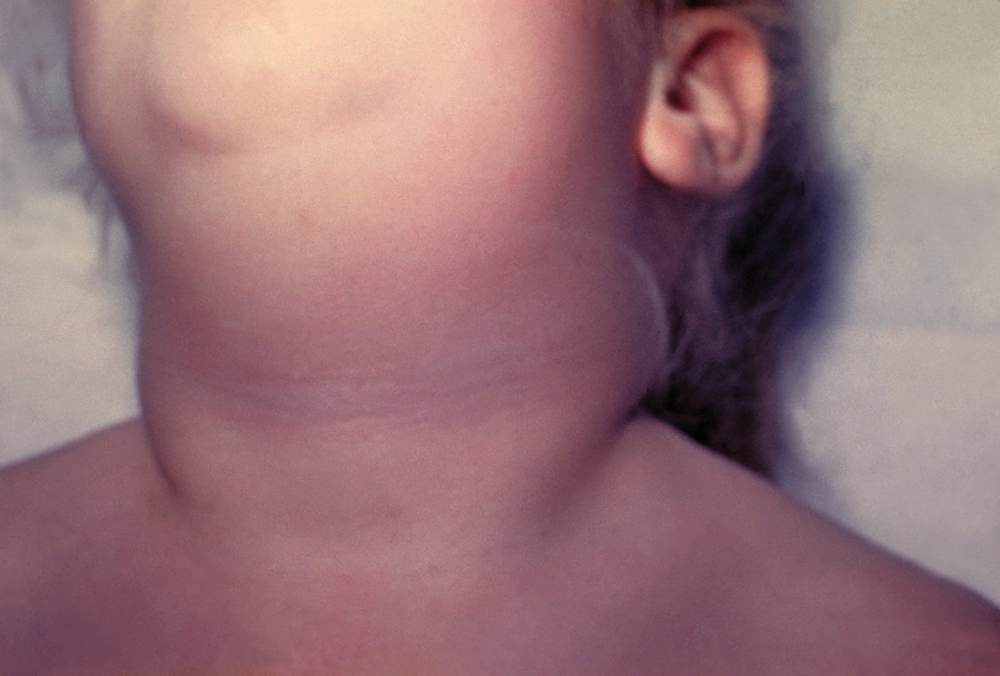

# Mumps

*Categories: Clinical knowledge > Pediatrics > Pediatric ENT and pulmonology > Mumps*

[Original Article Link](https://coursology-qbank.com/amboss/article/H40KkT)

---

## Summary

Mumps is a highly contagious viral infection that is transmitted via infectious respiratory particles and primarily affects children. Since the introduction of the <u>measles</u>, mumps, and <u>rubella</u> (<u>MMR</u>) <u>vaccine</u>, the <u>incidence</u> has declined in the US. Mumps characteristically manifests with <u>viral sialadenitis</u>, particularly <u>parotitis</u>, which typically progresses from unilateral to bilateral. <u>Prodromal</u> symptoms may include low-grade <u>fever</u>, <u>malaise</u>, and <u>headache</u>. <u>RT-PCR</u> confirms active infection. Mumps is usually a <u>self-limited</u> disease with a good prognosis. Management includes isolation, supportive therapy, and, for patients with <u>parotitis</u>, symptomatic management for <u>sialadenitis</u>. Complications include <u>mumps orchitis</u>, <u>aseptic meningitis</u>, <u>hearing loss</u>, and <u>pancreatitis</u>. <u>Immunization</u> with the <u>MMR vaccine</u> or <u>MMRV vaccine</u> is recommended for all children and for adults without evidence of <u>immunity</u>.

Mumps fact sheet

---

## Epidemiology

* <u>Incidence</u>: drastically declined in the US since the introduction of the <u>MMR vaccine</u> [[1]](https://coursology-qbank.com/amboss/article/4da3Jj)[[2]](https://coursology-qbank.com/amboss/article/cVYatL)

* Peak age: 5–14 years of age

* Sex: <u>♂</u> = <u>♀</u> for <u>parotitis</u> (; however, male individuals are three times more likely to have <u>CNS</u> complications) [[3]](https://coursology-qbank.com/amboss/article/jda_pj)

* <u>Risk factors</u>: See “<u>Risk factors for measles, mumps, and/or rubella</u>.”

Epidemiological data refers to the US, unless otherwise specified.

---

## Etiology

* <u>Pathogen</u>: <u>Mumps virus</u> from the <u>Paramyxoviridae</u> family

* Transmission [[4]](https://coursology-qbank.com/amboss/article/Rzblsw)

* Humans are the sole host and the <u>virus</u> is transmitted via airborne droplets.

* Direct contact with contaminated saliva or respiratory secretions

* Contaminated <u>fomites</u>

* <u>Infectivity</u> [[4]](https://coursology-qbank.com/amboss/article/Rzblsw)[[5]](https://coursology-qbank.com/amboss/article/kdamJj)

* Highly infectious

* Affected individuals are contagious ∼ 3 days before and up to 9 days after disease onset (when the <u>parotid gland</u> becomes swollen).

* <u>Incubation period</u>: 16–18 days [[6]](https://coursology-qbank.com/amboss/article/OdaIJj)

> [!TIP]
> Asymptomatic cases are also contagious.

---

## Pathophysiology

* <u>Nasopharyngeal</u> entry → replication of the <u>virus</u> in the <u>mucous membranes</u> and <u>lymph</u> nodes → <u>viremia</u> and secondary infection of the <u>salivary glands</u> (particularly the <u>parotid gland</u>) → further dissemination possible (lacrimal, <u>thyroid</u>, and <u>mammary glands</u>, <u>pancreas</u>, <u>testes</u>, <u>ovaries</u>, <u>CNS</u>)

---

## Clinical features

* <u>Prodrome</u>

* Duration: 3–4 days

* Symptoms: low-grade <u>fever</u> , <u>malaise</u>, <u>headache</u>

* Classic course: inflammation of the <u>salivary glands</u>, particularly parotitis ;  [[5]](https://coursology-qbank.com/amboss/article/kdamJj)[[8]](https://coursology-qbank.com/amboss/article/izbJsw)

* Duration of <u>parotitis</u>: at least 2 days (may persist > 10 days)

* Symptoms

* May initially present with local tenderness, <u>pain</u>, and earache

* Unilateral swelling of the <u>salivary gland</u> (<u>lateral</u> cheek and <u>jaw</u> area); During the course of disease, both <u>salivary glands</u> are usually swollen.

* Redness in the area of the <u>parotid duct</u>

* Possible protruding <u>ears</u>

* A flat, red <u>rash</u> that begins on the face and disseminates to the rest of the body can occur.

* Chronic courses are rare.

* Subclinical presentation [[6]](https://coursology-qbank.com/amboss/article/OdaIJj)

* Nonspecific or predominantly respiratory symptoms

* Asymptomatic (in 15–20% of cases) [[4]](https://coursology-qbank.com/amboss/article/Rzblsw)

Sialadenitis in mumps

Neck swelling in mumps

---

## Management

### <u>Infection control</u> [[9]](https://coursology-qbank.com/amboss/article/Lcdw1K0)[[10]](https://coursology-qbank.com/amboss/article/Bedza60)[[11]](https://coursology-qbank.com/amboss/article/4cd3cK0)

* Isolate patient and institute <u>standard precautions</u> and <u>droplet precautions</u>.

* Ensure that only <u>health care professionals</u> with evidence of mumps <u>immunity</u> provide direct care to the patient.

* Notify the local health department promptly of suspected mumps.

> [!WARNING]
> Mumps is a nationally <u>notifiable disease</u>; promptly report all suspected and confirmed cases to the local health department.

### Diagnostics [[9]](https://coursology-qbank.com/amboss/article/Lcdw1K0)[[10]](https://coursology-qbank.com/amboss/article/Bedza60)[[11]](https://coursology-qbank.com/amboss/article/4cd3cK0)

Obtain and interpret diagnostic studies in all individuals with <u>clinical features of mumps</u> or <u>complications of mumps</u>, in coordination with the health department.

#### Studies

* <u>RT-PCR</u> of buccal swab: Obtain in the following patients.  [[11]](https://coursology-qbank.com/amboss/article/4cd3cK0)

* <u>Parotitis</u> only and ≤ 10 days since symptom onset [[11]](https://coursology-qbank.com/amboss/article/4cd3cK0)

* <u>Complications of mumps</u>, regardless of symptom duration [[12]](https://coursology-qbank.com/amboss/article/uTdps60)

* <u>RT-PCR</u> of urine sample: Obtain in addition to buccal swab in patients who meet both the following criteria. [[11]](https://coursology-qbank.com/amboss/article/4cd3cK0)

* <u>Mumps orchitis</u> but no <u>parotitis</u>

* ≤ 10 days since symptom onset

* <u>Serology</u> of mumps-specific <u>IgM antibodies</u>: Obtain in addition to <u>RT-PCR</u> in patients with the following features.

* <u>Parotitis</u> only and > 3 days since symptom onset  [[11]](https://coursology-qbank.com/amboss/article/4cd3cK0)

* <u>Complications of mumps</u>, regardless of symptom duration [[12]](https://coursology-qbank.com/amboss/article/uTdps60)

> [!TIP]
> <u>RT-PCR</u> is preferred to confirm acute mumps. Sample should be collected as soon as possible and within 10 days of <u>rash</u> onset. [[11]](https://coursology-qbank.com/amboss/article/4cd3cK0)

#### Interpretation of results

* Only a positive <u>RT-PCR</u>;  or viral culture result is confirmatory of acute infection.  [[11]](https://coursology-qbank.com/amboss/article/4cd3cK0)

* Positive mumps-specific <u>IgM antibodies</u> support the diagnosis but cannot confirm it.

* Negative test results cannot rule out acute mumps infection in patients with <u>clinical features of mumps</u>.

> [!WARNING]
> A negative test result in a patient with typical <u>clinical features of mumps</u> should be presumed to be a <u>false negative</u>. [[9]](https://coursology-qbank.com/amboss/article/Lcdw1K0)

### Further management [[7]](https://coursology-qbank.com/amboss/article/ncd71K0)

* Mumps is usually <u>self-limited</u> with a good prognosis.

* Provide <u>supportive care</u>, e.g.:

* <u>Supportive care for pediatric fever</u>

* <u>Symptomatic management of salivary gland disorders</u> for patients with <u>parotitis</u> (e.g., <u>NSAIDs</u> for <u>pain</u> relief, oral hydration) [[13]](https://coursology-qbank.com/amboss/article/fAWkQL0)[[14]](https://coursology-qbank.com/amboss/article/AN1Rdh0)

* Instruct patients and exposed contacts on <u>isolation precautions</u>; see “<u>Exposure control for mumps</u>.”

---

## Differential diagnoses

* <u>Differential diagnosis of salivary gland swelling</u>

* Differential diagnosis of <u>orchitis</u>: <u>epididymitis</u>, <u>testicular torsion</u>

* Differential diagnosis of <u>aseptic meningitis</u> (See “<u>Meningitis</u>.”)

The differential diagnoses listed here are not exhaustive.

---

## Complications

### Mumps orchitis

* Definition: inflammation of the <u>testis</u>

* <u>Epidemiology</u>: most common <u>complication of mumps</u> in postpubertal male individuals (20–30% in unvaccinated postpubertal and 6–7% in vaccinated men and boys) [[6]](https://coursology-qbank.com/amboss/article/OdaIJj)[[15]](https://coursology-qbank.com/amboss/article/qQbCCt)

* Clinical features

* Sudden onset of <u>fever</u>, <u>nausea</u>, <u>vomiting</u>

* Swollen and tender affected <u>testicle</u>(s); primarily unilateral, although bilateral in ∼ 15% of cases

* Diagnostics: <u>clinical diagnosis</u>; manifests ≤ 7 days after <u>parotitis</u> develops [[16]](https://coursology-qbank.com/amboss/article/w_WhqL0)

* Treatment [[16]](https://coursology-qbank.com/amboss/article/w_WhqL0)

* Typically <u>self-limited</u>, resolving in ≤ 10 days

* Supportive therapy (e.g., bed rest, warm or cold compresses)

* Complications: : may lead to <u>atrophy</u> and, rarely, hypofertility

### Other complications [[4]](https://coursology-qbank.com/amboss/article/Rzblsw)

* Aseptic <u>meningitis</u>:  (1–10% of cases): predominantly mild course and usually no permanent sequelae

* <u>Encephalitis</u> (< 1% of cases)

* Reduced consciousness, <u>seizures</u>

* Neurological deficits: <u>cranial nerve</u> palsy, <u>hemiplegia</u>, <u>sensorineural hearing loss</u> (rare)

* <u>Acute pancreatitis</u> (< 1% of cases)

* <u>Vomiting</u>, <u>nausea</u>, upper abdominal <u>pain</u>

* ↑ <u>Lipase</u> in addition to ↑ <u>amylase</u>

* <u>Diabetes mellitus type I</u> (delayed complication)  [[6]](https://coursology-qbank.com/amboss/article/OdaIJj)

* <u>Hearing loss</u> (extremely rare)

> [!NOTE]
> The MEN of the <u>PAN</u>amanian ORCHestra know how to throw a good <u>PAR</u>ty: MENingitis, <u>PAN</u>creatitis, ORCHitis, and <u>PAR</u>otitis are the most important <u>complications of mumps</u>.

We list the most important complications. The selection is not exhaustive.

---

## Prevention

### <u>Vaccination</u> [[17]](https://coursology-qbank.com/amboss/article/pWWLm40)[[18]](https://coursology-qbank.com/amboss/article/Uj1b-g0)[[19]](https://coursology-qbank.com/amboss/article/LWWwN40)

Administer a live attenuated mumps <u>vaccine</u>;  (i.e., <u>MMR vaccine</u>, <u>MMRV vaccine</u>) according to the <u>ACIP immunization schedule</u>. See the following:

* Immunizations for <u>measles</u>, mumps, and <u>rubella</u>

* <u>ACIP immunization schedule</u>

* <u>Contraindications to live vaccines</u> (e.g., <u>pregnancy</u>, <u>immunocompromise</u>)

### Exposure control for mumps [[10]](https://coursology-qbank.com/amboss/article/Bedza60)[[20]](https://coursology-qbank.com/amboss/article/ETd8s60)

#### Suspected and confirmed cases

* Hospitalized patients: Initiate <u>standard precautions</u> and <u>droplet precautions</u>.

* Isolate for 5 days from the development of <u>parotitis</u>.

#### Close contacts

* All contacts without <u>evidence of immunity to mumps</u>

* Individuals without <u>contraindications to live vaccines</u>: Administer the <u>MMR vaccine</u> to protect against future exposures.   [[21]](https://coursology-qbank.com/amboss/article/tWXXMC)

* Recommend the following:

* Avoid large gatherings.

* Monitor for symptoms through day 25 after last exposure; if symptoms develop, isolate for 5 days. [[20]](https://coursology-qbank.com/amboss/article/ETd8s60)

* Refer to the health department for additional guidance regarding isolation.

* Health care workers [[22]](https://coursology-qbank.com/amboss/article/7Td4H60)

* With <u>evidence of immunity to mumps</u> or with documented 1 dose of <u>MMR</u> before exposure:

* May continue to work, but monitor for symptoms from day 10 after first exposure until day 25 after last exposure

* If only 1 dose previously, give second dose of <u>MMR vaccine</u> as soon as possible.

* No prior <u>MMR vaccine</u> doses: Exclude from work from day 10 after first exposure until day 25 after last exposure.

---