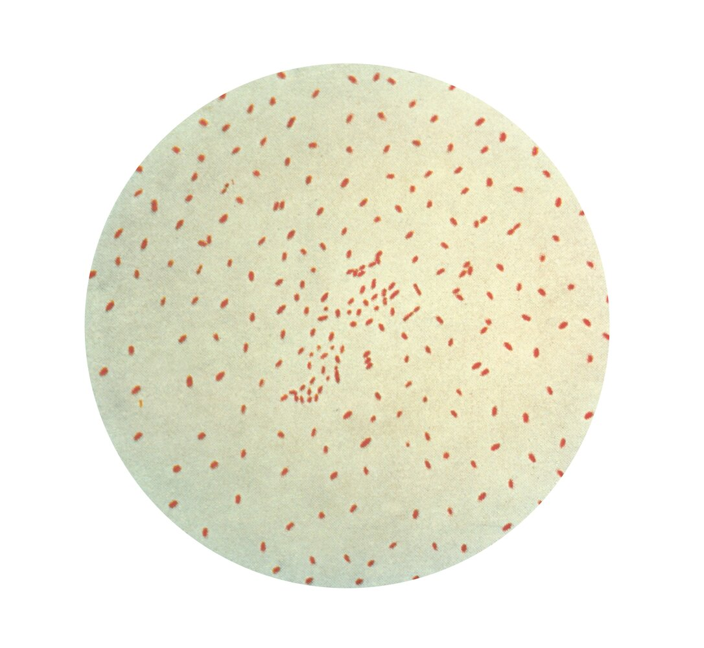
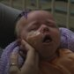

# Pertussis

*Categories: Clinical knowledge > Pediatrics > Pediatric ENT and pulmonology > Pertussis*

[Original Article Link](https://coursology-qbank.com/amboss/article/840OOT)

---

## Summary

Pertussis, or whooping <u>cough</u>, is a highly infectious disease of the respiratory tract caused by the gram-negative bacterium <u>Bordetella pertussis</u>. This disease spreads via <u>droplet transmission</u> (and to a lesser extent via <u>fomites</u>) and most commonly occurs in children. Typically, pertussis manifests in three stages, with the second and third stages characterized by intense <u>paroxysmal</u> <u>coughing</u> that is followed by a distinctive whooping sound on inhalation and, in some cases, <u>vomiting</u>. Young <u>infants</u> may not develop the typical <u>cough</u>, and often present with <u>apnea</u> and <u>cyanosis</u> instead. Patients who meet the <u>suspected case definition for pertussis</u> should be started on <u>antibiotic therapy for pertussis</u>, and confirmatory <u>laboratory studies</u> (usually <u>PCR</u> or culture) should be conducted. <u>Postexposure prophylaxis for pertussis</u> is recommended for all close contacts and high-risk individuals (e.g., <u>infants</u>) regardless of <u>immunization</u> status. <u>Pertussis immunization</u> is part of the <u>routine immunization schedule</u>; while <u>immunization</u> reduces the severity of illness, it does not provide full <u>immunity</u>.

---

## Epidemiology

* Pertussis is typically a childhood disease (particularly children aged < 1 year); however, older patients are increasingly affected.  [[1]](https://coursology-qbank.com/amboss/article/gSWF_k0)[[2]](https://coursology-qbank.com/amboss/article/xdaEHj)

* High rate of infections in <u>newborns</u>: The <u>Tdap vaccine</u> is recommended for pregnant individuals between 27 and 36 weeks' <u>gestation</u>.  [[1]](https://coursology-qbank.com/amboss/article/gSWF_k0)[[3]](https://coursology-qbank.com/amboss/article/9daNHj)

Epidemiological data refers to the US, unless otherwise specified.

---

## Etiology

* <u>Pathogen</u>: <u>Bordetella pertussis</u> is a <u>gram‑negative</u>, obligate aerobic coccobacillus.

* Transmission: <u>droplet transmission</u>, <u>fomite</u> transmission [[4]](https://coursology-qbank.com/amboss/article/pLWLAN0)[[5]](https://coursology-qbank.com/amboss/article/JLWsAN0)

* <u>Infectivity</u>

* Without <u>antibiotic</u> treatment: 4–6 weeks

* With treatment: ∼ 5 days

* Highly <u>virulent</u>

* <u>Incubation period</u>: on average 7–10 days (range 4–21 days)

Bordetella pertussis

References:[[1]](https://coursology-qbank.com/amboss/article/gSWF_k0)[[6]](https://coursology-qbank.com/amboss/article/Ef18LT0)

---

## Pathophysiology

* <u>Proliferation</u> of <u>Bordetella pertussis</u> on <u>ciliated epithelial cells</u> of the respiratory <u>mucosa</u> → production of <u>virulence factors</u> (e.g., <u>tracheal</u> cytotoxin) → <u>paralysis</u> of <u>respiratory epithelium</u> <u>cilia</u> and inflammation → secretion of inflammatory <u>exudate</u> into respiratory tract → compromise of small <u>airways</u> → <u>cough</u>, <u>pneumonia</u>, <u>cyanosis</u> [[7]](https://coursology-qbank.com/amboss/article/ydadsj)

* <u>Bordetella pertussis</u> produces pertussis toxin → <u>ADP-ribosylation</u> of the α subunit of <u>Gi protein</u> → inhibition of <u>Gi protein</u> → <u>adenylate cyclase</u> disinhibition → <u>cAMP</u> accumulation → impaired <u>cell signaling</u> pathways [[8]](https://coursology-qbank.com/amboss/article/k3YmiK)

* <u>Pertussis toxin</u> is responsible for most of the systemic manifestations associated with whooping <u>cough</u> (e.g., <u>hypoglycemia</u>, <u>lymphocytosis</u>, modulation of host <u>immune response</u>).

* Neither <u>vaccination</u> nor actual infection confers complete or lifelong <u>immunity</u>.

---

## Clinical features

Pertussis classically has three stages: catarrhal, <u>paroxysmal</u>, and convalescent. Symptoms may vary, however, based on age and <u>immunization</u> status; vaccinated individuals tending to have a milder illness without characteristic whooping. [[1]](https://coursology-qbank.com/amboss/article/gSWF_k0)[[9]](https://coursology-qbank.com/amboss/article/hSWczk0)

### Catarrhal stage (1–2 weeks) [[9]](https://coursology-qbank.com/amboss/article/hSWczk0)

* Nonspecific symptoms similar to an <u>upper respiratory infection</u>, e.g.:

* Mild <u>cough</u>

* Watery nasal discharge

* Rarely low-grade <u>fever</u>

* Possibly <u>conjunctivitis</u>

* Patients are highly infectious.

### <u>Paroxysmal stage</u> (2–6 weeks) [[9]](https://coursology-qbank.com/amboss/article/hSWczk0)

* Intense <u>paroxysmal</u> <u>coughing</u> (often occurring at night)

* Followed by a deep and loud inhalation or high-pitched whooping sound

* Accompanied by struggling for breath, gagging, and <u>tongue</u> protrusion

* Possibly accompanied by <u>cyanosis</u>

* Increases in frequency and severity throughout the stage

* Followed by the expulsion of phlegm or posttussive <u>vomiting</u> (risk of <u>dehydration</u>)

* Potential bleeding of the <u>conjunctiva</u>, <u>petechiae</u>, and venous congestion

* <u>Infants</u> (< 6 months) may present with: [[1]](https://coursology-qbank.com/amboss/article/gSWF_k0)[[6]](https://coursology-qbank.com/amboss/article/Ef18LT0)

* <u>Apneic episodes</u>

* <u>Paroxysmal</u> <u>coughing</u> but no characteristic whoop  [[1]](https://coursology-qbank.com/amboss/article/gSWF_k0)

### Convalescent stage (weeks to months) [[9]](https://coursology-qbank.com/amboss/article/hSWczk0)

* Progressive reduction of symptoms

* <u>Coughing</u> attacks may persist over several weeks before resolving.

* Patients have an increased susceptibility to respiratory infections.

> [!TIP]
> The typical pattern of <u>paroxysmal</u> <u>cough</u> with whooping manifests mainly in unvaccinated children. <u>Infants</u> < 6 months of age, vaccinated individuals, and adults may not whoop and may not follow the classic stages of pertussis. [[1]](https://coursology-qbank.com/amboss/article/gSWF_k0)[[9]](https://coursology-qbank.com/amboss/article/hSWczk0)

> [!NOTE]
> Catarrhal stage manifests with Coryza, while the Paroxysmal stage manifests with Posttussive <u>vomiting</u> and whooPing <u>cough</u>.

Infant girl with whooping cough

---

## Diagnosis

### Approach [[1]](https://coursology-qbank.com/amboss/article/gSWF_k0)[[10]](https://coursology-qbank.com/amboss/article/SSWy_k0)

* Perform confirmatory studies for any patient that meets the <u>suspected case definition for pertussis</u>.  [[9]](https://coursology-qbank.com/amboss/article/hSWczk0)

* The choice of diagnostic test depends on duration since symptom onset.  [[9]](https://coursology-qbank.com/amboss/article/hSWczk0)[[11]](https://coursology-qbank.com/amboss/article/GhWB2O0)[[12]](https://coursology-qbank.com/amboss/article/N3W-iO0)

* First 1–4 weeks: Obtain <u>PCR</u> ± culture.

* Between 4—12 weeks: Consider a serum sample for <u>serology</u>.  [[9]](https://coursology-qbank.com/amboss/article/hSWczk0)[[12]](https://coursology-qbank.com/amboss/article/N3W-iO0)

* For <u>infants</u> < 3 months, consider a <u>CBC</u>.

* <u>Lymphocyte</u>-predominant <u>leukocytosis</u> is common in <u>infants</u> and young children. [[6]](https://coursology-qbank.com/amboss/article/Ef18LT0)

* An absolute <u>lymphocyte</u> count of > 20,000/μL is a classic diagnostic finding and suggests a poor prognosis. [[1]](https://coursology-qbank.com/amboss/article/gSWF_k0)[[9]](https://coursology-qbank.com/amboss/article/hSWczk0)

### Suspected case definition for pertussis [[11]](https://coursology-qbank.com/amboss/article/GhWB2O0)[[12]](https://coursology-qbank.com/amboss/article/N3W-iO0)[[13]](https://coursology-qbank.com/amboss/article/IYcYqa0)

<u>Cough</u> is present for any duration (with a low threshold for suspicion in <u>infants</u>), with ≥ 1 of the following:  [[9]](https://coursology-qbank.com/amboss/article/hSWczk0)[[13]](https://coursology-qbank.com/amboss/article/IYcYqa0)

* <u>Paroxysmal</u> <u>coughing</u>

* Whooping on inspiration

* Posttussive <u>vomiting</u>

* <u>Apnea</u>  [[11]](https://coursology-qbank.com/amboss/article/GhWB2O0)[[12]](https://coursology-qbank.com/amboss/article/N3W-iO0)

* Known contact with confirmed case

* Living in an area with a pertussis <u>outbreak</u>

> [!TIP]
> The presence of <u>fever</u> suggests an alternative diagnosis (see “<u>Differential diagnoses of pertussis</u>”). [[9]](https://coursology-qbank.com/amboss/article/hSWczk0)[[13]](https://coursology-qbank.com/amboss/article/IYcYqa0)

### Confirmatory studies

<u>PCR</u> and/or cultures should be used for patients who present ≤ 4 weeks since <u>cough</u> onset. <u>Serology</u> should be used for patients who present > 4 weeks after developing symptoms.

#### <u>PCR</u> [[1]](https://coursology-qbank.com/amboss/article/gSWF_k0)[[6]](https://coursology-qbank.com/amboss/article/Ef18LT0)[[11]](https://coursology-qbank.com/amboss/article/GhWB2O0)

* Preferred test [[9]](https://coursology-qbank.com/amboss/article/hSWczk0)

* High <u>sensitivity</u>

* Rapid results

* Unaffected by <u>antibiotic therapy</u> or previous <u>vaccination</u>  [[1]](https://coursology-qbank.com/amboss/article/gSWF_k0)

* Specimen collection

* Preferred: <u>nasopharyngeal swab</u>

* Alternative: saline <u>nasopharyngeal</u> <u>aspirate</u>

#### <u>Bacterial culture</u> [[1]](https://coursology-qbank.com/amboss/article/gSWF_k0)[[6]](https://coursology-qbank.com/amboss/article/Ef18LT0)[[11]](https://coursology-qbank.com/amboss/article/GhWB2O0)

* <u>Gold standard</u> [[9]](https://coursology-qbank.com/amboss/article/hSWczk0)

* 100% <u>specificity</u>

* Use is limited by:

* Long growth time (7–10 days)

* Low <u>sensitivity</u>, especially in patients who are taking <u>antibiotics</u> or have been immunized  [[1]](https://coursology-qbank.com/amboss/article/gSWF_k0)

* Indications [[9]](https://coursology-qbank.com/amboss/article/hSWczk0)[[14]](https://coursology-qbank.com/amboss/article/agWQFk0)

* Alternative when <u>PCR</u> is not available

* In addition to <u>PCR</u> for strain identification

* Specimen collection method

* Preferred: <u>nasopharyngeal swab</u>

* Alternative: saline <u>nasopharyngeal</u> <u>aspirate</u>

#### Pertussis <u>serology</u> [[6]](https://coursology-qbank.com/amboss/article/Ef18LT0)[[9]](https://coursology-qbank.com/amboss/article/hSWczk0)[[11]](https://coursology-qbank.com/amboss/article/GhWB2O0)

* Used for patients who meet all the following criteria:

* 4–12 weeks since <u>cough</u> onset  [[1]](https://coursology-qbank.com/amboss/article/gSWF_k0)[[6]](https://coursology-qbank.com/amboss/article/Ef18LT0)

* Age ≥ 6 months  [[9]](https://coursology-qbank.com/amboss/article/hSWczk0)

* ≥ 1 year since the last <u>vaccination</u> dose

* Findings: ↑ <u>IgG antibodies</u> to <u>pertussis toxin</u>

> [!TIP]
> The <u>CDC</u> only accepts positive culture or <u>PCR</u> for <u>disease reporting</u>; <u>serology</u> is, however, suggested for use in <u>outbreak</u> settings. [[6]](https://coursology-qbank.com/amboss/article/Ef18LT0)[[12]](https://coursology-qbank.com/amboss/article/N3W-iO0)

> [!WARNING]
> <u>Direct fluorescent antibody testing</u> and <u>blood cultures</u> are not recommended because of low <u>specificity</u> and <u>sensitivity</u>. [[6]](https://coursology-qbank.com/amboss/article/Ef18LT0)[[11]](https://coursology-qbank.com/amboss/article/GhWB2O0)[[15]](https://coursology-qbank.com/amboss/article/l3WviO0)

---

## Differential diagnoses

* <u>Bordetella</u> parapertussis infection

* <u>Respiratory syncytial virus</u> <u>bronchiolitis</u>

* <u>Pneumonia</u>, particularly due to <u>Chlamydia trachomatis</u> or <u>Mycoplasma pneumoniae</u>

* <u>Croup</u> (<u>laryngotracheobronchitis</u>)

* <u>Foreign body aspiration</u>

The differential diagnoses listed here are not exhaustive.

---

## Treatment

### Approach [[6]](https://coursology-qbank.com/amboss/article/Ef18LT0)

* Start <u>antibiotic therapy</u> in <u>suspected pertussis</u> without waiting for diagnostic confirmation.  [[6]](https://coursology-qbank.com/amboss/article/Ef18LT0)[[9]](https://coursology-qbank.com/amboss/article/hSWczk0)[[10]](https://coursology-qbank.com/amboss/article/SSWy_k0)

* Assess patients for <u>admission criteria for pertussis</u> and admit if present.

* Consider the need for <u>ICU</u>/<u>PICU</u> consult.

* <u>Infants</u> with pertussis should be admitted to a facility able to escalate care.  [[6]](https://coursology-qbank.com/amboss/article/Ef18LT0)[[16]](https://coursology-qbank.com/amboss/article/_PW5hl0)

* Provide <u>supportive care</u>, e.g.: [[17]](https://coursology-qbank.com/amboss/article/AN1Rdh0)

* <u>Respiratory support</u>  [[16]](https://coursology-qbank.com/amboss/article/_PW5hl0)

* Frequent suctioning

* <u>Management of dehydration and hypovolemia</u>

* <u>Nutritional support</u>

* Initiate measures to <u>prevent onward transmission of pertussis</u>.

* After treatment, offer the <u>acellular pertussis vaccine</u> to stable unvaccinated patients. [[1]](https://coursology-qbank.com/amboss/article/gSWF_k0)

> [!WARNING]
> <u>Symptomatic treatment of cough</u> (e.g., with <u>corticosteroids</u>, <u>antihistamines</u>, <u>albuterol</u>) is not recommended, as there is no evidence symptomatic treatments reduce <u>cough</u> or duration of hospitalization. [[9]](https://coursology-qbank.com/amboss/article/hSWczk0)[[18]](https://coursology-qbank.com/amboss/article/63WjjO0)

> [!TIP]
> Pertussis is a nationally <u>notifiable disease</u>. [[9]](https://coursology-qbank.com/amboss/article/hSWczk0)

### Admission criteria for pertussis

* Admit patients with features of severe disease, e.g.: [[6]](https://coursology-qbank.com/amboss/article/Ef18LT0)[[17]](https://coursology-qbank.com/amboss/article/AN1Rdh0)

* Patients of any age with:

* <u>Pneumonia</u>

* <u>Signs of respiratory failure</u> (i.e., <u>cyanosis</u>, <u>apnea</u>)

* <u>CNS</u> complications (e.g., <u>seizure</u>)

* In <u>infants</u> with:

* <u>Apnea</u>

* Difficulty feeding

* Consider admission for patients with risk factors for severe pertussis, e.g.: [[6]](https://coursology-qbank.com/amboss/article/Ef18LT0)[[19]](https://coursology-qbank.com/amboss/article/8PWOgl0)[[20]](https://coursology-qbank.com/amboss/article/n3W7QO0)

* Individuals of any age with a history of:

* <u>Immunocompromise</u>

* Pulmonary disease (e.g., <u>COPD</u>, <u>asthma</u>)

* Neurologic disorders

* Genetic disease

* <u>Infants</u> with any of the following characteristics:

* Age < 4 months

* <u>Prematurity</u>

* <u>Low birth weight</u>

* Mother who did not receive a <u>pertussis vaccine</u> during <u>pregnancy</u>

> [!TIP]
> <u>Infants</u> < 6 months are at the highest risk for <u>morbidity</u> and mortality, especially those with a history of <u>preterm delivery</u> or inadequate maternal <u>immunization</u>. [[6]](https://coursology-qbank.com/amboss/article/Ef18LT0)[[20]](https://coursology-qbank.com/amboss/article/n3W7QO0)

### Antibiotic therapy for pertussis [[1]](https://coursology-qbank.com/amboss/article/gSWF_k0)[[6]](https://coursology-qbank.com/amboss/article/Ef18LT0)[[9]](https://coursology-qbank.com/amboss/article/hSWczk0)

* First-line: <u>macrolides</u>

* Preferred: <u>azithromycin</u> (<u>off-label</u>) DOSAGE  [[6]](https://coursology-qbank.com/amboss/article/Ef18LT0)[[9]](https://coursology-qbank.com/amboss/article/hSWczk0)

* Alternative

* <u>Erythromycin</u> DOSAGE [[6]](https://coursology-qbank.com/amboss/article/Ef18LT0)

* <u>Clarithromycin</u> DOSAGE [[6]](https://coursology-qbank.com/amboss/article/Ef18LT0)

* <u>Allergy</u>/intolerance to <u>macrolides</u>: Consider <u>trimethoprim/sulfamethoxazole</u>:  (<u>off-label</u>).DOSAGE [[6]](https://coursology-qbank.com/amboss/article/Ef18LT0)

> [!TIP]
> <u>Antibiotic therapy</u> within 3 weeks of symptom onset decreases transmission of pertussis but may not improve the duration or severity of symptoms, especially if started at a later clinical stage. [[1]](https://coursology-qbank.com/amboss/article/gSWF_k0)[[7]](https://coursology-qbank.com/amboss/article/ydadsj)[[11]](https://coursology-qbank.com/amboss/article/GhWB2O0)

> [!WARNING]
> Monitor <u>infants</u> < 6 weeks of age who are being treated with <u>azithromycin</u> or <u>erythromycin</u> for <u>hypertrophic pyloric stenosis</u>. [[6]](https://coursology-qbank.com/amboss/article/Ef18LT0)

---

## Complications

* Infection: <u>otitis media</u>

* Respiratory

* Bordetella pertussis pneumonia

* <u>Hemoptysis</u>, <u>atelectasis</u>, <u>pneumothorax</u>

* Cardiac: <u>pulmonary hypertension</u> [[6]](https://coursology-qbank.com/amboss/article/Ef18LT0)

* Neurologic: <u>seizures</u>, <u>encephalopathy</u> with possible permanent damage

* <u>Sudden infant death</u> [[6]](https://coursology-qbank.com/amboss/article/Ef18LT0)

References:[[21]](https://coursology-qbank.com/amboss/article/XVa9Gj)[[22]](https://coursology-qbank.com/amboss/article/1Va2tj)[[23]](https://coursology-qbank.com/amboss/article/uPWpgl0)

We list the most important complications. The selection is not exhaustive.

---

## Prevention

### Primary <u>prevention of pertussis</u> [[24]](https://coursology-qbank.com/amboss/article/LWWwN40)[[25]](https://coursology-qbank.com/amboss/article/6WWjm40)[[26]](https://coursology-qbank.com/amboss/article/pWWLm40)

* <u>Vaccine</u>: the acellular pertussis vaccine is available as a <u>combination vaccine</u> that also contains the <u>diphtheria vaccine</u> and <u>tetanus vaccine</u>.

* Choice of <u>vaccine</u> depends on age:   [[1]](https://coursology-qbank.com/amboss/article/gSWF_k0)

* Children < 7 years of age: <u>DTaP</u> <u>vaccine</u>

* Children ≥ 7 years of age and adults: <u>Tdap vaccine</u>   [[1]](https://coursology-qbank.com/amboss/article/gSWF_k0)

* Primary course

* Recommended at 2, 4, 6, and 15–18 months and at 4–6 years

* Adults who were not vaccinated as children should receive a one-time dose of <u>Tdap</u>.

* See “<u>ACIP immunization schedule</u>” for details on routine and catch-up schedules.

* Booster

* All individuals aged 11–12 years [[6]](https://coursology-qbank.com/amboss/article/Ef18LT0)

* During each <u>pregnancy</u>: one-time dose, preferably at 27–36 weeks of <u>gestation</u>

* Adults who receive a routine <u>tetanus</u> booster with <u>Tdap</u> will also be boosted against pertussis.   [[9]](https://coursology-qbank.com/amboss/article/hSWczk0)[[26]](https://coursology-qbank.com/amboss/article/pWWLm40)

* Contraindications [[24]](https://coursology-qbank.com/amboss/article/LWWwN40)[[26]](https://coursology-qbank.com/amboss/article/pWWLm40)

* <u>Absolute contraindications</u>: <u>anaphylactic</u> reaction to or <u>encephalopathy</u> from previous <u>pertussis vaccination</u>

* <u>Relative contraindications</u> include:

* Moderate to severe acute illness

* Uncontrolled or evolving neurological disorders (e.g., <u>Guillain-Barré syndrome</u> or <u>seizures</u>)

* <u>Arthus reaction</u>

> [!TIP]
> <u>Pertussis vaccination</u> helps reduce severity, but infection can still occur because the <u>immunity</u> from <u>vaccination</u> (as well as infection) is short-lived and there has been a rise in <u>vaccine antigen</u>-deficient strains. [[9]](https://coursology-qbank.com/amboss/article/hSWczk0)

> [!TIP]
> Ensure all close contacts (e.g., family members, caregivers) of <u>infants</u> have received all the recommended age-appropriate pertussis <u>vaccines</u> (<u>DTaP</u>, <u>Tdap</u>). [[1]](https://coursology-qbank.com/amboss/article/gSWF_k0)[[6]](https://coursology-qbank.com/amboss/article/Ef18LT0)[[9]](https://coursology-qbank.com/amboss/article/hSWczk0)

### Prevention of onward transmission of pertussis

#### Approach [[6]](https://coursology-qbank.com/amboss/article/Ef18LT0)[[11]](https://coursology-qbank.com/amboss/article/GhWB2O0)

* Use <u>droplet precautions</u> when evaluating patients.

* Advise isolation precautions for pertussis for suspected or confirmed cases.

* The duration of <u>isolation precautions</u> varies based on treatment status: [[1]](https://coursology-qbank.com/amboss/article/gSWF_k0)

* Treated patients: until 5 days of <u>antibiotic therapy</u> have been completed

* Untreated patients: > 3 weeks since <u>cough</u> onset

* For patients in the community: [[6]](https://coursology-qbank.com/amboss/article/Ef18LT0)

* Advise avoiding contact with high-risk individuals (i.e., pregnant women, <u>infants</u>, and children).

* Children who attend daycare/school and staff in childcare and healthcare settings should remain at home.

* For hospitalized patients: Place the patient in a side room with <u>droplet precautions</u>.  [[11]](https://coursology-qbank.com/amboss/article/GhWB2O0)

* Perform <u>contact tracing</u> to determine who should be offered <u>postexposure prophylaxis for pertussis</u>.

* Pertussis is a <u>notifiable disease</u>; ensure the state health department has been contacted.

#### Postexposure prophylaxis for pertussis [[6]](https://coursology-qbank.com/amboss/article/Ef18LT0)[[10]](https://coursology-qbank.com/amboss/article/SSWy_k0)

* Indications [[11]](https://coursology-qbank.com/amboss/article/GhWB2O0)

* All close contacts of an individual with pertussis, regardless of age and <u>vaccination</u> status  [[1]](https://coursology-qbank.com/amboss/article/gSWF_k0)

* High-risk individuals with possible exposure, e.g.: 

* <u>Infants</u>

* Pregnant women (<u>third trimester</u>)

* Any individual who cares for <u>infants</u> and/or pregnant women (e.g., health care or daycare workers)

* <u>Immunocompromised individuals</u> [[9]](https://coursology-qbank.com/amboss/article/hSWczk0)

* Individuals with chronic comorbidities (e.g., respiratory conditions) [[9]](https://coursology-qbank.com/amboss/article/hSWczk0)

* Prophylactic measures

* Administer <u>antibiotic therapy for pertussis</u> within 21 days of contact exposure. [[9]](https://coursology-qbank.com/amboss/article/hSWczk0)

* Advise <u>isolation precautions for pertussis</u> until 5 days of <u>antibiotic therapy</u> has been completed.   [[27]](https://coursology-qbank.com/amboss/article/wPWhSl0)

* Ensure all asymptomatic individuals are up-to-date with <u>acellular pertussis vaccine</u> according to the <u>ACIP immunization schedule</u>.   [[1]](https://coursology-qbank.com/amboss/article/gSWF_k0)[[11]](https://coursology-qbank.com/amboss/article/GhWB2O0)

---